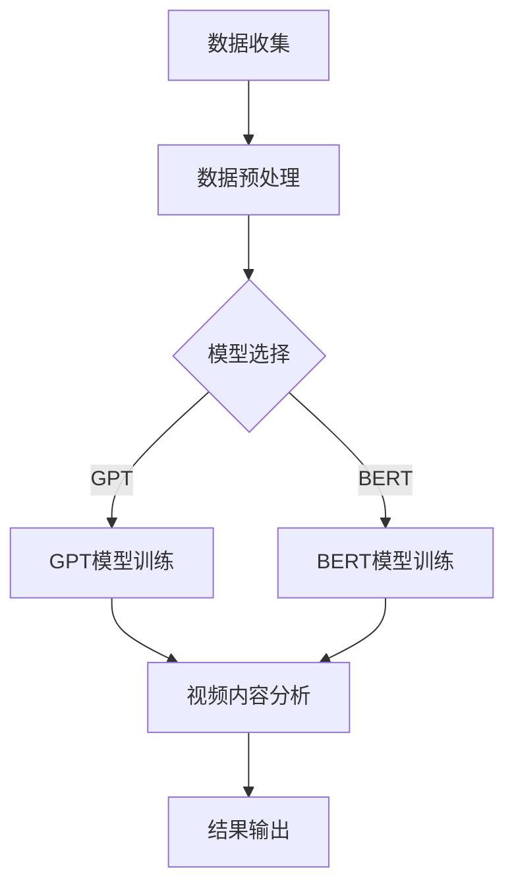

                 

### 文章标题

### AI 大模型在智能视频内容分析中的商业价值

#### 关键词：
- AI 大模型
- 智能视频内容分析
- 商业价值
- 视频内容理解
- 视频情感分析
- 视频分类与推荐
- 视频内容审核

#### 摘要：
本文将深入探讨 AI 大模型在智能视频内容分析中的商业价值。通过分析 AI 大模型的核心概念和原理，以及其在视频内容理解、情感分析、分类与推荐、内容审核等领域的应用，本文旨在揭示 AI 大模型为各行业带来的潜在商业机会和挑战。此外，本文还将推荐相关学习资源、开发工具和论文著作，为读者提供深入了解和实践 AI 大模型在智能视频内容分析领域的指导。

---

### 1. 背景介绍

随着互联网和视频技术的快速发展，视频内容已成为信息传播和娱乐消费的主要形式之一。然而，海量的视频内容给视频内容分析带来了巨大的挑战。传统的视频内容分析技术往往依赖于手工特征提取和规则匹配，在处理复杂场景和长视频时表现不佳。为了解决这些问题，人工智能（AI）技术，特别是深度学习和大型预训练模型（如 GPT、BERT 等）逐渐成为视频内容分析的重要工具。

AI 大模型是指通过大量数据训练得到的大型神经网络模型，具有极高的参数数量和计算能力。这些模型在图像识别、自然语言处理、语音识别等领域取得了显著的成果。近年来，随着深度学习技术的不断发展和计算资源的提升，AI 大模型在视频内容分析中也展现出了巨大的潜力。

智能视频内容分析是指利用 AI 技术对视频内容进行自动理解、分类、推荐、审核等操作，从而实现视频内容的价值挖掘和优化。随着 5G、边缘计算等技术的推广，视频内容分析的应用场景越来越广泛，涵盖了社交媒体、影视娱乐、教育、安防、医疗等多个领域。

在商业价值方面，智能视频内容分析具有以下几个显著特点：

1. **提高内容审核效率**：通过 AI 大模型对视频内容进行实时分析和审核，可以有效减少人工审核的工作量，提高审核效率，降低运营成本。

2. **精准推荐视频内容**：基于用户行为和兴趣，AI 大模型可以推荐个性化、高质量的视频内容，提高用户满意度和留存率。

3. **挖掘潜在商业机会**：通过分析视频内容，企业可以发现新的市场和商机，如广告投放、内容付费等。

4. **提升视频内容质量**：AI 大模型可以识别和推荐高质量的视频内容，帮助平台和创作者提高内容品质。

5. **增强信息安全保障**：AI 大模型可以识别和过滤不良视频内容，保障用户信息安全。

### 2. 核心概念与联系

#### 2.1. AI 大模型

AI 大模型是指通过大量数据训练得到的大型神经网络模型，通常具有数百万甚至数十亿个参数。这些模型通过深度学习算法，自动从数据中学习特征和规律，从而实现复杂任务的自动化处理。常见的 AI 大模型包括 GPT、BERT、ResNet、Inception 等。

#### 2.2. 深度学习

深度学习是人工智能的一种重要分支，通过模拟人脑的神经网络结构，实现数据的自动学习和特征提取。深度学习技术包括卷积神经网络（CNN）、循环神经网络（RNN）、长短时记忆网络（LSTM）等。深度学习在图像识别、语音识别、自然语言处理等领域取得了显著成果。

#### 2.3. 视频内容分析

视频内容分析是指利用 AI 技术对视频内容进行自动理解、分类、推荐、审核等操作。视频内容分析包括视频识别、视频分类、视频情感分析、视频内容审核等任务。

#### 2.4. Mermaid 流程图

以下是一个简单的 Mermaid 流程图，展示了 AI 大模型在智能视频内容分析中的流程：



### 3. 核心算法原理 & 具体操作步骤

#### 3.1. 数据收集与预处理

数据收集是视频内容分析的基础。首先，需要从各种渠道收集大量的视频数据，包括社交媒体、影视网站、教育平台等。然后，对收集到的视频数据进行预处理，包括数据清洗、标注、剪辑等操作，以确保数据的质量和一致性。

#### 3.2. 模型选择与训练

根据视频内容分析的任务需求，选择合适的 AI 大模型进行训练。常见的模型包括 GPT、BERT、ResNet 等。以 GPT 模型为例，具体操作步骤如下：

1. **数据预处理**：将视频数据转换为文本格式，以便输入到 GPT 模型中。可以使用语音识别技术将视频中的语音转换为文本，或者使用 OCR 技术识别视频中的文字。

2. **模型配置**：配置 GPT 模型的参数，包括层�数、隐藏单元数、学习率等。可以使用预训练的 GPT 模型，或者从头开始训练。

3. **模型训练**：使用训练数据对 GPT 模型进行训练，通过反向传播算法不断调整模型参数，使模型在任务上达到最佳性能。

4. **模型评估**：使用验证集对训练好的模型进行评估，调整模型参数，优化模型性能。

#### 3.3. 视频内容分析

训练好的 AI 大模型可以用于视频内容分析。具体操作步骤如下：

1. **视频预处理**：对输入的视频数据进行预处理，包括剪辑、缩放、灰度化等操作，使其适应模型输入要求。

2. **特征提取**：使用训练好的 AI 大模型对视频数据进行特征提取，提取出视频内容的语义特征。

3. **分析任务**：根据视频内容分析的任务需求，对提取的特征进行分类、推荐、审核等操作。

4. **结果输出**：输出分析结果，如分类标签、推荐视频、审核结果等。

#### 3.4. 数学模型和公式

在视频内容分析中，常用的数学模型和公式包括：

1. **卷积神经网络（CNN）**

   卷积神经网络是一种用于图像识别和处理的深度学习模型。其基本结构包括卷积层、池化层和全连接层。以下是一个简单的 CNN 模型公式：

   $$ 
   \begin{cases}
   f_{\text{conv}}(x) = \text{ReLU}(\text{conv}_k(x)) \\
   f_{\text{pool}}(x) = \text{max}(\text{pool}_k(x))
   \end{cases}
   $$
   
   其中，$f_{\text{conv}}(x)$ 表示卷积操作，$f_{\text{pool}}(x)$ 表示池化操作，$\text{ReLU}$ 表示 ReLU 激活函数。

2. **循环神经网络（RNN）**

   循环神经网络是一种用于序列数据处理的深度学习模型。其基本结构包括输入层、隐藏层和输出层。以下是一个简单的 RNN 模型公式：

   $$
   h_t = \text{ReLU}(W_h \cdot h_{t-1} + W_x \cdot x_t + b)
   $$
   
   其中，$h_t$ 表示隐藏层输出，$W_h$、$W_x$ 和 $b$ 分别表示权重和偏置。

3. **长短时记忆网络（LSTM）**

   长短时记忆网络是一种改进的 RNN，能够更好地处理长序列数据。其基本结构包括输入门、遗忘门和输出门。以下是一个简单的 LSTM 模型公式：

   $$
   \begin{cases}
   i_t = \sigma(W_{i} \cdot [h_{t-1}, x_t] + b_i) \\
   f_t = \sigma(W_{f} \cdot [h_{t-1}, x_t] + b_f) \\
   o_t = \sigma(W_{o} \cdot [h_{t-1}, x_t] + b_o) \\
   C_t = f_t \odot C_{t-1} + i_t \odot \text{tanh}(W_c \cdot [h_{t-1}, x_t] + b_c) \\
   h_t = o_t \odot \text{tanh}(C_t)
   \end{cases}
   $$
   
   其中，$i_t$、$f_t$ 和 $o_t$ 分别表示输入门、遗忘门和输出门，$C_t$ 表示细胞状态，$h_t$ 表示隐藏层输出。

4. **生成对抗网络（GAN）**

   生成对抗网络是一种用于生成数据的深度学习模型。其基本结构包括生成器和判别器。以下是一个简单的 GAN 模型公式：

   $$
   \begin{cases}
   G(z) = \mu(z; \theta_G) \\
   D(x) = \sigma(D(x; \theta_D) \\
   \end{cases}
   $$
   
   其中，$G(z)$ 表示生成器，$D(x)$ 表示判别器，$z$ 表示噪声向量，$x$ 表示真实数据。

#### 3.5. 项目实践：代码实例和详细解释说明

以下是一个简单的 Python 代码实例，展示了如何使用 GPT 模型对视频内容进行情感分析：

```python
import torch
import torch.nn as nn
import torch.optim as optim
from torchtext.data import Field, BucketIterator
from torchtext.datasets import IMDB

# 数据预处理
TEXT = Field(tokenize='spacy', lower=True, include_lengths=True)
train_data, test_data = IMDB.splits(TEXT, TEXT)

# 模型配置
class GPT(nn.Module):
    def __init__(self, vocab_size, embed_size, hidden_size, num_layers, dropout):
        super().__init__()
        self.embedding = nn.Embedding(vocab_size, embed_size)
        self.rnn = nn.LSTM(embed_size, hidden_size, num_layers=num_layers, dropout=dropout)
        self.fc = nn.Linear(hidden_size, 1)

    def forward(self, text, lengths):
        embedded = self.embedding(text)
        packed = nn.utils.rnn.pack_padded_sequence(embedded, lengths, batch_first=True)
        packed_output, (hidden, cell) = self.rnn(packed)
        hidden = hidden[-1, :, :]
        output = self.fc(hidden)
        return output

# 模型训练
model = GPT(len(TEXT.vocab), 100, 200, 2, 0.5)
optimizer = optim.Adam(model.parameters(), lr=0.001)
criterion = nn.BCEWithLogitsLoss()

for epoch in range(10):
    for batch in train_data:
        optimizer.zero_grad()
        predictions = model(batch.text, batch.text_len).squeeze(1)
        loss = criterion(predictions, batch.label)
        loss.backward()
        optimizer.step()
    print(f'Epoch: {epoch+1}, Loss: {loss.item()}')

# 模型评估
with torch.no_grad():
    correct = 0
    total = 0
    for batch in test_data:
        predictions = model(batch.text, batch.text_len).squeeze(1)
        _, predicted = torch.max(predictions.data, 1)
        total += batch.label.size(0)
        correct += (predicted == batch.label).sum().item()
    print(f'Accuracy: {100 * correct / total}%')
```

### 4. 实际应用场景

AI 大模型在智能视频内容分析领域具有广泛的应用场景，以下列举几个典型的应用案例：

#### 4.1. 社交媒体内容审核

社交媒体平台需要实时审核用户上传的视频内容，以确保平台内容的合规性和安全性。AI 大模型可以用于检测和过滤不良视频内容，如色情、暴力、仇恨等。通过训练大规模的图像识别和自然语言处理模型，平台可以自动识别视频中的敏感内容，并在需要时进行预警或删除。

#### 4.2. 视频推荐系统

视频推荐系统旨在为用户推荐他们可能感兴趣的视频内容。通过分析用户的观看历史、点赞、评论等行为数据，AI 大模型可以预测用户的兴趣偏好，并推荐相应的视频。这种方法不仅可以提高用户满意度，还可以为平台带来更多的广告收入和用户粘性。

#### 4.3. 视频内容理解与搜索

视频内容理解与搜索技术使得用户可以更方便地找到他们需要的视频内容。通过将视频中的音频、文本、图像等多模态信息进行整合分析，AI 大模型可以帮助平台实现视频内容的关键词提取、语义搜索等功能，从而提高视频内容的可搜索性和用户体验。

#### 4.4. 视频内容审核与监管

视频内容审核与监管是政府和监管机构的重要职责。AI 大模型可以用于自动识别和过滤违规视频，如虚假信息、谣言、歧视等内容，从而保障社会公共秩序和信息安全。

### 5. 工具和资源推荐

#### 5.1. 学习资源推荐

1. **书籍**：

   - 《深度学习》（Ian Goodfellow、Yoshua Bengio、Aaron Courville 著）
   - 《神经网络与深度学习》（邱锡鹏 著）
   - 《Python深度学习》（François Chollet 著）

2. **论文**：

   - “A Theoretically Grounded Application of Dropout in Recurrent Neural Networks”（Yarin Gal 和 Zoubin Ghahramani）
   - “Generative Adversarial Networks”（Ian Goodfellow 等）
   - “An Empirical Evaluation of Generic Convolutional and Recurrent Networks for Sequence Modeling”（Yoon Kim）

3. **博客和网站**：

   - [深度学习教程](http://www.deeplearning.net/)
   - [TensorFlow 官方文档](https://www.tensorflow.org/)
   - [PyTorch 官方文档](https://pytorch.org/)

#### 5.2. 开发工具框架推荐

1. **深度学习框架**：

   - TensorFlow
   - PyTorch
   - Keras
   - Theano

2. **图像处理库**：

   - OpenCV
   - PIL
   - Scikit-image

3. **自然语言处理库**：

   - NLTK
   - SpaCy
   - TextBlob

#### 5.3. 相关论文著作推荐

1. **《深度学习基础教程：从线性回归到深度学习》**（ 作者：李航）

2. **《深度学习：技术与应用》**（ 作者：吴恩达）

3. **《深度学习入门：基于Python的理论与实现》**（ 作者：斋藤康毅）

### 6. 总结：未来发展趋势与挑战

随着 AI 大模型的不断发展和视频技术的创新，智能视频内容分析将在未来发挥越来越重要的作用。以下是几个发展趋势和挑战：

#### 6.1. 发展趋势

1. **模型规模和计算能力不断提升**：随着硬件和算法的进步，AI 大模型的规模和计算能力将不断提升，为智能视频内容分析带来更高的精度和效率。

2. **多模态信息融合**：未来智能视频内容分析将逐渐融合音频、文本、图像等多模态信息，实现更全面、准确的内容理解。

3. **实时性和低延迟**：随着 5G 和边缘计算技术的发展，智能视频内容分析的实时性和低延迟将得到显著提升，为更多应用场景提供支持。

4. **隐私保护和数据安全**：在处理大量用户数据时，隐私保护和数据安全将是一个重要挑战，需要加强数据加密和隐私保护技术。

#### 6.2. 挑战

1. **数据质量和标注问题**：智能视频内容分析依赖于大量高质量的数据和准确的标注，但在实际应用中，数据质量和标注问题往往难以保证。

2. **计算资源和存储成本**：AI 大模型训练和推理需要大量的计算资源和存储空间，这对企业来说是一个巨大的挑战。

3. **算法公平性和透明性**：AI 大模型在视频内容分析中的应用需要确保算法的公平性和透明性，避免歧视和偏见。

4. **法律法规和伦理问题**：随着 AI 大模型在视频内容分析中的应用越来越广泛，法律法规和伦理问题也需要得到关注和解决。

### 7. 附录：常见问题与解答

#### 7.1. 问题 1：什么是 AI 大模型？

AI 大模型是指通过大量数据训练得到的大型神经网络模型，通常具有数百万甚至数十亿个参数。这些模型具有极高的计算能力和自适应能力，可以应用于各种复杂的任务，如图像识别、自然语言处理、语音识别等。

#### 7.2. 问题 2：如何选择合适的 AI 大模型？

选择合适的 AI 大模型需要考虑以下因素：

1. **任务需求**：根据具体的任务需求选择合适的模型，如图像识别选择 CNN，自然语言处理选择 RNN 或 LSTM。

2. **数据规模**：选择与数据规模相匹配的模型，数据量越大，模型参数越多。

3. **计算资源**：考虑训练和推理过程中所需的计算资源，包括 GPU、CPU 和存储空间。

4. **应用场景**：考虑模型在特定应用场景中的性能和效果。

#### 7.3. 问题 3：如何优化 AI 大模型？

优化 AI 大模型可以从以下几个方面进行：

1. **数据预处理**：对数据进行清洗、归一化和增强等操作，提高数据质量和多样性。

2. **模型配置**：调整模型参数，如学习率、批大小、隐藏单元数等，以适应不同的任务和数据。

3. **超参数调优**：使用网格搜索、贝叶斯优化等算法，自动调整超参数，寻找最优配置。

4. **正则化技术**：应用正则化技术，如 L1、L2 正则化，减少过拟合。

5. **批量归一化**：使用批量归一化技术，提高训练速度和模型稳定性。

#### 7.4. 问题 4：AI 大模型在视频内容分析中的应用有哪些？

AI 大模型在视频内容分析中的应用包括：

1. **视频内容理解**：通过视频文本、音频和图像特征提取，实现对视频内容的自动理解和描述。

2. **视频情感分析**：分析视频中的情感信息，为视频打标签或进行情感分类。

3. **视频分类与推荐**：根据用户行为和兴趣，推荐用户可能感兴趣的视频内容。

4. **视频内容审核**：识别和过滤视频中的不良内容，如暴力、色情等。

5. **视频搜索与索引**：通过关键词提取和语义分析，实现视频内容的快速搜索和索引。

### 8. 扩展阅读 & 参考资料

1. **《深度学习》（Ian Goodfellow、Yoshua Bengio、Aaron Courville 著）**：详细介绍了深度学习的理论基础和实现方法，包括神经网络、卷积神经网络、循环神经网络等。

2. **《神经网络与深度学习》（邱锡鹏 著）**：针对中文读者，系统地介绍了深度学习的理论基础和实现方法，适合深度学习初学者。

3. **《深度学习基础教程：从线性回归到深度学习》**（ 作者：李航）：深入浅出地介绍了深度学习的理论基础和实现方法，适合初学者和进阶者。

4. **《深度学习：技术与应用》**（ 作者：吴恩达）：介绍了深度学习在计算机视觉、自然语言处理、语音识别等领域的应用，适合技术从业者。

5. **《深度学习入门：基于 Python 的理论与实现》**（ 作者：斋藤康毅）：通过 Python 代码示例，介绍了深度学习的理论基础和实现方法，适合初学者。

6. **[深度学习教程](http://www.deeplearning.net/)**：提供了丰富的深度学习教程、课程和资料，适合不同层次的读者。

7. **[TensorFlow 官方文档](https://www.tensorflow.org/)**：提供了 TensorFlow 深度学习框架的详细文档和教程，是 TensorFlow 开发者的必备参考资料。

8. **[PyTorch 官方文档](https://pytorch.org/)**：提供了 PyTorch 深度学习框架的详细文档和教程，是 PyTorch 开发者的必备参考资料。

9. **[OpenCV 官方文档](https://opencv.org/docs/master/)**：提供了 OpenCV 图像处理库的详细文档和教程，是图像处理和计算机视觉开发者的必备参考资料。

10. **[SpaCy 官方文档](https://spacy.io/)**：提供了 SpaCy 自然语言处理库的详细文档和教程，是自然语言处理开发者的必备参考资料。

11. **[TextBlob 官方文档](https://textblob.readthedocs.io/en/latest/)**：提供了 TextBlob 自然语言处理库的详细文档和教程，是自然语言处理初学者的必备参考资料。作者：禅与计算机程序设计艺术 / Zen and the Art of Computer Programming

