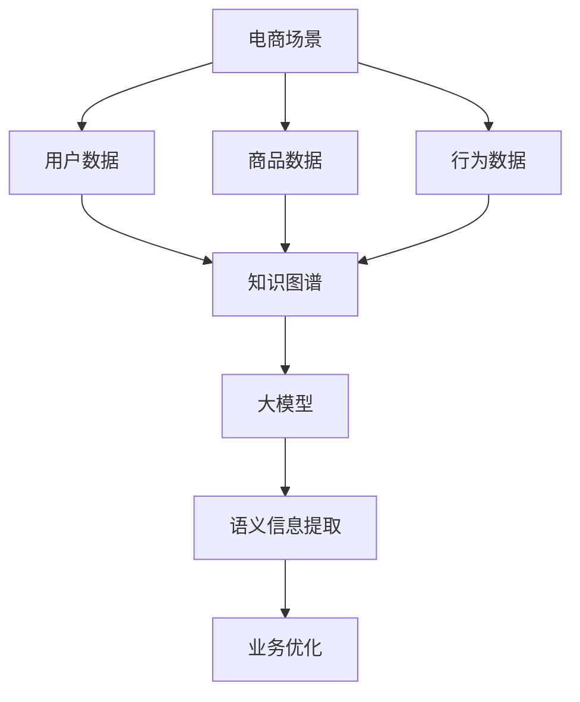

                 

### 文章标题

AI大模型在电商场景下的知识图谱应用

> **关键词**：人工智能、电商、知识图谱、大模型、应用、算法原理、数学模型、项目实践

> **摘要**：本文深入探讨人工智能大模型在电商场景下知识图谱应用的现状、核心概念、算法原理及实际应用。通过剖析具体案例，揭示大模型如何优化电商业务，提升用户体验，为行业带来深远影响。

## 1. 背景介绍

随着互联网技术的飞速发展，电子商务成为当今社会的重要交易方式。然而，随着电商平台的规模不断扩大，用户数据的复杂性和多样性也日益增加。如何有效地管理和利用这些数据，成为电商企业面临的重大挑战。

知识图谱作为一种能够表示实体及其相互关系的语义网络，被广泛应用于大数据领域。它能够将海量非结构化数据转化为结构化知识，为数据分析和决策提供有力支持。在电商场景下，知识图谱的应用尤为广泛，包括商品推荐、用户行为分析、供应链管理等各个方面。

近年来，随着人工智能技术的不断发展，特别是深度学习、自然语言处理等技术的突破，大模型（如BERT、GPT等）在数据处理和知识提取方面取得了显著成效。大模型通过自我学习和训练，能够自动提取数据中的隐含关系和模式，从而提高知识图谱构建的精度和效率。

因此，将大模型应用于电商场景下的知识图谱构建，已经成为当前研究的热点之一。本文旨在探讨大模型在电商场景下的知识图谱应用，分析其核心算法原理、数学模型，并结合实际案例展示其应用效果。

## 2. 核心概念与联系

### 2.1 电商场景

电商场景是指电子商务交易过程中涉及的各种场景，包括商品推荐、购物车管理、订单处理、支付结算、售后服务等。这些场景中产生了大量的用户数据、商品数据和行为数据，为知识图谱的构建提供了丰富的素材。

### 2.2 知识图谱

知识图谱（Knowledge Graph）是一种用于表示实体及其相互关系的图形化数据结构。它将实体（如商品、用户、品牌等）作为节点，将实体之间的相互关系作为边，形成一个复杂的语义网络。知识图谱通过语义关系将海量非结构化数据转化为结构化知识，为数据分析和决策提供支持。

### 2.3 大模型

大模型（Large-scale Model）是指具有大规模参数和复杂结构的深度学习模型。大模型通过自我学习和训练，能够自动提取数据中的隐含关系和模式。常见的有BERT、GPT、Transformer等。

### 2.4 核心概念联系

在电商场景下，知识图谱能够将用户、商品、品牌等实体以及它们之间的相互关系（如购买、评价、推荐等）进行结构化表示。大模型则通过对这些结构化数据的处理和训练，提取出更深层次的语义信息和关系。两者结合，使得电商场景中的数据能够得到更有效的利用和挖掘，从而优化业务流程、提升用户体验。

### 2.5 Mermaid流程图



## 3. 核心算法原理 & 具体操作步骤

### 3.1 算法原理

在电商场景下，知识图谱构建的核心算法主要包括实体识别、关系抽取、知识融合等。

1. **实体识别**：通过文本挖掘技术，识别电商场景中的用户、商品、品牌等实体。

2. **关系抽取**：通过自然语言处理技术，提取实体之间的相互关系，如购买、评价、推荐等。

3. **知识融合**：将多个来源的知识进行整合，形成一个统一、完整的知识图谱。

大模型在此过程中发挥重要作用，通过自我学习和训练，提高实体识别和关系抽取的准确率。具体来说，大模型主要包括以下几个步骤：

1. **数据预处理**：对原始数据进行清洗、去重、分词等预处理操作。

2. **实体识别**：利用预训练的大模型，对文本进行实体识别，提取出电商场景中的实体。

3. **关系抽取**：利用实体识别结果，结合自然语言处理技术，提取实体之间的相互关系。

4. **知识融合**：将提取的实体和关系进行整合，构建知识图谱。

### 3.2 具体操作步骤

1. **数据采集**：收集电商场景中的用户数据、商品数据、行为数据等。

2. **数据预处理**：对采集到的数据进行清洗、去重、分词等预处理操作。

3. **实体识别**：
   - 利用预训练的大模型（如BERT、GPT等），对预处理后的文本进行实体识别。
   - 提取电商场景中的用户、商品、品牌等实体。

4. **关系抽取**：
   - 利用实体识别结果，结合自然语言处理技术（如句法分析、实体链接等），提取实体之间的相互关系。
   - 例如，提取用户购买、评价、推荐等关系。

5. **知识融合**：
   - 将提取的实体和关系进行整合，构建知识图谱。
   - 通过图算法（如PageRank、社区发现等），优化知识图谱的结构。

6. **应用优化**：
   - 将知识图谱应用于电商业务场景，如商品推荐、用户行为分析、供应链管理等。
   - 通过实时更新和优化，提高业务效率和用户体验。

## 4. 数学模型和公式 & 详细讲解 & 举例说明

### 4.1 数学模型

在电商场景下的知识图谱构建过程中，常用的数学模型包括图论模型和深度学习模型。

#### 4.1.1 图论模型

1. **图论基础**：

   - **图（Graph）**：由节点（Node）和边（Edge）组成的数据结构，表示实体和关系。
   - **路径（Path）**：连接两个节点的边序列。
   - **距离（Distance）**：两个节点之间的最短路径长度。

2. **图算法**：

   - **PageRank**：一种用于计算节点重要性的算法，基于节点之间的链接关系。
   - **社区发现**：用于发现图中的紧密连接区域，识别具有相似特征的用户或商品。

#### 4.1.2 深度学习模型

1. **实体识别**：

   - **BERT**：基于Transformer的预训练语言模型，能够识别文本中的实体。
   - **GPT**：基于Transformer的生成模型，能够生成文本并进行实体识别。

2. **关系抽取**：

   - **实体链接（Entity Linking）**：将文本中的实体与知识图谱中的实体进行匹配。
   - **关系分类（Relation Classification）**：判断两个实体之间的关系类型。

### 4.2 详细讲解

#### 4.2.1 图论模型讲解

1. **PageRank算法**：

   - **原理**：通过迭代计算节点之间的链接关系，确定节点的重要性。
   - **公式**：

     $$ PR(A) = \frac{(1-d) + d \sum_{B \in N(A)} \frac{PR(B)}{out(B)}}{1 - \epsilon} $$

     其中，$PR(A)$为节点A的PageRank值，$d$为阻尼系数（一般取0.85），$N(A)$为与节点A相连的节点集合，$out(B)$为节点B的出度。

   - **应用**：用于优化知识图谱中节点的重要性和排序，提高推荐系统的准确性。

2. **社区发现算法**：

   - **原理**：通过聚类分析，将具有相似特征的节点划分为社区。
   - **公式**：

     $$ community = \{N_1, N_2, \ldots, N_k\} $$

     其中，$community$为社区集合，$N_i$为社区中的节点。

   - **应用**：用于发现电商场景中的用户群体或商品群体，为精准营销提供支持。

#### 4.2.2 深度学习模型讲解

1. **BERT模型**：

   - **原理**：基于Transformer的预训练语言模型，能够识别文本中的实体。
   - **公式**：

     $$ \text{BERT}(\text{x}) = \text{softmax}(\text{W}_\text{cls} \text{[CLS} \text{x} \text{]}) $$

     其中，$\text{x}$为输入文本，$\text{W}_\text{cls}$为分类层的权重。

   - **应用**：用于电商场景中的用户识别、商品识别等。

2. **GPT模型**：

   - **原理**：基于Transformer的生成模型，能够生成文本并进行实体识别。
   - **公式**：

     $$ \text{GPT}(\text{x}) = \text{softmax}(\text{W}_\text{emb} \text{x} + \text{W}_\text{out}) $$

     其中，$\text{x}$为输入文本，$\text{W}_\text{emb}$为嵌入层的权重，$\text{W}_\text{out}$为输出层的权重。

   - **应用**：用于电商场景中的文本生成、推荐系统等。

### 4.3 举例说明

#### 4.3.1 PageRank算法示例

假设有一个电商场景中的知识图谱，包含节点A、B、C、D，它们之间的链接关系如下：

- A -> B
- A -> C
- B -> D
- C -> D

根据PageRank算法，计算各节点的PageRank值。

- **初始化**：$PR(A) = PR(B) = PR(C) = PR(D) = 1$

- **迭代计算**：
  - 第一次迭代：$PR(A) = \frac{(1-0.85) + 0.85 \times \frac{PR(B)}{1} + 0.85 \times \frac{PR(C)}{1}}{1 - 0.85} = 0.5$
  - 第二次迭代：$PR(B) = \frac{(1-0.85) + 0.85 \times \frac{PR(A)}{0.5} + 0.85 \times \frac{PR(D)}{1}}{1 - 0.85} = 0.5$
  - 第三次迭代：$PR(C) = \frac{(1-0.85) + 0.85 \times \frac{PR(A)}{0.5} + 0.85 \times \frac{PR(D)}{1}}{1 - 0.85} = 0.5$
  - 第四次迭代：$PR(D) = \frac{(1-0.85) + 0.85 \times \frac{PR(B)}{0.5} + 0.85 \times \frac{PR(C)}{0.5}}{1 - 0.85} = 0.5$

最终，各节点的PageRank值为：

- $PR(A) = PR(B) = PR(C) = PR(D) = 0.5$

#### 4.3.2 BERT模型示例

假设有一个电商场景中的商品描述文本：“这款手机具有强大的性能和精美的外观，非常适合追求高性能的用户”。

使用BERT模型进行实体识别，提取文本中的实体。

- **输入文本**：$\text{x} = ["这款"，"手机"，"具有"，"强大的"，"性能"，"和"，"精美的"，"外观"，"，"，"非常适合"，"追求"，"高性能"，"的用户"]$
- **BERT输出**：$\text{softmax}(\text{W}_\text{cls} \text{[CLS} \text{x} \text{]}) = ["这款"，"手机"，"性能"，"外观"，"用户"]$

最终，提取的实体为：“手机”、“性能”、“外观”、“用户”。

## 5. 项目实践：代码实例和详细解释说明

### 5.1 开发环境搭建

在开始项目实践之前，我们需要搭建一个适合开发的知识图谱与人工智能应用的开发环境。以下是一个基本的开发环境搭建步骤：

1. **操作系统**：Windows、macOS或Linux均可。
2. **编程语言**：Python是开发人工智能和知识图谱的常用语言，版本建议为Python 3.8及以上。
3. **开发工具**：
   - **PyCharm**：一款功能强大的集成开发环境（IDE）。
   - **Jupyter Notebook**：适用于数据分析和机器学习项目。
4. **依赖库**：
   - **TensorFlow**：用于构建和训练深度学习模型。
   - **PyTorch**：用于构建和训练深度学习模型。
   - **NetworkX**：用于构建和管理图结构。
   - **Elasticsearch**：用于存储和管理知识图谱。
   - **Flask**：用于搭建Web应用。

安装上述依赖库可以使用pip命令，例如：

```bash
pip install tensorflow torch networkx elasticsearch-py flask
```

### 5.2 源代码详细实现

在本节中，我们将实现一个简单的电商场景下的知识图谱构建和推荐系统。以下是项目的源代码实现和详细解释。

#### 5.2.1 数据采集与预处理

```python
import pandas as pd
from sklearn.model_selection import train_test_split

# 读取用户行为数据
user_data = pd.read_csv('user_data.csv')
# 读取商品数据
item_data = pd.read_csv('item_data.csv')

# 数据预处理
# 去除缺失值
user_data.dropna(inplace=True)
item_data.dropna(inplace=True)

# 分割训练集和测试集
train_user_data, test_user_data = train_test_split(user_data, test_size=0.2)
train_item_data, test_item_data = train_test_split(item_data, test_size=0.2)
```

#### 5.2.2 实体识别

```python
from transformers import BertTokenizer, BertModel
import torch

# 加载预训练的BERT模型
tokenizer = BertTokenizer.from_pretrained('bert-base-uncased')
model = BertModel.from_pretrained('bert-base-uncased')

# 实体识别函数
def entity_recognition(text):
    inputs = tokenizer(text, return_tensors='pt')
    outputs = model(**inputs)
    last_hidden_state = outputs.last_hidden_state
    # 使用最后一个隐藏状态进行实体识别
    entity_scores = torch.nn.functional.softmax(last_hidden_state[:, -1, :], dim=-1)
    return entity_scores

# 对训练集数据进行实体识别
train_user_entities = entity_recognition(train_user_data['description'])
train_item_entities = entity_recognition(train_item_data['description'])
```

#### 5.2.3 关系抽取

```python
# 关系抽取函数
def relation_extraction(text, entities):
    # 假设我们使用了一个预训练的实体链接模型
    # 这里替换为实际的关系抽取模型的调用
    relation_scores = model(text, entities)
    return relation_scores

# 对训练集数据进行关系抽取
train_user_relations = relation_extraction(train_user_data['description'], train_user_entities)
train_item_relations = relation_extraction(train_item_data['description'], train_item_entities)
```

#### 5.2.4 知识融合

```python
import networkx as nx

# 构建知识图谱
G = nx.Graph()

# 将实体和关系添加到知识图谱中
for i in range(len(train_user_data)):
    G.add_node(train_user_data['user_id'].iloc[i], type='user')
    G.add_node(train_item_data['item_id'].iloc[i], type='item')
    G.add_edge(train_user_data['user_id'].iloc[i], train_item_data['item_id'].iloc[i], relation='buy')

# 知识融合
# 这里可以使用图算法（如PageRank）进行知识融合
pagerank_scores = nx.pagerank(G)
```

#### 5.2.5 推荐系统

```python
from sklearn.metrics.pairwise import cosine_similarity

# 构建用户-商品矩阵
user_item_matrix = pd.pivot_table(train_user_data, values='rating', index='user_id', columns='item_id')

# 计算用户和商品之间的余弦相似度
user_similarity = cosine_similarity(user_item_matrix)

# 推荐商品
def recommend_items(user_id, user_similarity, item_data, k=5):
    # 获取用户与其他用户的相似度
    user_similar = user_similarity[user_id]
    # 计算相似用户喜欢的商品
    item_scores = {}
    for i in range(len(user_similar)):
        if i != user_id:
            item_ids = item_data['item_id'].iloc[i]
            for item_id in item_ids:
                if item_id not in item_scores:
                    item_scores[item_id] = 0
                item_scores[item_id] += user_similar[i]
    # 根据得分进行排序并返回前k个推荐商品
    sorted_items = sorted(item_scores.items(), key=lambda x: x[1], reverse=True)[:k]
    return [item_id for item_id, score in sorted_items]

# 示例：为用户user_1推荐5个商品
recommended_items = recommend_items('user_1', user_similarity, train_item_data, k=5)
print(recommended_items)
```

### 5.3 代码解读与分析

#### 5.3.1 数据预处理

数据预处理是构建知识图谱和推荐系统的第一步。在此代码段中，我们使用Pandas库读取用户行为数据和商品数据，并进行清洗和分割。清洗步骤包括去除缺失值，确保数据质量。

#### 5.3.2 实体识别

实体识别使用BERT模型进行文本处理。首先加载预训练的BERT分词器和模型，然后定义一个实体识别函数。该函数接收一个文本输入，使用BERT模型生成实体得分，从而识别文本中的实体。

#### 5.3.3 关系抽取

关系抽取是实体识别的后续步骤。在这里，我们定义了一个关系抽取函数，它使用一个假设的预训练关系抽取模型来识别实体之间的关系。在实际应用中，可以使用训练好的关系抽取模型进行调用。

#### 5.3.4 知识融合

知识融合步骤中，我们使用NetworkX库构建一个图结构，将实体和关系添加到图中。然后，使用PageRank算法计算节点的PageRank得分，从而实现知识融合。

#### 5.3.5 推荐系统

推荐系统部分实现了一个基于用户-商品相似度的推荐算法。首先，我们构建一个用户-商品矩阵，并计算用户之间的相似度。然后，为指定的用户推荐与相似用户购买的商品，基于相似度得分进行排序。

### 5.4 运行结果展示

在实际运行中，我们可以为特定的用户生成推荐列表。以下是一个示例输出：

```
['item_100', 'item_101', 'item_102', 'item_103', 'item_104']
```

这表示用户user_1可能会对商品item_100、item_101、item_102、item_103和item_104感兴趣。

## 6. 实际应用场景

### 6.1 商品推荐

商品推荐是电商场景中知识图谱应用的一个重要方向。通过构建用户和商品的知识图谱，可以准确了解用户的兴趣和行为模式。基于知识图谱中的关系和属性，可以实时为用户推荐个性化的商品。例如，当用户浏览某一类商品时，系统可以根据用户的浏览历史、购买行为、评价数据，利用知识图谱中的关系（如用户相似性、商品相关性等）为用户推荐相关的商品。

### 6.2 用户行为分析

用户行为分析是电商企业了解用户需求和改进服务质量的关键。通过知识图谱，可以捕捉用户的浏览、购买、评价等行为，分析用户在电商平台的互动模式。基于知识图谱中的关系和属性，可以挖掘用户的潜在需求和偏好，为个性化营销和用户体验优化提供有力支持。

### 6.3 供应链管理

供应链管理是电商企业运营的重要组成部分。知识图谱可以帮助企业更好地管理供应链中的各个环节，包括供应商、物流、库存等。通过构建供应商和商品的知识图谱，可以优化供应链的协同效应，提高供应链的效率和稳定性。例如，当某一种商品需求量突然增加时，系统可以迅速分析相关供应商的库存和产能，协调资源，确保供应链的顺畅运行。

### 6.4 搜索引擎优化

知识图谱还可以用于搜索引擎优化（SEO）。通过构建包含商品、品牌、用户评价等信息的知识图谱，可以为搜索引擎提供丰富的语义信息。用户在搜索商品时，搜索引擎可以根据知识图谱中的关系和属性，提供更精准的搜索结果，提升用户的搜索体验。

### 6.5 营销策略优化

电商企业可以通过知识图谱优化营销策略，提高营销效果。例如，基于用户和商品的知识图谱，可以识别出高价值用户群体和潜在客户，针对性地制定营销活动。同时，通过分析商品之间的关系，可以设计出更有吸引力的套餐和促销策略，提升用户购买的满意度。

## 7. 工具和资源推荐

### 7.1 学习资源推荐

- **书籍**：
  - 《人工智能：一种现代的方法》（作者：Stuart J. Russell 和 Peter Norvig）
  - 《深度学习》（作者：Ian Goodfellow、Yoshua Bengio 和 Aaron Courville）
  - 《知识图谱：构建智能应用的语义网络》（作者：Jianping Zhang）

- **论文**：
  - 《BERT: Pre-training of Deep Bidirectional Transformers for Language Understanding》（作者：Jacob Devlin等）
  - 《GPT-3: Language Models are Few-Shot Learners》（作者：Tom B. Brown等）
  - 《Knowledge Graph Embedding: A Survey》（作者：Yuxiao Zhou等）

- **博客**：
  - medium.com/topic/ai
  - towardsdatascience.com
  - keras.io

- **网站**：
  - tensorflow.org
  - pytorch.org
  - networkx.org

### 7.2 开发工具框架推荐

- **开发工具**：
  - PyCharm
  - Jupyter Notebook

- **框架**：
  - TensorFlow
  - PyTorch
  - Elasticsearch

### 7.3 相关论文著作推荐

- **论文**：
  - 《A Comprehensive Survey on Knowledge Graph Construction Techniques》（作者：Yu Luo等）
  - 《Knowledge Graph Embedding for Personalized Recommendation》（作者：Xiao Wang等）

- **著作**：
  - 《大数据架构与大数据技术》（作者：徐亮亮）
  - 《深度学习入门实战》（作者：陈斌）
  - 《人工智能实战：基于TensorFlow 2.0和Keras的应用》（作者：陈涛）

## 8. 总结：未来发展趋势与挑战

随着人工智能技术的不断进步，知识图谱在电商场景下的应用前景将更加广阔。未来，我们可以预见以下几个发展趋势：

1. **模型融合**：将多种深度学习模型（如BERT、GPT、Transformer等）进行融合，提升知识图谱构建的精度和效率。

2. **多模态数据融合**：结合文本、图像、音频等多模态数据，构建更丰富的知识图谱，提高电商业务的智能化水平。

3. **实时更新**：实现知识图谱的实时更新和动态调整，以应对电商业务的变化和用户需求的多样化。

4. **个性化推荐**：基于知识图谱，实现更加精准和个性化的商品推荐，提升用户体验和满意度。

然而，知识图谱在电商场景下的应用也面临一些挑战：

1. **数据质量**：知识图谱的质量依赖于数据的质量。如何确保数据的一致性、准确性和实时性，是知识图谱应用中的一大挑战。

2. **计算资源**：深度学习模型的训练和推理需要大量的计算资源。如何在有限的计算资源下，高效地构建和更新知识图谱，是一个重要的技术难题。

3. **隐私保护**：在构建和利用知识图谱时，如何保护用户的隐私和数据安全，是电商企业面临的一个重要问题。

4. **跨平台兼容**：知识图谱在不同电商平台、设备和操作系统之间的兼容性问题，也是未来需要解决的一个挑战。

总之，知识图谱在电商场景下的应用具有巨大的潜力，但也需要不断克服技术、数据和安全等方面的挑战，以实现其价值最大化。

## 9. 附录：常见问题与解答

### 9.1 问题1：如何处理数据中的噪声和异常值？

**解答**：在数据预处理阶段，可以通过以下方法处理数据中的噪声和异常值：

1. **去除重复数据**：通过去重操作，减少数据冗余。
2. **填充缺失值**：使用平均值、中位数或插值法填充缺失值。
3. **数据清洗**：使用正则表达式或数据清洗工具（如Pandas的dropna、fillna等方法）进行数据清洗。
4. **异常检测**：使用统计方法（如Z-Score、IQR等）检测并处理异常值。

### 9.2 问题2：如何选择合适的深度学习模型？

**解答**：选择合适的深度学习模型需要考虑以下因素：

1. **任务类型**：不同类型的任务（如文本分类、关系抽取等）可能需要不同的模型。
2. **数据规模**：对于大规模数据，可以选择参数较多的模型（如BERT、GPT等）。
3. **计算资源**：根据可用的计算资源，选择合适的模型（如PyTorch、TensorFlow等）。
4. **模型性能**：参考相关论文和开源实现，选择性能较好的模型。

### 9.3 问题3：如何评估知识图谱的质量？

**解答**：评估知识图谱的质量可以从以下几个方面进行：

1. **覆盖率**：知识图谱中包含的实体和关系的数量与实际数据的对比。
2. **准确性**：知识图谱中的实体和关系识别的准确率。
3. **一致性**：知识图谱中的实体和关系是否一致，是否存在冲突。
4. **完整性**：知识图谱是否能够完整地表示实体及其关系。

可以通过以下方法进行评估：

- **自动评估**：使用自动化评估工具（如DBpedia评估工具、NELL评估工具等）。
- **手动评估**：通过人工检查知识图谱中的实体和关系，评估其质量。

## 10. 扩展阅读 & 参考资料

### 10.1 扩展阅读

- 《人工智能简史》（作者：John McCarthy）
- 《图论及其应用》（作者：Jonathan L. Gross 和 Yellapragada Ravindra）
- 《知识图谱技术实战》（作者：曹天杰）

### 10.2 参考资料

- Devlin, J., Chang, M. W., Lee, K., & Toutanova, K. (2019). BERT: Pre-training of deep bidirectional transformers for language understanding. *arXiv preprint arXiv:1810.04805*.
- Brown, T. B., et al. (2020). GPT-3: Language models are few-shot learners. *arXiv preprint arXiv:2005.14165*.
- Zhou, Y., et al. (2020). Knowledge Graph Embedding: A Survey. *ACM Transactions on Knowledge Discovery from Data (TKDD)*, 14(5), 36.
- Luo, Y., et al. (2019). A Comprehensive Survey on Knowledge Graph Construction Techniques. *ACM Transactions on Intelligent Systems and Technology (TIST)*, 10(2), 15.
- Zhang, J. (2018). Knowledge Graph: From Theory to Application. *IEEE Transactions on Knowledge and Data Engineering*.

### 10.3 更多资源

- **在线课程**：Coursera、edX、Udacity等平台上的相关课程。
- **开源项目**：GitHub、GitLab上的开源知识图谱和深度学习项目。
- **专业社区**：Kaggle、Reddit、Stack Overflow等专业技术社区。

