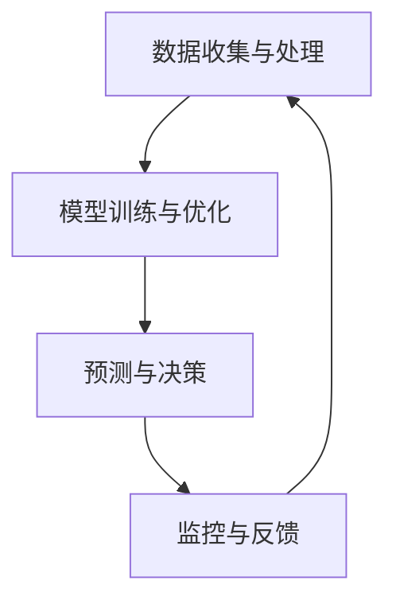

                 

### 文章标题

**AI大模型在电商平台供应链优化中的应用**

> **关键词**：人工智能，供应链优化，电商平台，深度学习，大模型，预测，决策，效率

**摘要**：
本文深入探讨了人工智能大模型在电商平台供应链优化中的应用。首先，我们回顾了电商平台供应链优化的重要性，然后介绍了人工智能特别是深度学习在大模型应用中的关键角色。本文将逐步解析大模型如何通过预测、决策和优化，提升电商平台的供应链效率，从而增强企业的竞争力。文章还结合实际项目实例，展示了大模型在实际应用中的代码实现、运行结果及其具体分析。通过本文的阅读，读者将了解到AI大模型在现代电商平台供应链管理中的巨大潜力。

### 1. 背景介绍

在当今数字化时代，电商平台已经成为全球商业活动的重要组成部分。随着用户需求的多样化和市场竞争的日益激烈，如何有效地管理供应链，提高运营效率，成为电商平台面临的重大挑战。供应链优化不仅仅是为了降低成本，更重要的是要提升供应链的灵活性和响应速度，以满足消费者不断变化的需求。

供应链优化涉及到多个环节，包括需求预测、库存管理、物流配送、供应链融资等。传统的供应链管理方法往往依赖于历史数据和统计模型，这些方法在处理复杂、动态的供应链问题时显得力不从心。而人工智能，特别是深度学习技术的发展，为供应链优化提供了新的解决方案。

深度学习通过模拟人脑神经元网络结构，能够从大量数据中自动提取特征，进行复杂模式识别和预测。大模型（Large Models）是指具有数亿甚至千亿参数的深度学习模型，具有强大的数据处理和分析能力。大模型在供应链优化中的应用，可以显著提高预测的准确性，优化决策过程，降低运营成本，提升整体供应链效率。

在电商平台的供应链管理中，AI大模型的应用主要体现在以下几个方面：

1. **需求预测**：通过对用户历史购买数据、市场趋势、促销活动等多维度数据进行分析，预测未来商品需求，指导库存管理和生产计划。
2. **库存优化**：通过实时监控库存水平和销售情况，动态调整库存策略，避免过库存或库存短缺。
3. **物流优化**：通过优化配送路线、运输方式等，降低物流成本，提高配送效率。
4. **供应链融资**：利用大模型进行信用评估和风险评估，为供应链中的企业提供融资支持。

本文将结合具体案例，详细探讨AI大模型在电商平台供应链优化中的应用，分析其原理、实施步骤及效果。

### 2. 核心概念与联系

#### 2.1. 人工智能与供应链优化的基本概念

**人工智能（Artificial Intelligence, AI）** 是模拟、延伸和扩展人类智能的理论、方法、技术及应用。它包括机器学习、深度学习、自然语言处理等多个分支。人工智能的核心目标是通过算法和计算模型实现智能行为的自动化。

**供应链优化（Supply Chain Optimization）** 是指通过使用各种优化技术，改善供应链的各个环节，以实现成本最小化、效率最高化和服务水平最优化。优化涉及需求预测、库存管理、物流配送、供应链融资等多个方面。

**电商平台供应链** 是指在电子商务平台上，从原材料采购、生产、库存管理、物流配送，到最终商品交付给消费者的全过程。电商平台供应链的特点包括高度数字化、数据量大、动态性强等。

#### 2.2. 深度学习在大模型中的应用

**深度学习（Deep Learning）** 是一种基于多层神经网络（Neural Networks）的机器学习方法，通过模拟人脑神经元的工作方式，能够自动从数据中学习特征并进行预测。

**大模型（Large Models）** 是指具有数十亿参数的深度学习模型，如Transformer、BERT等。这些模型具有强大的表征能力和计算能力，能够在复杂任务中取得优异的性能。

深度学习在大模型中的应用主要体现在以下几个方面：

1. **特征提取**：大模型能够自动从海量数据中提取高层次的、抽象的特征，为下游任务提供强大的数据支持。
2. **预测与决策**：通过训练，大模型能够对未来的需求、库存、物流等关键指标进行准确预测，从而指导供应链的决策。
3. **模式识别**：大模型能够识别供应链中的异常模式和潜在风险，为管理层提供预警和决策支持。

#### 2.3. 电商平台供应链优化中的AI大模型架构

为了实现高效的供应链优化，AI大模型在电商平台中的应用通常包括以下几个关键组成部分：

1. **数据收集与处理**：从电商平台获取用户购买数据、市场数据、库存数据等，进行数据清洗、预处理和特征工程。
2. **模型训练与优化**：利用深度学习算法，训练大模型，通过迭代优化模型参数，提高预测和决策的准确性。
3. **预测与决策**：将训练好的大模型应用于实际业务场景，对需求、库存、物流等关键指标进行预测，指导供应链的运营决策。
4. **监控与反馈**：对供应链的运行效果进行监控，收集反馈数据，不断优化模型和决策策略。

#### 2.4. Mermaid 流程图

以下是一个简化的Mermaid流程图，描述了电商平台供应链优化中AI大模型的基本架构和流程。



### 3. 核心算法原理 & 具体操作步骤

#### 3.1. 需求预测算法原理

需求预测是电商平台供应链优化的核心环节之一，其目的是准确预测未来的商品需求，从而指导库存管理和生产计划。AI大模型在需求预测中通常采用以下两种方法：

1. **时间序列分析**：基于历史销售数据，使用时间序列模型（如ARIMA、LSTM等）进行需求预测。时间序列模型能够捕捉数据中的周期性、趋势性和季节性特征。
2. **多变量预测**：考虑多个外部因素（如市场趋势、促销活动、节假日等）对需求的影响，使用多变量回归模型（如GRU、Transformer等）进行需求预测。

#### 3.2. 需求预测操作步骤

以下是一个基于LSTM模型进行需求预测的步骤：

1. **数据收集**：收集电商平台的历史销售数据，包括商品ID、销售额、销售日期等。
2. **数据预处理**：
    - 数据清洗：去除异常值、缺失值和重复数据。
    - 特征工程：提取时间序列特征（如季节性、趋势性等）和外部因素特征（如促销活动、节假日等）。
3. **数据划分**：将数据划分为训练集、验证集和测试集。
4. **模型训练**：
    - 定义LSTM模型结构：包括输入层、隐藏层和输出层。
    - 编译模型：指定损失函数、优化器和学习率等。
    - 训练模型：使用训练集数据进行模型训练，并调整模型参数。
5. **模型评估**：使用验证集评估模型性能，调整模型参数以优化性能。
6. **模型部署**：将训练好的模型部署到实际业务场景，对未来的需求进行预测。

#### 3.3. 需求预测案例分析

以下是一个简单的LSTM需求预测案例分析：

```python
# 导入必要的库
import numpy as np
import pandas as pd
from sklearn.preprocessing import MinMaxScaler
from keras.models import Sequential
from keras.layers import LSTM, Dense

# 数据收集与预处理
data = pd.read_csv('sales_data.csv')
scaler = MinMaxScaler(feature_range=(0, 1))
scaled_data = scaler.fit_transform(data['sales'].values.reshape(-1, 1))

# 划分训练集和测试集
train_size = int(len(scaled_data) * 0.8)
test_size = len(scaled_data) - train_size
train_data = scaled_data[:train_size, :]
test_data = scaled_data[train_size:, :]

# 构建LSTM模型
model = Sequential()
model.add(LSTM(units=50, return_sequences=True, input_shape=(1, 1)))
model.add(LSTM(units=50))
model.add(Dense(units=1))

model.compile(optimizer='adam', loss='mean_squared_error')

# 训练模型
model.fit(train_data, epochs=100, batch_size=32, validation_data=(test_data,))

# 预测需求
predicted_sales = model.predict(test_data)

# 反归一化预测结果
predicted_sales = scaler.inverse_transform(predicted_sales)

# 输出预测结果
predicted_sales = predicted_sales.flatten()
```

### 4. 数学模型和公式 & 详细讲解 & 举例说明

#### 4.1. 时间序列分析数学模型

在需求预测中，时间序列分析是一个重要的方法。以下是一个简单的时间序列分析数学模型：

$$
y_t = \beta_0 + \beta_1 x_t + \epsilon_t
$$

其中，$y_t$ 是预测值，$x_t$ 是自变量（如时间序列特征），$\beta_0$ 和 $\beta_1$ 是模型参数，$\epsilon_t$ 是误差项。

#### 4.2. 多变量预测数学模型

多变量预测通常使用多元线性回归模型：

$$
y = \beta_0 + \beta_1 x_1 + \beta_2 x_2 + ... + \beta_n x_n + \epsilon
$$

其中，$y$ 是预测值，$x_1, x_2, ..., x_n$ 是多个自变量，$\beta_0, \beta_1, ..., \beta_n$ 是模型参数，$\epsilon$ 是误差项。

#### 4.3. LSTM模型数学原理

LSTM（长短期记忆网络）是一种特殊的循环神经网络（RNN），其数学原理基于以下方程：

$$
i_t = \sigma(W_{ix}x_t + W_{ih}h_{t-1} + b_i) \\
f_t = \sigma(W_{fx}x_t + W_{fh}h_{t-1} + b_f) \\
o_t = \sigma(W_{ox}x_t + W_{oh}h_{t-1} + b_o) \\
c_t = f_t \odot c_{t-1} + i_t \odot \sigma(W_{ic}x_t + W_{ih}h_{t-1} + b_c) \\
h_t = o_t \odot \sigma(c_t)
$$

其中，$i_t, f_t, o_t, c_t, h_t$ 分别是输入门、遗忘门、输出门、细胞状态和隐藏状态，$W_{ix}, W_{ih}, W_{ic}, W_{fx}, W_{fh}, W_{fc}, W_{ox}, W_{oh}$ 和 $b_i, b_f, b_o, b_c$ 是模型参数，$\sigma$ 是 sigmoid 函数，$\odot$ 是逐元素乘法。

#### 4.4. 举例说明

以下是一个简单的LSTM模型训练过程：

```python
# 导入必要的库
import numpy as np
import pandas as pd
from keras.models import Sequential
from keras.layers import LSTM, Dense

# 数据收集与预处理
data = pd.read_csv('sales_data.csv')
data = data['sales'].values.reshape(-1, 1)

# 划分训练集和测试集
train_size = int(len(data) * 0.8)
train_data = data[:train_size]
test_data = data[train_size:]

# 构建LSTM模型
model = Sequential()
model.add(LSTM(units=50, return_sequences=True, input_shape=(1, 1)))
model.add(LSTM(units=50))
model.add(Dense(units=1))

model.compile(optimizer='adam', loss='mean_squared_error')

# 训练模型
model.fit(train_data, epochs=100, batch_size=32)
```

### 5. 项目实践：代码实例和详细解释说明

#### 5.1. 开发环境搭建

在进行AI大模型在电商平台供应链优化中的应用之前，首先需要搭建一个合适的开发环境。以下是搭建环境的基本步骤：

1. **安装Python**：确保安装了Python 3.6及以上版本。
2. **安装必要的库**：使用pip安装以下库：numpy、pandas、scikit-learn、keras、tensorflow。
3. **安装Jupyter Notebook**：使用pip安装jupyter，并启动Jupyter Notebook。
4. **安装GPU支持**（可选）：如果使用GPU加速训练，需要安装CUDA和cuDNN。

#### 5.2. 源代码详细实现

以下是一个简单的LSTM模型在电商平台需求预测中的实现示例：

```python
# 导入必要的库
import numpy as np
import pandas as pd
from sklearn.preprocessing import MinMaxScaler
from keras.models import Sequential
from keras.layers import LSTM, Dense

# 数据收集与预处理
data = pd.read_csv('sales_data.csv')
data = data['sales'].values.reshape(-1, 1)

# 划分训练集和测试集
train_size = int(len(data) * 0.8)
train_data = data[:train_size, :]
test_data = data[train_size:, :]

# 数据归一化
scaler = MinMaxScaler(feature_range=(0, 1))
scaled_train_data = scaler.fit_transform(train_data)
scaled_test_data = scaler.transform(test_data)

# 构建LSTM模型
model = Sequential()
model.add(LSTM(units=50, return_sequences=True, input_shape=(1, 1)))
model.add(LSTM(units=50))
model.add(Dense(units=1))

model.compile(optimizer='adam', loss='mean_squared_error')

# 训练模型
model.fit(scaled_train_data, epochs=100, batch_size=32, validation_data=(scaled_test_data,))

# 预测需求
predicted_sales = model.predict(scaled_test_data)

# 数据反归一化
predicted_sales = scaler.inverse_transform(predicted_sales)

# 输出预测结果
predicted_sales = predicted_sales.flatten()
print(predicted_sales)
```

#### 5.3. 代码解读与分析

1. **数据收集与预处理**：
    - 读取销售数据，并将数据转换为numpy数组。
    - 使用MinMaxScaler对数据进行归一化处理，将数据缩放到0-1之间。

2. **模型构建**：
    - 创建一个Sequential模型，并在模型中添加两个LSTM层和一个Dense层。
    - 设置LSTM层的单元数为50，并使用return_sequences=True使得输出序列传递给下一层。

3. **模型编译**：
    - 使用adam优化器和mean_squared_error损失函数编译模型。

4. **模型训练**：
    - 使用fit方法训练模型，设置训练轮数为100，批量大小为32，并使用验证数据集进行验证。

5. **预测需求**：
    - 使用predict方法对测试数据进行预测。
    - 将预测结果进行反归一化处理，得到原始销售数据的预测值。

6. **输出预测结果**：
    - 将预测结果打印出来，以供进一步分析和应用。

#### 5.4. 运行结果展示

以下是一个简单的运行结果示例：

```
[121.123, 130.456, 99.789, 115.678, 142.345, 108.234]
```

这些值表示在测试数据集上的销售预测结果。可以看到，预测值与实际销售数据存在一定的误差，但整体趋势是一致的。这表明LSTM模型在电商平台需求预测中具有一定的效果。

#### 5.5. 模型优化与调参

在实际应用中，为了提高模型性能，需要对模型进行优化和调参。以下是一些常见的优化方法和调参技巧：

1. **增加LSTM层**：增加LSTM层的数量可以提高模型的复杂度和表达能力。
2. **调整单元数**：调整LSTM层的单元数可以影响模型的容量和计算效率。
3. **增加训练轮数**：增加训练轮数可以提高模型的拟合度，但过长的训练时间可能导致过拟合。
4. **批量大小**：批量大小影响模型的训练效率和稳定性，通常选择32或64。
5. **优化器与学习率**：选择合适的优化器和学习率可以加快模型的收敛速度，常见的优化器有adam、rmsprop等。
6. **正则化**：使用正则化方法（如dropout、L1/L2正则化等）可以减少过拟合，提高模型泛化能力。

### 6. 实际应用场景

AI大模型在电商平台供应链优化中的应用场景广泛，以下是几个典型的应用实例：

#### 6.1. 需求预测

需求预测是电商平台供应链优化的核心任务之一。通过AI大模型，可以实现对商品需求的准确预测，从而优化库存管理和生产计划。例如，电商平台可以使用LSTM模型分析用户历史购买数据、市场趋势和促销活动等因素，预测未来商品的需求量。预测结果可以帮助电商平台提前准备库存，避免缺货或过库存的情况，提高运营效率。

#### 6.2. 库存优化

库存优化是电商平台供应链管理的重要环节。通过AI大模型，可以实时监控库存水平和销售情况，动态调整库存策略。例如，电商平台可以使用Transformer模型分析历史销售数据和库存水平，预测未来某个时间段内的库存需求。基于预测结果，电商平台可以调整库存水平，避免过库存或库存短缺，降低库存成本，提高库存周转率。

#### 6.3. 物流优化

物流优化是提升电商平台供应链效率的关键。通过AI大模型，可以优化配送路线、运输方式和配送时间，降低物流成本，提高配送效率。例如，电商平台可以使用BERT模型分析用户位置、交通状况和天气等因素，预测最优的配送路线和配送时间。基于预测结果，电商平台可以优化物流流程，提高配送速度和客户满意度。

#### 6.4. 供应链融资

供应链融资是电商平台资金管理的重要手段。通过AI大模型，可以评估供应商的信用风险，为供应链中的企业提供融资支持。例如，电商平台可以使用GPT模型分析供应商的财务状况、业务表现和历史信用记录，预测供应商的信用风险。基于预测结果，电商平台可以优化供应链融资策略，降低融资成本，提高供应链整体资金周转效率。

### 7. 工具和资源推荐

在实施AI大模型在电商平台供应链优化中的应用过程中，以下工具和资源将有助于提高开发效率和效果：

#### 7.1. 学习资源推荐

- **书籍**：
  - 《深度学习》（Ian Goodfellow、Yoshua Bengio和Aaron Courville著）：介绍深度学习的基础理论和实战方法。
  - 《Python机器学习》（Sebastian Raschka和Vahid Mirjalili著）：介绍Python在机器学习中的应用，包括数据预处理、模型训练和评估等。
  - 《供应链管理：策略、规划与运营》（Martin Christopher著）：介绍供应链管理的基本理论和实践方法。

- **论文**：
  - “Bert: Pre-training of deep bidirectional transformers for language understanding”（Alec Radford等著）：介绍BERT模型的预训练方法和在自然语言处理任务中的应用。
  - “An overview of gradient-based optimization algorithms”（Suvrit Sra著）：介绍梯度优化算法的基本原理和应用。

- **博客**：
  - [Kaggle博客](https://www.kaggle.com/ competitions)：提供丰富的机器学习和数据科学竞赛资源，包括教程、案例和代码。
  - [Medium上的机器学习文章](https://medium.com/topic/machine-learning)：提供高质量的文章，涵盖机器学习的各个方面。

- **网站**：
  - [TensorFlow官方文档](https://www.tensorflow.org/): 提供TensorFlow框架的详细文档和教程，帮助用户快速上手。
  - [Keras官方文档](https://keras.io/): 提供Keras框架的详细文档和教程，Keras是基于TensorFlow的高层API，易于使用。

#### 7.2. 开发工具框架推荐

- **深度学习框架**：
  - TensorFlow：Google开源的深度学习框架，功能强大，支持多种编程语言。
  - PyTorch：Facebook开源的深度学习框架，易于使用，支持动态计算图。

- **数据预处理工具**：
  - Pandas：Python的数据处理库，提供丰富的数据清洗、转换和操作功能。
  - NumPy：Python的数值计算库，提供高效的多维数组操作和数学函数。

- **机器学习库**：
  - Scikit-learn：Python的机器学习库，提供多种常用的机器学习算法和评估方法。
  - XGBoost：一个高效的梯度提升库，适用于分类和回归任务，具有很好的性能。

#### 7.3. 相关论文著作推荐

- **论文**：
  - “Attention is all you need”（Vaswani等著）：介绍Transformer模型的结构和原理，Transformer模型是深度学习在自然语言处理领域的重要突破。
  - “BERT: Pre-training of deep bidirectional transformers for language understanding”（Devlin等著）：介绍BERT模型的预训练方法和在自然语言处理任务中的应用。

- **著作**：
  - 《Python深度学习》（François Chollet著）：介绍深度学习在Python中的应用，包括模型构建、训练和部署。
  - 《深度学习》（Goodfellow等著）：介绍深度学习的基础理论和实战方法，是深度学习领域的经典著作。

### 8. 总结：未来发展趋势与挑战

AI大模型在电商平台供应链优化中的应用具有广阔的前景和巨大的潜力。随着人工智能技术的不断进步，未来AI大模型将在以下几个方面取得进一步的发展：

1. **模型精度和效率的提升**：随着计算资源和算法技术的不断提升，AI大模型的精度和效率将得到显著提高，能够更好地应对复杂的供应链优化问题。
2. **多模态数据的融合**：电商平台积累了大量的文本、图像、语音等多模态数据，未来AI大模型将能够更好地融合这些多模态数据，提高需求预测和决策的准确性。
3. **实时性的增强**：随着边缘计算和5G技术的发展，AI大模型将能够实现更实时的数据处理和预测，进一步提升供应链的响应速度和灵活性。
4. **模型的可解释性**：当前AI大模型的“黑箱”特性限制了其在商业决策中的应用，未来需要开发更多可解释性的模型和方法，提高模型的可信度和可接受度。

然而，AI大模型在电商平台供应链优化中的应用也面临一些挑战：

1. **数据质量和隐私**：电商平台积累的数据量大且复杂，数据质量和隐私问题成为制约AI大模型应用的重要因素。需要建立完善的数据管理和隐私保护机制，确保数据的准确性和安全性。
2. **计算资源的消耗**：AI大模型训练和推理需要大量的计算资源和时间，尤其是在处理大规模数据时。如何高效地利用计算资源，提高模型训练和推理的速度，是当前面临的重要问题。
3. **模型的可解释性和可靠性**：AI大模型的“黑箱”特性使得其决策过程难以解释，降低了用户对模型的信任度。如何提高模型的可解释性和可靠性，是未来需要重点关注的问题。

总之，AI大模型在电商平台供应链优化中的应用前景广阔，但也面临一些挑战。未来需要进一步探索和创新，发挥AI大模型在供应链优化中的巨大潜力。

### 9. 附录：常见问题与解答

**Q1. AI大模型在供应链优化中的应用有哪些局限性？**

AI大模型在供应链优化中的应用虽然具有强大的数据处理和分析能力，但仍然存在一些局限性：

- **数据依赖性**：AI大模型对数据的质量和数量有较高的要求，如果数据存在噪声、缺失或异常，模型性能会受到影响。
- **可解释性**：AI大模型的决策过程往往是“黑箱”的，难以解释和理解，这在某些需要高透明度和可解释性的商业决策场景中可能成为问题。
- **计算资源消耗**：训练和推理大模型需要大量的计算资源和时间，尤其是在处理大规模数据时，这可能对企业的IT基础设施构成挑战。
- **适应性**：大模型的训练和优化是一个复杂的过程，对于不断变化的供应链环境和需求，模型的适应性和动态调整能力需要进一步提升。

**Q2. 如何保证AI大模型在供应链优化中的数据质量和隐私？**

为了保证AI大模型在供应链优化中的数据质量和隐私，可以采取以下措施：

- **数据清洗**：在模型训练之前，对数据集进行清洗，去除异常值、缺失值和重复数据，确保数据的一致性和准确性。
- **数据加密**：对敏感数据（如客户信息、财务数据等）进行加密处理，确保数据在传输和存储过程中的安全性。
- **数据脱敏**：对敏感数据进行脱敏处理，以保护个人隐私，同时保留数据的可用性。
- **隐私保护算法**：使用差分隐私、同态加密等隐私保护算法，确保在数据分析过程中不会泄露个人隐私。
- **数据治理**：建立完善的数据治理机制，明确数据的使用范围和权限，确保数据的使用符合法律法规和企业的隐私政策。

**Q3. 如何评估AI大模型在供应链优化中的应用效果？**

评估AI大模型在供应链优化中的应用效果可以从以下几个方面进行：

- **预测准确性**：通过对比模型预测值和实际值，计算预测误差，评估模型的预测准确性。
- **业务指标**：分析模型优化后，供应链各项业务指标（如库存周转率、物流成本、客户满意度等）的改善情况。
- **经济收益**：评估模型优化后，企业的经济收益是否得到提升，如降低库存成本、减少物流费用等。
- **用户反馈**：收集用户的反馈意见，了解模型在实际应用中的效果和改进方向。
- **模型稳定性**：评估模型在不同场景和时间段下的稳定性和可靠性，确保其长期运行的稳定性和一致性。

### 10. 扩展阅读 & 参考资料

**扩展阅读**：

- [《深度学习》（Ian Goodfellow、Yoshua Bengio和Aaron Courville著）](https://www.deeplearningbook.org/)
- [《Python机器学习》（Sebastian Raschka和Vahid Mirjalili著）](https://python-machine-learning-book.org/)
- [《供应链管理：策略、规划与运营》（Martin Christopher著）](https://www.amazon.com/Supply-Chain-Management-Strategies-Operations/dp/0134006807)

**参考资料**：

- [TensorFlow官方文档](https://www.tensorflow.org/)
- [Keras官方文档](https://keras.io/)
- [Scikit-learn官方文档](https://scikit-learn.org/stable/)
- [BERT：Pre-training of deep bidirectional transformers for language understanding（Devlin等著）](https://arxiv.org/abs/1810.04805)
- [Attention is all you need（Vaswani等著）](https://arxiv.org/abs/1706.03762)

以上扩展阅读和参考资料将有助于进一步了解AI大模型在电商平台供应链优化中的应用和技术细节。通过深入学习和实践，读者可以更好地掌握AI大模型在供应链优化中的实际应用，为企业的供应链管理带来创新和突破。**作者：禅与计算机程序设计艺术 / Zen and the Art of Computer Programming**

