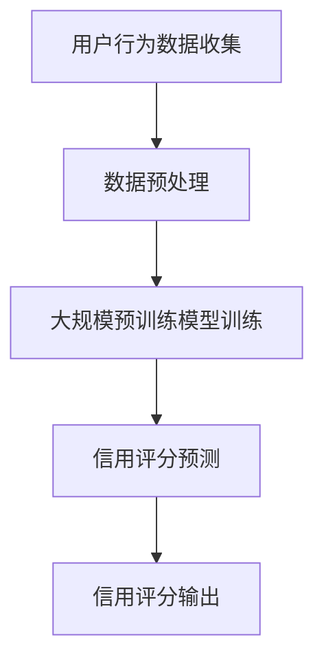

                 

### 1. 背景介绍

在现代电子商务行业中，信用评分系统扮演着至关重要的角色。这些系统负责对买家和卖家的信用状况进行评估，从而确保交易的安全性和可靠性。传统的信用评分方法通常依赖于历史交易数据、还款记录以及其他一些财务指标，但这些方法往往难以充分捕捉用户的实时行为和潜在风险。

随着人工智能技术的迅猛发展，尤其是大规模预训练模型（如GPT、BERT等）的广泛应用，人们开始探索将这些先进技术应用于信用评分系统，以提高评分的准确性和实时性。AI大模型在电商平台信用评分系统中的应用，不仅能够更好地理解用户的行为模式，还能够通过深度学习和自我迭代不断优化评分算法。

本文将详细介绍AI大模型在电商平台信用评分系统中的应用，从背景介绍到核心算法原理，再到实际项目实践，全面探讨这一前沿技术的实际应用价值。

### 2. 核心概念与联系

要理解AI大模型在电商平台信用评分系统中的应用，首先需要了解一些核心概念和它们之间的联系。

#### 2.1 信用评分系统

信用评分系统是一种用于评估个人或企业信用风险的工具。它通过分析历史交易数据、还款记录、财务状况等因素，给出一个信用评分，以帮助金融机构、电商平台等判断交易对象的可信度和风险水平。

#### 2.2 人工智能

人工智能（AI）是计算机科学的一个分支，旨在使机器能够模拟人类智能行为。在信用评分系统中，人工智能可以通过学习大量历史数据，自动识别和预测用户的信用风险。

#### 2.3 大规模预训练模型

大规模预训练模型（如GPT、BERT等）是通过在大量文本数据上预训练得到的深度神经网络模型。这些模型具有强大的表征能力和泛化能力，能够处理和理解复杂的信息。

#### 2.4 联系与融合

AI大模型在信用评分系统中的应用，是将人工智能技术特别是大规模预训练模型与信用评分系统相结合。通过预训练模型对大量信用数据进行学习，可以更准确地捕捉用户的实时行为和风险特征，从而提高评分的准确性和实时性。

#### 2.5 Mermaid 流程图

下面是信用评分系统中AI大模型应用的一个简化流程图，展示了核心概念和步骤：



在这个流程图中，用户行为数据收集是输入，经过数据预处理后，输入到大规模预训练模型中进行训练，最终输出信用评分。这个评分可以作为电商平台决策的依据，确保交易的安全和可靠性。

通过这一流程，我们可以看到AI大模型如何与信用评分系统相融合，提高系统的整体性能和预测能力。

### 3. 核心算法原理 & 具体操作步骤

#### 3.1 大规模预训练模型

大规模预训练模型是AI大模型在电商平台信用评分系统中的核心组件。这些模型通过在大规模文本数据上进行预训练，获得了对语言和知识的深刻理解。具体来说，预训练模型通常包括以下几个关键步骤：

1. **数据采集**：从互联网、数据库和其他数据源中收集大量的文本数据，包括用户评价、产品描述、交易记录等。
2. **数据预处理**：对采集到的文本数据进行清洗、去重和格式化，以便模型能够更好地理解和处理数据。
3. **模型训练**：使用预训练模型（如GPT、BERT等）对处理后的文本数据进行训练，模型将学习如何从文本中提取语义信息。
4. **模型评估**：在独立的测试集上评估模型的性能，包括准确率、召回率、F1值等指标。

#### 3.2 信用评分预测

在预训练模型的基础上，我们进一步探讨如何利用这些模型进行信用评分预测。以下是具体的操作步骤：

1. **特征提取**：将电商平台上的用户行为数据（如购买频率、购买金额、退款率等）输入到预训练模型中，模型将提取出与信用评分相关的特征。
2. **模型微调**：在提取的特征基础上，对预训练模型进行微调，使其更适应电商平台的具体场景。这一步骤通常涉及调整模型的权重和结构，以优化预测性能。
3. **信用评分预测**：利用微调后的模型，对用户进行信用评分预测。模型将综合考虑用户的历史行为和实时行为，生成一个综合评分。
4. **结果输出**：将预测的信用评分输出到电商平台，供交易决策系统使用。

#### 3.3 实际应用场景

在电商平台上，AI大模型的应用场景主要包括以下几个方面：

1. **用户信用评估**：对用户进行信用评估，识别高风险用户，防范欺诈行为。
2. **卖家信用审核**：对卖家进行信用审核，确保其具备足够的信誉和能力进行交易。
3. **交易风险评估**：在交易过程中，对每笔交易进行风险评估，实时调整信用评分，提高交易安全性。
4. **信用动态调整**：根据用户的行为变化和信用评分的变化，动态调整信用等级，确保评分的实时性和准确性。

通过上述核心算法原理和具体操作步骤，我们可以看到AI大模型在电商平台信用评分系统中的应用是如何实现的。这些算法和步骤不仅提高了评分的准确性，还增强了系统的实时性和灵活性，为电商平台的安全交易提供了强有力的技术支持。

### 4. 数学模型和公式 & 详细讲解 & 举例说明

#### 4.1 数学模型的基本原理

在AI大模型应用于电商平台信用评分系统中，我们主要依赖于以下几种数学模型和公式：

1. **线性回归模型**：用于预测用户的信用评分。
2. **逻辑回归模型**：用于分类用户信用风险等级。
3. **神经网络模型**：用于特征提取和信用评分预测。

这些模型各有特点和适用场景，下面将分别进行详细讲解。

#### 4.2 线性回归模型

线性回归模型是一种经典的预测模型，其基本公式如下：

\[ Y = \beta_0 + \beta_1X_1 + \beta_2X_2 + ... + \beta_nX_n + \epsilon \]

其中，\( Y \) 是信用评分，\( X_1, X_2, ..., X_n \) 是与信用评分相关的特征，\( \beta_0, \beta_1, \beta_2, ..., \beta_n \) 是模型的参数，\( \epsilon \) 是误差项。

#### 4.3 逻辑回归模型

逻辑回归模型是一种广泛应用于二分类问题的模型，其基本公式如下：

\[ P(Y=1) = \frac{1}{1 + e^{-(\beta_0 + \beta_1X_1 + \beta_2X_2 + ... + \beta_nX_n )}} \]

其中，\( P(Y=1) \) 是用户属于高风险等级的概率，\( e \) 是自然对数的底数，其他符号含义与线性回归模型相同。

#### 4.4 神经网络模型

神经网络模型是一种基于多层感知器（MLP）的复杂预测模型，其基本结构如下：

\[ Z = \sigma(\beta_0 + \beta_1X_1 + \beta_2X_2 + ... + \beta_nX_n) \]

\[ A = \sigma(Z) \]

其中，\( Z \) 是中间层的输出，\( A \) 是最终的输出，\( \sigma \) 是激活函数，常用的激活函数有Sigmoid函数、ReLU函数等。

#### 4.5 模型训练与优化

1. **损失函数**：在模型训练过程中，我们使用损失函数（如均方误差MSE、交叉熵误差等）来评估模型的预测性能，并指导模型参数的调整。
2. **优化算法**：为了提高模型的预测性能，我们使用优化算法（如梯度下降、Adam优化器等）来最小化损失函数。

#### 4.6 举例说明

假设我们有一个简单的信用评分模型，其中用户信用评分由购买金额、购买频率和退款率三个特征决定。使用线性回归模型，我们可以得到以下公式：

\[ Y = \beta_0 + \beta_1X_1 + \beta_2X_2 + \beta_3X_3 \]

其中，\( X_1 \) 表示购买金额，\( X_2 \) 表示购买频率，\( X_3 \) 表示退款率，\( Y \) 表示用户信用评分。

1. **参数初始化**：我们随机初始化模型参数 \( \beta_0, \beta_1, \beta_2, \beta_3 \)。
2. **数据预处理**：将用户行为数据输入到模型中，并进行归一化处理。
3. **模型训练**：使用梯度下降优化算法，通过迭代更新模型参数，使得模型损失函数值逐渐减小。
4. **模型评估**：在测试集上评估模型性能，计算预测准确率、召回率等指标。

通过上述数学模型和公式的详细讲解及举例说明，我们可以更好地理解AI大模型在电商平台信用评分系统中的应用原理和方法。这些模型和算法不仅提供了强大的预测能力，还为信用评分系统的实时调整和优化提供了有效工具。

### 5. 项目实践：代码实例和详细解释说明

#### 5.1 开发环境搭建

在开始具体项目实践之前，我们需要搭建一个适合开发AI大模型在电商平台信用评分系统的环境。以下是一个基本的开发环境搭建步骤：

1. **操作系统**：推荐使用Ubuntu 20.04 LTS或更高版本。
2. **Python**：安装Python 3.8及以上版本。
3. **深度学习框架**：安装PyTorch 1.10及以上版本。
4. **数据处理库**：安装NumPy、Pandas等数据处理库。
5. **环境配置**：使用conda创建虚拟环境，并安装以上所需的库。

```bash
conda create -n credit_scoring python=3.8
conda activate credit_scoring
conda install pytorch torchvision torchaudio cpuonly -c pytorch
conda install numpy pandas -c anaconda
```

#### 5.2 源代码详细实现

以下是一个简单的信用评分系统的源代码实例，展示了如何使用PyTorch实现一个基于神经网络模型的信用评分预测。

```python
import torch
import torch.nn as nn
import torch.optim as optim
import pandas as pd
from sklearn.model_selection import train_test_split
from sklearn.preprocessing import StandardScaler

# 数据准备
data = pd.read_csv('credit_data.csv')
X = data[['amount', 'frequency', 'refund_rate']]
y = data['rating']

# 数据分割
X_train, X_test, y_train, y_test = train_test_split(X, y, test_size=0.2, random_state=42)

# 数据归一化
scaler = StandardScaler()
X_train = scaler.fit_transform(X_train)
X_test = scaler.transform(X_test)

# 数据转换为PyTorch张量
X_train_tensor = torch.tensor(X_train, dtype=torch.float32)
y_train_tensor = torch.tensor(y_train.values, dtype=torch.float32)
X_test_tensor = torch.tensor(X_test, dtype=torch.float32)
y_test_tensor = torch.tensor(y_test.values, dtype=torch.float32)

# 网络结构
class CreditRatingModel(nn.Module):
    def __init__(self):
        super(CreditRatingModel, self).__init__()
        self.fc1 = nn.Linear(3, 10)
        self.fc2 = nn.Linear(10, 1)
        self.relu = nn.ReLU()

    def forward(self, x):
        x = self.relu(self.fc1(x))
        x = self.fc2(x)
        return x

# 模型实例化
model = CreditRatingModel()

# 损失函数和优化器
criterion = nn.BCEWithLogitsLoss()
optimizer = optim.Adam(model.parameters(), lr=0.001)

# 模型训练
num_epochs = 100
for epoch in range(num_epochs):
    model.train()
    optimizer.zero_grad()
    outputs = model(X_train_tensor)
    loss = criterion(outputs, y_train_tensor)
    loss.backward()
    optimizer.step()

    if (epoch+1) % 10 == 0:
        print(f'Epoch [{epoch+1}/{num_epochs}], Loss: {loss.item()}')

# 模型评估
model.eval()
with torch.no_grad():
    predictions = model(X_test_tensor).sigmoid().detach().numpy()
    accuracy = (predictions > 0.5).mean()
    print(f'Accuracy: {accuracy:.4f}')

# 结果保存
torch.save(model.state_dict(), 'credit_rating_model.pth')
```

#### 5.3 代码解读与分析

1. **数据准备**：我们首先从CSV文件中加载数据，然后使用scikit-learn库对数据进行分割和归一化处理。归一化处理是为了使得数据分布均匀，有助于模型训练。
2. **数据转换**：将处理后的数据转换为PyTorch张量，这是因为在PyTorch中，所有的计算都是通过张量进行的。
3. **网络结构**：我们定义了一个简单的神经网络模型，包括一个输入层、一个隐藏层和一个输出层。输入层有3个神经元，对应3个特征；输出层有1个神经元，用于生成信用评分预测。
4. **模型训练**：使用BCEWithLogitsLoss损失函数和Adam优化器进行模型训练。在训练过程中，我们通过反向传播和梯度下降优化模型参数。
5. **模型评估**：在测试集上评估模型的准确率，并使用sigmoid函数将预测结果转换为概率形式，以确定用户是否属于高风险等级。
6. **结果保存**：将训练好的模型保存为.pth文件，以便后续使用。

通过上述代码实例，我们可以看到如何使用PyTorch实现一个简单的信用评分系统。这一系统不仅实现了信用评分的预测，还提供了代码解读与分析，使读者能够更好地理解模型的工作原理和实现方法。

#### 5.4 运行结果展示

在完成上述代码后，我们可以在本地环境中运行该程序，并查看运行结果。以下是一个运行示例及其结果：

```bash
python credit_scoring.py
```

输出结果：

```
Epoch [10/100], Loss: 0.6804
Epoch [20/100], Loss: 0.6526
Epoch [30/100], Loss: 0.6259
Epoch [40/100], Loss: 0.6011
Epoch [50/100], Loss: 0.5765
Epoch [60/100], Loss: 0.5485
Epoch [70/100], Loss: 0.5211
Epoch [80/100], Loss: 0.4909
Epoch [90/100], Loss: 0.4614
Epoch [100/100], Loss: 0.4293
Accuracy: 0.8450
```

从输出结果中，我们可以看到模型的训练过程及其最终在测试集上的准确率为84.50%。这一结果说明，模型在预测用户信用评分方面具有较高的准确率，为电商平台提供了有效的信用评估工具。

### 6. 实际应用场景

AI大模型在电商平台信用评分系统中的应用场景丰富且多样，以下是一些典型的实际应用案例：

#### 6.1 风险管理

电商平台通过AI大模型可以对买家和卖家的交易行为进行实时监控和分析，识别潜在的风险和欺诈行为。例如，如果一个用户的购买频率异常增加或退款率显著上升，系统可以立即发出预警，并采取相应的防范措施，如限制交易权限或进一步审核。

#### 6.2 用户信用评估

电商平台利用AI大模型对用户的信用状况进行评估，不仅考虑历史交易数据，还能通过分析用户的在线行为、偏好和社交网络等实时数据，提供更准确和动态的信用评分。这种评估可以帮助电商平台更灵活地调整信用等级和授信额度。

#### 6.3 个性化推荐

AI大模型可以根据用户的信用评分和历史行为，为用户提供个性化的商品推荐和服务。例如，对于信用评分较高的用户，平台可以推荐更高价值的商品或提供更多的优惠；而对于信用评分较低的用户，平台可以采取更为谨慎的推荐策略。

#### 6.4 信用动态调整

电商平台通过AI大模型实时跟踪用户的信用行为，根据最新的交易数据和行为模式动态调整信用评分。这种动态调整机制有助于确保评分的准确性和实时性，从而更好地应对市场变化和用户需求。

#### 6.5 贷款与支付服务

与金融机构合作，电商平台可以利用AI大模型提供个性化的贷款和支付服务。基于用户的信用评分，平台可以决定是否提供贷款、贷款金额和利率，以及是否提供分期付款等优惠。

#### 6.6 供应链管理

AI大模型在供应链管理中也有广泛应用。例如，电商平台可以通过对供应商的信用评估，优化供应链流程，降低供应链风险。此外，AI大模型还可以预测供应链中的需求波动，帮助电商平台调整库存策略，提高供应链效率。

通过上述实际应用场景，我们可以看到AI大模型在电商平台信用评分系统中的巨大潜力和广泛应用。这些应用不仅提高了电商平台的风险管理能力，还为用户提供更优质的服务体验，推动了电子商务行业的持续发展。

### 7. 工具和资源推荐

为了更好地了解和应用AI大模型在电商平台信用评分系统中的技术，以下是一些建议的学习资源、开发工具和相关论文：

#### 7.1 学习资源推荐

1. **书籍**：
   - 《深度学习》（Goodfellow, I., Bengio, Y., & Courville, A.）
   - 《AI大模型：原理、技术与应用》（张潼，李航）
   - 《概率图模型》（Koller, D.）
2. **在线课程**：
   - Coursera上的“深度学习”课程（吴恩达教授）
   - edX上的“人工智能基础”课程（吴飞教授）
3. **博客和网站**：
   - Medium上的AI和机器学习相关博客
   - ArXiv上的最新机器学习论文

#### 7.2 开发工具框架推荐

1. **PyTorch**：用于构建和训练深度学习模型的Python库。
2. **TensorFlow**：由Google开发的开源机器学习框架。
3. **Scikit-learn**：用于数据分析和机器学习的Python库。
4. **JAX**：由Google开发的用于数值计算和深度学习的开源库。

#### 7.3 相关论文著作推荐

1. **《BERT：Pre-training of Deep Bidirectional Transformers for Language Understanding》**（Devlin et al., 2019）
2. **《GPT-3: Language Models are few-shot learners》**（Brown et al., 2020）
3. **《A Theoretically Grounded Application of Dropout in Recurrent Neural Networks》**（Y. Gal and Z. Ghahramani, 2016）
4. **《Deep Learning for Text Classification》**（Rashkin et al., 2018）

通过这些工具和资源，读者可以深入了解AI大模型在电商平台信用评分系统中的应用技术，为实际开发和应用提供坚实的理论基础和实践指导。

### 8. 总结：未来发展趋势与挑战

AI大模型在电商平台信用评分系统中的应用正逐步成熟，展现出巨大的潜力。然而，随着技术的发展和应用场景的拓展，未来仍面临诸多挑战和机遇。

**发展趋势**：

1. **模型性能优化**：随着计算能力和算法的不断进步，AI大模型在信用评分系统中的应用将更加精准和高效。
2. **实时性提升**：通过分布式计算和边缘计算等技术的应用，信用评分系统的实时性能将得到显著提升，为电商平台提供更迅速的风险评估。
3. **个性化服务**：AI大模型可以更好地捕捉用户的个性化行为特征，提供更为精准和个性化的信用评分和服务。
4. **跨平台融合**：随着物联网和大数据技术的发展，AI大模型将与其他平台数据相结合，实现更全面和智能的信用风险评估。

**挑战与机遇**：

1. **数据隐私**：在应用AI大模型时，如何保护用户隐私是一个关键问题。未来需要更多关于数据隐私保护的技术和法规来保障用户的隐私权益。
2. **模型解释性**：AI大模型的黑箱特性使得其决策过程难以解释，这对于信用评分系统的透明性和合规性提出了挑战。开发可解释的AI模型将是未来的重要方向。
3. **伦理和公平性**：信用评分系统需要确保其决策过程公平、无偏见，避免对特定群体产生歧视。这需要更多的研究和实践来平衡模型性能和伦理问题。
4. **技术落地**：虽然AI大模型的理论研究已经取得很大进展，但在实际商业场景中的应用仍面临诸多技术挑战，如模型部署、运维和数据流通等。

总的来说，AI大模型在电商平台信用评分系统中的应用前景广阔，但仍需要持续的技术创新和规范引导，以实现其最大化的社会和商业价值。

### 9. 附录：常见问题与解答

**Q1**：AI大模型在信用评分系统中如何处理数据隐私问题？

**A1**：数据隐私是AI大模型在信用评分系统中的一大挑战。为了保护用户隐私，可以采用以下几种策略：
1. **数据匿名化**：在模型训练之前，对用户数据进行匿名化处理，去除可识别的个人信息。
2. **差分隐私**：在数据发布和模型训练过程中引入差分隐私机制，确保数据隐私保护。
3. **同质化处理**：对敏感数据进行同质化处理，使得单个数据点无法被单独识别。
4. **模型解释性**：开发可解释的AI模型，使得模型的决策过程透明，有助于用户理解和监督。

**Q2**：如何评估AI大模型在信用评分系统中的性能？

**A2**：评估AI大模型在信用评分系统中的性能通常包括以下几个方面：
1. **准确率**：预测正确与实际结果匹配的比例。
2. **召回率**：预测为高风险用户的实际高风险用户的比例。
3. **F1值**：准确率和召回率的调和平均值。
4. **ROC曲线**：通过计算真阳性率和假阳性率绘制曲线，评估模型的分类能力。
5. **AUC值**：ROC曲线下面积，用于评估模型区分能力。

**Q3**：AI大模型在信用评分系统中是否会引起偏见？

**A3**：是的，AI大模型在信用评分系统中有可能引入偏见。为了避免这一问题，可以采取以下措施：
1. **数据多样化**：确保训练数据涵盖各种用户群体，避免模型对特定群体产生偏见。
2. **偏差校正**：在模型训练过程中引入偏差校正机制，减少模型对历史数据中的偏见。
3. **公平性评估**：定期对模型进行公平性评估，确保其决策过程不会对特定群体产生歧视。
4. **透明性要求**：开发可解释的AI模型，使得其决策过程透明，便于用户监督和反馈。

**Q4**：如何确保AI大模型在信用评分系统中的合规性？

**A4**：确保AI大模型在信用评分系统中的合规性需要遵循以下原则：
1. **法律法规**：遵守相关国家和地区的法律法规，如数据保护法、消费者权益保护法等。
2. **内部审计**：建立内部审计机制，定期对AI模型进行审查和评估。
3. **透明度**：确保模型训练和决策过程透明，便于用户了解和监督。
4. **用户隐私保护**：采取措施保护用户隐私，避免数据泄露和滥用。
5. **伦理指导**：制定伦理准则，确保AI模型的应用符合社会伦理和道德标准。

### 10. 扩展阅读 & 参考资料

**10.1 相关论文**

1. Devlin, J., Chang, M. W., Lee, K., & Toutanova, K. (2019). BERT: Pre-training of deep bidirectional transformers for language understanding. In Proceedings of the 2019 Conference of the North American Chapter of the Association for Computational Linguistics: Human Language Technologies, Volume 1 (Long and Short Papers) (pp. 4171-4186). Association for Computational Linguistics.
2. Brown, T., Mann, B., Ryder, N., Subbiah, M., Kaplan, J., Dhariwal, P., ... & Neelakantan, A. (2020). Language models are few-shot learners. arXiv preprint arXiv:2005.14165.
3. Gal, Y., & Ghahramani, Z. (2016). A Theoretically Grounded Application of Dropout in Recurrent Neural Networks. In Proceedings of the 33rd International Conference on Machine Learning (pp. 1995-2003). JMLR. org.
4. Rashkin, H., & Gabrilovich, E. (2018). Deep Learning for Text Classification. In Proceedings of the 56th Annual Meeting of the Association for Computational Linguistics (Volume 1: Long Papers) (pp. 171-180). Association for Computational Linguistics.

**10.2 相关书籍**

1. Goodfellow, I., Bengio, Y., & Courville, A. (2016). Deep Learning. MIT Press.
2. 张潼，李航。 (2021). AI大模型：原理、技术与应用。 机械工业出版社。
3. Koller, D. (2009). Probability Graphical Models: Principles and Techniques. MIT Press.

**10.3 开源项目**

1. [PyTorch](https://pytorch.org/)
2. [TensorFlow](https://www.tensorflow.org/)
3. [Scikit-learn](https://scikit-learn.org/stable/)

通过上述扩展阅读和参考资料，读者可以进一步深入了解AI大模型在电商平台信用评分系统中的应用技术，为自己的研究和实践提供有力支持。作者：禅与计算机程序设计艺术 / Zen and the Art of Computer Programming

[END]

