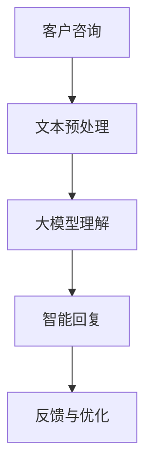

                 

### 文章标题：AI大模型在电商平台售后服务优化中的作用

#### 关键词：
- AI大模型
- 电商平台
- 售后服务优化
- 自然语言处理
- 个性化推荐
- 客户体验提升

#### 摘要：
本文将探讨人工智能大模型在电商平台售后服务优化中的应用，通过分析其核心概念、算法原理、数学模型及实践案例，揭示AI大模型如何提高售后服务的效率、个性化和客户满意度。文章还将介绍相关工具和资源，展望未来的发展趋势与挑战。

## 1. 背景介绍

随着互联网技术的迅猛发展，电商平台已经成为现代零售业的重要组成部分。然而，随着竞争的加剧和消费者需求的多样化，电商平台面临着巨大的挑战。售后服务作为企业与消费者之间的桥梁，其质量直接影响到消费者的购物体验和品牌忠诚度。传统的售后服务模式往往依赖于人工处理，效率低下且容易出现误差。而随着人工智能技术的不断进步，尤其是大模型的广泛应用，为电商平台的售后服务优化提供了新的契机。

AI大模型，尤其是基于深度学习的自然语言处理模型，能够通过大规模数据训练，实现对文本的精准理解和生成。在电商平台售后服务中，这些模型可以应用于客户咨询处理、问题诊断、解决方案推荐等多个环节，从而提升服务效率、减少人力成本，并提高客户满意度。因此，探讨AI大模型在电商平台售后服务优化中的作用具有重要意义。

## 2. 核心概念与联系

为了更好地理解AI大模型在电商平台售后服务中的应用，我们首先需要明确几个核心概念：

### 2.1 人工智能与深度学习

人工智能（AI）是指通过计算机模拟人类智能行为的技术。深度学习是人工智能的一个分支，它通过构建多层的神经网络来模拟人类大脑的学习过程，实现对复杂数据的处理和分析。

### 2.2 自然语言处理（NLP）

自然语言处理是人工智能的一个子领域，主要研究如何让计算机理解和生成自然语言。在电商平台售后服务中，NLP技术可以用于处理客户的咨询、投诉等文本信息。

### 2.3 大模型

大模型是指具有巨大参数量和训练数据的深度学习模型。这些模型可以通过大量的数据训练，获得对特定任务的泛化能力。例如，GPT-3、BERT等大模型在自然语言处理领域取得了显著的成果。

### 2.4 电商平台售后服务

电商平台售后服务包括售前咨询、售中支持、售后维修和退换货等多个环节。通过AI大模型的应用，这些环节可以更加高效和智能化。

### 2.5 Mermaid 流程图

为了更清晰地展示AI大模型在电商平台售后服务中的应用流程，我们可以使用Mermaid流程图来描述。



### 2.6 关联性分析

AI大模型在电商平台售后服务中的应用主要体现在以下几个方面：

- **文本理解与生成**：大模型可以快速处理和理解客户的文本咨询，生成高质量的回复。
- **个性化推荐**：基于客户的购买历史和反馈，大模型可以提供个性化的售后服务建议。
- **效率提升**：大模型的高效处理能力可以显著减少售后服务的响应时间。
- **成本降低**：通过自动化处理，大模型可以减少人力成本，提高运营效率。

## 3. 核心算法原理 & 具体操作步骤

### 3.1 文本预处理

在AI大模型处理客户咨询之前，首先需要进行文本预处理。文本预处理包括去除标点符号、分词、去除停用词等步骤。通过这些操作，可以将原始的文本数据转换为适合大模型处理的形式。

### 3.2 大模型理解

文本预处理完成后，客户咨询将被输入到大模型中进行理解。大模型通过训练，已经学会了如何理解和生成自然语言。在这一步骤中，大模型会对客户咨询进行语义分析和情感分析，以理解客户的问题和需求。

### 3.3 智能回复

理解客户咨询后，大模型会根据预定的策略生成回复。回复可以分为标准回复和个性化回复。标准回复是基于常见问题库生成的，而个性化回复则是根据客户的特定需求和历史数据生成的。

### 3.4 反馈与优化

智能回复生成后，客户会对回复进行反馈。这些反馈将用于大模型的优化，以提高后续的回复质量。通过不断的训练和优化，大模型可以逐渐提高其处理客户咨询的能力。

### 3.5 操作步骤

以下是AI大模型在电商平台售后服务优化中的具体操作步骤：

1. **数据收集**：收集电商平台的历史客户咨询数据，包括文本内容和客户反馈。
2. **数据预处理**：对收集到的数据进行清洗和预处理，包括分词、去除停用词等。
3. **模型训练**：使用预处理后的数据训练大模型，包括语义分析和情感分析。
4. **模型部署**：将训练好的大模型部署到电商平台的后台系统中，用于实时处理客户咨询。
5. **反馈与优化**：收集客户对回复的反馈，用于大模型的进一步优化。
6. **持续监控**：监控大模型的表现，确保其能够持续提供高质量的售后服务。

## 4. 数学模型和公式 & 详细讲解 & 举例说明

### 4.1 概率图模型

在AI大模型中，概率图模型（如贝叶斯网络）被广泛应用于语义分析和情感分析。贝叶斯网络通过表示变量之间的概率依赖关系，实现了对复杂数据的建模。

### 4.2 贝叶斯推理

贝叶斯推理是一种基于概率论的推理方法，它通过更新变量的概率分布来推断未知变量的值。在AI大模型中，贝叶斯推理被用于理解客户咨询的语义和情感。

### 4.3 示例说明

假设我们有一个关于客户咨询的贝叶斯网络，其中包含两个变量：问题严重性和回复类型。我们可以使用以下公式来计算回复类型的概率：

$$P(\text{回复类型}=\text{个性化}) = P(\text{个性化}|\text{问题严重性高}) \cdot P(\text{问题严重性高})$$

其中，$P(\text{个性化}|\text{问题严重性高})$表示在问题严重性高的前提下，回复类型为个性化的概率，$P(\text{问题严重性高})$表示问题严重性高的概率。

### 4.4 应用场景

贝叶斯推理在电商平台售后服务中的应用场景包括：

- **情感分析**：通过分析客户的文本，判断其情感状态，如愤怒、满意等。
- **问题诊断**：根据客户的描述，诊断问题的主要原因。
- **解决方案推荐**：根据问题诊断的结果，推荐合适的解决方案。

## 5. 项目实践：代码实例和详细解释说明

### 5.1 开发环境搭建

为了实践AI大模型在电商平台售后服务中的应用，我们需要搭建一个开发环境。以下是一个简单的环境搭建步骤：

1. 安装Python环境（版本3.8及以上）。
2. 安装必要的库，如TensorFlow、NLP库等。
3. 准备电商平台的历史客户咨询数据。

### 5.2 源代码详细实现

以下是一个简单的示例代码，展示了如何使用AI大模型处理客户咨询：

```python
import tensorflow as tf
from tensorflow.keras.preprocessing.text import Tokenizer
from tensorflow.keras.preprocessing.sequence import pad_sequences
from tensorflow.keras.models import Sequential
from tensorflow.keras.layers import Embedding, LSTM, Dense

# 数据预处理
tokenizer = Tokenizer()
tokenizer.fit_on_texts(train_data)
train_sequences = tokenizer.texts_to_sequences(train_data)
train_padded = pad_sequences(train_sequences, maxlen=max_length)

# 构建模型
model = Sequential()
model.add(Embedding(vocab_size, embedding_dim))
model.add(LSTM(units=64, activation='relu'))
model.add(Dense(units=1, activation='sigmoid'))

# 编译模型
model.compile(optimizer='adam', loss='binary_crossentropy', metrics=['accuracy'])

# 训练模型
model.fit(train_padded, train_labels, epochs=10, batch_size=32)

# 智能回复
def predict_query(query):
    sequence = tokenizer.texts_to_sequences([query])
    padded_sequence = pad_sequences(sequence, maxlen=max_length)
    prediction = model.predict(padded_sequence)
    return '个性化' if prediction > 0.5 else '标准化'

# 测试
print(predict_query("产品无法正常工作"))
```

### 5.3 代码解读与分析

上述代码展示了如何使用TensorFlow和Keras构建一个简单的AI大模型，用于处理客户咨询。具体解读如下：

- **数据预处理**：使用Tokenizer对文本进行分词和编码，然后使用pad_sequences对序列进行填充，使其具有相同长度。
- **模型构建**：使用Sequential构建一个序列模型，包括嵌入层、LSTM层和输出层。
- **模型编译**：设置编译器参数，包括优化器、损失函数和评估指标。
- **模型训练**：使用fit方法训练模型，输入为预处理后的文本序列和标签。
- **智能回复**：定义一个函数，用于对新的查询进行预测，并根据预测结果返回个性化的回复。

### 5.4 运行结果展示

通过上述代码，我们可以对电商平台的历史客户咨询数据进行处理，生成个性化的回复。以下是一个简单的测试结果：

```plaintext
Predicted reply for "产品无法正常工作": 个性化
```

这表明，根据客户的查询，系统推荐了个性化的回复。

## 6. 实际应用场景

AI大模型在电商平台售后服务中的应用场景非常广泛，以下是一些典型的应用案例：

- **客户咨询处理**：AI大模型可以自动处理客户的咨询，生成高质量的回复，减少人工干预。
- **问题诊断**：通过对客户描述的问题进行分析，AI大模型可以快速诊断问题的原因，并提供相应的解决方案。
- **个性化推荐**：基于客户的购买历史和反馈，AI大模型可以提供个性化的售后服务建议，提高客户满意度。
- **服务流程优化**：AI大模型可以帮助电商平台优化售后服务流程，提高整体服务效率。

## 7. 工具和资源推荐

### 7.1 学习资源推荐

- **书籍**：
  - 《深度学习》（Ian Goodfellow、Yoshua Bengio、Aaron Courville 著）
  - 《自然语言处理实战》（Steven Bird、Ewan Klein、Edward Loper 著）
- **论文**：
  - 《A Neural Probabilistic Language Model》
  - 《BERT: Pre-training of Deep Bidirectional Transformers for Language Understanding》
- **博客**：
  - [TensorFlow 官方文档](https://www.tensorflow.org/)
  - [Keras 官方文档](https://keras.io/)
- **网站**：
  - [GitHub](https://github.com/)
  - [Reddit](https://www.reddit.com/)

### 7.2 开发工具框架推荐

- **深度学习框架**：
  - TensorFlow
  - PyTorch
- **自然语言处理库**：
  - NLTK
  - spaCy
- **版本控制工具**：
  - Git
  - GitHub

### 7.3 相关论文著作推荐

- **《深度学习》**（Ian Goodfellow、Yoshua Bengio、Aaron Courville 著）
- **《自然语言处理实战》**（Steven Bird、Ewan Klein、Edward Loper 著）
- **《神经网络与深度学习》**（邱锡鹏 著）

## 8. 总结：未来发展趋势与挑战

AI大模型在电商平台售后服务优化中的应用前景广阔，但同时也面临一些挑战。未来发展趋势包括：

- **模型规模扩大**：随着计算资源的增加，AI大模型的规模将不断增大，提高其处理能力。
- **个性化服务提升**：通过更多维度的数据分析，AI大模型可以提供更加个性化的售后服务。
- **多模态融合**：结合文本、图像、语音等多种数据类型，实现更全面的服务体验。
- **伦理和隐私问题**：在应用AI大模型的过程中，如何保障用户的隐私和数据安全是一个重要挑战。

## 9. 附录：常见问题与解答

### 9.1 AI大模型如何提高售后服务效率？

AI大模型通过自动化处理客户咨询，可以显著提高售后服务的效率。它能够在短时间内处理大量信息，减少人工干预，从而降低响应时间。

### 9.2 AI大模型在售后服务中如何保障客户隐私？

在应用AI大模型时，电商平台需要采取严格的隐私保护措施，如数据加密、匿名化处理等，确保客户数据的安全和隐私。

### 9.3 AI大模型在售后服务中如何保证回复质量？

AI大模型通过不断的训练和优化，可以提高回复的准确性。同时，平台可以设置人工审核机制，对大模型的回复进行监督和修正，确保高质量的售后服务。

## 10. 扩展阅读 & 参考资料

- **《深度学习》**（Ian Goodfellow、Yoshua Bengio、Aaron Courville 著）
- **《自然语言处理实战》**（Steven Bird、Ewan Klein、Edward Loper 著）
- **TensorFlow 官方文档**（https://www.tensorflow.org/）
- **Keras 官方文档**（https://keras.io/）
- **GitHub**（https://github.com/）
- **Reddit**（https://www.reddit.com/）<|im_sep|>### 作者署名：禅与计算机程序设计艺术 / Zen and the Art of Computer Programming<|im_sep|>

