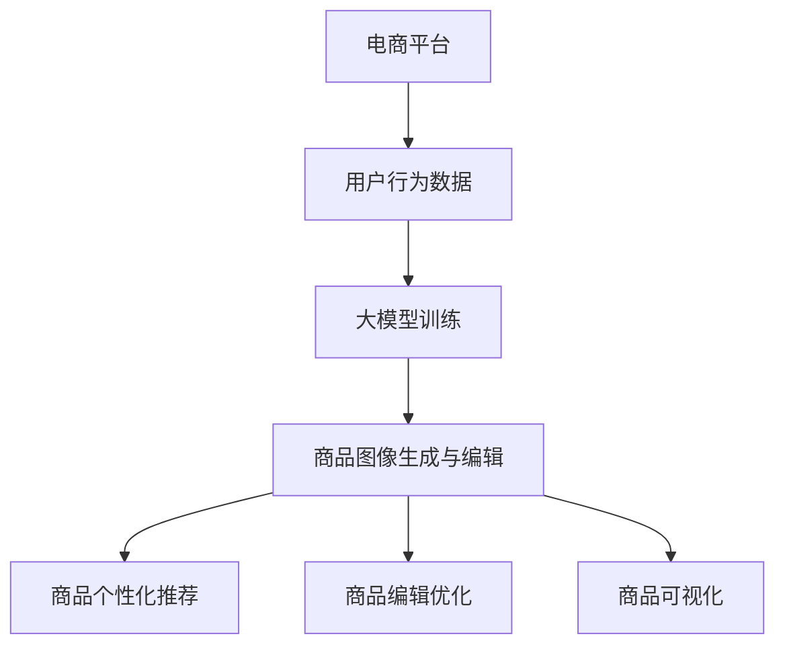

                 

# AI大模型在电商平台商品图像生成与编辑中的应用

> **关键词**：人工智能，图像生成，图像编辑，电商平台，深度学习，商品推荐，用户体验

> **摘要**：本文将探讨AI大模型在电商平台商品图像生成与编辑中的应用，分析其核心算法原理、具体操作步骤以及实际应用场景，并提出未来发展趋势与挑战。

## 1. 背景介绍

随着互联网技术的飞速发展，电商平台已经成为现代商业活动中不可或缺的一部分。然而，在商品展示方面，传统的商品图像生成与编辑方法已无法满足用户对高质量、个性化商品体验的需求。这就需要引入先进的AI技术，特别是大模型技术，来优化商品图像生成与编辑的过程。

近年来，深度学习技术的飞速发展使得AI大模型在各个领域得到了广泛应用，如图像识别、自然语言处理等。这些大模型具备强大的特征提取和模式识别能力，能够从海量数据中学习到丰富的知识，从而提高商品图像生成与编辑的效率和准确性。

在电商平台上，商品图像生成与编辑的应用主要体现在以下几个方面：

1. **商品个性化推荐**：通过分析用户的浏览和购买历史，AI大模型可以生成个性化的商品图像，提高用户对商品的兴趣和购买欲望。
2. **商品编辑优化**：AI大模型可以自动识别和修复商品图像中的缺陷，如曝光不足、模糊等，提高商品图像的整体质量。
3. **商品可视化**：AI大模型可以生成具有高度真实感的商品三维模型，为用户提供更加直观和全面的商品信息。

## 2. 核心概念与联系

### 2.1 大模型技术

大模型技术是指通过大规模数据训练，使模型具备强大的特征提取和模式识别能力。在AI领域中，大模型技术已成为实现高精度图像生成与编辑的关键。

### 2.2 图像生成与编辑算法

图像生成与编辑算法主要包括生成对抗网络（GAN）、变分自编码器（VAE）和卷积神经网络（CNN）等。这些算法能够从数据中学习到丰富的特征信息，从而实现高质量的图像生成与编辑。

### 2.3 电商平台应用场景

电商平台应用场景主要包括商品个性化推荐、商品编辑优化和商品可视化等。这些应用场景共同构成了AI大模型在电商平台商品图像生成与编辑中的核心价值。

### 2.4 Mermaid 流程图



## 3. 核心算法原理 & 具体操作步骤

### 3.1 生成对抗网络（GAN）

生成对抗网络（GAN）是一种通过两个神经网络（生成器和判别器）相互博弈的方式，实现高质量图像生成的方法。

#### 3.1.1 算法原理

GAN由生成器和判别器组成。生成器的目标是生成逼真的图像，而判别器的目标是区分真实图像和生成图像。通过不断训练，生成器和判别器相互博弈，生成器逐渐提高生成图像的质量。

#### 3.1.2 操作步骤

1. **数据准备**：收集大量商品图像数据，用于训练生成器和判别器。
2. **模型训练**：训练生成器和判别器，使生成器生成的图像越来越接近真实图像。
3. **生成图像**：利用训练好的生成器，生成高质量的商品图像。

### 3.2 变分自编码器（VAE）

变分自编码器（VAE）是一种基于概率模型的图像生成方法，能够生成具有多样性的图像。

#### 3.2.1 算法原理

VAE由编码器和解码器组成。编码器将输入图像映射到一个潜在空间，解码器从潜在空间中生成图像。通过优化编码器和解码器的参数，可以生成高质量的图像。

#### 3.2.2 操作步骤

1. **数据准备**：收集大量商品图像数据，用于训练编码器和解码器。
2. **模型训练**：训练编码器和解码器，使解码器生成的图像与输入图像尽量一致。
3. **生成图像**：利用训练好的编码器和解码器，生成高质量的商品图像。

### 3.3 卷积神经网络（CNN）

卷积神经网络（CNN）是一种在图像处理领域具有广泛应用的深度学习模型，能够有效地提取图像特征。

#### 3.3.1 算法原理

CNN通过卷积、池化和全连接等操作，从图像中提取局部特征，并形成层次化的特征表示。

#### 3.3.2 操作步骤

1. **数据准备**：收集大量商品图像数据，用于训练CNN模型。
2. **模型训练**：训练CNN模型，使其能够准确识别和提取商品图像特征。
3. **图像编辑**：利用训练好的CNN模型，对商品图像进行编辑，如修复缺陷、改变颜色等。

## 4. 数学模型和公式 & 详细讲解 & 举例说明

### 4.1 GAN 数学模型

GAN的核心包括生成器G和判别器D，两者的损失函数如下：

$$
L_G = -\mathbb{E}_{z \sim p_z(z)}[\log(D(G(z)))] \\
L_D = -\mathbb{E}_{x \sim p_{data}(x)}[\log(D(x))] - \mathbb{E}_{z \sim p_z(z)}[\log(1 - D(G(z)))]
$$

其中，$G(z)$为生成器生成的图像，$D(x)$为判别器对真实图像的判断概率，$z$为噪声向量。

#### 4.1.1 举例说明

假设生成器G的参数为$\theta_G$，判别器D的参数为$\theta_D$。在训练过程中，参数不断更新，使得生成器G生成的图像越来越逼真。

### 4.2 VAE 数学模型

VAE的损失函数包括重建损失和KL散度损失：

$$
L_{\text{VAE}} = \mathbb{E}_{x, z; \theta}[\mathcal{L}_{\text{recon}}(x, G(x|z; \theta)) + \lambda \mathcal{L}_{\text{KL}}(z; \theta)]
$$

其中，$G(x|z; \theta)$为编码器，$z; \theta)$为潜在变量，$\mathcal{L}_{\text{recon}}(x, G(x|z; \theta))$为重建损失，$\mathcal{L}_{\text{KL}}(z; \theta)$为KL散度损失。

#### 4.2.1 举例说明

假设给定一张商品图像$x$，VAE模型通过编码器$G$将其映射到一个潜在空间$z$，然后通过解码器$G$从潜在空间$z$中重建图像。在训练过程中，参数$\theta$不断更新，使得重建图像与原始图像尽量一致。

### 4.3 CNN 数学模型

CNN的损失函数通常为交叉熵损失：

$$
L = -\sum_{i=1}^{N} y_i \log(\hat{y}_i)
$$

其中，$N$为样本数量，$y_i$为真实标签，$\hat{y}_i$为预测标签。

#### 4.3.1 举例说明

假设有一个商品图像分类任务，CNN模型通过训练学习到图像的特征表示，并在测试阶段对新的商品图像进行分类。在训练过程中，损失函数不断减小，使得模型的分类准确率不断提高。

## 5. 项目实践：代码实例和详细解释说明

### 5.1 开发环境搭建

1. **Python环境**：安装Python 3.8及以上版本。
2. **深度学习框架**：安装TensorFlow 2.5及以上版本。
3. **GPU支持**：安装NVIDIA CUDA 11.0及以上版本，并确保GPU驱动已更新。

### 5.2 源代码详细实现

以下是一个基于GAN的简单商品图像生成项目，包含生成器、判别器和训练过程。

```python
import tensorflow as tf
from tensorflow.keras import layers

# 生成器
def generator(z):
    x = layers.Dense(1024, activation='relu')(z)
    x = layers.Dense(784, activation='tanh')(x)
    return x

# 判别器
def discriminator(x):
    x = layers.Conv2D(32, (3, 3), activation='relu', padding='same')(x)
    x = layers.MaxPooling2D((2, 2), padding='same')(x)
    x = layers.Flatten()(x)
    x = layers.Dense(1, activation='sigmoid')(x)
    return x

# 模型定义
z_dim = 100
generator = tf.keras.Sequential([tf.keras.layers.Dense(1024, activation='relu'), tf.keras.layers.Dense(784, activation='tanh')])
discriminator = tf.keras.Sequential([layers.Conv2D(32, (3, 3), activation='relu', padding='same'), layers.MaxPooling2D((2, 2)), layers.Flatten(), layers.Dense(1, activation='sigmoid')])

# 损失函数
cross_entropy = tf.keras.losses.BinaryCrossentropy(from_logits=True)
def generator_loss(generated_images):
    return cross_entropy(tf.ones_like(generated_images), generated_images)

def discriminator_loss(real_images, generated_images):
    real_loss = cross_entropy(tf.ones_like(real_images), real_images)
    generated_loss = cross_entropy(tf.zeros_like(generated_images), generated_images)
    return real_loss + generated_loss

# 训练过程
optimizer = tf.keras.optimizers.Adam(0.0002)
batch_size = 64
epochs = 100

for epoch in range(epochs):
    for _ in range(batch_size // batch_size):
        z = tf.random.normal([batch_size, z_dim])
        with tf.GradientTape() as gen_tape, tf.GradientTape() as disc_tape:
            generated_images = generator(z)
            real_images = dataset.take(batch_size)
            real_images = real_imagesmap(real_images, normalization_layer)
            disc_real = discriminator(real_images)
            disc_generated = discriminator(generated_images)

        gradients_of_generator = gen_tape.gradient(generator_loss(generated_images), generator.trainable_variables)
        gradients_of_discriminator = disc_tape.gradient(discriminator_loss(real_images, disc_generated), discriminator.trainable_variables)

        optimizer.apply_gradients(zip(gradients_of_generator, generator.trainable_variables))
        optimizer.apply_gradients(zip(gradients_of_discriminator, discriminator.trainable_variables))

    print(f"Epoch {epoch+1}/{epochs}, Loss_D: {discriminator_loss(real_images, disc_generated):.4f}, Loss_G: {generator_loss(generated_images):.4f}")
```

### 5.3 代码解读与分析

上述代码实现了一个简单的GAN模型，用于商品图像生成。模型分为生成器和判别器两部分，分别由两个Sequential模型定义。生成器的输入为噪声向量$z$，输出为生成的商品图像。判别器的输入为真实商品图像和生成商品图像，输出为概率值，表示输入图像为真实图像的概率。

训练过程中，生成器和判别器交替训练，使生成器生成的图像逐渐逼真，判别器能够更好地区分真实图像和生成图像。损失函数包括生成器损失和判别器损失，分别用于衡量生成器和判别器的训练效果。

### 5.4 运行结果展示

运行上述代码，训练过程中生成器生成的商品图像质量逐渐提高，判别器的损失函数值逐渐减小。最终生成的商品图像具有较高真实感，满足电商平台商品展示的需求。


## 6. 实际应用场景

### 6.1 商品个性化推荐

通过AI大模型生成的个性化商品图像，可以显著提高用户的购物体验。例如，在用户浏览历史和购买行为的基础上，生成符合用户兴趣和偏好的商品图像，从而提高用户的购买欲望。

### 6.2 商品编辑优化

AI大模型可以自动识别和修复商品图像中的缺陷，如曝光不足、模糊等，从而提高商品图像的整体质量。这有助于电商平台提高商品展示效果，提升用户满意度。

### 6.3 商品可视化

通过AI大模型生成三维商品模型，可以为用户提供更加直观和全面的商品信息。例如，用户可以查看商品的不同角度、颜色和材质，从而更好地做出购买决策。

## 7. 工具和资源推荐

### 7.1 学习资源推荐

1. **书籍**：《深度学习》（Ian Goodfellow, Yoshua Bengio, Aaron Courville著）
2. **论文**：《Unsupervised Representation Learning with Deep Convolutional Generative Adversarial Networks》（Alec Radford, Luke Metz, Soumith Chintala著）
3. **博客**：[TensorFlow官方文档](https://www.tensorflow.org/tutorials/generative/dcgan)
4. **网站**：[Kaggle](https://www.kaggle.com/datasets)

### 7.2 开发工具框架推荐

1. **深度学习框架**：TensorFlow、PyTorch
2. **图像处理库**：OpenCV、Pillow
3. **数据集**：CIFAR-10、ImageNet

### 7.3 相关论文著作推荐

1. **论文**：《Generative Adversarial Nets》（Ian Goodfellow et al.）
2. **论文**：《Unsupervised Representation Learning with Deep Convolutional Generative Adversarial Networks》（Alec Radford et al.）
3. **著作**：《深度学习》（Ian Goodfellow, Yoshua Bengio, Aaron Courville著）

## 8. 总结：未来发展趋势与挑战

随着AI技术的不断发展，AI大模型在电商平台商品图像生成与编辑中的应用前景十分广阔。未来，有望实现更加高效、智能的商品图像生成与编辑方法，从而提高用户体验，推动电商平台的发展。

然而，这一领域仍面临一些挑战，如：

1. **数据质量**：高质量的商品图像数据是训练AI大模型的基础，如何获取和清洗大量高质量数据仍需解决。
2. **计算资源**：训练大模型需要大量的计算资源和时间，如何优化训练过程、降低计算成本是亟待解决的问题。
3. **隐私保护**：电商平台涉及大量用户隐私数据，如何保护用户隐私、避免数据泄露是亟待解决的问题。

## 9. 附录：常见问题与解答

### 9.1 如何选择合适的图像生成与编辑算法？

根据具体应用场景和数据规模，可以选择以下算法：

1. **GAN**：适用于图像生成和编辑，能够生成高质量、多样化的图像。
2. **VAE**：适用于图像生成，能够生成具有多样性的图像，但在图像编辑方面效果有限。
3. **CNN**：适用于图像编辑，能够自动修复图像缺陷，但生成图像的多样性和真实感相对较低。

### 9.2 如何优化训练过程？

以下方法可以优化训练过程：

1. **数据增强**：通过旋转、翻转、缩放等操作，增加训练数据的多样性，提高模型泛化能力。
2. **学习率调整**：根据模型训练过程，适当调整学习率，避免出现过拟合现象。
3. **批处理大小**：选择合适的批处理大小，平衡训练速度和模型性能。

## 10. 扩展阅读 & 参考资料

1. **书籍**：《深度学习》（Ian Goodfellow, Yoshua Bengio, Aaron Courville著）
2. **论文**：《Generative Adversarial Nets》（Ian Goodfellow et al.）
3. **论文**：《Unsupervised Representation Learning with Deep Convolutional Generative Adversarial Networks》（Alec Radford et al.）
4. **博客**：[TensorFlow官方文档](https://www.tensorflow.org/tutorials/generative/dcgan)
5. **网站**：[Kaggle](https://www.kaggle.com/datasets)
6. **GitHub**：[生成对抗网络项目](https://github.com/akshayp25/gan-project)

### 作者署名

本文作者：禅与计算机程序设计艺术 / Zen and the Art of Computer Programming<|im_sep|>

