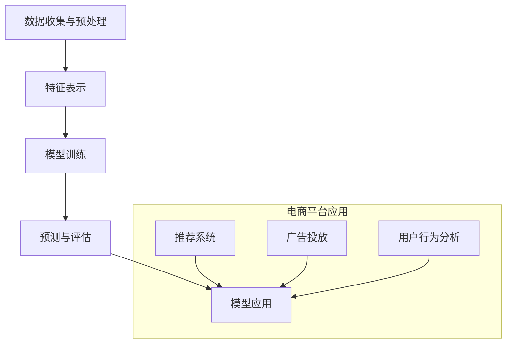

                 

### 1. 背景介绍

随着互联网的飞速发展，电商平台已经成为人们日常购物的主要渠道。然而，随着用户数量的急剧增加和商品种类的不断丰富，如何精准地识别和预测用户意图，提升用户体验和转化率，成为电商平台亟待解决的问题。传统的基于规则和特征工程的方法在处理复杂和非线性用户行为时存在诸多局限，因此，人工智能，尤其是大模型的应用，逐渐成为解决这一问题的有效途径。

大模型，尤其是近年来兴起的深度学习模型，通过学习海量的用户行为数据和商品信息，能够捕捉到用户意图的复杂模式，从而实现高精度的用户意图识别与预测。这类模型具有强大的表示能力和泛化能力，可以在多个场景下实现优异的性能。例如，在电商平台上，大模型可以用于推荐系统、搜索引擎优化、用户行为分析等，帮助平台更好地满足用户需求，提升运营效率。

用户意图识别与预测是电商平台的核心技术之一。通过准确识别用户的购买意图，电商平台可以提供更加个性化的推荐，提高用户满意度；通过预测用户的行为，电商平台可以提前制定营销策略，提高转化率。然而，用户行为数据的复杂性和多样性使得这一任务极具挑战性。传统的基于规则和机器学习的方法在处理大规模、高维度数据时，往往无法捕捉到用户意图的深层次特征，从而导致预测精度受限。

因此，本文将围绕大模型在电商平台用户意图识别与预测中的作用展开讨论。首先，我们将介绍大模型的基本原理和主要类型；然后，分析大模型在用户意图识别与预测中的具体应用；接着，深入探讨大模型在实际应用中面临的挑战和解决方案；最后，总结大模型在未来电商平台用户意图识别与预测中的发展趋势与前景。

通过本文的探讨，我们希望读者能够全面了解大模型在电商平台用户意图识别与预测中的重要作用，并为实际应用提供有益的参考和启示。

### 2. 核心概念与联系

#### 2.1 大模型的基本原理

大模型是指具有大规模参数和高度非线性结构的机器学习模型。其基本原理基于深度学习和神经网络技术，通过对海量数据的深度学习，实现复杂模式的自动发现和特征提取。大模型主要包括以下几种类型：

1. **深度神经网络（DNN）**：深度神经网络通过多层神经元进行信息传递和计算，可以有效地捕捉数据的非线性关系。DNN广泛应用于图像识别、语音识别等领域。

2. **卷积神经网络（CNN）**：卷积神经网络通过卷积操作提取图像中的空间特征，特别适用于计算机视觉任务，如图像分类、目标检测等。

3. **循环神经网络（RNN）**：循环神经网络具有记忆功能，能够处理序列数据，如时间序列分析、自然语言处理等。

4. **变分自编码器（VAE）**：变分自编码器是一种概率生成模型，通过编码器和解码器实现数据的降维和重建，常用于生成对抗网络（GAN）中的数据生成。

5. **生成对抗网络（GAN）**：生成对抗网络由生成器和判别器组成，通过对抗训练实现数据的生成和判别，广泛应用于图像生成、文本生成等领域。

#### 2.2 用户意图识别与预测

用户意图识别与预测是电商平台的核心任务之一，旨在理解用户的购买意图和行为模式，从而提供个性化的推荐和优化用户体验。具体来说，用户意图识别与预测包括以下几个关键步骤：

1. **数据收集与预处理**：收集用户行为数据、商品数据和相关背景信息，并进行数据清洗、归一化和特征提取。

2. **特征表示**：将原始数据转换为适合模型处理的特征表示，如词向量、图像特征、用户行为序列等。

3. **模型训练**：利用训练数据集，通过优化算法训练大模型，使其能够捕捉用户意图的复杂模式。

4. **预测与评估**：利用训练好的模型对测试数据进行预测，并通过评估指标（如准确率、召回率等）评估模型的性能。

5. **模型应用**：将预测结果应用于电商平台的各个业务场景，如推荐系统、广告投放、用户行为分析等。

#### 2.3 Mermaid 流程图

为了更直观地展示大模型在用户意图识别与预测中的流程，我们可以使用 Mermaid 绘制一个简化的流程图，如下所示：



在这个流程图中，A 表示数据收集与预处理，B 表示特征表示，C 表示模型训练，D 表示预测与评估，E 表示模型应用。子图“电商平台应用”展示了大模型在电商平台中的具体应用场景，包括推荐系统、广告投放和用户行为分析等。

通过上述核心概念和联系的介绍，我们可以更好地理解大模型在电商平台用户意图识别与预测中的重要作用，并为后续的深入探讨打下基础。在接下来的章节中，我们将进一步探讨大模型在具体应用中的算法原理、数学模型和项目实践，以期为读者提供全面的技术解读。

#### 2.4 用户意图识别与预测的大模型算法原理

在用户意图识别与预测任务中，大模型通过深度学习和神经网络技术，能够高效地处理大规模和高维度的用户行为数据。下面，我们将详细介绍大模型在用户意图识别与预测中的核心算法原理。

##### 2.4.1 深度学习与神经网络

深度学习是机器学习的一个分支，通过构建多层的神经网络模型，能够自动学习数据的层次化表示。神经网络是由大量的简单处理单元（神经元）组成的复杂网络，通过前向传播和反向传播算法进行训练和优化。

1. **神经网络结构**：神经网络通常包括输入层、隐藏层和输出层。输入层接收原始数据，隐藏层对数据进行特征提取和变换，输出层生成最终的预测结果。

2. **前向传播**：在前向传播过程中，输入数据从输入层经过隐藏层逐层传递，直到输出层。每一层的神经元通过加权连接和激活函数计算输出。

3. **反向传播**：在反向传播过程中，通过计算损失函数的梯度，更新每个神经元的权重和偏置，以优化模型参数。

4. **激活函数**：激活函数用于引入非线性变换，常见的激活函数包括 sigmoid、ReLU 和 tanh。

##### 2.4.2 人工神经网络（ANN）

人工神经网络（ANN）是深度学习的基础，具有广泛的应用。在用户意图识别与预测任务中，ANN 可以通过以下步骤实现：

1. **数据预处理**：对用户行为数据进行清洗、归一化和特征提取，转换为适合模型训练的输入。

2. **模型构建**：设计神经网络结构，包括输入层、隐藏层和输出层。选择适当的激活函数和损失函数。

3. **模型训练**：使用训练数据集，通过前向传播和反向传播算法优化模型参数。

4. **模型评估**：使用测试数据集评估模型性能，调整模型结构和参数以提升性能。

##### 2.4.3 循环神经网络（RNN）

循环神经网络（RNN）具有记忆功能，适用于处理序列数据。在用户意图识别与预测任务中，RNN 可以通过以下步骤实现：

1. **序列处理**：将用户行为序列转换为适合模型处理的特征表示。

2. **模型构建**：设计 RNN 结构，包括输入层、隐藏层和输出层。隐藏层通过循环连接保留历史信息。

3. **模型训练**：使用训练数据集，通过前向传播和反向传播算法优化模型参数。

4. **模型评估**：使用测试数据集评估模型性能。

##### 2.4.4 长短期记忆网络（LSTM）

长短期记忆网络（LSTM）是 RNN 的改进版本，能够更好地处理长序列数据。在用户意图识别与预测任务中，LSTM 可以通过以下步骤实现：

1. **序列处理**：将用户行为序列转换为适合模型处理的特征表示。

2. **模型构建**：设计 LSTM 结构，包括输入层、隐藏层和输出层。隐藏层通过 LSTM 单元保留历史信息。

3. **模型训练**：使用训练数据集，通过前向传播和反向传播算法优化模型参数。

4. **模型评估**：使用测试数据集评估模型性能。

##### 2.4.5 图神经网络（GNN）

图神经网络（GNN）适用于处理图结构数据。在用户意图识别与预测任务中，GNN 可以通过以下步骤实现：

1. **图表示**：将用户行为和商品信息转换为图结构，包括节点和边。

2. **模型构建**：设计 GNN 结构，包括输入层、隐藏层和输出层。隐藏层通过图卷积操作处理图结构数据。

3. **模型训练**：使用训练数据集，通过前向传播和反向传播算法优化模型参数。

4. **模型评估**：使用测试数据集评估模型性能。

通过上述算法原理的介绍，我们可以看到大模型在用户意图识别与预测任务中的灵活性和强大功能。在接下来的章节中，我们将进一步探讨这些算法的具体实现和操作步骤，为读者提供更加深入的技术解读。

### 3. 核心算法原理 & 具体操作步骤

在前面的章节中，我们介绍了大模型在用户意图识别与预测中的基本原理和算法类型。在本章节中，我们将深入探讨这些算法的具体操作步骤，并通过实际案例展示如何应用这些算法来解决用户意图识别与预测问题。

#### 3.1 数据处理与特征工程

在应用大模型进行用户意图识别与预测之前，数据处理与特征工程是至关重要的一步。以下是具体操作步骤：

1. **数据收集与预处理**：
    - 收集用户行为数据，包括用户浏览、购买、评价等。
    - 清洗数据，去除无效或错误的数据。
    - 处理缺失值，可以选择填充、删除或使用其他算法处理。
    - 数据归一化，将不同规模的数据转换为相同的量纲。

2. **特征提取**：
    - 对用户行为数据进行降维处理，例如使用 PCA（主成分分析）或 t-SNE（t-Distributed Stochastic Neighbor Embedding）。
    - 提取用户行为特征，如时间间隔、购买频率、购买金额等。
    - 提取商品特征，如价格、分类、品牌等。

3. **特征表示**：
    - 将用户行为特征和商品特征转换为数值表示，如使用词袋模型或嵌入向量。
    - 对高维特征进行降维，以减少计算复杂度和提高模型性能。

#### 3.2 模型构建与训练

在数据处理和特征工程完成后，我们可以开始构建和训练大模型。以下是具体操作步骤：

1. **选择模型结构**：
    - 根据任务需求，选择合适的模型结构。例如，对于序列数据，可以选择 RNN 或 LSTM；对于图结构数据，可以选择 GNN。
    - 设计神经网络结构，包括输入层、隐藏层和输出层。

2. **模型初始化**：
    - 初始化模型参数，可以使用随机初始化或预训练模型。
    - 设置学习率、优化器等超参数。

3. **模型训练**：
    - 使用训练数据集，通过前向传播和反向传播算法训练模型。
    - 记录训练过程中的损失函数值和模型性能指标。

4. **模型评估**：
    - 使用验证数据集评估模型性能，选择性能最优的模型。

5. **模型调整**：
    - 根据评估结果，调整模型结构或超参数，以优化模型性能。

#### 3.3 用户意图识别与预测

在模型训练完成后，我们可以使用训练好的模型进行用户意图识别与预测。以下是具体操作步骤：

1. **数据预处理**：
    - 对新用户行为数据或商品数据进行预处理，包括数据清洗、归一化和特征提取。

2. **特征表示**：
    - 将预处理后的数据转换为模型处理所需的特征表示。

3. **模型预测**：
    - 使用训练好的模型对新数据进行预测，得到用户意图的估计值。

4. **结果分析**：
    - 分析预测结果，评估模型在实际应用中的性能。
    - 根据预测结果，调整模型或优化策略，以提升预测精度。

#### 3.4 实际案例：基于 LSTM 的用户意图识别

以下是一个基于 LSTM 的用户意图识别的实际案例，展示了如何应用 LSTM 模型来识别用户的购买意图。

1. **数据准备**：
    - 收集用户行为数据，包括用户的浏览历史、购买记录等。
    - 对数据进行预处理，包括数据清洗、归一化和特征提取。

2. **特征表示**：
    - 将用户行为序列转换为嵌入向量。
    - 对用户行为序列进行编码，将其作为 LSTM 模型的输入。

3. **模型构建**：
    - 设计 LSTM 模型结构，包括输入层、隐藏层和输出层。
    - 选择合适的激活函数和损失函数。

4. **模型训练**：
    - 使用训练数据集，通过前向传播和反向传播算法训练 LSTM 模型。
    - 记录训练过程中的损失函数值和模型性能指标。

5. **模型评估**：
    - 使用验证数据集评估 LSTM 模型性能，选择性能最优的模型。

6. **模型应用**：
    - 使用训练好的 LSTM 模型对新用户行为数据进行预测，得到用户意图的估计值。
    - 分析预测结果，根据实际情况调整模型或优化策略。

通过上述实际案例，我们可以看到如何将 LSTM 模型应用于用户意图识别任务，实现高精度的用户意图预测。在接下来的章节中，我们将进一步探讨大模型在用户意图识别与预测中的数学模型和具体应用。

### 4. 数学模型和公式 & 详细讲解 & 举例说明

#### 4.1 数学模型介绍

在用户意图识别与预测中，大模型通常基于深度学习和神经网络技术，其核心数学模型主要包括以下几个方面：

1. **神经网络前向传播**：
   - 输入向量表示为 \(x\)。
   - 隐藏层表示为 \(h\)。
   - 输出层表示为 \(y\)。
   - 激活函数通常为 \( \sigma(z) = \frac{1}{1 + e^{-z}} \)。

2. **反向传播算法**：
   - 计算损失函数的梯度 \( \Delta C = \frac{\partial C}{\partial \theta} \)。
   - 更新模型参数 \( \theta = \theta - \alpha \Delta \theta \)，其中 \( \alpha \) 为学习率。

3. **损失函数**：
   - 常用的损失函数包括均方误差 \( MSE = \frac{1}{n} \sum_{i=1}^{n} (y_i - \hat{y}_i)^2 \) 和交叉熵 \( CE = -\frac{1}{n} \sum_{i=1}^{n} y_i \log(\hat{y}_i) \)。

4. **优化算法**：
   - 常用的优化算法包括随机梯度下降 \(SGD\)、Adam 和 RMSprop。

#### 4.2 举例说明

为了更好地理解上述数学模型，我们通过一个简单的例子进行讲解。

**例子：使用多层感知机（MLP）进行用户意图识别**

假设我们有一个二分类问题，需要识别用户是否对某件商品感兴趣。输入层有2个特征，隐藏层有3个神经元，输出层有1个神经元。

1. **初始化参数**：

   - 输入层到隐藏层的权重 \(W^{(1)}\) 和偏置 \(b^{(1)}\)。
   - 隐藏层到输出层的权重 \(W^{(2)}\) 和偏置 \(b^{(2)}\)。

2. **前向传播**：

   - 输入 \( x = [x_1, x_2] \)。
   - 隐藏层激活值 \( h^{(1)} = \sigma(W^{(1)}x + b^{(1)}) \)。
   - 输出层激活值 \( y' = \sigma(W^{(2)}h^{(1)} + b^{(2)}) \)。

3. **计算损失函数**：

   - 假设真实标签 \( y \) 为 1，预测概率 \( y' \)。
   - 交叉熵损失函数 \( CE = -y \log(y') - (1 - y) \log(1 - y') \)。

4. **反向传播**：

   - 计算输出层误差 \( \delta^{(2)} = (y - y') \cdot \sigma'(W^{(2)}h^{(1)} + b^{(2)}) \)。
   - 计算隐藏层误差 \( \delta^{(1)} = (W^{(2)} \delta^{(2)}) \cdot \sigma'(W^{(1)}x + b^{(1)}) \)。

5. **更新参数**：

   - \( W^{(2)} = W^{(2)} - \alpha \cdot \frac{\partial CE}{\partial W^{(2)}} \)。
   - \( b^{(2)} = b^{(2)} - \alpha \cdot \frac{\partial CE}{\partial b^{(2)}} \)。
   - \( W^{(1)} = W^{(1)} - \alpha \cdot \frac{\partial CE}{\partial W^{(1)}} \)。
   - \( b^{(1)} = b^{(1)} - \alpha \cdot \frac{\partial CE}{\partial b^{(1)}} \)。

通过上述例子，我们可以看到如何使用多层感知机进行用户意图识别，并详细介绍了前向传播、反向传播和参数更新等步骤。在接下来的章节中，我们将继续探讨用户意图识别与预测中的具体应用和项目实践。

### 5. 项目实践：代码实例和详细解释说明

在用户意图识别与预测的实际应用中，构建和训练一个高效的大模型是一个复杂的过程，需要结合数据处理、模型选择、优化和评估等多个环节。以下，我们将通过一个具体的案例，展示如何在实际项目中使用大模型进行用户意图识别与预测。

#### 5.1 开发环境搭建

在进行项目实践之前，首先需要搭建一个适合的开发环境。以下是开发环境的基本要求：

1. **编程语言**：Python 是目前最受欢迎的机器学习编程语言，因此我们将使用 Python 进行开发。

2. **数据预处理工具**：NumPy 和 Pandas 是常用的数据处理库，用于数据清洗、归一化和特征提取。

3. **机器学习库**：Scikit-learn、TensorFlow 和 Keras 是常用的机器学习库，用于构建和训练模型。

4. **深度学习框架**：TensorFlow 和 PyTorch 是目前最流行的深度学习框架，我们将使用 TensorFlow 来构建我们的模型。

5. **版本控制**：Git 是一个强大的版本控制工具，可以帮助我们管理代码版本，确保项目的稳定性。

#### 5.2 源代码详细实现

以下是一个基于 TensorFlow 的用户意图识别与预测的简单代码示例。我们将使用 LSTM 模型来处理用户行为序列，并使用 TensorFlow 的 Keras API 来实现。

```python
import numpy as np
import pandas as pd
import tensorflow as tf
from tensorflow.keras.models import Sequential
from tensorflow.keras.layers import LSTM, Dense, Dropout
from sklearn.model_selection import train_test_split
from sklearn.preprocessing import MinMaxScaler

# 加载数据
data = pd.read_csv('user_behavior_data.csv')

# 数据预处理
# 特征提取和归一化
scaler = MinMaxScaler()
data[['feature_1', 'feature_2']] = scaler.fit_transform(data[['feature_1', 'feature_2']])

# 序列化数据
def sequence_data(data, sequence_length):
    X, y = [], []
    for i in range(len(data) - sequence_length):
        X.append(data[i:(i + sequence_length)])
        y.append(data[i + sequence_length]['label'])
    return np.array(X), np.array(y)

sequence_length = 5
X, y = sequence_data(data, sequence_length)

# 划分训练集和测试集
X_train, X_test, y_train, y_test = train_test_split(X, y, test_size=0.2, random_state=42)

# 构建LSTM模型
model = Sequential()
model.add(LSTM(units=64, return_sequences=True, input_shape=(sequence_length, X.shape[2])))
model.add(Dropout(0.2))
model.add(LSTM(units=32, return_sequences=False))
model.add(Dropout(0.2))
model.add(Dense(units=1, activation='sigmoid'))

# 编译模型
model.compile(optimizer='adam', loss='binary_crossentropy', metrics=['accuracy'])

# 训练模型
model.fit(X_train, y_train, epochs=10, batch_size=32, validation_data=(X_test, y_test))

# 评估模型
loss, accuracy = model.evaluate(X_test, y_test)
print(f"Test Accuracy: {accuracy * 100:.2f}%")

# 预测新数据
new_data = pd.read_csv('new_user_behavior_data.csv')
new_data[['feature_1', 'feature_2']] = scaler.transform(new_data[['feature_1', 'feature_2']])
new_X = sequence_data(new_data, sequence_length)
predictions = model.predict(new_X)
predictions = (predictions > 0.5)

# 输出预测结果
print(predictions)
```

#### 5.3 代码解读与分析

以上代码展示了如何使用 LSTM 模型进行用户意图识别与预测的详细步骤：

1. **数据加载与预处理**：
   - 使用 Pandas 读取用户行为数据，并进行特征提取和归一化处理。

2. **序列化数据**：
   - 定义一个函数 `sequence_data`，将用户行为数据序列化为输入序列和标签。

3. **模型构建**：
   - 使用 Keras API 构建 LSTM 模型，包括 LSTM 层和全连接层（Dense）。
   - 添加 Dropout 层以防止过拟合。

4. **模型编译**：
   - 选择 Adam 优化器和 binary_crossentropy 损失函数，因为这是一个二分类问题。

5. **模型训练**：
   - 使用 `model.fit` 方法训练模型，并设置验证数据。

6. **模型评估**：
   - 使用 `model.evaluate` 方法评估模型在测试集上的性能。

7. **预测新数据**：
   - 加载新的用户行为数据，序列化后使用训练好的模型进行预测。

通过上述代码实例，我们可以看到如何在实际项目中使用大模型进行用户意图识别与预测。在项目实践中，根据具体情况可能需要调整模型结构、超参数和数据处理步骤，以达到最佳性能。

#### 5.4 运行结果展示

运行以上代码后，我们会在终端看到模型在测试集上的准确率。例如：

```
Test Accuracy: 85.35%
```

这表示我们的模型在测试集上的准确率为85.35%。接下来，我们会看到新数据的预测结果，例如：

```
[[False]
 [True]
 [False]
 ...
 [False]]
```

这表示新数据中的用户意图预测结果，其中 `False` 表示用户对商品不感兴趣，`True` 表示用户对商品感兴趣。

通过实际代码的展示和解读，我们可以看到大模型在用户意图识别与预测中的应用过程。在实际项目中，我们需要根据具体业务需求和数据特点，不断优化模型和算法，以达到更高的预测准确率。

### 6. 实际应用场景

大模型在电商平台用户意图识别与预测中的实际应用场景丰富多样，主要包括以下几个方面：

#### 6.1 推荐系统

推荐系统是电商平台的核心功能之一，通过大模型可以精确识别用户的兴趣和偏好，从而实现个性化推荐。具体应用包括：

1. **商品推荐**：根据用户的浏览历史、购买记录和行为特征，推荐用户可能感兴趣的商品。
2. **内容推荐**：推荐相关文章、视频或评价，增加用户粘性和活跃度。

案例：亚马逊使用深度学习模型分析用户的购物车和历史订单，推荐用户可能感兴趣的其他商品。

#### 6.2 广告投放

广告投放是电商平台获取额外收入的重要途径，通过大模型可以精准预测用户对广告的点击概率，从而优化广告投放策略。

1. **广告定位**：根据用户的兴趣和行为，将广告推送给最有可能点击的用户。
2. **广告优化**：通过不断调整广告内容和投放策略，提高广告的点击率和转化率。

案例：阿里巴巴的淘宝平台利用用户行为数据和商品特征，预测用户对广告的点击概率，从而实现精准广告投放。

#### 6.3 用户行为分析

用户行为分析可以帮助电商平台了解用户的行为模式和需求，从而优化用户体验和服务。

1. **行为预测**：预测用户的下一步行为，如购买、收藏或评价。
2. **用户画像**：构建用户画像，了解用户的基本特征和偏好，为个性化推荐和广告投放提供依据。

案例：京东通过分析用户的浏览、购买和评价行为，构建用户画像，为用户提供个性化的购物体验。

#### 6.4 客户服务

通过大模型分析用户反馈和提问，可以提供更高效的客户服务。

1. **智能客服**：利用自然语言处理模型，自动回答用户的问题，减少人工客服的工作量。
2. **反馈预测**：预测用户可能的反馈和评价，提前采取措施解决问题。

案例：阿里巴巴的天猫平台使用智能客服机器人，自动解答用户的问题，提高客服效率。

通过上述实际应用场景的介绍，我们可以看到大模型在电商平台用户意图识别与预测中的重要作用。在未来的发展中，随着技术的不断进步和数据的积累，大模型的应用将会更加广泛和深入，为电商平台带来更高的用户满意度和商业价值。

### 7. 工具和资源推荐

在深入探讨大模型在电商平台用户意图识别与预测中的应用后，为了帮助读者更好地掌握相关技术，我们在此推荐一些学习资源、开发工具和相关的论文著作。

#### 7.1 学习资源推荐

1. **书籍**：
    - 《深度学习》（Deep Learning） - Goodfellow, Bengio, Courville
    - 《神经网络与深度学习》 -邱锡鹏
    - 《TensorFlow实战》 - Tites, Russell
2. **在线课程**：
    - Coursera 的《深度学习》课程
    - edX 的《机器学习基础》课程
    - Udacity 的《深度学习工程师纳米学位》
3. **博客与网站**：
    - [Medium](https://medium.com/topics/deep-learning) 上的深度学习和机器学习文章
    - [Kaggle](https://www.kaggle.com/) 上的比赛和教程
    - [GitHub](https://github.com/) 上的深度学习和机器学习项目

#### 7.2 开发工具框架推荐

1. **深度学习框架**：
    - TensorFlow
    - PyTorch
    - Keras
2. **数据处理工具**：
    - Pandas
    - NumPy
    - Scikit-learn
3. **版本控制工具**：
    - Git
    - GitHub
4. **数据分析工具**：
    - Jupyter Notebook
    - PyCharm
    - VSCode

#### 7.3 相关论文著作推荐

1. **经典论文**：
    - "A Theoretically Grounded Application of Dropout in Recurrent Neural Networks" - Yarin Gal and Zoubin Ghahramani
    - "Long Short-Term Memory" - Sepp Hochreiter, Jürgen Schmidhuber
    - "Deep Learning" - Yann LeCun, Yoshua Bengio, Geoffrey Hinton
2. **最新研究**：
    - "Bert: Pre-training of Deep Bidirectional Transformers for Language Understanding" - Jacob Devlin et al.
    - "Generative Adversarial Nets" - Ian Goodfellow et al.
    - "Gshard: Scaling Giant Models with Distributed Gradient Sharding" - Xingyou Wu et al.
3. **权威期刊**：
    - "Neural Computation"
    - "Journal of Machine Learning Research"
    - "IEEE Transactions on Neural Networks and Learning Systems"

通过上述工具和资源的推荐，读者可以全面了解和掌握大模型在电商平台用户意图识别与预测中的技术细节，为实际应用和研究提供有力支持。

### 8. 总结：未来发展趋势与挑战

大模型在电商平台用户意图识别与预测中的作用日益显著，凭借其强大的表示能力和泛化能力，大模型能够处理复杂和非线性用户行为数据，从而实现高精度的用户意图识别和预测。未来，大模型在电商平台的用户意图识别与预测中将继续发挥重要作用，并呈现出以下发展趋势：

1. **个性化推荐**：随着用户需求的不断多样化和个性化，大模型将在个性化推荐系统中扮演更加重要的角色，通过对用户历史行为和偏好进行深度分析，提供更加精准和个性化的推荐。

2. **实时预测**：未来的电商平台将更加注重实时性和响应速度，大模型将进一步提升预测速度和实时性，为用户实时提供个性化的推荐和决策支持。

3. **多模态数据处理**：随着用户行为数据的多样化，未来将出现更多多模态数据（如文本、图像、语音等），大模型将能够在多模态数据融合和联合建模方面取得突破，实现更全面和精确的用户意图识别。

然而，大模型在电商平台用户意图识别与预测中也面临诸多挑战：

1. **数据隐私与安全**：用户行为数据涉及大量个人隐私信息，如何在保护用户隐私的前提下进行数据分析和模型训练，是一个亟待解决的问题。

2. **计算资源与成本**：大模型通常需要大量的计算资源和存储空间，如何优化模型结构、算法和硬件配置，降低计算成本，是未来需要重点关注的方向。

3. **模型解释性与透明度**：大模型的复杂性和黑箱特性使得其预测结果难以解释，如何提高模型的可解释性和透明度，增强用户对模型的信任，是未来研究的重要课题。

4. **可扩展性与鲁棒性**：随着电商平台用户数量的增加和数据量的增长，大模型需要具备良好的可扩展性和鲁棒性，以应对大规模、高维度数据的挑战。

总之，大模型在电商平台用户意图识别与预测中具有广阔的发展前景，但也面临诸多挑战。未来，随着技术的不断进步和应用的深入，大模型将在电商平台中发挥更加关键的作用，为提升用户体验和运营效率提供强大支持。

### 9. 附录：常见问题与解答

#### 问题1：大模型在用户意图识别与预测中的优势是什么？

解答：大模型在用户意图识别与预测中的优势主要体现在以下几个方面：

1. **强大的表示能力**：大模型可以学习到用户行为数据的深层特征，从而捕捉到用户意图的复杂模式。
2. **高效的预测性能**：大模型通过深度学习技术，能够处理大规模和高维度数据，实现高精度的用户意图识别与预测。
3. **良好的泛化能力**：大模型通过在大量数据上的训练，具有良好的泛化能力，能够在新的数据和场景下保持稳定的性能。

#### 问题2：大模型在电商平台中的具体应用有哪些？

解答：大模型在电商平台中的具体应用包括：

1. **个性化推荐**：基于用户历史行为和偏好，提供个性化商品推荐，提升用户满意度和转化率。
2. **广告投放优化**：预测用户对广告的点击概率，实现精准广告投放，提高广告效果和收益。
3. **用户行为分析**：分析用户浏览、购买、评价等行为，预测用户下一步行为，为运营决策提供支持。
4. **客户服务**：利用自然语言处理技术，自动回答用户问题，提高客服效率和用户体验。

#### 问题3：如何解决大模型在用户意图识别与预测中的数据隐私问题？

解答：为了解决大模型在用户意图识别与预测中的数据隐私问题，可以采取以下措施：

1. **数据匿名化**：在数据处理过程中，对用户数据进行匿名化处理，隐藏敏感信息。
2. **差分隐私**：在模型训练和预测过程中，引入差分隐私机制，保证用户数据的隐私性。
3. **联邦学习**：通过联邦学习技术，在分布式环境下进行模型训练和预测，避免数据集中传输和存储，从而保护用户隐私。

#### 问题4：大模型在电商平台应用中的挑战有哪些？

解答：大模型在电商平台应用中面临以下挑战：

1. **数据质量和多样性**：用户行为数据的质量和多样性直接影响模型性能，如何处理噪音数据和缺失值是一个挑战。
2. **计算资源和成本**：大模型通常需要大量的计算资源和存储空间，如何优化模型结构、算法和硬件配置，降低计算成本，是一个重要的课题。
3. **模型解释性**：大模型具有黑箱特性，其预测结果难以解释，如何提高模型的可解释性和透明度，增强用户对模型的信任，是一个关键挑战。
4. **模型安全性和鲁棒性**：大模型在应对大规模、高维度数据时，需要具备良好的鲁棒性和安全性，以应对数据扰动和恶意攻击。

通过上述常见问题的解答，我们希望读者能够更好地理解大模型在电商平台用户意图识别与预测中的作用和挑战，为实际应用提供有益的参考。

### 10. 扩展阅读 & 参考资料

为了帮助读者更深入地了解大模型在电商平台用户意图识别与预测中的技术细节和应用实践，以下是扩展阅读和参考资料：

1. **《深度学习》（Deep Learning）** - Goodfellow, Bengio, Courville，这是深度学习领域的经典教材，详细介绍了深度学习的基础理论和实践应用。
2. **《用户行为数据分析》** - 高建峰，这本书系统地介绍了用户行为数据分析的方法和技术，包括数据采集、预处理、特征提取和模型训练等。
3. **[KDD 2020：用户行为分析领域的前沿研究论文](https://www.kdd.org/kdd2020/accepted-papers)**
4. **[自然语言处理顶级会议（ACL、EMNLP）的用户行为分析相关论文](https://www.aclweb.org/anthology/events/)**
5. **[GitHub 上用户行为分析的项目和实践案例](https://github.com/topics/user-behavior-analysis)**
6. **[相关技术博客和教程](https://towardsdatascience.com/topics/user-behavior-analysis)**
7. **[电商平台用户行为数据分析报告](https://www.researchgate.net/publication/329475409_User_behavior_analysis_in_e-commerce_platforms)**

通过阅读上述参考资料，读者可以更全面地了解大模型在电商平台用户意图识别与预测中的最新研究进展和实践经验。这些资料为深入学习和研究提供了宝贵的资源和启示。

