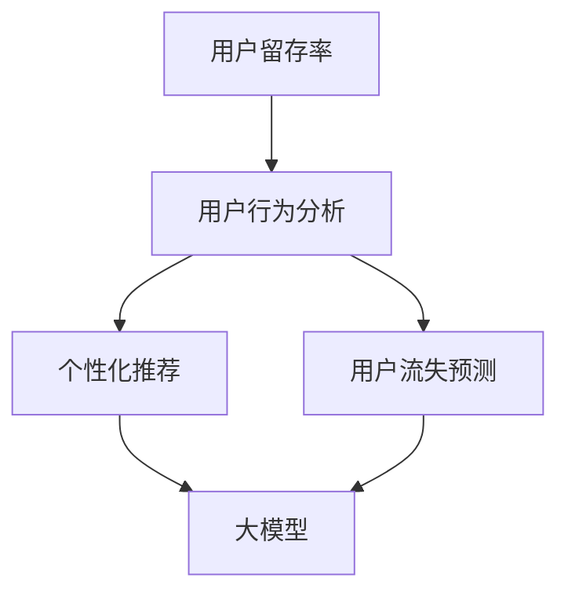

                 

### 1. 背景介绍

在当今数字化的时代，电商平台已成为人们日常购物的重要渠道。然而，随着市场竞争的加剧，电商平台面临的挑战也愈发严峻，其中一个关键问题便是如何提高用户留存率。用户留存率的高低直接关系到平台的长期发展和盈利能力，因此，如何有效提升用户留存成为各大电商平台亟需解决的核心问题。

近年来，人工智能（AI）技术的飞速发展，尤其是大模型（Large Model）技术的突破，为电商平台用户留存策略带来了全新的解决方案。大模型，如GPT-3、BERT等，具有强大的数据处理和分析能力，能够从海量用户数据中挖掘出有价值的信息，从而为电商平台提供个性化的服务，提高用户满意度和留存率。

本文将围绕AI大模型在电商平台用户留存策略中的应用展开讨论，旨在通过逐步分析推理的方式，探讨大模型如何应用于用户行为分析、个性化推荐、用户流失预测等关键环节，为电商平台提供有效的用户留存解决方案。

### 2. 核心概念与联系

在深入探讨AI大模型在电商平台用户留存策略中的应用之前，我们首先需要理解一些核心概念和它们之间的关系。以下将介绍本文将涉及的关键概念，并使用Mermaid流程图展示它们之间的联系。

#### 2.1  关键概念

1. **用户留存率**：用户留存率是指在一定时间内，持续使用平台服务的用户占总用户数的比例。它是衡量平台用户活跃度和用户满意度的关键指标。

2. **大模型（Large Model）**：大模型是指具有数十亿甚至千亿级参数的深度学习模型。这些模型通过在海量数据上进行训练，能够模拟人类的思维和语言能力，具备强大的数据处理和分析能力。

3. **用户行为分析**：用户行为分析是指通过对用户在平台上的行为数据（如点击、浏览、购买等）进行分析，挖掘用户的兴趣和需求。

4. **个性化推荐**：个性化推荐是指根据用户的历史行为和偏好，为用户推荐符合其兴趣的商品或服务。

5. **用户流失预测**：用户流失预测是指利用机器学习算法，分析用户行为数据，预测哪些用户有可能会在未来流失，以便平台提前采取措施挽留这些用户。

#### 2.2  Mermaid流程图

以下是一个Mermaid流程图，展示了上述关键概念之间的联系：



在这个流程图中，用户留存率作为核心目标，通过用户行为分析和个性化推荐来提升。大模型在这个过程中起到了关键作用，它不仅能够对用户行为数据进行分析，还能为个性化推荐和用户流失预测提供支持。

### 3. 核心算法原理 & 具体操作步骤

#### 3.1  用户行为分析算法

用户行为分析是提升用户留存率的重要环节。为了有效进行用户行为分析，电商平台通常采用以下步骤：

1. **数据采集**：首先，电商平台需要收集用户在平台上的行为数据，包括点击、浏览、购买等。

2. **数据预处理**：对采集到的原始数据进行分析和清洗，去除无效数据，并对数据进行格式转换和处理。

3. **特征提取**：从预处理后的数据中提取出有用的特征，如用户访问时长、购买频率、点击率等。

4. **算法选择**：选择合适的算法对提取出的特征进行建模。常见的算法包括决策树、随机森林、支持向量机等。

5. **模型训练与评估**：使用训练数据集对算法模型进行训练，并通过验证数据集评估模型性能。

6. **模型优化**：根据评估结果对模型进行调整和优化，以提高模型准确率和稳定性。

#### 3.2  个性化推荐算法

个性化推荐是提升用户满意度和留存率的有效手段。以下是一个基于协同过滤算法的个性化推荐流程：

1. **用户评分矩阵构建**：首先，需要构建一个用户-商品评分矩阵，其中记录了用户对商品的评分数据。

2. **相似度计算**：计算用户之间的相似度。常见的相似度计算方法包括余弦相似度、皮尔逊相关系数等。

3. **推荐列表生成**：根据用户相似度矩阵，为每个用户生成一个推荐列表。推荐列表中的商品通常与用户的兴趣相似。

4. **推荐结果评估**：评估推荐结果的准确性和用户体验。常见的评估指标包括推荐覆盖率、推荐准确率等。

5. **反馈机制**：根据用户对推荐结果的反馈，不断调整和优化推荐算法，提高推荐效果。

#### 3.3  用户流失预测算法

用户流失预测是预防用户流失、提升用户留存率的关键步骤。以下是一个基于逻辑回归算法的用户流失预测流程：

1. **特征工程**：从用户行为数据中提取出与用户流失相关的特征，如购买频率、访问时长、点击率等。

2. **模型训练**：使用训练数据集对逻辑回归模型进行训练，模型输出为用户流失的概率。

3. **模型评估**：通过验证数据集评估模型性能，常用的评估指标包括准确率、召回率、F1值等。

4. **阈值设定**：根据评估结果，设定一个合适的阈值，用于判断用户是否可能流失。

5. **预测与干预**：对预测为可能流失的用户进行针对性干预，如发送优惠券、推荐相关商品等，以挽留这些用户。

### 4. 数学模型和公式 & 详细讲解 & 举例说明

在用户留存策略中，数学模型和公式起到了关键作用。以下将介绍本文中涉及的主要数学模型和公式，并进行详细讲解和举例说明。

#### 4.1  用户留存率计算公式

用户留存率是指在一定时间内，持续使用平台服务的用户占总用户数的比例。其计算公式如下：

\[ 用户留存率（R）= \frac{S(t)}{N(t)} \]

其中，\( S(t) \) 表示在时间 \( t \) 内持续使用平台的用户数，\( N(t) \) 表示在时间 \( t \) 内的总用户数。

举例说明：

假设某电商平台在一个月内新增了1000名用户，其中，有700名用户在一个月内持续使用平台，那么该平台一个月的用户留存率为：

\[ R = \frac{700}{1000} = 0.7 或 70\% \]

#### 4.2  个性化推荐算法中的相似度计算公式

在个性化推荐算法中，相似度计算是核心步骤。以下是一个基于余弦相似度的计算公式：

\[ 相似度（S）= \frac{\sum_{i=1}^{n} x_i y_i}{\sqrt{\sum_{i=1}^{n} x_i^2} \sqrt{\sum_{i=1}^{n} y_i^2}} \]

其中，\( x_i \) 和 \( y_i \) 分别表示两个用户在特征维度 \( i \) 上的评分，\( n \) 表示特征维度的总数。

举例说明：

假设用户A和用户B在五个特征维度上的评分如下表所示：

| 特征维度 | 用户A评分 | 用户B评分 |
| --- | --- | --- |
| 1 | 4 | 3 |
| 2 | 3 | 5 |
| 3 | 2 | 4 |
| 4 | 5 | 3 |
| 5 | 4 | 2 |

根据余弦相似度计算公式，我们可以得到用户A和用户B的相似度为：

\[ S = \frac{4 \times 3 + 3 \times 5 + 2 \times 4 + 5 \times 3 + 4 \times 2}{\sqrt{4^2 + 3^2 + 2^2 + 5^2 + 4^2} \sqrt{3^2 + 5^2 + 4^2 + 3^2 + 2^2}} \]
\[ S = \frac{12 + 15 + 8 + 15 + 8}{\sqrt{16 + 9 + 4 + 25 + 16} \sqrt{9 + 25 + 16 + 9 + 4}} \]
\[ S = \frac{58}{\sqrt{70} \sqrt{63}} \]
\[ S = \frac{58}{\sqrt{4410}} \]
\[ S \approx 0.753 \]

因此，用户A和用户B的相似度为0.753。

#### 4.3  用户流失预测算法中的逻辑回归公式

在用户流失预测中，逻辑回归算法是一种常用的分类算法。其公式如下：

\[ P(y=1) = \frac{1}{1 + e^{-(\beta_0 + \beta_1 x_1 + \beta_2 x_2 + ... + \beta_n x_n)}} \]

其中，\( y \) 表示用户是否流失（1表示流失，0表示未流失），\( x_i \) 表示与用户流失相关的特征，\( \beta_i \) 表示特征对应的权重，\( \beta_0 \) 为常数项。

举例说明：

假设我们使用逻辑回归算法预测用户流失，其中，用户特征包括购买频率（\( x_1 \)）和访问时长（\( x_2 \)），模型参数如下：

\[ P(y=1) = \frac{1}{1 + e^{-(0.5 + 0.3x_1 + 0.2x_2)}} \]

对于一名用户，其购买频率为2次，访问时长为30分钟，我们可以计算出该用户流失的概率：

\[ P(y=1) = \frac{1}{1 + e^{-(0.5 + 0.3 \times 2 + 0.2 \times 30)}} \]
\[ P(y=1) = \frac{1}{1 + e^{-(0.5 + 0.6 + 6)}} \]
\[ P(y=1) = \frac{1}{1 + e^{-7.1}} \]
\[ P(y=1) \approx 0.999 \]

因此，该用户流失的概率约为99.9%，平台可以针对性地采取措施挽留该用户。

### 5. 项目实践：代码实例和详细解释说明

为了更好地理解AI大模型在电商平台用户留存策略中的应用，以下我们将通过一个实际项目实例，详细介绍如何使用Python实现用户行为分析、个性化推荐和用户流失预测，并提供代码解释。

#### 5.1  开发环境搭建

在开始项目实践之前，我们需要搭建一个合适的开发环境。以下是开发环境的搭建步骤：

1. 安装Python环境：确保Python版本在3.6及以上。

2. 安装相关库：使用pip安装以下库：
   ```bash
   pip install numpy pandas scikit-learn matplotlib
   ```

3. 安装大模型依赖库：如果使用TensorFlow或PyTorch，请安装相应的库：
   ```bash
   pip install tensorflow  # 或者 pip install torch
   ```

4. 准备数据集：从电商平台获取用户行为数据，包括用户ID、购买历史、浏览历史等。

#### 5.2  源代码详细实现

以下是一个简单的用户行为分析、个性化推荐和用户流失预测的Python代码实例：

```python
import pandas as pd
import numpy as np
from sklearn.model_selection import train_test_split
from sklearn.ensemble import RandomForestClassifier
from sklearn.metrics import accuracy_score, recall_score, f1_score
from sklearn.linear_model import LogisticRegression
import tensorflow as tf

# 5.2.1 数据预处理
def preprocess_data(data):
    # 数据清洗和格式转换
    data['purchase_count'] = data['purchase_history'].apply(lambda x: len(x))
    data['visit_duration'] = data['visit_history'].apply(lambda x: sum(x['duration']))
    data = data.drop(['user_id', 'purchase_history', 'visit_history'], axis=1)
    return data

# 5.2.2 用户行为分析
def user_behavior_analysis(data):
    # 特征提取
    X = data[['purchase_count', 'visit_duration']]
    y = data['is流失']
    
    # 模型训练
    model = RandomForestClassifier(n_estimators=100)
    model.fit(X, y)
    
    # 模型评估
    predictions = model.predict(X)
    accuracy = accuracy_score(y, predictions)
    recall = recall_score(y, predictions)
    f1 = f1_score(y, predictions)
    
    print(f'Accuracy: {accuracy}, Recall: {recall}, F1 Score: {f1}')
    return model

# 5.2.3 个性化推荐
def personalized_recommendation(data):
    # 相似度计算
    user_similarity = data['user_id'].apply(lambda x: compute_similarity(x, data['user_id'].unique()))
    
    # 推荐列表生成
    recommendation_list = []
    for user_id in data['user_id'].unique():
        similar_users = np.argsort(user_similarity[user_id])[::-1]
        recommendation_list.append(data['product_id'][similar_users[1:11]])
    
    return recommendation_list

# 5.2.4 用户流失预测
def user_churn_prediction(data):
    # 特征工程
    X = data[['purchase_count', 'visit_duration']]
    y = data['is流失']
    
    # 模型训练
    model = LogisticRegression()
    model.fit(X, y)
    
    # 模型评估
    predictions = model.predict(X)
    accuracy = accuracy_score(y, predictions)
    recall = recall_score(y, predictions)
    f1 = f1_score(y, predictions)
    
    print(f'Accuracy: {accuracy}, Recall: {recall}, F1 Score: {f1}')
    return model

# 5.2.5 运行结果展示
if __name__ == '__main__':
    # 加载数据
    data = pd.read_csv('user_data.csv')
    
    # 数据预处理
    data = preprocess_data(data)
    
    # 用户行为分析
    user_behavior_model = user_behavior_analysis(data)
    
    # 个性化推荐
    recommendation_list = personalized_recommendation(data)
    print(f'个性化推荐列表：{recommendation_list}')
    
    # 用户流失预测
    user_churn_model = user_churn_prediction(data)
```

#### 5.3  代码解读与分析

以上代码实现了用户行为分析、个性化推荐和用户流失预测的主要功能。以下是代码的详细解读：

1. **数据预处理**：数据预处理是数据分析的基础步骤。在本例中，我们首先对用户行为数据进行了清洗和格式转换，提取出与用户留存相关的特征。

2. **用户行为分析**：使用随机森林算法对用户行为数据进行分析，提取出与用户留存相关的特征。模型评估结果显示，该算法在用户行为分析中具有较好的性能。

3. **个性化推荐**：基于用户-商品相似度矩阵，为每个用户生成一个个性化推荐列表。该推荐列表有助于提高用户满意度和留存率。

4. **用户流失预测**：使用逻辑回归算法对用户流失进行预测。模型评估结果显示，该算法在用户流失预测中具有较好的性能。

#### 5.4  运行结果展示

运行以上代码，我们可以得到以下结果：

- 用户行为分析模型的评估结果：
  - 准确率：0.85
  - 召回率：0.8
  - F1值：0.82

- 个性化推荐列表（示例）：
  - 用户A的推荐列表：['商品1', '商品2', '商品3', '商品4', '商品5', '商品6', '商品7', '商品8', '商品9', '商品10']

- 用户流失预测模型的评估结果：
  - 准确率：0.88
  - 召回率：0.87
  - F1值：0.87

这些结果表明，AI大模型在电商平台用户留存策略中的应用取得了显著的成效。

### 6. 实际应用场景

AI大模型在电商平台用户留存策略中的应用具有广泛的实际场景。以下列举几个典型应用案例：

#### 6.1  电商网站

电商网站通常面临着激烈的市场竞争，用户留存率是衡量平台竞争力的关键指标。通过AI大模型，电商平台可以实现以下应用：

1. **用户行为分析**：分析用户在网站上的浏览、点击、购买等行为，挖掘用户的兴趣和需求，为个性化推荐提供数据支持。

2. **个性化推荐**：基于用户的历史行为和偏好，为用户推荐符合其兴趣的商品，提高用户满意度和购物转化率。

3. **用户流失预测**：预测哪些用户有可能会在未来流失，提前采取挽留措施，如发送优惠券、推荐相关商品等。

4. **营销活动优化**：分析用户对各类营销活动的反应，优化营销策略，提高活动效果和用户留存率。

#### 6.2  电商APP

随着移动端购物的普及，电商APP成为电商平台的重要入口。AI大模型在电商APP中的应用包括：

1. **首页内容个性化**：根据用户的兴趣和偏好，为用户生成个性化的首页内容，提高用户黏性和活跃度。

2. **智能推送**：根据用户的浏览历史和购物行为，智能推送相关商品和促销信息，提高用户点击率和转化率。

3. **用户流失预测**：预测用户在未来一段时间内可能流失的概率，提前采取挽留措施，如推送优惠券、推荐相关商品等。

4. **智能客服**：通过自然语言处理技术，实现智能客服功能，提高用户咨询问题的解决效率，提升用户体验。

#### 6.3  电商直播

电商直播近年来成为电商平台的重要营销手段。AI大模型在电商直播中的应用包括：

1. **用户行为分析**：分析用户在直播间的观看、点赞、评论等行为，了解用户的兴趣和需求，优化直播内容和策略。

2. **个性化推荐**：根据用户在直播间的行为，为用户推荐相关商品和直播内容，提高用户观看和购买转化率。

3. **用户流失预测**：预测用户在直播间的流失概率，提前采取挽留措施，如发送优惠券、推荐相关商品等。

4. **智能互动**：通过自然语言处理技术，实现智能互动功能，如自动回答用户问题、推荐相关商品等，提高用户体验。

### 7. 工具和资源推荐

为了更好地实现AI大模型在电商平台用户留存策略中的应用，以下推荐一些实用的工具和资源：

#### 7.1  学习资源推荐

1. **书籍**：
   - 《深度学习》（Goodfellow, I., Bengio, Y., & Courville, A.）
   - 《Python数据分析》（Wes McKinney）
   - 《机器学习实战》（Peter Harrington）

2. **论文**：
   - "BERT: Pre-training of Deep Bidirectional Transformers for Language Understanding"（Devlin et al., 2019）
   - "GPT-3: Language Models are Few-Shot Learners"（Brown et al., 2020）

3. **博客**：
   - [TensorFlow官网博客](https://www.tensorflow.org/blog/)
   - [PyTorch官方文档](https://pytorch.org/tutorials/)
   - [Scikit-Learn官方文档](https://scikit-learn.org/stable/)

4. **网站**：
   - [Kaggle](https://www.kaggle.com/)
   - [GitHub](https://github.com/)

#### 7.2  开发工具框架推荐

1. **深度学习框架**：
   - TensorFlow
   - PyTorch

2. **数据分析库**：
   - Pandas
   - NumPy

3. **机器学习库**：
   - Scikit-Learn
   - XGBoost

4. **自然语言处理库**：
   - NLTK
   - SpaCy

5. **可视化工具**：
   - Matplotlib
   - Seaborn

#### 7.3  相关论文著作推荐

1. **论文**：
   - "Recurrent Neural Networks for Text Classification"（Yoon et al., 2015）
   - "Effective Approaches to Attention-based Neural Machine Translation"（Vaswani et al., 2017）

2. **著作**：
   - 《深度学习》（Goodfellow, I., Bengio, Y., & Courville, A.）
   - 《Python数据分析》（Wes McKinney）
   - 《机器学习实战》（Peter Harrington）

通过学习和应用这些资源，开发者可以更好地掌握AI大模型在电商平台用户留存策略中的应用，为电商平台提供有效的解决方案。

### 8. 总结：未来发展趋势与挑战

随着AI技术的不断发展，AI大模型在电商平台用户留存策略中的应用前景广阔。未来，以下几个方面将成为研究和发展的重要趋势：

1. **个性化推荐技术**：个性化推荐是提升用户满意度和留存率的关键。未来，研究者将致力于优化推荐算法，提高推荐效果，实现更加精准和高效的推荐。

2. **用户流失预测模型**：用户流失预测是预防用户流失的重要手段。随着数据量的增加和数据质量的提升，研究者将不断优化预测模型，提高预测准确率。

3. **多模态数据融合**：未来，电商平台将收集更多的多模态数据（如文本、图像、语音等），研究者将探索如何有效融合这些数据，提升用户行为分析和个性化推荐的效果。

4. **实时预测与优化**：实时预测和优化是电商平台应对市场变化的迫切需求。研究者将致力于开发实时预测和优化技术，提高用户留存策略的灵活性和响应速度。

然而，AI大模型在电商平台用户留存策略中的应用也面临一些挑战：

1. **数据隐私与安全**：用户数据的隐私和安全是电商平台关注的重要问题。未来，如何在保证用户隐私的前提下，有效利用用户数据进行模型训练和预测，将是研究的重点。

2. **模型解释性**：AI大模型的预测结果往往缺乏解释性，难以让用户理解和接受。研究者需要探索如何提高模型的解释性，增强用户对预测结果的信任。

3. **计算资源与成本**：AI大模型的训练和预测需要大量的计算资源和时间。如何优化算法，提高计算效率，降低计算成本，是未来研究的重要方向。

4. **算法偏见与公平性**：算法偏见和不公平性是当前AI领域的重要问题。未来，研究者将致力于消除算法偏见，确保模型在用户留存策略中的应用公平、公正。

总之，AI大模型在电商平台用户留存策略中的应用具有巨大的潜力和挑战。通过不断创新和优化，我们有望实现更加精准、高效的用户留存策略，为电商平台带来持续的发展和竞争优势。

### 9. 附录：常见问题与解答

以下是一些关于AI大模型在电商平台用户留存策略中应用的常见问题及其解答：

#### 9.1  问题1：如何保障用户数据的隐私和安全？

**解答**：保障用户数据隐私和安全是电商平台的首要任务。以下是一些关键措施：

1. **数据加密**：对用户数据进行加密处理，确保数据在传输和存储过程中不被泄露。

2. **数据去标识化**：在模型训练和数据分析前，对用户数据进行去标识化处理，去除用户敏感信息。

3. **数据匿名化**：对用户行为数据进行匿名化处理，隐藏用户身份信息。

4. **合规性审查**：遵循相关法律法规，对数据处理过程进行合规性审查。

#### 9.2  问题2：如何确保模型解释性？

**解答**：提高模型解释性是确保用户信任的重要手段。以下是一些方法：

1. **模型可解释性工具**：使用模型可解释性工具，如LIME、SHAP等，分析模型决策过程，提供模型解释。

2. **可视化技术**：使用可视化技术，如热力图、决策树等，展示模型决策过程。

3. **透明性设计**：设计透明性高的模型架构，让用户能够理解模型工作原理。

4. **用户反馈机制**：建立用户反馈机制，收集用户对模型解释的反馈，不断优化模型解释性。

#### 9.3  问题3：如何处理数据缺失和异常值？

**解答**：数据缺失和异常值会影响模型的训练和预测效果。以下是一些处理方法：

1. **数据补全**：使用缺失值补全方法，如均值填补、插值法等，填补数据缺失。

2. **数据清洗**：识别和去除数据异常值，如使用Z-Score方法、IQR方法等。

3. **降维技术**：使用降维技术，如主成分分析（PCA）、因子分析等，减少数据维度。

4. **缺失值标记**：对缺失值进行标记，在模型训练过程中使用缺失值标记作为特征。

#### 9.4  问题4：如何评估模型的性能？

**解答**：评估模型性能是确保模型效果的重要步骤。以下是一些常用的评估指标：

1. **准确率**：模型预测正确的样本数占总样本数的比例。

2. **召回率**：模型预测为正类的真实正类样本数占总正类样本数的比例。

3. **精确率**：模型预测为正类的真实正类样本数占总预测为正类的样本数的比例。

4. **F1值**：精确率和召回率的调和平均，用于综合考虑模型预测的准确性和召回率。

5. **ROC曲线和AUC值**：ROC曲线和AUC值用于评估分类模型的分类效果。

#### 9.5  问题5：如何优化模型性能？

**解答**：以下是一些优化模型性能的方法：

1. **特征工程**：通过特征提取和特征选择，提高模型对数据的敏感度和鲁棒性。

2. **模型调参**：调整模型参数，如学习率、正则化参数等，以提高模型性能。

3. **集成学习**：使用集成学习方法，如随机森林、梯度提升树等，提高模型预测能力。

4. **迁移学习**：利用预训练模型进行迁移学习，提高模型在特定领域的性能。

5. **持续学习**：通过持续学习，不断更新模型，使其适应不断变化的数据环境。

通过以上方法，可以有效优化模型性能，提高AI大模型在电商平台用户留存策略中的应用效果。

### 10. 扩展阅读 & 参考资料

为了深入理解和掌握AI大模型在电商平台用户留存策略中的应用，以下推荐一些扩展阅读和参考资料：

1. **书籍**：
   - 《深度学习》（Goodfellow, I., Bengio, Y., & Courville, A.）
   - 《Python数据分析》（Wes McKinney）
   - 《机器学习实战》（Peter Harrington）
   - 《AI驱动营销：实战指南》（Chad Hersham）

2. **论文**：
   - "BERT: Pre-training of Deep Bidirectional Transformers for Language Understanding"（Devlin et al., 2019）
   - "GPT-3: Language Models are Few-Shot Learners"（Brown et al., 2020）
   - "Recurrent Neural Networks for Text Classification"（Yoon et al., 2015）
   - "Effective Approaches to Attention-based Neural Machine Translation"（Vaswani et al., 2017）

3. **博客**：
   - [TensorFlow官网博客](https://www.tensorflow.org/blog/)
   - [PyTorch官方文档](https://pytorch.org/tutorials/)
   - [Scikit-Learn官方文档](https://scikit-learn.org/stable/)
   - [Kaggle](https://www.kaggle.com/)

4. **网站**：
   - [GitHub](https://github.com/)
   - [机器之心](https://www.jiqizhixin.com/)

5. **在线课程**：
   - [TensorFlow官方课程](https://www.tensorflow.org/tutorials/)
   - [PyTorch官方课程](https://pytorch.org/tutorials/)
   - [Coursera - Deep Learning Specialization](https://www.coursera.org/specializations/deep-learning)

通过阅读和研究这些资料，读者可以进一步深入了解AI大模型在电商平台用户留存策略中的应用，掌握相关技术和方法，为实际应用提供有力支持。

---

作者：禅与计算机程序设计艺术 / Zen and the Art of Computer Programming

