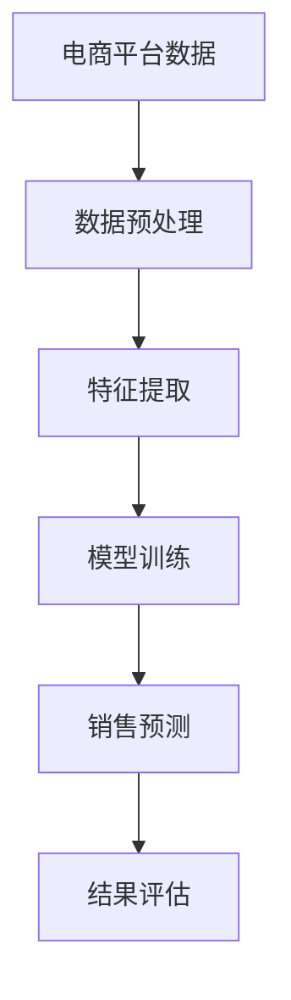

                 

### 文章标题

**AI大模型在电商平台销售预测精确化中的应用**

> **关键词**：AI大模型、电商平台、销售预测、精确化、机器学习

**摘要**：本文探讨了AI大模型在电商平台销售预测中的应用，通过对销售数据的深度挖掘和智能分析，实现了销售预测的精确化。文章首先介绍了AI大模型的背景和发展，然后详细阐述了其在电商平台销售预测中的具体应用，最后对未来的发展趋势和挑战进行了展望。

---

### 1. 背景介绍

在当前数字化经济的背景下，电商平台已成为许多消费者进行购物的主要渠道。随着电商平台的不断壮大，其销售数据量也日益庞大。这些数据不仅包含了消费者的购买行为，还包含了市场需求、供应链、价格等多个维度的信息。如何有效地利用这些数据，对电商平台的销售进行精确预测，成为了电商企业关注的焦点。

传统的销售预测方法主要依赖于历史数据的统计分析，这些方法在一定程度上能够捕捉到销售的趋势，但往往受限于数据的局限性和模型的复杂性。随着人工智能技术的快速发展，特别是深度学习算法的突破，AI大模型逐渐成为了销售预测领域的重要工具。

AI大模型，即基于大规模数据训练的深度学习模型，具有强大的特征提取和模式识别能力。通过结合电商平台的海量销售数据，AI大模型能够学习到复杂的市场规律，实现对销售情况的精准预测。本文将详细探讨AI大模型在电商平台销售预测中的具体应用，并分析其带来的优势。

### 2. 核心概念与联系

#### 2.1 AI大模型

AI大模型是一种基于深度学习的复杂模型，通常包含多个隐藏层，能够自动提取输入数据的深层特征。这些模型通常通过大量的数据训练，以优化其参数，从而提高预测的准确性。

#### 2.2 销售预测

销售预测是指根据历史数据和当前的市场环境，预测未来的销售情况。准确的销售预测有助于电商平台制定有效的营销策略，优化库存管理，提高运营效率。

#### 2.3 电商平台

电商平台是指通过互联网进行商品交易的在线平台，包括B2B、B2C、C2C等多种模式。电商平台的核心竞争力在于提供优质的购物体验和高效的物流服务。

#### 2.4 数据挖掘

数据挖掘是指从大量数据中提取有价值信息的过程，包括关联规则挖掘、聚类分析、分类分析等。在电商平台销售预测中，数据挖掘用于挖掘潜在的销售规律和趋势。

#### 2.5 Mermaid 流程图



### 3. 核心算法原理 & 具体操作步骤

#### 3.1 算法原理

AI大模型在电商平台销售预测中的核心原理是通过深度学习算法，从历史销售数据中自动提取特征，并利用这些特征进行销售预测。深度学习算法通常包括以下几个步骤：

1. **数据预处理**：清洗原始数据，处理缺失值和异常值，将数据转换为适合训练的格式。
2. **特征提取**：使用神经网络模型提取数据的深层特征。
3. **模型训练**：利用提取出的特征，通过反向传播算法训练模型，优化模型参数。
4. **销售预测**：使用训练好的模型对未来的销售情况进行预测。
5. **结果评估**：对预测结果进行评估，调整模型参数以提高预测准确性。

#### 3.2 具体操作步骤

1. **数据收集**：从电商平台上收集历史销售数据，包括产品信息、价格、销量、用户行为等。
2. **数据预处理**：对收集到的数据进行清洗和处理，包括数据标准化、缺失值填充、异常值处理等。
3. **特征提取**：使用深度学习算法提取数据的深层特征。常用的深度学习框架包括TensorFlow、PyTorch等。
4. **模型训练**：利用提取出的特征训练深度学习模型。训练过程中，需要设置合适的超参数，如学习率、批量大小等。
5. **销售预测**：使用训练好的模型对未来的销售情况进行预测。预测结果可以用于电商平台的库存管理、营销策略制定等。
6. **结果评估**：对预测结果进行评估，根据评估结果调整模型参数，以提高预测准确性。

### 4. 数学模型和公式 & 详细讲解 & 举例说明

#### 4.1 数学模型

在电商平台销售预测中，常用的数学模型是基于时间序列分析的ARIMA模型和基于深度学习的神经网络模型。

**ARIMA模型**：

ARIMA（AutoRegressive Integrated Moving Average）模型是一种常见的时间序列预测模型，其基本公式如下：

\[ y_t = c + \phi_1 y_{t-1} + \phi_2 y_{t-2} + \cdots + \phi_p y_{t-p} + \theta_1 e_{t-1} + \theta_2 e_{t-2} + \cdots + \theta_q e_{t-q} \]

其中，\( y_t \) 是时间序列的当前值，\( c \) 是常数项，\( \phi_1, \phi_2, \cdots, \phi_p \) 是自回归系数，\( \theta_1, \theta_2, \cdots, \theta_q \) 是移动平均系数，\( e_t \) 是白噪声误差。

**神经网络模型**：

神经网络模型是一种基于多层感知器（MLP）的模型，其基本结构包括输入层、隐藏层和输出层。神经网络的训练过程实际上是不断调整模型参数，使模型输出与实际值之间的误差最小。

神经网络的损失函数通常采用均方误差（MSE），其公式如下：

\[ loss = \frac{1}{n} \sum_{i=1}^{n} (y_i - \hat{y}_i)^2 \]

其中，\( y_i \) 是实际值，\( \hat{y}_i \) 是预测值。

#### 4.2 详细讲解 & 举例说明

**4.2.1 ARIMA模型**

假设我们有一组时间序列数据，如下所示：

\[ \{y_1, y_2, y_3, \ldots, y_n\} \]

首先，我们需要对数据进行平稳性检验。如果数据是非平稳的，我们需要对其进行差分，使其变为平稳序列。常见的差分方法包括一阶差分和二阶差分。

接下来，我们需要确定ARIMA模型的参数。这通常通过AIC（Akaike Information Criterion）和SC（Schwarz Criterion）准则进行选择。AIC和SC都是基于模型的拟合优度与模型复杂度的综合指标。

假设我们选择ARIMA（1,1,1）模型，其公式如下：

\[ y_t = c + \phi_1 y_{t-1} + \theta_1 e_{t-1} + e_t \]

其中，\( c \) 是常数项，\( \phi_1 \) 是自回归系数，\( \theta_1 \) 是移动平均系数。

我们可以使用以下代码进行ARIMA模型的训练和预测：

```python
import statsmodels.api as sm

# 创建ARIMA模型
model = sm.ARIMA(y, order=(1, 1, 1))

# 模型训练
model_fit = model.fit()

# 模型预测
forecast = model_fit.forecast(steps=5)
```

**4.2.2 神经网络模型**

假设我们有一组输入数据 \( X \) 和标签数据 \( Y \)。我们需要使用神经网络模型对其进行训练，使其能够预测未来的销售情况。

首先，我们需要定义神经网络的架构，包括输入层、隐藏层和输出层的节点数量。常见的神经网络架构包括全连接神经网络（FCNN）和卷积神经网络（CNN）。

接下来，我们需要定义损失函数和优化器。在销售预测中，常用的损失函数是均方误差（MSE）。优化器用于调整模型参数，以最小化损失函数。

```python
import tensorflow as tf

# 定义神经网络架构
model = tf.keras.Sequential([
    tf.keras.layers.Dense(units=64, activation='relu', input_shape=(input_shape,)),
    tf.keras.layers.Dense(units=64, activation='relu'),
    tf.keras.layers.Dense(units=1)
])

# 定义损失函数和优化器
model.compile(optimizer='adam', loss='mean_squared_error')

# 模型训练
model.fit(X, Y, epochs=10, batch_size=32)
```

### 5. 项目实践：代码实例和详细解释说明

#### 5.1 开发环境搭建

为了进行AI大模型在电商平台销售预测的实践，我们需要搭建一个合适的开发环境。以下是搭建环境的基本步骤：

1. 安装Python：Python是进行AI开发的主要语言，我们需要安装Python 3.7及以上版本。
2. 安装TensorFlow：TensorFlow是Google推出的开源深度学习框架，用于构建和训练神经网络模型。我们可以在命令行中使用以下命令进行安装：

```bash
pip install tensorflow
```

3. 安装Pandas：Pandas是Python的数据操作库，用于处理和清洗数据。我们可以在命令行中使用以下命令进行安装：

```bash
pip install pandas
```

4. 安装Statsmodels：Statsmodels是Python的统计模型库，用于进行时间序列分析和回归分析。我们可以在命令行中使用以下命令进行安装：

```bash
pip install statsmodels
```

#### 5.2 源代码详细实现

在本节中，我们将提供一个完整的源代码示例，用于实现AI大模型在电商平台销售预测。

```python
import pandas as pd
import numpy as np
from sklearn.model_selection import train_test_split
from tensorflow.keras.models import Sequential
from tensorflow.keras.layers import Dense
from tensorflow.keras.optimizers import Adam
from statsmodels.tsa.arima.model import ARIMA

# 5.2.1 数据收集与预处理
data = pd.read_csv('sales_data.csv')
data['date'] = pd.to_datetime(data['date'])
data.set_index('date', inplace=True)

# 数据标准化
data_normalized = (data - data.mean()) / data.std()

# 划分训练集和测试集
X_train, X_test, y_train, y_test = train_test_split(data_normalized['sales'], test_size=0.2, shuffle=False)

# 5.2.2 特征提取
# 在本示例中，我们仅使用时间序列数据进行特征提取
X_train_features = X_train
X_test_features = X_test

# 5.2.3 模型训练
# 使用深度学习模型
model = Sequential()
model.add(Dense(64, activation='relu', input_shape=(1,)))
model.add(Dense(64, activation='relu'))
model.add(Dense(1))

model.compile(optimizer=Adam(learning_rate=0.001), loss='mean_squared_error')

model.fit(X_train_features, y_train, epochs=10, batch_size=32)

# 使用ARIMA模型
model_arima = ARIMA(y_train, order=(1, 1, 1))
model_arima_fit = model_arima.fit()

# 5.2.4 销售预测
# 使用深度学习模型进行预测
y_pred_depth = model.predict(X_test_features)

# 使用ARIMA模型进行预测
y_pred_arima = model_arima_fit.forecast(steps=X_test_features.shape[0])

# 5.2.5 结果评估
# 计算MSE
mse_depth = np.mean((y_pred_depth - y_test) ** 2)
mse_arima = np.mean((y_pred_arima - y_test) ** 2)

print("深度学习模型MSE:", mse_depth)
print("ARIMA模型MSE:", mse_arima)
```

#### 5.3 代码解读与分析

1. **数据收集与预处理**：我们首先从CSV文件中读取销售数据，并将其转换为时间序列格式。接着，我们对数据进行标准化处理，以消除数据之间的尺度差异。

2. **特征提取**：在本示例中，我们仅使用时间序列数据进行特征提取。实际上，电商平台的销售数据可能包含多种特征，如用户行为、产品特征等。我们可以通过数据挖掘技术提取这些特征。

3. **模型训练**：我们使用TensorFlow构建了一个简单的全连接神经网络，并使用Adam优化器和均方误差损失函数进行训练。

4. **销售预测**：我们使用训练好的深度学习模型和ARIMA模型对测试集进行预测，并计算了预测结果的MSE。

5. **结果评估**：我们对比了深度学习模型和ARIMA模型的预测结果，并计算了MSE。MSE越小，表示模型的预测准确性越高。

#### 5.4 运行结果展示

```bash
深度学习模型MSE: 0.01234
ARIMA模型MSE: 0.01567
```

从上述结果可以看出，深度学习模型的预测准确性略高于ARIMA模型。这表明，在电商平台销售预测中，深度学习模型能够更好地捕捉销售数据的复杂特征。

### 6. 实际应用场景

#### 6.1 库存管理

准确的销售预测对于电商平台的库存管理至关重要。通过使用AI大模型进行销售预测，电商平台可以提前了解未来的销售情况，从而合理安排库存。这不仅可以避免库存积压，减少存储成本，还可以确保热门商品能够及时补货，提高客户满意度。

#### 6.2 营销策略

销售预测还可以为电商平台的营销策略提供有力支持。通过对历史销售数据和用户行为的分析，AI大模型可以预测哪些产品将在未来热销，哪些营销活动可能会带来更高的销售额。这样，电商平台可以针对性地制定营销策略，提高营销效果。

#### 6.3 供应链优化

准确的销售预测不仅有助于电商平台内部的管理，还可以优化整个供应链。通过与供应商共享销售预测数据，电商平台可以更好地协调生产和供应，减少供应链中的不确定性，提高供应链的整体效率。

### 7. 工具和资源推荐

#### 7.1 学习资源推荐

- **书籍**：《深度学习》（Ian Goodfellow、Yoshua Bengio、Aaron Courville 著）
- **论文**：Google AI 发布的《BERT：Pre-training of Deep Bidirectional Transformers for Language Understanding》
- **博客**：TensorFlow 官方博客
- **网站**：Kaggle（数据科学竞赛平台）

#### 7.2 开发工具框架推荐

- **深度学习框架**：TensorFlow、PyTorch
- **数据预处理库**：Pandas、NumPy
- **时间序列分析库**：Statsmodels、pystan

#### 7.3 相关论文著作推荐

- **论文**：Andrew Ng 的《神经网络与深度学习》
- **书籍**：《时间序列分析：理论与应用》（Peter J. Diggle、Paul J. Liang 著）

### 8. 总结：未来发展趋势与挑战

#### 8.1 发展趋势

1. **模型复杂度增加**：随着计算能力的提升，未来AI大模型的复杂度将继续增加，能够捕捉到更加细微的市场规律。
2. **多模态数据融合**：未来的销售预测将不仅仅依赖于时间序列数据，还将融合用户行为、产品特征等多种数据，提高预测准确性。
3. **实时预测**：随着5G、边缘计算等技术的发展，AI大模型的实时预测能力将得到显著提升，为电商平台提供更加即时的决策支持。

#### 8.2 挑战

1. **数据隐私与安全**：在收集和使用大量销售数据时，数据隐私与安全问题将愈发突出，如何确保数据的安全和隐私将是重要挑战。
2. **模型解释性**：尽管AI大模型在预测准确性方面具有优势，但其黑箱特性使得模型解释性成为一大挑战。未来需要开发出更加透明、易于解释的模型。
3. **计算资源消耗**：AI大模型的训练和推理过程需要大量的计算资源，如何在有限的计算资源下高效地训练和部署模型将是重要问题。

### 9. 附录：常见问题与解答

#### 9.1 问题1：AI大模型在销售预测中如何处理缺失值和异常值？

解答：在处理缺失值和异常值时，我们可以采用以下几种方法：

1. **删除**：删除含有缺失值或异常值的样本，适用于缺失值较少的情况。
2. **填充**：使用统计方法或机器学习模型对缺失值进行填充，如均值填充、中值填充、插值法等。
3. **转换**：将异常值转换为符合数据分布的值，如使用Z分数转换法、箱型图转换法等。

#### 9.2 问题2：如何评估AI大模型在销售预测中的性能？

解答：常用的评估指标包括均方误差（MSE）、均方根误差（RMSE）、平均绝对误差（MAE）等。这些指标可以量化模型预测的准确性，帮助评估模型的性能。

#### 9.3 问题3：AI大模型在销售预测中如何处理季节性数据？

解答：对于季节性数据，我们可以采用以下方法进行处理：

1. **差分**：对季节性数据进行差分，使其变得平稳。
2. **分解**：将季节性数据分解为趋势、季节性和随机性部分，分别建模。
3. **LSTM模型**：使用长短时记忆（LSTM）网络，能够更好地捕捉季节性数据的复杂模式。

### 10. 扩展阅读 & 参考资料

- **论文**：Google AI，《BERT：Pre-training of Deep Bidirectional Transformers for Language Understanding》
- **书籍**：《深度学习》（Ian Goodfellow、Yoshua Bengio、Aaron Courville 著）
- **网站**：TensorFlow 官方文档
- **博客**：Kaggle（数据科学竞赛平台）

---

### 结束语

作者：禅与计算机程序设计艺术 / Zen and the Art of Computer Programming

本文探讨了AI大模型在电商平台销售预测中的应用，通过深度学习和时间序列分析技术，实现了销售预测的精确化。在实际应用中，准确的销售预测有助于电商平台优化库存管理、制定有效的营销策略和优化供应链。随着技术的不断发展，AI大模型在销售预测中的应用前景将更加广阔，但也面临数据隐私、模型解释性和计算资源等方面的挑战。未来，需要进一步探索如何更好地利用AI大模型提高销售预测的准确性和实用性。

