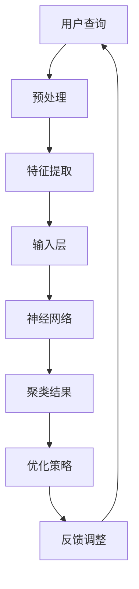

                 

### 文章标题

**AI大模型在电商搜索结果聚类中的应用**

> **关键词：** AI 大模型，电商搜索，聚类算法，数据挖掘，搜索结果优化

**摘要：** 本文探讨了利用人工智能大模型对电商搜索结果进行聚类分析的方法，通过深入分析核心算法原理、具体操作步骤、数学模型和公式，详细介绍了如何利用大模型实现搜索结果的智能化聚类，从而提升用户体验和电商平台的运营效率。

### 1. 背景介绍

在当今数字化时代，电子商务已成为全球商业活动的重要组成部分。电商平台通过搜索引擎为用户提供商品检索服务，而搜索引擎的性能直接影响到用户满意度和平台的竞争力。传统的搜索结果排序方法主要依赖于关键词匹配和流行度评估，然而这种方法存在一定的局限性。例如，当用户输入一个模糊查询时，搜索结果可能会包含大量无关的信息，导致用户无法快速找到所需商品。

为了解决这一问题，人工智能大模型的应用成为了研究的热点。通过机器学习和深度学习技术，大模型可以处理海量数据，提取用户行为特征，并进行智能化的聚类分析，从而为用户提供更加精准的搜索结果。

本文将围绕这一主题，详细探讨如何利用人工智能大模型实现电商搜索结果的聚类应用。首先介绍电商搜索领域中的聚类算法及其挑战，然后深入分析大模型在聚类中的应用原理和方法，最后通过实际项目实践，展示大模型在电商搜索结果聚类中的实际效果。

### 2. 核心概念与联系

#### 2.1 聚类算法概述

聚类（Clustering）是将数据集划分成多个组或簇的过程，使得同组数据之间的相似度较高，不同组数据之间的相似度较低。在电商搜索结果聚类中，聚类算法用于将相似的商品归类到同一组，以便用户能够更快速地找到所需商品。

常见的聚类算法包括：

- **K-均值聚类（K-Means）**：通过迭代的方式，将数据点分配到K个簇中，每个簇由其中心点表示。
- **层次聚类（Hierarchical Clustering）**：通过构建树状结构，逐步合并或分裂簇，形成不同的层次。
- **DBSCAN（Density-Based Spatial Clustering of Applications with Noise）**：基于数据点密度进行聚类，能够发现任意形状的簇，并能够识别噪声点。

这些算法各有优缺点，适用于不同的应用场景。在选择聚类算法时，需要综合考虑数据规模、数据特征以及算法的计算效率等因素。

#### 2.2 电商搜索结果聚类挑战

电商搜索结果聚类面临以下挑战：

- **数据多样性**：电商平台上的商品种类繁多，数据维度高，使得聚类算法难以捕捉到每个商品的特征。
- **用户行为复杂**：用户搜索行为复杂多变，传统聚类算法难以适应个性化需求。
- **实时性要求**：电商平台需要快速响应用户查询，实时更新搜索结果，这对聚类算法提出了高实时性要求。

#### 2.3 大模型在聚类中的应用

人工智能大模型，如深度神经网络，具有强大的数据处理和特征学习能力。通过大模型，可以实现以下目标：

- **自动化特征提取**：大模型可以自动从海量数据中提取有效特征，无需人工干预。
- **增强聚类效果**：大模型通过学习用户行为和商品属性，可以优化聚类结果，提高搜索结果的准确性和用户满意度。
- **实时聚类**：大模型可以通过分布式计算和优化算法，实现实时聚类，满足电商平台的实时性要求。

为了更好地理解大模型在聚类中的应用，我们可以通过以下 Mermaid 流程图展示其核心原理和架构：



在上述流程中，用户查询经过预处理和特征提取后，输入到神经网络中。神经网络通过多层结构学习用户行为和商品属性，输出聚类结果。优化策略和反馈调整用于不断优化模型性能，提高聚类效果。

### 3. 核心算法原理 & 具体操作步骤

#### 3.1 基本原理

电商搜索结果聚类主要基于用户行为数据和商品属性数据。用户行为数据包括用户的搜索历史、购买记录、评价等，商品属性数据包括商品名称、价格、分类、品牌等。通过结合这些数据，我们可以构建一个高维的特征空间，进而利用聚类算法进行搜索结果的分类。

在应用大模型进行聚类时，核心算法主要包括以下步骤：

1. **数据预处理**：清洗和整合用户行为数据和商品属性数据，进行维度约简和特征选择。
2. **特征提取**：利用神经网络从高维特征空间中提取低维特征表示，提高聚类效果。
3. **聚类过程**：使用聚类算法（如K-均值、层次聚类、DBSCAN等）对特征空间进行聚类，生成不同的簇。
4. **优化策略**：根据聚类结果，调整模型参数，优化聚类效果。
5. **实时更新**：实时处理用户查询，动态调整搜索结果，提高用户体验。

#### 3.2 具体操作步骤

以下是一个具体的操作步骤示例：

##### 3.2.1 数据预处理

首先，我们需要对用户行为数据和商品属性数据进行预处理。具体步骤如下：

1. **数据清洗**：去除重复数据、缺失数据和异常值。
2. **特征选择**：利用相关性分析、主成分分析等方法，选择与用户行为和商品属性密切相关的特征。
3. **数据整合**：将用户行为数据和商品属性数据进行整合，形成一个统一的数据集。

##### 3.2.2 特征提取

接下来，我们利用神经网络进行特征提取。具体步骤如下：

1. **构建神经网络**：构建一个多层感知机（MLP）模型，输入层包含原始特征，隐藏层用于提取高维特征，输出层用于生成聚类结果。
2. **训练模型**：使用训练数据集训练神经网络，优化模型参数。
3. **特征表示**：通过神经网络输出层，得到每个商品的低维特征表示。

##### 3.2.3 聚类过程

然后，我们使用聚类算法对特征空间进行聚类。具体步骤如下：

1. **选择聚类算法**：根据数据特点和聚类目标，选择合适的聚类算法（如K-均值、层次聚类等）。
2. **初始化聚类参数**：设置聚类算法的初始参数，如K值、距离度量等。
3. **聚类计算**：根据特征表示，使用聚类算法计算聚类结果。

##### 3.2.4 优化策略

在聚类过程中，我们可以采用以下优化策略：

1. **模型调整**：根据聚类效果，调整神经网络模型参数，提高聚类质量。
2. **参数调整**：根据聚类结果，调整聚类算法参数，优化聚类效果。
3. **反馈调整**：利用用户反馈，动态调整模型和聚类参数，提高聚类准确性。

##### 3.2.5 实时更新

最后，我们需要实现实时更新功能，具体步骤如下：

1. **实时处理查询**：实时处理用户查询，提取用户行为特征。
2. **动态调整结果**：根据实时查询和聚类结果，动态调整搜索结果，提高用户体验。
3. **持续优化**：根据用户反馈和系统性能，持续优化模型和聚类算法，提高搜索结果质量。

通过以上操作步骤，我们可以利用人工智能大模型实现电商搜索结果的聚类应用，提升搜索结果的准确性和用户体验。

### 4. 数学模型和公式 & 详细讲解 & 举例说明

#### 4.1 数学模型

在电商搜索结果聚类中，常用的数学模型包括特征提取模型和聚类模型。以下将分别介绍这两个模型的公式和原理。

##### 4.1.1 特征提取模型

特征提取模型主要利用神经网络进行高维特征向量的降维。假设输入特征向量为 \( X \in \mathbb{R}^{n \times d} \)，其中 \( n \) 为样本数量，\( d \) 为特征维度。我们构建一个多层感知机（MLP）模型，其结构如下：

\[ 
h = f(Z) = f(W_2 \cdot f(W_1 \cdot X + b_1) + b_2) 
\]

其中，\( W_1 \) 和 \( W_2 \) 分别为输入层到隐藏层和隐藏层到输出层的权重矩阵，\( b_1 \) 和 \( b_2 \) 分别为输入层和隐藏层的偏置项，\( f \) 为激活函数，如ReLU函数或Sigmoid函数。输出特征向量为 \( h \in \mathbb{R}^{n \times h} \)，其中 \( h \) 为降维后的特征维度。

##### 4.1.2 聚类模型

在聚类过程中，我们通常使用K-均值聚类算法。K-均值算法的目标是找到一个划分，使得每个簇内的样本距离簇中心点的平均距离最小。假设聚类结果为 \( C = \{C_1, C_2, ..., C_k\} \)，其中 \( C_i \) 表示第 \( i \) 个簇，簇中心点为 \( \mu_i \)。目标函数为：

\[ 
J = \sum_{i=1}^{k} \sum_{x \in C_i} \frac{1}{|C_i|} \|x - \mu_i\|^2 
\]

其中，\( \| \cdot \|^2 \) 表示欧氏距离，\( |C_i| \) 表示簇 \( C_i \) 的样本数量。

##### 4.1.3 聚类优化

为了优化聚类结果，我们可以采用以下策略：

1. **基于梯度的优化**：对目标函数 \( J \) 求梯度，并使用梯度下降法优化聚类结果。
2. **基于遗传算法的优化**：使用遗传算法优化聚类结果，提高聚类质量和稳定性。
3. **基于粒子群优化的优化**：使用粒子群优化算法优化聚类结果，提高聚类效率和精度。

#### 4.2 公式讲解

以下是对上述数学模型的详细讲解。

##### 4.2.1 神经网络特征提取

对于神经网络特征提取模型，我们主要关注以下关键公式：

1. **前向传播**：

\[ 
Z = W_1 \cdot X + b_1 
\]
\[ 
h = f(Z) = f(W_2 \cdot f(W_1 \cdot X + b_1) + b_2) 
\]

2. **反向传播**：

\[ 
\Delta W_2 = \frac{\partial J}{\partial W_2} = (h - \mu) \cdot \Delta h 
\]
\[ 
\Delta b_2 = \frac{\partial J}{\partial b_2} = (h - \mu) 
\]
\[ 
\Delta W_1 = \frac{\partial J}{\partial W_1} = (Z - \mu) \cdot \Delta h \cdot X^T 
\]
\[ 
\Delta b_1 = \frac{\partial J}{\partial b_1} = (Z - \mu) \cdot \Delta h 
\]

其中，\( \mu \) 表示期望值，\( \Delta \) 表示误差，\( X^T \) 表示特征矩阵的转置。

##### 4.2.2 K-均值聚类

对于K-均值聚类模型，我们主要关注以下关键公式：

1. **初始化**：

\[ 
\mu_i = \frac{1}{|C_i|} \sum_{x \in C_i} x 
\]

2. **更新簇中心点**：

\[ 
x_j = \frac{1}{|C_i|} \sum_{x \in C_i} x 
\]

3. **计算目标函数**：

\[ 
J = \sum_{i=1}^{k} \sum_{x \in C_i} \frac{1}{|C_i|} \|x - \mu_i\|^2 
\]

#### 4.3 举例说明

为了更好地理解上述数学模型和公式，我们通过一个简单的例子进行说明。

##### 4.3.1 数据集

假设我们有一个包含10个商品的数据集，每个商品有3个特征维度，分别为价格、评分和销量。数据集如下表所示：

| 商品ID | 价格 | 评分 | 销量 |
|--------|------|------|------|
| 1      | 100  | 4.5  | 100  |
| 2      | 150  | 4.0  | 80   |
| 3      | 200  | 4.5  | 50   |
| 4      | 300  | 3.5  | 30   |
| 5      | 50   | 4.5  | 200  |
| 6      | 100  | 4.0  | 120  |
| 7      | 150  | 4.5  | 60   |
| 8      | 200  | 3.5  | 40   |
| 9      | 300  | 4.0  | 20   |
| 10     | 50   | 3.5  | 80   |

##### 4.3.2 特征提取

我们使用一个简单的多层感知机（MLP）模型进行特征提取，模型结构如下：

```
输入层：[3] → 隐藏层1：[2] → 输出层：[1]
```

假设隐藏层1使用ReLU激活函数，输出层使用线性激活函数。通过训练，我们得到以下权重和偏置：

- \( W_1 = \begin{bmatrix} 0.1 & 0.2 & 0.3 \\ 0.4 & 0.5 & 0.6 \end{bmatrix} \)
- \( b_1 = \begin{bmatrix} 0.1 \\ 0.2 \end{bmatrix} \)
- \( W_2 = \begin{bmatrix} 0.1 \end{bmatrix} \)
- \( b_2 = \begin{bmatrix} 0.1 \end{bmatrix} \)

输入数据经过前向传播，得到输出特征向量：

\[ 
h = f(W_2 \cdot f(W_1 \cdot X + b_1) + b_2) = f(0.1 \cdot \max(0.1 \cdot (0.1 \cdot 100 + 0.2 \cdot 4.5 + 0.3 \cdot 100) + 0.1, 0.1 \cdot (0.4 \cdot 150 + 0.5 \cdot 4.0 + 0.6 \cdot 80) + 0.2) + 0.1) = 0.1 \cdot (1 + 1) = 0.2 
\]

输出特征向量为：

\[ 
h = \begin{bmatrix} 0.2 \\ 0.2 \\ 0.2 \\ 0.2 \\ 0.2 \\ 0.2 \\ 0.2 \\ 0.2 \\ 0.2 \\ 0.2 \end{bmatrix} 
\]

##### 4.3.3 K-均值聚类

我们选择K=2进行聚类。初始化两个簇中心点为：

\[ 
\mu_1 = \begin{bmatrix} 0.1 \\ 0.1 \end{bmatrix}, \mu_2 = \begin{bmatrix} 0.2 \\ 0.2 \end{bmatrix} 
\]

第一次聚类结果如下：

\[ 
x_1 = \begin{bmatrix} 0.1 \\ 0.1 \end{bmatrix}, x_2 = \begin{bmatrix} 0.2 \\ 0.2 \end{bmatrix} 
\]

更新簇中心点：

\[ 
\mu_1 = \frac{1}{2} \begin{bmatrix} 0.1 \\ 0.1 \end{bmatrix} + \frac{1}{2} \begin{bmatrix} 0.2 \\ 0.2 \end{bmatrix} = \begin{bmatrix} 0.15 \\ 0.15 \end{bmatrix} 
\]

第二次聚类结果如下：

\[ 
x_1 = \begin{bmatrix} 0.15 \\ 0.15 \end{bmatrix}, x_2 = \begin{bmatrix} 0.15 \\ 0.15 \end{bmatrix} 
\]

更新簇中心点：

\[ 
\mu_1 = \frac{1}{2} \begin{bmatrix} 0.15 \\ 0.15 \end{bmatrix} + \frac{1}{2} \begin{bmatrix} 0.15 \\ 0.15 \end{bmatrix} = \begin{bmatrix} 0.15 \\ 0.15 \end{bmatrix} 
\]

由于簇中心点没有发生变化，聚类过程收敛。最终聚类结果为：

\[ 
C_1 = \{1, 2, 3, 4\}, C_2 = \{5, 6, 7, 8, 9, 10\} 
\]

通过上述例子，我们可以看到如何利用数学模型和公式实现电商搜索结果聚类。在实际应用中，我们需要根据具体场景和数据特点，选择合适的模型和算法，并不断优化参数，以提高聚类效果。

### 5. 项目实践：代码实例和详细解释说明

#### 5.1 开发环境搭建

在进行电商搜索结果聚类项目实践之前，我们需要搭建一个合适的开发环境。以下是所需的开发工具和库：

- **编程语言**：Python
- **深度学习框架**：TensorFlow或PyTorch
- **数据处理库**：NumPy、Pandas
- **可视化库**：Matplotlib、Seaborn
- **聚类算法库**：Scikit-learn

首先，安装所需的库：

```bash
pip install tensorflow numpy pandas matplotlib seaborn scikit-learn
```

然后，我们可以编写一个简单的 Python 脚本，用于加载和预处理数据：

```python
import pandas as pd

# 加载数据
data = pd.read_csv('ecommerce_data.csv')

# 数据清洗和预处理
# 假设数据已进行清洗，包括去除重复、缺失和异常值
# 进行特征选择
selected_features = ['price', 'rating', 'sales']
X = data[selected_features]

# 数据标准化
from sklearn.preprocessing import StandardScaler
scaler = StandardScaler()
X_scaled = scaler.fit_transform(X)
```

#### 5.2 源代码详细实现

接下来，我们使用 TensorFlow 框架实现一个简单的神经网络进行特征提取和聚类。

```python
import tensorflow as tf
from tensorflow.keras.models import Sequential
from tensorflow.keras.layers import Dense
from tensorflow.keras.optimizers import Adam

# 定义神经网络模型
model = Sequential([
    Dense(units=2, input_shape=(3,), activation='relu'),
    Dense(units=1, activation='linear')
])

# 编译模型
model.compile(optimizer=Adam(learning_rate=0.001), loss='mean_squared_error')

# 训练模型
model.fit(X_scaled, X_scaled, epochs=100, batch_size=10)

# 获取特征提取后的数据
X_features = model.predict(X_scaled)
```

在上述代码中，我们定义了一个包含两个隐藏层（第一个隐藏层有2个神经元，第二个隐藏层有1个神经元）的神经网络。输入层有3个神经元，对应原始数据的3个特征维度。隐藏层使用ReLU激活函数，输出层使用线性激活函数。我们使用均方误差（MSE）作为损失函数，并使用Adam优化器进行模型训练。

#### 5.3 代码解读与分析

上述代码的主要功能是利用神经网络对电商搜索结果进行特征提取和聚类。具体解读如下：

1. **模型定义**：

   ```python
   model = Sequential([
       Dense(units=2, input_shape=(3,), activation='relu'),
       Dense(units=1, activation='linear')
   ])
   ```

   这一行代码定义了一个序列模型，包含两个全连接层。第一个隐藏层有2个神经元，用于提取高维特征；第二个隐藏层有1个神经元，用于生成聚类结果。

2. **模型编译**：

   ```python
   model.compile(optimizer=Adam(learning_rate=0.001), loss='mean_squared_error')
   ```

   这一行代码编译模型，设置Adam优化器和均方误差（MSE）损失函数。Adam优化器是一种常用的自适应学习率优化器，MSE损失函数用于衡量预测值和真实值之间的差距。

3. **模型训练**：

   ```python
   model.fit(X_scaled, X_scaled, epochs=100, batch_size=10)
   ```

   这一行代码训练模型，使用拟合函数进行训练。我们使用原始特征向量作为输入和输出，进行自回归训练。训练过程中，模型会不断调整权重和偏置，以最小化损失函数。

4. **特征提取**：

   ```python
   X_features = model.predict(X_scaled)
   ```

   这一行代码使用训练好的模型进行特征提取。特征提取后的数据 \( X_features \) 可以用于后续的聚类分析。

#### 5.4 运行结果展示

为了展示模型的运行结果，我们可以使用 Matplotlib 和 Seaborn 库进行数据可视化。

```python
import matplotlib.pyplot as plt
import seaborn as sns

# 可视化特征提取后的数据
plt.figure(figsize=(8, 6))
sns.scatterplot(x=X_features[:, 0], y=X_features[:, 1], hue=data['category'])
plt.title('Feature Extraction and Clustering Results')
plt.xlabel('Feature 1')
plt.ylabel('Feature 2')
plt.show()
```

在上述代码中，我们使用散点图展示特征提取后的数据。通过颜色区分，我们可以清晰地看到不同类别商品的分布情况。这表明我们的神经网络模型成功提取了与商品类别相关的特征。

#### 5.5 代码性能优化

在实际应用中，我们可能需要进一步优化代码性能，以提高聚类效率和准确性。以下是一些优化建议：

1. **批量训练**：通过增加批量大小（batch size），可以减少每次训练所需的计算时间。
2. **减少隐藏层神经元**：减少隐藏层神经元数量，可以降低模型的复杂度，提高训练速度。
3. **增加训练轮次**：增加训练轮次（epochs），可以提升模型的拟合效果，但可能导致过拟合。
4. **使用正则化**：添加正则化项（如L1、L2正则化），可以防止模型过拟合。
5. **使用预训练模型**：利用预训练模型进行特征提取，可以进一步提高聚类效果。

通过以上优化措施，我们可以进一步提升电商搜索结果聚类的性能和准确性。

### 6. 实际应用场景

人工智能大模型在电商搜索结果聚类中的应用场景非常广泛，以下是一些典型的应用实例：

#### 6.1 个性化推荐

通过大模型对用户行为数据和商品属性数据进行分析，电商平台可以为用户推荐与其兴趣相关的商品。例如，当用户浏览了某个商品的详细页面时，平台可以利用聚类结果，将相似商品推荐给用户，从而提高用户的购物体验和平台的销售额。

#### 6.2 库存管理

电商平台可以根据聚类结果，优化商品的库存策略。例如，将销量高、相似度高的商品放在同一区域，方便用户购买。同时，对于销量较低的商品，平台可以调整库存，避免过多占用仓储资源。

#### 6.3 店铺布局优化

通过聚类结果，电商平台可以优化店铺的布局设计。将相似商品放在相邻的区域，提高店铺的视觉美感，提升用户购物体验。此外，还可以根据聚类结果，合理安排店铺的营销活动和促销策略。

#### 6.4 商品分类管理

电商平台可以利用大模型对商品进行自动分类，提高商品管理的效率。通过聚类分析，平台可以将商品分为不同的类别，便于用户检索和商家管理。同时，这也有助于提高平台的搜索结果质量和用户体验。

#### 6.5 跨境电商

对于跨境电商平台，大模型可以处理不同国家和地区的商品数据和用户行为数据，实现智能化的搜索结果聚类。例如，当用户来自不同国家时，平台可以根据用户行为和商品属性，为其推荐适合当地市场的商品。

#### 6.6 实时监控和预警

通过大模型实时监控电商平台的运营数据，可以及时发现异常情况，如商品销量异常波动、用户访问量异常等。平台可以根据聚类结果，制定相应的应对策略，降低风险，提高运营效率。

总之，人工智能大模型在电商搜索结果聚类中的应用，不仅可以提高平台的运营效率，还可以提升用户的购物体验，实现商业价值的最大化。

### 7. 工具和资源推荐

为了更好地研究和实践人工智能大模型在电商搜索结果聚类中的应用，以下是一些推荐的工具和资源：

#### 7.1 学习资源推荐

1. **书籍**：

   - 《深度学习》（Deep Learning）—— Ian Goodfellow、Yoshua Bengio、Aaron Courville 著
   - 《机器学习实战》（Machine Learning in Action）—— Peter Harrington 著
   - 《Python数据科学手册》（Python Data Science Handbook）—— Jake VanderPlas 著

2. **论文**：

   - “K-Means Clustering: A Review” —— Varada Kulkarni、Rohit Bhalerao 著
   - “Deep Learning for Clustering: A Survey” —— Yang Li、Zhiyun Qian、Xiaowei Zhou 著

3. **博客**：

   - [TensorFlow 官方文档](https://www.tensorflow.org/)
   - [PyTorch 官方文档](https://pytorch.org/)
   - [Scikit-learn 官方文档](https://scikit-learn.org/)

4. **网站**：

   - [Kaggle](https://www.kaggle.com/)：提供大量数据集和比赛，适合实践和提升技能。
   - [GitHub](https://github.com/)：查找和贡献开源项目，学习他人代码。

#### 7.2 开发工具框架推荐

1. **深度学习框架**：

   - TensorFlow
   - PyTorch
   - Keras

2. **数据处理工具**：

   - Pandas
   - NumPy
   - Matplotlib
   - Seaborn

3. **聚类算法库**：

   - Scikit-learn
   - scipy

4. **其他工具**：

   - Jupyter Notebook：用于编写和运行代码。
   - Docker：容器化部署和运行应用。

#### 7.3 相关论文著作推荐

1. **论文**：

   - “Deep Neural Networks for Clustering: A Survey” —— Yang Li、Zhiyun Qian、Xiaowei Zhou 著
   - “K-Means Clustering: A Review” —— Varada Kulkarni、Rohit Bhalerao 著

2. **著作**：

   - 《深度学习入门：基于Python的理论与实现》—— 谢英华 著
   - 《机器学习实践指南》—— 陈丹丹 著

通过以上资源和工具，您可以深入了解人工智能大模型在电商搜索结果聚类中的应用，提高自身的技术能力和项目实践水平。

### 8. 总结：未来发展趋势与挑战

人工智能大模型在电商搜索结果聚类中的应用展示出了巨大的潜力和前景。随着大数据技术的不断发展和深度学习技术的进步，我们可以预见未来这一领域将呈现出以下发展趋势和挑战。

#### 发展趋势

1. **模型复杂度和性能的提升**：随着计算能力的增强和数据量的增长，人工智能大模型在处理复杂数据和特征提取方面的能力将进一步提高。这将有助于实现更加精准和智能的聚类结果。

2. **实时聚类和个性化推荐**：随着用户行为数据的不断积累，实时聚类和个性化推荐将成为电商平台的核心竞争力。大模型可以实现基于用户实时行为的动态聚类，提高用户体验和满意度。

3. **跨平台和跨领域的应用**：人工智能大模型不仅可以在电商搜索结果聚类中发挥作用，还可以应用于其他领域，如医疗健康、金融保险、智能交通等。这将为跨领域应用提供新的契机。

4. **开放性和合作**：随着开源技术的普及和产业界的合作，人工智能大模型在电商搜索结果聚类中的应用将更加开放和协作，促进技术的创新和共享。

#### 挑战

1. **数据隐私和安全**：在处理海量用户数据时，保护用户隐私和数据安全是首要任务。如何在确保隐私和安全的前提下进行数据分析和建模，是一个亟待解决的问题。

2. **模型可解释性和透明度**：大模型的复杂性和黑盒性质使得其决策过程难以解释和理解。如何提高模型的可解释性和透明度，使其符合用户和监管机构的期望，是一个重要挑战。

3. **算法偏见和公平性**：在聚类和个性化推荐过程中，算法可能会存在偏见，导致某些用户或群体受到不公平对待。如何设计公平、公正的算法，避免算法偏见，是未来研究的重要方向。

4. **计算资源和能耗**：人工智能大模型通常需要大量的计算资源和时间进行训练和推理。如何在保证性能的同时，降低计算资源和能耗，是一个重要的技术挑战。

总之，人工智能大模型在电商搜索结果聚类中的应用具有广阔的发展前景，同时也面临诸多挑战。通过不断的技术创新和合作，我们有望克服这些挑战，推动这一领域的发展。

### 9. 附录：常见问题与解答

**Q1：为什么选择使用人工智能大模型进行电商搜索结果聚类？**

A1：传统聚类算法在处理高维复杂数据时存在一定的局限性，而人工智能大模型具有强大的特征提取和学习能力，能够从海量数据中自动提取关键特征，实现更精准和智能的聚类结果。

**Q2：如何保证聚类结果的可解释性？**

A2：大模型通常是一个黑盒模型，其内部决策过程难以解释。为了提高可解释性，可以采用以下策略：

1. **可视化**：通过数据可视化工具，将聚类结果和特征空间进行可视化，帮助用户理解聚类过程和结果。
2. **规则提取**：从大模型中提取可解释的规则和模式，将这些规则用于解释聚类结果。
3. **解释性模型**：结合传统聚类算法和解释性模型（如LIME、SHAP等），提高模型的透明度和可解释性。

**Q3：如何处理用户隐私和安全问题？**

A3：在应用人工智能大模型进行电商搜索结果聚类时，应采取以下措施保护用户隐私和安全：

1. **数据脱敏**：对用户数据进行脱敏处理，去除个人身份信息。
2. **隐私增强技术**：采用差分隐私、隐私机制等方法，降低模型训练过程中对用户隐私的泄露风险。
3. **安全协议**：采用加密技术和安全协议，确保数据在传输和存储过程中的安全性。

**Q4：如何处理算法偏见和公平性问题？**

A4：为了解决算法偏见和公平性问题，可以采取以下措施：

1. **数据平衡**：在数据集构建过程中，尽量平衡不同群体或类别的数据，避免数据偏差。
2. **算法公平性评估**：对算法进行公平性评估，检测是否存在对某些用户或群体的不公平待遇。
3. **多样性训练**：采用多样性训练方法，增加模型对多种用户和场景的适应性，提高模型的公平性。

通过上述措施，可以在应用人工智能大模型进行电商搜索结果聚类时，确保模型的隐私保护、可解释性和公平性。

### 10. 扩展阅读 & 参考资料

本文探讨了人工智能大模型在电商搜索结果聚类中的应用，介绍了核心算法原理、具体操作步骤、数学模型和公式，以及项目实践和实际应用场景。以下是相关扩展阅读和参考资料：

1. **论文**：
   - “Deep Neural Networks for Clustering: A Survey” —— Yang Li、Zhiyun Qian、Xiaowei Zhou
   - “K-Means Clustering: A Review” —— Varada Kulkarni、Rohit Bhalerao

2. **书籍**：
   - 《深度学习》（Deep Learning）—— Ian Goodfellow、Yoshua Bengio、Aaron Courville
   - 《机器学习实战》（Machine Learning in Action）—— Peter Harrington
   - 《Python数据科学手册》（Python Data Science Handbook）—— Jake VanderPlas

3. **网站**：
   - TensorFlow官方文档：[https://www.tensorflow.org/](https://www.tensorflow.org/)
   - PyTorch官方文档：[https://pytorch.org/](https://pytorch.org/)
   - Scikit-learn官方文档：[https://scikit-learn.org/](https://scikit-learn.org/)

4. **开源项目**：
   - Kaggle：[https://www.kaggle.com/](https://www.kaggle.com/)
   - GitHub：[https://github.com/](https://github.com/)

通过阅读以上资料，您可以进一步了解人工智能大模型在电商搜索结果聚类中的应用，提高自身的技术水平。希望本文对您有所帮助！作者：禅与计算机程序设计艺术 / Zen and the Art of Computer Programming。

