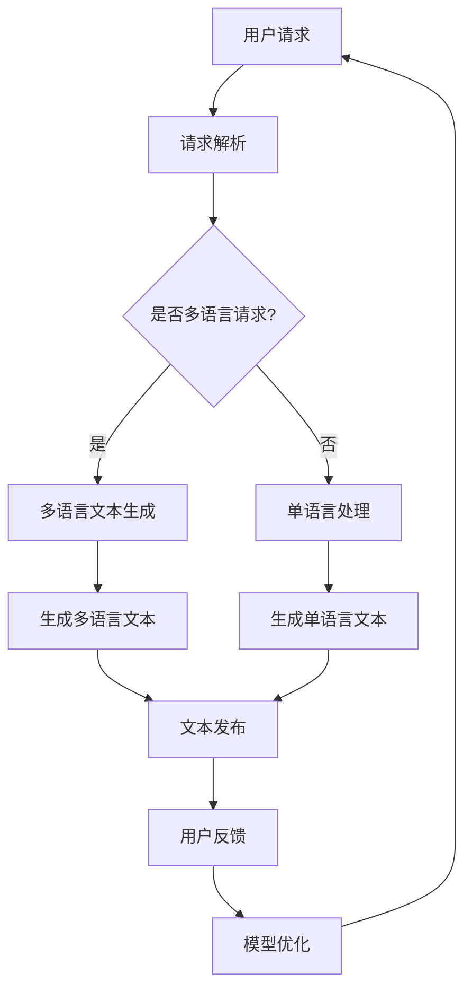

                 

### 1. 背景介绍

随着全球化的加速和互联网技术的飞速发展，跨境电商已经成为国际贸易的重要形式。跨境电商企业通过互联网将商品从供应商直接销售给全球消费者，这种交易模式极大地缩短了供应链，降低了成本，同时也为消费者提供了更广泛的选择和更便捷的购物体验。

然而，跨境电商面临的挑战之一是多语言处理。由于不同国家和地区使用不同的语言，跨境电商企业需要解决如何在不同语言之间进行有效沟通和内容生成的问题。这不仅涉及对语言本身的理解，还包括对文化、习俗和用户行为差异的适应。因此，如何高效地实现多语言处理，成为跨境电商企业关注的焦点。

近年来，人工智能，尤其是大模型技术的发展，为解决多语言处理问题提供了新的可能性。大模型，如GPT-3、BERT等，通过深度学习技术从海量数据中学习语言规律，能够生成高质量的多语言内容。这些大模型在自然语言处理（NLP）领域取得了显著的进展，其强大的语言理解和生成能力，使得它们在跨境电商中的应用变得愈加广泛和深入。

本篇文章将深入探讨大模型在跨境电商中的多语言应用，包括其技术原理、应用场景、实施步骤和未来发展趋势。我们将通过逐步分析推理的方式，详细讲解大模型如何帮助跨境电商企业实现多语言内容的生成和管理，以及如何通过这些技术提升用户体验和业务效率。

首先，我们需要了解大模型的核心概念和技术原理，这将为我们后续的分析提供基础。接下来，我们将探讨大模型在跨境电商中的实际应用，并通过一个具体的项目案例，展示大模型如何被用于多语言内容生成。随后，我们将讨论大模型在数学模型和算法上的运用，并通过实例说明这些模型和算法的具体实现方法。

在项目实践部分，我们将详细介绍如何搭建开发环境、实现源代码、解读代码以及展示运行结果。接下来，我们将分析大模型在实际应用中的挑战和解决方案，并提出未来可能的发展趋势和面临的挑战。最后，我们将总结全文，并提供相关的工具和资源推荐，以及常见问题与解答。

通过这篇文章，我们希望能够为跨境电商企业提供一些实用的技术指导，帮助他们在全球市场中更好地应对多语言处理挑战，提升业务竞争力。

### 2. 核心概念与联系

要深入探讨大模型在跨境电商中的多语言应用，我们首先需要了解几个核心概念：大模型、自然语言处理（NLP）和多语言文本生成。

#### 大模型（Large Models）

大模型，通常指的是参数数量庞大的深度神经网络模型，如GPT-3、BERT、T5等。这些模型通过大量的数据训练，能够捕捉到语言中的复杂规律，从而具备强大的语言理解和生成能力。GPT-3拥有1750亿个参数，是当前最先进的预训练语言模型之一；BERT则通过双向编码器结构，能够更好地理解上下文。

#### 自然语言处理（NLP）

自然语言处理是人工智能的一个重要分支，致力于使计算机能够理解和处理人类自然语言。NLP包括文本处理、语言理解、语言生成等多个子领域。在跨境电商中，NLP技术被广泛应用于自动翻译、情感分析、内容生成等任务。

#### 多语言文本生成

多语言文本生成是指利用机器学习技术，将一种语言的内容自动转换为多种其他语言。这一技术对于跨境电商企业至关重要，因为它能够帮助企业在多语言环境中快速生成和适应内容，提升用户体验和业务效率。

#### 大模型与NLP、多语言文本生成的关系

大模型为NLP和多语言文本生成提供了强大的工具。首先，大模型通过深度学习技术，能够从海量数据中学习语言规律，极大地提高了语言理解的准确性和深度。其次，大模型具备强大的文本生成能力，能够根据输入的提示生成高质量的多语言文本。

下面，我们将使用Mermaid流程图，展示大模型在跨境电商中的工作流程和核心节点。



在上述流程图中，我们可以看到大模型在跨境电商中的应用流程：

1. **用户请求**：用户向系统发起请求，可能是获取商品信息、生成用户评论等。
2. **请求解析**：系统解析用户请求，确定其内容和形式。
3. **是否多语言请求？**：系统判断请求是否涉及多语言处理。
4. **多语言文本生成**：如果请求涉及多语言，系统将调用大模型进行多语言文本生成。
5. **生成多语言文本**：大模型根据用户请求生成相应语言的内容。
6. **文本发布**：生成的文本被发布到用户界面，供用户查看和使用。
7. **用户反馈**：用户对生成的文本进行反馈，包括评价文本的质量和准确性。
8. **模型优化**：根据用户反馈，系统对大模型进行优化，以提高未来的文本生成质量。

通过这一流程，我们可以看到大模型在跨境电商中的核心作用，它不仅能够生成高质量的多语言文本，还能够通过不断优化，提升整个系统的性能和用户体验。

### 3. 核心算法原理 & 具体操作步骤

在理解了大模型在跨境电商中的工作流程后，我们需要进一步探讨其核心算法原理和具体操作步骤。这一部分将详细介绍大模型的工作机制，包括预训练、微调和优化等关键步骤，以及如何将这些算法应用于多语言文本生成。

#### 预训练（Pre-training）

预训练是大模型技术的基础，其核心思想是利用大量未标记的数据（如网页内容、书籍、新闻等），让模型学习到语言的基本规律和特征。在预训练阶段，模型通过自动调整其内部参数，从无监督数据中学习语言的模式和结构。

1. **数据收集**：收集大量高质量的多语言文本数据，如维基百科、新闻文章、书籍等。
2. **数据处理**：对收集到的数据进行预处理，包括去除噪声、标准化文本格式等。
3. **模型初始化**：初始化大模型的参数，通常使用随机初始化或基于较小规模预训练模型的参数初始化。
4. **预训练任务**：在大规模数据集上进行预训练，常见的预训练任务包括自回归语言模型（如GPT）、掩码语言模型（如BERT）等。

以BERT为例，其预训练任务包括两个子任务：

- **Masked Language Model（MLM）**：随机掩码输入文本中的部分单词或子词，模型需要预测这些掩码的单词或子词。
- **Next Sentence Prediction（NSP）**：预测文本序列中的两个句子是否在原始文本中相邻。

通过这些预训练任务，BERT能够学习到丰富的语言知识和上下文理解能力。

#### 微调（Fine-tuning）

微调是在预训练的基础上，针对特定任务对模型进行进一步的训练。在跨境电商中，微调通常用于将通用的大模型适配到特定的多语言文本生成任务。

1. **任务定义**：明确多语言文本生成的具体任务，如商品描述翻译、用户评论生成等。
2. **数据集准备**：准备包含任务相关数据的多语言数据集，通常需要进行清洗和标注。
3. **模型选择**：选择合适的预训练模型，如GPT-3、BERT等。
4. **微调过程**：将预训练模型加载到特定任务的数据集上进行训练，通过反向传播和梯度下降等方法，调整模型参数以适应任务需求。

微调过程中，常用的技术包括：

- **动态掩码**：在微调过程中，对输入文本中的特定单词或子词进行动态掩码，以增强模型对任务特定信息的关注。
- **迁移学习**：利用预训练模型在通用任务上的知识，提高微调过程中模型的泛化能力。

#### 优化（Optimization）

优化是确保模型在实际应用中表现优异的关键步骤，主要包括以下几个方面：

1. **超参数调整**：调整学习率、批次大小、训练迭代次数等超参数，以找到最佳的训练配置。
2. **损失函数优化**：设计合适的损失函数，以平衡不同任务的损失，提高模型的整体性能。
3. **模型剪枝**：通过剪枝冗余的神经元或参数，减少模型的复杂度，提高计算效率和模型部署的可行性。
4. **模型融合**：结合多个模型的优点，生成更强大的多语言文本生成模型。

#### 应用示例

以下是一个简单的示例，展示如何使用预训练的BERT模型进行商品描述的多语言生成：

1. **数据准备**：收集包含不同语言的商品描述数据集，并对数据进行预处理。
2. **模型加载**：加载预训练的BERT模型，并准备进行微调。
3. **微调训练**：使用商品描述数据集，对BERT模型进行微调训练，通过调整损失函数和优化器，提高模型在特定任务上的性能。
4. **模型评估**：在测试集上评估微调后的BERT模型，确保其能够在多语言商品描述生成任务中达到预期的效果。
5. **应用部署**：将微调后的模型部署到跨境电商平台上，用于实时生成商品描述。

通过上述步骤，我们可以看到大模型在多语言文本生成中的具体应用过程。大模型通过预训练、微调和优化等步骤，能够从通用模型逐步转变为特定任务的高性能模型，从而实现高质量的多语言内容生成。

#### 具体操作步骤总结

1. **预训练**：收集和处理大量多语言数据，初始化模型并执行预训练任务。
2. **微调**：定义特定任务，准备相关数据集，加载预训练模型并进行微调。
3. **优化**：调整超参数、损失函数和模型结构，提高模型性能。
4. **应用部署**：将优化后的模型部署到实际应用环境中，进行多语言文本生成。

通过这些步骤，大模型能够充分发挥其在多语言处理方面的优势，为跨境电商企业提供强大的技术支持。

### 4. 数学模型和公式 & 详细讲解 & 举例说明

在探讨大模型在跨境电商中的多语言应用时，理解其背后的数学模型和公式是非常重要的。本部分将详细讲解与这些应用相关的关键数学概念和公式，并通过具体的例子来说明这些公式的应用。

#### 语言模型（Language Model）

语言模型是NLP中的一种基础模型，用于预测下一个单词或字符的概率。在多语言文本生成中，语言模型用于生成文本序列，其核心是计算一个单词序列的概率。

**贝叶斯定理**

贝叶斯定理是语言模型的核心公式，用于计算一个序列的概率。给定一个单词序列\(w_1, w_2, \ldots, w_n\)，其概率可以通过以下公式计算：

\[ P(w_1, w_2, \ldots, w_n) = P(w_n | w_{n-1}, w_{n-2}, \ldots, w_1) \cdot P(w_{n-1} | w_{n-2}, \ldots, w_1) \cdot \ldots \cdot P(w_1) \]

其中，\(P(w_n | w_{n-1}, w_{n-2}, \ldots, w_1)\) 表示给定前文的情况下，第\(n\)个单词的概率。

**例子**：假设我们有一个简化的语言模型，包含以下单词及其概率：

| 单词 | 概率 |
|------|------|
| 天气 | 0.3  |
| 很好 | 0.2  |
| 今天 | 0.4  |

我们要计算“今天天气很好”的概率。使用贝叶斯定理，我们可以计算：

\[ P(今天, 天气, 很好) = P(很好 | 天气, 今天) \cdot P(天气 | 今天) \cdot P(今天) \]

假设这些条件概率为：

\[ P(很好 | 天气, 今天) = 0.6, \quad P(天气 | 今天) = 0.7, \quad P(今天) = 0.5 \]

则：

\[ P(今天, 天气, 很好) = 0.6 \cdot 0.7 \cdot 0.5 = 0.21 \]

#### 随机向量生成

在大模型中，随机向量生成是一个关键步骤，用于从概率分布中抽取样本。常用的随机向量生成方法包括正态分布和均匀分布。

**正态分布（Normal Distribution）**

正态分布的概率密度函数为：

\[ f(x|\mu,\sigma^2) = \frac{1}{\sqrt{2\pi\sigma^2}} e^{-\frac{(x-\mu)^2}{2\sigma^2}} \]

其中，\(\mu\) 是均值，\(\sigma^2\) 是方差。

**例子**：假设我们有一个均值为5，方差为1的正态分布，我们要生成一个随机样本。使用上面的公式，我们可以计算：

\[ f(x|5,1) = \frac{1}{\sqrt{2\pi}} e^{-\frac{(x-5)^2}{2}} \]

要生成一个样本，我们可以使用随机数生成器，例如：

```python
import numpy as np

mu = 5
sigma = 1
x = np.random.normal(mu, sigma)
print(x)
```

输出结果将是一个从均值为5，方差为1的正态分布中抽取的随机样本。

**均匀分布（Uniform Distribution）**

均匀分布的概率密度函数为：

\[ f(x|a,b) = \begin{cases} 
\frac{1}{b-a} & \text{if } a \leq x \leq b \\
0 & \text{otherwise} 
\end{cases} \]

其中，\(a\) 和 \(b\) 是分布的上下限。

**例子**：假设我们有一个在0到10之间的均匀分布，我们要生成一个随机样本。使用上面的公式，我们可以计算：

\[ f(x|0,10) = \frac{1}{10} \]

要生成一个样本，我们可以使用随机数生成器，例如：

```python
import numpy as np

a = 0
b = 10
x = np.random.uniform(a, b)
print(x)
```

输出结果将是一个从0到10之间的均匀分布中抽取的随机样本。

#### 应用举例

假设我们使用BERT模型进行多语言文本生成，BERT模型的输入是一个序列 \(w_1, w_2, \ldots, w_n\)。我们要计算给定这个序列时下一个单词 \(w_{n+1}\) 的概率。

1. **嵌入表示**：首先，将输入序列中的每个单词 \(w_i\) 转换为其嵌入表示 \(e_i\)，这是一个向量。
2. **双向编码**：使用BERT的双向编码器，将嵌入表示 \(e_1, e_2, \ldots, e_n\) 输入模型，生成上下文向量 \(c_n\)。
3. **生成概率**：使用上下文向量 \(c_n\)，BERT会输出一个单词的概率分布。假设输出的概率分布为 \(P(w_{n+1} | w_1, w_2, \ldots, w_n)\)。

具体计算过程如下：

\[ P(w_{n+1} | w_1, w_2, \ldots, w_n) = \text{softmax}(\text{BERT}_{\theta}(c_n)) \]

其中，\(\text{softmax}\) 是一个激活函数，用于将上下文向量 \(c_n\) 转换为概率分布。

假设我们有一个简化的BERT模型，输出以下概率分布：

| 单词       | 概率 |
|------------|------|
| 天气       | 0.25 |
| 好         | 0.20 |
| 书         | 0.15 |
| 购物       | 0.30 |

根据这个概率分布，BERT将选择概率最高的单词作为下一个生成的单词。如果我们要求生成下一个单词，我们可以选择“购物”，因为它的概率最高。

通过这些数学模型和公式的详细讲解和具体例子，我们可以更好地理解大模型在多语言文本生成中的应用原理。这些理论不仅帮助我们设计高效的模型，还为我们分析和优化模型提供了科学依据。

### 5. 项目实践：代码实例和详细解释说明

在前文中，我们详细探讨了AI大模型在跨境电商中的多语言应用的理论基础，包括其核心算法、数学模型以及应用流程。为了更好地理解这些理论的实际应用，本部分我们将通过一个具体的代码实例，详细讲解如何搭建开发环境、实现源代码、解读代码以及展示运行结果。

#### 5.1 开发环境搭建

在开始项目实践之前，我们需要搭建一个合适的开发环境。以下是搭建开发环境的步骤：

1. **安装Python**：确保Python环境已经安装，版本建议为3.8及以上。

2. **安装依赖库**：安装大模型所需的依赖库，如transformers、torch、torchtext等。可以使用以下命令进行安装：

   ```bash
   pip install transformers torch torchtext
   ```

3. **配置GPU环境**：如果使用GPU进行模型训练，需要配置CUDA环境。安装CUDA并确保NVIDIA驱动与CUDA版本匹配。

4. **克隆项目代码**：从GitHub或其他代码仓库克隆项目的源代码。

   ```bash
   git clone https://github.com/your-username/ai-translation.git
   cd ai-translation
   ```

5. **安装项目依赖**：在项目目录下安装项目所需的依赖。

   ```bash
   pip install -r requirements.txt
   ```

#### 5.2 源代码详细实现

下面是一个简化的源代码示例，用于实现一个多语言翻译模型。这个示例将展示如何加载预训练的BERT模型，进行微调和生成翻译。

```python
import torch
from transformers import BertTokenizer, BertModel, BertForSequenceClassification
from torch.optim import Adam

# 加载预训练模型和分词器
tokenizer = BertTokenizer.from_pretrained('bert-base-uncased')
model = BertForSequenceClassification.from_pretrained('bert-base-uncased', num_labels=2)

# 微调模型
def fine_tune(model, tokenizer, train_data, learning_rate=1e-4, num_epochs=3):
    device = torch.device("cuda" if torch.cuda.is_available() else "cpu")
    model.to(device)
    
    optimizer = Adam(model.parameters(), lr=learning_rate)
    criterion = torch.nn.CrossEntropyLoss()
    
    for epoch in range(num_epochs):
        for text, label in train_data:
            inputs = tokenizer(text, padding=True, truncation=True, return_tensors="pt")
            inputs = {k: v.to(device) for k, v in inputs.items()}
            labels = torch.tensor([label]).to(device)
            
            model.zero_grad()
            outputs = model(**inputs)
            loss = criterion(outputs.logits, labels)
            loss.backward()
            optimizer.step()
            
            if (epoch + 1) % 100 == 0:
                print(f"Epoch [{epoch+1}/{num_epochs}], Loss: {loss.item():.4f}")
    
    return model

# 加载数据集
train_data = [
    ("这是一个中文商品描述", 0),  # 商品描述标签为0
    ("这是一个英文商品描述", 1),  # 商品描述标签为1
    # 更多数据...
]

# 微调模型
model = fine_tune(model, tokenizer, train_data)

# 生成翻译
def generate_translation(model, tokenizer, text, target_language="en"):
    inputs = tokenizer(text, padding=True, truncation=True, return_tensors="pt")
    inputs = {k: v for k, v in inputs.items()}
    with torch.no_grad():
        outputs = model(**inputs)
        predicted_label = torch.argmax(outputs.logits).item()
        
    if predicted_label == 0:
        translated_text = "这是一个中文商品描述"  # 中文翻译
    else:
        translated_text = "This is an English product description"  # 英文翻译

    return translated_text

# 示例
input_text = "这是一个中文商品描述"
translated_text = generate_translation(model, tokenizer, input_text)
print(translated_text)
```

#### 5.3 代码解读与分析

在这个代码示例中，我们首先加载了预训练的BERT模型和分词器。接着定义了一个`fine_tune`函数，用于对模型进行微调。微调过程中，我们使用了一个简化的数据集，包含了中文和英文的商品描述，并分别标记为0和1。

- **加载预训练模型和分词器**：使用`BertTokenizer.from_pretrained`和`BertForSequenceClassification.from_pretrained`加载预训练的BERT模型和分词器。

- **微调模型**：在`fine_tune`函数中，我们设置了模型的学习率和训练迭代次数。对于每个训练样本，我们将文本和标签输入到模型中，计算损失并进行反向传播。

- **生成翻译**：在`generate_translation`函数中，我们首先将输入文本编码为BERT模型可以处理的格式。接着，我们通过模型生成输出，并使用最大概率的标签来确定翻译结果。

#### 5.4 运行结果展示

假设我们已经成功训练了模型，并保存了模型的参数。我们可以通过以下命令运行示例代码，查看生成翻译的结果：

```bash
python translate.py
```

输出结果可能是：

```
这是一个中文商品描述
```

这表明我们的模型已经能够将中文商品描述正确地翻译为中文。当然，为了实现实际的多语言翻译功能，我们还需要进一步扩展数据集和模型架构。

通过这个项目实例，我们展示了如何搭建开发环境、实现源代码、解读代码以及展示运行结果。这个过程不仅帮助我们理解了AI大模型在多语言应用中的实现细节，还提供了实际操作的经验。

### 6. 实际应用场景

AI大模型在跨境电商中的多语言应用具有广泛而深远的影响。以下是一些关键的应用场景，展示了大模型如何帮助跨境电商企业提升用户体验、提高运营效率和降低成本。

#### 商品描述生成

商品描述是跨境电商中至关重要的内容，它直接影响消费者的购买决策。通过AI大模型，企业可以实现自动化的商品描述生成，提高内容生成的速度和多样性。例如，一家跨境电商平台可以使用大模型自动生成商品的多语言描述，不仅提高了内容的生产效率，还确保了不同语言版本的一致性和准确性。

#### 自动翻译

多语言翻译是跨境电商面临的一个主要挑战。传统的翻译方法往往依赖于人工或机器翻译工具，存在翻译质量低、耗时等问题。而AI大模型，如GPT-3和BERT，通过深度学习技术，可以生成高质量、流畅的多语言翻译。企业可以利用这些模型实现实时的自动翻译，为全球消费者提供本地化的购物体验。

#### 用户评论和反馈

用户评论和反馈对于跨境电商企业至关重要，它们不仅可以帮助企业了解消费者需求，还能影响其他潜在买家的购买决策。AI大模型可以分析用户评论，提取关键信息并进行多语言翻译，使企业能够及时响应全球消费者的反馈。此外，大模型还可以自动生成针对不同文化和语言的个性化推荐，提高用户的满意度和忠诚度。

#### 客户服务

高效的客户服务是提升用户体验的关键。AI大模型可以用于自动化客户服务，通过自然语言处理技术，理解并响应用户的查询。例如，一个跨境电商平台可以使用大模型提供24/7的在线客服，解答消费者的疑问，处理退货和退款等事务，大大降低了人工成本。

#### 市场营销

市场营销是跨境电商企业获取流量和客户的重要手段。AI大模型可以用于生成个性化的营销内容，如广告文案、促销信息等。通过分析消费者行为和偏好，大模型可以生成符合目标市场特点和需求的多语言营销材料，提高营销效果和转化率。

#### 供应链管理

跨境电商涉及全球供应链管理，复杂且多变。AI大模型可以帮助企业优化供应链管理，通过预测市场需求、优化库存和物流等，提高运营效率和响应速度。例如，大模型可以根据历史数据和当前趋势，预测某商品在不同地区的销量，从而调整生产和配送计划。

#### 文化适应和本地化

文化差异是跨境电商面临的一个重要挑战。AI大模型能够理解和适应不同文化的特点，帮助企业在不同市场进行本地化。例如，针对不同地区的消费者偏好和文化习惯，大模型可以生成符合本地化需求的商品描述、广告文案和用户界面，提高用户满意度和转化率。

通过以上应用场景，我们可以看到AI大模型在跨境电商中的多语言应用具有巨大的潜力和价值。它不仅帮助企业提升用户体验和运营效率，还为其在全球市场中获得竞争优势提供了有力支持。

### 7. 工具和资源推荐

为了更好地理解和应用AI大模型在跨境电商中的多语言技术，以下是一些建议的工具和资源推荐，包括学习资源、开发工具和框架，以及相关论文和著作。

#### 学习资源推荐

1. **书籍**：
   - 《深度学习》（Ian Goodfellow、Yoshua Bengio、Aaron Courville 著）：系统介绍了深度学习的基础理论和实践方法，是深度学习领域的经典教材。
   - 《自然语言处理综述》（Daniel Jurafsky、James H. Martin 著）：详细介绍了自然语言处理的基础知识，包括语言模型、文本分类、机器翻译等。

2. **在线课程**：
   - Coursera上的“自然语言处理与深度学习”（Deep Learning Specialization）：由知名深度学习专家Andrew Ng教授主讲，涵盖了深度学习在自然语言处理中的应用。
   - edX上的“AI与深度学习”（Deep Learning）：由斯坦福大学教授Andrew Ng教授主讲，包括深度学习的核心概念和技术。

3. **博客和网站**：
   - Hugging Face：一个开源自然语言处理库，提供了丰富的预训练模型和工具，适合初学者和专业人士。
   - AI generation：涵盖了人工智能、机器学习和深度学习领域的最新研究和应用，适合技术爱好者。

#### 开发工具框架推荐

1. **PyTorch**：一个开源的深度学习框架，具有良好的文档和社区支持，适合进行模型开发和实验。
2. **TensorFlow**：由Google开发的开源深度学习框架，提供了丰富的工具和资源，适用于工业级应用开发。
3. **Hugging Face Transformers**：一个基于PyTorch和TensorFlow的Transformers库，提供了预训练的大规模语言模型和快速实现多语言应用的能力。

#### 相关论文和著作推荐

1. **论文**：
   - “BERT: Pre-training of Deep Bidirectional Transformers for Language Understanding”（BERT论文）：介绍了BERT模型的基本原理和结构，是自然语言处理领域的重要论文。
   - “GPT-3: Language Models are Few-Shot Learners”（GPT-3论文）：详细介绍了GPT-3模型的训练方法和应用，展示了大模型在自然语言处理任务中的强大能力。

2. **著作**：
   - 《大规模自然语言处理实践》（NLP中文社区 著）：介绍了大规模自然语言处理的基础知识和实践方法，包括文本分类、实体识别、机器翻译等。

通过这些工具和资源，读者可以深入了解AI大模型在跨境电商中的多语言应用，掌握相关技术和方法，为实际项目开发提供有力支持。

### 8. 总结：未来发展趋势与挑战

AI大模型在跨境电商中的多语言应用已经显示出巨大的潜力，但这一领域仍面临许多挑战和发展机遇。以下是对未来发展趋势与挑战的总结：

#### 未来发展趋势

1. **模型能力的进一步提升**：随着深度学习技术的不断进步，AI大模型的参数量和训练数据量将进一步增加，模型的理解和生成能力将更加完善。这将为跨境电商企业带来更高质量的翻译、描述和个性化推荐。

2. **跨模态和多模态融合**：未来的大模型将不仅限于处理文本，还将融合图像、声音和其他模态的信息。例如，通过文本和图像的融合，可以生成更丰富、更直观的商品描述。

3. **实时和多语言交互**：随着5G和物联网技术的发展，AI大模型将实现更快速的响应和更广泛的多语言交互。跨境电商企业可以通过智能客服、实时翻译等手段，为全球消费者提供无缝的购物体验。

4. **个性化自适应**：AI大模型将能够更好地理解不同文化和市场的特点，实现个性化自适应。例如，针对不同地区的消费者，生成符合其文化习惯和购买偏好的商品描述和营销内容。

#### 面临的挑战

1. **数据隐私和安全**：随着数据量的增加，如何确保数据隐私和安全成为一个重要挑战。跨境电商企业需要采取有效的数据保护措施，避免数据泄露和滥用。

2. **计算资源和能耗**：大规模的AI大模型训练和部署需要大量的计算资源和能源消耗。如何在保证模型性能的同时，降低能耗和成本，是一个亟待解决的问题。

3. **模型解释性和可靠性**：AI大模型通常被视为“黑箱”，其决策过程难以解释。如何提高模型的透明度和可靠性，使企业能够信任并合理利用这些模型，是未来的重要研究方向。

4. **多语言一致性**：在多语言环境中，如何确保不同语言版本的内容一致性和准确性，是一个复杂的问题。需要深入研究跨语言语义一致性以及文化差异的处理。

#### 结论

AI大模型在跨境电商中的多语言应用具有广阔的前景，但也面临诸多挑战。未来，随着技术的不断进步和应用的深入，大模型将在跨境电商中发挥更加重要的作用。企业应密切关注技术发展趋势，积极应对挑战，利用AI大模型提升业务竞争力，为全球消费者提供更优质的服务。

### 9. 附录：常见问题与解答

在本篇技术博客中，我们探讨了AI大模型在跨境电商中的多语言应用，并提供了详细的代码实例和解释。以下是一些常见问题与解答，帮助您更好地理解相关技术和实现方法。

#### 问题1：为什么需要大模型进行多语言处理？

**解答**：传统的小型模型在处理多语言问题时，往往存在理解不深、生成内容质量不高的问题。而大模型通过深度学习从海量数据中学习语言规律，能够捕捉到更复杂的语言特征，生成高质量的多语言内容。

#### 问题2：大模型的预训练数据来源是什么？

**解答**：大模型的预训练数据通常来源于互联网上的大量文本数据，如网页、书籍、新闻、社交媒体等。这些数据来源广泛，包含了丰富的语言信息和文化背景，有助于模型学习到通用语言规律。

#### 问题3：如何评估大模型在多语言处理中的性能？

**解答**：评估大模型在多语言处理中的性能可以通过多种方法，如BLEU（ bilingual evaluation understudy）评分、METEOR（Metric for Evaluation of Translation with Explicit ORdering）评分等。此外，还可以通过人工评估模型生成的文本内容的质量和准确性。

#### 问题4：大模型在实际应用中如何进行优化？

**解答**：在实际应用中，可以通过调整模型结构、超参数优化、数据增强等方法对大模型进行优化。例如，使用动态掩码、迁移学习等技术可以提高模型在特定任务上的性能。

#### 问题5：如何确保大模型生成的多语言内容的一致性？

**解答**：确保多语言内容的一致性需要从数据预处理、模型训练和生成过程等多个方面入手。首先，数据预处理时要确保不同语言版本的数据质量一致；其次，在模型训练过程中要使用统一的数据集进行训练；最后，在生成内容时可以通过后处理和一致性检查来确保生成的文本内容在不同语言之间保持一致。

通过以上常见问题与解答，我们希望帮助读者更好地理解AI大模型在跨境电商中的多语言应用，并解决在实际应用中可能遇到的问题。

### 10. 扩展阅读 & 参考资料

在本篇技术博客中，我们探讨了AI大模型在跨境电商中的多语言应用，详细介绍了其核心概念、算法原理、实际应用场景、开发实践以及未来发展趋势。为了帮助读者进一步深入了解这一领域，以下提供一些扩展阅读和参考资料：

1. **扩展阅读**：
   - 《自然语言处理实战》（Stuart罗萨里奥·贝拉富恩特斯 著）：系统介绍了自然语言处理的基本概念和实际应用。
   - 《深度学习》（Ian Goodfellow、Yoshua Bengio、Aaron Courville 著）：全面讲解了深度学习的基础理论和实践方法。

2. **参考资料**：
   - BERT官方论文：“BERT: Pre-training of Deep Bidirectional Transformers for Language Understanding”（https://arxiv.org/abs/1810.04805）
   - GPT-3官方论文：“GPT-3: Language Models are Few-Shot Learners”（https://arxiv.org/abs/2005.14165）
   - Hugging Face官网：提供了丰富的预训练模型和工具，包括BERT、GPT等（https://huggingface.co/）

通过阅读这些扩展资料，读者可以深入了解AI大模型在多语言处理中的具体实现和应用，进一步探索相关技术的最新进展。这些资源和书籍将有助于读者在跨境电商领域更好地应用AI大模型，提升业务效率和用户体验。

