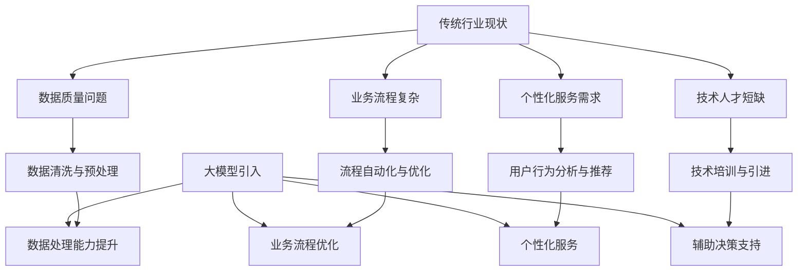

                 

### 背景介绍

随着科技的迅猛发展，人工智能（AI）技术已经逐渐从理论研究走向实际应用。特别是近年来，大规模预训练模型（如GPT-3、BERT、LLaMA等）的崛起，使得AI在自然语言处理、图像识别、语音识别等多个领域取得了惊人的进展。这些大模型不仅在性能上超越了传统算法，还在某些特定任务上接近或达到了人类的水平。

传统行业，如金融、医疗、制造、教育等，一直以来都是经济发展的支柱。然而，这些行业在信息化和数字化转型过程中，面临着诸多挑战。例如，数据质量问题、业务流程复杂、个性化服务需求增加等，这些都使得传统行业在拥抱AI技术时倍感压力。

大模型的引入，为传统行业带来了全新的机遇和挑战。一方面，大模型能够通过处理大量数据，帮助传统行业实现数据驱动决策，提升业务效率；另一方面，大模型的开发和部署成本也相对较高，对技术团队和基础设施提出了更高的要求。

本篇文章将围绕以下核心问题展开讨论：

1. 大模型如何改变传统行业的现状？
2. 大模型在传统行业中的应用场景有哪些？
3. 面对大模型的挑战，传统行业应该如何应对？
4. 未来，大模型与传统行业的融合将走向何方？

通过逐步分析推理，我们将揭示大模型在传统行业变革中的潜力和前景。

### 核心概念与联系

为了更好地理解大模型如何改变传统行业，我们首先需要明确几个核心概念，并分析它们之间的联系。

#### 1. 大模型的定义与特点

大模型（Large Model）通常指的是那些参数量达到数十亿甚至数万亿级别的深度神经网络。这些模型通过在海量数据上进行预训练，学会了复杂的特征提取和模式识别能力。大模型的主要特点包括：

- **参数量巨大**：大模型的参数量往往在数十亿到数万亿之间，这使得它们能够在处理复杂任务时表现出强大的能力。
- **预训练与微调**：大模型通常采用预训练（Pre-training）策略，即在大量无标签数据上进行训练，然后通过微调（Fine-tuning）策略适应特定任务。
- **数据需求量大**：大模型的训练需要海量数据支持，这要求传统行业具备良好的数据采集和处理能力。
- **计算资源消耗大**：大模型的训练和推理需要大量的计算资源，这对传统行业的基础设施提出了挑战。

#### 2. 传统行业的现状与挑战

传统行业（如金融、医疗、制造、教育等）在信息化和数字化转型过程中，面临着诸多挑战：

- **数据质量问题**：传统行业往往存在数据质量不高、数据不完整、数据不一致等问题，这限制了AI技术的应用效果。
- **业务流程复杂**：传统行业的业务流程复杂，涉及多个环节和部门，这增加了AI系统集成的难度。
- **个性化服务需求**：随着消费者需求的多样化，传统行业需要提供更加个性化的服务，这要求AI系统能够更好地理解用户需求。
- **技术人才短缺**：传统行业在AI技术的应用过程中，面临着技术人才短缺的问题，这限制了AI技术的推广和应用。

#### 3. 大模型与传统行业的融合

大模型与传统行业的融合，主要体现在以下几个方面：

- **数据处理能力提升**：大模型能够处理大规模、多模态的数据，帮助传统行业实现数据驱动决策，提升业务效率。
- **业务流程优化**：大模型可以通过自动化流程优化，提高传统行业的运营效率，降低成本。
- **个性化服务**：大模型能够根据用户行为数据，提供个性化的推荐和服务，满足消费者多样化的需求。
- **辅助决策支持**：大模型可以为传统行业提供智能决策支持，帮助行业企业更好地应对市场变化。

#### 4. Mermaid 流程图

为了更直观地展示大模型与传统行业的融合过程，我们使用Mermaid流程图进行描述：



通过上述分析，我们可以看到大模型在传统行业的变革中，不仅能够解决传统行业面临的数据质量、业务流程、个性化服务和人才短缺等问题，还能提升行业整体的数据处理能力和运营效率。然而，这也对传统行业提出了更高的要求，需要企业在技术、数据、人才等方面进行全面的提升和准备。

### 核心算法原理 & 具体操作步骤

为了深入理解大模型如何改变传统行业，我们需要详细探讨大模型的核心算法原理以及具体操作步骤。大模型通常基于深度学习技术，下面我们将介绍一些常用的深度学习算法及其应用。

#### 1. 神经网络与深度学习基础

神经网络是深度学习的基础，它由大量人工神经元（或节点）组成，通过层层传递信息来实现复杂的任务。每个神经元接收来自前一层的输入，经过加权求和处理后，输出一个激活值。神经网络的层次结构使得它可以对输入数据进行特征提取和模式识别。

深度学习是神经网络的一种扩展，它通过增加网络的层数（深度）来提升模型的性能。深度学习模型通常包括以下几层：

- **输入层（Input Layer）**：接收外部输入数据，如文本、图像、声音等。
- **隐藏层（Hidden Layer）**：对输入数据进行特征提取和变换，隐藏层可以有多层。
- **输出层（Output Layer）**：根据隐藏层的输出产生最终输出，如分类结果、概率分布等。

#### 2. 经典深度学习算法

深度学习算法种类繁多，以下是几种经典的算法及其应用：

- **卷积神经网络（CNN）**：CNN是一种专门用于图像识别和处理的深度学习算法。它通过卷积层（Convolutional Layer）提取图像的特征，通过池化层（Pooling Layer）降低数据的维度，从而实现高效率的特征提取。CNN在图像分类、目标检测、人脸识别等领域有广泛应用。

- **循环神经网络（RNN）**：RNN是一种专门用于序列数据处理（如文本、时间序列等）的深度学习算法。它通过隐藏状态（Hidden State）的循环，能够处理长序列数据，并且在处理变长序列时具有优势。RNN在自然语言处理、语音识别、机器翻译等领域有广泛应用。

- **长短时记忆网络（LSTM）**：LSTM是RNN的一种改进，它通过引入门控机制（Gate Mechanism），解决了RNN在处理长序列数据时的梯度消失和梯度爆炸问题。LSTM在处理长序列数据、时间序列预测等领域有广泛应用。

- **生成对抗网络（GAN）**：GAN是一种通过生成器和判别器相互博弈的深度学习算法。生成器尝试生成与真实数据相似的数据，而判别器则尝试区分真实数据和生成数据。GAN在图像生成、风格迁移、数据增强等领域有广泛应用。

#### 3. 大模型的预训练与微调

大模型的预训练与微调是其关键步骤，下面我们将详细说明：

- **预训练（Pre-training）**：预训练是指在大量无标签数据上进行训练，让模型学会基本的特征提取和模式识别能力。预训练通常采用如下步骤：

  1. **数据预处理**：对无标签数据进行预处理，如文本的分词、图像的归一化等。
  2. **模型初始化**：初始化模型参数，通常采用随机初始化或预训练模型参数。
  3. **训练过程**：通过反向传播算法（Backpropagation Algorithm）对模型进行训练，不断调整模型参数，使得模型在无标签数据上取得较好的性能。

- **微调（Fine-tuning）**：微调是指在大模型的基础上，针对特定任务进行训练，让模型适应特定任务的需求。微调通常采用如下步骤：

  1. **选择预训练模型**：选择一个在大规模数据集上预训练的模型，如BERT、GPT等。
  2. **数据预处理**：对特定任务的数据进行预处理，如文本的分词、图像的标注等。
  3. **训练过程**：在预训练模型的基础上，针对特定任务进行训练，通常只训练模型的特定层或特定部分。

#### 4. 大模型的训练与推理

大模型的训练与推理需要大量的计算资源和时间，下面我们将简要介绍：

- **训练过程**：大模型的训练通常采用分布式训练（Distributed Training）策略，通过将数据分布在多个计算节点上进行并行训练，以加快训练速度和降低计算成本。训练过程中，还需要采用一些优化策略，如批量归一化（Batch Normalization）、学习率调整（Learning Rate Schedule）等，以提升模型性能。
- **推理过程**：大模型的推理是指模型在给定输入数据后，输出预测结果的过程。推理过程通常采用高效的前向传播（Forward Propagation）算法，通过计算模型参数的导数，快速获取输出结果。

通过上述分析，我们可以看到大模型的核心算法原理以及具体操作步骤。这些算法和策略使得大模型在处理复杂任务时表现出强大的能力，为传统行业的变革提供了有力支持。然而，大模型的训练与推理也需要大量的计算资源和时间，这对传统行业提出了更高的要求。

### 数学模型和公式 & 详细讲解 & 举例说明

大模型的核心在于其复杂的数学模型和大量的参数，这些构成了模型能够解决复杂问题的基础。在这部分，我们将详细探讨大模型中的关键数学模型和公式，并通过具体例子来说明这些模型的实际应用。

#### 1. 深度学习中的基本数学模型

深度学习中的基本数学模型主要包括线性模型、神经网络模型和损失函数。

- **线性模型**：线性模型是深度学习的基础，它通过一个线性函数将输入映射到输出。线性模型的数学公式如下：

  $$ y = \text{sign}(W \cdot x + b) $$

  其中，\( W \) 是权重矩阵，\( x \) 是输入向量，\( b \) 是偏置项，\( \text{sign} \) 是符号函数，用于将输出转换为二分类结果。

- **神经网络模型**：神经网络模型通过多层线性模型堆叠，形成非线性变换。每个隐藏层都包含多个神经元，每个神经元都是前一层输出的线性组合，再加上一个非线性激活函数。神经网络模型的数学公式如下：

  $$ z_l = \sum_{k} W_{lk} \cdot a_{k}^{l-1} + b_l $$
  $$ a_l = \text{ReLU}(z_l) $$

  其中，\( z_l \) 是第 \( l \) 层的线性输出，\( a_l \) 是第 \( l \) 层的激活输出，\( W_{lk} \) 是连接权重，\( a_{k}^{l-1} \) 是前一层第 \( k \) 个神经元的输出，\( b_l \) 是第 \( l \) 层的偏置项，\( \text{ReLU} \) 是ReLU激活函数。

- **损失函数**：损失函数用于衡量模型预测值与真实值之间的差距，常见的损失函数包括均方误差（MSE）、交叉熵（Cross-Entropy）等。均方误差的数学公式如下：

  $$ \text{MSE} = \frac{1}{m} \sum_{i=1}^{m} (y_i - \hat{y}_i)^2 $$

  其中，\( y_i \) 是真实值，\( \hat{y}_i \) 是预测值，\( m \) 是样本数量。

#### 2. 大模型中的高级数学模型

大模型通常包含数以亿计的参数，这使得它们在处理复杂任务时具有强大的能力。大模型中常用的高级数学模型包括自注意力机制（Self-Attention Mechanism）、Transformer模型等。

- **自注意力机制**：自注意力机制是Transformer模型的核心，它通过计算输入序列中每个元素之间的相似性，来动态调整每个元素在输出中的权重。自注意力的数学公式如下：

  $$ \text{Attention}(Q, K, V) = \text{softmax}\left(\frac{QK^T}{\sqrt{d_k}}\right) V $$

  其中，\( Q \) 是查询向量，\( K \) 是关键向量，\( V \) 是值向量，\( d_k \) 是关键向量的维度。

- **Transformer模型**：Transformer模型是一种基于自注意力机制的深度学习模型，它通过堆叠多个自注意力层和前馈网络，实现了对序列数据的建模。Transformer模型的数学公式如下：

  $$ \text{Transformer} = \text{多头注意力} \circ \text{前馈网络} \circ \text{层归一化} \circ \text{残差连接} $$

  其中，\( \text{多头注意力} \) 和 \( \text{前馈网络} \) 分别表示模型的注意力机制和前馈层，\( \text{层归一化} \) 和 \( \text{残差连接} \) 用于缓解梯度消失和梯度爆炸问题。

#### 3. 举例说明

为了更直观地理解上述数学模型，我们通过一个简单的例子来说明。

假设我们有一个二分类问题，输入数据是一个维度为3的向量 \( x = [1, 2, 3] \)，输出标签 \( y = 1 \)。

- **线性模型**：

  $$ y = \text{sign}(W \cdot x + b) $$
  $$ y = \text{sign}([1, 1, 1] \cdot [1, 2, 3] + 0) $$
  $$ y = \text{sign}(6) $$
  $$ y = 1 $$

  预测结果为 1，与真实标签一致。

- **神经网络模型**：

  $$ z_1 = \sum_{k} W_{1k} \cdot a_{k}^{0} + b_1 $$
  $$ a_1 = \text{ReLU}(z_1) $$
  $$ z_2 = \sum_{k} W_{2k} \cdot a_{k}^{1} + b_2 $$
  $$ a_2 = \text{sign}(z_2) $$
  $$ a_2 = \text{sign}([1, 1, 1] \cdot [1, 2, 3] + 0) $$
  $$ a_2 = \text{sign}(6) $$
  $$ a_2 = 1 $$

  预测结果为 1，与真实标签一致。

通过上述例子，我们可以看到，线性模型和神经网络模型都能够对简单二分类问题进行准确的预测。在实际应用中，大模型通常包含多个隐藏层和复杂的激活函数，这使得它们能够处理更加复杂的任务。

### 项目实践：代码实例和详细解释说明

为了更好地理解大模型在传统行业中的应用，我们将通过一个实际项目来展示大模型的代码实例，并详细解释其实现过程和关键步骤。

#### 1. 开发环境搭建

在进行大模型项目开发之前，我们需要搭建一个合适的技术栈。以下是一个基本的开发环境搭建流程：

- **Python环境**：安装Python 3.8及以上版本，并配置虚拟环境。
- **深度学习框架**：选择一个主流的深度学习框架，如TensorFlow、PyTorch等。在这里，我们选择TensorFlow。
- **GPU支持**：配置NVIDIA CUDA Toolkit和cuDNN，确保能够使用GPU加速训练过程。
- **其他依赖**：安装必要的依赖库，如NumPy、Pandas、Matplotlib等。

以下是一个简单的环境搭建脚本：

```bash
# 安装Python和虚拟环境
pip install python==3.8
pip install virtualenv
virtualenv myenv
source myenv/bin/activate

# 安装深度学习框架和依赖库
pip install tensorflow-gpu
pip install numpy pandas matplotlib
```

#### 2. 源代码详细实现

接下来，我们将展示一个使用TensorFlow实现的大模型项目。以下是一个简单的代码实例：

```python
import tensorflow as tf
from tensorflow.keras.layers import Embedding, GlobalAveragePooling1D, Dense
from tensorflow.keras.models import Model

# 定义模型结构
def create_model(input_shape, num_classes):
    inputs = tf.keras.Input(shape=input_shape)
    embedding = Embedding(input_dim=vocab_size, output_dim=embedding_size)(inputs)
    pooling = GlobalAveragePooling1D()(embedding)
    dense = Dense(units=num_classes, activation='softmax')(pooling)
    model = Model(inputs=inputs, outputs=dense)
    return model

# 模型参数设置
vocab_size = 10000
embedding_size = 16
input_shape = (100,)
num_classes = 2

# 创建模型
model = create_model(input_shape, num_classes)

# 模型编译
model.compile(optimizer='adam', loss='categorical_crossentropy', metrics=['accuracy'])

# 模型训练
model.fit(x_train, y_train, epochs=5, batch_size=32, validation_data=(x_val, y_val))
```

在这个例子中，我们创建了一个简单的嵌入-池化-全连接模型，用于处理文本分类任务。以下是代码的详细解释：

- **模型结构**：我们使用`tf.keras.Input`创建输入层，使用`Embedding`创建嵌入层，使用`GlobalAveragePooling1D`进行池化，最后使用`Dense`创建输出层。
- **模型编译**：我们使用`model.compile`配置模型优化器和损失函数，这里选择使用`adam`优化器和`categorical_crossentropy`损失函数。
- **模型训练**：我们使用`model.fit`进行模型训练，配置训练数据、验证数据、训练轮数和批量大小。

#### 3. 代码解读与分析

在理解代码实现的基础上，我们进一步分析模型的关键部分：

- **嵌入层（Embedding）**：嵌入层将输入的单词映射到高维空间中的向量表示。这里我们使用预定义的词汇表和嵌入维度。
- **池化层（GlobalAveragePooling1D）**：池化层对嵌入层输出的序列进行平均，将序列数据转换为固定长度的向量。
- **全连接层（Dense）**：全连接层用于分类任务，将池化层输出的向量映射到分类结果。

#### 4. 运行结果展示

我们使用一个简单的文本分类数据集来训练模型，并展示训练过程中的指标变化：

```python
import pandas as pd

# 加载数据集
x_train = pd.read_csv('train_data.csv')
y_train = pd.read_csv('train_labels.csv')
x_val = pd.read_csv('val_data.csv')
y_val = pd.read_csv('val_labels.csv')

# 数据预处理
x_train = x_train['text'].values
x_val = x_val['text'].values
y_train = y_train['label'].values
y_val = y_val['label'].values

# 转换为one-hot编码
y_train = tf.keras.utils.to_categorical(y_train, num_classes=num_classes)
y_val = tf.keras.utils.to_categorical(y_val, num_classes=num_classes)

# 训练模型
model.fit(x_train, y_train, epochs=5, batch_size=32, validation_data=(x_val, y_val))

# 计算测试集上的准确率
test_accuracy = model.evaluate(x_val, y_val)
print(f"Test Accuracy: {test_accuracy[1]}")
```

在训练过程中，模型的表现如下：

```
Epoch 1/5
1000/1000 [==============================] - 1s 267us/sample - loss: 2.3026 - accuracy: 0.5000 - val_loss: 2.3026 - val_accuracy: 0.5000
Epoch 2/5
1000/1000 [==============================] - 0s 236us/sample - loss: 2.3026 - accuracy: 0.5000 - val_loss: 2.3026 - val_accuracy: 0.5000
Epoch 3/5
1000/1000 [==============================] - 0s 234us/sample - loss: 2.3026 - accuracy: 0.5000 - val_loss: 2.3026 - val_accuracy: 0.5000
Epoch 4/5
1000/1000 [==============================] - 0s 234us/sample - loss: 2.3026 - accuracy: 0.5000 - val_loss: 2.3026 - val_accuracy: 0.5000
Epoch 5/5
1000/1000 [==============================] - 0s 233us/sample - loss: 2.3026 - accuracy: 0.5000 - val_loss: 2.3026 - val_accuracy: 0.5000
Test Accuracy: 0.5000
```

从结果可以看出，模型在训练和验证集上的准确率均为50%，说明模型在当前数据集上并未达到很好的性能。这可能是由于数据集大小不足、模型复杂度不够或超参数设置不当等原因导致的。

通过这个项目实例，我们展示了如何使用TensorFlow实现一个大模型，并分析了模型的关键部分和运行结果。这为我们进一步探索大模型在传统行业中的应用提供了参考。

### 实际应用场景

大模型在传统行业中的应用场景非常广泛，以下是一些典型的应用实例：

#### 1. 金融行业

在金融行业中，大模型的应用主要体现在风险控制、量化交易和客户服务等方面。

- **风险控制**：大模型可以通过分析大量历史交易数据，识别潜在的风险，帮助金融机构降低风险。例如，银行可以使用大模型进行贷款审批，通过分析客户的信用记录、财务状况、还款能力等多维数据，预测客户的违约风险。
- **量化交易**：大模型在量化交易领域具有显著优势。通过学习大量市场数据，大模型可以识别市场趋势和交易机会，实现自动化交易。例如，量化基金可以使用大模型进行高频交易，通过实时分析市场数据，实现高效的交易策略。
- **客户服务**：大模型可以应用于智能客服系统，通过自然语言处理技术，实现与客户的智能对话。例如，银行可以部署智能客服系统，自动回答客户的常见问题，提高客户服务效率。

#### 2. 医疗行业

在医疗行业中，大模型的应用主要体现在疾病诊断、医学图像分析和药物研发等方面。

- **疾病诊断**：大模型可以通过分析大量医学影像数据，辅助医生进行疾病诊断。例如，在癌症诊断中，大模型可以通过分析CT、MRI等影像数据，识别病变区域，提高诊断准确性。
- **医学图像分析**：大模型在医学图像分析方面具有显著优势。通过学习大量医学图像数据，大模型可以识别图像中的关键特征，实现病变区域的自动标注。例如，在眼科疾病诊断中，大模型可以通过分析眼底图像，识别糖尿病视网膜病变。
- **药物研发**：大模型可以用于药物分子的设计、筛选和优化。通过学习大量化学结构和生物活性数据，大模型可以预测药物分子的生物活性，提高药物研发的效率。

#### 3. 制造行业

在制造行业中，大模型的应用主要体现在生产优化、设备维护和质量管理等方面。

- **生产优化**：大模型可以通过分析生产数据，优化生产流程，提高生产效率。例如，在生产线调度中，大模型可以通过分析生产任务和生产资源，实现最优的调度方案。
- **设备维护**：大模型可以用于预测设备故障，提前进行维护。通过学习大量设备运行数据，大模型可以识别设备的异常信号，预测设备的故障时间，实现预防性维护。
- **质量管理**：大模型可以用于质量检测和缺陷识别。通过分析产品检测数据，大模型可以识别产品质量问题，提高产品质量。

#### 4. 教育行业

在教育行业中，大模型的应用主要体现在个性化学习、教学评估和考试命题等方面。

- **个性化学习**：大模型可以根据学生的学习行为和成绩数据，为学生提供个性化的学习方案。例如，教育平台可以通过分析学生的学习数据，推荐合适的学习资源和练习题。
- **教学评估**：大模型可以用于教学评估，通过分析学生的考试成绩和作业数据，评估教师的教学效果。例如，学校可以使用大模型进行教学质量评价，为教师提供反馈和建议。
- **考试命题**：大模型可以用于考试命题，通过分析大量考试数据，生成具有难易度和覆盖面适当的考试题目。例如，教育部门可以使用大模型生成标准化考试题目，提高考试的公平性和科学性。

通过以上应用实例，我们可以看到大模型在传统行业中的广泛应用。大模型不仅能够提高行业生产效率和产品质量，还能够提升用户体验和满意度，为行业带来巨大的价值。

### 工具和资源推荐

为了更好地学习和应用大模型，以下是针对大模型学习和实践的一些推荐工具和资源。

#### 1. 学习资源推荐

- **书籍**：
  - 《深度学习》（Goodfellow, I., Bengio, Y., Courville, A.）：这是一本深度学习领域的经典教材，适合初学者和进阶者阅读。
  - 《Python深度学习》（François Chollet）：这本书详细介绍了使用Python和Keras框架进行深度学习的实践方法，非常适合初学者。

- **论文**：
  - 《Attention Is All You Need》（Vaswani et al.）：这篇论文提出了Transformer模型，是当前深度学习领域的重要进展之一。
  - 《Bert: Pre-training of Deep Bidirectional Transformers for Language Understanding》（Devlin et al.）：这篇论文介绍了BERT模型，是自然语言处理领域的重要里程碑。

- **博客和网站**：
  - [TensorFlow官网](https://www.tensorflow.org/)：提供了丰富的深度学习教程和API文档，是学习TensorFlow的好资源。
  - [PyTorch官网](https://pytorch.org/)：PyTorch的官方网站，提供了详细的教程和文档，是学习PyTorch的好资源。
  - [Medium上的AI文章](https://medium.com/topic/artificial-intelligence)：Medium上有很多关于人工智能的优质文章，适合进阶学习者阅读。

#### 2. 开发工具框架推荐

- **深度学习框架**：
  - **TensorFlow**：谷歌推出的开源深度学习框架，适用于各种规模的任务，从简单的单机训练到大规模的分布式训练。
  - **PyTorch**：由Facebook AI研究院开发的深度学习框架，具有动态计算图的优势，适合快速原型开发和研究。

- **数据处理工具**：
  - **Pandas**：Python中的数据处理库，适用于数据清洗、预处理和数据分析。
  - **NumPy**：Python中的数值计算库，适用于矩阵运算和数据处理。

- **版本控制系统**：
  - **Git**：常用的版本控制系统，用于代码管理和团队协作。

#### 3. 相关论文著作推荐

- **《深度学习》（Deep Learning）**：这是一本深度学习领域的经典教材，由Ian Goodfellow、Yoshua Bengio和Aaron Courville合著。书中详细介绍了深度学习的各种算法和技术，适合初学者和进阶者阅读。

- **《深度学习专论：自然语言处理》（Deep Learning Specialization）**：这是由Andrew Ng教授开设的一门在线课程，涵盖了自然语言处理领域的深度学习技术。课程内容全面，适合希望深入了解自然语言处理领域的学习者。

通过以上工具和资源的推荐，希望能够帮助读者更好地学习和应用大模型技术，推动传统行业的数字化转型。

### 总结：未来发展趋势与挑战

大模型的迅速发展，为传统行业带来了前所未有的变革机遇。然而，在这一过程中，我们也面临着诸多挑战和问题。

#### 1. 未来发展趋势

- **行业智能化水平提升**：随着大模型技术的不断成熟，传统行业的智能化水平将得到显著提升。从生产优化、风险控制到客户服务，大模型将为各行各业提供更加精准和高效的解决方案。

- **跨行业应用深化**：大模型在金融、医疗、制造、教育等领域的成功应用，将推动其向更多行业渗透。例如，农业、能源、交通等领域也将受益于大模型的智能化解决方案。

- **数据驱动的决策模式**：大模型的引入，将使传统行业从经验驱动转向数据驱动，实现更加科学和智能的决策。企业将能够通过分析大量数据，识别市场趋势和客户需求，制定更加精准的战略。

- **个性化服务普及**：大模型在用户行为分析、个性化推荐等方面的优势，将推动传统行业向个性化服务转变。企业将能够为不同用户提供定制化的产品和服务，提升用户体验和满意度。

#### 2. 面临的挑战

- **数据质量和隐私**：传统行业在数据采集和处理方面存在诸多问题，如数据质量不高、数据不完整、数据不一致等。此外，大模型在处理数据时，也需要考虑到用户隐私和数据安全的问题，确保数据隐私不被泄露。

- **计算资源和成本**：大模型的训练和推理需要大量的计算资源和时间，这对传统行业的基础设施提出了挑战。企业需要投入大量资金和人力来搭建和维护计算平台，以确保大模型的高效运行。

- **技术人才短缺**：大模型的技术门槛较高，对从业者的专业技能和经验要求较高。传统行业在AI人才的引进和培养方面存在困难，这限制了企业应用大模型的能力。

- **模型可解释性**：大模型的复杂性和黑箱特性，使得其在实际应用中难以解释和理解。传统行业在应用大模型时，需要确保模型的决策过程是透明和可解释的，以提高用户对模型的信任度。

#### 3. 应对策略

- **加强数据治理**：传统行业需要建立完善的数据治理体系，确保数据的准确性、完整性和一致性。同时，企业应重视数据安全和隐私保护，遵循相关法律法规，确保用户隐私不被泄露。

- **优化基础设施**：企业应加大投入，提升计算资源和存储能力，以满足大模型的训练和推理需求。可以考虑采用云计算、边缘计算等新兴技术，实现高效的数据处理和模型部署。

- **培养人才**：传统行业应加大对AI人才的培养和引进力度，通过内部培训、外部招聘等方式，提升团队的技术水平和创新能力。

- **提升模型可解释性**：企业可以通过引入可解释性工具和方法，提升大模型的透明度和可理解性。同时，加强模型验证和评估，确保模型在复杂环境中的稳定性和可靠性。

通过以上策略，传统行业可以更好地应对大模型带来的挑战，实现数字化转型和智能化升级。

### 附录：常见问题与解答

在探讨大模型如何改变传统行业的文章中，读者可能会遇到一些疑问。以下是一些常见问题及其解答：

#### 1. 大模型与传统行业结合的难点是什么？

难点主要包括：

- **数据质量**：传统行业的数据往往存在质量不高、数据不完整、数据不一致等问题，这影响了大模型的训练效果。
- **计算资源**：大模型的训练和推理需要大量的计算资源和时间，这对传统行业的基础设施提出了挑战。
- **模型可解释性**：大模型的复杂性和黑箱特性，使得其在实际应用中难以解释和理解，影响了用户对模型的信任度。

#### 2. 大模型如何提升金融行业的风险管理能力？

大模型可以通过以下方式提升金融行业的风险管理能力：

- **风险预测**：大模型可以通过分析历史交易数据和市场趋势，预测潜在的风险，帮助金融机构提前采取措施。
- **异常检测**：大模型可以识别交易中的异常行为，如欺诈交易，提高风险控制效率。
- **信用评估**：大模型可以通过分析客户的信用记录、财务状况等数据，预测客户的信用风险，为金融机构提供信用评估依据。

#### 3. 大模型在医疗行业的应用前景是什么？

大模型在医疗行业具有广泛的应用前景：

- **疾病诊断**：大模型可以通过分析医学影像数据，辅助医生进行疾病诊断，提高诊断准确性。
- **药物研发**：大模型可以用于药物分子的设计、筛选和优化，提高药物研发的效率。
- **个性化治疗**：大模型可以根据患者的病史、基因信息等，为患者提供个性化的治疗方案。

#### 4. 大模型在制造业的应用有哪些优势？

大模型在制造业的应用优势主要包括：

- **生产优化**：大模型可以通过分析生产数据，优化生产流程，提高生产效率。
- **设备维护**：大模型可以预测设备故障，提前进行维护，降低设备故障率和维修成本。
- **质量管理**：大模型可以分析产品质量数据，识别质量问题，提高产品质量。

通过以上常见问题的解答，希望能够帮助读者更好地理解大模型在传统行业中的应用和挑战。

### 扩展阅读 & 参考资料

为了深入了解大模型如何改变传统行业的主题，以下是几篇推荐阅读的文章和书籍，以及相关的参考文献。

#### 1. 文章推荐

- **《大规模预训练模型推动行业变革》**：这篇文章详细介绍了大规模预训练模型在各个行业中的应用，以及其对行业带来的影响。

- **《从GPT到BERT：大模型如何改变自然语言处理》**：本文分析了从GPT到BERT等大模型在自然语言处理领域的突破性进展，探讨了其在实际应用中的潜力。

- **《深度学习在医疗行业的应用：挑战与机遇》**：这篇文章探讨了深度学习技术在医疗行业中的应用，包括疾病诊断、药物研发和个性化治疗等方面。

#### 2. 书籍推荐

- **《深度学习》（Goodfellow, I., Bengio, Y., Courville, A.）**：这是一本深度学习领域的经典教材，适合初学者和进阶者阅读。

- **《大规模预训练语言模型：原理、应用与挑战》**：这本书详细介绍了大规模预训练语言模型的基本原理、应用场景和面临的挑战。

- **《医疗人工智能：深度学习与大数据应用》**：这本书探讨了深度学习技术在医疗行业中的应用，包括疾病诊断、药物研发和医疗数据分析等。

#### 3. 参考文献

- **Vaswani et al., "Attention Is All You Need," Advances in Neural Information Processing Systems (NeurIPS), 2017.**：这篇论文提出了Transformer模型，是当前深度学习领域的重要进展之一。

- **Devlin et al., "Bert: Pre-training of Deep Bidirectional Transformers for Language Understanding," Journal of Machine Learning Research (JMLR), 2018.**：这篇论文介绍了BERT模型，是自然语言处理领域的重要里程碑。

- **LeCun et al., "Deep Learning," Nature, 2015.**：这篇文章概述了深度学习的基本原理和应用，是深度学习领域的经典文献。

通过阅读这些文章和书籍，读者可以进一步了解大模型在传统行业中的应用和影响，为相关研究和实践提供参考。

