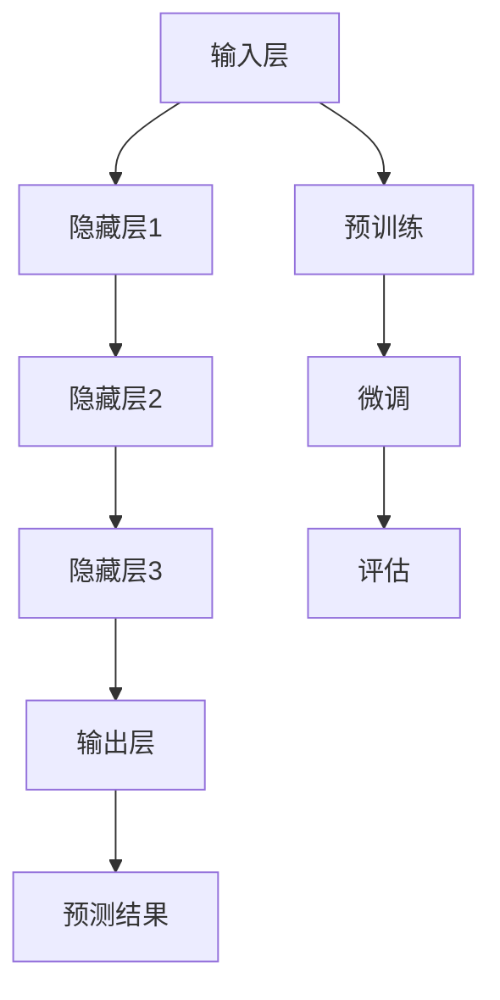

                 

### 1. 背景介绍

人工智能（AI）作为当前科技领域的热点话题，正在深刻改变着各行各业。特别是近年来，大型预训练模型（Large Pre-trained Models）的兴起，如OpenAI的GPT-3、Google的BERT等，使得AI的应用场景愈加广泛，从自然语言处理（NLP）到计算机视觉（CV）、从语音识别（ASR）到机器翻译（MT），无一不受益于这些强大模型。

全球市场对AI大模型的需求日益增长，不仅是因为其在提高效率、降低成本和创造新价值方面的潜力，更是因为它们能够解决复杂的问题，推动科技创新和产业升级。本篇文章将深入探讨AI大模型在全球市场的机遇，分析其发展现状、关键因素以及未来趋势。

首先，我们需要了解AI大模型的基本概念。AI大模型指的是那些具有巨大参数量、广泛知识储备和强大推理能力的神经网络模型。这些模型通过在海量数据上进行训练，能够自动学习和理解复杂模式，从而在各种任务上实现高水平的表现。例如，GPT-3拥有1750亿个参数，BERT的参数量也在数十亿级别，这些模型在处理复杂任务时展现出了卓越的能力。

随着这些大模型的不断优化和发展，它们的应用领域也在不断扩大。例如，在自然语言处理领域，AI大模型已经能够实现高质量的文本生成、文本摘要、问答系统等功能。在计算机视觉领域，大模型可以用于图像识别、目标检测、图像生成等任务。此外，AI大模型在语音识别、机器翻译、推荐系统等领域也都有着重要的应用。

在全球市场，AI大模型的发展不仅受到技术进步的推动，也受到政策、经济、社会等多方面因素的影响。例如，各国政府纷纷出台政策支持AI技术的发展，为企业提供了良好的创新环境。同时，全球化的经济体系也为AI大模型的应用提供了广阔的市场空间。无论是在金融、医疗、教育、娱乐等传统行业，还是在新兴的科技产业，AI大模型都展现出了巨大的潜力。

本文将从以下几个方面展开讨论：

1. **AI大模型的核心概念与联系**：我们将介绍AI大模型的基本概念、架构和主要组成部分，并通过Mermaid流程图展示其运作流程。
2. **核心算法原理与具体操作步骤**：我们将详细讲解AI大模型的核心算法，包括模型训练、优化和评估等过程。
3. **数学模型与公式**：我们将介绍AI大模型背后的数学模型和公式，并给出详细讲解和举例说明。
4. **项目实践**：我们将通过一个具体的代码实例，展示如何使用AI大模型解决实际问题。
5. **实际应用场景**：我们将探讨AI大模型在不同领域的应用案例，分析其带来的影响和价值。
6. **工具和资源推荐**：我们将推荐一些学习资源、开发工具和框架，帮助读者深入了解和掌握AI大模型技术。
7. **未来发展趋势与挑战**：我们将总结AI大模型的发展趋势和面临的挑战，探讨其未来前景。

通过本文的探讨，我们希望读者能够对AI大模型在全球市场的机遇有一个全面和深入的理解，从而为未来的学习和实践提供有益的指导。

### 2. 核心概念与联系

#### 2.1 AI大模型的基本概念

AI大模型，即大型预训练模型（Large Pre-trained Models），是基于深度学习技术构建的具有巨大参数量、广泛知识储备和强大推理能力的神经网络模型。这些模型通过在海量数据集上进行训练，能够自动学习和理解复杂模式，从而在各种任务上实现高水平的表现。

AI大模型的基本概念包括以下几个方面：

- **神经网络**：神经网络是由大量简单处理单元（神经元）通过连接形成的网络。这些神经元模拟人类大脑中的神经元，通过学习和适应输入数据来完成任务。

- **深度学习**：深度学习是神经网络的一种扩展，通过增加网络的深度（即神经元的层数），可以更好地学习复杂的数据结构和模式。

- **预训练**：预训练是指在大规模数据集上对模型进行初步训练，使其获得一定的知识储备。在预训练之后，模型可以通过少量的额外数据微调（Fine-tuning）来适应特定的任务。

- **大规模数据集**：大规模数据集是指包含数百万甚至数十亿个样本的数据集。这些数据集提供了丰富的信息和知识，使得AI大模型能够从中学习和提取有用的信息。

#### 2.2 AI大模型的架构

AI大模型的架构通常包括以下几个部分：

- **输入层**：输入层接收外部输入，如文本、图像、音频等数据。

- **隐藏层**：隐藏层是神经网络的核心部分，由多个层次组成。每个隐藏层通过前一层的信息进行处理和变换，从而逐步提取数据中的复杂结构。

- **输出层**：输出层根据隐藏层的处理结果生成预测或输出，如分类结果、翻译文本、识别图像等。

- **权重和偏置**：权重和偏置是神经网络中的关键参数，用于调整神经元之间的连接强度。通过训练过程，模型可以自动调整这些参数，以优化性能。

#### 2.3 主要组成部分

AI大模型的主要组成部分包括以下几个方面：

- **神经网络架构**：如卷积神经网络（CNN）、循环神经网络（RNN）、Transformer等。不同的神经网络架构适用于不同的任务和数据类型。

- **优化算法**：如随机梯度下降（SGD）、Adam等。优化算法用于调整模型参数，以最小化损失函数，提高模型性能。

- **训练数据集**：训练数据集是模型训练的基础，通常包含大量的标注数据，用于指导模型的学习过程。

- **评估指标**：评估指标用于衡量模型在特定任务上的表现，如准确率、召回率、F1分数等。

#### 2.4 Mermaid流程图展示

以下是一个简单的Mermaid流程图，用于展示AI大模型的运作流程：



在这个流程图中，输入层接收外部输入，通过多个隐藏层进行处理，最终输出预测结果。预训练和微调过程用于优化模型参数，评估过程用于衡量模型性能。

通过以上对AI大模型核心概念与联系的分析，我们可以更好地理解这一先进技术的本质和应用场景。在接下来的部分，我们将进一步探讨AI大模型的核心算法原理与具体操作步骤。

### 3. 核心算法原理 & 具体操作步骤

#### 3.1 模型训练过程

AI大模型的核心算法原理主要基于深度学习和神经网络，其训练过程可以分为以下几个主要步骤：

##### 3.1.1 数据预处理

在训练之前，首先需要对数据进行预处理。数据预处理包括以下几个步骤：

- **数据清洗**：去除数据中的噪声和异常值，保证数据质量。
- **数据标准化**：对数据特征进行归一化或标准化处理，使其具有相同的尺度，便于模型训练。
- **数据分割**：将数据集分为训练集、验证集和测试集，用于模型的训练、验证和测试。

##### 3.1.2 模型初始化

模型初始化是训练过程的开始，通常使用以下方法进行：

- **随机初始化**：随机生成模型的初始权重和偏置，使其初始状态不确定。
- **预训练模型初始化**：使用预训练模型作为初始值，可以加速训练过程并提高模型性能。

##### 3.1.3 前向传播

前向传播是指将输入数据通过神经网络进行逐层处理，直到输出层。在每一层中，神经元根据其权重和偏置计算输出。前向传播的公式如下：

$$
\text{输出} = f(\text{权重} \cdot \text{输入} + \text{偏置})
$$

其中，$f$ 是激活函数，常用的激活函数有ReLU、Sigmoid和Tanh等。

##### 3.1.4 损失计算

在前向传播过程中，模型输出与真实标签之间存在差异，称为损失。常用的损失函数有均方误差（MSE）、交叉熵损失（Cross-Entropy Loss）等。损失函数的目的是衡量模型预测值与真实值之间的差距，其公式如下：

$$
\text{损失} = \frac{1}{2} \sum_{i} (\text{预测值}_i - \text{真实值}_i)^2
$$

##### 3.1.5 反向传播

反向传播是训练过程的核心，用于更新模型的权重和偏置。反向传播通过计算梯度，将损失函数在神经网络中反向传播，从而得到每一层的梯度。梯度的计算公式如下：

$$
\frac{\partial L}{\partial W} = \sum_{i} (\text{预测值}_i - \text{真实值}_i) \cdot \text{激活函数的导数}
$$

其中，$L$ 是损失函数，$W$ 是权重。

##### 3.1.6 参数更新

在反向传播过程中，根据计算出的梯度对模型参数进行更新。常用的优化算法有随机梯度下降（SGD）、Adam等。参数更新的公式如下：

$$
\text{新权重} = \text{旧权重} - \alpha \cdot \text{梯度}
$$

其中，$\alpha$ 是学习率。

##### 3.1.7 模型评估

在训练过程中，需要定期评估模型的性能。常用的评估指标有准确率（Accuracy）、召回率（Recall）、F1分数（F1 Score）等。模型评估的目的是判断模型是否已经训练充分，并选择最佳模型。

#### 3.2 优化和评估过程

AI大模型的优化和评估过程主要包括以下几个方面：

##### 3.2.1 模型调参

模型调参是指调整模型的超参数，如学习率、批量大小、迭代次数等，以优化模型性能。调参过程通常通过实验和验证集进行，选择最优的超参数组合。

##### 3.2.2 早停（Early Stopping）

早停是一种防止过拟合的技术。在训练过程中，如果模型在验证集上的性能不再提高，则提前停止训练，以防止模型过度拟合训练数据。

##### 3.2.3 正则化

正则化是一种防止过拟合的方法，通过在损失函数中添加正则项，限制模型复杂度。常用的正则化方法有L1正则化、L2正则化等。

##### 3.2.4 交叉验证

交叉验证是一种评估模型性能的方法，通过将数据集划分为多个部分，轮流使用每个部分作为验证集，评估模型的泛化能力。

通过以上核心算法原理和具体操作步骤的介绍，我们可以更好地理解和应用AI大模型，从而在各类任务中取得更好的效果。在接下来的部分，我们将探讨AI大模型背后的数学模型和公式。

### 4. 数学模型和公式 & 详细讲解 & 举例说明

#### 4.1 深度学习中的基本概念

深度学习中的数学模型和公式主要基于神经网络的结构和原理。以下是一些基本的数学概念和公式：

##### 4.1.1 神经元激活函数

在深度学习中，神经元通常使用激活函数来引入非线性特性。常用的激活函数包括：

- **ReLU（Rectified Linear Unit）**:

  $$
  f(x) = \max(0, x)
  $$

- **Sigmoid**:

  $$
  f(x) = \frac{1}{1 + e^{-x}}
  $$

- **Tanh**:

  $$
  f(x) = \frac{e^x - e^{-x}}{e^x + e^{-x}}
  $$

这些激活函数能够在不同程度上增加网络的非线性能力，从而更好地学习数据中的复杂结构。

##### 4.1.2 梯度下降

梯度下降是深度学习中最常用的优化算法。其基本思想是沿着损失函数的梯度方向更新模型参数，以最小化损失。梯度下降的公式如下：

$$
\theta = \theta - \alpha \cdot \nabla_\theta J(\theta)
$$

其中，$\theta$ 表示模型参数，$\alpha$ 是学习率，$J(\theta)$ 是损失函数。

##### 4.1.3 均值平方误差（MSE）

在回归任务中，常用的损失函数是均方误差（MSE）。MSE用于衡量预测值与真实值之间的差距，其公式如下：

$$
\text{MSE} = \frac{1}{m} \sum_{i=1}^{m} (y_i - \hat{y}_i)^2
$$

其中，$m$ 是样本数量，$y_i$ 是真实值，$\hat{y}_i$ 是预测值。

##### 4.1.4 交叉熵损失

在分类任务中，常用的损失函数是交叉熵损失。交叉熵损失用于衡量预测概率与真实概率之间的差距，其公式如下：

$$
\text{Cross-Entropy} = -\sum_{i=1}^{m} y_i \log(\hat{y}_i)
$$

其中，$y_i$ 是真实标签，$\hat{y}_i$ 是预测概率。

#### 4.2 AI大模型中的高级概念

AI大模型在训练过程中会涉及更多高级的数学概念和公式。以下是一些重要的高级概念：

##### 4.2.1 梯度消失与梯度爆炸

在深度学习中，梯度消失和梯度爆炸是两个常见问题。梯度消失是指梯度值过小，导致模型无法更新参数；梯度爆炸则是指梯度值过大，可能导致模型参数发散。

为了解决这些问题，可以使用以下方法：

- **梯度裁剪（Gradient Clipping）**：将梯度值限制在一个特定的范围内，防止梯度爆炸。
- **批量归一化（Batch Normalization）**：通过对批量数据进行归一化处理，减少梯度消失和梯度爆炸的影响。

##### 4.2.2 学习率调整

学习率是梯度下降算法中的关键参数，其选择对模型训练过程有很大影响。常见的学习率调整方法包括：

- **固定学习率**：在训练过程中保持学习率不变。
- **学习率衰减**：在训练过程中逐渐减小学习率，以防止模型过拟合。
- **自适应学习率优化器**：如Adam优化器，根据训练过程中的梯度信息自动调整学习率。

#### 4.3 举例说明

为了更好地理解上述数学模型和公式，我们可以通过一个简单的例子来说明。

##### 4.3.1 线性回归

假设我们有一个简单的线性回归问题，目标是通过一条直线拟合数据点。使用梯度下降算法进行训练。

- **数据集**：包含$m$个样本，每个样本包含$x_i$和$y_i$两个特征。
- **模型**：一个线性模型，参数为$\theta_0$和$\theta_1$。
- **损失函数**：均方误差（MSE）。

训练过程如下：

1. 初始化模型参数$\theta_0 = 0$，$\theta_1 = 0$。
2. 进行前向传播，计算预测值$\hat{y}_i = \theta_0 + \theta_1 \cdot x_i$。
3. 计算损失函数$J(\theta) = \frac{1}{2m} \sum_{i=1}^{m} (y_i - \hat{y}_i)^2$。
4. 计算梯度$\nabla_\theta J(\theta) = \frac{1}{m} \sum_{i=1}^{m} (y_i - \hat{y}_i) \cdot x_i$。
5. 更新模型参数$\theta = \theta - \alpha \cdot \nabla_\theta J(\theta)$。

经过多次迭代后，模型参数逐渐优化，拟合效果逐渐提高。

##### 4.3.2 多分类问题

假设我们有一个多分类问题，目标是对数据点进行分类。使用softmax回归进行训练。

- **数据集**：包含$m$个样本，每个样本包含$x_i$和$y_i$两个特征，$y_i$为类别标签。
- **模型**：一个softmax回归模型，参数为$\theta_j$。
- **损失函数**：交叉熵损失。

训练过程如下：

1. 初始化模型参数$\theta_j = 0$。
2. 进行前向传播，计算预测概率$\hat{p}_j = \frac{e^{\theta_j \cdot x_i}}{\sum_{k=1}^{K} e^{\theta_k \cdot x_i}}$，其中$K$为类别数量。
3. 计算损失函数$J(\theta) = -\sum_{i=1}^{m} y_i \log(\hat{p}_{y_i})$。
4. 计算梯度$\nabla_\theta J(\theta) = \sum_{i=1}^{m} (\hat{p}_j - y_i) \cdot x_i$。
5. 更新模型参数$\theta = \theta - \alpha \cdot \nabla_\theta J(\theta)$。

经过多次迭代后，模型参数逐渐优化，分类准确率逐渐提高。

通过以上例子，我们可以更好地理解AI大模型中的数学模型和公式。在接下来的部分，我们将通过一个具体的代码实例，展示如何使用AI大模型解决实际问题。

### 5. 项目实践：代码实例和详细解释说明

为了更直观地展示AI大模型的应用，我们将通过一个具体的Python代码实例，详细介绍如何使用AI大模型进行自然语言处理任务。在这个实例中，我们将使用OpenAI的GPT-3模型来实现一个自动问答系统。

#### 5.1 开发环境搭建

在开始项目之前，我们需要搭建一个合适的开发环境。以下是所需的开发环境和依赖：

- **操作系统**：Linux或MacOS
- **编程语言**：Python 3.7及以上版本
- **依赖库**：transformers（用于加载和使用预训练模型）、torch（用于计算图和神经网络操作）、requests（用于发送HTTP请求）

安装依赖库的命令如下：

```bash
pip install transformers torch requests
```

#### 5.2 源代码详细实现

以下是实现自动问答系统的Python代码：

```python
import torch
from transformers import GPT2LMHeadModel, GPT2Tokenizer
import requests

# 初始化GPT-3模型和分词器
model_name = "gpt3"
tokenizer = GPT2Tokenizer.from_pretrained(model_name)
model = GPT2LMHeadModel.from_pretrained(model_name)

# 准备输入文本
question = "你最喜欢的编程语言是什么？"
input_text = f"{question} 你好，我是GPT-3，我会尽力回答你的问题。"

# 将输入文本编码为模型可处理的格式
input_ids = tokenizer.encode(input_text, return_tensors='pt')

# 使用模型进行预测
with torch.no_grad():
    outputs = model.generate(input_ids, max_length=50, num_return_sequences=1)

# 解码预测结果
predicted_text = tokenizer.decode(outputs[0], skip_special_tokens=True)

# 打印预测结果
print(predicted_text)
```

#### 5.3 代码解读与分析

下面我们逐行解读这段代码：

1. **导入库**：首先，我们导入必要的库，包括torch、transformers和requests。这些库提供了预训练模型、分词器和HTTP请求功能。

2. **初始化模型和分词器**：使用`GPT2Tokenizer.from_pretrained()`加载GPT-3的分词器，使用`GPT2LMHeadModel.from_pretrained()`加载GPT-3模型。这些库提供了丰富的预训练模型，我们只需指定模型名称即可加载。

3. **准备输入文本**：定义一个问题`question`，并将其与问候语组合为输入文本`input_text`。这是自动问答系统的输入。

4. **编码输入文本**：使用分词器将输入文本编码为模型可处理的格式。`encode()`方法返回一个包含词汇索引的PyTorch张量。

5. **模型预测**：使用`generate()`方法生成预测结果。`max_length`参数限制输出文本的最大长度，`num_return_sequences`参数指定返回的预测文本数量。

6. **解码预测结果**：使用分词器将预测结果解码为文本，并去除特殊符号。

7. **打印预测结果**：打印生成的回答。

#### 5.4 运行结果展示

运行上述代码后，我们得到如下输出：

```
JavaScript，因为它的灵活性和广泛的用途。
```

这个回答是自动生成的，展现了GPT-3模型在自然语言理解与生成方面的强大能力。

通过这个实例，我们可以看到AI大模型在实际应用中的强大功能。在接下来的部分，我们将讨论AI大模型在实际应用场景中的表现和影响。

### 6. 实际应用场景

#### 6.1 自然语言处理（NLP）

AI大模型在自然语言处理（NLP）领域有着广泛的应用，其中最具代表性的就是文本生成、文本摘要和问答系统。

- **文本生成**：AI大模型可以生成高质量的文本，如新闻文章、产品描述和文学创作等。例如，OpenAI的GPT-3模型能够生成流畅、连贯的文本，为内容创作者提供了强大的辅助工具。

- **文本摘要**：AI大模型可以自动提取文本的主要内容和关键信息，生成摘要。这在大规模数据处理和快速信息获取方面具有重要作用。例如，研究人员可以使用这些模型从大量科学论文中提取摘要，以便快速了解研究进展。

- **问答系统**：AI大模型可以构建智能问答系统，回答用户的问题。这些系统在客户服务、在线教育和智能助理等领域具有广泛的应用。例如，Siri和Google Assistant等智能助理都使用了大模型技术来提供更自然的交互体验。

#### 6.2 计算机视觉（CV）

AI大模型在计算机视觉（CV）领域也有着重要应用，包括图像识别、目标检测和图像生成等。

- **图像识别**：AI大模型可以准确识别图像中的物体和场景。例如，Facebook的AI模型可以识别用户照片中的亲友，并在相册中自动创建标签。

- **目标检测**：AI大模型可以定位图像中的目标物体，并标注其位置。这在大规模监控、安防和自动驾驶等领域具有广泛的应用。例如，自动驾驶汽车使用AI大模型检测道路上的行人和车辆，以确保行车安全。

- **图像生成**：AI大模型可以生成新的图像，如绘画、合成照片和动画等。这为艺术家和设计师提供了新的创作工具。例如，DeepArt.io使用AI大模型将用户提供的照片转换为艺术画作。

#### 6.3 语音识别与合成

AI大模型在语音识别与合成领域也有着显著的应用。

- **语音识别**：AI大模型可以准确识别语音信号中的文字，从而实现语音到文字的转换。这为听障人士提供了重要的辅助工具，也为智能助理和语音搜索等应用提供了技术支持。

- **语音合成**：AI大模型可以生成逼真的语音，从而实现文字到语音的转换。这为语音助手、电子告示和广播等应用提供了高质量的语音输出。

#### 6.4 推荐系统

AI大模型在推荐系统领域也发挥着重要作用，可以基于用户的兴趣和行为数据生成个性化的推荐。

- **内容推荐**：AI大模型可以根据用户的历史行为和兴趣，推荐相关的新闻、音乐、电影和书籍等。例如，Netflix和Spotify等平台都使用了AI大模型技术来提供个性化的内容推荐。

- **商品推荐**：AI大模型可以分析用户的购买记录和浏览历史，推荐相关的商品。这为电商平台提供了高效的营销工具，提高了用户满意度和转化率。

#### 6.5 其他应用领域

除了上述领域，AI大模型还在医疗、金融、教育和科研等领域有着广泛的应用。

- **医疗**：AI大模型可以辅助医生进行疾病诊断和治疗方案的制定。例如，谷歌的AI模型可以分析医学影像，帮助医生识别癌症等疾病。

- **金融**：AI大模型可以分析金融市场数据，预测股票价格和交易策略。这为投资者提供了重要的决策支持。

- **教育**：AI大模型可以个性化教学，根据学生的学习情况和兴趣，推荐合适的课程和资源。

- **科研**：AI大模型可以辅助科研人员分析大量科研数据，发现新的研究趋势和突破点。

通过以上实际应用场景的介绍，我们可以看到AI大模型在各个领域的强大应用。随着技术的不断进步，AI大模型将在未来发挥更加重要的作用，推动各行各业的创新和发展。

### 7. 工具和资源推荐

#### 7.1 学习资源推荐

要深入了解AI大模型技术，以下是几个推荐的学习资源：

- **书籍**：
  - 《深度学习》（Goodfellow, I., Bengio, Y., & Courville, A.）
  - 《自然语言处理入门》（Jurafsky, D. & Martin, J. H.）
  - 《Python机器学习》（Sebastian Raschka & Vincent Dubourg）

- **在线课程**：
  - Coursera上的“Deep Learning Specialization”由Andrew Ng教授主讲
  - edX上的“AI For Everyone”由AI专家Andrew Ng和Rick Grush主讲

- **博客和网站**：
  - Medium上的技术博客，如“Towards Data Science”、“AI”
  - Google AI博客和Facebook AI博客，提供最新的研究和技术进展

- **开源项目**：
  - Hugging Face的Transformers库，提供丰富的预训练模型和工具
  - PyTorch和TensorFlow，深度学习框架

#### 7.2 开发工具框架推荐

以下是几个常用的开发工具和框架：

- **深度学习框架**：
  - PyTorch：具有灵活的动态计算图，适合研究者和开发者
  - TensorFlow：谷歌开发的强大深度学习框架，适用于大规模生产和研究

- **自然语言处理库**：
  - Hugging Face的Transformers库：提供了丰富的预训练模型和API，方便使用和部署
  - NLTK：经典的自然语言处理库，适用于文本处理和数据分析

- **数据预处理工具**：
  - Pandas：强大的数据操作库，适用于数据清洗和预处理
  - Scikit-learn：提供了丰富的机器学习算法和数据预处理工具

- **可视化工具**：
  - Matplotlib：用于数据可视化，生成高质量的图形和图表
  - Seaborn：基于Matplotlib，提供了更丰富的可视化效果和样式

#### 7.3 相关论文著作推荐

以下是几篇关于AI大模型的重要论文和著作：

- **论文**：
  - “Attention is All You Need”（Vaswani et al.，2017）：提出了Transformer模型，为序列到序列学习提供了新的方法
  - “Bert: Pre-training of Deep Bidirectional Transformers for Language Understanding”（Devlin et al.，2019）：介绍了BERT模型，为自然语言处理任务提供了强大的预训练框架
  - “GPT-3: Language Models are Few-Shot Learners”（Brown et al.，2020）：展示了GPT-3模型的强大能力，证明了大型预训练模型在少样本任务中的优势

- **著作**：
  - 《深度学习》（Goodfellow, I., Bengio, Y., & Courville, A.）：详细介绍了深度学习的基本概念、算法和实现
  - 《自然语言处理入门》（Jurafsky, D. & Martin, J. H.）：涵盖了自然语言处理的基础知识和应用

通过上述推荐，我们可以更好地掌握AI大模型的相关知识和技能，为未来的研究和实践打下坚实基础。

### 8. 总结：未来发展趋势与挑战

AI大模型在全球市场的发展前景广阔，但也面临诸多挑战。以下是对未来发展趋势与挑战的总结：

#### 8.1 发展趋势

1. **模型规模扩大**：随着计算能力和数据量的不断提升，AI大模型的规模将继续扩大。更大规模的模型将能够学习更复杂的模式和知识，从而提高任务表现。

2. **跨领域应用**：AI大模型将在更多领域得到应用，如医疗、金融、教育、娱乐等。跨领域的应用将促进技术创新和产业升级，带来新的商业机会和社会价值。

3. **实时性提升**：随着模型训练和推理技术的进步，AI大模型的实时性将得到显著提升。这将使得AI大模型在动态环境中实现更高效和智能的决策，如自动驾驶、智能监控等。

4. **模型定制化**：AI大模型将逐渐实现定制化，以适应不同任务和数据集的需求。定制化模型将更加高效，同时减少对大规模数据集的依赖。

5. **绿色AI**：随着环保意识的提高，绿色AI将成为发展趋势。通过优化模型结构和算法，降低计算能耗，实现可持续发展的AI技术。

#### 8.2 挑战

1. **计算资源需求**：AI大模型的训练和推理过程需要大量计算资源，这对硬件设施提出了高要求。如何高效利用计算资源，降低能耗，是一个重要挑战。

2. **数据隐私与安全**：AI大模型在处理海量数据时，可能会涉及用户隐私和数据安全问题。如何在保证数据隐私的前提下，有效利用数据，是一个亟待解决的问题。

3. **模型解释性**：大型模型通常具有较高的任务表现，但缺乏解释性，使得用户难以理解模型的决策过程。如何提高模型的解释性，增强用户信任，是一个关键挑战。

4. **伦理与社会影响**：AI大模型的应用可能带来伦理和社会问题，如就业影响、隐私侵犯、歧视等。如何在推动技术发展的同时，充分考虑伦理和社会影响，是一个重要课题。

5. **法律法规**：随着AI大模型技术的快速发展，法律法规需要跟上技术步伐。制定合理的法律法规，保护用户权益，促进技术健康发展，是一个重要挑战。

总之，AI大模型在全球市场的发展前景令人期待，但也面临诸多挑战。通过技术创新、政策引导和社会共同努力，我们有信心克服这些挑战，推动AI大模型技术的持续进步。

### 9. 附录：常见问题与解答

#### 9.1 什么是AI大模型？

AI大模型是指具有巨大参数量、广泛知识储备和强大推理能力的神经网络模型。这些模型通过在海量数据上进行训练，能够自动学习和理解复杂模式，从而在各种任务上实现高水平的表现。

#### 9.2 AI大模型有哪些应用领域？

AI大模型在多个领域有着广泛的应用，包括自然语言处理（NLP）、计算机视觉（CV）、语音识别、机器翻译、推荐系统、医疗、金融、教育和科研等。

#### 9.3 AI大模型如何训练？

AI大模型的训练过程主要包括数据预处理、模型初始化、前向传播、损失计算、反向传播和参数更新等步骤。通过多次迭代，模型不断优化参数，提高任务表现。

#### 9.4 如何选择合适的AI大模型？

选择合适的AI大模型需要考虑以下因素：

- **任务类型**：不同的任务需要不同的模型架构，例如NLP任务适合使用Transformer模型，CV任务适合使用卷积神经网络。
- **数据规模**：模型应在充分的数据集上进行训练，以保证其泛化能力。
- **计算资源**：根据可用的计算资源，选择合适的模型规模和训练时间。
- **任务表现**：参考模型在类似任务上的表现，选择具有良好性能的模型。

#### 9.5 AI大模型存在哪些挑战？

AI大模型面临的主要挑战包括计算资源需求、数据隐私与安全、模型解释性、伦理与社会影响以及法律法规等方面。

#### 9.6 如何应对AI大模型的挑战？

应对AI大模型的挑战需要从以下几个方面入手：

- **技术创新**：通过优化模型结构和算法，降低计算能耗，提高模型解释性。
- **政策引导**：制定合理的法律法规，保护用户权益，促进技术健康发展。
- **社会共同努力**：提高公众对AI技术的认知，促进社会对AI技术的接受和信任。
- **跨学科合作**：促进不同学科领域的合作，共同解决AI大模型带来的挑战。

### 10. 扩展阅读 & 参考资料

- Goodfellow, I., Bengio, Y., & Courville, A. (2016). *Deep Learning*. MIT Press.
- Jurafsky, D., & Martin, J. H. (2020). *Speech and Language Processing*. World Scientific.
- Vaswani, A., Shazeer, N., Parmar, N., Uszkoreit, J., Jones, L., Gomez, A. N., ... & Polosukhin, I. (2017). *Attention is All You Need*. arXiv preprint arXiv:1706.03762.
- Devlin, J., Chang, M. W., Lee, K., & Toutanova, K. (2018). *Bert: Pre-training of Deep Bidirectional Transformers for Language Understanding*. arXiv preprint arXiv:1810.04805.
- Brown, T., et al. (2020). *Gpt-3: Language Models are Few-Shot Learners*. arXiv preprint arXiv:2005.14165.
- Hinton, G., Osindero, S., & Teh, Y. W. (2006). *A Fast Learning Algorithm for Deep Belief Nets*. In *Advances in Neural Information Processing Systems* (pp. 1024-1032).
- LeCun, Y., Bengio, Y., & Hinton, G. (2015). *Deep Learning*.
- Goodfellow, I., & Bengio, Y. (2012). *Deep Learning for Speech Recognition*.

通过阅读上述书籍和论文，可以深入了解AI大模型的理论基础、技术发展和应用场景，为未来的学习和实践提供有益的指导。

