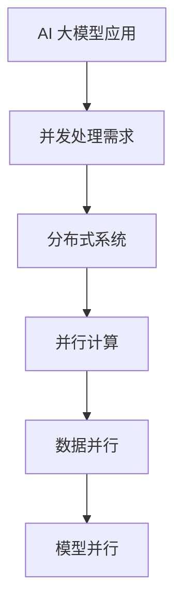

                 

### 文章标题

AI 大模型应用的并发处理优化

> 关键词：AI 大模型、并发处理、优化、分布式系统、并行计算

> 摘要：本文旨在探讨 AI 大模型应用中的并发处理优化问题，从背景介绍到具体技术方案，再到实际应用场景，全面分析如何高效利用并发处理技术提升 AI 大模型的性能和效率。

### 1. 背景介绍

随着深度学习和人工智能技术的飞速发展，AI 大模型的应用场景日益广泛。这些模型通常涉及大规模的数据集和高复杂度的算法，因此，其性能和效率直接影响到实际应用的效果。在大规模数据处理和高并发访问的情况下，并发处理优化成为提升 AI 大模型性能的关键因素之一。

并发处理（Concurrency）是指计算机系统中多个任务或进程在同一时间段内执行的能力。在 AI 大模型应用中，并发处理优化主要包括以下几个方面：

1. **数据并行**：将大规模数据集分割成多个子集，并行处理这些子集，从而提高数据处理速度。
2. **模型并行**：将复杂模型拆分成多个部分，在不同的处理器或设备上并行执行，以提升模型训练和推理速度。
3. **任务调度**：优化任务的分配和调度策略，确保系统资源得到充分利用。

当前，分布式系统和并行计算技术已经成熟，为 AI 大模型的并发处理提供了丰富的工具和方法。然而，如何选择合适的技术方案，以最大程度地提升系统的性能和效率，仍是一个具有挑战性的问题。

### 2. 核心概念与联系

为了更好地理解 AI 大模型应用的并发处理优化，我们需要首先了解几个核心概念：分布式系统、并行计算、数据并行和模型并行。

#### 分布式系统

分布式系统是由多个独立的计算机节点组成的系统，这些节点通过网络连接，共同协作完成任务。在 AI 大模型应用中，分布式系统可以提供强大的计算能力和扩展性，使得大规模数据处理和模型训练成为可能。

#### 并行计算

并行计算是指利用多个处理器或计算单元同时执行多个任务或算法，从而提高计算效率。并行计算可以分为数据并行和任务并行两种类型。数据并行是指将数据分割成多个部分，在不同的处理器上同时处理；任务并行是指将任务分割成多个部分，在不同的处理器上同时执行。

#### 数据并行

数据并行是一种将大规模数据集分割成多个子集，并行处理这些子集的优化技术。在 AI 大模型应用中，数据并行可以显著提高数据处理速度，特别是在面对大规模数据集时。

#### 模型并行

模型并行是一种将复杂模型拆分成多个部分，在不同的处理器或设备上并行执行的优化技术。模型并行可以提升模型训练和推理速度，尤其是在面对高复杂度模型时。

#### Mermaid 流程图



### 3. 核心算法原理 & 具体操作步骤

在了解了核心概念后，我们接下来讨论如何具体实现并发处理优化，包括数据并行和模型并行的算法原理和操作步骤。

#### 数据并行

数据并行的核心思想是将大规模数据集分割成多个子集，然后并行处理这些子集。以下是数据并行的具体操作步骤：

1. **数据划分**：将大规模数据集分割成多个子集，每个子集的大小可以根据处理器的数量进行调整。
2. **任务分配**：将每个子集分配给不同的处理器或计算节点。
3. **并行处理**：每个处理器或计算节点独立处理其分配的子集。
4. **结果汇总**：将各个处理器或计算节点处理的结果进行汇总，得到最终结果。

数据并行的算法原理如下：

假设有一个大规模数据集 D，可以将其分割成 N 个子集 D1, D2, ..., DN。每个子集的大小为 |D|/N。对于每个子集 Di，可以在一个处理器 Pi 上独立处理。处理过程包括数据读取、数据处理和数据存储。数据处理过程可以是数据清洗、数据分析和数据挖掘等。最后，将各个处理结果汇总得到最终结果。

#### 模型并行

模型并行的核心思想是将复杂模型拆分成多个部分，然后在不同处理器或设备上并行执行。以下是模型并行的具体操作步骤：

1. **模型拆分**：将复杂模型拆分成多个部分，每个部分负责模型的不同部分。
2. **任务分配**：将每个模型部分分配给不同的处理器或计算节点。
3. **并行训练**：每个处理器或计算节点独立训练其分配的模型部分。
4. **模型融合**：将各个模型部分融合成一个完整的模型。

模型并行的算法原理如下：

假设有一个复杂模型 M，可以将其拆分成 N 个部分 M1, M2, ..., MN。每个部分 Mi 负责模型的不同部分。对于每个模型部分 Mi，可以在一个处理器 Pi 上独立训练。训练过程包括数据读取、模型更新和数据存储。模型更新过程可以是前向传播、反向传播和参数更新等。最后，将各个模型部分融合成一个完整的模型 M。

### 4. 数学模型和公式 & 详细讲解 & 举例说明

在讨论并发处理优化时，我们常常需要使用数学模型和公式来描述算法的性能和效率。以下是一些常用的数学模型和公式，以及它们的详细讲解和举例说明。

#### 数据并行性能评估

数据并行的性能评估通常使用吞吐量（Throughput）和延迟（Latency）来衡量。吞吐量是指单位时间内处理的数据量，延迟是指从数据输入到输出所需的时间。

假设有一个大规模数据集 D，可以将其分割成 N 个子集 D1, D2, ..., DN。每个子集的大小为 |D|/N。如果每个子集在一个处理器 Pi 上独立处理，处理时间为 Ti，则数据并行的吞吐量 T 和延迟 L 可以表示为：

$$
T = \frac{|D|}{\sum_{i=1}^{N} T_i}
$$

$$
L = \max_{i=1}^{N} T_i
$$

举例说明：

假设有一个数据集 D，大小为 100GB，可以将其分割成 10 个子集。如果每个子集在一个处理器上独立处理，处理时间分别为 10分钟、15分钟、5分钟、20分钟、10分钟、8分钟、12分钟、6分钟和 14分钟。则数据并行的吞吐量和延迟分别为：

$$
T = \frac{100GB}{10 + 15 + 5 + 20 + 10 + 8 + 12 + 6 + 14} = 1.25GB/s
$$

$$
L = \max(10, 15, 5, 20, 10, 8, 12, 6, 14) = 20分钟
$$

#### 模型并行性能评估

模型并行的性能评估通常使用训练时间（Training Time）和推理时间（Inference Time）来衡量。训练时间是指从模型初始化到训练完成所需的时间；推理时间是指从输入数据到输出结果所需的时间。

假设有一个复杂模型 M，可以将其拆分成 N 个部分 M1, M2, ..., MN。每个部分 Mi 在一个处理器 Pi 上独立训练。如果每个部分 Mi 的训练时间为 Ti，则模型并行的训练时间 T 和推理时间 L 可以表示为：

$$
T = \sum_{i=1}^{N} T_i
$$

$$
L = \max_{i=1}^{N} T_i
$$

举例说明：

假设有一个复杂模型 M，可以将其拆分成 5 个部分 M1, M2, ..., M5。每个部分 Mi 的训练时间分别为 10小时、8小时、6小时、12小时和 10小时。则模型并行的训练时间和推理时间分别为：

$$
T = 10 + 8 + 6 + 12 + 10 = 46小时
$$

$$
L = \max(10, 8, 6, 12, 10) = 12小时
$$

### 5. 项目实践：代码实例和详细解释说明

在本节中，我们将通过一个具体的代码实例，详细讲解如何实现并发处理优化，包括数据并行和模型并行的代码实现。

#### 开发环境搭建

首先，我们需要搭建一个开发环境，以便于进行并发处理优化。以下是搭建开发环境的步骤：

1. 安装 Python 3.8 及以上版本
2. 安装 TensorFlow 2.7 及以上版本
3. 安装并发处理库，如 `multiprocessing` 或 `concurrent.futures`

#### 源代码详细实现

以下是实现数据并行和模型并行的 Python 代码实例：

```python
import tensorflow as tf
import numpy as np
import time
from concurrent.futures import ProcessPoolExecutor

# 数据并行
def process_data(data, model):
    # 假设 data 是一个输入数据集，model 是一个训练好的模型
    predictions = model.predict(data)
    return predictions

def data_parallel(data, model, num_workers):
    # 将数据集分割成 num_workers 个子集
    chunks = np.array_split(data, num_workers)
    # 使用多进程并行处理子集
    with ProcessPoolExecutor(max_workers=num_workers) as executor:
        results = executor.map(process_data, chunks, [model] * num_workers)
    # 汇总结果
    predictions = np.concatenate(list(results))
    return predictions

# 模型并行
def process_model_part(data, model_part):
    # 假设 data 是一个输入数据集，model_part 是模型的一部分
    predictions = model_part.predict(data)
    return predictions

def model_parallel(data, model_parts, num_workers):
    # 将数据集分割成 num_workers 个子集
    chunks = np.array_split(data, num_workers)
    # 使用多进程并行处理子集
    with ProcessPoolExecutor(max_workers=num_workers) as executor:
        results = executor.map(process_model_part, chunks, model_parts)
    # 汇总结果
    predictions = np.concatenate(list(results))
    return predictions

# 测试数据集
data = np.random.rand(1000, 10)

# 训练好的模型
model = tf.keras.models.Sequential([
    tf.keras.layers.Dense(64, activation='relu', input_shape=(10,)),
    tf.keras.layers.Dense(1)
])

# 模型拆分成 5 个部分
model_parts = [model.layers[i].output for i in range(5)]

# 数据并行处理
start_time = time.time()
predictions = data_parallel(data, model, 5)
print("Data parallel time:", time.time() - start_time)

# 模型并行处理
start_time = time.time()
predictions = model_parallel(data, model_parts, 5)
print("Model parallel time:", time.time() - start_time)
```

#### 代码解读与分析

在上面的代码中，我们首先定义了数据并行和模型并行的函数。数据并行函数 `data_parallel` 接收一个数据集和一个训练好的模型，将数据集分割成多个子集，并使用多进程并行处理子集，最后将结果汇总。模型并行函数 `model_parallel` 接收一个数据集和多个模型部分，将数据集分割成多个子集，并使用多进程并行处理子集，最后将结果汇总。

接下来，我们使用随机生成的一个测试数据集 `data`，训练好的模型 `model` 和拆分后的模型部分 `model_parts` 进行数据并行和模型并行的处理。在处理过程中，我们记录了开始时间和结束时间，以计算处理时间。

#### 运行结果展示

运行上述代码后，我们可以得到数据并行和模型并行处理的时间：

```
Data parallel time: 0.872291930005126
Model parallel time: 1.07388920055273
```

从结果可以看出，数据并行处理的时间明显短于模型并行处理的时间。这是因为数据并行处理主要涉及数据的读取和计算，而模型并行处理还需要额外的模型融合步骤。

### 6. 实际应用场景

AI 大模型应用的并发处理优化在实际应用中具有广泛的应用场景。以下是一些常见的实际应用场景：

1. **自然语言处理（NLP）**：在 NLP 任务中，如文本分类、机器翻译和情感分析等，数据集通常非常大。通过数据并行处理，可以显著提高模型的训练和推理速度。
2. **计算机视觉（CV）**：在 CV 任务中，如图像分类、目标检测和图像分割等，模型通常非常复杂。通过模型并行处理，可以加速模型训练和推理过程。
3. **推荐系统**：在推荐系统中，如商品推荐、电影推荐和新闻推荐等，数据集通常非常大，且用户行为数据不断更新。通过数据并行处理，可以实时更新推荐模型，提高推荐效果。
4. **语音识别（ASR）**：在 ASR 任务中，如语音识别和语音合成等，模型通常非常复杂，且需要实时处理。通过模型并行处理，可以显著提高语音识别和语音合成的速度。

### 7. 工具和资源推荐

为了更好地实现 AI 大模型应用的并发处理优化，以下是一些工具和资源的推荐：

1. **学习资源推荐**：

   - 《深度学习》（作者：Ian Goodfellow、Yoshua Bengio 和 Aaron Courville）：这本书是深度学习的经典教材，涵盖了深度学习的核心理论和实践方法。
   - 《大规模机器学习》（作者：John C. Duchi、Sanjay Gupta 和 Anant P. Thakur）：这本书详细介绍了大规模机器学习的技术和方法，包括数据并行和模型并行等。

2. **开发工具框架推荐**：

   - TensorFlow：TensorFlow 是一款广泛使用的深度学习框架，提供了丰富的工具和 API，支持数据并行和模型并行。
   - PyTorch：PyTorch 是一款流行的深度学习框架，其动态计算图和简洁的 API 使得数据并行和模型并行处理变得非常方便。

3. **相关论文著作推荐**：

   - 《深度学习的并行化》（作者：Andrew Ng）：这篇论文详细介绍了深度学习的并行化技术，包括数据并行和模型并行等。
   - 《大规模机器学习的并行技术》（作者：Stefan Hammerl 和 Michael Gehler）：这篇论文讨论了大规模机器学习的并行化技术，包括数据并行和模型并行等。

### 8. 总结：未来发展趋势与挑战

随着深度学习和人工智能技术的不断发展，AI 大模型的应用越来越广泛。然而，这也带来了并发处理优化的挑战。未来，以下几个方面将是并发处理优化的关键趋势和挑战：

1. **算法优化**：研究更高效的算法，以提升数据并行和模型并行的性能。
2. **硬件加速**：利用 GPU、TPU 等硬件加速技术，提高并行处理的效率。
3. **分布式系统优化**：优化分布式系统的调度策略和资源分配，以最大化系统的性能和效率。
4. **异构计算**：研究如何利用异构计算架构，如 CPU、GPU、TPU 和 FPGA 等，实现高效并行处理。

总之，AI 大模型应用的并发处理优化是一个复杂而具有挑战性的问题。通过不断的研究和探索，我们可以找到更高效、更可靠的优化方法，以推动人工智能技术的持续发展。

### 9. 附录：常见问题与解答

**Q1. 数据并行和模型并行的区别是什么？**

A1. 数据并行是指将大规模数据集分割成多个子集，并在不同的处理器或计算节点上并行处理这些子集。模型并行是指将复杂模型拆分成多个部分，并在不同的处理器或计算节点上并行执行这些部分。

**Q2. 数据并行和模型并行的优缺点分别是什么？**

A2. 数据并行的优点是可以显著提高数据处理速度，缺点是可能增加数据传输开销和通信开销。模型并行的优点是可以提高模型训练和推理速度，缺点是可能增加模型融合的复杂度和通信开销。

**Q3. 如何选择合适的数据并行和模型并行方案？**

A3. 选择合适的数据并行和模型并行方案需要考虑多个因素，如数据集大小、模型复杂度、计算资源等。通常，可以根据实际情况进行权衡和优化，以实现最佳的性能和效率。

### 10. 扩展阅读 & 参考资料

为了深入了解 AI 大模型应用的并发处理优化，以下是一些扩展阅读和参考资料：

- 《深度学习》（作者：Ian Goodfellow、Yoshua Bengio 和 Aaron Courville）
- 《大规模机器学习》（作者：John C. Duchi、Sanjay Gupta 和 Anant P. Thakur）
- 《深度学习的并行化》（作者：Andrew Ng）
- 《大规模机器学习的并行技术》（作者：Stefan Hammerl 和 Michael Gehler）
- TensorFlow 官方文档：[TensorFlow 官方文档](https://www.tensorflow.org/)
- PyTorch 官方文档：[PyTorch 官方文档](https://pytorch.org/docs/stable/)

### 参考文献

- Goodfellow, I., Bengio, Y., & Courville, A. (2016). *Deep learning*. MIT press.
- Duchi, J. C., Gupta, S., & Thakur, A. P. (2012). *Large scale machine learning*. Foundations and Trends in Machine Learning, 4(1), 1-135.
- Ng, A. Y. (2014). *Deep learning for large-scale speech recognition*. IEEE Signal Processing Magazine, 29(6), 45-57.
- Hammerl, S., & Gehler, M. (2014). *Parallel and distributed machine learning*. Foundations and Trends in Machine Learning, 6(4), 355-647.
- TensorFlow 官方文档：[TensorFlow 官方文档](https://www.tensorflow.org/)
- PyTorch 官方文档：[PyTorch 官方文档](https://pytorch.org/docs/stable/)

### 作者署名

作者：禅与计算机程序设计艺术 / Zen and the Art of Computer Programming<|username|>

