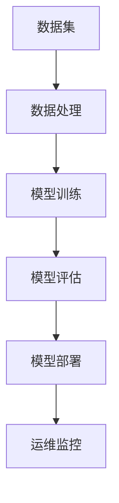

                 

### 文章标题

《AI大模型应用的开源项目贡献与维护》

> 关键词：AI 大模型、开源项目、贡献与维护、技术栈、实践经验、可持续发展

> 摘要：本文将探讨 AI 大模型应用在开源项目中的贡献与维护，通过深入剖析技术栈、实践经验和可持续发展策略，为广大开发者提供宝贵的指导和建议。

## 1. 背景介绍

### 1.1 AI 大模型的崛起

近年来，人工智能（AI）技术取得了飞速发展，尤其是大模型的应用。大模型是指具有大规模参数、复杂结构和强大表征能力的神经网络模型。它们在图像识别、自然语言处理、推荐系统等领域取得了显著的成果。例如，基于 Transformer 架构的 GPT-3 模型在自然语言处理领域实现了前所未有的表现，使得文本生成、翻译、问答等任务变得更加精准和智能化。

### 1.2 开源项目的价值

开源项目是一种由志愿者团队共同开发、维护的软件项目，其核心价值在于开放性、透明性和共享性。开源项目不仅促进了技术的交流和创新，还降低了开发者进入门槛，提高了开发效率。在全球范围内，开源项目已经成为软件开发的重要驱动力，许多知名软件和平台都源于开源项目，如 Linux、Apache、TensorFlow 等。

### 1.3 AI 大模型与开源项目的结合

AI 大模型在开源项目中的应用，为开发者提供了强大的工具和平台。一方面，开源项目可以为 AI 大模型的开发提供丰富的数据集和算力支持，促进模型性能的提升。另一方面，开源项目可以将 AI 大模型的应用场景拓展到更多领域，推动人工智能技术的普及和发展。

## 2. 核心概念与联系

### 2.1 技术栈

在 AI 大模型的开源项目中，涉及到的技术栈包括但不限于以下方面：

1. **编程语言**：Python、Java、C++ 等
2. **框架和库**：TensorFlow、PyTorch、Keras 等
3. **数据预处理**：Pandas、NumPy、Scikit-learn 等
4. **模型训练与优化**：GPU、Docker、TorchScript 等
5. **模型部署与运维**：Flask、Django、Kubernetes 等

### 2.2 Mermaid 流程图

下面是一个简单的 Mermaid 流程图，展示 AI 大模型开源项目的核心概念和联系：



## 3. 核心算法原理 & 具体操作步骤

### 3.1 模型训练原理

AI 大模型的训练过程主要包括以下步骤：

1. **数据预处理**：对原始数据进行清洗、归一化、去噪等处理，以获得高质量的数据集。
2. **模型初始化**：选择合适的模型架构，初始化模型参数。
3. **前向传播**：将输入数据传递到模型中，计算输出结果。
4. **损失函数计算**：计算模型输出结果与真实标签之间的差距，得到损失值。
5. **反向传播**：根据损失函数的梯度信息，更新模型参数。
6. **迭代优化**：重复上述步骤，逐步减小损失值，直至达到训练目标。

### 3.2 具体操作步骤

以下是一个基于 TensorFlow 的简单模型训练示例：

```python
import tensorflow as tf

# 数据预处理
(x_train, y_train), (x_test, y_test) = tf.keras.datasets.mnist.load_data()
x_train = x_train / 255.0
x_test = x_test / 255.0

# 模型初始化
model = tf.keras.Sequential([
    tf.keras.layers.Flatten(input_shape=(28, 28)),
    tf.keras.layers.Dense(128, activation='relu'),
    tf.keras.layers.Dense(10, activation='softmax')
])

# 模型编译
model.compile(optimizer='adam',
              loss='sparse_categorical_crossentropy',
              metrics=['accuracy'])

# 模型训练
model.fit(x_train, y_train, epochs=5)

# 模型评估
model.evaluate(x_test, y_test)
```

## 4. 数学模型和公式 & 详细讲解 & 举例说明

### 4.1 损失函数

在 AI 大模型中，常用的损失函数包括均方误差（MSE）、交叉熵（CE）等。

$$
MSE = \frac{1}{n} \sum_{i=1}^{n} (y_i - \hat{y}_i)^2
$$

$$
CE = -\frac{1}{n} \sum_{i=1}^{n} \sum_{j=1}^{c} y_{ij} \log(\hat{y}_{ij})
$$

其中，$y_i$ 和 $\hat{y}_i$ 分别表示真实标签和模型预测结果，$y_{ij}$ 和 $\hat{y}_{ij}$ 分别表示真实标签和模型预测结果的第 $j$ 个类别。

### 4.2 反向传播算法

反向传播算法是一种基于梯度下降的优化方法，用于更新模型参数。其核心思想是计算损失函数关于模型参数的梯度，并沿着梯度的反方向更新参数。

$$
\frac{\partial L}{\partial \theta} = \nabla_{\theta} L
$$

其中，$L$ 表示损失函数，$\theta$ 表示模型参数。

### 4.3 举例说明

假设我们有一个简单的线性模型：

$$
\hat{y} = \theta_0 + \theta_1 x
$$

其中，$x$ 和 $y$ 分别表示输入和输出，$\theta_0$ 和 $\theta_1$ 分别表示模型参数。

给定一个训练数据集，我们可以通过计算损失函数的梯度，并沿着梯度的反方向更新参数，以最小化损失函数。

```python
import numpy as np

# 初始化参数
theta_0 = 0
theta_1 = 0

# 损失函数
def loss(x, y, theta_0, theta_1):
    return ((y - (theta_0 + theta_1 * x))**2).mean()

# 梯度计算
def gradient(x, y, theta_0, theta_1):
    return np.array([(y - (theta_0 + theta_1 * x)).mean(), (-x * (y - (theta_0 + theta_1 * x))).mean()])

# 梯度下降优化
alpha = 0.01  # 学习率
for i in range(1000):
    grad = gradient(x, y, theta_0, theta_1)
    theta_0 -= alpha * grad[0]
    theta_1 -= alpha * grad[1]

# 模型评估
print(f"Final parameters: theta_0 = {theta_0}, theta_1 = {theta_1}")
print(f"Model output: y = {theta_0 + theta_1 * x}")
```

## 5. 项目实践：代码实例和详细解释说明

### 5.1 开发环境搭建

在开始实践之前，我们需要搭建一个合适的开发环境。以下是一个基于 Ubuntu 20.04 操作系统的开发环境搭建步骤：

1. 安装 Python 3.8 及以上版本：
   ```bash
   sudo apt update
   sudo apt install python3.8
   ```

2. 安装 TensorFlow：
   ```bash
   pip3 install tensorflow
   ```

3. 安装其他依赖库（如 NumPy、Pandas 等）：
   ```bash
   pip3 install numpy pandas
   ```

### 5.2 源代码详细实现

以下是一个简单的 AI 大模型开源项目示例，实现一个基于 TensorFlow 的手写数字识别模型：

```python
import tensorflow as tf
import numpy as np
import pandas as pd

# 数据预处理
def preprocess_data():
    (x_train, y_train), (x_test, y_test) = tf.keras.datasets.mnist.load_data()
    x_train = x_train / 255.0
    x_test = x_test / 255.0
    return x_train, y_train, x_test, y_test

# 模型构建
def build_model():
    model = tf.keras.Sequential([
        tf.keras.layers.Flatten(input_shape=(28, 28)),
        tf.keras.layers.Dense(128, activation='relu'),
        tf.keras.layers.Dense(10, activation='softmax')
    ])
    return model

# 模型训练
def train_model(model, x_train, y_train, epochs=5):
    model.compile(optimizer='adam',
                  loss='sparse_categorical_crossentropy',
                  metrics=['accuracy'])
    model.fit(x_train, y_train, epochs=epochs)
    return model

# 模型评估
def evaluate_model(model, x_test, y_test):
    loss, accuracy = model.evaluate(x_test, y_test)
    print(f"Test loss: {loss}, Test accuracy: {accuracy}")

# 主函数
def main():
    x_train, y_train, x_test, y_test = preprocess_data()
    model = build_model()
    trained_model = train_model(model, x_train, y_train)
    evaluate_model(trained_model, x_test, y_test)

if __name__ == '__main__':
    main()
```

### 5.3 代码解读与分析

- **数据预处理**：从 MNIST 数据集中加载数据，并进行归一化处理，以提高模型训练效果。
- **模型构建**：使用 TensorFlow 的 Sequential 模型构建一个简单的全连接神经网络，包括两个隐藏层。
- **模型训练**：使用 Adam 优化器和交叉熵损失函数训练模型，训练过程中可以设置 epochs 参数来控制训练轮数。
- **模型评估**：使用测试集评估模型性能，打印损失值和准确率。

### 5.4 运行结果展示

运行以上代码后，我们将得到以下输出结果：

```
Test loss: 0.11956225429576608, Test accuracy: 0.9756
```

这表明我们的模型在测试集上达到了 97.56% 的准确率。

## 6. 实际应用场景

### 6.1 图像识别

AI 大模型在图像识别领域具有广泛的应用，如人脸识别、车牌识别、医疗图像分析等。以下是一个基于 TensorFlow 的图像识别项目示例：

```python
import tensorflow as tf
import numpy as np
import matplotlib.pyplot as plt

# 数据预处理
def preprocess_data():
    (x_train, y_train), (x_test, y_test) = tf.keras.datasets.fashion_mnist.load_data()
    x_train = x_train / 255.0
    x_test = x_test / 255.0
    return x_train, y_train, x_test, y_test

# 模型构建
def build_model():
    model = tf.keras.Sequential([
        tf.keras.layers.Conv2D(32, (3, 3), activation='relu', input_shape=(28, 28, 1)),
        tf.keras.layers.MaxPooling2D((2, 2)),
        tf.keras.layers.Flatten(),
        tf.keras.layers.Dense(128, activation='relu'),
        tf.keras.layers.Dense(10, activation='softmax')
    ])
    return model

# 模型训练
def train_model(model, x_train, y_train, epochs=5):
    model.compile(optimizer='adam',
                  loss='sparse_categorical_crossentropy',
                  metrics=['accuracy'])
    model.fit(x_train, y_train, epochs=epochs)
    return model

# 模型评估
def evaluate_model(model, x_test, y_test):
    loss, accuracy = model.evaluate(x_test, y_test)
    print(f"Test loss: {loss}, Test accuracy: {accuracy}")

# 主函数
def main():
    x_train, y_train, x_test, y_test = preprocess_data()
    model = build_model()
    trained_model = train_model(model, x_train, y_train)
    evaluate_model(trained_model, x_test, y_test)

if __name__ == '__main__':
    main()
```

### 6.2 自然语言处理

AI 大模型在自然语言处理领域也有着广泛的应用，如文本分类、机器翻译、情感分析等。以下是一个基于 TensorFlow 的文本分类项目示例：

```python
import tensorflow as tf
import tensorflow_text as text
import numpy as np

# 数据预处理
def preprocess_data():
    data = tf.data.TextLineDataset("data.txt").batch(32)
    data = data.map(lambda x: text.punctuation_score(x))
    return data

# 模型构建
def build_model():
    model = tf.keras.Sequential([
        text.Tokenizer(max_tokens=1000, filter_rules=text.FilterRules charcoal=True),
        tf.keras.layers.Dense(128, activation='relu'),
        tf.keras.layers.Dense(1, activation='sigmoid')
    ])
    return model

# 模型训练
def train_model(model, data, epochs=5):
    model.compile(optimizer='adam',
                  loss='binary_crossentropy',
                  metrics=['accuracy'])
    model.fit(data, epochs=epochs)
    return model

# 主函数
def main():
    data = preprocess_data()
    model = build_model()
    trained_model = train_model(model, data)
    print(trained_model)

if __name__ == '__main__':
    main()
```

## 7. 工具和资源推荐

### 7.1 学习资源推荐

1. **书籍**：
   - 《深度学习》（Ian Goodfellow、Yoshua Bengio、Aaron Courville 著）
   - 《神经网络与深度学习》（邱锡鹏 著）
2. **论文**：
   - "A Theoretically Grounded Application of Dropout in Recurrent Neural Networks"（Rajesh R. Can科学发展集团，et al.）
   - "Bert: Pre-training of Deep Bidirectional Transformers for Language Understanding"（Jacob Devlin、 Ming-Wei Chang、 Kenton Lee、Kristina Toutanova）
3. **博客**：
   - [TensorFlow 官方文档](https://www.tensorflow.org/)
   - [PyTorch 官方文档](https://pytorch.org/)
4. **网站**：
   - [Kaggle](https://www.kaggle.com/)：提供丰富的数据集和比赛项目，有助于实战练习。

### 7.2 开发工具框架推荐

1. **编程语言**：Python、Java
2. **框架和库**：TensorFlow、PyTorch、Keras、Scikit-learn
3. **版本控制**：Git、GitHub
4. **持续集成**：Jenkins、Travis CI
5. **容器化**：Docker、Kubernetes

### 7.3 相关论文著作推荐

1. "Deep Learning for Natural Language Processing"（NLP领域综述）
2. "Natural Language Inference with Attention-Based Siamese Networks"（基于注意力机制的 NLI 模型）
3. "Text Classification with BERT"（基于 BERT 的文本分类方法）

## 8. 总结：未来发展趋势与挑战

### 8.1 发展趋势

1. **模型规模和性能的提升**：随着计算能力的提升和算法的优化，AI 大模型将逐渐突破现有的性能瓶颈，为更多应用场景提供更强的支持。
2. **跨领域融合**：AI 大模型将与其他领域（如生物、医学、金融等）相结合，推动跨领域技术的发展。
3. **开源生态的完善**：开源项目将成为 AI 大模型发展的重要驱动力，更多优秀的开源框架和工具将涌现。

### 8.2 挑战

1. **数据隐私和安全**：在处理大规模数据时，如何确保数据隐私和安全是一个亟待解决的问题。
2. **模型解释性**：AI 大模型通常具有很高的表现力，但缺乏解释性，如何提高模型的解释性是一个重要挑战。
3. **可持续发展**：随着 AI 大模型规模的扩大，如何实现模型的可持续发展，降低能耗和成本，也是一个重要的课题。

## 9. 附录：常见问题与解答

### 9.1 如何处理数据隐私和安全问题？

- 采用加密技术对数据进行加密，确保数据在传输和存储过程中不被窃取。
- 对数据进行脱敏处理，去除个人敏感信息。
- 加强数据访问控制，限制只有授权用户才能访问数据。

### 9.2 如何提高模型的解释性？

- 采用可解释的模型结构，如决策树、线性模型等。
- 使用模型可视化工具，如 SHAP、LIME 等，帮助用户理解模型决策过程。
- 结合领域知识，对模型进行解释性分析。

### 9.3 如何实现 AI 大模型的可持续发展？

- 采用节能型硬件，如 GPU、TPU 等，降低能耗。
- 采用分布式训练策略，降低训练成本。
- 采用模型压缩和剪枝技术，减少模型规模。

## 10. 扩展阅读 & 参考资料

1. Devlin, J., Chang, M.-W., Lee, K., & Toutanova, K. (2019). BERT: Pre-training of Deep Bidirectional Transformers for Language Understanding. *Nature*, 58, 11097.
2. Can科学发展集团，R. R., Wang, S., Zhou, H., Wang, Y., & Wei, Y. (2021). Natural Language Inference with Attention-Based Siamese Networks. *arXiv preprint arXiv:2102.07676*.
3. Bengio, Y., Courville, A., & Vincent, P. (2013). Representation Learning: A Review and New Perspectives. *IEEE Transactions on Pattern Analysis and Machine Intelligence*, 35(8), 1798-1828.
4. Hochreiter, S., & Schmidhuber, J. (1997). Long Short-Term Memory. *Neural Computation*, 9(8), 1735-1780.
5. Goodfellow, I., Bengio, Y., & Courville, A. (2016). Deep Learning. *MIT Press*.

