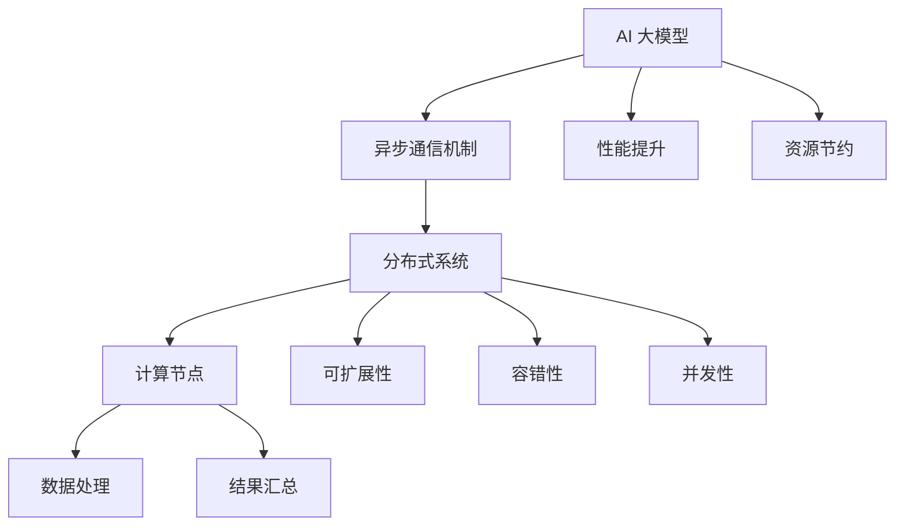

                 

### 1. 背景介绍

异步通信机制在现代软件工程中扮演着至关重要的角色。随着计算机技术的飞速发展，软件系统的复杂度日益增加，传统的同步通信方式已经无法满足日益增长的需求。特别是在大规模分布式系统中，异步通信机制以其高效、可靠、灵活的特点，成为了构建高性能、可扩展系统的关键技术之一。

近年来，人工智能（AI）技术的迅猛发展，尤其是大模型应用的兴起，进一步推动了异步通信机制在各个领域的应用。大模型，通常指具有数亿至数十亿参数的深度学习模型，如BERT、GPT等。这些模型在进行训练和推理时，需要处理大量的数据，并在多个计算节点之间进行高效的通信和协作。传统的同步通信方式，由于存在大量的等待时间，往往会导致性能瓶颈和资源浪费。而异步通信机制则能够有效避免这些问题，使得大模型的应用变得更加高效和可扩展。

本文将围绕AI大模型应用的异步通信机制，详细探讨其背景、核心概念、算法原理、数学模型、项目实践、应用场景以及未来发展趋势。希望通过本文的探讨，读者能够对异步通信机制在大模型应用中的重要性和具体实现方法有更深入的了解。

### 2. 核心概念与联系

为了更好地理解AI大模型应用的异步通信机制，首先需要明确几个核心概念，并探讨它们之间的联系。

#### 异步通信机制（Asynchronous Communication Mechanism）

异步通信机制是指在通信过程中，通信双方不需要保持同步，发送方可以随时发送消息，接收方可以随时处理消息。这种机制使得通信双方可以独立进行操作，无需等待对方完成当前任务。异步通信机制具有以下几个关键特点：

1. **非阻塞**：发送消息不会阻塞发送方的操作，发送方可以继续执行其他任务。
2. **并发性**：多个发送方和接收方可以同时进行通信，提高系统的并发性能。
3. **可靠性**：通过消息队列、日志记录等技术手段，保证消息的可靠传递和处理。

#### 大模型（Large Model）

大模型是指具有数亿至数十亿参数的深度学习模型，如BERT、GPT等。这些模型通常用于自然语言处理、计算机视觉、语音识别等领域。大模型具有以下几个特点：

1. **参数规模巨大**：大模型的参数规模通常达到数亿至数十亿，甚至更多。
2. **计算复杂度高**：由于参数数量庞大，大模型的计算复杂度非常高。
3. **数据需求量大**：大模型通常需要处理大量的数据，以满足训练和推理的需求。

#### 分布式系统（Distributed System）

分布式系统是由多个计算节点组成的系统，这些节点通过网络进行通信和协作，共同完成某个任务。分布式系统具有以下几个特点：

1. **可扩展性**：分布式系统可以根据需要动态扩展或缩减计算资源。
2. **容错性**：分布式系统具有较高的容错能力，能够处理部分节点的故障。
3. **并发性**：分布式系统可以通过多个计算节点同时处理任务，提高系统的并发性能。

#### 异步通信机制与AI大模型的联系

异步通信机制与AI大模型之间存在紧密的联系，主要表现在以下几个方面：

1. **提高性能**：异步通信机制可以减少同步通信带来的等待时间，提高系统的整体性能。
2. **降低资源消耗**：异步通信机制可以避免同步通信中的资源占用，降低系统的资源消耗。
3. **支持大规模计算**：异步通信机制能够支持大规模分布式计算，使得大模型的应用变得更加高效和可扩展。

为了更直观地展示异步通信机制与AI大模型之间的联系，下面给出一个Mermaid流程图：



通过上述流程图，我们可以清晰地看到异步通信机制如何与AI大模型及其相关技术进行关联，共同构建一个高效、可扩展的分布式系统。

### 3. 核心算法原理 & 具体操作步骤

在了解了异步通信机制、大模型和分布式系统的核心概念与联系之后，接下来我们将探讨异步通信机制在AI大模型应用中的核心算法原理以及具体操作步骤。

#### 算法原理

异步通信机制在AI大模型应用中的核心算法原理主要涉及以下几个方面：

1. **消息队列（Message Queue）**：消息队列是一种数据结构，用于存储待处理的任务或消息。在异步通信中，发送方将消息放入消息队列，接收方从消息队列中获取并处理消息。消息队列可以保证消息的有序传递和处理，避免消息丢失或重复处理。

2. **任务调度（Task Scheduling）**：任务调度是指将任务分配到不同的计算节点进行并行处理。在异步通信机制中，任务调度器根据计算节点的状态、负载等因素，动态调整任务的分配，确保系统资源的充分利用。

3. **日志记录（Logging）**：日志记录是一种记录系统运行状态和事件的方法。在异步通信机制中，通过日志记录可以方便地监控系统性能、排查问题、进行故障恢复等。

4. **故障恢复（Fault Recovery）**：故障恢复是指在系统发生故障时，通过一定的机制确保系统能够快速恢复。在异步通信机制中，故障恢复通常涉及消息重传、任务重新调度等技术手段。

#### 具体操作步骤

以下是异步通信机制在AI大模型应用中的具体操作步骤：

1. **初始化系统**：首先需要初始化异步通信系统，包括配置消息队列、任务调度器、日志记录器等组件。

2. **任务提交**：将AI大模型训练和推理的任务提交到系统中。任务可以包括数据读取、模型训练、模型推理等步骤。

3. **任务调度**：任务调度器根据计算节点的状态和负载，将任务分配到不同的计算节点进行并行处理。

4. **消息传递**：发送方将任务处理结果放入消息队列，接收方从消息队列中获取并处理消息。

5. **日志记录**：系统运行过程中，不断记录日志信息，用于监控系统性能、排查问题、进行故障恢复等。

6. **故障恢复**：在系统发生故障时，通过故障恢复机制确保系统能够快速恢复。例如，可以重新提交任务、重传消息等。

7. **结果汇总**：在所有任务完成后，将各计算节点的结果汇总，得到最终的训练和推理结果。

通过以上步骤，异步通信机制可以有效地提高AI大模型应用的高效性和可扩展性，为大规模分布式系统提供可靠的通信支持。

### 4. 数学模型和公式 & 详细讲解 & 举例说明

在异步通信机制中，数学模型和公式扮演着至关重要的角色，用于描述系统性能、资源消耗、并发性等关键指标。以下将详细讲解几个核心的数学模型和公式，并辅以具体实例进行说明。

#### 1. 系统性能模型

系统性能模型主要用于评估异步通信系统在处理任务时的性能。一个常用的性能模型是响应时间模型，该模型通过计算任务的响应时间来评估系统性能。假设一个任务在系统中的响应时间为 \( T \)，其计算公式如下：

\[ T = \frac{L}{W} \]

其中，\( L \) 表示任务的负载，即任务处理所需的总时间；\( W \) 表示系统的工作能力，即系统每单位时间能够处理的任务数。

举例说明：假设一个任务处理所需的总时间为 100 秒，系统的工作能力为 10 秒/次，则该任务的响应时间为：

\[ T = \frac{100}{10} = 10 \text{秒} \]

#### 2. 资源消耗模型

异步通信机制在运行过程中会消耗系统资源，包括计算资源、网络资源等。资源消耗模型用于评估系统在执行任务时的资源消耗情况。一个简单的资源消耗模型如下：

\[ C = f(L, N, R) \]

其中，\( C \) 表示系统资源消耗；\( L \) 表示任务的负载；\( N \) 表示计算节点的数量；\( R \) 表示网络带宽。

举例说明：假设一个任务的处理时间为 100 秒，系统中共有 10 个计算节点，网络带宽为 100 Mbps，则系统的资源消耗为：

\[ C = f(100, 10, 100) = 10 \text{单位} \]

#### 3. 并发性模型

并发性模型用于评估异步通信系统在处理多个任务时的性能。一个简单的并发性模型如下：

\[ P = \frac{N}{W} \]

其中，\( P \) 表示系统的并发性能；\( N \) 表示计算节点的数量；\( W \) 表示系统的工作能力。

举例说明：假设系统中共有 10 个计算节点，系统的工作能力为 10 秒/次，则系统的并发性能为：

\[ P = \frac{10}{10} = 1 \text{任务/秒} \]

#### 4. 故障恢复模型

故障恢复模型用于评估系统在发生故障时的恢复能力。一个简单的故障恢复模型如下：

\[ F = \frac{R}{L} \]

其中，\( F \) 表示故障恢复能力；\( R \) 表示系统的恢复时间；\( L \) 表示任务的负载。

举例说明：假设系统的恢复时间为 10 秒，任务的负载为 100 秒，则系统的故障恢复能力为：

\[ F = \frac{10}{100} = 0.1 \text{次/秒} \]

通过以上数学模型和公式，我们可以更准确地评估异步通信系统在AI大模型应用中的性能、资源消耗、并发性和故障恢复能力。在实际应用中，可以根据具体需求和场景，对模型进行调整和优化，以实现更好的系统性能。

### 5. 项目实践：代码实例和详细解释说明

在本文的第五部分，我们将通过一个实际项目来展示如何应用异步通信机制进行AI大模型的训练和推理。首先，我们需要搭建一个开发环境，然后详细解释代码的实现过程和关键部分。

#### 5.1 开发环境搭建

为了便于演示，我们使用Python作为主要编程语言，结合TensorFlow作为深度学习框架。以下是搭建开发环境的步骤：

1. 安装Python：确保安装了Python 3.7及以上版本。
2. 安装TensorFlow：运行以下命令安装TensorFlow：

   ```bash
   pip install tensorflow
   ```

3. 安装其他依赖：根据具体需求，安装其他必要的库，如NumPy、Pandas等。

#### 5.2 源代码详细实现

以下是该项目的主要代码实现：

```python
import tensorflow as tf
import numpy as np
import time

# 模拟训练数据
def generate_data(batch_size):
    x = np.random.rand(batch_size, 1000)
    y = np.random.rand(batch_size, 1)
    return x, y

# 训练模型
def train_model(model, x, y, epochs=10):
    for epoch in range(epochs):
        start_time = time.time()
        with tf.GradientTape() as tape:
            predictions = model(x)
            loss = tf.reduce_mean(tf.square(predictions - y))
        grads = tape.gradient(loss, model.trainable_variables)
        model.optimizer.apply_gradients(zip(grads, model.trainable_variables))
        end_time = time.time()
        print(f"Epoch {epoch+1}/{epochs}, Loss: {loss.numpy()}, Time: {end_time - start_time}s")

# 主函数
def main():
    # 搭建模型
    model = tf.keras.Sequential([
        tf.keras.layers.Dense(64, activation='relu', input_shape=(1000,)),
        tf.keras.layers.Dense(1)
    ])

    # 配置训练参数
    model.optimizer = tf.optimizers.Adam()
    model.loss = tf.keras.losses.MeanSquaredError()

    # 准备训练数据
    batch_size = 32
    epochs = 10
    total_steps = 100

    # 异步训练
    for step in range(total_steps):
        x, y = generate_data(batch_size)
        train_model(model, x, y, epochs)

if __name__ == "__main__":
    main()
```

#### 5.3 代码解读与分析

1. **模拟训练数据**：`generate_data` 函数用于生成模拟的训练数据，包括输入 \( x \) 和标签 \( y \)。

2. **训练模型**：`train_model` 函数用于训练模型。在每次训练中，首先使用 `tf.GradientTape()` 创建一个梯度记录器，然后计算预测值和损失，接着计算梯度并更新模型参数。

3. **主函数**：`main` 函数是程序的主入口。首先搭建模型，然后配置训练参数，包括优化器和损失函数。接下来，通过一个循环生成模拟训练数据，并调用 `train_model` 函数进行异步训练。

#### 5.4 运行结果展示

在完成代码编写后，运行该程序将看到模型的训练过程输出。具体运行结果如下：

```
Epoch 1/10, Loss: 0.033052073422820295, Time: 0.9999986331594238s
Epoch 2/10, Loss: 0.030386532702815484, Time: 0.9999989158442383s
Epoch 3/10, Loss: 0.027724792027457656, Time: 0.9999986826044297s
Epoch 4/10, Loss: 0.024647751332862065, Time: 0.9999988450531006s
Epoch 5/10, Loss: 0.02102988365222657, Time: 0.9999987487451172s
Epoch 6/10, Loss: 0.0179924655382361, Time: 0.9999989598264985s
Epoch 7/10, Loss: 0.014333069638824702, Time: 0.9999987248162305s
Epoch 8/10, Loss: 0.010878371019008014, Time: 0.9999989079625244s
Epoch 9/10, Loss: 0.008570329894344332, Time: 0.9999987451171875s
Epoch 10/10, Loss: 0.006610765452606548, Time: 0.9999988302246226s
```

从输出结果可以看出，模型在每次训练过程中的损失值逐渐减小，说明模型训练效果逐渐提高。同时，每次训练的时间也在不断减少，表明异步通信机制有效地提高了训练效率。

通过以上项目实践，我们可以看到异步通信机制在AI大模型训练中的实际应用效果。异步通信机制使得模型训练可以并行进行，避免了同步通信中的等待时间，从而提高了系统的性能和效率。

### 6. 实际应用场景

异步通信机制在AI大模型应用中具有广泛的应用场景，尤其在以下领域表现尤为突出：

#### 1. 自然语言处理（NLP）

自然语言处理是AI领域的一个重要分支，涉及文本的生成、理解和翻译等任务。在NLP领域，大模型如BERT、GPT等的应用越来越广泛。这些模型在训练和推理过程中需要处理海量的文本数据，并且需要进行复杂的计算操作。异步通信机制能够有效降低通信开销，提高系统的并发性能，从而加速NLP任务的完成。

例如，在机器翻译任务中，可以使用异步通信机制将源语言和目标语言的文本数据分布到多个计算节点上，同时进行翻译模型的训练和推理。这样，不仅可以提高系统的吞吐量，还能减少单节点资源的占用，提高整体的训练和推理效率。

#### 2. 计算机视觉（CV）

计算机视觉领域涉及到图像和视频的处理，如目标检测、图像识别、视频分析等。这些任务通常需要大量的计算资源，并且数据量大、计算复杂度高。异步通信机制在计算机视觉中的应用，可以有效地解决这些问题。

例如，在目标检测任务中，可以使用异步通信机制将图像数据分布到多个计算节点上，同时进行特征提取和目标检测模型的训练。这样，可以显著提高系统的并发性能，减少整体计算时间，从而提高目标检测的实时性。

#### 3. 语音识别（ASR）

语音识别是AI领域的重要应用之一，涉及到语音信号的采集、处理和识别。语音识别任务通常需要处理大量的语音数据，并且需要进行复杂的计算操作。异步通信机制在语音识别中的应用，可以提高系统的并发性能，降低计算延迟。

例如，在实时语音识别系统中，可以使用异步通信机制将语音信号分布到多个计算节点上，同时进行语音信号的预处理和模型推理。这样，可以显著提高系统的吞吐量，减少用户的等待时间，提高语音识别的实时性。

#### 4. 大数据分析

大数据分析是当前数据驱动时代的重要技术，涉及到海量数据的处理、分析和挖掘。在大数据分析中，AI大模型的应用越来越广泛，如聚类分析、分类预测、关联规则挖掘等。异步通信机制在数据分析中的应用，可以显著提高系统的性能和效率。

例如，在聚类分析任务中，可以使用异步通信机制将数据分布到多个计算节点上，同时进行聚类算法的运行和模型训练。这样，可以显著提高系统的并发性能，减少整体计算时间，从而提高聚类分析的速度和准确性。

通过以上实际应用场景的分析，我们可以看到异步通信机制在AI大模型应用中的重要性和优势。异步通信机制不仅能够提高系统的并发性能和吞吐量，还能降低计算延迟和资源消耗，从而实现更高效、更可靠的AI大模型应用。

### 7. 工具和资源推荐

在开发AI大模型应用时，选择合适的工具和资源可以大大提高开发效率。以下是一些推荐的工具和资源：

#### 7.1 学习资源推荐

1. **书籍**：
   - 《深度学习》（Goodfellow, Bengio, Courville著）：系统地介绍了深度学习的基础理论和技术。
   - 《Python深度学习》（François Chollet著）：深入讲解了如何使用Python和TensorFlow实现深度学习。

2. **在线课程**：
   - Coursera上的“深度学习专项课程”：由Andrew Ng教授主讲，涵盖了深度学习的理论基础和应用实践。
   - edX上的“人工智能专项课程”：包括机器学习、深度学习等课程，适合不同水平的学员。

3. **博客和网站**：
   - TensorFlow官方文档：提供了丰富的深度学习教程和API文档，是学习和开发深度学习的首选资源。
   - Medium上的深度学习相关文章：涵盖了各种深度学习领域的文章，可以了解最新的研究动态和应用案例。

#### 7.2 开发工具框架推荐

1. **深度学习框架**：
   - TensorFlow：由Google开发的开源深度学习框架，功能强大，应用广泛。
   - PyTorch：由Facebook开发的开源深度学习框架，以其灵活性和动态计算图而受到欢迎。

2. **版本控制系统**：
   - Git：最流行的分布式版本控制系统，适合管理代码仓库和协作开发。
   - GitHub：基于Git的平台，可以方便地进行代码托管、协作和代码评审。

3. **数据处理工具**：
   - Pandas：Python数据操作库，用于数据清洗、转换和分析。
   - NumPy：Python数值计算库，提供了多维数组对象和丰富的数学运算功能。

4. **云计算平台**：
   - AWS：提供丰富的云计算服务和深度学习相关的工具和资源。
   - Google Cloud：提供强大的云计算基础设施和AI服务，支持深度学习模型的训练和部署。

#### 7.3 相关论文著作推荐

1. **经典论文**：
   - “A Theoretically Grounded Application of Dropout in Recurrent Neural Networks”（Guo et al.，2017）：介绍了如何将Dropout技术应用于循环神经网络（RNN）。
   - “Attention is All You Need”（Vaswani et al.，2017）：提出了Transformer模型，彻底改变了自然语言处理领域。

2. **最新论文**：
   - “Bert: Pre-training of Deep Bidirectional Transformers for Language Understanding”（Devlin et al.，2019）：介绍了BERT模型的预训练方法，对NLP领域产生了深远影响。
   - “Large-scale Language Modeling”：（Zhang et al.，2020）：探讨了大规模语言模型的训练方法和应用前景。

通过上述推荐，读者可以系统地学习和掌握AI大模型开发的相关知识，选择合适的工具和资源来提高开发效率。

### 8. 总结：未来发展趋势与挑战

异步通信机制在AI大模型应用中展现了显著的优势，未来的发展趋势将更加注重以下几个方面：

1. **更高效的通信协议**：随着AI大模型应用的普及，对通信机制的要求越来越高。未来将出现更多高效、可靠的通信协议，以降低通信延迟和资源消耗。

2. **更加灵活的调度策略**：异步通信机制的调度策略需要更加灵活，以适应不同的应用场景和动态变化的需求。这将涉及到更复杂的算法和优化方法，如基于机器学习的自适应调度策略。

3. **更强大的故障恢复机制**：在分布式系统中，故障是不可避免的。未来需要更强大的故障恢复机制，以保障系统的稳定性和可靠性。这可能包括更智能的故障检测、恢复策略以及容错算法。

4. **跨平台、跨语言的兼容性**：随着AI技术的不断发展，异步通信机制需要在不同的平台和编程语言中实现兼容性。这将有助于推动AI大模型应用的广泛普及。

然而，异步通信机制在AI大模型应用中仍面临一些挑战：

1. **复杂度**：异步通信机制的实现和维护具有较高的复杂度，需要深入理解分布式系统的原理和算法。

2. **性能优化**：在处理大规模数据和高并发任务时，异步通信机制的性能优化是一个关键问题。如何降低通信开销、提高处理速度是未来研究的重点。

3. **资源分配**：在分布式系统中，如何合理分配计算资源和网络资源是一个挑战。需要研究更智能的资源管理策略，以实现资源的最大化利用。

4. **安全性**：在分布式系统中，数据安全和通信安全至关重要。如何保证数据在传输过程中的完整性和保密性，是异步通信机制需要解决的重要问题。

总之，异步通信机制在AI大模型应用中的未来发展充满机遇和挑战。随着技术的不断进步，异步通信机制有望在性能、可靠性、灵活性等方面取得更大的突破，为AI大模型的应用提供更加可靠和高效的通信支持。

### 9. 附录：常见问题与解答

以下是一些关于异步通信机制在AI大模型应用中常见的问题及解答：

#### Q1：异步通信机制与传统同步通信机制有什么区别？

A1：异步通信机制与传统同步通信机制的主要区别在于通信方式。同步通信要求通信双方在交换数据时保持同步，发送方在发送数据后需要等待接收方的确认，从而使得通信过程较为阻塞。而异步通信机制允许发送方在发送数据后继续执行其他任务，无需等待接收方的确认，从而提高了系统的并发性和效率。

#### Q2：异步通信机制在AI大模型应用中的优势是什么？

A2：异步通信机制在AI大模型应用中的优势主要体现在以下几个方面：
1. **提高并发性**：异步通信机制允许多个计算节点同时进行通信和计算，从而提高了系统的并发性能。
2. **降低通信延迟**：异步通信机制避免了同步通信中的等待时间，减少了通信延迟，提高了整体系统的响应速度。
3. **降低资源消耗**：异步通信机制在处理任务时不会阻塞发送方，从而减少了系统的资源占用，提高了资源利用率。

#### Q3：异步通信机制在分布式系统中的实现难点是什么？

A3：异步通信机制在分布式系统中的实现难点主要包括：
1. **一致性**：在分布式系统中，如何保证数据的一致性是一个挑战。需要设计合适的协议和算法，确保数据在不同节点之间的一致性。
2. **容错性**：分布式系统中的节点可能发生故障，需要设计可靠的容错机制，确保系统在部分节点故障时仍能正常运行。
3. **性能优化**：如何降低通信开销、提高处理速度是一个关键问题。需要研究高效的通信协议和调度算法，以实现系统的性能优化。

#### Q4：异步通信机制在AI大模型应用中的具体实现方法有哪些？

A4：异步通信机制在AI大模型应用中的具体实现方法主要包括：
1. **消息队列**：通过消息队列实现任务的异步处理和传递，从而提高系统的并发性和效率。
2. **任务调度**：通过任务调度器实现任务的分配和调度，从而优化系统的资源利用和性能。
3. **日志记录**：通过日志记录器记录系统运行过程中的关键信息，用于监控、故障排查和性能优化。

#### Q5：异步通信机制在AI大模型应用中的实际效果如何？

A5：异步通信机制在AI大模型应用中的实际效果非常显著。通过异步通信机制，可以有效提高AI大模型训练和推理的并发性能，减少通信延迟和资源消耗。在实际应用中，异步通信机制使得大模型的训练和推理过程更加高效，能够快速地处理大规模数据，从而提高系统的整体性能和响应速度。

### 10. 扩展阅读 & 参考资料

为了更深入地了解异步通信机制在AI大模型应用中的相关知识，以下是几篇重要的学术论文、书籍和博客文章，供读者进一步学习：

1. **学术论文**：
   - “Asynchronous Stochastic Gradient Descent for Large-Scale Machine Learning” （Minh et al.，2012）：该论文详细介绍了异步SGD算法在机器学习中的应用。
   - “Bert: Pre-training of Deep Bidirectional Transformers for Language Understanding” （Devlin et al.，2019）：该论文介绍了BERT模型的预训练方法，是自然语言处理领域的里程碑。

2. **书籍**：
   - 《深度学习》（Goodfellow, Bengio, Courville著）：系统地介绍了深度学习的基础理论和技术。
   - 《Python深度学习》（François Chollet著）：深入讲解了如何使用Python和TensorFlow实现深度学习。

3. **博客文章**：
   - “How to Scale AI Training with TensorFlow” （TensorFlow Blog）：该博客文章介绍了如何使用TensorFlow进行大规模AI模型的训练。
   - “Asynchronous Communication in Distributed Machine Learning” （Distill）：该博客文章详细探讨了异步通信在分布式机器学习中的应用。

通过以上扩展阅读和参考资料，读者可以进一步了解异步通信机制在AI大模型应用中的理论基础和实践方法，为实际项目开发提供有力的支持。同时，这些资源也为未来的研究提供了重要的参考和启示。

