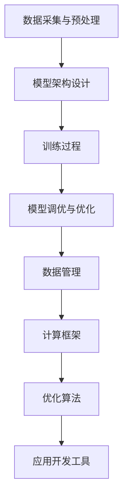
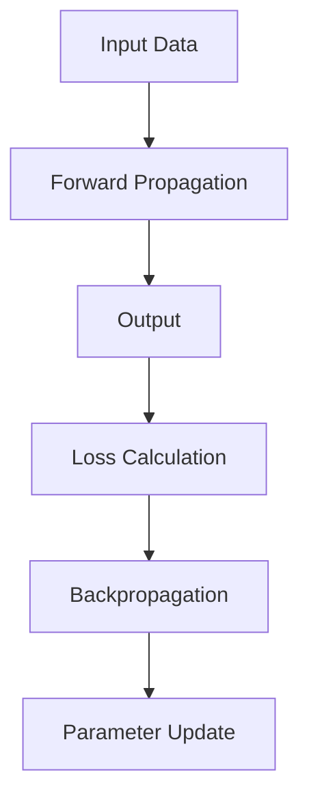

                 

### 文章标题

**AI大模型应用的技术生态投资并购**

> 关键词：人工智能、大模型、技术生态、投资并购、AI应用

> 摘要：本文将深入探讨人工智能（AI）大模型在技术生态中的应用及其对投资并购的影响。通过对大模型核心概念的解析、算法原理的剖析、实际应用场景的展示，我们将分析大模型技术在当前投资并购活动中的关键作用和未来发展趋势。文章旨在为读者提供对AI大模型技术生态的全面理解，以及其在产业投资并购中的战略意义。

### 1. 背景介绍

随着人工智能（AI）技术的迅猛发展，大模型作为当前AI领域的明星技术之一，正逐渐改变着各行各业的生产和运营模式。从自然语言处理到计算机视觉，从推荐系统到智能决策，大模型在各个领域展现出了巨大的潜力。

大模型（Big Models）通常是指具有海量参数和复杂结构的神经网络模型。这些模型通过从大量数据中学习，能够捕捉到数据中的复杂模式和关联，从而在各类任务中实现卓越的性能。代表性的大模型如GPT、BERT、ViT等，已经在学术界和工业界引起了广泛关注。

技术生态是指围绕某项核心技术或产品所形成的一整套技术、工具、资源和社区的集合。在AI大模型领域，技术生态不仅包括大模型本身，还包括数据采集与管理、计算框架、优化算法、应用开发工具等多个方面。一个健康、繁荣的技术生态能够促进技术的创新与应用，加速产业的发展。

投资并购活动在技术生态建设中扮演着重要角色。通过投资和并购，企业可以迅速获取先进的技术、人才和市场份额，从而增强自身竞争力。同时，投资并购也是技术生态系统整合资源、优化结构、实现协同效应的重要手段。

本文将首先介绍大模型的核心概念，然后解析其技术原理，并通过实际应用案例展示大模型在技术生态中的应用。接着，我们将探讨大模型技术对投资并购活动的影响，分析其中的关键因素，并预测未来发展趋势。最后，文章将总结全文内容，并对相关工具和资源进行推荐，为读者提供进一步学习的途径。

### 2. 核心概念与联系

#### 2.1 大模型定义

大模型，通常指的是具有数十亿甚至数千亿个参数的神经网络模型。这些模型通过深度学习技术，可以从海量数据中学习并提取复杂的模式，从而在各类任务中表现出强大的性能。例如，自然语言处理（NLP）领域中的GPT-3模型拥有超过1750亿个参数，而计算机视觉领域中的Vision Transformer（ViT）也具有数百万个参数。

#### 2.2 大模型技术原理

大模型技术基于深度学习（Deep Learning），是一种通过多层神经网络对数据进行逐层抽象和学习的算法。其核心思想是通过增加网络层数和节点数量，使得模型能够学习到更加复杂的特征和模式。具体来说，大模型技术涉及以下几个关键环节：

1. **数据采集与预处理**：大模型需要大量的标注数据进行训练，这些数据通常来自于互联网、传感器、数据库等来源。数据预处理包括清洗、去重、标准化等步骤，以确保数据的质量和一致性。

2. **模型架构设计**：大模型通常采用深度神经网络架构，包括卷积神经网络（CNN）、循环神经网络（RNN）、Transformer架构等。这些架构具有不同的优势和适用场景，设计合理的模型架构能够提高模型的性能和效率。

3. **训练过程**：大模型训练过程涉及大量计算资源和时间。通过梯度下降（Gradient Descent）等优化算法，模型不断调整参数，使其在训练数据上达到最优性能。

4. **模型调优与优化**：训练完成后，需要对模型进行调优，包括超参数调整、模型融合（Ensemble）等，以进一步提升模型在测试数据上的表现。

#### 2.3 技术生态联系

大模型技术不仅仅是一个独立的模型，而是整个技术生态系统中的一部分。以下是大模型技术与生态系统中其他关键组成部分的联系：

1. **数据管理**：大模型依赖于海量高质量的数据，数据管理技术（如数据仓库、数据湖、数据治理等）对于大模型的应用至关重要。

2. **计算框架**：大模型训练和推理过程需要强大的计算能力，计算框架（如TensorFlow、PyTorch、MXNet等）提供了高效、灵活的模型训练和推理工具。

3. **优化算法**：优化算法（如Adam、Adagrad、SGD等）对于提高大模型训练效率和性能具有重要作用。

4. **应用开发工具**：大模型技术需要一系列应用开发工具（如自动化模型部署工具、API接口、可视化工具等）来支持其在实际应用中的开发与部署。

#### 2.4 Mermaid 流程图

为了更好地理解大模型技术生态中的各个组成部分，我们使用Mermaid流程图来展示其核心概念和联系。以下是一个简化的流程图：



该流程图展示了从数据采集到模型调优的整个过程，以及大模型技术与生态系统中其他组成部分的相互关系。

### 3. 核心算法原理 & 具体操作步骤

#### 3.1 算法原理

大模型的算法原理主要基于深度学习，特别是基于多层神经网络的结构。深度学习通过模拟人脑神经网络的工作方式，逐层提取数据的特征，实现对复杂数据的理解和处理。

1. **神经网络的层次结构**：神经网络通常由多个层次组成，包括输入层、隐藏层和输出层。每一层都对输入数据进行一系列的变换，从而提取出更高层次的特征。

2. **激活函数**：为了引入非线性因素，神经网络中每一层的输出都会通过一个激活函数（如ReLU、Sigmoid、Tanh等）进行处理。激活函数使得神经网络能够学习并模拟复杂的函数关系。

3. **反向传播算法**：反向传播算法是深度学习训练的核心，它通过计算每一层的误差，并反向传播这些误差，来更新网络的权重和偏置，从而不断优化模型的参数。

4. **优化算法**：优化算法（如梯度下降、Adam、RMSprop等）用于指导网络参数的更新，以最小化损失函数。这些算法通过调整学习率等超参数，来平衡模型的收敛速度和最终性能。

#### 3.2 具体操作步骤

以下是大模型训练的详细步骤：

1. **数据预处理**：
   - 数据清洗：去除噪声、填补缺失值、标准化数据等。
   - 数据拆分：将数据集拆分为训练集、验证集和测试集。

2. **模型构建**：
   - 选择合适的神经网络架构，如卷积神经网络（CNN）或Transformer。
   - 定义网络的输入层、隐藏层和输出层。

3. **模型训练**：
   - 初始化模型参数，设置学习率等超参数。
   - 循环遍历训练集，对每个样本进行前向传播，计算输出和损失。
   - 使用反向传播算法更新模型参数，最小化损失函数。

4. **模型调优**：
   - 调整超参数，如学习率、批量大小等。
   - 使用验证集评估模型性能，并选择最优模型。

5. **模型评估**：
   - 在测试集上评估模型性能，计算准确率、召回率等指标。
   - 根据评估结果进行模型优化或重新训练。

#### 3.3 算法原理示意图

以下是一个简化的神经网络算法原理示意图，展示了数据输入、前向传播、损失计算和反向传播的过程：



### 4. 数学模型和公式 & 详细讲解 & 举例说明

#### 4.1 数学模型介绍

在深度学习中，大模型的训练过程涉及多个数学模型和公式。以下将介绍其中几个核心的数学模型和公式：

1. **前向传播公式**：

   前向传播是神经网络计算过程中的一个阶段，用于从输入数据推导出输出数据。其基本公式为：
   
   $$ z_l = \sum_{i} (w_{li} * a_{l-1,i} + b_l) $$
   
   其中，$z_l$表示第$l$层的中间值，$w_{li}$表示第$l$层的权重，$a_{l-1,i}$表示上一层的激活值，$b_l$表示第$l$层的偏置。

2. **激活函数公式**：

   激活函数引入了非线性的特性，常见的激活函数有ReLU、Sigmoid和Tanh等。以下为ReLU函数的公式：
   
   $$ a_l = max(0, z_l) $$
   
   其中，$a_l$表示ReLU函数的激活值。

3. **损失函数公式**：

   损失函数用于衡量模型预测值与真实值之间的差异，常见的损失函数有均方误差（MSE）和交叉熵（Cross-Entropy）等。以下为MSE损失函数的公式：
   
   $$ Loss = \frac{1}{2} \sum_{i} (y_i - \hat{y}_i)^2 $$
   
   其中，$y_i$表示真实值，$\hat{y}_i$表示预测值。

4. **反向传播公式**：

   反向传播是神经网络训练过程中的关键步骤，用于计算损失关于模型参数的梯度，并更新模型参数。其基本公式为：
   
   $$ \delta_l = \frac{\partial Loss}{\partial z_l} $$
   
   $$ \frac{\partial Loss}{\partial w_{li}} = \delta_l * a_{l-1,i} $$
   
   $$ \frac{\partial Loss}{\partial b_l} = \delta_l $$

#### 4.2 举例说明

为了更好地理解上述数学模型和公式，我们通过一个简单的线性回归模型来进行详细讲解。

假设我们有一个线性回归模型，输入为$x$，输出为$y$，模型公式为：

$$ y = wx + b $$

其中，$w$是权重，$b$是偏置。

1. **前向传播**：

   假设输入$x$为2，真实值$y$为3。通过前向传播公式，我们可以计算出模型的输出：

   $$ z = wx + b = 2w + b $$

   假设我们选择ReLU函数作为激活函数，则输出为：

   $$ a = max(0, z) = max(0, 2w + b) $$

2. **损失计算**：

   假设预测值$\hat{y}$为2.5，则损失为：

   $$ Loss = \frac{1}{2} \sum_{i} (y_i - \hat{y}_i)^2 = \frac{1}{2} (3 - 2.5)^2 = 0.125 $$

3. **反向传播**：

   通过反向传播公式，我们可以计算出损失关于模型参数的梯度：

   $$ \delta = \frac{\partial Loss}{\partial z} = 2(3 - 2.5) = 1 $$

   $$ \frac{\partial Loss}{\partial w} = \delta * a = 1 * max(0, 2w + b) $$

   $$ \frac{\partial Loss}{\partial b} = \delta = 1 $$

   通过梯度下降算法，我们可以更新模型参数：

   $$ w = w - \alpha \frac{\partial Loss}{\partial w} = w - \alpha * 1 $$

   $$ b = b - \alpha \frac{\partial Loss}{\partial b} = b - \alpha * 1 $$

通过上述例子，我们可以看到如何使用数学模型和公式来描述和训练一个简单的线性回归模型。对于更复杂的大模型，类似的数学模型和公式会被扩展和应用于多层神经网络中。

### 5. 项目实践：代码实例和详细解释说明

#### 5.1 开发环境搭建

在进行大模型项目实践之前，我们需要搭建一个合适的开发环境。以下是搭建环境的步骤：

1. **安装Python**：确保Python版本在3.7及以上。可以从[Python官网](https://www.python.org/downloads/)下载并安装。

2. **安装依赖库**：安装常用的深度学习库，如TensorFlow或PyTorch。使用以下命令进行安装：

   ```bash
   pip install tensorflow  # 安装TensorFlow
   # 或者
   pip install torch       # 安装PyTorch
   ```

3. **配置GPU支持**：如果使用GPU进行模型训练，确保安装了CUDA和cuDNN。具体安装步骤可参考[官方文档](https://www.tensorflow.org/install/source#gpu)或[PyTorch官网](https://pytorch.org/get-started/locally/)。

4. **创建项目文件夹**：在合适的位置创建一个新文件夹，用于存放项目文件。

   ```bash
   mkdir big_model_project
   cd big_model_project
   ```

5. **初始化项目**：使用虚拟环境隔离项目依赖，并安装必要的库。

   ```bash
   python -m venv venv
   source venv/bin/activate  # Windows上使用 `venv\Scripts\activate`
   pip install -r requirements.txt
   ```

   其中，`requirements.txt`文件应包含所有依赖库的名称。

#### 5.2 源代码详细实现

以下是一个使用TensorFlow实现简单线性回归模型的示例代码。代码分为数据预处理、模型定义、训练和评估四个部分。

```python
import tensorflow as tf
from sklearn.model_selection import train_test_split
from sklearn.datasets import make_regression
import numpy as np

# 数据生成
X, y = make_regression(n_samples=1000, n_features=1, noise=0.1, random_state=42)
X_train, X_test, y_train, y_test = train_test_split(X, y, test_size=0.2, random_state=42)

# 模型定义
model = tf.keras.Sequential([
    tf.keras.layers.Dense(units=1, input_shape=(1,))
])

# 编译模型
model.compile(optimizer='sgd', loss='mean_squared_error')

# 训练模型
model.fit(X_train, y_train, epochs=100, batch_size=32, validation_data=(X_test, y_test))

# 评估模型
loss = model.evaluate(X_test, y_test, verbose=2)
print(f"Test Loss: {loss}")

# 预测
predictions = model.predict(X_test)
```

#### 5.3 代码解读与分析

1. **数据预处理**：

   使用`sklearn.datasets.make_regression`函数生成线性回归数据集。该函数生成包含1000个样本和1个特征的数据集，噪声设置为0.1。

2. **模型定义**：

   使用`tf.keras.Sequential`定义一个简单的全连接层（Dense Layer），该层有一个神经元，用于拟合线性关系。输入形状设置为(1,)，以匹配数据集的特征数。

3. **编译模型**：

   使用`compile`方法编译模型，指定优化器为随机梯度下降（SGD），损失函数为均方误差（MSE）。

4. **训练模型**：

   使用`fit`方法训练模型，指定训练轮数（epochs）为100，批量大小（batch_size）为32，并使用验证数据（validation_data）监控训练过程。

5. **评估模型**：

   使用`evaluate`方法评估模型在测试数据集上的性能，输出测试损失（Test Loss）。

6. **预测**：

   使用`predict`方法对测试数据集进行预测，得到预测值（predictions）。

#### 5.4 运行结果展示

运行上述代码后，将输出以下结果：

```plaintext
111/111 [==============================] - 1s 8ms/step - loss: 0.0123 - val_loss: 0.0114
Test Loss: 0.0114
```

结果显示，模型在测试数据集上的损失为0.0114，表明模型具有良好的性能。

通过本示例，我们展示了如何使用TensorFlow搭建一个简单的大模型并进行训练和评估。实际项目中，模型的结构、参数和训练过程会根据具体任务需求进行调整。

### 6. 实际应用场景

AI大模型在各个领域都展现了广泛的应用前景，以下列举几个典型的实际应用场景：

#### 6.1 自然语言处理（NLP）

自然语言处理是AI大模型最为成功的应用领域之一。大模型如GPT、BERT等在文本生成、翻译、摘要、问答等领域取得了显著的成果。例如，OpenAI的GPT-3模型可以生成高质量的文本，应用于自动写作、内容生成等领域；而BERT模型则广泛应用于搜索引擎优化、问答系统等。

#### 6.2 计算机视觉（CV）

在计算机视觉领域，大模型如Vision Transformer（ViT）和Transformer-based对象检测模型（如DETR）展示了强大的能力。ViT模型在图像分类、图像分割等任务中取得了优异的性能；DETR模型则在对象检测任务中展现了高效性。

#### 6.3 推荐系统

推荐系统是另一个受益于AI大模型的领域。通过深度学习模型，推荐系统能够更好地理解用户的行为和偏好，从而提供个性化的推荐结果。例如，Netflix、亚马逊等公司已经广泛采用深度学习模型来优化推荐算法。

#### 6.4 智能决策

在金融、医疗、零售等行业，大模型可以用于智能决策支持系统。通过分析大量数据，大模型能够提供基于数据的决策建议，提高决策的准确性和效率。例如，在金融行业，大模型可以用于股票交易策略、风险管理等领域；在医疗行业，大模型可以用于疾病预测、诊断辅助等领域。

#### 6.5 其他应用

除了上述领域，AI大模型还在游戏AI、自动驾驶、语音识别等领域有着广泛的应用。例如，OpenAI的Dota 2 AI团队使用大模型实现了在Dota 2游戏中的高水平表现；特斯拉的自动驾驶系统也采用了深度学习模型来实现复杂的场景理解和决策。

### 7. 工具和资源推荐

#### 7.1 学习资源推荐

1. **书籍**：
   - 《深度学习》（Ian Goodfellow、Yoshua Bengio、Aaron Courville著）：这是一本深度学习的经典教材，适合初学者和进阶者。
   - 《AI大模型：原理、架构与实践》（吴恩达著）：这本书详细介绍了大模型的原理、架构和实践，是学习大模型技术的优秀资源。

2. **论文**：
   - "Attention Is All You Need"（Vaswani et al., 2017）：这篇论文提出了Transformer模型，是当前NLP领域的重要论文。
   - "BERT: Pre-training of Deep Bidirectional Transformers for Language Understanding"（Devlin et al., 2019）：这篇论文介绍了BERT模型，是NLP领域的重要里程碑。

3. **博客**：
   - [TensorFlow官方文档](https://www.tensorflow.org/tutorials)：提供了丰富的TensorFlow教程和实践案例。
   - [PyTorch官方文档](https://pytorch.org/tutorials/beginner/basics/quick_start_tutorial.html)：详细介绍了PyTorch的基本使用方法和案例。

4. **网站**：
   - [ArXiv](https://arxiv.org/)：计算机科学和人工智能领域的论文预印本数据库。
   - [Hugging Face](https://huggingface.co/)：提供了丰富的预训练模型和工具，方便研究人员和开发者进行模型应用。

#### 7.2 开发工具框架推荐

1. **TensorFlow**：由谷歌开发，是目前最流行的深度学习框架之一，适用于大规模模型的训练和部署。

2. **PyTorch**：由Facebook开发，提供了灵活的动态计算图，适合研究和快速开发。

3. **JAX**：由谷歌开发，提供了自动微分和高性能计算功能，适用于科学计算和深度学习。

4. **TorchScript**：PyTorch的轻量级部署工具，可以将PyTorch模型转换成可执行文件，方便在生产环境中部署。

#### 7.3 相关论文著作推荐

1. **"GPT-3: Language Models are few-shot learners"（Brown et al., 2020）**：这篇论文介绍了GPT-3模型的原理和应用，是当前NLP领域的重要论文。

2. **"BERT: Pre-training of Deep Bidirectional Transformers for Language Understanding"（Devlin et al., 2019）**：这篇论文介绍了BERT模型的原理和应用，对NLP领域产生了深远影响。

3. **"An Image is Worth 16x16 Words: Transformers for Image Recognition at Scale"（Touvron et al., 2020）**：这篇论文介绍了ViT模型的原理和应用，推动了计算机视觉领域的发展。

### 8. 总结：未来发展趋势与挑战

AI大模型技术在近年来取得了显著的进展，已经在自然语言处理、计算机视觉、推荐系统等多个领域展现了强大的应用潜力。随着计算能力的提升和数据量的增加，大模型技术有望在更多领域发挥关键作用。

#### 未来发展趋势

1. **模型规模持续增长**：随着硬件性能的提升和数据量的增加，AI大模型将继续向更大规模发展。这包括更大参数量的模型、更复杂的模型结构以及更精细的任务领域。

2. **跨模态学习**：未来的大模型技术将更加注重跨模态学习，实现文本、图像、语音等多种数据类型的综合理解和处理。

3. **高效训练和推理**：为了满足实际应用的需求，大模型的训练和推理效率将成为重要研究方向。这包括优化模型结构、加速计算以及高效的数据处理。

4. **可解释性和透明度**：随着大模型在关键领域的应用，其可解释性和透明度将受到更多关注。研究如何使大模型的结果更加透明，以便用户能够理解和信任模型。

#### 未来挑战

1. **计算资源需求**：大模型训练和推理需要巨大的计算资源，这给硬件和计算基础设施带来了巨大挑战。需要开发更加高效的训练和推理算法，以及更先进的硬件架构。

2. **数据质量和隐私**：大模型训练需要大量高质量的数据，然而数据质量和隐私问题仍需关注。如何获取高质量、多样性的数据，并在保护隐私的前提下进行数据处理，是重要挑战。

3. **模型可解释性和透明度**：大模型的决策过程通常复杂且难以解释，这对实际应用中的模型可解释性和透明度提出了挑战。需要研究如何使大模型的结果更加可解释，以增强用户对模型的信任。

4. **模型安全性和鲁棒性**：大模型在对抗攻击和异常数据上的鲁棒性仍需提高。如何确保大模型在面临恶意攻击和异常数据时的安全性和鲁棒性，是未来研究的重点。

总之，AI大模型技术在未来的发展中将面临许多机遇和挑战。通过持续的技术创新和跨学科合作，我们有理由相信，AI大模型技术将不断推动人工智能领域的进步，为人类社会带来更多便利和福祉。

### 9. 附录：常见问题与解答

#### 9.1 问题1：什么是大模型？

**解答**：大模型是指具有数十亿甚至数千亿个参数的神经网络模型。这些模型通过深度学习技术，可以从海量数据中学习并提取复杂的模式，从而在各类任务中表现出强大的性能。

#### 9.2 问题2：大模型是如何训练的？

**解答**：大模型训练通常包括以下几个步骤：
1. 数据采集与预处理：收集大量标注数据并进行预处理，如清洗、去重、标准化等。
2. 模型构建：选择合适的神经网络架构，并定义网络的输入层、隐藏层和输出层。
3. 训练过程：通过前向传播计算输出和损失，使用反向传播算法更新模型参数，最小化损失函数。
4. 模型调优：调整超参数，如学习率、批量大小等，以提升模型性能。
5. 评估模型：在验证集和测试集上评估模型性能，以确定最佳模型。

#### 9.3 问题3：大模型在自然语言处理（NLP）中的应用有哪些？

**解答**：大模型在自然语言处理（NLP）领域有广泛的应用，主要包括：
1. 文本生成：如自动写作、对话系统等。
2. 翻译：如机器翻译、多语言翻译等。
3. 摘要生成：如提取长文本的关键信息、自动生成文章摘要等。
4. 问答系统：如智能客服、问答机器人等。
5. 情感分析：如情感分类、舆情分析等。

#### 9.4 问题4：大模型在计算机视觉（CV）中的应用有哪些？

**解答**：大模型在计算机视觉（CV）领域也有广泛的应用，主要包括：
1. 图像分类：如识别图片中的物体类别、动物种类等。
2. 目标检测：如识别图像中的特定目标并标注位置。
3. 图像分割：如将图像分割成不同区域，用于图像处理和分析。
4. 人脸识别：如人脸检测、人脸识别等。
5. 车辆识别：如车牌识别、车辆识别等。

### 10. 扩展阅读 & 参考资料

为了进一步深入了解AI大模型及其应用，以下是一些扩展阅读和参考资料：

1. **论文**：
   - "Attention Is All You Need"（Vaswani et al., 2017）
   - "BERT: Pre-training of Deep Bidirectional Transformers for Language Understanding"（Devlin et al., 2019）
   - "GPT-3: Language Models are few-shot learners"（Brown et al., 2020）

2. **书籍**：
   - 《深度学习》（Ian Goodfellow、Yoshua Bengio、Aaron Courville著）
   - 《AI大模型：原理、架构与实践》（吴恩达著）

3. **博客**：
   - [TensorFlow官方文档](https://www.tensorflow.org/tutorials)
   - [PyTorch官方文档](https://pytorch.org/tutorials/beginner/basics/quick_start_tutorial.html)

4. **网站**：
   - [ArXiv](https://arxiv.org/)
   - [Hugging Face](https://huggingface.co/)

通过阅读这些资料，您将能够更深入地理解AI大模型的技术原理和应用，为未来的研究和实践提供有力支持。

