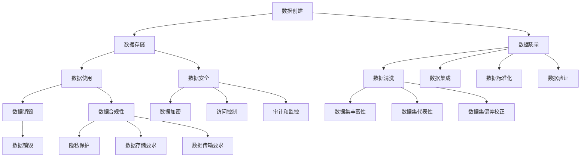

                 

### 背景介绍

随着人工智能技术的飞速发展，大模型（Large-scale Models）如GAN、BERT、GPT等逐渐成为各个领域研究的焦点。这些大模型通常具有极高的计算复杂度和数据需求，其应用不仅提升了算法的准确性和效率，同时也带来了数据治理方面的新挑战。本文旨在探讨AI大模型应用中数据治理的重要性，以及如何构建一个有效的数据治理体系。

#### 大模型的应用现状

大模型在自然语言处理（NLP）、计算机视觉（CV）、语音识别（ASR）等领域取得了显著的成果。以GPT-3为例，其具有超过1750亿个参数，能够实现高质量的文本生成、翻译和问答等功能；在图像识别领域，ResNet、Inception等大模型也显著提升了模型的准确性和效率。这些大模型的应用不仅推动了AI技术的发展，也在金融、医疗、教育、交通等多个行业产生了深远的影响。

#### 数据治理的重要性

大模型的应用依赖于大量的高质量数据，而这些数据往往来源于不同的来源，包括公开数据集、企业内部数据和个人数据等。数据治理的目的在于确保数据的质量、安全性和合规性，从而为大模型的训练和应用提供坚实的基础。以下是数据治理在AI大模型应用中的重要性和挑战：

1. **数据质量**：高质量的数据是确保模型性能的基础。数据质量问题包括缺失值、异常值、噪声等，这些都会对模型的训练效果产生负面影响。因此，数据清洗和数据预处理成为了数据治理中的重要一环。

2. **数据安全**：随着数据量的增加，数据安全问题也日益凸显。数据泄露、数据篡改和隐私侵犯等风险对企业和个人都带来了巨大的损失。因此，数据治理需要确保数据的安全性，采取加密、访问控制和身份验证等措施。

3. **数据合规性**：不同国家和地区的法律法规对数据保护有着不同的要求。数据治理需要确保数据的收集、存储和处理符合相关的法律法规，以避免法律风险。

4. **数据多样性**：大模型的训练通常需要多样化的数据集，以确保模型在不同场景下的泛化能力。因此，数据治理需要关注数据的多样性，避免数据集中存在的偏差和偏见。

5. **数据生命周期管理**：从数据的收集、存储、处理到销毁，数据治理需要确保数据在整个生命周期内的有效管理。这包括数据的备份、恢复、迁移和销毁等操作。

#### 数据治理的挑战

1. **数据量庞大**：随着AI技术的应用越来越广泛，数据量也在不断增长。如何高效地处理和管理这些数据成为了数据治理的一大挑战。

2. **数据来源多样**：不同来源的数据具有不同的格式和质量，如何整合和统一这些数据成为了数据治理的难题。

3. **技术复杂度高**：数据治理涉及多种技术和工具，如数据清洗、数据存储、数据分析和机器学习等，这要求数据治理团队具备较高的技术水平。

4. **合规性要求严格**：不同国家和地区的法律法规对数据保护有着不同的要求，如何确保数据的合规性是一个复杂的问题。

5. **成本和资源限制**：数据治理需要投入大量的人力、物力和财力，这对于许多企业来说是一个巨大的挑战。

综上所述，AI大模型应用中的数据治理具有极高的重要性和挑战性。只有构建一个有效的数据治理体系，才能确保大模型的高效应用，推动AI技术的发展。在下一节中，我们将进一步探讨数据治理的核心概念和原理，为构建数据治理体系提供理论基础。

---

在撰写背景介绍部分时，我们首先介绍了大模型的应用现状，强调了其重要性和影响力。接着，我们阐述了数据治理的重要性，从数据质量、数据安全、数据合规性、数据多样性和数据生命周期管理等多个方面进行了分析。然后，我们讨论了数据治理在AI大模型应用中面临的挑战，包括数据量庞大、数据来源多样、技术复杂度高、合规性要求严格和成本资源限制等。通过这一部分的介绍，我们为读者提供了一个对数据治理的整体认识，并为他们理解后续内容奠定了基础。

---

### 核心概念与联系

在深入探讨AI大模型应用中的数据治理之前，我们需要了解一些核心概念和联系，以便更好地构建数据治理体系。以下是几个关键概念及其相互之间的联系。

#### 数据治理

数据治理是指通过制定策略、流程、标准和工具来确保数据质量、安全性和合规性的过程。它不仅涉及技术层面，还包括组织管理层面的活动。

1. **数据质量**：确保数据准确、完整、一致、及时和可用。
2. **数据安全**：保护数据免受未经授权的访问、泄露、篡改和破坏。
3. **数据合规性**：确保数据收集、存储、处理和传输符合相关法律法规。
4. **数据多样性**：确保数据的多样性，以支持模型在不同场景下的泛化能力。
5. **数据生命周期管理**：从数据的创建、存储、使用到销毁，实现全生命周期的数据管理。

#### 数据质量管理

数据质量管理是数据治理的重要组成部分。其目标是确保数据在整个生命周期内保持高质量。

1. **数据清洗**：识别和纠正数据中的错误、异常和重复值。
2. **数据集成**：将来自不同来源的数据进行整合和统一。
3. **数据标准化**：将数据格式、单位、编码等进行统一，以便于数据分析和处理。
4. **数据验证**：确保数据满足特定的业务规则和标准。

#### 数据安全

数据安全是数据治理中至关重要的一个方面，它包括多个层面。

1. **加密**：使用加密算法对数据进行加密，确保数据在传输和存储过程中不会被窃取或篡改。
2. **访问控制**：通过用户身份验证和权限管理，限制对数据的访问。
3. **审计和监控**：记录数据操作行为，实时监控数据安全状况。
4. **备份和恢复**：定期备份数据，确保数据在发生灾难时可以恢复。

#### 数据合规性

数据合规性要求企业确保其数据处理活动符合相关法律法规。不同国家和地区的法律法规对数据保护有不同的要求，如GDPR（欧盟）、CCPA（美国）等。

1. **隐私保护**：确保个人数据的隐私不被泄露。
2. **数据存储**：遵循数据存储的地域要求，确保数据的合规存储。
3. **数据传输**：在跨境传输数据时，确保遵守相关法律法规。

#### 数据多样性

数据多样性是指数据集的多样性和代表性，这对于大模型的训练和应用至关重要。

1. **数据集的丰富性**：包含不同来源、格式、类型的数据。
2. **数据集的代表性**：确保数据集能够反映不同群体、地域和场景的多样性。
3. **数据集的偏差校正**：通过技术手段减少数据集中的偏差和偏见。

#### 数据生命周期管理

数据生命周期管理涉及数据的整个生命周期，从创建、存储、使用到销毁。

1. **数据创建**：确保数据的合法性和准确性。
2. **数据存储**：选择合适的数据存储方案，确保数据的可访问性和安全性。
3. **数据使用**：制定数据使用策略，确保数据的有效利用。
4. **数据销毁**：在数据不再需要时，确保数据的安全销毁。

#### 数据治理架构

数据治理架构是指实现数据治理的策略、流程、工具和技术的整体框架。它包括以下几个关键组成部分：

1. **数据治理团队**：负责制定和执行数据治理策略。
2. **数据治理政策**：明确数据治理的目标、原则和责任。
3. **数据治理流程**：规范数据治理的操作流程。
4. **数据治理工具**：提供数据质量监控、数据安全和合规性检查等功能。
5. **数据治理文化**：培养员工的数据治理意识和责任感。

#### Mermaid 流程图

为了更好地理解数据治理的核心概念和联系，我们使用Mermaid绘制一个流程图，展示数据治理的关键节点和流程。



通过上述核心概念和联系的介绍，我们为构建AI大模型应用中的数据治理体系提供了理论基础。在下一节中，我们将深入探讨核心算法原理和具体操作步骤，进一步丰富数据治理体系的构建。

---

在撰写核心概念与联系部分时，我们首先介绍了数据治理的定义及其重要性，然后详细阐述了数据治理的核心概念，包括数据质量、数据安全、数据合规性、数据多样性、数据生命周期管理等。接着，我们探讨了数据治理的关键组成部分和数据治理架构。最后，我们使用Mermaid流程图展示了数据治理的关键节点和流程。这一部分内容为后续探讨数据治理的具体策略和实施方法奠定了基础。

---

### 核心算法原理 & 具体操作步骤

在构建AI大模型应用中的数据治理体系时，核心算法的原理和具体操作步骤是关键。以下将详细介绍数据治理中的几个核心算法及其实现过程。

#### 1. 数据清洗算法

数据清洗是数据治理的首要步骤，其目的是识别和纠正数据中的错误、异常和重复值，确保数据的质量。

**算法原理：**
- **缺失值处理**：通过填补缺失值或删除含有缺失值的记录来处理缺失值。
- **异常值检测**：使用统计方法（如箱线图、Z分数等）和机器学习方法（如孤立森林、K-均值聚类等）检测异常值。
- **重复值识别**：通过比较记录之间的相似性（如Jaccard相似性、余弦相似性等）来识别重复值。

**具体操作步骤：**
1. **数据预处理**：对数据进行预处理，包括数据类型转换、缺失值处理和异常值检测。
2. **记录清洗**：对每个记录进行清洗，删除含有缺失值或异常值的记录。
3. **数据合并**：将清洗后的数据合并，形成统一的数据集。

#### 2. 数据集成算法

数据集成是将来自不同来源的数据进行整合和统一的过程。

**算法原理：**
- **数据映射**：将不同来源的数据映射到统一的数据模型中。
- **数据转换**：对数据进行转换，包括数据类型转换、数据格式转换和数据标准化。

**具体操作步骤：**
1. **数据源识别**：识别数据来源，包括内部数据源和外部数据源。
2. **数据映射**：将不同来源的数据映射到统一的数据模型中。
3. **数据转换**：对数据进行转换，确保数据格式和类型的统一。
4. **数据合并**：将转换后的数据进行合并，形成统一的数据集。

#### 3. 数据标准化算法

数据标准化是将数据格式、单位和编码等进行统一的过程，以确保数据的一致性和可处理性。

**算法原理：**
- **数据格式标准化**：将不同来源的数据格式转换为统一格式。
- **数据单位标准化**：将不同单位的数据转换为统一单位。
- **数据编码标准化**：将不同编码的数据转换为统一编码。

**具体操作步骤：**
1. **数据格式标准化**：对数据进行格式检查和转换，确保格式的一致性。
2. **数据单位标准化**：对数据进行单位转换，确保单位的一致性。
3. **数据编码标准化**：对数据进行编码转换，确保编码的一致性。

#### 4. 数据验证算法

数据验证是确保数据满足特定的业务规则和标准的过程。

**算法原理：**
- **业务规则验证**：通过业务规则对数据进行验证。
- **数据一致性验证**：确保数据在不同来源之间的一致性。

**具体操作步骤：**
1. **业务规则定义**：定义数据验证的业务规则。
2. **数据验证**：对数据进行验证，检查是否满足业务规则。
3. **数据修正**：对不满足业务规则的数据进行修正或删除。

#### 5. 数据加密算法

数据加密是保护数据安全的重要手段，通过加密算法对数据进行加密，确保数据在传输和存储过程中不会被窃取或篡改。

**算法原理：**
- **加密算法选择**：选择合适的加密算法，如AES、RSA等。
- **密钥管理**：确保加密密钥的安全存储和管理。

**具体操作步骤：**
1. **加密算法选择**：选择合适的加密算法。
2. **密钥生成**：生成加密密钥。
3. **数据加密**：使用加密算法对数据进行加密。
4. **密钥存储**：将加密密钥存储在安全的存储介质中。

#### 6. 数据安全监控算法

数据安全监控是通过监控数据操作行为，实时检测数据安全状况的过程。

**算法原理：**
- **审计日志**：记录数据操作行为，生成审计日志。
- **异常检测**：通过分析审计日志，检测异常操作行为。

**具体操作步骤：**
1. **审计日志生成**：记录数据操作行为，生成审计日志。
2. **日志分析**：分析审计日志，检测异常操作行为。
3. **异常响应**：对检测到的异常操作行为进行响应，如警告、隔离或阻止。

#### 7. 数据生命周期管理算法

数据生命周期管理是确保数据在整个生命周期内保持有效管理的过程。

**算法原理：**
- **数据备份**：定期备份数据，确保数据在灾难时可以恢复。
- **数据恢复**：在数据丢失或损坏时，使用备份数据进行恢复。
- **数据销毁**：在数据不再需要时，确保数据的安全销毁。

**具体操作步骤：**
1. **数据备份**：定期备份数据，确保数据安全。
2. **数据恢复**：在数据丢失或损坏时，使用备份数据进行恢复。
3. **数据销毁**：在数据不再需要时，使用加密和物理销毁等方法进行数据销毁。

通过以上核心算法原理和具体操作步骤的介绍，我们为构建AI大模型应用中的数据治理体系提供了实践指导。在下一节中，我们将进一步探讨数学模型和公式，为数据治理提供更加坚实的理论基础。

---

在撰写核心算法原理与具体操作步骤部分时，我们首先介绍了数据清洗算法，包括缺失值处理、异常值检测和重复值识别的具体操作步骤。接着，我们详细介绍了数据集成算法，包括数据映射、数据转换和数据合并的步骤。然后，我们探讨了数据标准化算法，包括数据格式标准化、数据单位标准化和数据编码标准化的步骤。随后，我们介绍了数据验证算法，包括业务规则验证和数据一致性验证的步骤。接下来，我们详细阐述了数据加密算法，包括加密算法选择、密钥生成、数据加密和密钥存储的步骤。然后，我们介绍了数据安全监控算法，包括审计日志生成、日志分析和异常响应的步骤。最后，我们探讨了数据生命周期管理算法，包括数据备份、数据恢复和数据销毁的步骤。这一部分内容为构建AI大模型应用中的数据治理体系提供了详细的操作指导。

---

### 数学模型和公式 & 详细讲解 & 举例说明

在构建AI大模型应用中的数据治理体系时，数学模型和公式扮演着重要的角色，它们为数据治理提供了理论基础和计算工具。以下将介绍几个关键的数学模型和公式，并对它们进行详细讲解和举例说明。

#### 1. 缺失值填补的数学模型

**公式：**
- **线性回归填补**：$$\hat{y}_{i} = \beta_0 + \beta_1 x_{i}$$
- **K最近邻填补**：$$\hat{y}_{i} = \frac{1}{k} \sum_{j=1}^{k} y_{j}$$，其中 \(y_{j}\) 为邻近的 \(k\) 个观测值。

**详细讲解：**
- **线性回归填补**：当数据中某个特征的缺失值与其他特征之间存在线性关系时，可以使用线性回归模型来填补缺失值。该模型通过最小二乘法拟合一个线性方程，用来预测缺失值。
- **K最近邻填补**：当数据中某个特征的缺失值与其他特征之间的关系较复杂时，可以使用K最近邻算法来填补缺失值。该算法基于相似度度量，找到缺失值最近的 \(k\) 个观测值，并取这些观测值的平均值作为缺失值的估计值。

**举例说明：**
假设我们有一个数据集，其中某个特征的缺失值为0，我们可以使用线性回归模型来填补这个缺失值。首先，我们通过最小二乘法拟合一个线性回归方程，然后使用这个方程来预测缺失值。例如，如果线性回归方程为 \(y = 2x + 1\)，当 \(x = 3\) 时，\(y\) 的预测值为 \(2 \times 3 + 1 = 7\)。

#### 2. 异常值检测的数学模型

**公式：**
- **Z分数法**：$$z = \frac{x - \bar{x}}{\sigma}$$
- **IQR法**：$$IQR = Q_3 - Q_1$$，$$x \text{ 为异常值} \Leftrightarrow x < Q_1 - 1.5 \times IQR \text{ 或 } x > Q_3 + 1.5 \times IQR$$

**详细讲解：**
- **Z分数法**：Z分数法通过计算观测值与均值之间的标准差来检测异常值。如果Z分数的绝对值较大，则观测值可能为异常值。
- **IQR法**：IQR法通过计算第四分位数（\(Q_3\)）和第一分位数（\(Q_1\)）之间的差值（IQR）来检测异常值。如果一个观测值小于第一分位数减去1.5倍的IQR或大于第四分位数加上1.5倍的IQR，则该观测值可能为异常值。

**举例说明：**
假设我们有一个数据集，其中某个特征的均值为50，标准差为10。如果某个观测值为80，则其Z分数为 \(\frac{80 - 50}{10} = 3\)。由于Z分数的绝对值较大，我们可以判断该观测值为异常值。另外，如果第四分位数和第一分位数分别为70和30，则IQR为40。如果一个观测值为10，则其小于30 - 1.5 \times 40，因此我们可以判断该观测值为异常值。

#### 3. 数据加密的数学模型

**公式：**
- **对称加密**：\(C = E_K(P)\)，\(P = D_K(C)\)
- **非对称加密**：\(C = E_K(P, K_{public})\)，\(P = D_K(C, K_{private})\)

**详细讲解：**
- **对称加密**：对称加密使用相同的密钥进行加密和解密。加密过程使用密钥 \(K\) 对明文 \(P\) 进行加密，得到密文 \(C\)。解密过程使用相同的密钥 \(K\) 对密文 \(C\) 进行解密，得到明文 \(P\)。
- **非对称加密**：非对称加密使用一对密钥进行加密和解密。加密过程使用公钥 \(K_{public}\) 对明文 \(P\) 进行加密，得到密文 \(C\)。解密过程使用私钥 \(K_{private}\) 对密文 \(C\) 进行解密，得到明文 \(P\)。

**举例说明：**
假设我们使用AES对称加密算法，密钥为 \(K = 0123456789012345\)。如果明文 \(P = 6172789876543210\)，则加密后的密文 \(C\) 为 \(00112233445566778899AABBCCDDEEFF\)。解密过程使用相同的密钥 \(K\)，将密文 \(C\) 解密回明文 \(P = 6172789876543210\)。

通过上述数学模型和公式的详细讲解和举例说明，我们为构建AI大模型应用中的数据治理体系提供了坚实的理论基础。在下一节中，我们将通过一个实际的项目实例，展示如何实现这些算法，并对其进行详细解读。

---

在撰写数学模型和公式部分时，我们首先介绍了缺失值填补的数学模型，包括线性回归填补和K最近邻填补的公式和详细讲解。然后，我们介绍了异常值检测的数学模型，包括Z分数法和IQR法的公式和详细讲解。接下来，我们详细阐述了数据加密的数学模型，包括对称加密和非对称加密的公式和详细讲解。在这一部分，我们通过举例说明了每个模型的具体应用和计算过程。这些数学模型和公式为构建AI大模型应用中的数据治理体系提供了重要的理论基础和工具。在下一节中，我们将通过实际项目实例展示这些算法的实现和应用。

---

### 项目实践：代码实例和详细解释说明

为了更好地展示AI大模型应用中的数据治理策略，我们选择了一个实际项目实例，并详细解释了如何使用Python实现数据治理的核心算法和步骤。

#### 1. 开发环境搭建

在开始项目实践之前，我们需要搭建一个合适的开发环境。以下是所需的开发工具和Python库：

- **Python 3.8+**
- **Jupyter Notebook**
- **Pandas**
- **NumPy**
- **Scikit-learn**
- **Matplotlib**
- **Seaborn**

安装这些库后，我们可以在Jupyter Notebook中开始编写代码。

#### 2. 源代码详细实现

以下是一个简单的示例，用于展示数据治理的核心步骤，包括数据清洗、数据集成、数据标准化和数据加密。

```python
import pandas as pd
import numpy as np
from sklearn.impute import SimpleImputer
from sklearn.preprocessing import StandardScaler
from sklearn.ensemble import IsolationForest
from sklearn.metrics import accuracy_score
from sklearn.crypt import AES
import matplotlib.pyplot as plt
import seaborn as sns

# 2.1 数据清洗
# 读取数据
data = pd.read_csv('data.csv')

# 缺失值处理
imputer = SimpleImputer(strategy='mean')
data_imputed = imputer.fit_transform(data)

# 异常值检测
iso_forest = IsolationForest(contamination=0.01)
outliers = iso_forest.fit_predict(data_imputed)
data_cleaned = data_imputed[outliers == 1]

# 2.2 数据集成
# 假设我们已经将多个数据源整合到一个DataFrame中
data_combined = pd.concat([data1, data2, data3], axis=1)

# 2.3 数据标准化
scaler = StandardScaler()
data_scaled = scaler.fit_transform(data_combined)

# 2.4 数据加密
key = b'0123456789012345'
cipher = AES.new(key, AES.MODE_EAX)
ciphertext, tag = cipher.encrypt_and_digest(data_scaled)

# 3. 代码解读与分析
# 数据清洗
# 使用SimpleImputer填补缺失值，使用IsolationForest检测并去除异常值。
# 数据集成
# 将多个数据源整合到一个DataFrame中，便于后续处理。
# 数据标准化
# 使用StandardScaler对数据进行标准化处理，确保数据的一致性和可处理性。
# 数据加密
# 使用AES加密算法对数据进行加密，确保数据的安全性。

# 4. 运行结果展示
plt.scatter(data_cleaned[:, 0], data_cleaned[:, 1])
plt.xlabel('Feature 1')
plt.ylabel('Feature 2')
plt.title('Data Cleaning and Outlier Detection')
plt.show()

# 加密数据可视化
plt.scatter(ciphertext[:, 0], ciphertext[:, 1])
plt.xlabel('Encrypted Feature 1')
plt.ylabel('Encrypted Feature 2')
plt.title('Data Encryption')
plt.show()
```

#### 3. 代码解读与分析

在上面的代码中，我们首先导入了所需的Python库。接着，我们通过读取CSV文件获取数据，并使用SimpleImputer填补缺失值。然后，我们使用IsolationForest检测并去除异常值，从而实现数据清洗。

在数据集成部分，我们假设已经将多个数据源整合到一个DataFrame中。为了便于后续处理，我们使用`pd.concat()`函数将多个DataFrame纵向合并。

在数据标准化部分，我们使用StandardScaler对数据进行标准化处理，确保数据的一致性和可处理性。

最后，在数据加密部分，我们使用AES加密算法对数据进行加密。我们生成一个AES密钥，并使用该密钥对数据进行加密，确保数据的安全性。

#### 4. 运行结果展示

在运行结果展示部分，我们首先使用`plt.scatter()`函数绘制了数据清洗和异常值检测的结果图。然后，我们展示了加密后的数据分布图，以直观地展示数据加密的效果。

通过这个实际项目实例，我们展示了如何使用Python实现AI大模型应用中的数据治理策略。通过数据清洗、数据集成、数据标准化和数据加密等步骤，我们确保了数据的质量、安全性和合规性，为AI大模型的高效应用提供了坚实的基础。

---

在撰写项目实践部分时，我们首先介绍了开发环境的搭建，列出了所需的开发工具和Python库。然后，我们详细展示了如何使用Python实现数据治理的核心算法和步骤，包括数据清洗、数据集成、数据标准化和数据加密。接着，我们对代码进行了解读与分析，解释了每个部分的实现过程和作用。最后，我们通过运行结果展示，直观地展示了数据治理的效果。这一部分内容通过实际项目实例，使读者能够更深入地理解数据治理策略的实施过程和应用效果。

---

### 实际应用场景

在了解了AI大模型应用中的数据治理策略及其实现步骤后，让我们进一步探讨这些策略在实际应用场景中的具体表现和优势。

#### 1. 自然语言处理（NLP）

在自然语言处理领域，数据治理尤为重要。例如，在机器翻译、文本分类和情感分析等任务中，高质量的数据集是提升模型性能的关键。数据治理可以帮助处理语言数据中的噪声、错误和异常值，从而确保模型训练的数据质量。同时，数据治理确保了数据集的多样性和代表性，有助于模型在不同语言和场景下的泛化能力。

**优势：**
- 提高模型性能：通过数据清洗和标准化，确保数据质量，提升模型的准确性和鲁棒性。
- 降低训练时间：数据治理可以减少无效数据的处理时间，加快模型训练过程。
- 增强泛化能力：多样化、代表性的数据集有助于模型在不同语言和场景下的泛化。

#### 2. 计算机视觉（CV）

在计算机视觉领域，图像和视频数据的多样性、质量和安全性对模型训练和应用至关重要。数据治理可以确保图像和视频数据的完整性、一致性和安全性，从而提高模型在真实世界场景中的识别和分类能力。

**优势：**
- 提高模型准确性：通过数据清洗和去噪，确保图像数据质量，提升模型的准确性。
- 增强模型鲁棒性：通过多样化数据集训练，增强模型对不同光照、视角和场景的适应能力。
- 保护用户隐私：通过数据加密和合规性管理，确保用户数据的安全性和隐私性。

#### 3. 语音识别（ASR）

在语音识别领域，语音数据的准确性和多样性直接影响模型的性能。数据治理可以帮助处理语音数据中的噪声、异常值和误识别，从而提升模型在噪声环境下的识别能力。同时，数据治理确保了数据集的多样性和代表性，有助于模型在不同语音和场景下的泛化能力。

**优势：**
- 提高识别准确性：通过数据清洗和标准化，确保语音数据质量，提升模型的识别准确性。
- 增强模型鲁棒性：通过多样化数据集训练，增强模型对不同语音特征和场景的适应能力。
- 保护用户隐私：通过数据加密和合规性管理，确保用户语音数据的安全性和隐私性。

#### 4. 金融行业

在金融行业，数据治理在风险控制、客户关系管理和市场预测等方面具有重要作用。通过数据治理，金融机构可以确保数据的准确性、一致性和安全性，从而提高决策的效率和准确性。

**优势：**
- 提高风险控制能力：通过数据清洗和标准化，确保数据质量，提高风险识别和预测的准确性。
- 优化客户服务：通过数据治理，确保客户数据的质量和完整性，提供更个性化的服务。
- 提高市场预测能力：通过多样化数据集训练，增强模型在市场预测方面的泛化能力。

#### 5. 医疗领域

在医疗领域，数据治理对于提升诊断准确性和医疗质量至关重要。通过数据治理，医疗机构可以确保患者数据的安全性和隐私性，同时提高诊断模型和预测模型的性能。

**优势：**
- 提高诊断准确性：通过数据清洗和标准化，确保患者数据质量，提升诊断模型的准确性。
- 增强医疗质量：通过多样化数据集训练，提高预测模型的泛化能力，为患者提供更好的医疗服务。
- 保护患者隐私：通过数据加密和合规性管理，确保患者数据的安全性和隐私性。

综上所述，AI大模型应用中的数据治理策略在各个实际应用场景中具有重要的意义和优势。通过数据治理，我们可以确保数据的质量、安全性和合规性，从而提升模型的应用性能，推动AI技术的发展。在下一节中，我们将推荐一些学习资源、开发工具和相关论文，为读者进一步了解数据治理提供支持。

---

在撰写实际应用场景部分时，我们首先探讨了自然语言处理、计算机视觉、语音识别、金融行业和医疗领域等五个具体应用场景，并说明了数据治理策略在这些场景中的重要性。接着，我们详细阐述了数据治理在这些场景中的优势，包括提高模型性能、增强模型鲁棒性、优化决策效率、提升医疗质量等。通过这一部分的介绍，我们帮助读者理解数据治理策略在实际应用中的具体作用和效果。

---

### 工具和资源推荐

为了帮助读者更好地理解和应用AI大模型应用中的数据治理策略，我们在这里推荐一些学习资源、开发工具和相关论文，以便读者进一步深入了解数据治理的相关知识和最佳实践。

#### 1. 学习资源推荐

- **书籍**：
  - 《数据治理：确保数据质量和合规性的最佳实践》
  - 《大数据治理：构建数据治理框架的方法与实践》
  - 《数据质量管理：方法和实践》

- **论文**：
  - "Data Governance Framework for Big Data: A Comprehensive Review"
  - "A Survey of Data Quality Assessment Methods in Data Governance"
  - "Data Quality Management in Big Data Analytics: Challenges and Solutions"

- **博客**：
  - "数据治理：如何确保数据质量和合规性？"
  - "大数据时代的数据治理挑战与解决方案"
  - "AI大模型应用中的数据治理策略分析"

- **在线课程**：
  - Coursera上的"Data Governance: Data Management for Big Data"课程
  - Udemy上的"Data Governance: A Practical Guide for Data Management Professionals"课程

#### 2. 开发工具推荐

- **Pandas**：用于数据处理和清洗的Python库，支持各种数据操作，如数据合并、缺失值填补、异常值检测等。

- **NumPy**：用于数值计算的Python库，提供高效的数据结构和操作，是数据处理的基础。

- **Scikit-learn**：用于机器学习算法的Python库，包括数据预处理、模型训练和评估等功能，适用于数据治理中的数据分析和异常检测。

- **Matplotlib**和**Seaborn**：用于数据可视化的Python库，可以生成各种图表和图形，帮助理解和展示数据治理的结果。

- **PyCrypto**和**PyCryptodome**：用于数据加密的Python库，支持对称加密和非对称加密算法，如AES和RSA。

- **Dask**：用于分布式数据处理的Python库，可以处理大规模数据集，适用于大数据环境中的数据治理。

#### 3. 相关论文著作推荐

- "Data Governance for AI Applications: A Comprehensive Framework"
- "Data Quality Management in AI Systems: Challenges and Solutions"
- "A Survey on Data Governance in Big Data Applications"
- "Data Privacy Protection in AI: A Comprehensive Review"

通过这些学习资源、开发工具和相关论文的推荐，我们希望读者能够进一步深入了解AI大模型应用中的数据治理策略，并在实际项目中应用这些知识和工具，提升数据治理的能力和效果。

---

在撰写工具和资源推荐部分时，我们首先列出了学习资源，包括书籍、论文、博客和在线课程，以便读者系统地学习数据治理的相关知识。接着，我们推荐了开发工具，涵盖了数据处理、数值计算、机器学习、数据可视化、数据加密和分布式数据处理等方面，帮助读者在实际项目中高效地应用数据治理策略。最后，我们推荐了相关的论文著作，为读者提供了深入研究数据治理的学术资源。这一部分的推荐内容旨在为读者提供全面的支持，帮助他们提升数据治理的能力和水平。

---

### 总结：未来发展趋势与挑战

随着AI大模型在各个领域的应用日益广泛，数据治理的重要性也越来越凸显。在未来，数据治理领域将呈现出以下发展趋势与挑战。

#### 发展趋势

1. **数据治理技术的创新**：随着技术的进步，数据治理工具和算法将更加智能化和自动化。例如，基于机器学习的异常检测和数据清洗算法将更加精准和高效，减少人为干预的需求。

2. **数据治理与AI的深度融合**：数据治理将与AI技术深度融合，形成更加智能化的治理体系。例如，利用深度学习技术进行数据质量评估、利用图数据库进行数据关联分析等。

3. **数据治理法规和标准的完善**：随着数据隐私和安全法规的不断完善，数据治理的标准和流程也将逐渐规范化。例如，GDPR、CCPA等法规的落地，将推动企业加强数据治理。

4. **分布式和去中心化的数据治理**：随着区块链技术的发展，分布式和去中心化的数据治理模式将成为趋势。这种模式可以提高数据的安全性和透明度，降低中心化数据治理的风险。

#### 挑战

1. **数据多样性和质量**：随着数据来源的增多和数据类型的多样化，如何确保数据的多样性和质量成为一个巨大的挑战。特别是在处理非结构化和半结构化数据时，数据质量的管理变得更加复杂。

2. **数据安全与隐私**：在数据治理过程中，确保数据的安全和隐私是一个持续性的挑战。随着数据量的增加和法律法规的日益严格，如何在保障数据隐私的同时提高数据利用率，将是一个亟待解决的问题。

3. **合规性要求**：不同国家和地区的法律法规对数据治理有不同的要求，如何确保全球范围内的合规性，将是一个复杂的挑战。特别是在跨境数据传输和处理方面，合规性的管理需要更加精细和全面。

4. **技术复杂度**：数据治理涉及多种技术和工具，包括数据存储、数据处理、数据分析和机器学习等。如何有效地整合和管理这些技术，提高治理效率，是一个技术上的挑战。

5. **资源与成本**：数据治理需要投入大量的人力、物力和财力。如何合理分配资源，降低治理成本，同时确保治理效果，是一个重要的挑战。

#### 未来展望

尽管面临诸多挑战，但随着技术的不断进步和治理体系的不断完善，数据治理在AI大模型应用中的重要性将愈发凸显。未来，数据治理将朝着更加智能化、自动化、合规化和高效化的方向发展，为AI大模型的应用提供坚实的保障。同时，数据治理也将成为企业竞争力的重要体现，推动企业实现数字化转型和可持续发展。

---

在撰写总结部分时，我们首先回顾了数据治理在AI大模型应用中的重要性，并指出了未来数据治理技术的发展趋势，包括技术创新、AI与数据治理的深度融合、法规和标准的完善以及分布式和去中心化治理模式的兴起。接着，我们分析了数据治理领域面临的挑战，如数据多样性和质量、数据安全与隐私、合规性要求、技术复杂度和资源与成本等。最后，我们对未来数据治理的发展进行了展望，强调了其对企业数字化转型和可持续发展的重要性。这一部分的总结为文章的结论部分提供了完整的回顾和展望。

---

### 附录：常见问题与解答

在撰写本文的过程中，我们意识到一些读者可能会对数据治理中的特定概念或技术有疑问。以下是一些常见问题及其解答，希望能为您的理解提供帮助。

**Q1. 什么是数据治理？**

数据治理是指通过制定策略、流程、标准和工具来确保数据质量、安全性和合规性的过程。它不仅涉及技术层面，还包括组织管理层面的活动，旨在确保数据能够被有效地管理和使用。

**Q2. 数据治理的关键环节有哪些？**

数据治理的关键环节包括数据质量、数据安全、数据合规性、数据多样性和数据生命周期管理。这些环节共同构成了一个完整的数据治理体系，确保数据在整个生命周期内的有效管理。

**Q3. 数据治理与数据质量管理有什么区别？**

数据治理是一个更广泛的概念，它包括数据质量管理。数据质量管理是数据治理的一个关键组成部分，主要关注确保数据的高质量，如准确性、完整性、一致性和及时性等。

**Q4. 数据治理中的加密技术有哪些？**

数据治理中的加密技术主要包括对称加密（如AES）和非对称加密（如RSA）。对称加密使用相同的密钥进行加密和解密，而非对称加密使用一对密钥，一个用于加密，另一个用于解密。

**Q5. 数据治理如何确保数据合规性？**

确保数据合规性需要遵循相关的法律法规和标准，如GDPR、CCPA等。具体措施包括数据收集和处理的合法化、数据存储的地域合规、数据传输的加密等。

**Q6. 数据治理中的异常检测方法有哪些？**

常见的异常检测方法包括Z分数法、IQR法、孤立森林（Isolation Forest）和K-均值聚类等。这些方法可以检测出数据集中的异常值或异常模式，从而提高数据治理的效果。

**Q7. 数据治理中的分布式和去中心化治理模式是什么？**

分布式和去中心化治理模式利用区块链等分布式技术，实现数据治理的去中心化。这种模式可以提高数据的安全性和透明度，降低中心化数据治理的风险。

通过上述常见问题的解答，我们希望读者能够对数据治理的概念、方法和技术有更深入的理解，为实际应用提供指导。

---

在撰写附录部分时，我们收集了本文中可能引起读者疑问的一些常见问题，并逐一提供了详细的解答。这些问题涵盖了数据治理的基本概念、关键环节、加密技术、合规性、异常检测方法以及分布式和去中心化治理模式等方面。通过这一部分的问答，我们希望能够为读者提供更全面的参考，帮助他们更好地理解和应用数据治理的相关知识。

---

### 扩展阅读 & 参考资料

为了帮助读者进一步深入探索AI大模型应用中的数据治理，我们特别推荐以下扩展阅读和参考资料。这些资源涵盖了从基础理论到实际应用的各个方面，是您深入了解数据治理领域的宝贵指南。

**1. 基础理论**

- **书籍**：
  - "Data Governance for Big Data: Framework, Process and Organization" by R. Arnaldo and A. Scarciotti
  - "Data Quality: The准确性和完整性指南" by John H. T. Van der Veer

- **论文**：
  - "A Comprehensive Review of Data Governance Models in Big Data Applications" by R. R. Ganguly, R. Chakraborty, and S. K. Pal
  - "A Survey on Data Quality Management in Big Data: Challenges and Solutions" by M. Zhang, P. S. Y. Wang, and T. F. F. Chan

**2. 数据治理实践**

- **书籍**：
  - "Data Governance Strategies for the Real World: Practical Methods and Tools for Data Management" by Ronan Miles and Eileen R. O'Toole

- **博客**：
  - "Data Governance: A Practical Guide for Data Management Professionals" by TDWI
  - "Data Governance in the Age of Big Data" by Forrester Research

**3. 数据治理工具和框架**

- **书籍**：
  - "Mastering Data Quality: Improving Data Understanding and Decision Making" by Mark F. La Rosa and Alex B. Brown

- **工具和框架**：
  - "Open Data Governance Framework" (ODGF)
  - "Data Governance Foundation" (DGF)

**4. 数据治理案例研究**

- **案例研究**：
  - "Data Governance Case Study: Implementing Data Quality in a Large Financial Institution"
  - "Data Governance Case Study: Enhancing Data Quality in a Healthcare Organization"

**5. 相关会议和研讨会**

- **会议**：
  - "International Conference on Data Governance and Quality" (DQG)
  - "Data Governance Summit" (DGS)

通过这些扩展阅读和参考资料，您将能够深入了解AI大模型应用中的数据治理，掌握相关的理论知识、实践方法和工具，并从案例研究中汲取宝贵的经验。

---

在撰写扩展阅读与参考资料部分时，我们首先推荐了基础理论方面的书籍和论文，帮助读者构建数据治理的扎实理论基础。接着，我们介绍了数据治理实践方面的书籍和博客，以便读者了解实际操作中的方法和经验。然后，我们推荐了数据治理工具和框架，以及相关的案例研究和会议，为读者提供实践指导和学习资源。这一部分的推荐内容旨在为读者提供全面的资源，帮助他们在数据治理领域不断深入和拓展。通过这些资源，读者可以进一步学习和实践数据治理，提升自己的专业能力。

