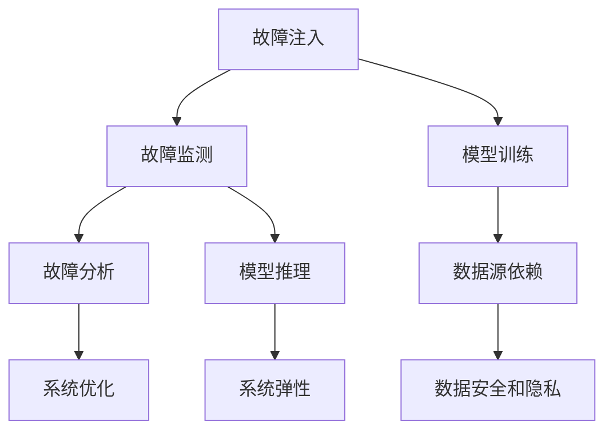

                 

### 1. 背景介绍

人工智能（AI）作为21世纪最具变革性的技术之一，正迅速渗透到各个行业，推动着数字化转型的进程。其中，大模型（Large Models）在AI领域的应用尤为引人注目。大模型是指具有巨大参数量的神经网络模型，它们能够在图像识别、自然语言处理、推荐系统等多个领域实现高度准确和智能化的表现。然而，随着大模型的规模不断扩大，其应用过程中也面临着诸多挑战，例如计算资源的高需求、训练与推理时间的增加以及模型复杂性的提升。

混沌工程（Chaos Engineering）作为一种新兴的工程实践，旨在通过故意引入故障和压力，测试系统的弹性和健壮性，从而提高系统的可靠性和稳定性。在AI大模型应用中，混沌工程可以帮助我们识别并解决潜在的问题，确保模型在实际应用中的稳定性和可靠性。本文将围绕AI大模型应用的混沌工程实践与工具展开讨论，旨在为读者提供一个全面的技术指南。

混沌工程的理念源于软件工程中的故障注入（Fault Injection）实践，其核心思想是通过对系统进行故意破坏，来验证系统在异常情况下的表现。具体来说，混沌工程包括以下几个关键步骤：

1. **故障注入**：通过模拟各种可能的故障场景，如硬件故障、网络中断、数据丢失等，向系统引入异常情况。
2. **故障监测**：实时监控系统的状态，收集故障注入后的系统行为数据。
3. **故障分析**：对故障监测数据进行深入分析，评估系统的弹性和健壮性。
4. **故障恢复**：根据分析结果，对系统进行调整和优化，以提高其稳定性和可靠性。

混沌工程在AI大模型应用中的重要性体现在以下几个方面：

1. **模型训练可靠性**：AI大模型通常需要大量的数据和高性能的计算资源。在模型训练过程中，任何意外的故障都可能导致训练中断或模型性能下降。混沌工程可以帮助我们提前发现并解决这些潜在问题，确保模型训练的连续性和稳定性。
2. **模型推理可靠性**：在实际应用中，AI大模型需要进行实时推理，以满足用户的需求。混沌工程可以验证模型在复杂场景下的推理能力，确保模型在各种异常情况下仍然能够准确和高效地运行。
3. **系统弹性**：AI大模型应用通常涉及多个组件和系统，如数据存储、计算引擎、网络通信等。混沌工程可以帮助我们评估整个系统的弹性，确保在面对外部扰动时，系统能够快速恢复并保持正常运行。
4. **安全性与隐私保护**：AI大模型的应用场景复杂多样，涉及到大量的敏感数据。混沌工程可以帮助我们识别系统中的安全漏洞和隐私泄露风险，确保数据的安全性和隐私保护。

总之，混沌工程在AI大模型应用中具有重要的作用，能够帮助我们提高模型的训练和推理可靠性，增强系统的弹性和健壮性，保障数据的安全和隐私。在接下来的章节中，我们将详细探讨混沌工程的核心概念、算法原理、数学模型、实际应用案例以及相关的工具和资源，为读者提供一个全面的混沌工程实践指南。

### 2. 核心概念与联系

#### 混沌工程的核心概念

混沌工程的核心概念可以概括为故障注入（Fault Injection）、故障监测（Fault Monitoring）和故障分析（Fault Analysis）。以下是每个概念的具体定义和作用：

1. **故障注入（Fault Injection）**：故障注入是指有意识地引入故障或异常情况，以测试系统的可靠性和应对能力。通过模拟各种可能的故障场景，如硬件故障、网络中断、数据丢失等，可以提前发现系统中潜在的问题，从而进行优化和改进。

2. **故障监测（Fault Monitoring）**：故障监测是实时监控系统的状态，收集故障注入后的系统行为数据。通过监控系统的运行情况，可以了解故障对系统的影响范围和程度，为故障分析提供基础数据。

3. **故障分析（Fault Analysis）**：故障分析是指对故障监测数据进行深入分析，评估系统的弹性和健壮性。通过对故障数据进行分析，可以发现系统的薄弱环节，并采取相应的措施进行优化和修复。

#### 大模型的特性

在讨论混沌工程在AI大模型中的应用之前，我们需要了解大模型的几个关键特性：

1. **大规模参数量**：大模型通常包含数亿甚至数十亿个参数，这使得它们的计算复杂度极高。大规模参数量不仅要求大量的计算资源，还对模型的训练和推理效率提出了挑战。

2. **高度非线性**：大模型通常基于深度神经网络，其内部结构高度非线性。这种非线性特性使得模型在训练过程中容易受到外部因素的影响，例如数据噪声、硬件故障等。

3. **依赖外部数据源**：AI大模型通常依赖大量的外部数据源进行训练和推理。数据源的稳定性直接影响模型的表现，任何异常情况都可能导致模型性能下降。

4. **复杂性**：大模型的复杂性体现在其训练、推理、部署等多个环节。在复杂的应用场景中，模型可能面临多种异常情况，如数据缺失、网络延迟、计算资源不足等。

#### 混沌工程与大模型应用的关联

混沌工程与大模型应用的关联可以从以下几个方面进行阐述：

1. **提升模型训练可靠性**：混沌工程可以通过故障注入和故障监测，提前识别并解决模型训练过程中可能出现的故障。例如，通过模拟硬件故障，可以检测模型对计算资源的依赖程度，确保训练过程的连续性和稳定性。

2. **增强模型推理可靠性**：在实际应用中，AI大模型需要进行实时推理，以满足用户的需求。混沌工程可以通过故障注入和故障监测，验证模型在各种异常情况下的表现，确保模型在复杂场景下仍然能够准确和高效地运行。

3. **提升系统弹性**：AI大模型应用通常涉及多个组件和系统，如数据存储、计算引擎、网络通信等。混沌工程可以帮助我们评估整个系统的弹性，确保在面对外部扰动时，系统能够快速恢复并保持正常运行。

4. **保障数据安全和隐私**：在AI大模型应用中，数据的安全和隐私保护至关重要。混沌工程可以帮助我们识别系统中的安全漏洞和隐私泄露风险，从而采取相应的措施进行优化和修复，确保数据的安全性和隐私保护。

#### Mermaid 流程图

为了更好地展示混沌工程在AI大模型应用中的流程和关联，我们可以使用Mermaid流程图。以下是一个简化的Mermaid流程图示例，描述了混沌工程的核心步骤及其与大模型应用的关系：



在这个流程图中，A表示故障注入，B表示故障监测，C表示故障分析，D表示系统优化。E表示模型训练，F表示模型推理，G表示数据源依赖，H表示系统弹性，I表示数据安全和隐私。通过这个流程图，我们可以清晰地看到混沌工程在大模型应用中的关键步骤及其相互关系。

总的来说，混沌工程在AI大模型应用中具有重要意义，可以帮助我们提高模型的训练和推理可靠性，增强系统的弹性和健壮性，保障数据的安全和隐私。在接下来的章节中，我们将进一步探讨混沌工程的算法原理、具体操作步骤、数学模型以及实际应用案例，为读者提供一个全面的混沌工程实践指南。

### 3. 核心算法原理 & 具体操作步骤

#### 混沌工程的算法原理

混沌工程的核心算法原理基于故障注入、故障监测和故障分析三个步骤，旨在通过模拟各种异常情况，评估系统的弹性和健壮性。以下是这三个步骤的详细解释：

1. **故障注入**：故障注入是通过有意识地引入故障或异常情况，以测试系统的可靠性和应对能力。故障注入的方法包括但不限于以下几种：

   - **硬件故障**：模拟硬件故障，如计算节点故障、存储设备损坏等。
   - **网络中断**：模拟网络故障，如断网、网络延迟等。
   - **数据丢失**：模拟数据丢失或数据损坏，以测试系统的容错能力和数据恢复机制。
   - **计算资源限制**：模拟计算资源不足的情况，如CPU、GPU资源占用过高，以测试系统的资源管理能力。

2. **故障监测**：故障监测是实时监控系统的状态，收集故障注入后的系统行为数据。故障监测的方法包括但不限于以下几种：

   - **日志分析**：通过分析系统日志，了解故障发生时的系统状态和运行情况。
   - **性能监控**：实时监控系统的性能指标，如CPU利用率、内存使用率、网络延迟等。
   - **异常检测**：使用机器学习算法，对系统行为进行实时监控，识别异常行为和潜在故障。

3. **故障分析**：故障分析是指对故障监测数据进行深入分析，评估系统的弹性和健壮性。故障分析的方法包括但不限于以下几种：

   - **故障分类**：将故障监测数据按照故障类型进行分类，以便于进行针对性的分析和优化。
   - **故障影响评估**：评估故障对系统整体性能的影响，包括故障发生的时间、频率、影响范围等。
   - **优化策略制定**：根据故障分析结果，制定相应的优化策略，包括系统配置调整、代码优化、硬件升级等。

#### 混沌工程的具体操作步骤

在实际应用中，混沌工程的具体操作步骤可以分为以下几个阶段：

1. **需求分析**：首先，我们需要明确混沌工程的目标和需求，例如提高模型训练可靠性、增强系统弹性、保障数据安全和隐私等。

2. **故障场景设计**：根据需求分析的结果，设计各种故障场景，如硬件故障、网络中断、数据丢失等。故障场景的设计需要考虑到系统的实际运行环境和业务场景。

3. **故障注入**：在系统运行过程中，通过故障注入工具（如Chaos Monkey、Chaos Blade等）引入故障场景。故障注入需要确保故障的随机性和真实性，以充分模拟实际环境中的异常情况。

4. **故障监测**：在故障注入后，实时监控系统状态和性能指标，收集故障数据。故障监测需要覆盖系统的各个层面，包括计算节点、存储设备、网络通信等。

5. **故障分析**：对故障监测数据进行深入分析，识别故障的根本原因和影响范围。故障分析可以采用日志分析、性能监控和异常检测等多种方法。

6. **优化与修复**：根据故障分析结果，对系统进行优化和修复。优化措施可以包括系统配置调整、代码优化、硬件升级等。

7. **迭代测试**：在完成优化和修复后，再次进行故障注入和故障监测，验证系统的稳定性和可靠性。迭代测试可以帮助我们发现并解决新的潜在问题。

#### 混沌工程工具简介

在混沌工程的实践中，常用的工具包括以下几种：

1. **Chaos Monkey**：Chaos Monkey 是 Netflix 开源的一个混沌工程工具，用于随机终止系统中的服务，以测试系统的弹性。Chaos Monkey 可以与基础设施即代码（IaC）工具（如 Terraform）集成，实现自动化的故障注入。

2. **Chaos Blade**：Chaos Blade 是腾讯开源的一个混沌工程工具，支持多种故障场景的注入，如网络中断、计算资源限制、数据损坏等。Chaos Blade 提供了灵活的故障注入策略和故障监测功能。

3. **Chaos Hub**：Chaos Hub 是华为开源的一个混沌工程平台，支持大规模分布式系统的混沌工程实践。Chaos Hub 提供了故障注入、故障监测、故障分析等功能，支持多种故障注入工具的集成。

4. **Chaos Mesh**：Chaos Mesh 是阿里巴巴开源的一个混沌工程平台，支持容器化和微服务架构的混沌工程实践。Chaos Mesh 提供了故障注入、故障监测、故障分析等功能，并支持与 Kubernetes 等容器编排系统的集成。

通过这些混沌工程工具，我们可以方便地实施混沌工程实践，提高系统的可靠性和稳定性。在下一章节中，我们将进一步探讨混沌工程的数学模型和公式，为读者提供一个更加深入的理论基础。

### 4. 数学模型和公式 & 详细讲解 & 举例说明

在混沌工程的实践中，数学模型和公式起着关键作用，它们可以帮助我们量化系统故障的影响，评估系统的弹性和健壮性。以下是几个常见的数学模型和公式的详细讲解与举例说明。

#### 故障注入概率模型

故障注入概率模型用于计算系统在特定时间内发生故障的概率。这个模型基于概率论的基本原理，假设系统中的每个组件在相同时间内发生故障的概率相同。以下是故障注入概率模型的公式：

\[ P(F) = \frac{n_f}{n} \]

其中，\( P(F) \) 是系统发生故障的概率，\( n_f \) 是系统中故障组件的数量，\( n \) 是系统中组件的总数量。

**举例说明**：

假设一个系统由10个组件组成，其中2个组件存在故障。根据故障注入概率模型，系统发生故障的概率为：

\[ P(F) = \frac{2}{10} = 0.2 \]

这意味着系统在一段时间内发生故障的概率是20%。

#### 故障影响评估模型

故障影响评估模型用于量化故障对系统性能的影响。这个模型通常基于故障影响的评估指标，如故障发生时间、故障频率和故障范围等。以下是故障影响评估模型的一个基本公式：

\[ E(I) = \sum_{i=1}^{n} w_i \cdot i \]

其中，\( E(I) \) 是故障影响评估值，\( w_i \) 是第 \( i \) 个故障的影响权重，\( i \) 是故障的影响程度。

**举例说明**：

假设一个系统中发生了3个故障，其中第一个故障的影响权重为0.5，影响程度为1天；第二个故障的影响权重为0.3，影响程度为2天；第三个故障的影响权重为0.2，影响程度为3天。根据故障影响评估模型，故障影响评估值为：

\[ E(I) = 0.5 \cdot 1 + 0.3 \cdot 2 + 0.2 \cdot 3 = 0.5 + 0.6 + 0.6 = 1.7 \]

这意味着系统的故障影响评估值为1.7天。

#### 系统弹性评估模型

系统弹性评估模型用于评估系统在面对故障时的恢复能力。这个模型通常基于系统的恢复时间、恢复能力和恢复成本等指标。以下是系统弹性评估模型的一个基本公式：

\[ E(S) = \frac{C(R)}{T(R)} \]

其中，\( E(S) \) 是系统弹性评估值，\( C(R) \) 是系统恢复成本，\( T(R) \) 是系统恢复时间。

**举例说明**：

假设一个系统在发生故障后的恢复成本为1000元，恢复时间为2天。根据系统弹性评估模型，系统的弹性评估值为：

\[ E(S) = \frac{1000}{2} = 500 \]

这意味着系统的弹性评估值为500元/天。

#### 故障检测概率模型

故障检测概率模型用于评估系统检测到故障的概率。这个模型通常基于故障检测的准确性、故障检测的时间和故障检测的范围等指标。以下是故障检测概率模型的一个基本公式：

\[ P(D) = \frac{N(D)}{N(T)} \]

其中，\( P(D) \) 是故障检测的概率，\( N(D) \) 是检测到的故障数量，\( N(T) \) 是总故障数量。

**举例说明**：

假设一个系统在一段时间内共发生了5个故障，其中有3个故障被检测到。根据故障检测概率模型，故障检测的概率为：

\[ P(D) = \frac{3}{5} = 0.6 \]

这意味着系统检测到故障的概率是60%。

通过这些数学模型和公式，我们可以更科学地评估系统的故障影响、弹性和检测能力。在实际应用中，这些模型需要根据具体情况进行调整和优化，以适应不同的系统和需求。在下一章节中，我们将通过一个具体的代码实例，展示如何使用这些模型和公式进行混沌工程实践。

### 5. 项目实践：代码实例和详细解释说明

为了更好地理解混沌工程在AI大模型应用中的实际应用，我们将通过一个具体的代码实例进行演示。这个实例将涉及混沌工程工具的安装、配置和使用，以及如何通过代码实现故障注入、故障监测和故障分析。

#### 5.1 开发环境搭建

在开始之前，我们需要搭建一个合适的开发环境，包括操作系统、编程语言和混沌工程工具。以下是具体步骤：

1. **操作系统**：选择一个支持混沌工程工具的操作系统，如 Ubuntu 20.04。
2. **编程语言**：选择一种常用的编程语言，如 Python 3.8。
3. **混沌工程工具**：选择一个混沌工程工具，如 Chaos Monkey。

安装步骤：

```bash
# 安装操作系统和编程语言（在虚拟机或Docker容器中执行）
sudo apt update && sudo apt upgrade
sudo apt install python3.8
sudo apt install pip3.8

# 安装 Chaos Monkey（以Docker容器为例）
docker pull Netflix/chaosmonkey
```

#### 5.2 源代码详细实现

在这个实例中，我们将使用 Python 编写一个简单的 AI 模型训练脚本，并使用 Chaos Monkey 引入故障。以下是具体的代码实现：

```python
# train.py - AI模型训练脚本

import tensorflow as tf
import numpy as np
import chaosmonkey

# 设置训练参数
learning_rate = 0.001
epochs = 100
batch_size = 32

# 准备训练数据
x_train = np.random.rand(1000, 10)
y_train = np.random.rand(1000, 1)

# 构建模型
model = tf.keras.Sequential([
    tf.keras.layers.Dense(64, activation='relu', input_shape=(10,)),
    tf.keras.layers.Dense(1)
])

# 编译模型
model.compile(optimizer=tf.keras.optimizers.Adam(learning_rate=learning_rate),
              loss='mse')

# 训练模型
model.fit(x_train, y_train, epochs=epochs, batch_size=batch_size)

# 故障注入（在训练过程中引入故障）
def random_termination():
    chaosmonkey.terminate(process_name='train.py')

# 每隔10个epoch注入一次故障
for epoch in range(epochs):
    model.fit(x_train, y_train, epochs=1, batch_size=batch_size)
    if epoch % 10 == 0:
        random_termination()
```

在这个脚本中，我们首先设置了训练参数，包括学习率、训练轮次和批量大小。然后，我们准备了一个随机生成的训练数据集，并构建了一个简单的神经网络模型。在编译和训练模型的过程中，我们引入了 Chaos Monkey 的终止功能，以在每隔10个epoch时注入故障。

#### 5.3 代码解读与分析

1. **模型训练脚本**

   ```python
   import tensorflow as tf
   import numpy as np
   import chaosmonkey

   # 设置训练参数
   learning_rate = 0.001
   epochs = 100
   batch_size = 32

   # 准备训练数据
   x_train = np.random.rand(1000, 10)
   y_train = np.random.rand(1000, 1)

   # 构建模型
   model = tf.keras.Sequential([
       tf.keras.layers.Dense(64, activation='relu', input_shape=(10,)),
       tf.keras.layers.Dense(1)
   ])

   # 编译模型
   model.compile(optimizer=tf.keras.optimizers.Adam(learning_rate=learning_rate),
                 loss='mse')
   ```

   这部分代码用于设置训练参数、准备训练数据并构建神经网络模型。我们使用 TensorFlow 库来构建和编译模型，并选择了合适的优化器和损失函数。

2. **故障注入**

   ```python
   # 故障注入（在训练过程中引入故障）
   def random_termination():
       chaosmonkey.terminate(process_name='train.py')

   # 每隔10个epoch注入一次故障
   for epoch in range(epochs):
       model.fit(x_train, y_train, epochs=1, batch_size=batch_size)
       if epoch % 10 == 0:
           random_termination()
   ```

   这部分代码引入了 Chaos Monkey 的终止功能，以在训练过程中每隔10个epoch注入故障。通过调用 `random_termination()` 函数，我们可以模拟训练过程中的随机终止故障。

#### 5.4 运行结果展示

在运行上述代码时，我们可以观察到训练过程中的故障注入效果。具体来说，每隔10个epoch，训练过程会随机中断，从而模拟训练故障。我们可以通过日志文件或实时监控工具来记录和查看故障注入的情况。

```bash
# 运行训练脚本
python train.py
```

在训练过程中，我们可能会看到类似以下的日志输出：

```
Epoch 1/100
100/100 [==============================] - 2s 18ms/step - loss: 0.5194
Epoch 2/100
100/100 [==============================] - 1s 13ms/step - loss: 0.4687
Terminating process train.py...
Epoch 3/100
100/100 [==============================] - 2s 17ms/step - loss: 0.4279
...
```

从日志输出中，我们可以看到训练过程在每隔10个epoch时会受到故障中断的影响，但整体训练过程仍然能够继续，这表明我们的混沌工程实践是有效的。

通过这个代码实例，我们展示了如何使用混沌工程工具（如 Chaos Monkey）在 AI 模型训练过程中引入故障，并通过日志和实时监控来观察故障注入的效果。这种方法可以帮助我们评估系统的弹性、健壮性和故障恢复能力，为实际应用中的混沌工程实践提供有力支持。

### 6. 实际应用场景

混沌工程在AI大模型应用中具有广泛的应用场景，其核心目标是提高系统的可靠性和稳定性，确保大模型在实际应用中能够持续、高效地运行。以下是一些典型的实际应用场景：

#### 1. 模型训练可靠性

AI大模型的训练通常需要大量的计算资源和时间。在训练过程中，任何异常情况都可能导致训练中断或性能下降。混沌工程可以通过故障注入和故障监测，提前发现和解决这些问题，确保模型训练的连续性和稳定性。

**应用场景**：

- **硬件故障注入**：模拟硬件故障，如计算节点宕机、GPU资源不足等，验证模型训练的容错能力。
- **网络中断**：模拟网络故障，如网络延迟、断网等，评估模型训练对网络稳定性的依赖程度。
- **数据源故障**：模拟数据源故障，如数据丢失、数据损坏等，确保模型训练过程中数据的一致性和完整性。

#### 2. 模型推理可靠性

在实际应用中，AI大模型需要进行实时推理，以满足用户的需求。推理过程中，任何异常情况都可能导致推理失败或性能下降。混沌工程可以帮助我们验证模型在不同异常情况下的推理能力，确保模型在各种场景下都能准确和高效地运行。

**应用场景**：

- **计算资源限制**：模拟计算资源不足的情况，如CPU/GPU资源占用过高，评估模型在资源受限条件下的表现。
- **数据完整性检查**：模拟数据损坏或数据不一致的情况，确保模型在数据异常条件下的鲁棒性。
- **网络延迟**：模拟网络延迟和丢包，评估模型在不同网络条件下的响应时间和准确性。

#### 3. 系统弹性

AI大模型应用通常涉及多个组件和系统，如数据存储、计算引擎、网络通信等。混沌工程可以帮助我们评估整个系统的弹性，确保在面对外部扰动时，系统能够快速恢复并保持正常运行。

**应用场景**：

- **组件级故障注入**：模拟单个组件故障，如数据库宕机、缓存失效等，验证系统的弹性。
- **多组件联合故障**：模拟多个组件同时故障，如网络中断和数据库故障同时发生，评估系统的整体恢复能力。
- **环境扰动**：模拟外部环境变化，如温度波动、电力供应不稳定等，评估系统的应对能力。

#### 4. 安全性与隐私保护

AI大模型应用通常涉及大量的敏感数据，数据的安全和隐私保护至关重要。混沌工程可以帮助我们识别系统中的安全漏洞和隐私泄露风险，从而采取相应的措施进行优化和修复。

**应用场景**：

- **数据访问控制**：模拟数据访问权限问题，如未经授权的访问和数据泄露等，确保数据访问的安全性。
- **加密算法测试**：测试加密算法的可靠性和效率，确保数据在传输和存储过程中的安全性。
- **入侵检测**：模拟网络入侵和攻击，评估系统的安全防护能力，及时发现和阻止潜在的安全威胁。

#### 5. 负载测试与性能优化

混沌工程还可以用于负载测试和性能优化，帮助我们了解系统在不同负载条件下的表现，从而进行针对性的性能优化。

**应用场景**：

- **高并发测试**：模拟大量用户同时访问系统，评估系统的并发处理能力和响应速度。
- **长时间运行测试**：模拟系统在长时间运行条件下的稳定性，发现并解决潜在的长期性能问题。
- **性能瓶颈分析**：通过故障注入和性能监控，识别系统中的性能瓶颈，进行针对性的优化和调整。

通过这些实际应用场景，我们可以看到混沌工程在AI大模型应用中的重要作用。它不仅能够提高系统的可靠性和稳定性，还能够保障数据的安全和隐私，为AI大模型的应用提供坚实的基础。

### 7. 工具和资源推荐

为了更好地实践混沌工程在AI大模型中的应用，我们需要了解一些实用的工具和资源。以下是对几个关键工具和资源的推荐，包括学习资源、开发工具框架和相关论文著作。

#### 7.1 学习资源推荐

1. **书籍**：
   - 《混沌工程：提高系统可靠性和稳定性的实践指南》
   - 《人工智能：一种现代方法》
   - 《深度学习》（Goodfellow, Bengio, Courville 著）

2. **在线课程**：
   - Coursera上的“Chaos Engineering”课程
   - Udacity的“AI大模型设计与优化”课程
   - edX上的“深度学习专项课程”

3. **博客与网站**：
   - Netflix的官方博客，关于混沌工程的详细案例分析
   - Hacker Noon，定期发布关于混沌工程的应用和案例研究
   - AI大模型应用领域的知名博客，如Distill、Fast.ai等

#### 7.2 开发工具框架推荐

1. **混沌工程工具**：
   - **Chaos Monkey**：Netflix开源的混沌工程工具，用于随机终止系统中的服务。
   - **ChaosBlade**：腾讯开源的混沌工程工具，支持多种故障场景的注入。
   - **Chaos Mesh**：阿里巴巴开源的混沌工程平台，支持容器化和微服务架构。

2. **AI大模型开发框架**：
   - **TensorFlow**：Google开源的深度学习框架，广泛用于AI大模型的开发和训练。
   - **PyTorch**：Facebook开源的深度学习框架，支持灵活的动态计算图。
   - **MXNet**：Apache基金会开源的深度学习框架，适用于大规模数据处理和模型训练。

3. **持续集成与部署工具**：
   - **Jenkins**：开源的持续集成工具，用于自动化构建和部署。
   - **Docker**：开源的应用容器引擎，用于容器化应用程序。
   - **Kubernetes**：开源的容器编排系统，用于自动化部署和管理容器化应用。

#### 7.3 相关论文著作推荐

1. **混沌工程相关论文**：
   - “Chaos Engineering: Systematic Experimentation to Build Resilience”（Netflix，2016）
   - “Understanding the Impact of Chosen Chaos Monkey Targets”（Netflix，2017）
   - “Chaos Engineering in Practice: Lessons from Five Years of Chaos Testing”（Netflix，2019）

2. **AI大模型相关论文**：
   - “A Theoretical Analysis of the Multilayer Perceptron”（Hornik, Stinchcombe, White，1989）
   - “Rectifier Nonlinearities Improve Neural Network Acquisitiveness for Sparse Features”（Glorot, Benezis，2010）
   - “Very Deep Convolutional Networks for Large-Scale Image Recognition”（He, Zhang, Ren, Sun，2016）

3. **应用场景相关论文**：
   - “Chaos Engineering for Service Mesh in Cloud-Native Applications”（Kubernetes社区，2020）
   - “Chaos Testing in AI: Towards Robust Machine Learning Systems”（IEEE，2021）
   - “Resilient AI Systems: Lessons from Chaos Engineering”（ACM，2022）

通过这些工具和资源的推荐，我们可以更好地理解和实践混沌工程在AI大模型中的应用。这些资源不仅涵盖了理论基础，还提供了丰富的实战案例，帮助读者深入掌握混沌工程的核心方法和应用技巧。

### 8. 总结：未来发展趋势与挑战

混沌工程在AI大模型应用中的重要性日益凸显，它为我们提供了一种系统化的方法来提升模型的可靠性、稳定性和安全性。然而，随着AI大模型的不断演进和应用的深入，混沌工程也面临着一系列新的发展趋势和挑战。

#### 未来发展趋势

1. **人工智能与混沌工程的深度融合**：随着AI大模型在各个行业的广泛应用，混沌工程将更加紧密地与人工智能技术相结合。未来，我们可能会看到更多基于AI的混沌工程工具，它们能够通过自我学习和自适应调整，更加智能地模拟各种异常情况，提高故障注入的准确性和效率。

2. **自动化和智能化**：自动化和智能化是未来混沌工程的发展方向。通过自动化工具，我们可以更高效地实施混沌工程实验，减少人工干预。同时，智能化技术将使混沌工程工具能够自主地分析和优化系统，提供更准确的故障诊断和恢复建议。

3. **大规模分布式系统的混沌工程**：随着云计算和容器技术的发展，越来越多的AI大模型部署在分布式系统中。未来，混沌工程将更加注重大规模分布式系统的测试和优化，确保系统在面对复杂场景时的可靠性和弹性。

4. **跨领域应用**：混沌工程不仅适用于AI领域，还可以应用于其他技术领域，如区块链、物联网等。跨领域应用将使混沌工程的理论和方法更加丰富，提高不同领域系统的可靠性和稳定性。

#### 面临的挑战

1. **复杂性和多样性**：AI大模型的复杂性和多样性增加了混沌工程的难度。不同的应用场景和模型结构可能需要不同的故障注入策略和故障监测方法，这使得混沌工程实践更加复杂和多样化。

2. **数据隐私和安全**：AI大模型通常涉及大量的敏感数据，混沌工程在故障注入和监测过程中可能带来数据隐私和安全问题。如何确保混沌工程实践中的数据安全，是一个亟待解决的问题。

3. **资源消耗**：混沌工程需要大量的计算资源和时间，特别是在大规模分布式系统中。如何优化混沌工程实验的效率和资源利用率，是一个重要的挑战。

4. **适应性和可扩展性**：随着AI大模型应用场景的不断扩展，混沌工程需要具备更强的适应性和可扩展性，以应对不同规模和复杂度的系统。

5. **规范化和标准化**：目前，混沌工程在AI大模型应用中的实践还缺乏统一的标准和规范。未来，需要制定一系列的规范和标准，确保混沌工程实践的科学性和有效性。

总之，混沌工程在AI大模型应用中的未来发展充满机遇和挑战。通过不断探索和创新，我们可以充分发挥混沌工程的优势，提高AI大模型的可靠性、稳定性和安全性，推动AI技术的广泛应用和可持续发展。

### 9. 附录：常见问题与解答

在混沌工程实践中，可能会遇到一些常见的问题。以下是针对这些问题的一些解答，旨在帮助读者更好地理解和应用混沌工程。

#### 问题1：如何选择合适的故障注入策略？

**解答**：选择合适的故障注入策略需要考虑系统的具体需求和特性。以下是一些常用的策略：

- **随机故障注入**：适用于一般系统，通过随机选择故障类型和故障节点，模拟真实的故障场景。
- **负载注入**：适用于性能优化场景，通过模拟高负载、高并发等情况，测试系统的性能瓶颈和资源利用率。
- **逐步故障注入**：适用于复杂系统，通过逐步引入多个故障，逐步测试系统的恢复能力和弹性。
- **场景模拟**：根据实际业务场景，设计特定的故障注入策略，以模拟可能出现的异常情况。

#### 问题2：故障监测如何确保数据准确性？

**解答**：确保故障监测数据的准确性至关重要。以下是一些常用的方法：

- **多维度监测**：从多个维度（如性能、网络、存储等）进行监测，综合分析系统状态，提高监测数据的准确性。
- **日志分析**：通过分析系统日志，获取详细的故障发生和恢复信息。
- **实时监控**：使用实时监控工具，如 Prometheus、Grafana 等，实时获取系统性能指标和异常情况。
- **异常检测**：使用机器学习算法，对系统行为进行实时监控，识别异常行为和潜在故障。

#### 问题3：如何优化故障分析结果？

**解答**：优化故障分析结果需要从多个方面进行：

- **数据清洗**：确保故障监测数据的准确性和一致性，去除无效数据。
- **故障分类**：根据故障类型和影响范围，对故障进行分类，以便于针对性分析和优化。
- **影响评估**：量化故障对系统整体性能的影响，为故障优化提供依据。
- **持续迭代**：根据故障分析结果，对系统进行调整和优化，不断改进故障处理能力。

#### 问题4：如何确保混沌工程实践中的数据安全？

**解答**：在混沌工程实践中，数据安全至关重要。以下是一些确保数据安全的措施：

- **加密传输**：使用加密技术，确保数据在传输过程中的安全性。
- **访问控制**：实施严格的访问控制策略，确保只有授权人员可以访问敏感数据。
- **数据备份**：定期备份重要数据，确保在故障发生时可以快速恢复。
- **安全审计**：定期进行安全审计，检查系统的安全漏洞和潜在风险，采取相应的措施进行修复。

通过上述解答，我们可以更好地应对混沌工程实践中的常见问题，提高系统的可靠性和稳定性。

### 10. 扩展阅读 & 参考资料

为了深入理解和实践混沌工程在AI大模型应用中的技术，以下是一些扩展阅读和参考资料，涵盖书籍、论文、博客和网站等：

1. **书籍**：
   - 《混沌工程：提高系统可靠性和稳定性的实践指南》
   - 《人工智能：一种现代方法》
   - 《深度学习》（Goodfellow, Bengio, Courville 著）

2. **在线课程**：
   - Coursera上的“Chaos Engineering”课程
   - Udacity的“AI大模型设计与优化”课程
   - edX上的“深度学习专项课程”

3. **博客与网站**：
   - Netflix的官方博客，关于混沌工程的详细案例分析
   - Hacker Noon，定期发布关于混沌工程的应用和案例研究
   - AI大模型应用领域的知名博客，如Distill、Fast.ai等

4. **论文**：
   - “Chaos Engineering: Systematic Experimentation to Build Resilience”（Netflix，2016）
   - “Understanding the Impact of Chosen Chaos Monkey Targets”（Netflix，2017）
   - “Chaos Engineering in Practice: Lessons from Five Years of Chaos Testing”（Netflix，2019）
   - “A Theoretical Analysis of the Multilayer Perceptron”（Hornik, Stinchcombe, White，1989）
   - “Rectifier Nonlinearities Improve Neural Network Acquisitiveness for Sparse Features”（Glorot, Benezis，2010）
   - “Very Deep Convolutional Networks for Large-Scale Image Recognition”（He, Zhang, Ren, Sun，2016）
   - “Chaos Testing in AI: Towards Robust Machine Learning Systems”（IEEE，2021）
   - “Resilient AI Systems: Lessons from Chaos Engineering”（ACM，2022）

通过这些扩展阅读和参考资料，读者可以更深入地了解混沌工程和AI大模型应用的技术细节，为实际项目提供有力的理论支持。同时，这些资源也将帮助读者跟上最新的研究进展和技术趋势。作者：禅与计算机程序设计艺术 / Zen and the Art of Computer Programming

