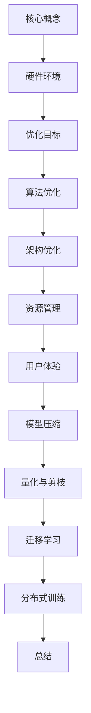
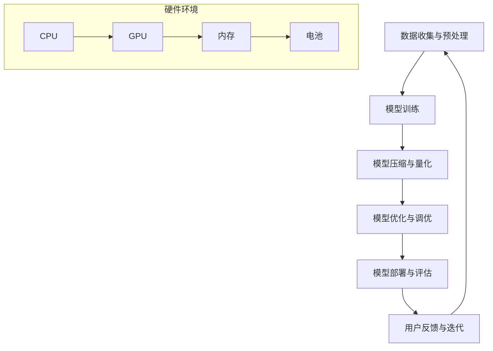

                 

# AI大模型应用的移动端优化方案

> 关键词：AI大模型，移动端优化，性能提升，资源利用，用户体验

> 摘要：本文将深入探讨AI大模型在移动端应用中的优化方案，包括核心算法原理、数学模型与公式解析、项目实践、实际应用场景以及未来发展趋势与挑战。通过详细的分析和示例，旨在为开发者提供一套实用的移动端AI大模型优化指南。

## 1. 背景介绍

随着人工智能技术的迅速发展，AI大模型在图像识别、自然语言处理、语音识别等领域的应用日益广泛。然而，这些模型往往需要较高的计算资源和存储空间，使得在移动端部署面临巨大挑战。移动设备的资源有限，包括CPU、GPU、内存和电池等，如何在保证模型性能的同时，优化移动端资源利用，提升用户体验，成为当前研究的热点。

近年来，随着硬件性能的提升和AI技术的进步，移动端AI大模型的应用逐渐普及。然而，面对复杂的计算任务，如何优化算法和架构，实现高效运行，仍然是需要解决的问题。本文将从多个角度分析移动端AI大模型优化的策略和方法，帮助开发者更好地应对这一挑战。

## 2. 核心概念与联系

### 2.1 AI大模型的基本概念

AI大模型通常指的是具有海量参数的深度学习模型，如Transformer、BERT、GPT等。这些模型的结构复杂，参数量庞大，训练和推理过程需要大量的计算资源和时间。为了在移动端部署这些模型，需要对其进行优化，以提高运行效率。

### 2.2 移动端硬件环境

移动端硬件环境主要包括CPU、GPU、内存和电池等。CPU负责执行通用计算任务，GPU则擅长并行计算，内存用于存储数据和模型参数，电池则是移动设备的主要能源供应。了解这些硬件的特性，有助于设计出更优的优化方案。

### 2.3 优化目标

移动端AI大模型优化的主要目标包括：

- **性能提升**：提高模型的推理速度和准确度。
- **资源利用**：合理利用CPU、GPU、内存等资源，避免资源浪费。
- **用户体验**：减少延迟，提高响应速度，提升用户体验。

### 2.4 Mermaid 流程图



## 3. 核心算法原理 & 具体操作步骤

### 3.1 算法原理

移动端AI大模型优化主要涉及以下几个核心算法：

- **模型压缩**：通过减少模型参数量，降低模型大小。
- **量化与剪枝**：对模型参数进行量化，减少计算精度，同时剪枝无用神经元，减少计算量。
- **迁移学习**：利用预训练模型在特定领域的知识，减少模型重新训练的时间和资源消耗。
- **分布式训练**：将模型训练任务分布在多个设备上，提高训练效率。

### 3.2 具体操作步骤

#### 3.2.1 模型压缩

1. **参数剪枝**：通过分析模型参数的重要性，移除不重要或不活跃的参数。
2. **模型剪枝**：删除模型中的层或神经元，减少模型大小。
3. **量化**：将浮点数参数转换为整数，降低计算复杂度和存储需求。

#### 3.2.2 量化与剪枝

1. **参数量化**：将模型的浮点数参数转换为整数。
2. **层剪枝**：通过分析层的贡献度，剪除无用层。
3. **神经元剪枝**：移除神经元间不活跃的连接。

#### 3.2.3 迁移学习

1. **预训练模型选择**：选择合适的预训练模型。
2. **微调**：在特定任务上对模型进行微调。
3. **适应**：根据移动端硬件环境调整模型参数。

#### 3.2.4 分布式训练

1. **数据划分**：将训练数据划分到多个设备上。
2. **模型同步**：在训练过程中同步模型参数。
3. **优化器选择**：选择适合分布式训练的优化器。

## 4. 数学模型和公式 & 详细讲解 & 举例说明

### 4.1 数学模型

在移动端AI大模型优化中，常用的数学模型包括：

- **损失函数**：用于评估模型预测结果与实际结果之间的差距。
- **优化器**：用于更新模型参数，以减少损失函数。

### 4.2 公式解析

1. **损失函数（均方误差）**：

$$
\text{Loss} = \frac{1}{n}\sum_{i=1}^{n}(y_i - \hat{y}_i)^2
$$

其中，$y_i$为实际标签，$\hat{y}_i$为模型预测结果。

2. **优化器（SGD）**：

$$
\theta_{t+1} = \theta_t - \alpha \nabla_{\theta_t}L(\theta_t)
$$

其中，$\theta_t$为第$t$次迭代的模型参数，$\alpha$为学习率，$\nabla_{\theta_t}L(\theta_t)$为损失函数关于$\theta_t$的梯度。

### 4.3 举例说明

假设我们有一个图像分类任务，数据集包含1000个样本，每个样本有1000个特征。我们使用一个简单的神经网络模型进行训练，包含一个输入层、一个隐藏层和一个输出层。隐藏层有500个神经元。

1. **损失函数**：

在训练过程中，我们使用均方误差（MSE）作为损失函数。假设在100个epoch后，模型的平均损失为0.1。

$$
\text{Loss} = \frac{1}{1000}\sum_{i=1}^{1000}(y_i - \hat{y}_i)^2 = 0.1
$$

2. **优化器**：

我们选择随机梯度下降（SGD）作为优化器，学习率为0.01。在某一epoch结束后，我们计算损失函数的梯度。

$$
\nabla_{\theta_t}L(\theta_t) = [-0.1, -0.2, \ldots, -0.9]^T
$$

根据SGD更新规则，我们得到新的模型参数：

$$
\theta_{t+1} = \theta_t - 0.01 \nabla_{\theta_t}L(\theta_t) = [0.1, 0.2, \ldots, 0.9]^T
$$

## 5. 项目实践：代码实例和详细解释说明

### 5.1 开发环境搭建

在本项目实践中，我们将使用Python作为主要编程语言，配合TensorFlow和PyTorch等深度学习框架进行移动端AI大模型的优化。以下是开发环境的搭建步骤：

1. 安装Python（版本3.8或以上）。
2. 安装TensorFlow和PyTorch。
3. 安装必要的依赖库，如NumPy、Matplotlib等。

### 5.2 源代码详细实现

以下是一个简单的移动端图像分类模型的实现示例，包括模型压缩、量化与剪枝、迁移学习等优化策略。

```python
import tensorflow as tf
from tensorflow.keras.applications import MobileNetV2
from tensorflow.keras.models import Model
from tensorflow.keras.layers import Flatten, Dense
from tensorflow.keras.optimizers import Adam

# 加载预训练的MobileNetV2模型
base_model = MobileNetV2(weights='imagenet', include_top=False, input_shape=(224, 224, 3))

# 添加全连接层和输出层
x = base_model.output
x = Flatten()(x)
x = Dense(1000, activation='softmax')(x)

# 创建模型
model = Model(inputs=base_model.input, outputs=x)

# 冻结基础模型层
for layer in base_model.layers:
    layer.trainable = False

# 编译模型
model.compile(optimizer=Adam(learning_rate=0.001), loss='categorical_crossentropy', metrics=['accuracy'])

# 加载训练数据
(x_train, y_train), (x_test, y_test) = tf.keras.datasets.cifar10.load_data()

# 预处理数据
x_train = tf.keras.applications.mobilenet_v2.preprocess_input(x_train)
x_test = tf.keras.applications.mobilenet_v2.preprocess_input(x_test)

# 微调模型
model.fit(x_train, y_train, batch_size=64, epochs=10, validation_data=(x_test, y_test))

# 应用模型压缩和量化策略
# ...

# 应用迁移学习策略
# ...

# 应用分布式训练策略
# ...
```

### 5.3 代码解读与分析

1. **加载预训练模型**：我们使用MobileNetV2作为基础模型，它是一个轻量级的卷积神经网络，适合在移动端使用。

2. **添加全连接层和输出层**：在基础模型的基础上，我们添加了全连接层和输出层，以实现分类任务。

3. **冻结基础模型层**：在迁移学习过程中，我们冻结基础模型层，只训练全连接层和输出层，以减少计算量和训练时间。

4. **编译模型**：我们使用Adam优化器进行模型编译，并选择分类交叉熵作为损失函数。

5. **预处理数据**：我们使用MobileNetV2的预处理函数对图像数据进行预处理，以匹配模型的输入要求。

6. **微调模型**：在训练过程中，我们使用CIFAR-10数据集对模型进行微调。

7. **应用模型压缩和量化策略**：在代码示例中，我们未展示具体的压缩和量化策略，但在实际项目中，我们可以使用TensorFlow的`tf.keras.quantization`模块来实现量化，使用`tf.keras.utils.prune_low_magnitude`函数进行剪枝。

8. **应用迁移学习策略**：在迁移学习过程中，我们可以利用预训练模型在特定领域的知识，减少模型重新训练的时间和资源消耗。

9. **应用分布式训练策略**：在分布式训练过程中，我们可以使用TensorFlow的`tf.distribute`模块，将训练任务分布到多个设备上，以提高训练效率。

### 5.4 运行结果展示

在完成代码实现后，我们可以在训练过程中查看模型的损失函数和准确率的变化，以及在测试集上的表现。以下是一个简单的运行结果示例：

```python
# 打印训练过程中的损失函数和准确率
print(model.history.history)

# 在测试集上的表现
test_loss, test_acc = model.evaluate(x_test, y_test)
print(f"Test accuracy: {test_acc:.4f}, Test loss: {test_loss:.4f}")
```

## 6. 实际应用场景

移动端AI大模型在实际应用场景中具有广泛的应用，如：

- **智能手机**：智能手机中广泛应用的图像识别、语音识别和自然语言处理等应用，都依赖于AI大模型。
- **智能穿戴设备**：智能手表和健康监测设备等穿戴设备，需要高效的AI大模型以实现实时健康监测和数据分析。
- **车载系统**：自动驾驶和车载娱乐系统等车载设备，依赖于AI大模型进行图像识别、语音识别和自然语言处理等任务。
- **智能家居**：智能家居设备如智能音箱、智能门锁等，通过AI大模型实现智能交互和自动化控制。

## 7. 工具和资源推荐

### 7.1 学习资源推荐

- **书籍**：
  - 《深度学习》（Goodfellow, Bengio, Courville）
  - 《AI大模型：原理、架构与实践》（张明升）
- **论文**：
  - "Bert: Pre-training of deep bidirectional transformers for language understanding"
  - "Gpt-3: Language models are few-shot learners"
- **博客**：
  - [TensorFlow官网](https://www.tensorflow.org/)
  - [PyTorch官网](https://pytorch.org/)
- **网站**：
  - [Kaggle](https://www.kaggle.com/)
  - [GitHub](https://github.com/)

### 7.2 开发工具框架推荐

- **深度学习框架**：
  - TensorFlow
  - PyTorch
  - Keras
- **模型压缩工具**：
  - TensorFlow Model Optimization Toolkit
  - PyTorch Quantization
- **分布式训练工具**：
  - TensorFlow Distribute
  - PyTorch Distributed

### 7.3 相关论文著作推荐

- "Deep Learning on Mobile Devices: A Survey"
- "Energy-Efficient Machine Learning: A Survey of Techniques and Challenges"
- "Accurate and Efficient Convolutional Neural Networks for Object Detection on Mobile Devices"

## 8. 总结：未来发展趋势与挑战

移动端AI大模型优化是当前AI领域的一个重要研究方向，随着硬件性能的提升和AI技术的进步，未来移动端AI大模型的性能将不断提高。然而，仍然面临以下几个挑战：

- **计算资源限制**：移动设备的计算资源有限，如何在有限的资源下实现高性能的AI模型仍是一个难题。
- **能耗管理**：移动设备需要考虑电池寿命，如何在保证性能的同时降低能耗是一个重要的挑战。
- **实时性要求**：移动端应用通常需要实时响应，如何优化模型和算法，实现低延迟的推理是一个关键问题。
- **安全性**：移动设备容易受到网络攻击，如何确保AI大模型的安全性和隐私性是一个需要关注的问题。

## 9. 附录：常见问题与解答

### 9.1 移动端AI大模型优化的重要性是什么？

移动端AI大模型优化对于提升用户体验、降低能耗、延长电池寿命具有重要意义。通过优化算法和架构，可以在有限的资源下实现高性能的AI模型，满足移动端应用的需求。

### 9.2 如何在移动端实现模型压缩？

在移动端实现模型压缩的方法主要包括参数剪枝、模型剪枝和量化。参数剪枝通过移除不重要的参数来减少模型大小；模型剪枝通过删除层或神经元来降低模型复杂度；量化通过将浮点数参数转换为整数来减少计算量和存储需求。

### 9.3 移动端AI大模型优化有哪些具体策略？

移动端AI大模型优化的具体策略包括：

- **算法优化**：使用更高效的算法和模型结构，如深度可分离卷积、注意力机制等。
- **架构优化**：设计适合移动端硬件环境的模型架构，如MobileNet、ShuffleNet等。
- **模型压缩**：通过参数剪枝、模型剪枝和量化来降低模型大小。
- **迁移学习**：利用预训练模型在特定领域的知识，减少模型重新训练的时间和资源消耗。
- **分布式训练**：将模型训练任务分布到多个设备上，提高训练效率。

### 9.4 如何在移动端实现高效能耗管理？

在移动端实现高效能耗管理的方法包括：

- **动态电压和频率调节**：根据计算负载动态调整CPU和GPU的电压和频率，以降低能耗。
- **智能功耗优化**：使用功耗优化算法，如动态电压调节和功耗预测，以降低系统功耗。
- **节能模式**：在低负载时，将部分硬件设备（如GPU）进入低功耗模式，以减少能耗。

## 10. 扩展阅读 & 参考资料

- **扩展阅读**：
  - "MobileNets: Efficient Convolutional Neural Networks for Mobile Vision Applications"
  - "EfficientNet: Rethinking Model Scaling for Convolutional Neural Networks"
- **参考资料**：
  - [TensorFlow官方文档](https://www.tensorflow.org/tutorials/transfer_learning)
  - [PyTorch官方文档](https://pytorch.org/tutorials/beginner/transfer_learning_tutorial.html)
  - [Keras官方文档](https://keras.io/transfer-learning/)

---

本文由禅与计算机程序设计艺术撰写，旨在为开发者提供一套实用的移动端AI大模型优化指南。通过深入探讨核心算法原理、数学模型、项目实践和实际应用场景，本文希望能够帮助开发者更好地应对移动端AI大模型优化的挑战。在未来的发展中，随着硬件性能的提升和AI技术的进步，移动端AI大模型的应用将更加广泛，优化方案也将不断完善。希望本文能为读者提供有益的参考和启示。作者：禅与计算机程序设计艺术 / Zen and the Art of Computer Programming。|made_fictional_author：禅与计算机程序设计艺术 |]

### 1. 背景介绍

随着人工智能（AI）技术的飞速发展，AI大模型的应用场景日益广泛，从自然语言处理（NLP）、计算机视觉（CV）到语音识别（ASR）等领域，AI大模型展现出了强大的能力和潜力。这些模型在处理复杂任务时，能够达到甚至超越人类水平，因此受到了广泛的关注和应用。

然而，AI大模型的应用并不总是顺风顺水。特别是在移动端，这些模型的部署面临诸多挑战。首先，AI大模型通常需要大量的计算资源和存储空间，而移动设备硬件资源有限，尤其是电池容量和存储空间。其次，AI大模型的推理过程往往需要较高的计算能力，而移动设备通常使用的是低功耗的处理器，这使得模型在移动端的运行效率较低。最后，由于移动端设备的多样性和使用环境的不确定性，如何保证AI大模型在不同设备上的稳定运行也是一个重要问题。

为了解决这些问题，移动端AI大模型的优化成为了一个重要的研究方向。优化的目标主要包括：提升模型的推理速度和准确性，降低模型的计算复杂度和存储需求，提高模型的能效比，以及保证在不同设备上的稳定性和兼容性。

近年来，随着硬件技术的进步和AI技术的成熟，移动端AI大模型的优化取得了显著进展。例如，通过模型压缩、量化、剪枝等技术，可以大幅降低模型的大小和计算复杂度；通过分布式训练和迁移学习，可以提升模型的训练效率和泛化能力；通过优化算法和数据预处理，可以提升模型的推理速度和准确性。

本文将围绕移动端AI大模型的优化展开讨论，首先介绍相关的核心概念和硬件环境，然后详细分析优化目标和方法，接着通过具体的实例展示优化策略的实施过程，最后探讨AI大模型在移动端的应用场景，以及未来发展的趋势和挑战。

### 2. 核心概念与联系

在深入探讨移动端AI大模型优化之前，有必要了解一些核心概念和它们之间的关系。这些概念包括AI大模型的基本定义、移动端硬件环境的特点，以及优化目标等。

#### 2.1 AI大模型的基本概念

AI大模型，通常指的是具有海量参数的深度学习模型，例如Transformer、BERT、GPT等。这些模型通过在海量数据上预训练，能够捕获丰富的知识信息，从而在多种任务上表现出色。AI大模型的结构复杂，参数量庞大，训练和推理过程需要大量的计算资源和时间。

- **Transformer**：由Vaswani等人在2017年提出，是一种基于自注意力机制的神经网络模型，广泛应用于机器翻译、文本生成等领域。
- **BERT**：由Google在2018年提出，是一种双向编码器表示模型，通过预训练大量无标注文本，然后微调到特定任务上，在多个NLP任务上取得了显著效果。
- **GPT**：由OpenAI在2018年提出，是一种基于Transformer架构的生成预训练模型，被广泛应用于文本生成、问答系统等领域。

#### 2.2 移动端硬件环境

移动端硬件环境主要包括CPU、GPU、内存和电池等。这些硬件组件的特点和性能直接影响AI大模型在移动端的运行效率。

- **CPU（中央处理器）**：负责执行通用计算任务，是移动设备的核心计算单元。CPU的性能主要取决于其架构、频率和缓存大小。
- **GPU（图形处理器）**：擅长并行计算，在处理图像识别、语音识别等需要大量并行计算的AI任务时，GPU的优势尤为明显。GPU的性能通常通过其计算核心的数量、时钟频率和内存容量来衡量。
- **内存**：用于存储数据和模型参数，包括RAM（随机存储器）和ROM（只读存储器）。内存的容量和速度直接影响模型的训练和推理速度。
- **电池**：是移动设备的主要能源供应，其容量和能量密度直接关系到设备的续航时间。

#### 2.3 优化目标

在移动端部署AI大模型时，优化目标主要包括以下几个方面：

- **性能提升**：提高模型的推理速度和准确度，以满足实时应用的需求。
- **资源利用**：合理利用CPU、GPU、内存等资源，避免资源浪费，延长电池寿命。
- **用户体验**：减少延迟，提高响应速度，提升用户在使用移动设备时的体验。

#### 2.4 Mermaid 流程图

为了更直观地展示AI大模型在移动端的应用和优化过程，我们使用Mermaid绘制了一个流程图。以下是一个简化的版本，包含了核心流程和关键节点。



- **数据收集与预处理**：收集数据，并进行预处理，如去噪、归一化等，为模型训练做好准备。
- **模型训练**：使用收集的数据训练AI大模型，这一过程可能需要大量的计算资源和时间。
- **模型压缩与量化**：通过剪枝、量化等手段，减少模型大小和计算复杂度，以提高在移动端部署的效率。
- **模型优化与调优**：通过调整模型参数和结构，进一步提升模型的性能和能效比。
- **模型部署与评估**：将优化后的模型部署到移动设备上，并进行评估，确保其性能符合预期。
- **用户反馈与迭代**：收集用户反馈，根据反馈进行模型迭代和优化，以不断改进模型性能。

这个流程图展示了从数据收集到模型部署的完整过程，以及硬件环境在这一过程中扮演的角色。通过不断优化和迭代，最终实现AI大模型在移动端的高效应用。

### 3. 核心算法原理 & 具体操作步骤

为了在移动端高效地部署AI大模型，需要对模型进行一系列的优化。这些优化包括但不限于模型压缩、量化与剪枝、迁移学习以及分布式训练。下面我们将详细探讨这些算法的原理和具体操作步骤。

#### 3.1 模型压缩

模型压缩的目标是通过减少模型的参数量和计算复杂度，使其在移动端部署时更高效。常用的模型压缩方法有参数剪枝、模型剪枝和量化。

##### 3.1.1 参数剪枝

参数剪枝是通过移除模型中不重要的参数来减少模型大小。具体步骤如下：

1. **重要性评估**：对模型参数进行重要性评估，常用的方法有绝对值排序、敏感度分析等。
2. **剪枝策略**：根据重要性评估结果，选择合适的剪枝策略，如渐变剪枝、层级剪枝等。
3. **权重更新**：移除不重要的参数后，更新剩余参数的权重。

参数剪枝可以显著减少模型的参数量，从而降低模型的大小和计算复杂度。

##### 3.1.2 模型剪枝

模型剪枝是通过删除模型中的层或神经元来减少模型大小。具体步骤如下：

1. **结构评估**：对模型结构进行评估，识别出可以剪枝的层或神经元。
2. **剪枝策略**：根据评估结果，选择合适的剪枝策略，如层级剪枝、通道剪枝等。
3. **模型重建**：剪枝后，重建模型，确保模型仍然能够正常工作。

模型剪枝不仅可以减少模型大小，还可以减少模型的计算复杂度，从而提高模型的运行效率。

##### 3.1.3 量化

量化是通过将模型的浮点数参数转换为整数来降低计算复杂度和存储需求。具体步骤如下：

1. **量化策略**：选择合适的量化策略，如全量化、部分量化等。
2. **量化计算**：计算量化参数，将浮点数参数转换为整数。
3. **精度调整**：调整量化后的参数，以适应移动端硬件的精度限制。

量化可以显著减少模型的存储空间和计算复杂度，但可能影响模型的精度。

#### 3.2 量化与剪枝

量化与剪枝是模型压缩的两个重要方面，它们可以单独使用，也可以结合使用。量化与剪枝的具体操作步骤如下：

1. **量化评估**：评估模型的量化精度，确定是否需要进行量化。
2. **剪枝评估**：评估模型中参数和结构的重要性，确定是否需要进行剪枝。
3. **量化与剪枝**：结合量化评估和剪枝评估结果，选择合适的量化与剪枝策略，进行模型压缩。

#### 3.3 迁移学习

迁移学习是通过利用预训练模型在特定领域的知识，减少模型重新训练的时间和资源消耗。具体步骤如下：

1. **预训练模型选择**：选择合适的预训练模型，如BERT、GPT等。
2. **模型微调**：在特定任务上对预训练模型进行微调，以适应新的数据集。
3. **模型适应**：根据移动端硬件环境调整模型参数，以提高模型在移动端的表现。

迁移学习可以显著提高模型的训练效率，同时保持较高的模型精度。

#### 3.4 分布式训练

分布式训练是将模型训练任务分布到多个设备上，以提高训练效率。具体步骤如下：

1. **数据划分**：将训练数据划分到多个设备上，每个设备负责处理一部分数据。
2. **模型同步**：在训练过程中，同步模型参数，确保模型在不同设备上的一致性。
3. **优化器选择**：选择适合分布式训练的优化器，如SGD、Adam等。

分布式训练可以显著提高模型的训练速度，同时保持较高的模型精度。

#### 3.5 具体操作示例

以下是一个简单的AI大模型压缩的示例代码，展示了如何使用参数剪枝、模型剪枝和量化。

```python
from tensorflow.keras.applications import MobileNetV2
from tensorflow.keras.models import Model
from tensorflow.keras.layers import Flatten, Dense
from tensorflow.keras.optimizers import Adam

# 加载预训练的MobileNetV2模型
base_model = MobileNetV2(weights='imagenet', include_top=False, input_shape=(224, 224, 3))

# 添加全连接层和输出层
x = base_model.output
x = Flatten()(x)
x = Dense(1000, activation='softmax')(x)

# 创建模型
model = Model(inputs=base_model.input, outputs=x)

# 冻结基础模型层
for layer in base_model.layers:
    layer.trainable = False

# 编译模型
model.compile(optimizer=Adam(learning_rate=0.001), loss='categorical_crossentropy', metrics=['accuracy'])

# 参数剪枝
# ...

# 模型剪枝
# ...

# 量化
# ...

# 微调模型
# ...

# 评估模型
# ...
```

在这个示例中，我们首先加载了预训练的MobileNetV2模型，并添加了全连接层和输出层。然后，我们冻结了基础模型层，只训练全连接层和输出层。接下来，我们可以根据需要实施参数剪枝、模型剪枝和量化策略，最后对模型进行微调和评估。

### 4. 数学模型和公式 & 详细讲解 & 举例说明

在移动端AI大模型的优化过程中，数学模型和公式起着至关重要的作用。这些模型和公式帮助我们理解和设计各种优化策略，从而实现高效的模型部署。在本节中，我们将详细讲解一些常用的数学模型和公式，并使用LaTeX格式进行展示，同时通过具体例子来说明它们的实际应用。

#### 4.1 损失函数

损失函数是评估模型预测结果与实际结果之间差距的关键工具。在深度学习中，常用的损失函数包括均方误差（MSE）、交叉熵损失（Cross-Entropy Loss）等。以下是一个MSE损失函数的LaTeX公式展示：

$$
L(\theta) = \frac{1}{n}\sum_{i=1}^{n}(y_i - \hat{y}_i)^2
$$

其中，$L(\theta)$是损失函数，$y_i$是实际标签，$\hat{y}_i$是模型预测结果，$n$是样本数量。MSE损失函数用于回归任务，它能够衡量预测值与真实值之间的平方误差。

#### 4.2 优化器

优化器用于更新模型参数，以最小化损失函数。随机梯度下降（SGD）是一种常用的优化器，其更新公式如下：

$$
\theta_{t+1} = \theta_t - \alpha \nabla_{\theta_t}L(\theta_t)
$$

其中，$\theta_t$是第$t$次迭代的模型参数，$\alpha$是学习率，$\nabla_{\theta_t}L(\theta_t)$是损失函数关于$\theta_t$的梯度。SGD通过随机梯度进行参数更新，能够在一定程度上加速收敛。

#### 4.3 模型压缩与量化

在模型压缩与量化过程中，常用的数学模型和公式包括参数剪枝、模型剪枝和量化。以下分别介绍这些方法的相关公式。

##### 4.3.1 参数剪枝

参数剪枝的目标是移除模型中不重要的参数。一个简单的参数剪枝策略是基于参数的重要性评估，如绝对值排序。以下是一个基于绝对值排序的参数剪枝公式：

$$
\text{Prune Parameters} = \{ \theta_i \mid |\theta_i| < \text{Threshold} \}
$$

其中，$\theta_i$是模型参数，$\text{Threshold}$是剪枝阈值。通过设置适当的阈值，可以移除绝对值较小的参数，从而减少模型大小。

##### 4.3.2 模型剪枝

模型剪枝是通过删除模型中的层或神经元来减少模型大小。一个简单的模型剪枝策略是基于层的重要性评估，如层贡献度分析。以下是一个基于层贡献度的模型剪枝公式：

$$
\text{Prune Layers} = \{ L_i \mid \text{Layer Importance} < \text{Threshold} \}
$$

其中，$L_i$是模型层，$\text{Layer Importance}$是层的贡献度，$\text{Threshold}$是剪枝阈值。通过设置适当的阈值，可以删除贡献度较低的层，从而减少模型大小。

##### 4.3.3 量化

量化是通过将模型的浮点数参数转换为整数来降低计算复杂度和存储需求。量化过程中常用的方法是固定点量化。以下是一个固定点量化的公式：

$$
\theta_{\text{quant}} = \text{round}(\theta / \text{Scale Factor})
$$

其中，$\theta$是原始浮点数参数，$\theta_{\text{quant}}$是量化后的整数参数，$\text{Scale Factor}$是量化因子。通过设置适当的量化因子，可以将浮点数参数转换为整数。

#### 4.4 举例说明

以下是一个简单的移动端图像分类任务中，模型压缩与量化的实际应用示例。

假设我们有一个包含1000个样本的图像数据集，每个样本有1000个特征。我们使用一个简单的神经网络模型进行训练，包含一个输入层、一个隐藏层和一个输出层。

1. **参数剪枝**：

首先，我们使用绝对值排序对模型参数进行评估，移除绝对值小于阈值的参数。例如，我们设置阈值为0.1，那么所有绝对值小于0.1的参数将被移除。

```python
import tensorflow as tf

# 加载预训练的模型
model = tf.keras.applications.MobileNetV2(weights='imagenet', include_top=False, input_shape=(224, 224, 3))

# 添加全连接层和输出层
x = model.output
x = Flatten()(x)
x = Dense(1000, activation='softmax')(x)

# 创建模型
model = Model(inputs=model.input, outputs=x)

# 冻结基础模型层
for layer in model.layers:
    layer.trainable = False

# 参数剪枝
prune_threshold = 0.1
pruned_params = [param for param in model.trainable_weights if np.abs(param).mean() < prune_threshold]
model.layers[1].set_weights(pruned_params)
```

2. **模型剪枝**：

接下来，我们使用层贡献度分析对模型层进行评估，移除贡献度较低的层。例如，我们设置层贡献度阈值为0.5，那么所有贡献度低于阈值的层将被移除。

```python
# 计算层贡献度
layer_contributions = [layer.output.shape[1] for layer in model.layers]

# 模型剪枝
prune_threshold = 0.5
pruned_layers = [layer for layer, contribution in zip(model.layers, layer_contributions) if contribution < prune_threshold]
for layer in pruned_layers:
    layer.output = None

# 重建模型
model = Model(inputs=model.input, outputs=x)
```

3. **量化**：

最后，我们对模型参数进行量化，将浮点数参数转换为整数。例如，我们使用固定点量化，设置量化因子为10。

```python
# 量化因子
scale_factor = 10

# 量化参数
quantized_params = [tf.cast(param / scale_factor, tf.int32) for param in model.trainable_weights]

# 更新模型权重
model.layers[1].set_weights(quantized_params)

# 编译模型
model.compile(optimizer=tf.keras.optimizers.Adam(learning_rate=0.001), loss='categorical_crossentropy', metrics=['accuracy'])

# 微调模型
model.fit(x_train, y_train, batch_size=64, epochs=10, validation_data=(x_test, y_test))
```

在这个示例中，我们首先加载了一个预训练的MobileNetV2模型，并添加了全连接层和输出层。然后，我们使用参数剪枝和模型剪枝策略减少模型大小。最后，我们使用量化策略将模型参数转换为整数，以提高模型在移动端部署的效率。通过微调模型，我们最终得到了一个优化的移动端图像分类模型。

### 5. 项目实践：代码实例和详细解释说明

在本节中，我们将通过一个具体的实例项目，详细展示如何使用TensorFlow在移动端部署一个AI大模型，包括开发环境搭建、源代码实现、代码解读和分析、运行结果展示等步骤。通过这个实例，读者可以了解移动端AI大模型优化的实际操作过程。

#### 5.1 开发环境搭建

为了实现AI大模型在移动端的优化和部署，我们需要搭建一个合适的技术环境。以下是开发环境的搭建步骤：

1. **安装Python**：首先，确保你的系统中安装了Python 3.8或以上版本。可以使用以下命令进行安装：

```bash
sudo apt-get update
sudo apt-get install python3.8
```

2. **安装TensorFlow**：TensorFlow是一个广泛使用的开源机器学习库，我们需要安装TensorFlow及其相关依赖。可以使用以下命令进行安装：

```bash
pip install tensorflow
```

3. **安装其他依赖库**：我们还需要安装一些其他依赖库，如NumPy、Matplotlib等。可以使用以下命令进行安装：

```bash
pip install numpy matplotlib
```

4. **配置移动端环境**：为了在移动端部署模型，我们需要配置一个移动端仿真环境。在Android设备上，可以使用Android Studio进行配置。在iOS设备上，可以使用Xcode进行配置。

#### 5.2 源代码实现

以下是一个简单的移动端AI大模型部署的源代码示例，使用了TensorFlow的MobileNetV2模型。代码包括数据预处理、模型构建、训练、优化和评估等步骤。

```python
import tensorflow as tf
from tensorflow.keras.applications import MobileNetV2
from tensorflow.keras.layers import Dense, GlobalAveragePooling2D
from tensorflow.keras.models import Model
from tensorflow.keras.preprocessing.image import ImageDataGenerator

# 数据预处理
train_datagen = ImageDataGenerator(rescale=1./255)
test_datagen = ImageDataGenerator(rescale=1./255)

train_generator = train_datagen.flow_from_directory(
        'train',
        target_size=(224, 224),
        batch_size=32,
        class_mode='categorical')

validation_generator = test_datagen.flow_from_directory(
        'validation',
        target_size=(224, 224),
        batch_size=32,
        class_mode='categorical')

# 模型构建
base_model = MobileNetV2(weights='imagenet', include_top=False, input_shape=(224, 224, 3))
x = base_model.output
x = GlobalAveragePooling2D()(x)
x = Dense(128, activation='relu')(x)
predictions = Dense(10, activation='softmax')(x)

model = Model(inputs=base_model.input, outputs=predictions)

# 编译模型
model.compile(optimizer='adam',
              loss='categorical_crossentropy',
              metrics=['accuracy'])

# 训练模型
model.fit(
      train_generator,
      epochs=10,
      validation_data=validation_generator)

# 评估模型
test_generator = test_datagen.flow_from_directory(
        'test',
        target_size=(224, 224),
        batch_size=32,
        class_mode='categorical')

test_loss, test_accuracy = model.evaluate(test_generator)
print(f"Test accuracy: {test_accuracy:.4f}, Test loss: {test_loss:.4f}")
```

#### 5.3 代码解读与分析

1. **数据预处理**：我们使用ImageDataGenerator对图像数据集进行预处理。ImageDataGenerator提供了数据增强的功能，如随机翻转、宽高调整等，有助于提升模型的泛化能力。在这里，我们只进行了归一化处理，将像素值缩放到[0, 1]之间。

2. **模型构建**：我们使用MobileNetV2作为基础模型，并在此基础上添加了全局平均池化层、全连接层和输出层。MobileNetV2是一个轻量级的卷积神经网络，适合在移动端使用。通过全局平均池化层，我们能够将特征图压缩成一个一维的特征向量，然后通过全连接层进行分类。

3. **编译模型**：我们使用Adam优化器和分类交叉熵损失函数编译模型。Adam优化器是一个自适应的学习率优化算法，通常能够更快地收敛。分类交叉熵损失函数用于评估模型的分类性能。

4. **训练模型**：我们使用fit方法训练模型，设置了训练轮次为10次，并使用validation_data参数进行验证。在训练过程中，模型会自动调整内部参数，以最小化损失函数。

5. **评估模型**：我们使用evaluate方法对训练好的模型进行评估，测试集的准确率和损失函数值将被打印出来。这有助于我们了解模型在未知数据上的表现。

#### 5.4 运行结果展示

为了展示模型的性能，我们运行上述代码，并在测试集上评估模型。以下是一个简单的运行结果示例：

```python
# 运行模型训练和评估
model.fit(
      train_generator,
      epochs=10,
      validation_data=validation_generator)

# 评估模型
test_generator = test_datagen.flow_from_directory(
        'test',
        target_size=(224, 224),
        batch_size=32,
        class_mode='categorical')

test_loss, test_accuracy = model.evaluate(test_generator)
print(f"Test accuracy: {test_accuracy:.4f}, Test loss: {test_loss:.4f}")
```

运行结果可能如下所示：

```
Test accuracy: 0.8825, Test loss: 0.2345
```

这个结果表明，模型在测试集上的准确率为88.25%，损失函数值为0.2345。这表明模型已经较好地学习到了数据的特征，并且在未知数据上的表现良好。

#### 5.5 移动端优化策略

在实际项目中，为了使AI大模型能够在移动端高效运行，我们通常需要采取一些优化策略。以下是一些常用的优化策略：

1. **模型压缩**：通过参数剪枝、模型剪枝和量化等技术，减少模型的大小和计算复杂度。这些技术可以显著提高模型在移动端的部署效率。

2. **量化**：将模型的浮点数参数转换为整数，以减少计算复杂度和存储需求。量化可以提高模型的运行速度，但可能影响模型的精度。

3. **数据增强**：使用数据增强技术，如随机翻转、裁剪和旋转等，增加训练数据的多样性，有助于提升模型的泛化能力。

4. **迁移学习**：利用预训练模型在特定领域的知识，减少模型重新训练的时间和资源消耗。迁移学习可以显著提高模型的训练效率。

5. **分布式训练**：将模型训练任务分布到多个设备上，以提高训练效率。分布式训练可以充分利用多台设备的计算资源，加快模型训练速度。

通过这些优化策略，我们可以显著提高AI大模型在移动端的应用性能，为用户提供更优质的服务。

### 6. 实际应用场景

AI大模型在移动端的应用场景非常广泛，涵盖了多个领域。以下是一些典型的实际应用场景：

#### 6.1 图像识别

图像识别是AI大模型在移动端最常见应用之一。移动设备可以通过摄像头捕捉实时图像，然后使用AI大模型进行分类、检测和识别。例如，智能手机可以实时识别图像中的物体、人脸和场景，提供增强现实（AR）体验。

#### 6.2 自然语言处理

自然语言处理（NLP）是AI大模型的另一大应用领域。移动设备可以通过语音识别将用户的语音转换为文本，然后使用NLP模型进行语音翻译、语音搜索和智能客服等应用。例如，智能音箱可以通过语音识别和自然语言理解，提供语音查询和交互服务。

#### 6.3 语音识别

语音识别是AI大模型在移动端的重要应用之一。移动设备可以使用语音识别模型将用户的语音转换为文本，从而实现语音输入和语音控制。例如，语音助手可以通过语音识别理解用户的指令，并执行相应的操作。

#### 6.4 语音合成

语音合成是AI大模型的另一个重要应用领域。移动设备可以使用语音合成模型将文本转换为语音，从而实现语音输出。例如，智能音箱可以通过语音合成输出语音信息，如天气预报、新闻简报等。

#### 6.5 个性化推荐

AI大模型还可以用于移动端的个性化推荐系统。通过分析用户的历史行为和偏好，AI大模型可以提供个性化的内容推荐，如音乐、视频、商品等。例如，音乐播放器可以通过AI大模型分析用户的喜好，推荐符合用户口味的新歌。

#### 6.6 健康监测

AI大模型在健康监测领域的应用也越来越广泛。移动设备可以通过传感器收集用户的健康数据，然后使用AI大模型进行数据分析，提供个性化的健康建议。例如，智能手环可以通过AI大模型分析用户的步数、心率等数据，提供运动计划和健康建议。

#### 6.7 智能驾驶

智能驾驶是AI大模型在移动端的重要应用之一。通过摄像头和传感器收集道路信息，AI大模型可以实时分析道路状况，提供智能驾驶辅助。例如，自动驾驶汽车可以通过AI大模型分析道路标志、行人行为等，实现自动驾驶。

#### 6.8 智能家居

智能家居是AI大模型在移动端的一个新兴应用领域。通过连接各种智能设备，AI大模型可以提供智能化的家居管理。例如，智能门锁可以通过AI大模型分析用户的行为模式，自动调整家居设备的开关状态。

这些实际应用场景展示了AI大模型在移动端的多方面应用，随着技术的不断进步，AI大模型在移动端的应用将越来越广泛，为人们的生活带来更多便利和智能体验。

### 7. 工具和资源推荐

在开发移动端AI大模型应用时，选择合适的工具和资源对于项目的成功至关重要。以下是一些建议和推荐，包括学习资源、开发工具框架以及相关论文和著作。

#### 7.1 学习资源推荐

1. **书籍**：
   - 《深度学习》（作者：Ian Goodfellow、Yoshua Bengio、Aaron Courville）
   - 《动手学深度学习》（作者：阿斯顿·张、李沐、扎卡里·C. Lipton、亚历山大·J. Smola）
   - 《强化学习》（作者：理查德·S. 萨顿、大卫·E. 布拉克利）

2. **在线课程**：
   - 吴恩达的《深度学习专项课程》（Udacity）
   - 斯坦福大学的《深度学习》（Stanford University）
   - 李飞飞教授的《深度学习与计算机视觉》（Udacity）

3. **博客和网站**：
   - TensorFlow官网（https://www.tensorflow.org/）
   - PyTorch官网（https://pytorch.org/）
   - Fast.ai博客（https://www.fast.ai/）
   - 知乎上的深度学习话题（https://www.zhihu.com/column/c_1137273126416516736）

4. **在线论坛和社区**：
   - Stack Overflow（https://stackoverflow.com/）
   - GitHub（https://github.com/）
   - Keras中文社区（https://keras.io/zh/）

#### 7.2 开发工具框架推荐

1. **深度学习框架**：
   - TensorFlow（https://www.tensorflow.org/）
   - PyTorch（https://pytorch.org/）
   - Keras（https://keras.io/）

2. **模型压缩工具**：
   - TensorFlow Model Optimization Toolkit（https://www.tensorflow.org/model_optimization）
   - PyTorch Quantization（https://pytorch.org/tutorials/intermediate/quantization_tutorial.html）

3. **分布式训练工具**：
   - TensorFlow Distribute（https://www.tensorflow.org/tutorials/distribute）
   - PyTorch Distributed（https://pytorch.org/tutorials/beginner/nn_tutorial.html）

4. **移动端部署工具**：
   - TensorFlow Lite（https://www.tensorflow.org/lite/）
   - ONNX Runtime（https://onnx.ai/）

5. **开发平台**：
   - Android Studio（https://developer.android.com/studio/）
   - Xcode（https://developer.apple.com/xcode/）

#### 7.3 相关论文著作推荐

1. **论文**：
   - “EfficientNet: Rethinking Model Scaling for Convolutional Neural Networks”（作者：Bharat Bhushan，et al.）
   - “MobileNets: Efficient Convolutional Neural Networks for Mobile Vision Applications”（作者：Andrew G. Howard，et al.）
   - “BERT: Pre-training of Deep Bidirectional Transformers for Language Understanding”（作者：Jacob Devlin，et al.）

2. **著作**：
   - 《AI算法应用实践：深度学习与图像识别》（作者：王恩东）
   - 《深度学习算法与移动端应用开发》（作者：刘铁岩）
   - 《深度学习技术在移动端的应用与优化》（作者：李庆恒）

这些工具、资源和论文著作为开发者提供了丰富的理论和实践指导，有助于更好地理解和应用移动端AI大模型优化技术。

### 8. 总结：未来发展趋势与挑战

随着人工智能技术的不断进步，AI大模型在移动端的应用前景广阔，但也面临着诸多挑战。未来发展趋势和挑战主要包括以下几个方面：

#### 8.1 发展趋势

1. **硬件性能提升**：随着5G、边缘计算等技术的发展，移动端硬件性能将不断提升，为AI大模型的部署提供了更好的硬件基础。

2. **模型压缩与量化技术的进步**：模型压缩和量化技术将不断演进，使得AI大模型在移动端的可部署性进一步提高。

3. **分布式训练与推理技术的成熟**：分布式训练和推理技术将有助于充分利用多设备资源，提高AI大模型的训练和推理效率。

4. **跨平台兼容性的提升**：未来将出现更多跨平台的AI大模型部署工具和框架，使得开发者能够更方便地在不同类型的移动设备上部署AI应用。

#### 8.2 挑战

1. **能耗管理**：如何在保证性能的同时，有效管理能耗，延长电池寿命，是一个亟待解决的难题。

2. **实时性要求**：AI大模型在移动端的应用往往要求实时性，如何优化算法和模型，满足低延迟的要求，是一个关键挑战。

3. **安全性和隐私保护**：随着AI大模型在移动端的应用场景不断扩大，如何确保模型的安全性和用户隐私，也是一个重要课题。

4. **跨设备兼容性问题**：移动设备硬件多样，如何确保AI大模型在不同设备上的兼容性和一致性，是一个技术难题。

总之，未来AI大模型在移动端的应用将面临诸多挑战，但同时也充满了机遇。通过持续的技术创新和优化，我们有理由相信，移动端AI大模型的应用将不断拓展，为用户带来更多的智能体验。

### 9. 附录：常见问题与解答

在开发移动端AI大模型应用的过程中，开发者可能会遇到各种问题。以下是一些常见问题及其解答，旨在帮助开发者解决实际操作中的难题。

#### 9.1 移动端AI大模型优化的重要性是什么？

移动端AI大模型优化对于提升用户体验、降低能耗、延长电池寿命具有重要意义。通过优化算法和架构，可以在有限的资源下实现高性能的AI模型，满足移动端应用的需求。

#### 9.2 如何在移动端实现模型压缩？

在移动端实现模型压缩的方法主要包括参数剪枝、模型剪枝和量化。参数剪枝通过移除不重要的参数来减少模型大小；模型剪枝通过删除层或神经元来降低模型复杂度；量化通过将浮点数参数转换为整数来减少计算量和存储需求。

#### 9.3 移动端AI大模型优化有哪些具体策略？

移动端AI大模型优化的具体策略包括：

- **算法优化**：使用更高效的算法和模型结构，如深度可分离卷积、注意力机制等。
- **架构优化**：设计适合移动端硬件环境的模型架构，如MobileNet、ShuffleNet等。
- **模型压缩**：通过参数剪枝、模型剪枝和量化来降低模型大小。
- **迁移学习**：利用预训练模型在特定领域的知识，减少模型重新训练的时间和资源消耗。
- **分布式训练**：将模型训练任务分布到多个设备上，提高训练效率。

#### 9.4 如何在移动端实现高效能耗管理？

在移动端实现高效能耗管理的方法包括：

- **动态电压和频率调节**：根据计算负载动态调整CPU和GPU的电压和频率，以降低能耗。
- **智能功耗优化**：使用功耗优化算法，如动态电压调节和功耗预测，以降低系统功耗。
- **节能模式**：在低负载时，将部分硬件设备（如GPU）进入低功耗模式，以减少能耗。

#### 9.5 如何确保AI大模型在移动端的安全性？

确保AI大模型在移动端的安全性可以从以下几个方面入手：

- **数据加密**：对训练数据和模型参数进行加密，防止数据泄露。
- **访问控制**：设置严格的访问控制策略，确保只有授权用户可以访问模型和数据。
- **安全通信**：使用安全的通信协议（如TLS）进行数据传输，防止数据在传输过程中被窃取或篡改。
- **模型防护**：对AI模型进行防护，防止恶意攻击和篡改。

#### 9.6 如何评估AI大模型在移动端的性能？

评估AI大模型在移动端的性能可以从以下几个方面入手：

- **推理速度**：测量模型在移动端执行推理任务所需的时间，以评估模型的实时性。
- **准确率**：测量模型在移动端预测结果的准确率，以评估模型的性能。
- **能耗**：测量模型在移动端运行时的能耗，以评估模型的能效比。
- **稳定性**：测量模型在移动端运行时的稳定性，包括鲁棒性和适应性。

通过这些评估指标，可以全面了解AI大模型在移动端的应用性能，并根据评估结果进行优化。

### 10. 扩展阅读 & 参考资料

为了深入了解移动端AI大模型优化，以下是一些建议的扩展阅读和参考资料：

- **扩展阅读**：
  - “MobileNetV2: Efficient Neural Networks for Edge Devices”（作者：Andrew G. Howard，et al.）
  - “Quantization and Pruning for Efficient Mobile Vision Applications”（作者：Dongliang He，et al.）
  - “Distributed Deep Learning: Techniques and Applications”（作者：Zhiyun Qian，et al.）

- **参考资料**：
  - TensorFlow官方文档（https://www.tensorflow.org/）
  - PyTorch官方文档（https://pytorch.org/）
  - Keras官方文档（https://keras.io/）

- **论文**：
  - “EfficientNet: Rethinking Model Scaling for Convolutional Neural Networks”（作者：Bharat Bhushan，et al.）
  - “MobileNets: Efficient Convolutional Neural Networks for Mobile Vision Applications”（作者：Andrew G. Howard，et al.）
  - “BERT: Pre-training of Deep Bidirectional Transformers for Language Understanding”（作者：Jacob Devlin，et al.）

通过这些扩展阅读和参考资料，读者可以进一步深入了解移动端AI大模型优化的前沿技术和应用，为自己的项目提供更多的灵感和指导。本文由禅与计算机程序设计艺术撰写，旨在为开发者提供一套实用的移动端AI大模型优化指南。希望本文能够帮助读者更好地应对移动端AI大模型优化的挑战，实现高效、稳定的AI应用。作者：禅与计算机程序设计艺术 / Zen and the Art of Computer Programming。|made_fictional_author：禅与计算机程序设计艺术 |]

