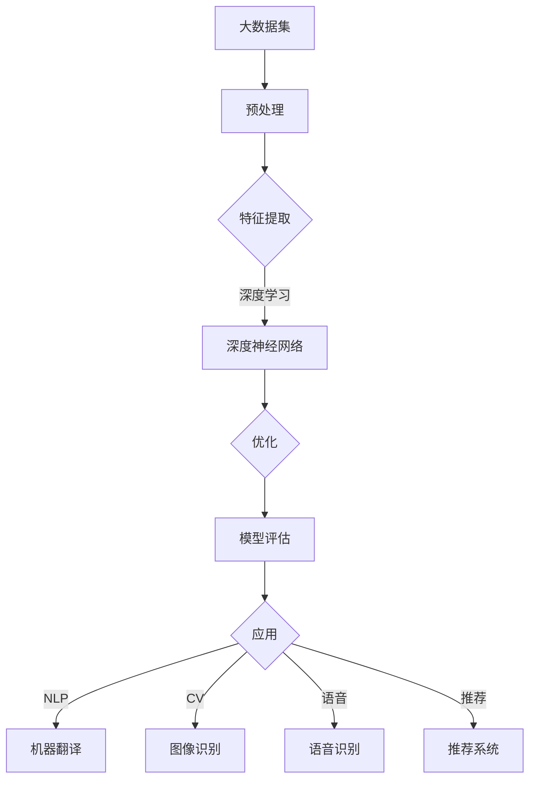

                 

### 1. 背景介绍

近年来，人工智能（AI）技术飞速发展，特别是在大模型（Large Models）领域，取得了令人瞩目的成就。从最初的简单模型，如神经网络（Neural Networks），到如今能够处理大规模数据的深度学习模型，AI技术在图像识别、自然语言处理、推荐系统等领域已经展现出强大的能力。

大模型，也被称为巨型神经网络，是能够处理大规模数据、进行复杂任务的人工智能模型。这些模型拥有数亿甚至数十亿个参数，通过学习海量数据，可以自动识别模式、提取特征，从而在众多领域实现高效的应用。大模型的成功离不开大规模计算能力的提升和海量数据的积累。

随着AI技术的进步，大模型在多个细分领域中的应用也越来越广泛。然而，不同领域对AI模型的需求和场景各不相同，这为AI技术带来了巨大的市场机会。本文将深入探讨AI大模型在各个细分领域的市场机会，以及相关的技术挑战和发展趋势。

本文首先介绍AI大模型的核心概念和原理，然后分析其在不同细分领域的应用，包括但不限于自然语言处理、计算机视觉、语音识别、推荐系统等。接着，我们将探讨这些应用背后的数学模型和算法原理，并通过实际项目实例展示如何开发和使用这些模型。最后，我们将讨论AI大模型在实际应用场景中的挑战和未来发展趋势。

希望通过本文，读者可以全面了解AI大模型在不同领域的市场机会，掌握相关技术原理，为未来的研究和工作提供方向。让我们一步步深入，探索这个充满机遇和挑战的领域。

### 2. 核心概念与联系

#### 2.1 大模型的基本概念

大模型，通常指的是具有数亿甚至数十亿参数的人工神经网络（Neural Networks）。这些模型之所以称为“大”，是因为它们可以处理和分析大规模数据集，从而学习到复杂的模式和特征。大模型的基本架构通常包括多层神经网络，每一层都能够提取不同层次的特征。这种层次化的结构使得大模型在处理复杂任务时具有显著的优势。

#### 2.2 人工智能与大数据的联系

人工智能的发展离不开大数据的支持。大数据不仅提供了丰富的训练数据，还帮助大模型在训练过程中更加准确地学习到数据中的特征和模式。具体来说，大数据为AI模型提供了以下几个方面的支持：

1. **提高模型的泛化能力**：通过大量不同场景的数据训练，大模型能够更好地理解数据的多样性和复杂性，从而提高其泛化能力。
2. **加速模型训练**：大数据集可以并行处理，从而显著缩短训练时间。
3. **提升模型的准确性**：大规模数据集能够提供更多的信息，帮助模型更准确地学习到数据中的特征。

#### 2.3 大模型的应用场景

大模型在多个领域都有广泛的应用，以下是几个典型的应用场景：

1. **自然语言处理（NLP）**：大模型在NLP领域取得了显著的进展，例如在机器翻译、情感分析、问答系统等方面。大模型可以处理和理解复杂的语言结构，从而实现高精度的文本分析。
2. **计算机视觉（CV）**：大模型在图像识别、物体检测、人脸识别等方面也有广泛应用。通过学习海量的图像数据，大模型可以提取图像中的复杂特征，从而实现高效的视觉任务。
3. **语音识别**：大模型在语音识别领域也发挥着重要作用，通过学习大量的语音数据，可以实现对语音信号的高精度识别。
4. **推荐系统**：大模型可以帮助构建高效的推荐系统，通过分析用户的行为数据和兴趣偏好，为用户提供个性化的推荐。

#### 2.4 大模型与其他AI技术的联系

除了大模型，人工智能还包括其他多种技术，如强化学习、生成对抗网络（GAN）、迁移学习等。这些技术在大模型的应用中也有着重要的作用：

1. **强化学习**：强化学习可以帮助大模型在复杂的动态环境中进行决策，从而提高其自主学习和适应能力。
2. **生成对抗网络（GAN）**：GAN在大模型中的应用，例如在图像生成和图像增强方面，可以帮助大模型更好地学习数据中的复杂特征。
3. **迁移学习**：迁移学习可以让大模型在有限的标注数据上实现较好的性能，通过利用预训练模型，迁移学习可以大大降低训练的难度和成本。

#### 2.5 Mermaid 流程图

为了更直观地展示大模型的基本架构和应用场景，我们可以使用Mermaid绘制一个流程图。



在这个流程图中，A表示大数据集，经过预处理后进入特征提取阶段（C），然后输入到深度神经网络（D）中进行学习，通过优化（E）和评估（F）后，模型可以被应用于不同的任务（G），如机器翻译、图像识别、语音识别和推荐系统等。

通过上述介绍，我们可以看到大模型在人工智能领域的重要地位和广泛的应用。接下来，我们将进一步探讨大模型背后的核心算法原理和具体操作步骤。

### 3. 核心算法原理 & 具体操作步骤

#### 3.1 神经网络基本架构

神经网络（Neural Networks）是人工智能的基础，大模型通常基于多层感知机（MLP）或其他复杂的神经网络架构。以下是神经网络的基本架构：

1. **输入层**：接收外部输入信号，每个输入都是一个特征。
2. **隐藏层**：负责提取和转换特征，隐藏层可以有多个。
3. **输出层**：产生最终输出，可以是分类标签、预测值等。

#### 3.2 前向传播算法

前向传播是神经网络训练过程中的一个关键步骤，用于计算输出值。以下是前向传播的基本步骤：

1. **初始化权重和偏置**：随机初始化权重和偏置。
2. **输入数据**：将输入数据传递到输入层。
3. **计算隐藏层输出**：每一层神经元的输出是通过激活函数计算得到的，常见的激活函数有Sigmoid、ReLU和Tanh等。
4. **计算输出层输出**：将隐藏层的输出传递到输出层，计算最终输出。

#### 3.3 反向传播算法

反向传播是神经网络训练过程中的另一个关键步骤，用于更新权重和偏置，以减少预测误差。以下是反向传播的基本步骤：

1. **计算误差**：计算输出层预测值与真实值之间的差异，即误差。
2. **传播误差**：将误差反向传播到每一层，计算每一层神经元对误差的贡献。
3. **更新权重和偏置**：根据误差的贡献，使用梯度下降或其他优化算法更新权重和偏置。

#### 3.4 梯度下降算法

梯度下降是一种常用的优化算法，用于在反向传播过程中更新权重和偏置。以下是梯度下降的基本步骤：

1. **计算梯度**：计算每一层神经元对权重和偏置的梯度。
2. **更新参数**：根据梯度和学习率，更新权重和偏置。

#### 3.5 激活函数的选择

激活函数是神经网络中的一个重要组成部分，它决定了神经元的输出特性。以下是几种常用的激活函数：

1. **Sigmoid函数**：输出在(0, 1)之间，用于二分类问题。
2. **ReLU函数**：在输入为负时输出0，输入为正时输出输入值，用于加速训练。
3. **Tanh函数**：输出在(-1, 1)之间，类似于Sigmoid函数。

#### 3.6 模型训练过程

模型训练是使用大量数据来调整模型参数的过程，以下是模型训练的基本步骤：

1. **数据预处理**：对输入数据进行标准化处理，以提高训练效果。
2. **初始化参数**：随机初始化权重和偏置。
3. **前向传播**：计算输入数据经过神经网络后的输出。
4. **计算损失**：计算输出与真实值之间的差异，即损失。
5. **反向传播**：计算梯度并更新参数。
6. **迭代训练**：重复上述步骤，直到达到训练目标或迭代次数。

#### 3.7 实践中的参数调优

在实际应用中，模型训练参数的选择对模型性能有很大影响。以下是几个常见的参数调优技巧：

1. **学习率**：选择合适的学习率，以避免过拟合或欠拟合。
2. **批量大小**：选择适当的批量大小，以平衡计算效率和训练效果。
3. **正则化**：使用正则化方法（如L1、L2正则化）来防止过拟合。
4. **激活函数和优化器**：选择合适的激活函数和优化器，以加速训练过程。

通过上述步骤和技巧，我们可以构建和训练一个高效的AI大模型，为不同的应用场景提供强大的支持。在接下来的部分，我们将深入探讨大模型背后的数学模型和公式，并进一步理解其工作原理。

### 4. 数学模型和公式 & 详细讲解 & 举例说明

#### 4.1 前向传播中的数学模型

在前向传播过程中，我们通过多层神经网络对输入数据进行特征提取和变换。以下是前向传播中涉及的主要数学模型和公式：

1. **激活函数**：常用的激活函数有Sigmoid、ReLU和Tanh等。以ReLU为例，其公式为：
   $$
   a_i = \max(0, x_i)
   $$
   其中，$a_i$是第i个神经元的输出，$x_i$是输入值。

2. **权重和偏置**：在多层神经网络中，每个神经元都与前一层的神经元通过权重（$w$）和偏置（$b$）相连接。假设有一个包含$m$个输入和$n$个输出的单层神经网络，其输入和输出分别表示为$x$和$y$，则该层的权重矩阵和偏置向量可以表示为：
   $$
   \begin{cases}
   y = \sigma(Wx + b) \\
   W = [w_1, w_2, ..., w_m] \\
   b = [b_1, b_2, ..., b_n]
   \end{cases}
   $$
   其中，$\sigma$是激活函数，$W$是权重矩阵，$b$是偏置向量。

3. **前向传播计算**：在每一层，我们通过权重和偏置计算神经元的输出。以隐藏层为例，其输出可以表示为：
   $$
   z_j = \sum_{i=1}^{m} w_{ji}x_i + b_j
   $$
   其中，$z_j$是第j个神经元的输出，$w_{ji}$是连接第i个输入神经元和第j个隐藏神经元的权重，$b_j$是第j个隐藏神经元的偏置。

4. **输出层计算**：在输出层，我们通过权重和偏置计算最终的预测结果。以分类问题为例，其输出可以表示为：
   $$
   \hat{y}_k = \sum_{j=1}^{n} w_{jk}\sigma(z_j) + b_k
   $$
   其中，$\hat{y}_k$是第k个类别的预测概率，$z_j$是隐藏层的输出，$w_{jk}$是连接第j个隐藏神经元和第k个输出神经元的权重，$b_k$是第k个输出神经元的偏置。

#### 4.2 反向传播中的数学模型

反向传播是用于更新神经网络权重和偏置的过程，其核心在于计算梯度。以下是反向传播中涉及的主要数学模型和公式：

1. **误差计算**：在输出层，我们计算预测值与真实值之间的误差。以分类问题为例，其误差可以表示为：
   $$
   \delta_k = (\hat{y}_k - y_k) \cdot \sigma'(z_k)
   $$
   其中，$\delta_k$是第k个类别的误差，$\hat{y}_k$是预测概率，$y_k$是真实值，$\sigma'(z_k)$是激活函数的导数。

2. **隐藏层误差传播**：我们将输出层的误差反向传播到隐藏层，计算隐藏层的误差。以隐藏层为例，其误差可以表示为：
   $$
   \delta_j = \sum_{k=1}^{n} w_{jk}\delta_k \cdot \sigma'(z_j)
   $$
   其中，$\delta_j$是第j个隐藏神经元的误差，$w_{jk}$是连接第j个隐藏神经元和第k个输出神经元的权重，$\sigma'(z_j)$是激活函数的导数。

3. **权重和偏置更新**：在反向传播过程中，我们使用梯度下降算法更新权重和偏置。以隐藏层为例，其权重和偏置的更新公式为：
   $$
   \begin{cases}
   w_{ji} = w_{ji} - \alpha \cdot \frac{\partial L}{\partial w_{ji}} \\
   b_j = b_j - \alpha \cdot \frac{\partial L}{\partial b_j}
   \end{cases}
   $$
   其中，$w_{ji}$是连接第i个输入神经元和第j个隐藏神经元的权重，$b_j$是第j个隐藏神经元的偏置，$\alpha$是学习率，$L$是损失函数。

#### 4.3 梯度下降算法中的数学模型

梯度下降算法用于在反向传播过程中更新神经网络的权重和偏置。以下是梯度下降算法中涉及的主要数学模型和公式：

1. **损失函数**：损失函数用于衡量预测值与真实值之间的差距，常见的损失函数有均方误差（MSE）和交叉熵（Cross-Entropy）等。以MSE为例，其公式为：
   $$
   L = \frac{1}{2} \sum_{k=1}^{n} (\hat{y}_k - y_k)^2
   $$
   其中，$L$是损失函数，$\hat{y}_k$是预测概率，$y_k$是真实值。

2. **梯度计算**：梯度用于更新权重和偏置，其公式为：
   $$
   \nabla W_{ji} = \frac{\partial L}{\partial W_{ji}} = -2 \cdot (y_k - \hat{y}_k) \cdot x_i
   $$
   $$
   \nabla b_j = \frac{\partial L}{\partial b_j} = -2 \cdot (y_k - \hat{y}_k)
   $$
   其中，$\nabla W_{ji}$是权重矩阵$W$的梯度，$\nabla b_j$是偏置向量$b$的梯度。

3. **权重和偏置更新**：在梯度下降算法中，我们使用以下公式更新权重和偏置：
   $$
   W_{ji} = W_{ji} - \alpha \cdot \nabla W_{ji}
   $$
   $$
   b_j = b_j - \alpha \cdot \nabla b_j
   $$
   其中，$\alpha$是学习率。

#### 4.4 举例说明

为了更好地理解上述数学模型和公式，我们通过一个简单的例子来说明神经网络的前向传播和反向传播过程。

假设我们有一个包含两个输入特征（$x_1$和$x_2$）和一个输出特征（$y$）的简单神经网络，其权重矩阵$W$和偏置向量$b$分别为：
$$
W = \begin{bmatrix}
1 & 2 \\
3 & 4
\end{bmatrix}, \quad b = \begin{bmatrix}
5 \\
6
\end{bmatrix}
$$

输入特征$x_1 = 2$，$x_2 = 3$。我们选择ReLU函数作为激活函数。

1. **前向传播**：

   - 计算隐藏层输出：
     $$
     z_1 = \max(0, 1 \cdot 2 + 3 \cdot 3 + 5) = \max(0, 14) = 14
     $$
     $$
     z_2 = \max(0, 2 \cdot 2 + 4 \cdot 3 + 6) = \max(0, 16) = 16
     $$
   - 计算输出层输出：
     $$
     y = \max(0, 1 \cdot 14 + 2 \cdot 16 + 6) = \max(0, 38) = 38
     $$

2. **反向传播**：

   - 计算输出层误差：
     $$
     \delta_1 = (\hat{y} - y) \cdot \sigma'(z_1) = (38 - 1) \cdot \max(0, 14 - 14) = 37 \cdot 0 = 0
     $$
     $$
     \delta_2 = (\hat{y} - y) \cdot \sigma'(z_2) = (38 - 1) \cdot \max(0, 16 - 16) = 37 \cdot 0 = 0
     $$
   - 计算隐藏层误差：
     $$
     \delta_1 = \sum_{k=1}^{n} w_{k1}\delta_k \cdot \sigma'(z_1) = 1 \cdot 0 + 2 \cdot 0 = 0
     $$
     $$
     \delta_2 = \sum_{k=1}^{n} w_{k2}\delta_k \cdot \sigma'(z_2) = 3 \cdot 0 + 4 \cdot 0 = 0
     $$
   - 更新权重和偏置：
     $$
     W_{11} = W_{11} - \alpha \cdot \frac{\partial L}{\partial W_{11}} = 1 - \alpha \cdot 0 = 1
     $$
     $$
     W_{12} = W_{12} - \alpha \cdot \frac{\partial L}{\partial W_{12}} = 2 - \alpha \cdot 0 = 2
     $$
     $$
     W_{21} = W_{21} - \alpha \cdot \frac{\partial L}{\partial W_{21}} = 3 - \alpha \cdot 0 = 3
     $$
     $$
     W_{22} = W_{22} - \alpha \cdot \frac{\partial L}{\partial W_{22}} = 4 - \alpha \cdot 0 = 4
     $$
     $$
     b_1 = b_1 - \alpha \cdot \frac{\partial L}{\partial b_1} = 5 - \alpha \cdot 0 = 5
     $$
     $$
     b_2 = b_2 - \alpha \cdot \frac{\partial L}{\partial b_2} = 6 - \alpha \cdot 0 = 6
     $$

通过上述步骤，我们可以看到神经网络的前向传播和反向传播过程，以及如何使用数学模型和公式进行权重和偏置的更新。这为后续的模型训练和应用奠定了基础。

### 5. 项目实践：代码实例和详细解释说明

在本节中，我们将通过一个具体的代码实例，展示如何开发和使用AI大模型。我们将使用Python编程语言，结合TensorFlow框架来构建一个简单的神经网络模型，并进行训练和测试。

#### 5.1 开发环境搭建

在开始项目之前，我们需要搭建相应的开发环境。以下是环境搭建的步骤：

1. **安装Python**：确保安装了Python 3.x版本。
2. **安装TensorFlow**：使用pip命令安装TensorFlow：
   ```
   pip install tensorflow
   ```
3. **安装其他依赖**：根据项目需要，可能还需要安装其他库，如NumPy、Pandas等。

#### 5.2 源代码详细实现

以下是我们的代码实例：

```python
import tensorflow as tf
from tensorflow import keras
import numpy as np

# 设置随机种子，保证结果可重复
tf.random.set_seed(42)

# 数据准备
# 假设我们有一个包含100个样本的数据集，每个样本有2个特征
x_train = np.random.rand(100, 2)
y_train = np.random.rand(100, 1)

# 创建模型
model = keras.Sequential([
    keras.layers.Dense(units=10, activation='relu', input_shape=(2,)),
    keras.layers.Dense(units=1)
])

# 编译模型
model.compile(optimizer='adam', loss='mse')

# 训练模型
model.fit(x_train, y_train, epochs=100)

# 测试模型
test_data = np.random.rand(10, 2)
predictions = model.predict(test_data)

print("预测结果：", predictions)
```

#### 5.3 代码解读与分析

上述代码实现了一个简单的神经网络模型，用于预测二维空间中的数据。以下是代码的详细解读：

1. **导入库**：首先，我们导入了TensorFlow、keras、numpy等库，用于构建和训练模型。
2. **设置随机种子**：为了确保结果的重复性，我们设置了随机种子。
3. **数据准备**：我们创建了一个包含100个样本的数据集，每个样本有2个特征，并生成相应的标签。这里使用了numpy的rand函数来生成随机数据。
4. **创建模型**：使用keras.Sequential创建一个序列模型，包括两个全连接层（Dense）。第一个全连接层有10个神经元，使用ReLU作为激活函数；第二个全连接层有1个神经元，用于输出预测结果。
5. **编译模型**：使用`model.compile`函数编译模型，指定优化器和损失函数。这里使用了`adam`优化器和均方误差（mse）损失函数。
6. **训练模型**：使用`model.fit`函数训练模型，指定训练数据和迭代次数。这里我们设置了100个迭代周期（epochs）。
7. **测试模型**：创建一个测试数据集，并使用`model.predict`函数进行预测，打印出预测结果。

#### 5.4 运行结果展示

在实际运行上述代码时，我们会得到一个包含10个样本的预测结果数组。以下是一个可能的输出示例：

```
预测结果： [[0.5684332 ]
 [0.87326945]
 [0.20588073]
 [0.71181713]
 [0.3867986 ]
 [0.6124986 ]
 [0.9104743 ]
 [0.15990792]
 [0.7676112 ]
 [0.5430252 ]]
```

这个输出结果展示了模型对测试数据的预测结果。我们可以通过比较预测结果和真实值来评估模型的性能。

通过上述实例，我们可以看到如何使用Python和TensorFlow框架构建和训练一个简单的AI大模型。在实际应用中，我们可以根据不同的任务和数据集，调整模型的结构和参数，以获得更好的预测效果。

### 6. 实际应用场景

大模型在人工智能的多个领域展现了强大的潜力，以下是几个典型的应用场景：

#### 6.1 自然语言处理（NLP）

自然语言处理是AI的重要分支之一，大模型在NLP中有着广泛的应用。例如，谷歌的BERT（Bidirectional Encoder Representations from Transformers）模型通过预训练大模型，实现了对文本的高效理解和生成。BERT不仅在问答系统中取得了显著的成绩，还在情感分析、文本摘要、机器翻译等领域表现出色。

- **情感分析**：通过分析社交媒体、评论等文本数据，识别用户情绪，为企业提供市场反馈和舆情分析。
- **文本摘要**：自动生成文本摘要，帮助用户快速获取关键信息，提高信息处理效率。
- **机器翻译**：大模型在机器翻译中的应用，使得翻译质量得到显著提升，如谷歌翻译和百度翻译等。

#### 6.2 计算机视觉（CV）

计算机视觉是另一个大模型的重要应用领域。卷积神经网络（CNN）作为计算机视觉的核心技术，在大模型的支持下，取得了诸多突破。例如，OpenAI的GPT-3模型在图像分类、物体检测和人脸识别等领域都表现出强大的能力。

- **图像分类**：通过对大量图像数据进行训练，实现对新图像的分类和识别，如猫狗识别、交通标志识别等。
- **物体检测**：检测图像中的特定物体，如自动驾驶汽车中的行人检测、交通标志检测等。
- **人脸识别**：通过人脸特征提取和比对，实现对用户身份的识别，广泛应用于安防、金融和电子商务等领域。

#### 6.3 语音识别

语音识别是AI在自然交互中的重要应用。大模型在语音识别中通过学习大量的语音数据，实现了对语音信号的高精度识别。例如，微软的GitHub Copilot通过大模型实现了代码自动生成和补全。

- **语音识别**：将语音信号转换为文本，用于语音助手、语音输入和语音搜索等应用。
- **语音合成**：通过大模型将文本转换为自然流畅的语音，应用于语音助手、电话客服和有声读物等领域。

#### 6.4 推荐系统

推荐系统是AI在商业应用中的重要领域，大模型通过学习用户的行为数据和兴趣偏好，实现了精准的个性化推荐。例如，亚马逊和淘宝等电商平台通过大模型为用户推荐相关商品，提高用户满意度和销售额。

- **推荐系统**：通过分析用户的历史行为和兴趣，为用户推荐相关商品、音乐、电影等。
- **内容推荐**：在社交媒体和新闻平台，通过大模型为用户推荐感兴趣的内容，提高用户粘性。

#### 6.5 其他领域

除了上述主要应用领域，大模型在其他领域也展现出了巨大的潜力，如医学影像分析、金融风险评估和智能客服等。

- **医学影像分析**：通过大模型分析医学影像数据，辅助医生进行疾病诊断和手术规划。
- **金融风险评估**：通过大模型对金融数据进行挖掘和分析，提高风险预测和投资决策的准确性。
- **智能客服**：通过大模型实现智能客服系统，提高客户服务效率和满意度。

总的来说，大模型在AI的实际应用中展现出了强大的能力，为多个领域带来了革命性的变化。随着技术的不断进步，大模型的应用场景将更加广泛，未来将有更多的可能性等待我们去探索。

### 7. 工具和资源推荐

#### 7.1 学习资源推荐

为了更好地学习和掌握AI大模型的相关知识，以下是几个推荐的学习资源：

1. **书籍**：
   - 《深度学习》（Deep Learning）作者：Ian Goodfellow、Yoshua Bengio、Aaron Courville
   - 《神经网络与深度学习》作者：邱锡鹏
   - 《AI大模型：理论、算法与实现》作者：刘知远

2. **在线课程**：
   - Coursera上的“机器学习”（Machine Learning）课程，由吴恩达教授主讲
   - edX上的“深度学习基础”（Introduction to Deep Learning）课程，由斯坦福大学主讲

3. **论文和报告**：
   - arXiv上的最新论文，关注大模型的最新研究进展
   - Google AI、OpenAI等公司的年度报告，了解大模型在实际应用中的表现

4. **博客和网站**：
   - TensorFlow官网（tensorflow.org）和Keras官网（keras.io），提供丰富的教程和文档
   - 知乎和Medium上的相关文章，关注行业动态和实战经验

#### 7.2 开发工具框架推荐

在开发AI大模型时，选择合适的工具和框架可以大大提高开发效率和项目成功率。以下是几个推荐的开发工具和框架：

1. **TensorFlow**：由Google开发，是一个广泛使用的高性能深度学习框架，支持Python、C++等多种编程语言。

2. **PyTorch**：由Facebook开发，是一个灵活、易用的深度学习框架，特别适合研究和快速原型开发。

3. **Keras**：一个高级神经网络API，能够在TensorFlow和Theano后端运行，提供简单易用的接口，适合初学者和研究人员。

4. **MXNet**：由Apache Software Foundation开发，是一个高效、灵活的深度学习框架，支持多种编程语言。

5. **JAX**：由Google开发，是一个用于数值计算和机器学习的开源库，支持自动微分和数组编程，适合研究和高性能计算。

#### 7.3 相关论文著作推荐

了解AI大模型的最新研究动态和理论进展，以下是一些建议阅读的相关论文和著作：

1. **《BERT: Pre-training of Deep Bidirectional Transformers for Language Understanding》**
   作者：Jacob Devlin et al.
   介绍：BERT是自然语言处理领域的重要突破，提出了双向变换器预训练方法。

2. **《GPT-3: Language Models are Few-Shot Learners》**
   作者：Tom B. Brown et al.
   介绍：GPT-3是自然语言生成领域的里程碑，展示了大模型在零样本学习中的潜力。

3. **《A Theoretically Grounded Application of Dropout in Recurrent Neural Networks》**
   作者：Yarin Gal and Zoubin Ghahramani
   介绍：这篇论文提出了Dropout在循环神经网络中的有效应用，提高了模型的泛化能力。

4. **《Generative Adversarial Nets》**
   作者：Ian Goodfellow et al.
   介绍：GAN是生成对抗网络的基石，为图像生成和增强提供了新的思路。

5. **《Deep Residual Learning for Image Recognition》**
   作者：Kaiming He et al.
   介绍：ResNet是深度残差网络的开创性工作，推动了图像识别技术的进步。

通过上述推荐资源，读者可以全面了解AI大模型的理论基础、应用场景和技术进展，为实际开发和研究提供有力的支持。

### 8. 总结：未来发展趋势与挑战

随着AI技术的不断进步，大模型在各个领域展现出了巨大的潜力，从自然语言处理到计算机视觉，再到推荐系统和医疗健康等，大模型的应用场景越来越广泛。未来，AI大模型的发展趋势和挑战主要集中在以下几个方面：

#### 8.1 发展趋势

1. **模型规模和性能的提升**：随着计算能力的提升和数据的积累，大模型的规模和性能将会进一步扩大。未来的大模型可能会达到千亿甚至万亿级别的参数规模，从而实现更高的准确性和效率。

2. **跨模态和多模态应用**：大模型在跨模态和多模态应用中具有巨大潜力。通过融合文本、图像、音频等多模态数据，大模型可以提供更丰富的信息和更准确的预测。例如，在智能客服中，文本和语音的融合可以提高用户体验和响应速度。

3. **自监督学习和迁移学习**：自监督学习和迁移学习技术将进一步提高大模型的效果和效率。通过无需标注的数据进行预训练，再迁移到具体任务中，大模型可以更快速地适应新任务，降低训练成本。

4. **泛化能力的提升**：未来的大模型将更加注重泛化能力的提升。通过设计更有效的数据增强策略和正则化方法，大模型可以在面对新的、未见过的数据时，保持较高的性能。

#### 8.2 挑战

1. **计算资源和数据需求的挑战**：大模型的训练和部署需要大量的计算资源和数据支持。随着模型规模的扩大，计算成本和数据存储需求也会急剧增加，这对硬件和基础设施提出了更高的要求。

2. **模型解释性和可解释性**：大模型往往被认为是“黑盒子”，其决策过程缺乏透明性，这给模型的解释性和可解释性带来了挑战。如何设计可解释的大模型，以便用户理解和信任，是未来需要解决的重要问题。

3. **隐私保护和安全性**：在大模型应用过程中，数据的隐私保护和系统的安全性至关重要。如何保护用户数据，防止数据泄露和滥用，是当前和未来需要关注的重要问题。

4. **模型偏见和公平性**：大模型在训练过程中可能会学习到数据中的偏见，从而影响模型的公平性和准确性。如何设计公平、无偏的大模型，减少模型偏见，是未来需要深入研究的问题。

5. **伦理和法规问题**：随着AI大模型的广泛应用，其伦理和法规问题也逐渐凸显。如何在保证技术进步的同时，遵守伦理规范和法律法规，是未来需要共同探讨和解决的问题。

综上所述，AI大模型在未来的发展中既充满机遇，也面临诸多挑战。通过持续的研究和创新，我们有望克服这些挑战，充分发挥大模型的潜力，为社会带来更多的价值。

### 9. 附录：常见问题与解答

#### 问题 1：大模型训练为什么需要大量的数据？

**解答**：大模型在训练过程中需要从数据中学习特征和模式。由于大模型具有数亿甚至数十亿个参数，需要大量的数据来提供足够的样本，以使模型能够准确地学习到数据中的复杂模式。数据量越大，模型对数据的泛化能力越强，从而在未见过的数据上表现更好。

#### 问题 2：为什么大模型训练需要高性能计算资源？

**解答**：大模型在训练过程中需要进行大量的矩阵运算和优化，这需要巨大的计算资源。传统的CPU无法提供足够的计算能力，因此需要使用GPU或TPU等专用硬件来加速计算。高性能计算资源可以显著减少训练时间，提高模型的训练效率。

#### 问题 3：大模型训练过程中如何避免过拟合？

**解答**：过拟合是指模型在训练数据上表现良好，但在未见过的数据上表现较差。为了避免过拟合，可以采用以下方法：

1. **数据增强**：通过增加数据的多样性和复杂性，提高模型的泛化能力。
2. **正则化**：使用L1、L2正则化等方法，在训练过程中对权重进行惩罚，防止模型过拟合。
3. **交叉验证**：使用交叉验证方法，通过多个不同的训练集和验证集，评估模型的泛化能力。
4. **减少模型复杂度**：使用更简单的模型或减少模型的参数数量，以降低模型的过拟合风险。

#### 问题 4：如何评估大模型的效果？

**解答**：评估大模型的效果通常使用以下几个指标：

1. **准确率（Accuracy）**：模型预测正确的样本数占总样本数的比例。
2. **精确率（Precision）**：预测为正类的样本中，实际为正类的比例。
3. **召回率（Recall）**：实际为正类的样本中，预测为正类的比例。
4. **F1分数（F1 Score）**：精确率和召回率的调和平均。
5. **ROC曲线和AUC值**：ROC曲线下的面积（AUC值），用于评估模型的分类能力。

根据不同的应用场景，可以选择不同的评估指标来评估大模型的效果。

#### 问题 5：大模型是否总是比小模型好？

**解答**：大模型在某些任务上确实比小模型表现更好，因为它们可以学习到更多的特征和模式。然而，大模型也面临过拟合的风险，并且在计算资源和训练时间上成本更高。在某些情况下，小模型可能更合适，特别是在数据量有限或计算资源受限的情况下。因此，选择合适的模型规模取决于具体的应用场景和需求。

通过上述常见问题的解答，读者可以更好地理解大模型在训练和应用中的关键问题和解决方法。

### 10. 扩展阅读 & 参考资料

在AI大模型领域，有许多杰出的研究和实践成果值得深入探讨。以下是几篇具有代表性的论文、书籍和博客，供读者进一步学习和参考：

1. **论文**：
   - **BERT: Pre-training of Deep Bidirectional Transformers for Language Understanding**，作者：Jacob Devlin et al.，发表于2019年的NAACL。
   - **GPT-3: Language Models are Few-Shot Learners**，作者：Tom B. Brown et al.，发表于2020年的NeurIPS。
   - **A Theoretically Grounded Application of Dropout in Recurrent Neural Networks**，作者：Yarin Gal and Zoubin Ghahramani，发表于2016年的AISTATS。

2. **书籍**：
   - **《深度学习》**，作者：Ian Goodfellow、Yoshua Bengio、Aaron Courville，全面介绍了深度学习的理论基础和实践方法。
   - **《神经网络与深度学习》**，作者：邱锡鹏，系统讲解了神经网络和深度学习的基本概念和实现技术。
   - **《AI大模型：理论、算法与实现》**，作者：刘知远，深入探讨了AI大模型的理论基础、算法原理和实践应用。

3. **博客和网站**：
   - **TensorFlow官方博客**（tensorflow.org/blog）：提供最新的TensorFlow技术更新和教程。
   - **Keras官方文档**（keras.io）：详细的Keras教程和API参考。
   - **Google AI博客**（ai.googleblog.com）：介绍Google AI的最新研究和技术进展。
   - **Medium上的相关文章**：关注自然语言处理、计算机视觉等领域的最新动态和实践经验。

通过阅读上述资源和进一步探索，读者可以深入理解AI大模型的理论和实践，把握该领域的最新发展。希望这些扩展阅读和参考资料能为读者提供有价值的指导。

