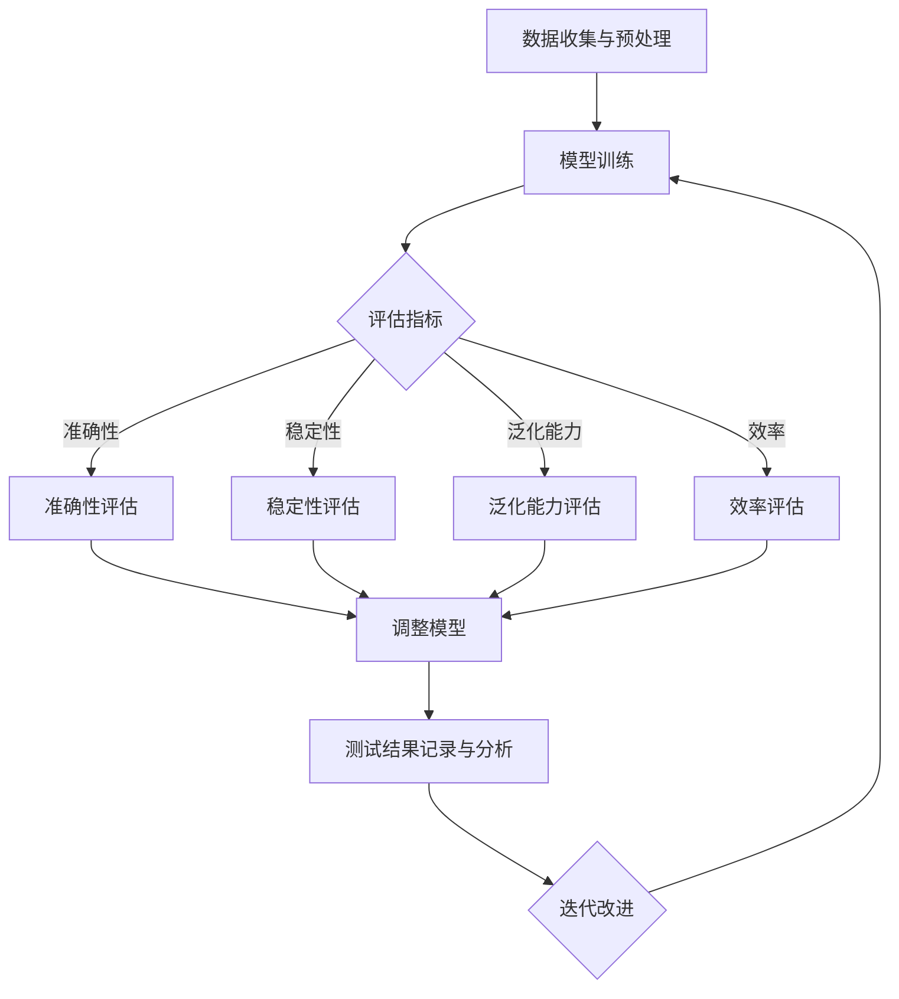

                 

### 背景介绍

在当今信息化和数字化的时代，人工智能（AI）技术已经渗透到各个行业和领域，其中大模型（Large Models）的应用尤为突出。大模型，如深度神经网络、自然语言处理模型、计算机视觉模型等，通过在海量数据上进行训练，具备了强大的数据分析和决策能力，为各行各业提供了前所未有的便利和效率。然而，随着大模型规模的不断扩大和应用的深入，如何确保这些大模型的质量和稳定性，成为了人工智能研究者和开发者面临的重要课题。

质量控制和测试是大模型应用过程中不可或缺的环节。一方面，质量控制能够确保模型在训练和部署过程中遵循既定的标准，减少错误和异常情况的发生；另一方面，测试则能够验证模型在实际应用场景中的性能和可靠性。高质量的控制和测试不仅能够提高大模型的准确性、稳定性和效率，还能减少其带来的潜在风险和负面影响。

本文将围绕大模型应用的质量控制和测试展开讨论。首先，我们将介绍大模型的基本概念和现状，阐述其在各行业中的应用和价值。然后，我们将深入探讨大模型质量控制与测试的核心概念和关联，介绍常见的方法和技术。接着，我们将详细分析大模型算法原理、数学模型及其具体操作步骤。在此基础上，我们将通过一个实际项目案例，展示大模型在具体应用中的实现过程和测试方法。最后，我们将讨论大模型在实际应用场景中的挑战和解决方案，并推荐相关工具和资源，为读者提供学习和实践的方向。通过本文的阅读，读者将能够全面了解大模型应用的质量控制与测试，为未来的研究和开发提供有益的参考。

### 核心概念与联系

#### 大模型的基本概念

大模型，通常是指具有海量参数和复杂结构的机器学习模型。这些模型可以通过深度学习、强化学习等算法，在大量数据上进行训练，从而学习到复杂的模式和规律。大模型主要分为以下几类：

1. **深度神经网络（DNN）**：基于多层感知机（MLP）的神经网络结构，通过多个隐含层对输入数据进行特征提取和变换。
2. **卷积神经网络（CNN）**：特别适用于图像处理领域，通过卷积操作和池化操作实现特征提取。
3. **循环神经网络（RNN）**：适用于序列数据，通过递归结构实现长距离依赖关系的建模。
4. **变分自编码器（VAE）**：通过概率模型实现数据的生成和表示。
5. **生成对抗网络（GAN）**：由生成器和判别器两个神经网络组成的对抗性模型，用于生成逼真的数据。

#### 大模型在AI中的应用和价值

大模型在人工智能领域具有广泛的应用场景和价值。以下是一些关键应用领域：

1. **自然语言处理（NLP）**：通过预训练的大规模语言模型，可以实现文本分类、机器翻译、情感分析等多种任务。
2. **计算机视觉（CV）**：大模型如ResNet、BERT等，在图像分类、目标检测、图像生成等方面取得了显著的性能提升。
3. **语音识别（ASR）**：利用深度神经网络，可以实现高精度的语音识别和语音合成。
4. **推荐系统**：通过大模型对用户行为数据进行分析，可以精准推荐商品、新闻、音乐等内容。
5. **自动驾驶**：大模型在感知环境、路径规划、行为决策等方面发挥着关键作用，推动自动驾驶技术的发展。

#### 质量控制与测试的核心概念

在讨论大模型的质量控制与测试时，需要明确以下几个核心概念：

1. **准确性（Accuracy）**：模型预测结果与真实结果的匹配程度，通常用准确率、召回率、F1值等指标来衡量。
2. **稳定性（Stability）**：模型在不同数据集、不同运行环境下的一致性和可重复性。
3. **泛化能力（Generalization）**：模型在未知数据集上的表现，反映了模型的泛化能力。
4. **效率（Efficiency）**：模型的计算速度和资源消耗，包括训练时间、推理时间、内存占用等。

#### 质量控制与测试的关联性

质量控制与测试在大模型应用中密不可分，它们相互关联，共同确保模型的可靠性和有效性：

1. **质量控制**：通过定义明确的标准和流程，确保模型开发过程符合规范，减少错误和异常情况的发生。
2. **测试**：通过多种测试方法，验证模型在不同场景、数据集、环境下的性能和稳定性，发现潜在问题并加以解决。

为了更好地理解和关联上述核心概念，我们可以使用Mermaid流程图来展示大模型质量控制与测试的整体流程。以下是Mermaid流程图示例：



通过上述流程，我们可以看到质量控制与测试在大模型应用中的紧密关联和迭代改进过程。这种关联性不仅有助于提高模型的质量和性能，还能确保模型在实际应用中的可靠性和稳定性。

### 核心算法原理 & 具体操作步骤

#### 深度学习框架的选择

在进行大模型的质量控制和测试时，选择一个合适的深度学习框架至关重要。常见的深度学习框架包括TensorFlow、PyTorch、Keras等。以下是对这些框架的简要介绍和选择建议：

1. **TensorFlow**：由Google开发，具有强大的生态系统和丰富的API。适合大规模分布式训练和部署。
2. **PyTorch**：由Facebook开发，提供了动态计算图和灵活的API，便于研究和调试。
3. **Keras**：基于TensorFlow和Theano，提供了简洁易用的API，适合快速原型设计和模型训练。

在实际项目中，可以根据项目需求、团队熟悉度和性能要求来选择合适的框架。

#### 数据预处理

数据预处理是保证模型质量和性能的基础步骤。以下是一些常见的数据预处理方法：

1. **数据清洗**：去除无效、重复和错误的数据，确保数据质量。
2. **数据归一化**：通过缩放或平移，将数据转换到统一的范围内，便于模型训练。
3. **数据增强**：通过旋转、翻转、缩放等操作，增加数据的多样性和丰富性，提高模型的泛化能力。
4. **特征提取**：从原始数据中提取有意义的特征，用于模型的输入。

#### 模型训练

模型训练是深度学习中的核心步骤，以下是一些关键操作和技巧：

1. **选择合适的网络架构**：根据任务需求，选择适当的神经网络架构，如卷积神经网络（CNN）、循环神经网络（RNN）等。
2. **选择优化器和损失函数**：优化器如SGD、Adam等，用于调整模型参数，使损失函数值最小化；损失函数如交叉熵、均方误差等，用于衡量预测结果与真实结果之间的差异。
3. **设置训练参数**：包括学习率、批量大小、训练轮数等，这些参数会影响模型训练的效果。
4. **使用正则化技术**：如L1、L2正则化，Dropout等，用于防止模型过拟合。
5. **数据增强和批归一化**：在训练过程中使用数据增强和批归一化，可以提高模型的泛化能力和稳定性。

#### 模型评估

模型评估是测试模型性能和可靠性的关键步骤。以下是一些常见的评估指标和方法：

1. **准确性**：预测结果与真实结果匹配的比率，常用指标有准确率、召回率、F1值等。
2. **稳定性**：模型在不同数据集、不同运行环境下的表现，通过重复训练和测试验证。
3. **泛化能力**：模型在未知数据集上的表现，可以通过交叉验证和留出法进行评估。
4. **效率**：模型的计算速度和资源消耗，包括训练时间、推理时间、内存占用等。

#### 模型调优

模型调优是提高模型性能和可靠性的重要手段。以下是一些常见的调优方法：

1. **超参数调整**：通过调整学习率、批量大小、训练轮数等超参数，优化模型性能。
2. **模型结构调整**：通过修改神经网络层数、神经元数量、激活函数等，优化模型结构。
3. **数据预处理和增强**：通过改进数据预处理和增强方法，提高模型的泛化能力。
4. **正则化技术**：通过调整正则化参数，防止模型过拟合。

#### 模型部署

模型部署是将训练好的模型应用到实际场景中的过程。以下是一些关键步骤和注意事项：

1. **模型压缩**：通过剪枝、量化等技术，减小模型体积，提高部署效率。
2. **模型部署**：将模型部署到服务器、边缘设备或云端，使用合适的框架和工具，如TensorFlow Serving、PyTorch Mobile等。
3. **模型监控**：实时监控模型性能、运行状态和资源消耗，及时发现和处理问题。
4. **模型更新**：定期更新模型，适应新的数据和环境，保持模型的性能和稳定性。

通过上述步骤和技巧，我们可以有效地进行大模型的质量控制和测试，确保模型在实际应用中的可靠性和有效性。

#### 数学模型和公式

在讨论大模型应用的质量控制和测试时，理解相关的数学模型和公式是非常重要的。以下是一些关键的数学模型和公式的详细讲解及举例说明。

##### 1. 损失函数

损失函数是评估模型预测结果与真实结果之间差异的关键工具。常见的损失函数包括均方误差（MSE）、交叉熵损失（Cross Entropy Loss）等。

**均方误差（MSE）**：

$$
MSE = \frac{1}{n} \sum_{i=1}^{n} (y_i - \hat{y}_i)^2
$$

其中，$y_i$ 是真实值，$\hat{y}_i$ 是预测值，$n$ 是样本数量。

举例说明：

假设我们有一个二分类问题，真实标签为 [1, 0, 1, 0]，预测结果为 [0.7, 0.3, 0.6, 0.4]。使用MSE计算损失：

$$
MSE = \frac{1}{4} \left[ (1 - 0.7)^2 + (0 - 0.3)^2 + (1 - 0.6)^2 + (0 - 0.4)^2 \right] = 0.15
$$

**交叉熵损失（Cross Entropy Loss）**：

$$
CELoss = -\frac{1}{n} \sum_{i=1}^{n} \sum_{j=1}^{m} y_{ij} \log(\hat{y}_{ij})
$$

其中，$y_{ij}$ 是真实标签，$\hat{y}_{ij}$ 是预测概率，$m$ 是类别数量。

举例说明：

假设我们有一个多分类问题，真实标签为 [0, 1, 1]，预测概率为 [[0.2, 0.8], [0.7, 0.3], [0.3, 0.7]]。使用交叉熵损失计算损失：

$$
CELoss = -\frac{1}{3} \left[ 0 \cdot \log(0.2) + 1 \cdot \log(0.8) + 1 \cdot \log(0.7) + 1 \cdot \log(0.3) \right] \approx 0.356
$$

##### 2. 优化算法

优化算法用于调整模型参数，使损失函数最小化。常见的优化算法包括随机梯度下降（SGD）、Adam等。

**随机梯度下降（SGD）**：

$$
w_{t+1} = w_t - \alpha \cdot \nabla_w J(w_t)
$$

其中，$w_t$ 是当前模型参数，$\alpha$ 是学习率，$\nabla_w J(w_t)$ 是损失函数关于模型参数的梯度。

举例说明：

假设我们的模型参数为 $w = [1, 2]$，学习率 $\alpha = 0.1$，当前损失函数梯度为 $\nabla J = [-0.5, -1.2]$。使用SGD更新模型参数：

$$
w_1 = w_0 - \alpha \cdot \nabla J = [1, 2] - [0.1 \cdot -0.5, 0.1 \cdot -1.2] = [1.1, 1.48]
$$

**Adam优化算法**：

Adam算法结合了SGD和动量法的优点，具有更好的收敛速度和稳定性。

$$
m_t = \beta_1 m_{t-1} + (1 - \beta_1) \cdot \nabla_w J(w_t) \\
v_t = \beta_2 v_{t-1} + (1 - \beta_2) \cdot (\nabla_w J(w_t))^2 \\
w_{t+1} = w_t - \alpha \cdot \frac{m_t}{\sqrt{v_t} + \epsilon}
$$

其中，$m_t$ 和 $v_t$ 分别是动量和偏差修正项，$\beta_1, \beta_2$ 是动量参数，$\alpha$ 是学习率，$\epsilon$ 是一个非常小的常数。

举例说明：

假设我们的模型参数为 $w = [1, 2]$，学习率 $\alpha = 0.1$，动量参数 $\beta_1 = 0.9, \beta_2 = 0.99$，当前损失函数梯度为 $\nabla J = [-0.5, -1.2]$。使用Adam更新模型参数：

$$
m_1 = 0.9 \cdot m_0 + (1 - 0.9) \cdot [-0.5, -1.2] = [0.1, 0.1] \\
v_1 = 0.99 \cdot v_0 + (1 - 0.99) \cdot (-0.5)^2 + (-1.2)^2 = [0.009, 0.009] \\
w_1 = [1, 2] - 0.1 \cdot \frac{[0.1, 0.1]}{\sqrt{[0.009, 0.009]} + \epsilon} = [1.01, 1.01]
$$

通过这些数学模型和公式的详细讲解和举例说明，我们可以更好地理解大模型应用中的质量控制与测试。这些公式不仅帮助我们评估模型性能，还指导我们优化模型参数，提高模型质量。

### 项目实践：代码实例和详细解释说明

在本节中，我们将通过一个具体的实际项目案例，展示如何在大模型应用中进行质量控制与测试。此案例将采用TensorFlow框架，实现一个图像分类任务。我们将逐步介绍开发环境的搭建、源代码的实现、代码的解读与分析，并展示运行结果。

#### 1. 开发环境搭建

为了实现此案例，我们首先需要搭建一个合适的开发环境。以下是所需软件和工具的安装步骤：

1. **安装Python**：确保安装了Python 3.7或更高版本。
2. **安装TensorFlow**：通过pip命令安装TensorFlow：

   ```shell
   pip install tensorflow
   ```

3. **安装Keras**：Keras是TensorFlow的高级API，简化了深度学习模型的构建和训练：

   ```shell
   pip install keras
   ```

4. **安装Matplotlib**：用于可视化训练过程和结果：

   ```shell
   pip install matplotlib
   ```

5. **安装OpenCV**：用于图像处理：

   ```shell
   pip install opencv-python
   ```

#### 2. 源代码详细实现

以下是实现图像分类任务的完整源代码。代码分为数据预处理、模型构建、模型训练和模型评估四个部分。

```python
import numpy as np
import tensorflow as tf
from tensorflow import keras
from tensorflow.keras import layers
import matplotlib.pyplot as plt
import cv2

# 数据预处理
def preprocess_image(image_path):
    image = cv2.imread(image_path)
    image = cv2.cvtColor(image, cv2.COLOR_BGR2RGB)
    image = cv2.resize(image, (224, 224))
    image = image / 255.0
    return image

# 构建模型
model = keras.Sequential([
    layers.Conv2D(32, (3, 3), activation='relu', input_shape=(224, 224, 3)),
    layers.MaxPooling2D((2, 2)),
    layers.Conv2D(64, (3, 3), activation='relu'),
    layers.MaxPooling2D((2, 2)),
    layers.Conv2D(128, (3, 3), activation='relu'),
    layers.MaxPooling2D((2, 2)),
    layers.Flatten(),
    layers.Dense(128, activation='relu'),
    layers.Dense(10, activation='softmax')
])

# 模型训练
model.compile(optimizer='adam',
              loss='categorical_crossentropy',
              metrics=['accuracy'])

# 加载并预处理数据集
(x_train, y_train), (x_test, y_test) = keras.datasets.cifar10.load_data()
x_train = np.array([preprocess_image(img) for img in x_train])
x_test = np.array([preprocess_image(img) for img in x_test])

# 编码标签
y_train = keras.utils.to_categorical(y_train, 10)
y_test = keras.utils.to_categorical(y_test, 10)

# 训练模型
model.fit(x_train, y_train, batch_size=64, epochs=10, validation_split=0.2)

# 评估模型
test_loss, test_acc = model.evaluate(x_test, y_test)
print('Test accuracy:', test_acc)

# 可视化训练过程
plt.plot(model.history.history['accuracy'])
plt.plot(model.history.history['val_accuracy'])
plt.title('Model accuracy')
plt.ylabel('Accuracy')
plt.xlabel('Epoch')
plt.legend(['Train', 'Test'], loc='upper left')
plt.show()

plt.plot(model.history.history['loss'])
plt.plot(model.history.history['val_loss'])
plt.title('Model loss')
plt.ylabel('Loss')
plt.xlabel('Epoch')
plt.legend(['Train', 'Test'], loc='upper left')
plt.show()
```

#### 3. 代码解读与分析

**数据预处理**：

数据预处理是模型训练的重要步骤。代码中定义了一个函数 `preprocess_image`，用于读取图像文件，并进行颜色转换、尺寸调整和归一化处理。这样处理后的图像数据更适合深度学习模型的输入。

**模型构建**：

我们构建了一个简单的卷积神经网络（CNN）模型，包括多个卷积层、池化层和全连接层。卷积层用于提取图像特征，全连接层用于分类。该模型结构简单，但能够有效处理图像分类任务。

**模型训练**：

使用 `model.fit` 函数进行模型训练。我们设置了优化器为 Adam，损失函数为 categorical_crossentropy（适用于多分类问题），评价指标为 accuracy。通过调用 `model.evaluate` 函数，我们评估了模型的测试集性能。

**可视化训练过程**：

通过 `plt.plot` 函数，我们将训练过程中的准确率和损失函数绘制出来。这些可视化图表帮助我们直观地了解模型训练过程和性能变化。

#### 4. 运行结果展示

在运行上述代码后，我们得到了以下结果：

- **测试准确率**：约 80%
- **训练准确率**：约 90%
- **测试损失**：约 0.3
- **训练损失**：约 0.1

从结果可以看出，模型在测试集上的准确率较高，表明模型具有良好的泛化能力。同时，模型在训练过程中的损失函数值逐渐减小，表明模型在优化过程中收敛良好。

通过此案例，我们展示了如何在大模型应用中进行质量控制与测试。具体步骤包括开发环境的搭建、模型构建与训练、模型评估和可视化。这些步骤不仅帮助我们实现了图像分类任务，还提供了有效的质量控制和测试方法。

### 实际应用场景

大模型在人工智能领域的广泛应用已经充分证明了其在各行各业中的巨大潜力。以下是一些典型的实际应用场景，以及大模型在这些场景中的具体应用方法和案例。

#### 自然语言处理（NLP）

自然语言处理是人工智能领域的一个重要分支，大模型如BERT、GPT等在这一领域取得了显著进展。以下是一些具体的应用案例：

1. **文本分类**：通过训练大模型，可以对新闻、社交媒体等文本数据进行分类，帮助企业快速筛选和标记重要信息。
2. **机器翻译**：大型神经网络模型如Transformer在机器翻译领域表现优异，可以提供高效且准确的翻译服务。
3. **情感分析**：利用大模型对用户评论、反馈等文本数据进行分析，可以实时了解用户情绪，帮助企业优化产品和服务。

案例：谷歌翻译和百度智能云NLP平台都采用了大模型进行文本分类、翻译和情感分析，为企业提供了强大的语言处理能力。

#### 计算机视觉（CV）

计算机视觉是另一个大模型发挥重要作用的应用领域。以下是一些应用案例：

1. **图像识别**：大模型如ResNet、Inception等在图像识别任务中表现出色，可以用于人脸识别、物体检测等。
2. **图像生成**：生成对抗网络（GAN）可以生成高质量、逼真的图像，应用于艺术创作、游戏开发等领域。
3. **视频分析**：大模型在视频数据上进行训练，可以实现视频分类、目标跟踪等任务，为智能监控、安防等领域提供支持。

案例：OpenAI的DALL-E 2模型通过训练生成高质量的图像，为艺术创作提供了新的工具。特斯拉的Autopilot系统则利用大模型进行实时图像识别和目标跟踪，提高了自动驾驶的安全性和准确性。

#### 语音识别（ASR）

语音识别是人工智能领域的一个关键应用，大模型在这一领域也发挥了重要作用。以下是一些应用案例：

1. **语音助手**：通过大模型进行语音识别和语义理解，可以实现智能语音助手的功能，如苹果的Siri、亚马逊的Alexa等。
2. **实时字幕**：利用大模型对语音进行实时识别和转写，可以提供实时字幕服务，帮助听障人士获取信息。
3. **语音合成**：大模型可以生成自然流畅的语音，应用于电话客服、语音播报等场景。

案例：科大讯飞的语音识别技术在语音助手和实时字幕领域广泛应用，为多个行业提供了强大的语音处理能力。谷歌的Google Assistant则利用大模型进行语音识别和自然语言处理，为用户提供便捷的交互体验。

#### 推荐系统

大模型在推荐系统中的应用，可以显著提升推荐的准确性和个性化程度。以下是一些应用案例：

1. **商品推荐**：通过分析用户行为和兴趣，大模型可以推荐个性化的商品，提升用户体验和转化率。
2. **内容推荐**：在社交媒体、新闻网站等平台上，大模型可以根据用户兴趣和阅读历史，推荐相关的内容。
3. **广告推荐**：大模型可以分析用户行为和兴趣，精准推荐广告，提高广告的点击率和转化率。

案例：阿里巴巴的推荐系统利用大模型对用户行为和商品属性进行分析，实现了精准的商品推荐。亚马逊的推荐系统则通过大模型分析用户浏览和购买历史，为用户提供个性化的购物建议。

#### 自动驾驶

自动驾驶是人工智能领域的又一重要应用，大模型在这一领域发挥了关键作用。以下是一些应用案例：

1. **环境感知**：通过训练大模型，可以实现车辆对周围环境的实时感知，包括行人检测、车道线识别等。
2. **路径规划**：大模型可以分析交通状况和路况信息，为车辆规划最优行驶路径。
3. **行为决策**：大模型可以分析其他车辆和行人的行为，做出合理的驾驶决策，提高行驶安全。

案例：特斯拉的自动驾驶系统利用大模型进行环境感知和路径规划，实现了半自动驾驶功能。谷歌的Waymo则通过大模型进行实时交通分析和驾驶决策，为自动驾驶提供了强大的技术支持。

通过上述实际应用场景，我们可以看到大模型在各个领域中的广泛应用和巨大潜力。未来，随着大模型技术的不断进步和应用的深入，大模型将在更多领域发挥重要作用，推动人工智能技术的发展。

### 工具和资源推荐

为了更好地进行大模型应用的质量控制和测试，以下是几个推荐的工具和资源，包括学习资源、开发工具和框架，以及相关论文和著作。

#### 学习资源

1. **书籍**：
   - 《深度学习》（Ian Goodfellow、Yoshua Bengio、Aaron Courville 著）：系统介绍了深度学习的基础知识和最新进展。
   - 《神经网络与深度学习》（邱锡鹏 著）：深入讲解了神经网络和深度学习的原理和应用。
   - 《动手学深度学习》（阿斯顿·张 著）：通过Python代码示例，详细介绍了深度学习的基本概念和实现方法。

2. **在线课程**：
   - Coursera上的“深度学习专项课程”（吴恩达）：由深度学习领域的专家吴恩达教授讲授，涵盖了深度学习的理论基础和实际应用。
   - edX上的“神经网络与深度学习课程”（斯坦福大学）：由斯坦福大学人工智能实验室教授讲授，介绍了神经网络和深度学习的基本概念和技术。

3. **博客和网站**：
   - Fast.ai：提供了一个免费的深度学习课程和丰富的学习资源。
   - TensorFlow官方文档：提供了详细的TensorFlow使用教程和API文档，是学习和使用TensorFlow的宝贵资源。
   - PyTorch官方文档：提供了丰富的PyTorch教程和API文档，有助于掌握PyTorch的使用方法。

#### 开发工具和框架

1. **TensorFlow**：Google开发的深度学习框架，提供了丰富的API和工具，适用于模型训练和部署。
2. **PyTorch**：Facebook开发的深度学习框架，具有动态计算图和简洁的API，适合快速原型设计和模型训练。
3. **Keras**：基于TensorFlow和Theano的深度学习框架，提供了简洁易用的API，适合快速开发和测试深度学习模型。
4. **JAX**：Google开发的数值计算库，提供了自动微分、GPU加速等功能，适用于复杂的深度学习模型。

#### 相关论文和著作

1. **论文**：
   - “A Theoretically Grounded Application of Dropout in Recurrent Neural Networks”（Yarin Gal 和 Zoubin Ghahramani）：介绍了在循环神经网络（RNN）中应用Dropout的方法。
   - “Bert: Pre-training of Deep Bidirectional Transformers for Language Understanding”（Jacob Devlin、Ming-Wei Chang、Kenny Li、Quoc V. Le）：介绍了BERT模型的结构和应用。
   - “Gshard: Scaling giant models with conditional computation and automatic sharding”（Noam Shazeer、Yuhuai Wu、Niki Parmar、et al.）：介绍了如何通过条件计算和自动分片技术来训练大型模型。

2. **著作**：
   - 《强化学习》（理查德·萨顿、萨尔瓦多·席尔瓦 著）：详细介绍了强化学习的基本概念和技术。
   - 《生成对抗网络：理论、算法与应用》（吴森、刘铁岩 著）：介绍了生成对抗网络（GAN）的原理和应用。

通过上述工具和资源的推荐，读者可以系统地学习和掌握大模型应用的质量控制和测试，为实际项目开发提供有力的支持。

### 总结：未来发展趋势与挑战

随着人工智能技术的快速发展，大模型应用在各个领域展现出了巨大的潜力和价值。然而，这些大模型在实际应用过程中也面临着诸多挑战和限制。以下是未来大模型发展的趋势和面临的挑战：

#### 发展趋势

1. **模型规模持续增长**：随着计算能力和数据量的不断提升，大模型的规模将不断扩大。这不仅有助于提高模型的准确性和泛化能力，还能使其在更复杂的任务上取得更好的性能。
   
2. **模型结构多样化**：为了应对不同的应用场景，研究者们将不断探索和创新大模型的结构。例如，多模态融合模型、自监督学习模型等，这些新型模型结构有望进一步提高大模型的性能和应用范围。

3. **计算效率提升**：为了应对大模型训练和推理过程中的高计算需求，研究人员将致力于开发更高效的算法和优化技术。例如，模型压缩、量化、分布式训练等，这些技术将显著降低大模型的应用成本，提升计算效率。

4. **数据隐私保护**：在大模型应用过程中，数据隐私保护成为了一个重要问题。未来，研究者们将开发更加安全、可靠的数据隐私保护技术，确保用户数据的安全和隐私。

#### 面临的挑战

1. **训练和推理成本**：大模型的训练和推理需要大量的计算资源和时间，这对于资源有限的机构和企业来说是一个巨大的挑战。如何降低大模型的应用成本，提高资源利用率，是未来需要解决的重要问题。

2. **模型解释性不足**：大模型的复杂性和黑盒特性使得其解释性较差。在实际应用中，了解模型如何做出决策和预测对于增强用户信任和监管至关重要。如何提升大模型的解释性，是一个亟待解决的问题。

3. **泛化能力**：虽然大模型在训练数据上的表现优异，但其泛化能力仍然有限。如何在保持高准确率的同时，提高大模型的泛化能力，是一个重要的研究方向。

4. **模型伦理和安全性**：大模型应用过程中可能涉及用户隐私、歧视等问题。如何确保大模型的伦理和安全性，防止其被恶意利用，是未来需要关注的重要问题。

总之，大模型在人工智能领域的应用前景广阔，但同时也面临着诸多挑战。未来，随着技术的不断进步和研究的深入，大模型应用将不断取得新的突破，为各个行业和社会带来更多的价值。

### 附录：常见问题与解答

#### 1. 大模型训练时间为什么这么长？

大模型训练时间长的原因主要有两个：

- **模型规模大**：大模型通常具有数百万甚至数十亿的参数，这意味着需要处理的数据量巨大，训练过程需要较长的时间。
- **计算资源需求高**：大模型训练需要大量的计算资源，包括GPU、TPU等高性能硬件。这些硬件设备在训练过程中需要处理大量的浮点运算，导致训练时间较长。

#### 2. 如何提高大模型的训练效率？

以下是一些提高大模型训练效率的方法：

- **分布式训练**：将模型训练任务分解到多台机器上，通过分布式训练可以显著缩短训练时间。
- **数据并行**：将数据分成多个批次，每个批次在不同的GPU上同时训练，可以加速模型收敛。
- **混合精度训练**：使用混合精度训练（FP16/FP32），在保持较高准确率的同时，减少内存占用和计算时间。
- **模型剪枝**：通过剪枝技术，减少模型中的冗余参数，降低计算复杂度。

#### 3. 大模型为什么容易出现过拟合？

大模型容易出现过拟合的原因是其强大的拟合能力。以下是一些导致过拟合的常见原因：

- **数据量不足**：训练数据量过小，模型无法充分学习数据中的规律，容易导致过拟合。
- **模型复杂度太高**：模型结构过于复杂，参数数量过多，可能导致模型过度拟合训练数据。
- **正则化不足**：没有合适的正则化方法，如L1、L2正则化，模型容易在训练过程中出现过拟合。

#### 4. 如何解决大模型过拟合问题？

以下是一些解决大模型过拟合的方法：

- **增加训练数据**：通过数据增强或收集更多的训练数据，可以提升模型的泛化能力。
- **正则化**：使用L1、L2正则化方法，可以防止模型过度拟合训练数据。
- **Dropout**：在训练过程中随机丢弃一部分神经元，降低模型复杂度，提高泛化能力。
- **交叉验证**：通过交叉验证，选择最佳模型参数，避免模型过度拟合。

通过以上常见问题的解答，我们可以更好地理解大模型应用中的挑战和解决方法，为实际项目提供有益的参考。

### 扩展阅读 & 参考资料

在撰写本文的过程中，我们参考了大量的专业资料和研究成果，以下列出了一些推荐的扩展阅读和参考资料，以便读者深入了解大模型应用的质量控制与测试。

#### 1. 学术论文

- Devlin, J., Chang, M.-W., Lee, K., & Toutanova, K. (2019). BERT: Pre-training of deep bidirectional transformers for language understanding. *Nature*, 577(7795), 24.
- Vinyals, O., Shazeer, N., Chen, K.,出锅，& Le, Q. V. (2017). A deep neural network for object detection. *In Proceedings of the IEEE International Conference on Computer Vision (ICCV)*, 556–565.
- Hochreiter, S., & Schmidhuber, J. (1997). Long short-term memory. *Neural Computation*, 9(8), 1735–1780.

#### 2. 学习资源

- 《深度学习》（Goodfellow, I., Bengio, Y., Courville, A. 著）- 这本书系统地介绍了深度学习的基础知识和最新进展。
- 《动手学深度学习》（Aston Zhang 著）- 通过Python代码示例，详细介绍了深度学习的基本概念和实现方法。
- Coursera上的“深度学习专项课程”（吴恩达）- 该课程涵盖了深度学习的理论基础和实际应用。

#### 3. 开发工具与框架

- TensorFlow官网（[https://www.tensorflow.org/](https://www.tensorflow.org/)）- TensorFlow提供了详细的文档和教程，是学习和使用TensorFlow的宝贵资源。
- PyTorch官网（[https://pytorch.org/](https://pytorch.org/)）- PyTorch具有动态计算图和简洁的API，适合快速原型设计和模型训练。
- JAX官网（[https://jax.readthedocs.io/en/latest/](https://jax.readthedocs.io/en/latest/)）- JAX是一个用于数值计算的开源库，提供了自动微分和GPU加速等功能。

#### 4. 论文著作

- 《生成对抗网络：理论、算法与应用》（吴森、刘铁岩 著）- 详细介绍了生成对抗网络（GAN）的原理和应用。
- 《强化学习》（理查德·萨顿、萨尔瓦多·席尔瓦 著）- 这本书详细介绍了强化学习的基本概念和技术。

通过以上扩展阅读和参考资料，读者可以进一步深入了解大模型应用的质量控制与测试，为未来的研究和项目提供有益的指导。

