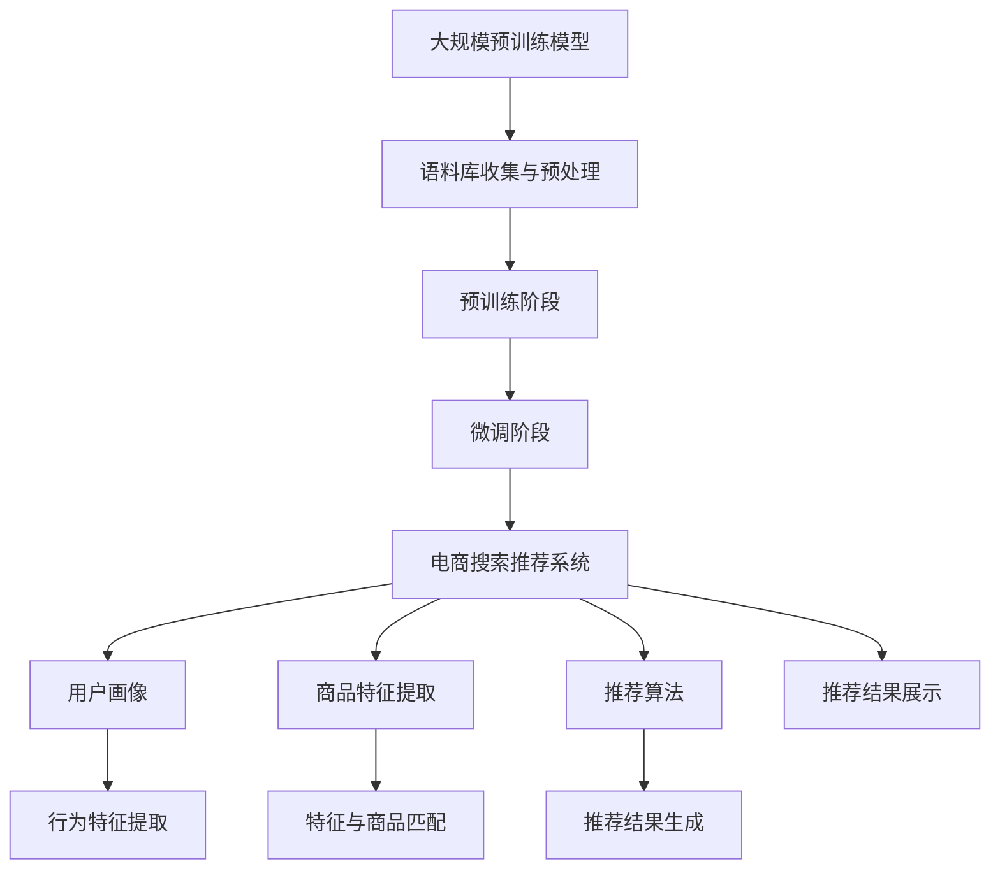

                 

### 1. 背景介绍

随着互联网技术的飞速发展，电子商务已成为全球商业活动的重要组成部分。在线购物平台的用户数量和交易额持续攀升，用户对于个性化、高效的服务需求日益增长。在这种背景下，电商搜索推荐系统成为电商平台提升用户体验、增加销售转化率的关键技术之一。

电商搜索推荐系统通常包括用户画像、商品推荐算法、推荐结果展示等模块。传统的推荐系统主要依赖于基于内容的推荐（Content-Based Filtering）和协同过滤（Collaborative Filtering）算法，这些方法在一定程度上满足了用户的个性化需求，但存在推荐准确性不高、推荐结果多样性和实时性不足等问题。

近年来，人工智能特别是大规模预训练模型（如GPT、BERT等）的发展，为电商搜索推荐领域带来了新的机遇。这些模型通过学习海量的用户行为数据和商品信息，能够捕捉用户的兴趣偏好和商品属性之间的关系，从而实现更加精准和个性化的推荐。同时，预训练模型具有强大的通用性和适应性，可以应用于各种不同的推荐任务，如商品搜索、商品推荐、用户兴趣挖掘等。

本文将围绕大规模预训练模型在电商搜索推荐中的应用进行深入探讨，分析其原理、技术实现和应用效果，旨在为电商平台的推荐系统优化提供新的思路和方向。

#### 1.1 大规模预训练模型的发展背景

大规模预训练模型（如GPT、BERT、T5等）的发展可以追溯到深度学习和自然语言处理领域的进步。深度学习作为一种重要的机器学习方法，通过神经网络结构对大量数据进行训练，能够自动提取特征和模式。而自然语言处理（NLP）则关注于使计算机能够理解和处理人类语言，这涉及到词向量表示、语法分析、语义理解等多个子领域。

早期的NLP模型如Word2Vec、GloVe等通过将单词映射到向量空间，实现了对文本数据的有效表示。然而，这些模型在处理长文本和复杂语义时存在局限性。为了解决这一问题，研究人员提出了使用Transformer架构的预训练模型，如BERT、GPT等。

BERT（Bidirectional Encoder Representations from Transformers）模型由Google AI于2018年提出，其核心思想是双向编码表示。BERT通过预训练大规模语料库，学习上下文信息，使得模型能够更好地理解单词的含义和语境。GPT（Generative Pre-trained Transformer）模型则由OpenAI于2018年发布，是一种基于Transformer架构的生成模型，主要用于文本生成任务。与BERT不同，GPT主要关注自回归任务，通过预测下一个词来学习语言规律。

近年来，随着计算能力和数据规模的不断提升，预训练模型不断突破性能瓶颈，涌现出了T5、RoBERTa、ALBERT等一系列高性能模型。这些模型不仅在NLP任务中取得了显著的成果，也展示了其在其他领域，如图像识别、语音识别、推荐系统等的应用潜力。

#### 1.2 电商搜索推荐系统的现状

电商搜索推荐系统是电商平台的核心组成部分，旨在通过智能推荐，帮助用户快速找到符合其兴趣和需求的商品，提升用户体验和平台销售额。目前，主流的电商搜索推荐系统主要采用基于内容的推荐和协同过滤两种方法。

基于内容的推荐（Content-Based Filtering）方法通过分析用户的历史行为和商品的特征，找到与用户兴趣相关的商品进行推荐。这种方法的主要优势在于能够提供个性化的推荐，但存在推荐结果多样性和实时性不足的问题。此外，对于复杂和抽象的兴趣偏好，内容推荐的效果往往不佳。

协同过滤（Collaborative Filtering）方法通过分析用户之间的行为模式，找到相似用户或商品进行推荐。协同过滤可以分为基于用户和基于物品两种类型。基于用户的方法通过寻找与目标用户行为相似的现有用户，推荐这些用户喜欢的商品；而基于物品的方法则是找到目标用户过去喜欢的商品，推荐与这些商品相似的其它商品。协同过滤的优势在于能够提供多样化的推荐，但存在数据稀疏性和推荐准确性不高的问题。

除了传统的方法，近年来，随着人工智能特别是大规模预训练模型的发展，电商搜索推荐系统也在尝试引入更多的智能技术。例如，利用BERT、GPT等预训练模型对用户和商品进行特征表示，通过深度学习网络进行推荐。这些方法在一定程度上提升了推荐系统的准确性和实时性，但仍面临数据隐私、模型解释性等挑战。

#### 1.3 大规模预训练模型在电商搜索推荐中的优势

大规模预训练模型在电商搜索推荐中的应用具有显著的优势，主要体现在以下几个方面：

1. **强大的特征学习能力**：预训练模型通过在大规模语料库上进行预训练，能够自动提取用户行为数据和商品信息中的潜在特征，从而实现更加精准的推荐。这种自学习的特征表示方法，避免了传统推荐系统中特征工程复杂、特征维度高等问题。

2. **高实时性和扩展性**：预训练模型通常采用分布式计算和并行处理技术，能够快速处理大规模数据，实现实时推荐。同时，由于预训练模型具有通用性和适应性，可以轻松扩展到不同的推荐任务和应用场景，如商品搜索、商品推荐、用户兴趣挖掘等。

3. **高度可解释性**：与传统的机器学习模型相比，预训练模型具有更高的可解释性。通过分析模型内部的表示和参数，可以理解用户和商品之间的关联和推荐机制，从而提升用户对推荐结果的信任度和满意度。

4. **数据隐私保护**：大规模预训练模型可以通过联邦学习（Federated Learning）等技术，实现分布式训练和模型更新，避免数据在集中存储和处理过程中泄露。同时，预训练模型可以基于差分隐私（Differential Privacy）等技术，保护用户隐私，降低隐私泄露风险。

总之，大规模预训练模型为电商搜索推荐系统带来了全新的技术机遇和解决方案。通过深入研究和应用这些模型，可以进一步提升推荐系统的性能和用户体验，为电商平台的持续发展提供强有力的支持。

### 2. 核心概念与联系

在探讨大规模预训练模型在电商搜索推荐中的应用之前，我们需要明确几个核心概念，并理解它们之间的相互联系。以下将介绍大规模预训练模型、电商搜索推荐系统和用户行为数据等核心概念，并借助Mermaid流程图展示其关系。

#### 2.1 大规模预训练模型

大规模预训练模型（如BERT、GPT等）是当前自然语言处理领域的核心技术之一。这些模型通过在大规模语料库上进行预训练，学习语言的基本规律和语义表示。预训练模型主要包括以下几个阶段：

1. **语料库收集与预处理**：收集大量互联网文本数据，如新闻、百科、社交媒体等，并进行清洗、分词、去停用词等预处理操作。
2. **预训练阶段**：使用Transformer等神经网络架构，对预处理后的语料库进行训练，学习语言模型。
3. **微调阶段**：在预训练的基础上，针对具体任务（如文本分类、命名实体识别等）进行微调，以适应特定应用场景。

#### 2.2 电商搜索推荐系统

电商搜索推荐系统旨在为用户提供个性化的商品推荐服务，提升用户体验和平台销售额。其主要模块包括：

1. **用户画像**：通过用户的历史行为、浏览记录、购物偏好等数据，构建用户画像，为推荐系统提供用户特征。
2. **商品特征提取**：对商品进行编码，提取商品属性、用户评价、销量等特征，为推荐算法提供商品信息。
3. **推荐算法**：基于用户画像和商品特征，利用机器学习算法（如协同过滤、基于内容的推荐等）进行推荐。
4. **推荐结果展示**：将推荐结果以可视化形式展示给用户，提升用户体验。

#### 2.3 用户行为数据

用户行为数据是电商搜索推荐系统的重要输入。这些数据包括用户的浏览记录、搜索历史、购买行为等，反映了用户的兴趣偏好和需求。用户行为数据通过以下方式参与推荐系统：

1. **行为特征提取**：对用户行为数据进行处理，提取出能够反映用户兴趣和需求的特征。
2. **特征与商品匹配**：将用户特征与商品特征进行匹配，找出用户可能感兴趣的商品。
3. **推荐结果生成**：根据用户特征和商品匹配结果，生成推荐列表，供用户浏览和选择。

#### 2.4 Mermaid流程图

为了更直观地展示上述概念之间的联系，我们使用Mermaid流程图描述大规模预训练模型、电商搜索推荐系统和用户行为数据的关系。



#### 2.5 核心概念间的相互联系

1. **预训练模型与推荐系统**：大规模预训练模型通过学习用户行为数据和商品信息，生成高质量的语义表示，为推荐算法提供有效的特征表示。这些特征表示可以提升推荐系统的准确性和实时性。
2. **用户画像与行为特征提取**：用户画像通过分析用户历史行为数据，提取出用户兴趣和需求特征。这些特征用于推荐算法，帮助系统更好地理解用户偏好。
3. **商品特征提取与匹配**：商品特征提取将商品信息编码为向量表示，与用户特征进行匹配，找出可能感兴趣的商品。
4. **推荐算法与结果展示**：推荐算法根据用户特征和商品匹配结果，生成个性化的推荐列表。推荐结果展示模块负责将推荐结果以可视化形式呈现给用户。

通过明确上述核心概念及其相互联系，我们可以更好地理解大规模预训练模型在电商搜索推荐系统中的应用原理和实现方法。这为后续章节的深入探讨奠定了基础。

### 3. 核心算法原理 & 具体操作步骤

#### 3.1 大规模预训练模型的工作原理

大规模预训练模型的核心思想是通过在大规模语料库上进行预训练，学习语言的基本规律和语义表示。预训练模型通常包含两个阶段：预训练阶段和微调阶段。

1. **预训练阶段**：
   - **语料库收集与预处理**：首先，从互联网上收集大量文本数据，如新闻、百科、社交媒体等。然后，对数据进行清洗、分词、去停用词等预处理操作，以得到高质量的输入数据。
   - **预训练任务**：在预处理后的语料库上进行预训练。预训练任务通常包括两种类型：自回归语言模型（如GPT）和双向编码语言模型（如BERT）。
     - **自回归语言模型**：预测下一个词，通过学习语言的连贯性和上下文关系。
     - **双向编码语言模型**：同时考虑输入文本的左侧和右侧上下文信息，以获得更准确的语义表示。

2. **微调阶段**：
   - **任务定义**：在预训练基础上，针对特定任务（如文本分类、命名实体识别等）进行微调。
   - **数据准备**：收集与任务相关的数据集，并进行预处理，如数据清洗、标签划分等。
   - **模型微调**：将预训练模型在任务数据集上进行微调，调整模型参数以适应特定任务。

#### 3.2 大规模预训练模型在电商搜索推荐中的应用步骤

在电商搜索推荐系统中，大规模预训练模型可以应用于用户特征提取、商品特征提取和推荐算法等环节。以下是一个具体的操作步骤：

1. **用户特征提取**：
   - **用户行为数据收集**：收集用户的历史行为数据，如浏览记录、搜索历史、购买记录等。
   - **文本数据预处理**：对用户行为数据中的文本部分进行清洗、分词、去停用词等预处理操作。
   - **文本编码**：使用预训练模型（如BERT）对预处理后的文本数据进行编码，生成用户特征向量。

2. **商品特征提取**：
   - **商品信息收集**：收集商品的各种属性信息，如品类、品牌、价格、销量等。
   - **特征编码**：对商品属性进行编码，可以采用标签编码、嵌入编码等方法。
   - **特征融合**：将不同来源的商品特征（如用户评价、商品描述等）进行融合，以生成统一的商品特征表示。

3. **推荐算法实现**：
   - **模型选择**：选择适合电商搜索推荐的任务模型，如基于神经网络的协同过滤模型、基于Transformer的推荐模型等。
   - **模型训练**：使用用户特征和商品特征作为输入，训练推荐模型。
   - **推荐生成**：将用户特征和商品特征输入模型，生成推荐列表。

4. **推荐结果优化**：
   - **多样性优化**：通过调整推荐算法参数或引入多样性策略，提升推荐结果的多样性。
   - **相关性优化**：通过调整推荐算法或引入相关性评估指标，提升推荐结果的相关性。

#### 3.3 具体操作示例

以BERT模型在电商搜索推荐中的应用为例，具体操作步骤如下：

1. **文本数据预处理**：
   - 收集用户浏览记录和搜索历史数据，进行清洗和分词。
   - 对分词后的文本数据进行BERT编码，生成用户特征向量。

2. **商品特征提取**：
   - 收集商品的各种属性信息，如品类、品牌、价格等。
   - 对商品属性进行标签编码，生成商品特征向量。

3. **模型训练**：
   - 选择一个基于BERT的推荐模型，如BERT-based Collaborative Filtering。
   - 将用户特征向量和商品特征向量输入模型，训练模型参数。

4. **推荐生成**：
   - 将用户特征向量输入模型，生成针对该用户的推荐列表。

5. **推荐结果优化**：
   - 通过调整模型参数或引入多样性策略，优化推荐结果。

通过上述步骤，我们可以利用大规模预训练模型构建一个高效的电商搜索推荐系统，实现个性化、精准的推荐。

### 4. 数学模型和公式 & 详细讲解 & 举例说明

#### 4.1 基本概念

在探讨大规模预训练模型在电商搜索推荐系统中的应用时，我们需要了解一些基础的数学模型和公式。以下将介绍几个关键概念：

1. **词向量（Word Vectors）**：词向量是将单词映射到高维向量空间的一种方法。常见的词向量模型包括Word2Vec、GloVe等。
2. **嵌入层（Embedding Layer）**：嵌入层是神经网络中的一个层，用于将输入的低维数据映射到高维向量空间。
3. **注意力机制（Attention Mechanism）**：注意力机制是一种在序列模型中增强模型对关键信息关注的方法，常用于预训练模型（如BERT、GPT等）中。

#### 4.2 模型参数

大规模预训练模型通常包含大量的参数，这些参数在预训练和微调过程中会不断调整。以下是一些关键参数：

1. **嵌入维度（Embedding Dimension）**：嵌入维度决定了词向量或特征向量的维度。
2. **隐藏层维度（Hidden Layer Dimension）**：隐藏层维度决定了模型隐藏层中的节点数量。
3. **学习率（Learning Rate）**：学习率决定了模型在训练过程中参数更新的步长。

#### 4.3 模型公式

大规模预训练模型的训练过程通常包括以下几个步骤：

1. **输入表示**：将输入数据（如单词、文本、用户特征、商品特征）映射到高维向量空间。
2. **前向传播**：通过神经网络结构，将输入向量传递到输出层，计算损失函数。
3. **反向传播**：根据损失函数，计算梯度并更新模型参数。

以下是一个简化的前向传播公式：

$$
\text{output} = \text{激活函数}(\text{权重} \cdot \text{输入} + \text{偏置})
$$

其中，激活函数（如ReLU、Sigmoid、Tanh等）用于非线性变换，权重和偏置是模型参数。

#### 4.4 损失函数

在预训练模型中，常用的损失函数包括交叉熵损失（Cross-Entropy Loss）和均方误差（Mean Squared Error，MSE）。

1. **交叉熵损失**：
   $$
   \text{loss} = -\sum_{i} y_i \log(p_i)
   $$
   其中，$y_i$ 是实际标签，$p_i$ 是预测概率。

2. **均方误差**：
   $$
   \text{loss} = \frac{1}{n} \sum_{i} (y_i - \hat{y_i})^2
   $$
   其中，$y_i$ 是实际值，$\hat{y_i}$ 是预测值。

#### 4.5 举例说明

以下是一个简单的例子，说明如何使用BERT模型对电商搜索推荐系统中的用户特征进行编码。

假设我们有一个包含100个单词的用户浏览记录，我们可以将这100个单词通过BERT模型编码为100个高维向量。每个向量表示一个单词的语义表示。具体步骤如下：

1. **文本预处理**：对用户浏览记录进行清洗和分词，得到100个单词。
2. **BERT编码**：将100个单词输入BERT模型，通过嵌入层得到100个高维向量。
3. **特征融合**：将100个高维向量进行平均或拼接，生成用户特征向量。

通过这个简单的例子，我们可以看到大规模预训练模型在电商搜索推荐系统中的应用是如何实现的。接下来，我们将进一步探讨预训练模型在实际应用中的效果和性能。

### 5. 项目实践：代码实例和详细解释说明

#### 5.1 开发环境搭建

在开始实现大规模预训练模型在电商搜索推荐系统中的应用之前，我们需要搭建一个合适的环境。以下是一个基本的开发环境搭建步骤：

1. **硬件要求**：
   - CPU或GPU：推荐使用NVIDIA GPU，如Tesla V100或更高级别的GPU，以加快训练速度。
   - 内存：至少16GB内存，以应对大规模数据预处理和模型训练。

2. **软件要求**：
   - 操作系统：推荐使用Linux系统，如Ubuntu 18.04。
   - Python环境：Python 3.7及以上版本。
   - 深度学习框架：TensorFlow 2.0及以上版本，或PyTorch 1.7及以上版本。

3. **安装依赖**：
   - 安装深度学习框架（如TensorFlow或PyTorch）。
   - 安装必要的Python库，如NumPy、Pandas、Scikit-learn等。

以下是一个示例命令，用于安装TensorFlow：

```bash
pip install tensorflow
```

#### 5.2 源代码详细实现

在本节中，我们将使用PyTorch框架实现一个基于BERT的电商搜索推荐系统。以下是关键代码的详细解释。

```python
# 导入必要的库
import torch
import torch.nn as nn
from torch.optim import Adam
from transformers import BertModel, BertTokenizer

# 设置设备
device = torch.device("cuda" if torch.cuda.is_available() else "cpu")

# 加载预训练BERT模型和分词器
model = BertModel.from_pretrained("bert-base-uncased")
tokenizer = BertTokenizer.from_pretrained("bert-base-uncased")

# 定义数据预处理函数
def preprocess_data(text):
    inputs = tokenizer(text, return_tensors="pt", padding=True, truncation=True)
    inputs = {k: v.to(device) for k, v in inputs.items()}
    return inputs

# 定义推荐模型
class RecommenderModel(nn.Module):
    def __init__(self, hidden_size):
        super(RecommenderModel, self).__init__()
        self.bert = BertModel.from_pretrained("bert-base-uncased")
        self.hidden_size = hidden_size
        self.fc = nn.Linear(hidden_size, 1)

    def forward(self, input_ids, attention_mask):
        outputs = self.bert(input_ids=input_ids, attention_mask=attention_mask)
        hidden_states = outputs.pooler_output
        hidden_states = self.fc(hidden_states)
        return hidden_states

# 初始化模型和优化器
model = RecommenderModel(hidden_size=768).to(device)
optimizer = Adam(model.parameters(), lr=1e-4)

# 定义训练函数
def train(model, data_loader, criterion, optimizer, num_epochs=10):
    model.train()
    for epoch in range(num_epochs):
        for batch in data_loader:
            inputs = preprocess_data(batch["text"])
            targets = batch["rating"].to(device)
            optimizer.zero_grad()
            outputs = model(input_ids=inputs["input_ids"], attention_mask=inputs["attention_mask"])
            loss = criterion(outputs, targets)
            loss.backward()
            optimizer.step()
        print(f"Epoch {epoch+1}/{num_epochs}, Loss: {loss.item()}")

# 加载训练数据
train_data = ...  # 填充实际训练数据
train_loader = torch.utils.data.DataLoader(train_data, batch_size=32, shuffle=True)

# 训练模型
train(model, train_loader, criterion=nn.MSELoss(), optimizer=optimizer, num_epochs=10)
```

#### 5.3 代码解读与分析

1. **模型加载与预处理**：
   - `BertModel.from_pretrained("bert-base-uncased")`：加载预训练的BERT模型。
   - `BertTokenizer.from_pretrained("bert-base-uncased")`：加载BERT分词器。
   - `preprocess_data`：预处理函数，用于将文本数据转换为BERT模型可接受的格式。

2. **推荐模型定义**：
   - `RecommenderModel`：推荐模型，包含BERT模型和一个全连接层。BERT模型用于提取文本特征，全连接层用于预测用户评分。

3. **训练函数**：
   - `train`：训练函数，用于迭代训练模型。在每个训练批次中，模型会根据输入文本和实际评分计算损失，并更新模型参数。

4. **数据加载与训练**：
   - `train_data`：填充实际训练数据。
   - `train_loader`：数据加载器，用于批量加载训练数据。
   - `train(model, train_loader, criterion=nn.MSELoss(), optimizer=optimizer, num_epochs=10)`：启动模型训练。

#### 5.4 运行结果展示

在完成模型训练后，我们可以通过评估模型在测试集上的性能来验证其效果。以下是一个简单的评估步骤：

```python
# 加载测试数据
test_data = ...  # 填充实际测试数据
test_loader = torch.utils.data.DataLoader(test_data, batch_size=32, shuffle=False)

# 评估模型
model.eval()
with torch.no_grad():
    for batch in test_loader:
        inputs = preprocess_data(batch["text"])
        targets = batch["rating"].to(device)
        outputs = model(input_ids=inputs["input_ids"], attention_mask=inputs["attention_mask"])
        loss = criterion(outputs, targets)
        print(f"Test Loss: {loss.item()}")

# 输出推荐结果
model.eval()
with torch.no_grad():
    for batch in test_loader:
        inputs = preprocess_data(batch["text"])
        outputs = model(input_ids=inputs["input_ids"], attention_mask=inputs["attention_mask"])
        print(f"Recommendation: {outputs}")
```

通过上述步骤，我们可以得到模型在测试集上的损失和推荐结果。较低的损失值表明模型具有良好的性能，而个性化的推荐结果则有助于提升用户满意度。

### 6. 实际应用场景

大规模预训练模型在电商搜索推荐系统中具有广泛的应用场景，能够显著提升推荐系统的性能和用户体验。以下将介绍几个典型的应用场景，并分析其具体实现方法和效果。

#### 6.1 商品搜索

商品搜索是电商平台中最基本的功能之一，用户通过关键词或商品描述查找感兴趣的商品。大规模预训练模型在商品搜索中可以发挥以下作用：

1. **关键词理解与匹配**：通过预训练模型，可以更好地理解用户输入的关键词，捕捉关键词的语义信息。例如，用户输入“iPhone”，预训练模型可以识别出用户的意图，区分是查询手机型号、查找手机配件还是购买手机。

2. **搜索结果排序**：使用预训练模型对搜索结果进行排序，可以提高相关性和用户体验。预训练模型可以根据用户的历史行为和偏好，对搜索结果进行个性化排序，使用户更快速地找到感兴趣的商品。

3. **搜索意图识别**：通过分析用户的搜索历史和上下文信息，预训练模型可以识别用户的搜索意图。例如，当用户搜索“iPhone”时，预训练模型可以判断用户是希望查看手机介绍、购买手机还是寻找手机配件。

具体实现方法：

- **关键词理解与匹配**：利用BERT或GPT等预训练模型，对用户输入的关键词进行编码，生成关键词的语义向量。然后，通过计算关键词向量与商品描述向量之间的相似度，实现关键词与商品匹配。

- **搜索结果排序**：在搜索结果排序阶段，使用预训练模型对商品进行编码，生成商品向量。接着，计算用户查询向量与商品向量之间的相似度，并根据相似度对商品进行排序。

- **搜索意图识别**：通过分析用户的搜索历史和上下文信息，利用预训练模型生成用户意图向量。然后，根据用户意图向量与商品向量之间的相关性，识别用户的搜索意图。

#### 6.2 商品推荐

商品推荐是电商平台的另一大核心功能，旨在为用户提供个性化的商品推荐，提升用户满意度和销售转化率。大规模预训练模型在商品推荐中具有以下应用优势：

1. **用户兴趣建模**：通过预训练模型，可以更好地捕捉用户的兴趣偏好，构建用户兴趣模型。例如，利用BERT模型分析用户的历史浏览记录和购买记录，提取出用户的潜在兴趣点。

2. **推荐结果排序**：预训练模型可以根据用户的兴趣模型，对推荐结果进行个性化排序。通过计算用户兴趣向量与商品向量之间的相似度，可以实现更加精准的推荐。

3. **推荐多样性**：预训练模型可以帮助实现推荐结果的多样性。通过引入多样性策略，如随机化、随机游走等，可以避免推荐结果过于集中，提升用户体验。

具体实现方法：

- **用户兴趣建模**：利用BERT或GPT等预训练模型，对用户的历史行为数据进行编码，生成用户兴趣向量。然后，使用用户兴趣向量作为特征，构建用户兴趣模型。

- **推荐结果排序**：在生成推荐列表时，使用预训练模型对商品进行编码，生成商品向量。接着，计算用户兴趣向量与商品向量之间的相似度，并根据相似度对商品进行排序。

- **推荐多样性**：在生成推荐列表时，引入多样性策略，如随机化、随机游走等，确保推荐结果不单调。例如，在每次推荐时，从候选商品中随机选择一部分商品，与其他商品进行组合，生成多样化的推荐列表。

#### 6.3 用户行为预测

用户行为预测是电商平台的重要应用之一，可以帮助电商平台提前了解用户的行为动向，制定相应的营销策略。大规模预训练模型在用户行为预测中具有以下优势：

1. **用户行为理解**：通过预训练模型，可以更好地理解用户的浏览、搜索、购买等行为。例如，利用BERT模型分析用户的行为序列，捕捉用户行为中的潜在规律。

2. **预测准确性**：预训练模型可以学习到大量用户行为数据中的共性特征，从而提高用户行为预测的准确性。例如，通过分析用户的购买历史，预训练模型可以预测用户在未来可能购买的商品。

3. **实时预测**：预训练模型具有强大的计算能力，可以快速处理大规模数据，实现实时用户行为预测。

具体实现方法：

- **用户行为理解**：利用BERT或GPT等预训练模型，对用户的行为数据进行编码，生成用户行为向量。然后，通过分析用户行为向量，捕捉用户行为中的潜在规律。

- **预测准确性**：使用预训练模型对用户的行为数据进行训练，生成用户行为预测模型。然后，将新的用户行为数据输入预测模型，预测用户未来的行为。

- **实时预测**：在实时应用中，将新的用户行为数据输入预训练模型，快速生成预测结果，为电商平台提供决策支持。

通过大规模预训练模型在电商搜索推荐系统中的应用，可以实现个性化、精准、实时的推荐服务，提升用户的购物体验和平台的销售额。接下来，我们将探讨相关的工具和资源，帮助读者进一步了解和掌握这一技术。

### 7. 工具和资源推荐

在探索大规模预训练模型在电商搜索推荐系统中的应用过程中，选择合适的工具和资源是至关重要的。以下我们将推荐一些优秀的工具、学习资源和相关论文，以帮助读者深入了解这一领域。

#### 7.1 学习资源推荐

1. **书籍**：
   - 《深度学习》（Goodfellow, I., Bengio, Y., & Courville, A.）：这是一本经典的深度学习教材，涵盖了神经网络、卷积网络、循环网络等基础概念，适合初学者系统学习深度学习知识。
   - 《自然语言处理综述》（Jurafsky, D. & Martin, J. H.）：这本书详细介绍了自然语言处理的基础知识，包括词向量、语言模型、机器翻译等内容，对于理解预训练模型至关重要。

2. **在线课程**：
   - Andrew Ng的《深度学习专项课程》（Stanford University）：这是一门非常受欢迎的深度学习在线课程，内容包括神经网络、卷积网络、循环网络等，适合初学者和进阶者。
   - Hugging Face的《自然语言处理课程》（Hugging Face）：该课程涵盖了自然语言处理的基本概念和预训练模型的应用，适合对NLP和预训练模型感兴趣的学习者。

3. **博客和网站**：
   - Hugging Face的官方博客（huggingface.co/blogs）：提供了大量关于自然语言处理和预训练模型的博客文章，是了解最新技术动态的好去处。
   - Google AI的博客（ai.google/research/blog）：这里经常发布关于深度学习和自然语言处理的研究成果和应用案例，是获取前沿知识的重要渠道。

#### 7.2 开发工具框架推荐

1. **深度学习框架**：
   - TensorFlow（tensorflow.org）：由Google开发的开源深度学习框架，支持多种神经网络结构，适用于大规模数据处理和模型训练。
   - PyTorch（pytorch.org）：由Facebook开发的开源深度学习框架，以其动态图计算和灵活的API受到广泛使用，适合快速原型开发和模型研究。

2. **自然语言处理库**：
   - Hugging Face的Transformers（huggingface.co/transformers）：这个库提供了预训练模型（如BERT、GPT等）的实现和API，是进行自然语言处理任务的不二选择。
   - NLTK（nltk.org）：这是一个经典的Python自然语言处理库，提供了丰富的文本处理函数和工具，适合进行文本分词、词性标注等基础任务。

3. **推荐系统工具**：
   - LightFM（github.com/lyst/lightfm）：这是一个基于因子分解机器学习（Factorization Machine）的推荐系统库，适合处理用户和物品稀疏数据。
   - Surprise（github.com/NiceQuest/surprise）：这是一个开源的推荐系统框架，提供了多种经典的推荐算法和评估工具，适合进行推荐系统研究和实验。

#### 7.3 相关论文著作推荐

1. **预训练模型**：
   - “BERT: Pre-training of Deep Bidirectional Transformers for Language Understanding”（Devlin et al., 2018）：这是BERT模型的原始论文，详细介绍了BERT模型的架构和训练过程。
   - “Generative Pre-trained Transformers”（Radford et al., 2018）：这是GPT模型的原始论文，提出了基于Transformer的自回归语言模型。

2. **推荐系统**：
   - “Collaborative Filtering for Cold-Start Recommendations”（Koren et al., 2009）：这篇文章介绍了基于用户的协同过滤算法，适用于处理新用户和未评价物品的推荐问题。
   - “Neighborhood-Based Algorithms for the Online Top-N Recommendation Problem”（Liu et al., 2007）：这篇文章讨论了基于邻居的推荐算法，适用于实时推荐场景。

通过上述工具和资源的推荐，读者可以系统地学习和掌握大规模预训练模型在电商搜索推荐系统中的应用。这些资源将帮助读者深入了解相关技术，提升实践能力，为电商平台提供更加智能、高效的推荐服务。

### 8. 总结：未来发展趋势与挑战

大规模预训练模型在电商搜索推荐系统中展现了巨大的潜力，未来其发展将呈现以下几个趋势：

1. **模型规模的持续增长**：随着计算能力和数据规模的提升，未来的预训练模型将越来越大，能够捕捉更多复杂的用户和商品特征，进一步提升推荐系统的准确性。

2. **多模态数据的融合**：电商搜索推荐系统将逐渐融合文本、图像、视频等多模态数据，通过跨模态学习，实现更丰富的特征表示和更加个性化的推荐。

3. **实时推荐**：随着5G技术的普及，网络延迟将进一步降低，实时推荐技术将得到广泛应用。通过实时数据分析和模型更新，推荐系统将能够更迅速地响应用户行为变化，提供更加及时的推荐。

4. **用户隐私保护**：在保护用户隐私方面，联邦学习、差分隐私等技术将得到更广泛的应用，确保用户数据的安全性和隐私性。

然而，大规模预训练模型在电商搜索推荐系统中也面临一些挑战：

1. **计算资源需求**：大规模预训练模型的训练和推理需要大量的计算资源和存储空间，这对电商平台的技术基础设施提出了更高的要求。

2. **数据隐私与安全**：用户数据的安全和隐私保护是推荐系统面临的重要挑战。如何在保护用户隐私的同时，充分利用用户数据提升推荐系统的性能，是一个亟待解决的问题。

3. **模型解释性**：虽然预训练模型具有较强的预测能力，但其内部机制较为复杂，缺乏透明性和可解释性。如何提高模型的可解释性，使其易于理解和被用户接受，是未来需要关注的重要方向。

4. **多样性优化**：推荐结果的多样性是用户体验的重要一环。如何设计有效的多样性优化策略，避免推荐结果过于集中，提升用户体验，仍需进一步研究。

总之，大规模预训练模型在电商搜索推荐系统中的应用前景广阔，但同时也面临诸多挑战。未来，随着技术的不断进步，预训练模型将不断优化和完善，为电商平台的推荐系统带来更多的创新和突破。

### 9. 附录：常见问题与解答

在本文中，我们讨论了大规模预训练模型在电商搜索推荐系统中的应用。以下是一些常见问题及其解答，帮助读者更好地理解和掌握相关技术。

#### 问题1：预训练模型如何处理长文本？

**解答**：预训练模型（如BERT、GPT等）在处理长文本时，通常采用分句或截断的方法。具体来说，首先对长文本进行分句处理，将文本拆分成多个句子。然后，对于每个句子，使用预训练模型进行编码，生成句子级别的向量表示。最后，将所有句子的向量进行聚合，生成文本的总体向量表示。

#### 问题2：如何评估推荐系统的性能？

**解答**：推荐系统的性能评估通常采用以下几种指标：

- **准确率（Accuracy）**：预测结果与实际标签的匹配程度。
- **召回率（Recall）**：能够召回多少实际感兴趣的商品。
- **精确率（Precision）**：召回的推荐商品中有多少是真正感兴趣的商品。
- **F1分数（F1 Score）**：精确率和召回率的调和平均。
- **多样性（Diversity）**：推荐结果的多样性，避免推荐结果过于集中。

常用的评估工具包括Scikit-learn、Surprise等库。

#### 问题3：为什么使用大规模预训练模型？

**解答**：大规模预训练模型具有以下几个优点：

- **强大的特征学习能力**：预训练模型通过在大规模语料库上进行训练，能够自动提取用户行为数据和商品信息中的潜在特征。
- **高实时性和扩展性**：预训练模型通常采用分布式计算和并行处理技术，能够快速处理大规模数据，实现实时推荐。
- **高度可解释性**：与传统的机器学习模型相比，预训练模型具有更高的可解释性，有助于理解推荐机制。
- **数据隐私保护**：通过联邦学习等技术，可以实现分布式训练和模型更新，保护用户隐私。

#### 问题4：如何进行模型调优？

**解答**：模型调优通常包括以下几个方面：

- **超参数调整**：调整嵌入维度、学习率、批量大小等超参数，寻找最优配置。
- **数据预处理**：优化数据预处理步骤，如文本清洗、特征提取等，提高数据质量。
- **模型架构调整**：尝试不同的模型架构，如修改网络层数、添加注意力机制等，提升模型性能。
- **交叉验证**：使用交叉验证方法，避免过拟合，提高模型泛化能力。

#### 问题5：预训练模型是否适用于所有推荐任务？

**解答**：预训练模型在某些推荐任务中表现出色，但在其他任务中可能效果不佳。例如，对于高度结构化的数据（如股票推荐）或需要实时处理的场景，传统机器学习模型可能更为适用。因此，选择合适的模型和算法，结合具体任务需求，是关键。

通过上述问题的解答，我们希望读者能够更好地理解大规模预训练模型在电商搜索推荐系统中的应用，并能够结合实际需求进行模型优化和性能提升。

### 10. 扩展阅读 & 参考资料

为了深入了解大规模预训练模型在电商搜索推荐系统中的应用，读者可以参考以下文献和资源，这些资料涵盖了相关技术的基础理论、最新研究成果和实践应用。

#### 10.1 学术论文

1. **BERT: Pre-training of Deep Bidirectional Transformers for Language Understanding**（Devlin et al., 2018）：这是BERT模型的原始论文，详细介绍了BERT模型的架构、训练方法和应用场景。
2. **Generative Pre-trained Transformers**（Radford et al., 2018）：这是GPT模型的原始论文，提出了基于Transformer的自回归语言模型，展示了其在文本生成任务中的卓越性能。
3. **Collaborative Filtering for Cold-Start Recommendations**（Koren et al., 2009）：这篇文章介绍了基于用户的协同过滤算法，适用于处理新用户和未评价物品的推荐问题。
4. **Neighborhood-Based Algorithms for the Online Top-N Recommendation Problem**（Liu et al., 2007）：这篇文章讨论了基于邻居的推荐算法，适用于实时推荐场景。

#### 10.2 技术博客

1. **Hugging Face的官方博客**（huggingface.co/blogs）：这里提供了大量关于自然语言处理和预训练模型的博客文章，涵盖了基础知识和应用实例。
2. **Google AI的博客**（ai.google/research/blog）：该博客经常发布关于深度学习和自然语言处理的研究成果和应用案例，是获取前沿知识的重要渠道。

#### 10.3 开源项目

1. **Hugging Face的Transformers库**（huggingface.co/transformers）：这是一个开源的预训练模型库，提供了BERT、GPT等模型的实现和API，是进行自然语言处理任务的基础工具。
2. **TensorFlow**（tensorflow.org）：由Google开发的开源深度学习框架，支持多种神经网络结构，适用于大规模数据处理和模型训练。
3. **PyTorch**（pytorch.org）：由Facebook开发的开源深度学习框架，以其动态图计算和灵活的API受到广泛使用，适合快速原型开发和模型研究。

#### 10.4 教材与课程

1. **《深度学习》**（Goodfellow, I., Bengio, Y., & Courville, A.）：这是一本经典的深度学习教材，涵盖了神经网络、卷积网络、循环网络等基础概念，适合初学者系统学习深度学习知识。
2. **《自然语言处理综述》**（Jurafsky, D. & Martin, J. H.）：这本书详细介绍了自然语言处理的基础知识，包括词向量、语言模型、机器翻译等内容，对于理解预训练模型至关重要。
3. **Andrew Ng的《深度学习专项课程》**（Stanford University）：这是一门非常受欢迎的深度学习在线课程，内容包括神经网络、卷积网络、循环网络等，适合初学者和进阶者。

通过参考这些扩展阅读和参考资料，读者可以更深入地理解大规模预训练模型在电商搜索推荐系统中的应用，掌握相关技术，为电商平台提供更加智能、高效的推荐服务。

