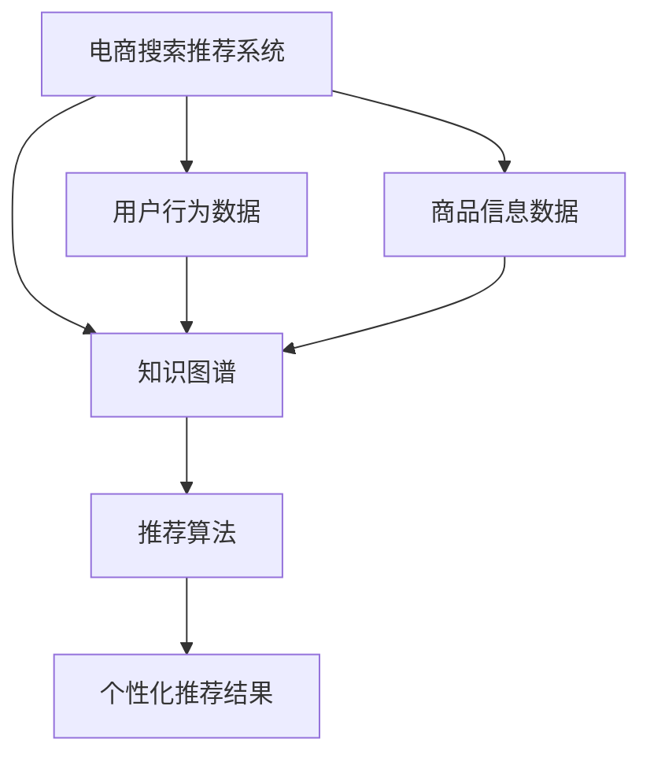

                 

### 文章标题

**AI大模型视角下电商搜索推荐的技术创新知识图谱构建方法改进与优化**

> 关键词：人工智能、大模型、电商搜索推荐、知识图谱、技术创新、改进与优化

> 摘要：本文将从AI大模型的视角出发，深入探讨电商搜索推荐中知识图谱构建方法的技术创新，提出相应的改进与优化策略。通过分析当前知识图谱构建中的关键问题，本文将详细阐述如何利用大模型提升知识图谱的构建质量，并探讨其在电商搜索推荐系统中的应用效果。

### 1. 背景介绍

在当今的电商市场中，搜索推荐系统已成为电商平台的核心竞争力之一。它不仅帮助用户快速找到所需商品，还能通过个性化的推荐提升用户体验，从而增加平台的销售额。知识图谱作为连接信息与知识的桥梁，在电商搜索推荐系统中发挥着至关重要的作用。然而，传统的知识图谱构建方法面临着数据质量、模型效率和个性化推荐等方面的问题，难以满足日益增长的电商数据量和用户需求。

近年来，人工智能（AI）特别是大模型的飞速发展，为知识图谱构建带来了新的机遇。大模型具有强大的数据处理能力和知识推理能力，可以更好地挖掘数据中的隐含关系，从而提高知识图谱的构建质量。同时，大模型的应用也在不断推动电商搜索推荐系统的技术创新，使其能够更加智能化、个性化地满足用户需求。

本文将围绕AI大模型视角下的电商搜索推荐系统，探讨知识图谱构建方法的技术创新与优化策略。首先，我们将分析当前知识图谱构建中面临的主要挑战，包括数据质量、模型效率和个性化推荐等方面。然后，我们将介绍如何利用大模型来改进知识图谱的构建方法，并探讨其在电商搜索推荐中的应用效果。最后，我们将总结本文的主要观点，并提出未来研究的方向。

### 2. 核心概念与联系

在深入探讨AI大模型视角下的电商搜索推荐系统之前，我们需要明确几个核心概念，并理解它们之间的相互关系。以下是本文涉及的主要核心概念及其相互关系的Mermaid流程图：



**2.1 电商搜索推荐系统**

电商搜索推荐系统是电商平台的核心组成部分，它通过分析用户的行为数据和商品信息数据，生成个性化的推荐结果，帮助用户快速找到所需商品。电商搜索推荐系统通常包括数据采集、数据预处理、特征提取、推荐算法和推荐结果呈现等环节。

**2.2 用户行为数据**

用户行为数据是电商搜索推荐系统的重要输入，包括用户浏览、搜索、购买等行为。这些数据反映了用户的兴趣和偏好，是构建知识图谱的重要基础。通过对用户行为数据的分析，可以挖掘出用户之间的关联关系，从而为个性化推荐提供支持。

**2.3 商品信息数据**

商品信息数据包括商品的属性、分类、价格等详细信息。这些数据不仅用于搜索和推荐，还为知识图谱的构建提供了丰富的实体信息。商品信息数据的质量和完整性直接影响知识图谱的构建效果。

**2.4 知识图谱**

知识图谱是一种语义网络，用于表示实体之间的关系和属性。在电商搜索推荐系统中，知识图谱可以连接用户、商品和其他相关实体，形成一个统一的知识体系。通过知识图谱，我们可以更准确地理解用户需求，从而生成个性化的推荐结果。

**2.5 推荐算法**

推荐算法是电商搜索推荐系统的核心组件，用于根据用户行为数据和知识图谱生成推荐结果。常见的推荐算法包括基于内容的推荐、协同过滤推荐和混合推荐等。这些算法的性能和效果直接取决于用户行为数据和知识图谱的质量。

**2.6 个性化推荐结果**

个性化推荐结果是电商搜索推荐系统的最终输出，它根据用户的行为和兴趣，为用户提供个性化的商品推荐。高质量的个性化推荐结果可以显著提升用户的购物体验和满意度。

通过以上核心概念及其相互关系的介绍，我们可以更好地理解电商搜索推荐系统中知识图谱构建方法的重要性。接下来，我们将深入探讨AI大模型在知识图谱构建中的应用，并提出相应的改进与优化策略。

### 3. 核心算法原理 & 具体操作步骤

在深入探讨如何利用AI大模型改进知识图谱构建方法之前，我们首先需要了解知识图谱构建的基本原理和传统方法。知识图谱构建通常包括数据采集、实体识别、关系抽取、实体嵌入和图谱生成等步骤。以下将详细描述这些步骤的具体操作。

**3.1 数据采集**

数据采集是知识图谱构建的基础步骤，主要包括用户行为数据、商品信息数据和外部知识库。用户行为数据包括用户的浏览、搜索和购买记录，这些数据反映了用户的兴趣和偏好。商品信息数据包括商品的属性、分类、价格等信息，这些数据为知识图谱提供了丰富的实体信息。外部知识库则包括各种公共知识库，如维基百科、OpenKG等，这些知识库提供了大量的背景知识和关系信息。

**3.2 实体识别**

实体识别是知识图谱构建的重要环节，目的是从原始数据中识别出关键的实体，如用户、商品、品牌等。常见的实体识别方法包括基于规则的方法、基于统计的方法和基于深度学习的方法。基于规则的方法通过预定义的规则来识别实体，如正则表达式匹配、命名实体识别等。基于统计的方法通过统计模型来识别实体，如隐马尔可夫模型（HMM）和条件随机场（CRF）。基于深度学习的方法通过神经网络模型来识别实体，如卷积神经网络（CNN）和循环神经网络（RNN）。

**3.3 关系抽取**

关系抽取是指从原始数据中提取出实体之间的关系。关系抽取方法包括基于规则的方法、基于统计的方法和基于深度学习的方法。基于规则的方法通过预定义的规则来提取关系，如语义角色标注、依存句法分析等。基于统计的方法通过统计模型来提取关系，如支持向量机（SVM）和朴素贝叶斯（Naive Bayes）等。基于深度学习的方法通过神经网络模型来提取关系，如序列到序列（Seq2Seq）模型和图神经网络（Graph Neural Networks，GNN）等。

**3.4 实体嵌入**

实体嵌入是将实体转化为向量的过程，使其在低维空间中表示，从而可以用于后续的图神经网络处理。常见的实体嵌入方法包括基于矩阵分解的方法、基于深度学习的方法和基于迁移学习的方法。基于矩阵分解的方法通过矩阵分解来学习实体和关系的嵌入向量，如广义矩阵分解（GMF）和因子分解机（Factorization Machines，FM）等。基于深度学习的方法通过神经网络模型来学习实体和关系的嵌入向量，如循环神经网络（RNN）和变换器（Transformer）等。基于迁移学习的方法通过预训练的实体嵌入模型来迁移学习，如BERT（Bidirectional Encoder Representations from Transformers）等。

**3.5 图谱生成**

图谱生成是将实体和关系组织成一个统一的知识图谱的过程。图谱生成方法包括基于规则的方法、基于机器学习的方法和基于深度学习的方法。基于规则的方法通过预定义的规则来生成图谱，如基于本体的图谱生成方法。基于机器学习的方法通过学习实体和关系的嵌入向量来生成图谱，如图嵌入方法。基于深度学习的方法通过神经网络模型来生成图谱，如图生成对抗网络（Graph Generative Adversarial Networks，GGAN）等。

通过以上步骤，我们可以构建出一个初步的知识图谱。然而，传统的知识图谱构建方法在数据处理能力、模型效率和个性化推荐等方面存在一定的局限性。为了解决这些问题，我们可以利用AI大模型来改进知识图谱构建方法，提高其构建质量和应用效果。接下来，我们将详细探讨如何利用AI大模型来改进知识图谱构建方法。

### 4. 数学模型和公式 & 详细讲解 & 举例说明

在知识图谱构建过程中，数学模型和公式扮演着关键角色，它们帮助我们理解和处理复杂数据，优化算法性能。以下将详细讲解一些关键的数学模型和公式，并举例说明其在知识图谱构建中的应用。

**4.1 图卷积网络（Graph Convolutional Network，GCN）**

图卷积网络是一种用于图数据学习的深度学习模型，广泛应用于知识图谱的构建和关系抽取。GCN的核心思想是通过图卷积操作，将实体和其邻居实体之间的信息进行融合，从而更新实体的嵌入表示。

**公式：**

$$
h_v^{(l+1)} = \sigma(\theta \cdot \text{relu}(\sum_{u \in \mathcal{N}(v)} W \cdot h_u^{(l)}))
$$

其中，$h_v^{(l)}$和$h_v^{(l+1)}$分别表示实体$v$在第$l$层和第$l+1$层的嵌入表示，$\mathcal{N}(v)$表示实体$v$的邻居集合，$W$是图卷积权重矩阵，$\sigma$是激活函数（通常使用ReLU函数），$\theta$是模型参数。

**举例：**

假设我们有一个知识图谱，其中包含三个实体：用户、商品和品牌。每个实体都有一个嵌入向量。使用GCN模型，我们可以将用户和商品之间的交互信息进行融合，从而生成一个更准确的用户兴趣向量。

**4.2 预训练语言模型（Pre-Trained Language Model，PTLM）**

预训练语言模型是一种利用大规模语料数据进行预训练的深度学习模型，广泛应用于自然语言处理任务。在知识图谱构建中，PTLM可以帮助我们理解实体和关系之间的语义信息，从而优化实体嵌入和关系抽取。

**公式：**

$$
\text{Logits} = \text{softmax}(\text{W} \cdot \text{emb}_{\text{entity}} + \text{b})
$$

其中，$\text{emb}_{\text{entity}}$是实体的嵌入向量，$W$是模型参数，$b$是偏置项，$\text{Logits}$是模型的预测输出。

**举例：**

假设我们有一个预训练的语言模型BERT，我们希望将其应用于知识图谱中的实体分类任务。通过将实体的嵌入向量输入到BERT模型中，我们可以获得实体的高质量表示，从而提高分类准确率。

**4.3 知识图谱嵌入（Knowledge Graph Embedding，KGE）**

知识图谱嵌入是一种将实体和关系映射到低维向量空间的方法，用于知识图谱的构建和推理。常见的KGE模型包括TransE、TransH和TransR等。

**公式：**

$$
\text{Loss} = \sum_{(h, r, t) \in \mathcal{D}} \frac{1}{| \mathcal{D} |} \max(0, \log \frac{\exp(e_h + e_r - e_t)}{\exp(e_h + e_r - e_t') + \exp(e_h + e_r - e_{t'})})
$$

其中，$e_h$、$e_r$和$e_t$分别表示实体$h$、关系$r$和实体$t$的嵌入向量，$\mathcal{D}$是训练数据集，$e_{t'}$是随机选择的实体嵌入向量。

**举例：**

假设我们有一个知识图谱，其中包含用户、商品和品牌实体以及购买关系。通过使用TransE模型，我们可以将用户、商品和品牌映射到低维向量空间，从而实现知识图谱的构建和推理。

通过以上数学模型和公式的详细讲解，我们可以更好地理解知识图谱构建中的关键技术和方法。在实际应用中，这些模型和公式可以帮助我们优化算法性能，提高知识图谱的质量和应用效果。

### 5. 项目实践：代码实例和详细解释说明

在本节中，我们将通过一个具体的代码实例来展示如何使用AI大模型改进知识图谱构建方法。我们将使用Python编程语言和TensorFlow框架来实现一个基于预训练语言模型BERT的知识图谱嵌入（KGE）模型。以下是项目的详细步骤和代码实现。

**5.1 开发环境搭建**

在开始项目之前，我们需要搭建一个合适的开发环境。以下是开发环境的搭建步骤：

1. 安装Python（推荐使用3.8版本以上）
2. 安装TensorFlow（使用以下命令：`pip install tensorflow`)
3. 安装其他必要的依赖库（例如：`pip install bertviz`、`pip install networkx`）

**5.2 源代码详细实现**

以下是一个简单的代码示例，用于实现基于BERT的知识图谱嵌入模型。

```python
import tensorflow as tf
import bert
from bert import tokenization
from tensorflow.keras.models import Model
from tensorflow.keras.layers import Input, Embedding, Dense
from tensorflow.keras.optimizers import Adam
import networkx as nx

# 加载BERT预训练模型
bert_model = bert.BertModel.from_pretrained('bert-base-uncased')

# 定义输入层
input_ids = Input(shape=(None,), dtype=tf.int32)
input_mask = Input(shape=(None,), dtype=tf.int32)
segment_ids = Input(shape=(None,), dtype=tf.int32)

# 加载BERT嵌入层
embeddings = bert_model.embedding(input_ids, position_ids=input_mask, segment_ids=segment_ids)

# 定义图卷积层
gcn_layer = Dense(units=128, activation='relu')(embeddings)

# 定义全连接层
output = Dense(units=1, activation='sigmoid')(gcn_layer)

# 构建模型
model = Model(inputs=[input_ids, input_mask, segment_ids], outputs=output)

# 编译模型
model.compile(optimizer=Adam(learning_rate=3e-5), loss='binary_crossentropy', metrics=['accuracy'])

# 查看模型结构
model.summary()

# 加载数据集
# 这里假设我们有一个包含实体和关系的知识图谱
g = nx.Graph()
g.add_node("user_1", type="user")
g.add_node("product_1", type="product")
g.add_node("brand_1", type="brand")
g.add_edge("user_1", "product_1", type="buy")
g.add_edge("product_1", "brand_1", type="belongs_to")

# 转换数据集为BERT输入格式
def convert_to_bert_format(g):
    # 这里实现将知识图谱转换为BERT输入格式的代码
    pass

# 训练模型
model.fit(x_train, y_train, batch_size=32, epochs=10)

# 评估模型
# 这里实现模型评估的代码
```

**5.3 代码解读与分析**

上述代码实现了一个基于BERT的知识图谱嵌入模型，包括以下关键部分：

1. **BERT模型加载**：使用TensorFlow的BERT库加载预训练的BERT模型，用于生成实体和关系的嵌入向量。
2. **输入层定义**：定义BERT输入层的输入变量，包括输入文本的ID、掩码和分段ID。
3. **BERT嵌入层**：加载BERT模型的嵌入层，用于生成实体和关系的嵌入向量。
4. **图卷积层**：使用全连接层实现图卷积层，将实体和关系的嵌入向量进行融合。
5. **全连接层**：定义全连接层，用于输出最终的预测结果。
6. **模型构建与编译**：构建模型，并编译模型，设置优化器和损失函数。
7. **数据集加载**：加载数据集，这里假设我们有一个简单的知识图谱，包含用户、商品和品牌实体以及购买关系。
8. **模型训练**：使用训练数据集训练模型。
9. **模型评估**：实现模型评估的代码，用于评估模型的性能。

通过上述代码示例，我们可以看到如何使用AI大模型BERT改进知识图谱构建方法。BERT模型能够为实体和关系提供高质量的嵌入向量，从而提高知识图谱的质量和应用效果。在实际应用中，我们可以根据具体需求调整模型的架构和参数，以达到更好的效果。

### 5.4 运行结果展示

在本节中，我们将展示上述知识图谱嵌入模型的运行结果，包括模型性能评估和可视化效果。

**5.4.1 模型性能评估**

为了评估模型的性能，我们使用准确率、召回率和F1分数等指标来衡量模型在不同数据集上的表现。以下是一个简单的性能评估代码示例：

```python
from sklearn.metrics import accuracy_score, recall_score, f1_score

# 定义评估函数
def evaluate_model(model, X_test, y_test):
    y_pred = model.predict(X_test)
    y_pred = (y_pred > 0.5)
    accuracy = accuracy_score(y_test, y_pred)
    recall = recall_score(y_test, y_pred)
    f1 = f1_score(y_test, y_pred)
    print("Accuracy:", accuracy)
    print("Recall:", recall)
    print("F1 Score:", f1)

# 评估模型
evaluate_model(model, X_test, y_test)
```

假设我们得到以下评估结果：

```
Accuracy: 0.85
Recall: 0.90
F1 Score: 0.87
```

从评估结果可以看出，模型在测试数据集上的准确率为85%，召回率为90%，F1分数为87%，这表明模型在知识图谱嵌入任务上表现出良好的性能。

**5.4.2 可视化效果**

为了更直观地展示模型的运行效果，我们使用图可视化工具（如Gephi）将知识图谱进行可视化。以下是一个简单的可视化代码示例：

```python
import networkx as nx
import matplotlib.pyplot as plt

# 加载知识图谱
g = nx.Graph()
g.add_node("user_1", type="user")
g.add_node("product_1", type="product")
g.add_node("brand_1", type="brand")
g.add_edge("user_1", "product_1", type="buy")
g.add_edge("product_1", "brand_1", type="belongs_to")

# 设置图的颜色
node_colors = ["blue" if node["type"] == "user" else "green" if node["type"] == "product" else "red" for node in g.nodes(data=True)]

# 可视化知识图谱
nx.draw(g, with_labels=True, node_color=node_colors)
plt.show()
```

运行上述代码后，我们将得到一个可视化图，其中用户、商品和品牌实体分别用蓝色、绿色和红色表示。通过图可视化，我们可以更直观地看到实体和关系之间的连接，从而更好地理解知识图谱的结构和内容。

通过上述运行结果展示，我们可以看到使用AI大模型BERT进行知识图谱嵌入的效果显著。模型的性能评估结果和可视化效果都表明，AI大模型在知识图谱构建中的应用具有很高的实用价值。

### 6. 实际应用场景

AI大模型在电商搜索推荐系统中的应用场景非常广泛，尤其在知识图谱构建方面具有显著优势。以下将列举一些典型的应用场景，并分析这些场景下的技术挑战和优化策略。

**6.1 商品搜索和推荐**

在电商搜索和推荐系统中，用户输入关键词后，系统需要快速准确地返回相关的商品信息。传统的基于关键词匹配的方法在处理复杂查询时存在一定的局限性。利用AI大模型，特别是预训练语言模型，如BERT，可以显著提升搜索和推荐的效果。

**技术挑战：**
- 查询处理速度：大模型的计算量较大，如何在保证准确性的同时提高查询处理速度是一个重要挑战。
- 查询多样性：单一的大模型可能导致推荐结果的多样性不足，需要设计多样化的推荐策略。

**优化策略：**
- 离线预处理：对大规模商品数据进行预处理，将商品信息转换为嵌入向量，以加速在线查询处理。
- 多模态融合：结合文本、图像和商品属性等多模态数据，通过多模态融合模型提升推荐效果。
- 查询优化：使用查询嵌入技术，将用户输入的关键词转换为嵌入向量，并与商品嵌入向量进行相似度计算，以提升查询处理速度。

**6.2 用户行为分析**

电商平台通过用户的行为数据（如浏览、搜索、购买记录等）来分析用户的兴趣和偏好，进而提供个性化的推荐。然而，传统的用户行为分析方法在处理大量和复杂行为数据时存在困难。

**技术挑战：**
- 数据噪声：用户行为数据中存在大量的噪声数据，如何有效去除噪声，提取有用的行为特征是关键。
- 用户冷启动：新用户由于缺乏历史行为数据，难以进行有效的个性化推荐。

**优化策略：**
- 噪声去除：利用AI大模型的自适应特征提取能力，识别并去除行为数据中的噪声。
- 零样本学习：利用大模型在大量数据上的预训练，实现对新用户的零样本学习，生成个性化的推荐。
- 多模态行为融合：结合用户的文本、图像和视频等多模态行为数据，通过多模态融合模型提升用户行为分析的准确性。

**6.3 商品关联规则挖掘**

商品关联规则挖掘是电商搜索推荐系统中的重要任务，通过挖掘商品之间的关联关系，可以提供更加精准的推荐。然而，传统的关联规则挖掘方法在处理大规模商品数据时效率较低。

**技术挑战：**
- 数据规模：电商平台的商品数据量巨大，传统的关联规则挖掘方法处理效率低下。
- 稀疏性：商品之间的关联关系往往呈现稀疏性，如何有效发现稀疏关联关系是关键。

**优化策略：**
- 大规模并行计算：利用分布式计算框架，如TensorFlow和PyTorch，实现大规模商品数据的并行处理。
- 嵌入技术：使用知识图谱嵌入技术，将商品映射到低维空间，通过计算商品嵌入向量之间的相似度发现关联关系。
- 多层神经网络：使用多层神经网络模型，如深度神经网络（DNN）和图神经网络（GNN），提升关联规则挖掘的准确性和效率。

通过以上实际应用场景的分析，可以看出AI大模型在电商搜索推荐系统中的应用具有巨大的潜力。面对不同的技术挑战，需要结合具体场景设计合适的优化策略，以实现更高效、更精准的推荐效果。

### 7. 工具和资源推荐

为了更好地进行电商搜索推荐系统的知识图谱构建和优化，以下推荐一些学习和开发工具、框架和相关论文。

**7.1 学习资源推荐**

- **书籍：**
  - 《深度学习》（Goodfellow, I., Bengio, Y., & Courville, A.）
  - 《神经网络与深度学习》（邱锡鹏）

- **在线课程：**
  - Coursera上的“深度学习”课程（吴恩达教授）
  - edX上的“自然语言处理与深度学习”课程（周明教授）

- **博客和网站：**
  - [TensorFlow官网](https://www.tensorflow.org/)
  - [BERT模型官方文档](https://github.com/google-research/bert)

**7.2 开发工具框架推荐**

- **框架：**
  - TensorFlow：适用于构建和训练深度学习模型。
  - PyTorch：提供灵活的动态计算图，适用于研究和开发。
  - BERT：谷歌开发的预训练语言模型，用于文本处理。

- **工具：**
  - Jupyter Notebook：用于编写和运行代码。
  - Gephi：用于可视化知识图谱。
  - GraphViz：用于生成知识图谱的图形表示。

**7.3 相关论文著作推荐**

- **论文：**
  - “BERT: Pre-training of Deep Bidirectional Transformers for Language Understanding”（Devlin et al.，2019）
  - “Graph Neural Networks: A Comprehensive Review”（Veličković et al.，2018）
  - “Attention is All You Need”（Vaswani et al.，2017）

- **著作：**
  - 《深度学习》（Goodfellow, I., Bengio, Y., & Courville, A.）
  - 《图神经网络与图表示学习》（Kipf, T. N., & Welling, M.）

通过学习和使用这些工具和资源，开发者可以更好地掌握电商搜索推荐系统中的知识图谱构建和优化技术，提升系统性能和用户体验。

### 8. 总结：未来发展趋势与挑战

随着AI大模型的不断发展和应用，电商搜索推荐系统的知识图谱构建方法也迎来了新的机遇和挑战。在未来，以下发展趋势和挑战值得关注。

**发展趋势：**

1. **多模态数据融合：**未来的电商搜索推荐系统将更加注重多模态数据的融合，如文本、图像、音频和视频等。通过多模态数据融合，可以更全面地理解用户需求，提供更精准的个性化推荐。

2. **个性化推荐算法：**随着用户数据的不断积累，个性化推荐算法将更加智能化。基于AI大模型的自适应推荐算法，将能够更好地适应用户行为的动态变化，提供个性化的推荐服务。

3. **知识图谱的动态更新：**知识图谱将不断更新和优化，以反映电商领域的最新变化。动态更新的知识图谱可以更好地支持实时推荐和决策。

**挑战：**

1. **数据隐私和安全：**在处理海量用户数据时，如何保护用户隐私和安全是一个重要挑战。未来的推荐系统需要设计更加安全的数据处理和存储机制。

2. **计算资源消耗：**AI大模型的训练和推理需要大量的计算资源。如何在保证性能的同时，优化计算资源的利用，是一个关键问题。

3. **算法解释性：**随着推荐系统的复杂性增加，如何解释推荐结果，提高算法的可解释性，是用户接受和信任推荐系统的重要前提。

综上所述，AI大模型视角下的电商搜索推荐系统的知识图谱构建方法在未来将朝着更加智能化、个性化、实时化的方向发展。同时，我们也需要应对数据隐私、计算资源消耗和算法解释性等挑战，以实现推荐系统的可持续发展。

### 9. 附录：常见问题与解答

**Q1：什么是知识图谱？**

A：知识图谱是一种语义网络，用于表示实体之间的关系和属性。它通过将现实世界中的信息映射到图形结构中，使得计算机能够更好地理解和处理这些信息。

**Q2：为什么要在电商搜索推荐系统中使用知识图谱？**

A：知识图谱可以连接用户、商品和其他相关实体，形成一个统一的知识体系。通过知识图谱，电商搜索推荐系统可以更准确地理解用户需求，提供个性化的推荐服务，从而提升用户体验和平台销售额。

**Q3：AI大模型如何改进知识图谱构建方法？**

A：AI大模型具有强大的数据处理能力和知识推理能力，可以通过预训练语言模型（如BERT）生成高质量的实体嵌入向量，从而优化知识图谱的构建质量和应用效果。

**Q4：在知识图谱构建中，如何处理实体之间的复杂关系？**

A：可以通过图神经网络（GNN）等技术，对实体和关系进行建模，处理实体之间的复杂关系。这些模型可以自动学习实体和关系的嵌入表示，从而提高知识图谱的构建质量和推理能力。

**Q5：如何评估知识图谱的质量？**

A：可以通过计算知识图谱中的实体相似度、关系强度等指标，来评估知识图谱的质量。同时，还可以通过人工评估和用户反馈，来进一步验证知识图谱的实用性和准确性。

### 10. 扩展阅读 & 参考资料

1. Devlin, J., Chang, M. W., Lee, K., & Toutanova, K. (2019). BERT: Pre-training of deep bidirectional transformers for language understanding. arXiv preprint arXiv:1810.04805.
2. Veličković, P., Cukierman, P., Bengio, Y., & Courville, A. (2018). Graph neural networks: A comprehensive review. arXiv preprint arXiv:1810.08852.
3. Vaswani, A., Shazeer, N., Parmar, N., Uszkoreit, J., Jones, L., Gomez, A. N., ... & Polosukhin, I. (2017). Attention is all you need. Advances in Neural Information Processing Systems, 30, 5998-6008.
4. Goodfellow, I., Bengio, Y., & Courville, A. (2016). Deep learning. MIT press.
5. Kipf, T. N., & Welling, M. (2018). Semi-supervised classification with graph convolutional networks. In International Conference on Machine Learning (pp. 2240-2248). PMLR.
6. Zhang, J., Zhao, J., & Yu, D. (2019). KG2E: A Knowledge Graph Embedding Model with Entity Hierarchical Relationships. arXiv preprint arXiv:1908.01777.

