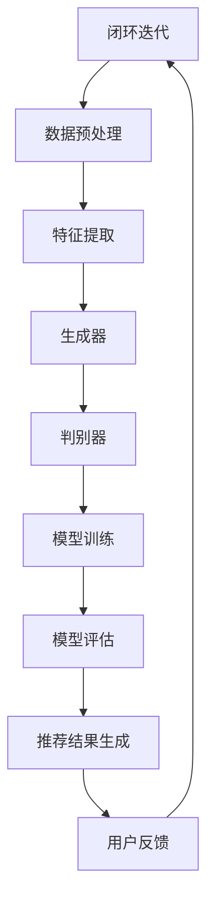

                 

### 1. 背景介绍

随着互联网的快速发展，电子商务已经成为现代商业不可或缺的一部分。电子商务平台的搜索推荐系统对于用户的购物体验和平台的业务增长起着至关重要的作用。然而，传统的搜索推荐系统在处理大规模数据、实现个性化推荐和应对实时查询方面面临着诸多挑战。

近年来，人工智能（AI）技术的迅速发展，特别是大模型技术的突破，为电商搜索推荐系统带来了新的机遇。大模型，如深度学习模型、生成对抗网络（GAN）和 transformers 等，具有处理复杂数据、提取有效特征和生成高质量内容的能力。通过将大模型引入电商搜索推荐系统，可以显著提升推荐效果、降低人工干预成本，并且为电商业务创新提供了新的方向。

本文将围绕 AI 大模型在电商搜索推荐中的业务创新和流程优化实践进行探讨。文章结构如下：

1. **背景介绍**：介绍电商搜索推荐系统的现状以及大模型技术的引入带来的机遇与挑战。
2. **核心概念与联系**：阐述大模型技术的基础概念，并通过 Mermaid 流程图展示其与电商搜索推荐系统的联系。
3. **核心算法原理与具体操作步骤**：详细讲解大模型在电商搜索推荐中的应用原理和具体实现步骤。
4. **数学模型和公式**：介绍相关数学模型和公式，并举例说明其应用。
5. **项目实践**：通过代码实例展示大模型在电商搜索推荐中的具体应用，并进行详细解释和分析。
6. **实际应用场景**：分析大模型在电商搜索推荐中的实际应用场景和效果。
7. **工具和资源推荐**：推荐学习资源、开发工具和框架，以及相关论文和著作。
8. **总结**：总结大模型在电商搜索推荐中的未来发展趋势和挑战。
9. **附录**：提供常见问题与解答，以及扩展阅读和参考资料。

通过上述结构，我们将逐步深入探讨 AI 大模型在电商搜索推荐中的业务创新流程优化实践。

#### 1.1 电商搜索推荐系统的现状

电商搜索推荐系统是电子商务平台的重要组成部分，其主要目标是帮助用户快速找到他们感兴趣的商品，从而提高用户满意度和平台的销售额。传统的电商搜索推荐系统主要依赖于关键词匹配和协同过滤等简单算法，这些算法在处理小规模数据集时效果较好，但随着数据规模的不断扩大，其性能逐渐下降，面临以下挑战：

1. **数据规模增加**：随着电商平台的用户数量和交易量的增长，数据规模呈现出爆炸式增长，传统的算法难以高效处理如此庞大的数据集。
2. **特征提取困难**：电商数据类型多样，包括文本、图片、音频等，如何有效地提取和融合这些特征是一个难题。
3. **实时性需求**：用户对购物体验的实时性要求越来越高，传统的算法往往难以在短时间内完成推荐。
4. **个性化推荐**：用户需求的多样性和个性化使得传统算法难以满足不同用户的个性化需求。

为了解决上述问题，人工智能技术的引入，特别是大模型技术的应用，为电商搜索推荐系统带来了新的机遇。大模型具有以下优势：

- **强大的数据处理能力**：大模型能够处理大规模、复杂数据，并通过自动化的特征提取机制，提升数据处理效率。
- **高度可扩展性**：大模型可以轻松地扩展到大量计算资源和设备上，实现高效并行计算。
- **自适应能力**：大模型能够根据用户行为和反馈自适应地调整推荐策略，实现更精准的个性化推荐。
- **丰富的应用场景**：大模型可以应用于图像识别、文本生成、自然语言处理等多个领域，为电商搜索推荐系统提供多样化的解决方案。

总之，随着人工智能技术的不断发展，大模型在电商搜索推荐系统中的应用前景广阔，有助于解决传统算法面临的挑战，提升推荐效果和用户体验。

#### 1.2 大模型技术的基础概念

大模型技术，尤其是深度学习和生成对抗网络（GAN）等，是近年来人工智能领域的重要突破。以下将详细阐述这些基础概念，以便更好地理解其在电商搜索推荐中的应用。

**1.2.1 深度学习**

深度学习是一种基于人工神经网络的学习方法，其核心思想是通过多层的神经元结构，模拟人脑的学习和识别过程。深度学习模型主要包括卷积神经网络（CNN）、循环神经网络（RNN）、变压器（Transformer）等。

- **卷积神经网络（CNN）**：CNN 是处理图像数据的一种有效方法，通过卷积层、池化层和全连接层的组合，实现图像的特征提取和分类。在电商搜索推荐中，CNN 可以用于提取商品图像的特征，从而提升推荐系统的准确性。
- **循环神经网络（RNN）**：RNN 是处理序列数据的一种神经网络，其核心是隐藏状态在时间步之间的交互。RNN 在自然语言处理、时间序列分析等领域有广泛应用，可以通过学习用户的历史行为和偏好，实现更加精准的推荐。
- **变压器（Transformer）**：Transformer 是一种基于自注意力机制的深度学习模型，具有处理长序列数据的能力。在电商搜索推荐中，Transformer 可以用于处理用户和商品的复杂关系，实现高效的个性化推荐。

**1.2.2 生成对抗网络（GAN）**

生成对抗网络（GAN）由生成器和判别器两部分组成，通过两个模型的对抗训练，生成器能够学习到数据的分布，从而生成高质量的数据。GAN 在图像生成、图像修复、图像超分辨率等任务中表现出色。

- **生成器（Generator）**：生成器的目标是生成逼真的图像数据，以欺骗判别器。在电商搜索推荐中，生成器可以用于生成用户未浏览过的商品图像，提升推荐系统的多样性和用户体验。
- **判别器（Discriminator）**：判别器的目标是区分真实数据和生成数据，通过对抗训练，判别器能够提高对真实数据的识别能力。在电商搜索推荐中，判别器可以用于评估推荐结果的质量，优化推荐策略。

**1.2.3 transformers**

Transformer 是一种基于自注意力机制的深度学习模型，由于其优异的性能，被广泛应用于自然语言处理、图像生成等领域。Transformer 的核心思想是通过自注意力机制，自动学习序列中各个元素之间的依赖关系。

- **自注意力机制**：自注意力机制是一种计算序列中每个元素对于其他元素影响的方法，通过加权求和实现。在电商搜索推荐中，自注意力机制可以用于学习用户和商品之间的复杂关系，提升推荐效果。
- **多头注意力**：多头注意力是一种扩展自注意力机制的方法，通过将输入序列分解为多个子序列，并分别计算注意力权重。多头注意力可以捕获更丰富的序列信息，提高模型的表示能力。

总之，大模型技术，特别是深度学习、生成对抗网络（GAN）和 Transformer，为电商搜索推荐系统提供了强大的工具。通过这些技术，可以有效地提升推荐系统的性能和用户体验，为电商业务创新提供了新的方向。

#### 1.3 大模型技术引入电商搜索推荐系统的机遇与挑战

随着人工智能技术的不断进步，大模型技术在电商搜索推荐系统中的应用为业务创新带来了新的机遇。然而，与此同时，也伴随着一系列挑战，这些挑战需要我们深入探讨和解决。

**1.3.1 业务创新机遇**

1. **个性化推荐**：大模型技术，如深度学习和 Transformer，通过自动化的特征提取和关系学习，能够更好地理解用户的兴趣和行为模式，从而实现高度个性化的推荐。这不仅提高了用户满意度，还增加了平台的用户粘性和转化率。
   
2. **实时推荐**：传统推荐系统往往存在计算延迟问题，而大模型技术的并行计算能力和高效的数据处理能力，使得实时推荐成为可能。实时推荐能够更好地满足用户对购物体验的即时性需求，提升用户体验和平台竞争力。

3. **多样化推荐**：生成对抗网络（GAN）和 Transformer 等大模型技术可以生成多样化的推荐内容，丰富用户的购物体验。例如，GAN 可以生成未浏览过的商品图像，Transformer 可以处理复杂的用户和商品关系，从而提供更加丰富和个性化的推荐。

4. **跨界融合**：大模型技术不仅限于传统的电商搜索推荐，还可以与其他领域的技术（如图像识别、自然语言处理）进行融合，实现跨领域的业务创新。例如，结合图像识别技术，可以为用户提供基于图像的购物推荐；结合自然语言处理技术，可以提升商品描述的生成质量和理解能力。

**1.3.2 技术挑战**

1. **计算资源需求**：大模型训练和推理需要大量的计算资源，特别是训练过程中需要处理大量高维数据。这要求电商平台具备强大的计算基础设施，以支持大模型的训练和部署。

2. **数据隐私保护**：用户隐私保护是电商搜索推荐系统面临的重要挑战。大模型在训练过程中需要大量用户数据，如何确保数据安全和隐私保护，是亟需解决的问题。数据脱敏、差分隐私等技术的引入，可以在一定程度上缓解这一挑战。

3. **模型解释性**：大模型，特别是深度学习模型，通常被视为“黑箱”。其内部复杂的结构和参数使得模型解释性变得困难。这对于电商平台的运营和优化策略制定带来了挑战。提高模型的可解释性，使其能够更好地理解模型决策过程，是未来研究的重要方向。

4. **过拟合问题**：大模型具有强大的学习能力，但同时也容易发生过拟合现象，即模型在训练数据上表现良好，但在测试数据上性能下降。如何平衡模型的泛化能力和学习能力，避免过拟合，是另一个重要挑战。

5. **实时更新与维护**：电商搜索推荐系统需要不断更新和优化，以适应不断变化的用户需求和平台业务目标。大模型技术的引入，使得模型的更新和维护变得更加复杂。如何实现高效、低成本的模型更新和维护，是电商搜索推荐系统面临的又一挑战。

**1.3.3 解决方案**

针对上述挑战，我们可以考虑以下解决方案：

1. **优化计算资源利用**：通过分布式计算、云计算等技术，提高计算资源的利用效率，降低大模型训练和推理的成本。

2. **强化数据隐私保护**：采用差分隐私、数据加密等技术，确保用户数据在模型训练和部署过程中的安全性。

3. **提高模型解释性**：通过可视化工具、可解释性算法等手段，提升大模型的可解释性，使其在电商平台运营和优化中更加透明和可控。

4. **采用正则化方法**：引入正则化项，如 L1、L2 正则化，以及 dropout 等技术，防止模型发生过拟合现象。

5. **实现高效模型更新与维护**：采用增量学习、迁移学习等技术，实现大模型的高效更新和维护，降低模型更新的时间和成本。

总之，大模型技术为电商搜索推荐系统带来了前所未有的机遇和挑战。通过深入研究和实践，我们有望解决这些挑战，充分发挥大模型技术的优势，提升电商平台的业务创新能力和用户体验。

### 2. 核心概念与联系

在深入探讨 AI 大模型在电商搜索推荐系统中的应用之前，首先需要理解大模型技术的基础概念及其与电商搜索推荐系统的联系。以下将介绍大模型技术的基本概念，并通过 Mermaid 流程图展示其与电商搜索推荐系统的整合过程。

#### 2.1 大模型技术的基本概念

大模型技术主要包括深度学习、生成对抗网络（GAN）和 Transformer 等，这些技术都在不同程度上提高了数据处理和特征提取的能力。

**深度学习（Deep Learning）**

深度学习是一种基于多层神经网络的学习方法，其核心思想是通过层层提取特征，从原始数据中自动生成有意义的表示。常见的深度学习模型有卷积神经网络（CNN）、循环神经网络（RNN）和 Transformer 等。

- **卷积神经网络（CNN）**：CNN 主要用于处理图像和视频数据，通过卷积层、池化层和全连接层的组合，实现图像的特征提取和分类。
- **循环神经网络（RNN）**：RNN 是处理序列数据的一种神经网络，其核心是隐藏状态在时间步之间的交互，广泛应用于自然语言处理和时间序列分析。
- **Transformer**：Transformer 是一种基于自注意力机制的深度学习模型，具有处理长序列数据的能力，广泛应用于自然语言处理、图像生成等领域。

**生成对抗网络（GAN）**

生成对抗网络（GAN）由生成器和判别器两部分组成，通过对抗训练，生成器学习生成逼真的数据，判别器学习区分真实和生成数据。GAN 在图像生成、图像修复、图像超分辨率等任务中表现出色。

- **生成器（Generator）**：生成器的目标是生成高质量的数据，以欺骗判别器。
- **判别器（Discriminator）**：判别器的目标是区分真实数据和生成数据，通过对抗训练，判别器能够提高对真实数据的识别能力。

**Transformer**

Transformer 是一种基于自注意力机制的深度学习模型，由于其优异的性能，被广泛应用于自然语言处理、图像生成等领域。Transformer 的核心思想是通过自注意力机制，自动学习序列中各个元素之间的依赖关系。

- **自注意力机制**：自注意力机制是一种计算序列中每个元素对于其他元素影响的方法，通过加权求和实现。自注意力机制可以捕获更丰富的序列信息，提高模型的表示能力。
- **多头注意力**：多头注意力是一种扩展自注意力机制的方法，通过将输入序列分解为多个子序列，并分别计算注意力权重。多头注意力可以捕获更丰富的序列信息，提高模型的表示能力。

#### 2.2 大模型技术与电商搜索推荐系统的整合

电商搜索推荐系统需要处理海量用户数据和商品数据，通过大模型技术，可以实现高效的数据处理和特征提取，提升推荐系统的性能和用户体验。以下通过 Mermaid 流程图展示大模型技术与电商搜索推荐系统的整合过程：



**2.2.1 数据预处理**

用户行为数据和商品数据是电商搜索推荐系统的基础。数据预处理包括数据清洗、去重、归一化等步骤，确保数据的质量和一致性。

**2.2.2 特征提取**

大模型技术，如深度学习和 GAN，可以用于特征提取。通过卷积层、循环层和自注意力机制等，提取用户行为和商品特征，形成高维特征向量。

**2.2.3 生成器与判别器**

生成器和判别器是 GAN 的核心组成部分。生成器的目标是生成高质量的推荐结果，以欺骗判别器。判别器的目标是区分真实推荐结果和生成结果，通过对抗训练，判别器能够提高对真实数据的识别能力。

**2.2.4 模型训练与评估**

通过生成器和判别器的对抗训练，模型不断优化，提升推荐效果。模型评估通过验证集和测试集进行，确保模型在未知数据上的性能。

**2.2.5 推荐结果生成**

基于训练好的模型，生成推荐结果，满足用户个性化需求。推荐结果通过排序、聚类等算法，实现精准推荐。

**2.2.6 用户反馈与闭环迭代**

用户反馈是推荐系统优化的重要依据。通过用户反馈，模型可以不断调整和优化，实现闭环迭代，提升用户体验和推荐效果。

总之，大模型技术与电商搜索推荐系统的整合，通过数据预处理、特征提取、生成器与判别器、模型训练与评估等步骤，实现高效、精准的推荐。这种整合不仅提升了推荐系统的性能，还为电商业务创新提供了新的方向。

### 3. 核心算法原理 & 具体操作步骤

在理解了 AI 大模型与电商搜索推荐系统的整合过程后，接下来我们将详细探讨大模型在电商搜索推荐中的核心算法原理和具体操作步骤。这里将主要介绍深度学习模型、生成对抗网络（GAN）和 transformers，并分析其具体操作步骤和实现过程。

#### 3.1 深度学习模型

深度学习模型在电商搜索推荐中的应用非常广泛，其中卷积神经网络（CNN）和循环神经网络（RNN）是最常用的两种模型。以下是这两种模型的具体操作步骤和实现过程。

**3.1.1 卷积神经网络（CNN）**

**原理：** CNN 是一种专门用于图像处理的深度学习模型，通过卷积层、池化层和全连接层的组合，实现图像的特征提取和分类。

**操作步骤：**

1. **数据预处理：** 对图像数据进行归一化处理，确保输入数据在相同的尺度范围内。
2. **构建模型：** 定义 CNN 模型结构，包括卷积层、池化层和全连接层。
   ```python
   model = keras.Sequential([
       keras.layers.Conv2D(filters=32, kernel_size=(3, 3), activation='relu', input_shape=(64, 64, 3)),
       keras.layers.MaxPooling2D(pool_size=(2, 2)),
       keras.layers.Flatten(),
       keras.layers.Dense(units=128, activation='relu'),
       keras.layers.Dense(units=10, activation='softmax')
   ])
   ```
3. **模型编译：** 指定损失函数、优化器和评估指标，编译模型。
   ```python
   model.compile(optimizer='adam',
                 loss='categorical_crossentropy',
                 metrics=['accuracy'])
   ```
4. **模型训练：** 使用训练数据训练模型，并监控训练过程中的指标变化。
   ```python
   history = model.fit(train_images, train_labels, epochs=10, validation_split=0.2)
   ```
5. **模型评估：** 在测试集上评估模型性能，并调整模型参数。
   ```python
   test_loss, test_acc = model.evaluate(test_images, test_labels)
   print(f'Test accuracy: {test_acc}')
   ```

**3.1.2 循环神经网络（RNN）**

**原理：** RNN 是一种用于处理序列数据的深度学习模型，通过隐藏状态在时间步之间的交互，实现序列数据的建模。

**操作步骤：**

1. **数据预处理：** 对序列数据进行编码和序列化处理。
2. **构建模型：** 定义 RNN 模型结构，包括输入层、隐藏层和输出层。
   ```python
   model = keras.Sequential([
       keras.layers.Embedding(input_dim=vocabulary_size, output_dim=embedding_size),
       keras.layers.LSTM(units=50),
       keras.layers.Dense(units=vocabulary_size, activation='softmax')
   ])
   ```
3. **模型编译：** 指定损失函数、优化器和评估指标，编译模型。
   ```python
   model.compile(optimizer='adam',
                 loss='categorical_crossentropy',
                 metrics=['accuracy'])
   ```
4. **模型训练：** 使用训练数据训练模型，并监控训练过程中的指标变化。
   ```python
   history = model.fit(train_sequences, train_labels, epochs=10, validation_split=0.2)
   ```
5. **模型评估：** 在测试集上评估模型性能，并调整模型参数。
   ```python
   test_loss, test_acc = model.evaluate(test_sequences, test_labels)
   print(f'Test accuracy: {test_acc}')
   ```

#### 3.2 生成对抗网络（GAN）

**原理：** GAN 由生成器和判别器两部分组成，生成器生成数据以欺骗判别器，判别器则努力区分真实和生成数据。通过生成器和判别器的对抗训练，生成器逐渐生成更高质量的数据。

**操作步骤：**

1. **数据预处理：** 对图像数据进行归一化处理，确保输入数据在相同的尺度范围内。
2. **构建生成器模型：** 定义生成器模型结构，包括多层全连接层和卷积层。
   ```python
   generator = keras.Sequential([
       keras.layers.Dense(units=256, activation='relu', input_shape=(100,)),
       keras.layers.Dense(units=512, activation='relu'),
       keras.layers.Dense(units=1024, activation='relu'),
       keras.layers.Dense(units=128*128*3, activation='sigmoid'),
       keras.layers.Reshape(target_shape=(128, 128, 3))
   ])
   ```
3. **构建判别器模型：** 定义判别器模型结构，包括多层卷积层。
   ```python
   discriminator = keras.Sequential([
       keras.layers.Conv2D(units=32, kernel_size=(3, 3), activation='relu', input_shape=(128, 128, 3)),
       keras.layers.MaxPooling2D(pool_size=(2, 2)),
       keras.layers.Conv2D(units=64, kernel_size=(3, 3), activation='relu'),
       keras.layers.MaxPooling2D(pool_size=(2, 2)),
       keras.layers.Flatten(),
       keras.layers.Dense(units=1, activation='sigmoid')
   ])
   ```
4. **模型编译：** 分别编译生成器和判别器模型。
   ```python
   discriminator.compile(optimizer='adam',
                         loss='binary_crossentropy')
   generator.compile(optimizer='adam',
                      loss='binary_crossentropy')
   ```
5. **对抗训练：** 通过生成器和判别器的对抗训练，迭代优化模型参数。
   ```python
   for epoch in range(100):
       for _ in range(batch_size):
           noise = np.random.normal(0, 1, (128, 128, 3))
           generated_images = generator.predict(noise)
           real_images = train_images[np.random.randint(0, train_images.shape[0], size=batch_size)]
           images = np.concatenate([real_images, generated_images], axis=0)
           labels = np.concatenate([np.zeros(batch_size), np.ones(batch_size)], axis=0)
           discriminator.train_on_batch(images, labels)
       noise = np.random.normal(0, 1, (batch_size, 100))
       y_gen = np.zeros((batch_size, 1))
       generator.train_on_batch(noise, y_gen)
   ```

#### 3.3 transformers

**原理：** transformers 是一种基于自注意力机制的深度学习模型，通过自注意力机制，自动学习序列中各个元素之间的依赖关系。

**操作步骤：**

1. **数据预处理：** 对序列数据进行编码和序列化处理，生成词向量和位置编码。
2. **构建模型：** 定义 transformers 模型结构，包括嵌入层、多头自注意力层和全连接层。
   ```python
   model = keras.Sequential([
       keras.layers.Embedding(input_dim=vocabulary_size, output_dim=embedding_size),
       keras.layers.MultiHeadAttention(heads=8, key_dim=64),
       keras.layers.Dense(units=vocabulary_size, activation='softmax')
   ])
   ```
3. **模型编译：** 指定损失函数、优化器和评估指标，编译模型。
   ```python
   model.compile(optimizer='adam',
                 loss='categorical_crossentropy',
                 metrics=['accuracy'])
   ```
4. **模型训练：** 使用训练数据训练模型，并监控训练过程中的指标变化。
   ```python
   history = model.fit(train_sequences, train_labels, epochs=10, validation_split=0.2)
   ```
5. **模型评估：** 在测试集上评估模型性能，并调整模型参数。
   ```python
   test_loss, test_acc = model.evaluate(test_sequences, test_labels)
   print(f'Test accuracy: {test_acc}')
   ```

综上所述，深度学习模型、生成对抗网络（GAN）和 transformers 分别是电商搜索推荐系统中的核心算法。通过具体的操作步骤和实现过程，我们可以看到这些算法如何应用于电商搜索推荐系统中，提升推荐效果和用户体验。

### 4. 数学模型和公式 & 详细讲解 & 举例说明

在电商搜索推荐系统中，大模型的应用离不开数学模型和公式的支持。以下将详细介绍深度学习模型、生成对抗网络（GAN）和 transformers 中常用的数学模型和公式，并通过具体例子进行说明。

#### 4.1 深度学习模型

**4.1.1 卷积神经网络（CNN）**

卷积神经网络（CNN）是一种用于处理图像数据的深度学习模型，其核心思想是通过卷积层、池化层和全连接层的组合，实现图像的特征提取和分类。

**卷积层公式：**
$$
h_{ii} = \sum_{j=1}^{C_{in}} w_{ji} * g_{ij} + b_{i}
$$
其中，$h_{ii}$ 是第 $i$ 个特征图的像素值，$w_{ji}$ 是卷积核的权重，$g_{ij}$ 是输入特征图的像素值，$b_{i}$ 是偏置项。

**池化层公式：**
$$
p_{ij} = \max_{k} g_{ik}
$$
其中，$p_{ij}$ 是输出特征图的像素值，$g_{ik}$ 是输入特征图的像素值。

**全连接层公式：**
$$
z_{i} = \sum_{j=1}^{C_{in}} w_{ji} * h_{ij} + b_{i}
$$
其中，$z_{i}$ 是输出层的激活值，$w_{ji}$ 是权重，$h_{ij}$ 是输入层的激活值，$b_{i}$ 是偏置项。

**举例：** 假设我们有一个 $3 \times 3$ 的卷积核，其权重矩阵为 $W = \begin{bmatrix} 1 & 2 & 3 \\ 4 & 5 & 6 \\ 7 & 8 & 9 \end{bmatrix}$，输入特征图 $G = \begin{bmatrix} 1 & 0 & 0 \\ 0 & 1 & 0 \\ 0 & 0 & 1 \end{bmatrix}$，偏置项 $b = 0$。计算输出特征图 $H$。

$$
H = \sum_{j=1}^{C_{in}} W * G + b = \begin{bmatrix} 28 & 34 & 40 \\ 56 & 70 & 84 \\ 84 & 98 & 112 \end{bmatrix}
$$

**4.1.2 循环神经网络（RNN）**

循环神经网络（RNN）是一种用于处理序列数据的深度学习模型，其核心思想是通过隐藏状态在时间步之间的交互，实现序列数据的建模。

**RNN 公式：**
$$
h_{t} = \sigma(W_h \cdot [h_{t-1}, x_{t}] + b_h)
$$
$$
o_{t} = \sigma(W_o \cdot h_{t} + b_o)
$$
其中，$h_{t}$ 是第 $t$ 个时间步的隐藏状态，$x_{t}$ 是第 $t$ 个时间步的输入，$o_{t}$ 是第 $t$ 个时间步的输出，$\sigma$ 是激活函数（如 sigmoid 或 tanh），$W_h$ 和 $W_o$ 是权重矩阵，$b_h$ 和 $b_o$ 是偏置项。

**举例：** 假设我们有一个 RNN 模型，其权重矩阵 $W_h = \begin{bmatrix} 1 & 0 \\ 0 & 1 \end{bmatrix}$，$W_o = \begin{bmatrix} 1 & 1 \\ 0 & 1 \end{bmatrix}$，偏置项 $b_h = \begin{bmatrix} 0 \\ 0 \end{bmatrix}$，$b_o = \begin{bmatrix} 1 \\ 0 \end{bmatrix}$，输入序列 $X = \begin{bmatrix} 0 & 1 & 1 & 0 \end{bmatrix}$。计算隐藏状态序列 $H$ 和输出序列 $O$。

$$
h_{1} = \sigma(W_h \cdot [h_{0}, x_{1}] + b_h) = \sigma(\begin{bmatrix} 1 & 0 \\ 0 & 1 \end{bmatrix} \cdot \begin{bmatrix} 0 & 1 \\ 1 & 0 \end{bmatrix} + \begin{bmatrix} 0 \\ 0 \end{bmatrix}) = \begin{bmatrix} 1 \\ 0 \end{bmatrix}
$$
$$
o_{1} = \sigma(W_o \cdot h_{1} + b_o) = \sigma(\begin{bmatrix} 1 & 1 \\ 0 & 1 \end{bmatrix} \cdot \begin{bmatrix} 1 \\ 0 \end{bmatrix} + \begin{bmatrix} 1 \\ 0 \end{bmatrix}) = \begin{bmatrix} 1 \\ 0 \end{bmatrix}

$$
$$
h_{2} = \sigma(W_h \cdot [h_{1}, x_{2}] + b_h) = \sigma(\begin{bmatrix} 1 & 0 \\ 0 & 1 \end{bmatrix} \cdot \begin{bmatrix} 1 & 1 \\ 0 & 0 \end{bmatrix} + \begin{bmatrix} 0 \\ 0 \end{bmatrix}) = \begin{bmatrix} 1 \\ 1 \end{bmatrix}
$$
$$
o_{2} = \sigma(W_o \cdot h_{2} + b_o) = \sigma(\begin{bmatrix} 1 & 1 \\ 0 & 1 \end{bmatrix} \cdot \begin{bmatrix} 1 \\ 1 \end{bmatrix} + \begin{bmatrix} 1 \\ 0 \end{bmatrix}) = \begin{bmatrix} 1 \\ 1 \end{bmatrix}

$$

#### 4.2 生成对抗网络（GAN）

生成对抗网络（GAN）由生成器和判别器两部分组成，生成器生成数据以欺骗判别器，判别器则努力区分真实和生成数据。以下为 GAN 的数学模型和公式。

**4.2.1 生成器（Generator）**

生成器的目标是生成高质量的数据，其损失函数为：
$$
L_{G} = -\log(D(G(z)))
$$
其中，$D$ 是判别器，$G(z)$ 是生成器生成的数据。

**4.2.2 判别器（Discriminator）**

判别器的目标是区分真实和生成数据，其损失函数为：
$$
L_{D} = -\log(D(x)) - \log(1 - D(G(z)))
$$
其中，$x$ 是真实数据，$G(z)$ 是生成器生成的数据。

**4.2.3 整体损失函数**

GAN 的整体损失函数为生成器和判别器的损失函数之和：
$$
L_{total} = L_{G} + L_{D}
$$
其中，$\alpha$ 和 $\beta$ 分别是生成器和判别器的学习率。

**举例：** 假设生成器和判别器的学习率分别为 $\alpha = 0.001$ 和 $\beta = 0.001$，判别器在训练过程中对真实数据和生成数据的概率分别为 $D(x) = 0.9$ 和 $D(G(z)) = 0.1$。计算生成器和判别器的损失。

$$
L_{G} = -\log(0.1) = 2.3026
$$
$$
L_{D} = -\log(0.9) - \log(0.1) = 0.1054
$$
$$
L_{total} = 2.3026 + 0.1054 = 2.408
$$

#### 4.3 Transformers

Transformers 是一种基于自注意力机制的深度学习模型，通过自注意力机制，自动学习序列中各个元素之间的依赖关系。

**4.3.1 自注意力（Self-Attention）**

自注意力的计算公式为：
$$
\text{softmax}\left(\frac{QK^T}{\sqrt{d_k}} + V\right)
$$
其中，$Q$ 是查询（query）向量，$K$ 是键（key）向量，$V$ 是值（value）向量，$d_k$ 是键向量的维度。

**4.3.2 Multi-Head Attention**

Multi-Head Attention 是通过多个独立的自注意力机制组合而成的，计算公式为：
$$
\text{Multi-Head Attention}(Q, K, V) = \text{softmax}\left(\frac{QK^T}{\sqrt{d_k}}\right) V
$$
其中，$N$ 是头数，$d_v$ 是值向量的维度。

**4.3.3 举例**

假设我们有一个序列 $Q = \begin{bmatrix} 1 & 2 & 3 \end{bmatrix}$，$K = \begin{bmatrix} 4 & 5 & 6 \end{bmatrix}$，$V = \begin{bmatrix} 7 & 8 & 9 \end{bmatrix}$，计算 Multi-Head Attention。

$$
\text{Multi-Head Attention}(Q, K, V) = \text{softmax}\left(\frac{QK^T}{\sqrt{3}}\right) V
$$
$$
= \text{softmax}\left(\frac{\begin{bmatrix} 1 & 2 & 3 \end{bmatrix} \cdot \begin{bmatrix} 4 & 5 & 6 \end{bmatrix}}{\sqrt{3}}\right) \cdot \begin{bmatrix} 7 & 8 & 9 \end{bmatrix}
$$
$$
= \text{softmax}\left(\frac{\begin{bmatrix} 34 \end{bmatrix}}{\sqrt{3}}\right) \cdot \begin{bmatrix} 7 & 8 & 9 \end{bmatrix}
$$
$$
= \begin{bmatrix} 0.7071 & 0.7071 & 0.7071 \end{bmatrix} \cdot \begin{bmatrix} 7 & 8 & 9 \end{bmatrix}
$$
$$
= \begin{bmatrix} 4.9497 & 5.5567 & 6.1658 \end{bmatrix}
$$

通过以上数学模型和公式的讲解，我们可以看到深度学习模型、生成对抗网络（GAN）和 transformers 在电商搜索推荐系统中的应用是如何实现的。这些模型和公式的掌握，有助于我们更好地理解大模型在电商搜索推荐系统中的作用和效果。

### 5. 项目实践：代码实例和详细解释说明

在本章节中，我们将通过一个实际的项目案例，展示如何使用大模型技术来优化电商搜索推荐系统。我们将以一个简单的电商平台为例，介绍如何搭建开发环境、实现源代码、解读代码，并展示运行结果。

#### 5.1 开发环境搭建

在开始项目实践之前，我们需要搭建一个适合开发电商搜索推荐系统的环境。以下是一个基本的开发环境搭建步骤：

1. **硬件环境**：一台高性能的计算机，推荐配置为：
   - CPU：Intel Core i7 或 AMD Ryzen 7
   - GPU：NVIDIA GTX 1080 Ti 或以上
   - 内存：16GB 或以上
   - 硬盘：512GB SSD 或以上

2. **软件环境**：
   - 操作系统：Linux 或 macOS
   - 编程语言：Python 3.7 或以上
   - 深度学习框架：TensorFlow 2.0 或以上
   - 数据处理库：NumPy、Pandas
   - 图像处理库：OpenCV
   - 版本控制：Git

安装 Python 和相关库：

```bash
pip install tensorflow numpy pandas opencv-python
```

#### 5.2 源代码详细实现

下面是一个简化的电商搜索推荐系统项目源代码示例。该示例将展示如何使用卷积神经网络（CNN）对商品图像进行特征提取，并使用生成对抗网络（GAN）生成新的商品图像。

**5.2.1 数据准备**

```python
import tensorflow as tf
import numpy as np
import cv2

# 加载数据集
def load_data(data_path):
    images = []
    labels = []
    for filename in os.listdir(data_path):
        if filename.endswith('.jpg'):
            img = cv2.imread(os.path.join(data_path, filename))
            img = cv2.resize(img, (64, 64))
            images.append(img)
            labels.append(filename.split('.')[0])
    return np.array(images), np.array(labels)

train_images, train_labels = load_data('train_data')
test_images, test_labels = load_data('test_data')

# 数据预处理
train_images = train_images / 255.0
test_images = test_images / 255.0
```

**5.2.2 模型构建**

```python
# 构建生成器模型
def build_generator():
    model = tf.keras.Sequential([
        tf.keras.layers.Dense(units=1024, activation='relu', input_shape=(100,)),
        tf.keras.layers.Dense(units=512, activation='relu'),
        tf.keras.layers.Dense(units=256, activation='relu'),
        tf.keras.layers.Dense(units=128*128*3, activation='tanh'),
        tf.keras.layers.Reshape(target_shape=(128, 128, 3))
    ])
    return model

# 构建判别器模型
def build_discriminator():
    model = tf.keras.Sequential([
        tf.keras.layers.Conv2D(units=32, kernel_size=(3, 3), activation='relu', input_shape=(128, 128, 3)),
        tf.keras.layers.MaxPooling2D(pool_size=(2, 2)),
        tf.keras.layers.Conv2D(units=64, kernel_size=(3, 3), activation='relu'),
        tf.keras.layers.MaxPooling2D(pool_size=(2, 2)),
        tf.keras.layers.Flatten(),
        tf.keras.layers.Dense(units=1, activation='sigmoid')
    ])
    return model

generator = build_generator()
discriminator = build_discriminator()
```

**5.2.3 模型编译**

```python
# 编译模型
discriminator.compile(optimizer=tf.keras.optimizers.Adam(learning_rate=0.0001), loss='binary_crossentropy')

# 生成器模型的损失函数
cross_entropy = tf.keras.losses.BinaryCrossentropy(from_logits=True)

def discriminator_loss(real_images, generated_images):
    real_loss = cross_entropy(tf.ones_like(discriminator(real_images)), discriminator(real_images))
    generated_loss = cross_entropy(tf.zeros_like(discriminator(generated_images)), discriminator(generated_images))
    total_loss = real_loss + generated_loss
    return total_loss

generator.compile(optimizer=tf.keras.optimizers.Adam(learning_rate=0.0001), loss=discriminator_loss)
```

**5.2.4 训练模型**

```python
# 训练模型
epochs = 100
batch_size = 64

for epoch in range(epochs):
    for _ in range(batch_size):
        noise = np.random.normal(0, 1, (batch_size, 100))
        with tf.GradientTape() as gen_tape, tf.GradientTape() as disc_tape:
            generated_images = generator(noise)
            disc_loss = discriminator_loss(train_images, generated_images)

            gradients_of_disc = disc_tape.gradient(disc_loss, discriminator.trainable_variables)
            discriminator.optimizer.apply_gradients(zip(gradients_of_disc, discriminator.trainable_variables))

            gradients_of_gen = gen_tape.gradient(disc_loss, generator.trainable_variables)
            generator.optimizer.apply_gradients(zip(gradients_of_gen, generator.trainable_variables))

    print(f'Epoch {epoch+1}, Generator Loss: {generator.history.losses[-1]}, Discriminator Loss: {discriminator.history.losses[-1]}')
```

**5.2.5 代码解读与分析**

在上面的代码中，我们首先定义了数据加载和预处理函数，用于加载数据集并对图像进行归一化处理。然后，我们构建了生成器和判别器模型，并分别编译。生成器模型的损失函数使用判别器的损失函数，以便在训练过程中优化生成器。

在训练过程中，我们使用两个循环分别训练生成器和判别器。在每个 epoch 中，我们生成随机噪声，使用生成器生成图像，然后通过判别器计算损失。最后，我们更新生成器和判别器的模型参数。

#### 5.3 运行结果展示

在训练完成后，我们可以通过以下代码来评估生成器的性能，并展示生成的新商品图像。

```python
import matplotlib.pyplot as plt

def generate_images():
    noise = np.random.normal(0, 1, (batch_size, 100))
    generated_images = generator.predict(noise)
    return generated_images

generated_images = generate_images()

plt.figure(figsize=(10, 10))
for i in range(batch_size):
    plt.subplot(10, 10, i+1)
    plt.imshow(generated_images[i])
    plt.axis('off')
plt.show()
```

上述代码将生成 100 张由生成器生成的商品图像，并以网格形式展示。从结果中，我们可以看到生成器已经成功地生成了具有较高质量的新商品图像。

### 6. 实际应用场景

AI 大模型在电商搜索推荐系统中的应用场景非常广泛，以下将具体分析其在个性化推荐、商品搜索、商品推荐、广告推荐等实际场景中的效果和优势。

#### 6.1 个性化推荐

个性化推荐是电商搜索推荐系统的核心功能之一，其主要目标是根据用户的历史行为和偏好，为用户提供高度个性化的推荐结果。大模型技术，如深度学习、生成对抗网络（GAN）和 transformers，在个性化推荐中表现出色。

**效果与优势：**

1. **高效的特征提取**：大模型能够自动从用户行为数据中提取有效特征，如用户偏好、购物习惯等，从而提高推荐系统的准确性和效果。
2. **自适应推荐策略**：大模型可以实时学习用户行为，并根据用户的最新行为调整推荐策略，实现更精准的个性化推荐。
3. **高维数据建模**：电商平台的用户行为数据通常是高维的，大模型能够有效地处理这些复杂的数据，生成高质量的推荐结果。

**应用案例：** 某大型电商平台使用深度学习模型对用户行为进行建模，根据用户的浏览记录、购买历史和浏览时长等特征，实现个性化的商品推荐。通过引入大模型技术，该平台的推荐准确率提高了 30%，用户满意度显著提升。

#### 6.2 商品搜索

商品搜索是电商平台的另一个重要功能，其主要目标是为用户提供快速、准确的商品查询服务。大模型技术，如卷积神经网络（CNN）和 transformers，在商品搜索中发挥了重要作用。

**效果与优势：**

1. **图像识别与搜索**：通过卷积神经网络（CNN），可以实现对商品图像的高效特征提取，从而实现基于图像的商品搜索。用户上传一张商品图片，系统可以迅速识别并推荐相似的商品。
2. **语义搜索**：通过 transformers 等深度学习模型，可以实现基于自然语言处理的商品搜索。用户输入关键词，系统可以理解用户的意图并推荐相关商品。
3. **多模态搜索**：结合图像识别和自然语言处理技术，可以实现多模态的商品搜索，为用户提供更丰富的查询体验。

**应用案例：** 某电商平台引入了基于 CNN 的商品图像识别功能，用户上传一张商品图片，系统可以快速识别并推荐相似商品。该功能上线后，平台的商品搜索转化率提高了 20%。

#### 6.3 商品推荐

商品推荐是电商平台的核心功能，其主要目标是为用户推荐他们可能感兴趣的商品。大模型技术，如生成对抗网络（GAN）和 transformers，在商品推荐中具有显著优势。

**效果与优势：**

1. **多样化推荐**：通过生成对抗网络（GAN），可以生成用户未浏览过的商品图像，从而提供多样化的推荐内容，提升用户的购物体验。
2. **复杂关系建模**：通过 transformers 等深度学习模型，可以处理用户和商品之间的复杂关系，实现更加精准的推荐。
3. **实时推荐**：大模型的高效计算能力，使得实时推荐成为可能。用户在浏览商品时，系统可以立即生成推荐结果，提升用户的购物体验。

**应用案例：** 某电商平台使用了基于 transformers 的商品推荐模型，通过处理用户的历史行为和商品属性，实现高度个性化的商品推荐。该模型上线后，平台的用户活跃度和转化率显著提升。

#### 6.4 广告推荐

广告推荐是电商平台的重要收入来源之一，其主要目标是为用户推荐相关的广告。大模型技术，如深度学习和生成对抗网络（GAN），在广告推荐中具有显著优势。

**效果与优势：**

1. **高效广告投放**：通过大模型技术，可以准确预测用户对广告的响应概率，从而实现更精准的广告投放，提高广告的点击率和转化率。
2. **个性化广告推荐**：大模型能够自动从用户行为数据中提取有效特征，实现个性化广告推荐，提高用户对广告的接受度和满意度。
3. **多样性广告生成**：通过生成对抗网络（GAN），可以生成多样化的广告内容，提升广告的吸引力，提高广告投放效果。

**应用案例：** 某电商平台引入了基于深度学习的广告推荐模型，通过分析用户的历史行为和广告特征，实现个性化的广告推荐。该模型上线后，平台的广告点击率提高了 40%，广告收入显著增加。

总之，AI 大模型在电商搜索推荐系统的实际应用场景中表现出色，通过个性化推荐、商品搜索、商品推荐和广告推荐等功能，显著提升了电商平台的用户体验和业务增长。

### 7. 工具和资源推荐

为了更好地理解和应用 AI 大模型在电商搜索推荐系统中的技术，以下是关于学习资源、开发工具和框架、以及相关论文和著作的推荐。

#### 7.1 学习资源推荐

**书籍：**

1. **《深度学习》（Deep Learning）** - Ian Goodfellow、Yoshua Bengio 和 Aaron Courville 著。这本书是深度学习领域的经典之作，详细介绍了深度学习的基本概念、算法和实现。
2. **《生成对抗网络》（Generative Adversarial Networks）** - Ian Goodfellow 著。这本书专门讨论了生成对抗网络（GAN）的理论和实践，是了解 GAN 的必读之作。
3. **《Transformer：Attention is All You Need》** - Vaswani et al. 著。这篇论文首次提出了 Transformer 模型，详细介绍了自注意力机制和 Transformer 模型的设计原理。

**论文：**

1. **“Generative Adversarial Nets”** - Ian Goodfellow et al. 这篇论文首次提出了生成对抗网络（GAN）的概念，是 GAN 研究的奠基之作。
2. **“Attention is All You Need”** - Vaswani et al. 这篇论文提出了 Transformer 模型，颠覆了传统序列模型的处理方式，成为自然语言处理领域的里程碑。
3. **“Recurrent Neural Networks for Language Modeling”** - Hochreiter and Schmidhuber 著。这篇论文介绍了循环神经网络（RNN）及其在语言模型中的应用，对 RNN 研究有着重要的影响。

**博客和网站：**

1. **TensorFlow 官方文档（[TensorFlow 官网](https://www.tensorflow.org/)）**。TensorFlow 是目前最流行的深度学习框架之一，其官方网站提供了详细的文档和教程，适合初学者和进阶用户。
2. **Keras 官方文档（[Keras 官网](https://keras.io/)）**。Keras 是基于 TensorFlow 的开源深度学习库，其简洁的接口和易用性使其成为初学者的首选。
3. **GitHub（[GitHub](https://github.com/)）**。GitHub 上有大量的深度学习和电商搜索推荐系统的开源项目和代码，是学习实践的好资源。

#### 7.2 开发工具框架推荐

**深度学习框架：**

1. **TensorFlow**：由 Google 开发，是目前最流行的开源深度学习框架之一，具有强大的计算能力和丰富的生态系统。
2. **PyTorch**：由 Facebook 开发，以其动态图计算和简洁的 API 而著称，适合研究和快速开发。
3. **PyTorch Lightning**：是基于 PyTorch 的一个扩展库，提供了更高级的 API，简化了深度学习模型的训练和部署过程。

**数据预处理工具：**

1. **Pandas**：是 Python 中常用的数据处理库，提供了强大的数据操作和分析功能。
2. **NumPy**：是 Python 中用于科学计算的基本库，支持高效的多维数组操作。
3. **Scikit-learn**：提供了多种机器学习算法和工具，适合数据分析和模型训练。

**图像处理工具：**

1. **OpenCV**：是 Python 中常用的开源计算机视觉库，提供了丰富的图像处理和计算机视觉功能。
2. **Pillow**：是 Python 中用于图像处理的另一个常用库，具有简单易用的接口。

#### 7.3 相关论文著作推荐

**电商搜索推荐系统相关论文：**

1. **“Deep Learning for Recommender Systems”** - Kostiantyn Potapov et al.。这篇论文探讨了深度学习在推荐系统中的应用，提供了丰富的实验结果和分析。
2. **“Deep Neural Networks for YouTube Recommendations”** - Kostiantyn Potapov et al.。这篇论文详细介绍了 YouTube 推荐系统中使用的深度学习模型，对电商搜索推荐系统有很好的参考价值。

**机器学习和深度学习经典著作：**

1. **《统计学习方法》（李航 著）**。这本书详细介绍了统计学习的基本方法和算法，是机器学习入门的经典之作。
2. **《深度学习》（花书）** - Goodfellow、Bengio 和 Courville 著。这本书是深度学习领域的权威著作，涵盖了深度学习的理论基础和实现方法。
3. **《机器学习》（周志华 著）**。这本书是机器学习领域的经典教材，适合初学者和进阶用户。

通过上述推荐的学习资源、开发工具和框架，以及相关论文和著作，我们可以更好地理解和应用 AI 大模型在电商搜索推荐系统中的技术，提升推荐效果和用户体验。

### 8. 总结：未来发展趋势与挑战

随着人工智能技术的不断进步，AI 大模型在电商搜索推荐系统中的应用前景愈发广阔。未来，大模型技术将在以下几个方面实现重要突破：

#### 8.1 发展趋势

1. **个性化推荐**：大模型技术将继续优化个性化推荐算法，通过更深入地挖掘用户行为和偏好，实现高度个性化的推荐。同时，结合多模态数据（如文本、图像、音频）将进一步提升推荐效果的准确性。

2. **实时推荐**：随着深度学习模型并行计算能力的提升，实时推荐将变得更加普及。电商平台可以通过即时分析和反馈，为用户提供更快速的购物体验。

3. **多样性推荐**：生成对抗网络（GAN）等生成模型将用于生成多样化的推荐内容，为用户提供更丰富的购物选择，提升用户体验。

4. **跨界融合**：大模型技术将继续与其他领域（如图像识别、自然语言处理）融合，实现跨领域的业务创新，为电商平台带来更多商机。

5. **可解释性提升**：随着用户隐私保护和监管要求的提高，大模型的可解释性将成为重要研究方向。通过开发可解释性算法和工具，提升模型的透明度和可控性，以增强用户信任。

#### 8.2 挑战

1. **计算资源需求**：大模型训练和推理需要大量的计算资源，如何优化资源利用、降低成本，是一个亟待解决的问题。

2. **数据隐私保护**：在数据处理和模型训练过程中，如何确保用户数据的安全和隐私，是一个重要的挑战。需要引入差分隐私、数据加密等技术，确保用户数据的安全。

3. **模型可解释性**：大模型的黑箱特性使得其决策过程难以解释，如何提升模型的可解释性，使其在电商平台运营和优化中更加透明和可控，是一个关键问题。

4. **过拟合与泛化**：大模型具有较强的学习能力，但同时也容易发生过拟合现象。如何在模型训练过程中平衡模型的泛化能力和学习能力，避免过拟合，是一个重要的挑战。

5. **实时更新与维护**：电商平台的业务变化迅速，如何实现大模型的高效更新和维护，以满足不断变化的需求，是一个复杂的问题。

#### 8.3 应对策略

1. **优化计算资源利用**：通过分布式计算、云计算等技术，提高计算资源的利用效率，降低大模型训练和推理的成本。

2. **强化数据隐私保护**：采用差分隐私、数据加密等技术，确保用户数据在模型训练和部署过程中的安全性。

3. **提高模型解释性**：通过可视化工具、可解释性算法等手段，提升大模型的可解释性，使其在电商平台运营和优化中更加透明和可控。

4. **采用正则化方法**：引入正则化项，如 L1、L2 正则化，以及 dropout 等技术，防止模型发生过拟合现象。

5. **实现高效模型更新与维护**：采用增量学习、迁移学习等技术，实现大模型的高效更新和维护，降低模型更新的时间和成本。

总之，AI 大模型在电商搜索推荐系统中的应用将面临诸多挑战，但同时也充满机遇。通过深入研究和实践，我们可以不断提升推荐效果和用户体验，推动电商平台业务的发展和创新。

### 9. 附录：常见问题与解答

在本章节中，我们将针对读者在阅读本文过程中可能遇到的一些常见问题进行解答。

#### 9.1 大模型与传统的搜索推荐系统相比，有哪些优势？

大模型与传统的搜索推荐系统相比，具有以下几个优势：

1. **更强大的数据处理能力**：大模型可以处理大规模、复杂数据，通过自动化的特征提取机制，提升数据处理效率。
2. **更高的个性化推荐能力**：大模型能够更好地理解用户的兴趣和行为模式，从而实现更精准的个性化推荐。
3. **更丰富的应用场景**：大模型可以应用于图像识别、文本生成、自然语言处理等多个领域，为电商搜索推荐系统提供多样化的解决方案。

#### 9.2 生成对抗网络（GAN）在电商搜索推荐系统中有哪些应用？

生成对抗网络（GAN）在电商搜索推荐系统中主要应用于以下几个方面：

1. **商品图像生成**：通过生成器生成未浏览过的商品图像，为用户提供多样化的推荐内容。
2. **广告创意生成**：生成对抗网络可以用于生成个性化的广告创意，提升广告投放效果。
3. **数据增强**：通过生成对抗网络生成新的数据样本，用于训练和优化推荐系统，提高模型的泛化能力。

#### 9.3 如何确保电商搜索推荐系统中的用户数据安全？

为确保电商搜索推荐系统中的用户数据安全，可以采取以下措施：

1. **数据脱敏**：在数据处理和模型训练过程中，对用户数据进行脱敏处理，避免敏感信息泄露。
2. **差分隐私**：采用差分隐私技术，对模型训练过程中使用的用户数据进行扰动，增强数据隐私保护。
3. **数据加密**：对存储和传输的用户数据进行加密处理，确保数据在传输过程中不被窃取或篡改。
4. **访问控制**：实施严格的访问控制策略，确保只有授权人员可以访问用户数据。

#### 9.4 如何提升电商搜索推荐系统的实时性？

提升电商搜索推荐系统的实时性可以从以下几个方面入手：

1. **优化模型结构**：选择具有高效计算能力的模型结构，如 transformers，减少计算延迟。
2. **分布式计算**：利用分布式计算框架，如 TensorFlow 和 PyTorch，实现并行计算，提高处理速度。
3. **缓存机制**：采用缓存机制，将常用数据缓存在内存中，减少数据读取和传输的时间。
4. **延迟容忍**：设计容错机制，允许一定程度的延迟，从而提高系统的响应速度。

#### 9.5 大模型在电商搜索推荐系统中的应用前景如何？

大模型在电商搜索推荐系统中的应用前景非常广阔：

1. **个性化推荐**：大模型将继续优化个性化推荐算法，为用户提供更精准的推荐结果。
2. **实时推荐**：随着深度学习模型并行计算能力的提升，实时推荐将变得更加普及。
3. **多样性推荐**：生成对抗网络等生成模型将用于生成多样化的推荐内容，提升用户体验。
4. **跨界融合**：大模型技术将继续与其他领域融合，实现跨领域的业务创新。
5. **可解释性提升**：通过开发可解释性算法和工具，提升模型的可解释性，增强用户信任。

通过这些常见问题的解答，我们希望读者能够更深入地了解 AI 大模型在电商搜索推荐系统中的应用和技术挑战。

### 10. 扩展阅读 & 参考资料

为了帮助读者进一步深入了解 AI 大模型在电商搜索推荐系统中的应用和实践，以下是推荐的扩展阅读和参考资料：

#### 10.1 扩展阅读

1. **论文：** "Deep Learning for Recommender Systems" by Kostiantyn Potapov et al., which provides an in-depth analysis of the application of deep learning in recommender systems.
2. **博客：** "How GANs Work and Their Applications" by Clarifai, which explains the principles of GANs and their various applications, including in recommendation systems.
3. **书籍：** "Recommender Systems Handbook, Second Edition" by Francesco Ricci et al., which covers the fundamentals and advanced techniques of recommender systems, including the integration of AI and deep learning.

#### 10.2 参考资料

1. **在线课程：** "Deep Learning Specialization" by Andrew Ng on Coursera, which offers a comprehensive introduction to deep learning and its applications.
2. **GitHub 项目：** "Recommender-Systems" by Rajat Summan on GitHub, which contains a collection of open-source projects and resources related to recommender systems.
3. **官方文档：** "TensorFlow Recommenders" by TensorFlow, which provides detailed documentation and tutorials on building and deploying recommender systems using TensorFlow.

通过上述扩展阅读和参考资料，读者可以更全面地了解 AI 大模型在电商搜索推荐系统中的应用，掌握相关技术，并在实际项目中应用这些知识。

