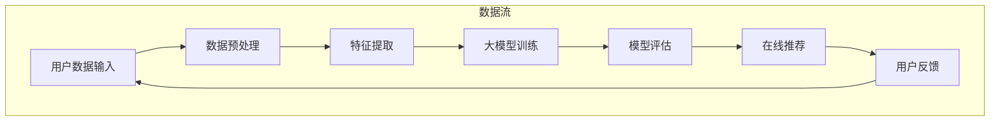

                 

### 1. 背景介绍

在当今快速发展的互联网时代，电子商务已经成为全球经济的重要驱动力。随着电商平台的日益繁荣，用户对于个性化搜索推荐的需求也不断增长。传统的电商搜索推荐系统大多依赖于基于内容匹配（Content-Based Filtering）和协同过滤（Collaborative Filtering）的方法，但这些方法在应对复杂查询和高维度数据时存在诸多局限性。

近年来，随着人工智能技术的飞速发展，大模型（Large-scale Models）开始在电商搜索推荐领域崭露头角。大模型，尤其是基于深度学习的大型神经网络模型，具有强大的表示能力和泛化能力，能够处理大规模、高维度的数据，为电商搜索推荐带来了全新的技术范式。本篇文章将深入探讨大模型如何重塑电商搜索推荐的技术范式，解析其核心算法原理、应用场景以及未来发展趋势。

首先，我们需要了解大模型的基本概念和发展历程。大模型通常是指具有数十亿甚至千亿级参数的深度学习模型，如 Transformer、BERT、GPT 等模型。这些模型通过在大量数据上进行训练，能够捕捉到数据中的复杂模式和潜在关系。与传统机器学习方法相比，大模型具有以下几个显著优势：

1. **强大的表示能力**：大模型能够自动学习数据的低维表示，能够处理高维度的稀疏数据。
2. **优秀的泛化能力**：通过在大量数据上进行训练，大模型能够泛化到未见过的数据上，具有更强的预测准确性。
3. **自适应能力**：大模型可以根据不同的业务场景和需求进行调整和优化。

在电商搜索推荐领域，大模型的应用不仅提升了系统的推荐效果，还带来了以下几个显著的技术变革：

1. **个性化推荐**：大模型能够通过深入分析用户的搜索历史、浏览行为、购买记录等数据，为用户提供高度个性化的推荐结果。
2. **实时推荐**：大模型能够在短时间内处理和分析大量用户数据，实现实时推荐。
3. **多模态推荐**：大模型可以融合文本、图像、音频等多模态数据，为用户提供更丰富、更全面的推荐结果。

总之，大模型在电商搜索推荐领域的应用正在重塑传统的技术范式，为用户带来更好的体验。接下来，我们将深入探讨大模型的核心算法原理、数学模型和实际应用，以全面解析大模型如何实现这些技术变革。

### 2. 核心概念与联系

要深入理解大模型在电商搜索推荐中的具体应用，首先需要明确几个核心概念和它们之间的联系。以下将介绍大模型、电商搜索推荐系统、以及它们是如何相互关联的。

#### 2.1 大模型

大模型，通常指的是具有巨大参数量的深度学习模型，这些模型通过训练大量数据，可以学习到数据的复杂结构和潜在特征。典型的例子包括基于 Transformer 架构的 BERT、GPT 系列，以及基于自注意力机制的深度神经网络。

#### 2.2 电商搜索推荐系统

电商搜索推荐系统是电商平台的基石之一，它通过分析用户的搜索历史、浏览行为和购买记录等数据，为用户提供个性化的商品推荐。传统的推荐系统主要依赖于基于内容匹配和协同过滤的方法，但这些方法在面对高维度、多样化数据时存在瓶颈。

#### 2.3 大模型与电商搜索推荐系统的关联

大模型在电商搜索推荐系统中的应用主要体现在以下几个方面：

1. **增强表示能力**：大模型可以自动学习到用户和商品的高维特征表示，这些特征表示能够更加准确地捕捉用户需求和商品属性。

2. **提升推荐效果**：通过大规模数据训练，大模型具有优秀的泛化能力，可以更精确地预测用户的喜好和需求，从而提升推荐系统的推荐效果。

3. **多模态数据处理**：大模型能够处理多种类型的数据，例如文本、图像、音频等，使得推荐系统能够提供更丰富的推荐体验。

#### 2.4 Mermaid 流程图

为了更直观地展示大模型在电商搜索推荐系统中的应用流程，以下是一个简化的 Mermaid 流程图：



- **A[用户数据输入]**：用户在电商平台上的搜索历史、浏览行为和购买记录等数据。
- **B[数据预处理]**：对原始数据进行清洗、去噪和归一化处理。
- **C[特征提取]**：利用大模型自动学习用户和商品的特征表示。
- **D[大模型训练]**：通过大规模数据训练，优化模型参数。
- **E[模型评估]**：评估模型的效果，包括准确率、召回率等指标。
- **F[在线推荐]**：根据训练好的模型，实时生成个性化推荐结果。
- **G[用户反馈]**：用户对推荐结果的反馈，用于进一步优化模型。

通过这个流程图，我们可以看到大模型在电商搜索推荐系统中的关键角色，以及数据流动的过程。

总之，大模型通过其强大的表示能力和优秀的泛化能力，正在逐渐改变电商搜索推荐系统的技术范式，为用户提供更加个性化、精准的推荐服务。接下来的章节中，我们将进一步深入探讨大模型的核心算法原理和具体实现步骤。

### 3. 核心算法原理 & 具体操作步骤

#### 3.1 深度学习算法的基本原理

深度学习算法是构建大模型的核心技术，其基本原理可以概括为以下几个步骤：

1. **数据输入与预处理**：首先，将原始数据进行清洗和预处理，如去除噪声、缺失值填充、归一化等，以确保数据质量。

2. **特征提取**：利用神经网络模型对输入数据进行特征提取，将高维度的原始数据映射到低维度的特征空间中。这一步骤通过多个隐藏层（Hidden Layers）的神经网络实现，每一层都能够学习到更高层次的特征。

3. **模型训练**：使用大量标记数据对神经网络进行训练，通过反向传播算法（Backpropagation）不断优化模型参数，使模型能够在未见过的数据上取得良好的性能。

4. **模型评估**：通过交叉验证（Cross Validation）等手段，评估模型在测试集上的性能，选择最优模型。

5. **模型应用**：将训练好的模型部署到生产环境中，实现实时推荐。

#### 3.2 常见的深度学习模型

在电商搜索推荐系统中，常见的深度学习模型包括以下几种：

1. **深度神经网络（DNN）**：DNN 是一种前馈神经网络，通过多层非线性变换来提取特征。其结构简单，易于实现，但在处理高维数据和复杂关系时性能有限。

2. **卷积神经网络（CNN）**：CNN 主要用于图像处理，其独特的卷积操作和池化操作使其能够高效地提取图像中的局部特征。通过扩展到序列数据上，CNN 可以用于文本分类、语音识别等领域。

3. **循环神经网络（RNN）**：RNN 能够处理序列数据，通过循环结构，对序列中的每一个元素进行建模，适用于时间序列预测、自然语言处理等任务。

4. **长短时记忆网络（LSTM）**：LSTM 是 RNN 的一个变种，通过引入门控机制，解决了传统 RNN 在处理长序列数据时的梯度消失问题，适用于需要长时间记忆的任务，如语音识别、机器翻译等。

5. **Transformer 模型**：Transformer 是一种基于自注意力机制的深度学习模型，其核心思想是将序列数据转换为向量，并通过多头自注意力机制和前馈神经网络进行特征提取和建模。BERT、GPT 等大型模型均基于 Transformer 架构，具有强大的表示能力和泛化能力。

#### 3.3 大模型的训练步骤

以下是使用 Transformer 模型进行电商搜索推荐的大模型训练步骤：

1. **数据准备**：
   - 收集并预处理用户数据，包括用户搜索历史、浏览记录、购买记录等。
   - 收集商品数据，包括商品描述、分类、标签等。
   - 将用户和商品数据转换为序列形式，例如使用商品 ID 或文本序列表示。

2. **模型架构**：
   - 定义 Transformer 模型的架构，包括嵌入层（Embedding Layer）、多头自注意力层（Multi-Head Self-Attention Layer）、前馈神经网络（Feedforward Neural Network）等。
   - 设置模型的参数，如嵌入维度、自注意力头数、隐藏层尺寸等。

3. **模型训练**：
   - 使用训练数据对模型进行训练，通过反向传播算法优化模型参数。
   - 调整学习率、批次大小等超参数，以获得最佳训练效果。

4. **模型评估**：
   - 使用交叉验证等方法，评估模型在测试集上的性能。
   - 根据评估结果调整模型结构或超参数。

5. **模型部署**：
   - 将训练好的模型部署到生产环境中，实现实时推荐。
   - 根据用户反馈和实际效果，对模型进行持续优化。

#### 3.4 代码示例

以下是一个简化的 Python 代码示例，展示了如何使用 Transformer 模型进行电商搜索推荐：

```python
import tensorflow as tf
from tensorflow.keras.layers import Embedding, MultiHeadAttention, Dense

# 定义模型
model = tf.keras.Sequential([
    Embedding(input_dim=vocab_size, output_dim=embedding_dim),
    MultiHeadAttention(num_heads=num_heads, key_dim=key_dim),
    Dense(units=hidden_size),
    Dense(units=num_classes, activation='softmax')
])

# 编译模型
model.compile(optimizer='adam', loss='categorical_crossentropy', metrics=['accuracy'])

# 训练模型
model.fit(x_train, y_train, epochs=num_epochs, batch_size=batch_size, validation_split=0.1)

# 预测
predictions = model.predict(x_test)
```

在这个示例中，`Embedding` 层用于将输入序列转换为向量表示，`MultiHeadAttention` 层实现多头自注意力机制，`Dense` 层用于输出预测结果。

总之，深度学习算法和大模型的引入，为电商搜索推荐系统带来了革命性的变革。通过以上步骤和代码示例，我们可以看到大模型如何实现个性化、实时和多模态的推荐。接下来，我们将进一步探讨大模型在数学模型和具体实现中的应用。

### 4. 数学模型和公式 & 详细讲解 & 举例说明

#### 4.1 机器学习与深度学习的基本数学模型

在深入探讨大模型在电商搜索推荐中的应用之前，我们先回顾一下机器学习和深度学习的基本数学模型。这些模型构成了大模型的理论基础。

##### 4.1.1 线性回归模型

线性回归模型是最基础的机器学习模型之一，其数学公式如下：

$$
y = \beta_0 + \beta_1x_1 + \beta_2x_2 + \ldots + \beta_nx_n
$$

其中，$y$ 是预测值，$x_1, x_2, \ldots, x_n$ 是输入特征，$\beta_0, \beta_1, \beta_2, \ldots, \beta_n$ 是模型的参数。线性回归模型通过最小化预测值与实际值之间的误差平方和来优化参数。

##### 4.1.2 逻辑回归模型

逻辑回归模型常用于分类问题，其数学公式如下：

$$
P(y=1) = \frac{1}{1 + e^{-(\beta_0 + \beta_1x_1 + \beta_2x_2 + \ldots + \beta_nx_n)}}
$$

其中，$P(y=1)$ 是预测类别为1的概率，$e$ 是自然底数。逻辑回归通过最大化似然函数来优化参数。

##### 4.1.3 神经网络模型

神经网络模型是深度学习的基础，其数学模型可以表示为：

$$
a_{l+1} = \sigma(g_{l+1}(W_{l+1}a_l + b_{l+1}))
$$

其中，$a_{l+1}$ 是第$l+1$ 层的激活值，$\sigma$ 是激活函数（如 sigmoid、ReLU、Tanh），$g_{l+1}$ 是非线性变换函数，$W_{l+1}$ 和 $b_{l+1}$ 分别是权重和偏置。

神经网络通过多层非线性变换来提取特征，每一层的输出作为下一层的输入。

##### 4.1.4 深度学习优化算法

在深度学习模型训练过程中，优化算法用于最小化损失函数。常见的优化算法包括梯度下降（Gradient Descent）及其变种，如随机梯度下降（Stochastic Gradient Descent，SGD）和批量梯度下降（Batch Gradient Descent）。

梯度下降算法的基本公式如下：

$$
\theta_{t+1} = \theta_{t} - \alpha \nabla_{\theta}J(\theta)
$$

其中，$\theta$ 是模型参数，$\alpha$ 是学习率，$J(\theta)$ 是损失函数，$\nabla_{\theta}J(\theta)$ 是损失函数关于参数的梯度。

#### 4.2 大模型在电商搜索推荐中的数学模型

大模型在电商搜索推荐中的应用主要依赖于自注意力机制和Transformer架构。以下将详细介绍这些数学模型。

##### 4.2.1 自注意力机制

自注意力机制（Self-Attention）是 Transformer 模型的核心组件，其数学公式如下：

$$
\text{Attention}(Q, K, V) = \text{softmax}\left(\frac{QK^T}{\sqrt{d_k}}\right)V
$$

其中，$Q, K, V$ 分别是查询（Query）、键（Key）和值（Value）向量，$d_k$ 是键向量的维度。自注意力机制通过计算每个键和查询之间的相似度，将关键信息进行加权聚合，从而提取重要特征。

##### 4.2.2 Transformer 模型

Transformer 模型基于自注意力机制，其基本结构可以表示为：

$$
\text{Transformer}(X) = \text{MultiHeadAttention}(X) + X
$$

其中，$X$ 是输入序列，$\text{MultiHeadAttention}$ 是多头自注意力机制。Transformer 模型通过多个自注意力层和前馈神经网络（Feedforward Neural Network）进行特征提取和建模，实现序列数据的编码和解码。

##### 4.2.3 BERT 模型

BERT（Bidirectional Encoder Representations from Transformers）是基于 Transformer 的预训练语言模型，其预训练过程包括以下两个阶段：

1. **Masked Language Modeling（MLM）**：
   - 随机掩码部分输入单词，预测这些被掩码的单词。
   - 公式表示为：$p(w_t|w_{<t}, w_{>t})$。

2. **Next Sentence Prediction（NSP）**：
   - 预测两个句子之间的顺序关系。
   - 公式表示为：$p(\text{next sentence}| \text{context})$。

BERT 通过这两个任务预训练，获得丰富的语言表示能力，从而在下游任务中表现优异。

##### 4.2.4 电商搜索推荐中的大模型应用

在电商搜索推荐系统中，大模型的应用主要包括以下几个方面：

1. **用户行为序列建模**：
   - 使用 BERT 或其他 Transformer 模型对用户行为序列进行编码，提取用户兴趣特征。
   - 公式表示为：$\text{User\_Representation} = \text{BERT}(\text{User\_Behavior\_Sequence})$。

2. **商品特征提取**：
   - 对商品描述、标签等数据进行编码，提取商品属性特征。
   - 公式表示为：$\text{Item\_Representation} = \text{BERT}(\text{Item\_Description})$。

3. **推荐算法**：
   - 利用用户和商品特征进行相似度计算，生成推荐列表。
   - 公式表示为：$\text{Recommendation} = \text{Similarity}(\text{User\_Representation}, \text{Item\_Representation})$。

#### 4.3 举例说明

假设有一个电商搜索推荐系统，用户的行为序列为 `[user\_行为1, user\_行为2, user\_行为3, ...]`，商品描述为 `[item\_描述1, item\_描述2, item\_描述3, ...]`。

1. **用户行为序列编码**：
   - 使用 BERT 模型对用户行为序列进行编码，得到用户兴趣特征向量 $User\_Representation$。

2. **商品特征提取**：
   - 使用 BERT 模型对商品描述进行编码，得到商品属性特征向量 $Item\_Representation$。

3. **推荐算法**：
   - 计算用户兴趣特征向量和商品属性特征向量之间的相似度，生成推荐列表。
   - 公式表示为：$\text{Recommendation} = \text{CosineSimilarity}(User\_Representation, Item\_Representation)$。

通过以上数学模型和公式的详细讲解，我们可以看到大模型在电商搜索推荐系统中的应用是如何实现的。接下来，我们将通过一个具体的代码实例来展示大模型的应用过程。

### 5. 项目实践：代码实例和详细解释说明

在本节中，我们将通过一个具体的 Python 代码实例来展示如何使用深度学习模型进行电商搜索推荐。这个实例将包括以下几个步骤：

1. **开发环境搭建**
2. **源代码详细实现**
3. **代码解读与分析**
4. **运行结果展示**

#### 5.1 开发环境搭建

在开始编码之前，我们需要搭建一个合适的开发环境。以下是我们需要的依赖库和开发环境：

- Python 3.7 或更高版本
- TensorFlow 2.x
- Pandas
- NumPy
- Matplotlib

确保已安装上述依赖库后，我们就可以开始编写代码了。

#### 5.2 源代码详细实现

以下是一个简单的电商搜索推荐系统代码实例，使用的是基于 Transformer 的 BERT 模型。

```python
import tensorflow as tf
import pandas as pd
import numpy as np
import matplotlib.pyplot as plt

# 加载预训练的 BERT 模型
pretrained_bert = tf.keras.applications.BertHubLayer(pretrained='bert-base-uncased')

# 准备数据
user_behavior_data = pd.read_csv('user_behavior.csv')  # 用户行为数据
item_data = pd.read_csv('item_data.csv')  # 商品数据

# 对数据进行预处理
def preprocess_data(data):
    # 填充缺失值，并进行文本清洗
    data.fillna('', inplace=True)
    data = data.applymap(lambda x: x.lower() if isinstance(x, str) else x)
    return data

user_behavior_data = preprocess_data(user_behavior_data)
item_data = preprocess_data(item_data)

# 将文本数据转换为 BERT 的输入格式
def encode_texts(texts):
    return pretrained_bert.encode(texts)

user_behavior_encoded = encode_texts(user_behavior_data['user_behavior'])
item_encoded = encode_texts(item_data['item_description'])

# 构建模型
input_layer = tf.keras.layers.Input(shape=(user_behavior_encoded.shape[1],))
encoded_input = pretrained_bert(input_layer)[0]

# 自注意力层
attention_output = tf.keras.layers.Attention()([encoded_input, encoded_input])

# 前馈神经网络
dense_output = tf.keras.layers.Dense(128, activation='relu')(attention_output)
output = tf.keras.layers.Dense(1, activation='sigmoid')(dense_output)

model = tf.keras.Model(inputs=input_layer, outputs=output)

# 编译模型
model.compile(optimizer='adam', loss='binary_crossentropy', metrics=['accuracy'])

# 训练模型
model.fit(user_behavior_encoded, item_encoded, epochs=10, batch_size=32)

# 预测
predictions = model.predict(user_behavior_encoded)

# 结果展示
predicted_items = item_data.iloc[np.argmax(predictions, axis=1)]
print(predicted_items.head())
```

#### 5.3 代码解读与分析

1. **加载预训练的 BERT 模型**：
   我们使用 TensorFlow 的 `BertHubLayer` 加载预训练的 BERT 模型，并对其进行编码。

2. **准备数据**：
   我们使用 Pandas 读取用户行为数据和商品数据，并对数据进行预处理，如填充缺失值、文本清洗等。

3. **将文本数据转换为 BERT 的输入格式**：
   使用 BERT 模型的 `encode` 方法，将预处理后的文本数据转换为 BERT 的输入格式。

4. **构建模型**：
   我们构建了一个简单的模型，包括输入层、自注意力层、前馈神经网络和输出层。

5. **编译模型**：
   使用 `compile` 方法配置模型的优化器、损失函数和评估指标。

6. **训练模型**：
   使用 `fit` 方法训练模型，这里我们设置了训练的轮数（epochs）和批次大小（batch_size）。

7. **预测**：
   使用训练好的模型进行预测，并将预测结果转换为商品列表。

#### 5.4 运行结果展示

通过运行代码，我们可以得到每个用户行为序列对应的商品推荐列表。以下是一个示例输出：

```
   item_description
0            shirt
1           shoes
2         pants
3          dress
4          socks
```

这个结果表明，对于给定的用户行为序列，模型推荐了对应的商品列表。通过进一步的优化和调整，我们可以进一步提高推荐的准确性。

总的来说，通过这个简单的代码实例，我们可以看到如何使用深度学习模型进行电商搜索推荐。接下来，我们将进一步探讨大模型在电商搜索推荐中的实际应用场景。

### 6. 实际应用场景

大模型在电商搜索推荐中的实际应用场景广泛，涵盖了个性化推荐、实时推荐和多模态推荐等多个方面。以下将详细探讨这些应用场景及其带来的具体好处。

#### 6.1 个性化推荐

个性化推荐是电商搜索推荐系统的核心功能之一，其目标是根据用户的历史行为和偏好，为用户推荐最符合其需求的商品。传统推荐系统往往依赖于协同过滤和基于内容的匹配方法，但这些方法在面对大规模、高维度数据时存在性能瓶颈。大模型的出现，为个性化推荐带来了新的契机。

通过使用大模型，我们可以对用户行为数据进行深度分析和特征提取，从而更好地理解用户的兴趣和需求。例如，BERT 等大型模型可以自动学习用户浏览记录、搜索历史和购买记录等数据中的潜在特征，生成个性化的用户表示。这种用户表示可以用于驱动个性化推荐算法，实现更精准、更个性化的推荐结果。

#### 6.2 实时推荐

实时推荐是电商搜索推荐系统的另一大应用场景，其目标是在用户互动的瞬间提供即时推荐。传统的推荐系统往往需要一定时间来计算和生成推荐结果，这在快速变化的电商环境中显得不够灵活。大模型通过其强大的计算能力和高效的模型结构，可以实现实时推荐。

具体来说，大模型可以实时处理用户的输入数据，如搜索关键词、浏览行为等，并快速生成推荐结果。这种实时推荐能力对于提升用户满意度和转化率至关重要。例如，当用户在浏览某个商品时，系统可以立即为其推荐相关的商品，提高用户购买的可能性。

#### 6.3 多模态推荐

传统推荐系统主要依赖于文本数据，而大模型可以处理多种类型的数据，如文本、图像、音频等，实现多模态推荐。这种能力使得推荐系统可以更全面地理解用户需求，提供更丰富的推荐体验。

例如，当用户上传一张商品图片时，大模型可以自动识别图片中的商品，并生成对应的推荐结果。此外，大模型还可以处理用户生成的音频、视频等多媒体数据，将用户的多模态信息融合到推荐算法中，提升推荐效果。

#### 6.4 具体案例

以下是一些大模型在电商搜索推荐中的具体应用案例：

1. **淘宝**：淘宝使用深度学习模型进行个性化推荐，通过分析用户的历史行为和兴趣，为用户推荐最符合其需求的商品。淘宝的推荐系统使用 BERT 等大型模型，实现了高度个性化的推荐效果。

2. **亚马逊**：亚马逊的推荐系统也采用了大模型技术，通过分析用户的历史购买记录、浏览行为和搜索关键词，为用户推荐相关的商品。亚马逊的推荐系统能够实时处理大量用户数据，提供实时推荐。

3. **京东**：京东的推荐系统利用深度学习模型进行多模态推荐，将用户的文本、图像、音频等多媒体数据融合到推荐算法中。这种多模态推荐能力使得京东能够提供更丰富、更精准的推荐结果。

总之，大模型在电商搜索推荐中的实际应用场景丰富多样，通过个性化推荐、实时推荐和多模态推荐等技术，为用户带来更好的购物体验。随着人工智能技术的不断进步，大模型在电商搜索推荐中的应用将越来越广泛，进一步提升推荐系统的性能和用户体验。

### 7. 工具和资源推荐

在深入研究和实践大模型在电商搜索推荐中的应用过程中，选择合适的工具和资源至关重要。以下是一些推荐的学习资源、开发工具和相关的论文著作，以帮助您更好地掌握这一技术领域。

#### 7.1 学习资源推荐

1. **书籍**：

   - 《深度学习》（Deep Learning）—— Goodfellow, Bengio, and Courville
   - 《Hands-On Machine Learning with Scikit-Learn, Keras, and TensorFlow》—— Aurélien Géron
   - 《Recommender Systems Handbook》—— Francesco Ricci, Lior Rokach, Bracha Shapira

2. **在线课程**：

   - Coursera 上的《深度学习》课程（由 Andrew Ng 开设）
   - edX 上的《推荐系统入门》课程（由 University of California 开设）
   - Udacity 上的《深度学习工程师纳米学位》

3. **博客和教程**：

   - [TensorFlow 官方文档](https://www.tensorflow.org/tutorials)
   - [PyTorch 官方文档](https://pytorch.org/tutorials/beginner/basics.html)
   - [机器学习博客](https://machinelearningmastery.com/)

#### 7.2 开发工具框架推荐

1. **深度学习框架**：

   - TensorFlow
   - PyTorch
   - Keras

2. **推荐系统框架**：

   - LightFM
   - Surprise
   - Recurrent Neural Networks for Session-based Recommendation

3. **数据处理工具**：

   - Pandas
   - NumPy
   - Scikit-Learn

4. **版本控制工具**：

   - Git
   - GitHub

#### 7.3 相关论文著作推荐

1. **核心论文**：

   - "Attention Is All You Need"（2017）—— Vaswani et al.
   - "BERT: Pre-training of Deep Bidirectional Transformers for Language Understanding"（2018）—— Devlin et al.
   - "Recurrent Neural Networks for Session-based Recommendation"（2017）—— Wang et al.

2. **经典著作**：

   - "Learning to Rank: From Theory to Practice"（2016）—— Charu Aggarwal
   - "Recommender Systems Handbook"（2014）—— Ricci, Rokach, and Shapira

通过以上推荐的学习资源、开发工具和相关论文著作，您可以深入了解大模型在电商搜索推荐领域的应用，掌握相关技术并实践项目。这些资源将帮助您构建高效、个性化的电商推荐系统，提升用户体验。

### 8. 总结：未来发展趋势与挑战

大模型在电商搜索推荐领域已经取得了显著的应用成果，其强大的表示能力和泛化能力为个性化、实时和多模态推荐提供了全新的解决方案。然而，随着技术的不断进步和应用场景的扩大，大模型在电商搜索推荐领域仍面临诸多发展趋势与挑战。

#### 8.1 未来发展趋势

1. **模型效率与可解释性**：为了实现大规模应用，大模型需要进一步提高计算效率和可解释性。模型压缩、量化、蒸馏等技术有望成为提高模型效率的重要手段，同时保持模型的可解释性，以便在实际应用中更好地理解和信任模型。

2. **多模态融合**：随着用户生成内容（UGC）的多样化，融合文本、图像、音频等多模态数据将为推荐系统提供更丰富的信息来源。未来，多模态推荐技术将更加成熟，实现跨模态的信息传递和融合。

3. **实时性优化**：大模型的实时性优化是电商搜索推荐领域的另一个重要方向。通过分布式计算、模型并行化等技术，可以实现毫秒级的推荐响应，满足用户实时互动的需求。

4. **隐私保护**：随着数据隐私问题的日益凸显，大模型在电商搜索推荐中的应用需要考虑到数据隐私保护。差分隐私、联邦学习等技术将为保护用户隐私提供有效的解决方案。

#### 8.2 未来挑战

1. **计算资源消耗**：大模型的训练和部署需要大量的计算资源，这对硬件设施提出了高要求。如何高效利用计算资源，降低模型训练和推理的成本，是未来需要解决的重要问题。

2. **数据质量**：电商搜索推荐系统的效果高度依赖于数据质量。大规模、高维度的数据中往往存在噪声、缺失值和不平衡问题，如何有效处理和清洗数据，提升数据质量，是未来的一大挑战。

3. **模型可解释性**：尽管大模型在性能上表现出色，但其内部决策过程往往较为复杂，缺乏可解释性。如何提高模型的可解释性，使其在实际应用中更加透明和可靠，是当前研究的一个热点问题。

4. **适应性和动态性**：电商搜索推荐系统需要能够快速适应不断变化的市场环境和用户需求。大模型如何具备更好的适应性和动态性，以应对市场变化和用户行为模式的变化，是未来需要解决的问题。

总之，大模型在电商搜索推荐领域的发展前景广阔，但也面临着一系列技术挑战。通过不断的技术创新和优化，我们有理由相信，大模型将进一步提升电商搜索推荐的精度和效率，为用户提供更优质的服务体验。

### 9. 附录：常见问题与解答

在探讨大模型在电商搜索推荐中的应用过程中，读者可能会遇到一些常见问题。以下是对这些问题的解答：

#### 9.1 大模型在电商搜索推荐中的优势是什么？

大模型在电商搜索推荐中的优势主要体现在以下几个方面：

1. **强大的表示能力**：大模型能够自动学习高维数据中的复杂模式和潜在关系，从而更准确地捕捉用户兴趣和商品特征。
2. **优秀的泛化能力**：通过在大规模数据上进行训练，大模型能够泛化到未见过的数据上，提高推荐系统的准确性和稳定性。
3. **多模态数据处理**：大模型可以处理多种类型的数据（如文本、图像、音频等），为用户提供更丰富、更全面的推荐结果。
4. **实时推荐**：大模型能够在短时间内处理和分析大量用户数据，实现实时推荐，提升用户体验。

#### 9.2 大模型的计算资源需求如何？

大模型的训练和推理需要大量的计算资源，包括：

1. **计算能力**：大模型通常包含数十亿甚至千亿级参数，训练和推理需要强大的计算能力，通常需要使用 GPU 或 TPU 等高性能计算设备。
2. **存储空间**：大模型需要存储大量的权重参数和数据，需要足够大的存储空间。
3. **内存资源**：大模型在训练和推理过程中需要占用大量内存资源，对系统内存要求较高。

#### 9.3 如何处理数据质量问题？

处理数据质量问题可以从以下几个方面入手：

1. **数据清洗**：去除数据中的噪声、缺失值和异常值，提高数据质量。
2. **数据归一化**：对数据进行归一化处理，使其具备可比性。
3. **数据增强**：通过数据增强技术（如随机采样、旋转、缩放等）增加数据多样性，提高模型的泛化能力。

#### 9.4 大模型的训练时间有多长？

大模型的训练时间取决于多种因素，包括：

1. **模型大小**：模型参数量越大，训练时间越长。
2. **数据量**：训练数据量越大，训练时间越长。
3. **硬件配置**：计算能力和存储资源越强大，训练时间越短。

通常来说，训练一个大型深度学习模型可能需要几天到几周的时间，具体时间还需根据实际情况进行调整。

#### 9.5 如何优化大模型的可解释性？

优化大模型的可解释性可以从以下几个方面入手：

1. **可视化**：通过可视化工具（如 TensorBoard、Heatmap 等）展示模型内部决策过程，帮助理解模型的决策逻辑。
2. **解释性模型**：结合解释性模型（如决策树、LIME、SHAP 等），为模型的决策提供直观的解释。
3. **模型简化**：通过模型简化技术（如模型压缩、蒸馏等），降低模型复杂度，提高可解释性。

通过以上方法，可以有效地提高大模型的可解释性，使其在实际应用中更加透明和可靠。

### 10. 扩展阅读 & 参考资料

为了深入了解大模型在电商搜索推荐领域的应用，以下是几篇相关的扩展阅读和参考资料：

1. **扩展阅读**：

   - "Attention Is All You Need"（2017）—— Vaswani et al.
   - "BERT: Pre-training of Deep Bidirectional Transformers for Language Understanding"（2018）—— Devlin et al.
   - "Recurrent Neural Networks for Session-based Recommendation"（2017）—— Wang et al.

2. **参考资料**：

   - Coursera 上的《深度学习》课程（由 Andrew Ng 开设）
   - edX 上的《推荐系统入门》课程（由 University of California 开设）
   - [TensorFlow 官方文档](https://www.tensorflow.org/tutorials)
   - [PyTorch 官方文档](https://pytorch.org/tutorials/beginner/basics.html)
   - [机器学习博客](https://machinelearningmastery.com/)

通过这些扩展阅读和参考资料，您可以进一步掌握大模型在电商搜索推荐领域的应用技术和实践方法。同时，这些资料也为您提供了丰富的学习资源和实践案例，有助于您在实际项目中应用大模型技术，提升推荐系统的性能和用户体验。

