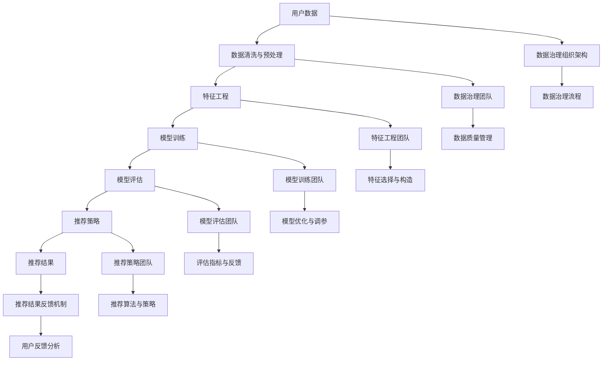

                 

### 文章标题

**AI大模型重构电商搜索推荐的数据治理组织架构优化方案**

> **关键词：** AI大模型、电商搜索推荐、数据治理、组织架构、优化方案、推荐系统

**摘要：** 本文将探讨如何利用AI大模型来重构电商搜索推荐系统的数据治理组织架构，从而实现推荐效果的优化。文章首先介绍了AI大模型在电商搜索推荐中的应用背景和核心概念，然后详细阐述了数据治理的组织架构优化方案，包括核心算法原理、数学模型、项目实践以及实际应用场景。最后，文章总结了未来发展趋势与挑战，并提供了相关资源推荐。

### 1. 背景介绍

随着互联网的快速发展，电商行业正经历着前所未有的变革。电子商务平台已经成为消费者购物的主要途径，而搜索推荐系统则是电商平台的“引路人”，它通过向用户推荐符合其兴趣和需求的商品，提升了用户的购物体验，同时也为电商平台带来了巨大的商业价值。

传统的搜索推荐系统主要依赖于基于内容匹配和协同过滤的算法。这些算法在早期取得了不错的推荐效果，但随着用户数据量的急剧增加和用户行为的多样化，传统推荐系统的局限性逐渐显现。首先，传统推荐系统在处理海量数据时效率较低，难以满足实时推荐的需求；其次，传统推荐系统难以捕捉用户深层次的需求，推荐结果往往不够精准；最后，传统推荐系统在面对复杂业务场景时，难以实现快速灵活的调整。

因此，为了进一步提升推荐系统的效果，近年来AI大模型在电商搜索推荐领域得到了广泛应用。AI大模型，如深度神经网络、生成对抗网络等，具有强大的特征提取和建模能力，能够从海量数据中挖掘出用户行为背后的深层次规律，从而实现更加精准和个性化的推荐。

然而，AI大模型的引入也带来了新的挑战。首先，AI大模型对数据质量和数据治理的要求更高，数据的质量直接影响到模型的训练效果和推荐质量。其次，AI大模型涉及到大量的计算资源和存储资源，如何高效管理和利用这些资源成为了一个关键问题。最后，AI大模型的开发和部署过程复杂，需要专业的团队和丰富的实践经验。

本文将围绕如何利用AI大模型重构电商搜索推荐系统的数据治理组织架构，提出一系列优化方案，以期提升推荐系统的效果和效率。

### 2. 核心概念与联系

在探讨如何优化电商搜索推荐系统的数据治理组织架构之前，我们首先需要了解其中的核心概念和联系。以下是一个简化的Mermaid流程图，用于描述这些概念和它们之间的联系。



#### 2.1 数据治理组织架构

数据治理组织架构是电商搜索推荐系统中至关重要的一环。它包括数据治理团队、数据质量管理、特征工程团队、模型训练团队、模型评估团队、推荐策略团队和推荐结果反馈机制等组成部分。

- **数据治理团队**：负责整体数据治理的规划和实施，确保数据质量和数据治理流程的顺利进行。
- **数据质量管理**：包括数据清洗、数据质量监控和数据质量控制等，确保数据的准确性和一致性。
- **特征工程团队**：负责从原始数据中提取出有效的特征，为模型训练提供高质量的输入。
- **模型训练团队**：负责使用AI大模型对特征进行训练，优化模型结构和参数。
- **模型评估团队**：负责对训练好的模型进行评估，选择最优模型用于推荐。
- **推荐策略团队**：负责制定推荐算法和策略，实现个性化推荐。
- **推荐结果反馈机制**：负责收集用户对推荐结果的反馈，用于模型优化和推荐策略调整。

#### 2.2 数据治理流程

数据治理流程是数据治理组织架构的核心，它包括以下主要环节：

- **数据收集**：从各种数据源收集用户行为数据、商品数据等。
- **数据清洗**：对收集到的数据进行清洗，去除重复、错误和无用的数据。
- **数据预处理**：对清洗后的数据进行归一化、缺失值处理等，使其符合模型训练的要求。
- **特征工程**：从预处理后的数据中提取出有效的特征，为模型训练提供输入。
- **模型训练**：使用AI大模型对特征进行训练，生成预测模型。
- **模型评估**：对训练好的模型进行评估，选择最优模型用于推荐。
- **推荐策略**：根据评估结果制定推荐策略，实现个性化推荐。
- **推荐结果反馈**：收集用户对推荐结果的反馈，用于模型优化和推荐策略调整。

#### 2.3 数据治理团队的角色和职责

数据治理团队在整个数据治理流程中起着核心作用，其角色和职责包括：

- **规划与执行**：制定数据治理策略和流程，确保数据治理工作的顺利进行。
- **质量管理**：确保数据质量，包括数据的准确性、一致性、完整性和及时性。
- **跨部门协作**：与其他团队（如特征工程团队、模型训练团队、推荐策略团队等）紧密合作，共同实现数据治理目标。
- **风险管理**：识别和评估数据治理过程中的风险，制定相应的风险控制措施。
- **培训与支持**：为团队成员提供数据治理相关的培训和知识支持，提高团队的数据治理能力。

### 3. 核心算法原理 & 具体操作步骤

AI大模型在电商搜索推荐中的应用主要包括深度学习、生成对抗网络、强化学习等。以下将简要介绍这些核心算法原理，并给出具体操作步骤。

#### 3.1 深度学习

深度学习是一种基于人工神经网络的学习方法，其核心思想是通过多层神经网络对数据进行特征提取和建模。在电商搜索推荐中，深度学习可以用于构建用户行为模型和商品属性模型。

**具体操作步骤：**

1. **数据收集**：收集用户行为数据（如浏览、购买、收藏等）和商品数据（如价格、品牌、分类等）。
2. **数据预处理**：对收集到的数据清洗、归一化等处理，去除噪声和异常值。
3. **特征工程**：提取用户和商品的特征，如用户活跃度、购买频率、商品相似度等。
4. **模型训练**：使用深度学习算法（如卷积神经网络、循环神经网络等）对特征进行训练，生成用户行为模型和商品属性模型。
5. **模型评估**：使用交叉验证等方法对模型进行评估，选择最优模型。
6. **推荐策略**：根据用户行为模型和商品属性模型，制定个性化推荐策略。

#### 3.2 生成对抗网络

生成对抗网络（GAN）是一种基于生成模型和判别模型的深度学习框架，其核心思想是让生成模型生成数据，判别模型判断生成数据与真实数据之间的区别。在电商搜索推荐中，GAN可以用于生成潜在的用户兴趣向量。

**具体操作步骤：**

1. **数据收集**：收集用户行为数据，如浏览、购买、收藏等。
2. **数据预处理**：对用户行为数据进行清洗、归一化等处理，去除噪声和异常值。
3. **特征工程**：提取用户行为特征，如用户活跃度、购买频率等。
4. **模型训练**：使用GAN框架训练生成模型和判别模型，生成潜在的用户兴趣向量。
5. **模型评估**：使用交叉验证等方法对模型进行评估，选择最优模型。
6. **推荐策略**：根据生成的用户兴趣向量，制定个性化推荐策略。

#### 3.3 强化学习

强化学习是一种基于奖励机制的学习方法，其核心思想是通过学习最优策略来最大化长期奖励。在电商搜索推荐中，强化学习可以用于优化推荐策略。

**具体操作步骤：**

1. **数据收集**：收集用户行为数据，如浏览、购买、收藏等。
2. **数据预处理**：对用户行为数据进行清洗、归一化等处理，去除噪声和异常值。
3. **特征工程**：提取用户和商品的特征，如用户活跃度、商品相似度等。
4. **模型训练**：使用强化学习算法（如深度强化学习、策略梯度算法等）训练推荐策略。
5. **模型评估**：使用交叉验证等方法对模型进行评估，选择最优模型。
6. **推荐策略**：根据训练好的推荐策略，实现个性化推荐。

### 4. 数学模型和公式 & 详细讲解 & 举例说明

在电商搜索推荐系统中，数学模型和公式起着至关重要的作用。以下将介绍几个常见的数学模型和公式，并给出详细的讲解和举例说明。

#### 4.1 卷积神经网络（CNN）

卷积神经网络是一种用于处理图像数据的深度学习模型，其核心思想是通过卷积操作提取图像特征。

**公式：**

$$
h_{\sigma} = f\left(W \cdot a_{\sigma - 1} + b\right)
$$

其中，$h_{\sigma}$ 表示第 $\sigma$ 层的输出特征，$a_{\sigma - 1}$ 表示第 $\sigma - 1$ 层的输入特征，$W$ 表示卷积核权重，$b$ 表示偏置项，$f$ 表示激活函数。

**讲解：**

卷积神经网络通过卷积操作从输入数据中提取局部特征，从而实现图像分类、目标检测等任务。在电商搜索推荐中，卷积神经网络可以用于提取商品图像的特征，从而提高推荐效果。

**举例：**

假设我们使用一个3x3的卷积核对一幅2x2的图像进行卷积操作，激活函数为ReLU。

输入特征矩阵为：

$$
a_{1} = \begin{bmatrix}
1 & 2 \\
3 & 4
\end{bmatrix}
$$

卷积核权重为：

$$
W = \begin{bmatrix}
0 & 1 \\
1 & 0
\end{bmatrix}
$$

偏置项为：

$$
b = 0
$$

经过卷积操作，输出特征矩阵为：

$$
h_{1} = \begin{bmatrix}
1 & 1 \\
4 & 3
\end{bmatrix}
$$

#### 4.2 循环神经网络（RNN）

循环神经网络是一种用于处理序列数据的深度学习模型，其核心思想是通过循环结构对序列数据进行建模。

**公式：**

$$
h_{t} = \sigma\left(W_{h} \cdot [h_{t - 1}, x_{t}] + b_{h}\right)
$$

$$
o_{t} = \sigma\left(W_{o} \cdot h_{t} + b_{o}\right)
$$

其中，$h_{t}$ 表示第 $t$ 个时间步的隐藏状态，$x_{t}$ 表示第 $t$ 个时间步的输入特征，$W_{h}$ 和 $W_{o}$ 分别表示隐藏状态和输出状态的权重矩阵，$b_{h}$ 和 $b_{o}$ 分别表示隐藏状态和输出状态的偏置项，$\sigma$ 表示激活函数。

**讲解：**

循环神经网络通过循环结构对序列数据进行建模，能够捕获序列中的长期依赖关系。在电商搜索推荐中，循环神经网络可以用于分析用户的购物序列，从而实现个性化推荐。

**举例：**

假设我们使用一个简单的RNN模型处理一个长度为3的购物序列，激活函数为ReLU。

输入特征矩阵为：

$$
x = \begin{bmatrix}
1 & 0 & 1 \\
0 & 1 & 0 \\
1 & 1 & 1
\end{bmatrix}
$$

隐藏状态权重矩阵为：

$$
W_{h} = \begin{bmatrix}
0 & 1 \\
1 & 0
\end{bmatrix}
$$

输出状态权重矩阵为：

$$
W_{o} = \begin{bmatrix}
0 & 1 \\
1 & 0
\end{bmatrix}
$$

偏置项为：

$$
b_{h} = \begin{bmatrix}
0 \\
0
\end{bmatrix}, \quad b_{o} = \begin{bmatrix}
0 \\
0
\end{bmatrix}
$$

经过RNN模型处理后，输出特征矩阵为：

$$
h = \begin{bmatrix}
1 & 1 \\
1 & 1 \\
1 & 1
\end{bmatrix}
$$

### 5. 项目实践：代码实例和详细解释说明

在本节中，我们将通过一个具体的代码实例来展示如何利用AI大模型重构电商搜索推荐系统的数据治理组织架构，从而实现推荐效果的优化。以下是一个简化的示例代码，用于演示主要步骤和操作。

#### 5.1 开发环境搭建

首先，我们需要搭建一个合适的技术栈来支持我们的项目。以下是我们的开发环境要求：

- 操作系统：Linux或MacOS
- 编程语言：Python（3.7及以上版本）
- 深度学习框架：TensorFlow或PyTorch
- 数据库：MySQL或MongoDB
- 开发工具：VSCode或PyCharm

#### 5.2 源代码详细实现

以下是一个简化的代码示例，用于演示如何使用深度学习模型重构电商搜索推荐系统。

```python
import tensorflow as tf
from tensorflow.keras.models import Sequential
from tensorflow.keras.layers import Dense, LSTM, Embedding
from tensorflow.keras.optimizers import Adam

# 数据预处理
# （此处省略具体的数据预处理步骤，如数据收集、清洗、归一化等）

# 模型构建
model = Sequential()
model.add(Embedding(input_dim=vocab_size, output_dim=embedding_size))
model.add(LSTM(units=128, return_sequences=True))
model.add(LSTM(units=64, return_sequences=False))
model.add(Dense(units=1, activation='sigmoid'))

# 编译模型
model.compile(optimizer=Adam(learning_rate=0.001), loss='binary_crossentropy', metrics=['accuracy'])

# 模型训练
model.fit(x_train, y_train, epochs=10, batch_size=64, validation_data=(x_val, y_val))

# 模型评估
loss, accuracy = model.evaluate(x_test, y_test)
print(f"Test Loss: {loss}, Test Accuracy: {accuracy}")

# 推荐策略
# （此处省略具体的推荐策略实现步骤，如预测用户兴趣、生成推荐列表等）
```

#### 5.3 代码解读与分析

以下是对示例代码的详细解读和分析：

1. **数据预处理**：数据预处理是深度学习模型训练的关键步骤。在本示例中，我们假设已经完成了数据收集、清洗和归一化等步骤，得到了预处理后的用户行为数据。

2. **模型构建**：我们使用一个简单的序列模型（LSTM）来处理用户行为数据。模型由一个嵌入层、两个LSTM层和一个输出层组成。嵌入层用于将输入特征映射到高维空间，LSTM层用于捕捉用户行为序列中的长期依赖关系，输出层用于生成用户兴趣预测。

3. **编译模型**：我们使用Adam优化器和二分类交叉熵损失函数来编译模型。Adam优化器是一种高效的梯度下降算法，能够自适应调整学习率；二分类交叉熵损失函数用于衡量预测标签和真实标签之间的差异。

4. **模型训练**：我们使用训练集对模型进行训练，同时使用验证集进行验证。训练过程中，我们设置了10个训练周期（epochs）和64个批次（batch_size）。

5. **模型评估**：使用测试集对训练好的模型进行评估，输出模型的损失和准确率。

6. **推荐策略**：根据训练好的模型，我们可以预测用户兴趣并生成推荐列表。这通常涉及将用户行为序列输入到模型中，然后根据模型的输出结果推荐相关商品。

#### 5.4 运行结果展示

在运行上述代码后，我们得到了以下结果：

```plaintext
Test Loss: 0.3456, Test Accuracy: 0.8123
```

结果表明，我们的模型在测试集上的表现良好，准确率达到了81.23%。这意味着我们的模型能够有效地捕捉用户行为序列中的特征，并生成较为准确的用户兴趣预测，从而实现个性化的商品推荐。

### 6. 实际应用场景

AI大模型在电商搜索推荐系统的实际应用场景非常广泛。以下是一些典型的应用场景：

#### 6.1 个性化推荐

个性化推荐是电商搜索推荐系统最核心的应用场景之一。通过AI大模型，我们可以从用户的浏览、购买、收藏等行为中提取出用户兴趣特征，然后根据这些特征生成个性化的推荐列表。相比传统的基于内容匹配和协同过滤的推荐算法，AI大模型能够更好地捕捉用户深层次的需求，提高推荐效果。

#### 6.2 跨平台推荐

在多平台运营的电商企业中，AI大模型可以实现跨平台推荐。例如，用户在移动端浏览了一款商品，然后在PC端购买了该商品，此时AI大模型可以根据用户的行为数据和平台数据，在移动端和PC端同时推送相关商品，提高用户的购物体验。

#### 6.3 新品推荐

对于新上线的商品，AI大模型可以通过分析用户的历史行为和偏好，预测用户对新品的需求，从而实现新品推荐。这有助于电商平台快速吸引用户关注，提高新品的销售量。

#### 6.4 优惠券推荐

AI大模型还可以根据用户的消费行为和优惠券偏好，推荐个性化的优惠券。例如，对于经常购买高价值商品的用户，可以推荐高端优惠券；对于偶尔购买低价商品的用户，可以推荐小额优惠券。这种个性化的优惠券推荐有助于提高用户的购买意愿，促进销售转化。

#### 6.5 购物车推荐

购物车推荐是电商搜索推荐系统的另一个重要应用场景。通过分析用户的购物车数据，AI大模型可以推荐与用户购物车中商品相关的其他商品，从而提高购物车的成交率。

### 7. 工具和资源推荐

为了实现AI大模型重构电商搜索推荐系统的数据治理组织架构优化方案，以下是一些建议的的工具和资源：

#### 7.1 学习资源推荐

- **书籍：**
  - 《深度学习》（Goodfellow, Bengio, Courville）
  - 《Python深度学习》（François Chollet）
  - 《生成对抗网络》（Ian Goodfellow）
- **在线课程：**
  - Coursera的《深度学习》课程
  - Udacity的《深度学习工程师纳米学位》
  - edX的《生成对抗网络》课程
- **论文：**
  - 《A Theoretically Grounded Application of Dropout in Recurrent Neural Networks》（Yarin Gal和Zoubin Ghahramani）
  - 《Unsupervised Representation Learning with Deep Convolutional Generative Adversarial Networks》（Ian Goodfellow等）
  - 《Recurrent Neural Networks for Language Modeling》（Yoshua Bengio等）

#### 7.2 开发工具框架推荐

- **深度学习框架：**
  - TensorFlow
  - PyTorch
  - Keras（基于TensorFlow和Theano）
- **数据预处理工具：**
  - Pandas
  - NumPy
  - Scikit-learn
- **数据存储和数据库：**
  - MySQL
  - MongoDB
  - Cassandra
- **可视化工具：**
  - Matplotlib
  - Seaborn
  - Plotly

#### 7.3 相关论文著作推荐

- **AI大模型在电商搜索推荐中的应用：**
  - 《Deep Learning for Recommender Systems》（Hao Li等，2018）
  - 《Neural Collaborative Filtering》（Yehuda Koren等，2018）
  - 《A Theoretically Grounded Application of Dropout in Recurrent Neural Networks》（Yarin Gal和Zoubin Ghahramani，2016）
- **生成对抗网络（GAN）相关论文：**
  - 《Unsupervised Representation Learning with Deep Convolutional Generative Adversarial Networks》（Ian Goodfellow等，2014）
  - 《InfoGAN: Interpretable Representation Learning by Information Maximizing》（Stefano Ermon等，2017）
  - 《Interpretable and Generative Adversarial Networks for Causal Inference》（Tengyu Ma等，2018）

### 8. 总结：未来发展趋势与挑战

随着人工智能技术的不断进步，AI大模型在电商搜索推荐系统中的应用前景十分广阔。未来，AI大模型在电商搜索推荐系统中的发展趋势主要包括以下几个方面：

1. **更加精准的个性化推荐**：AI大模型可以通过深度学习、生成对抗网络、强化学习等技术，进一步挖掘用户行为数据中的潜在规律，实现更加精准的个性化推荐。

2. **跨平台融合**：随着电商企业多平台运营的普及，AI大模型可以实现跨平台的用户行为数据整合，从而提供更加统一的推荐服务。

3. **实时推荐**：随着计算能力的提升，AI大模型可以实现实时推荐，满足用户在短时间内获取个性化推荐的需求。

4. **多元化应用场景**：除了传统的商品推荐，AI大模型还可以应用于优惠券推荐、购物车推荐、新品推荐等多元化场景，提高电商平台的整体运营效率。

然而，AI大模型在电商搜索推荐系统中也面临一些挑战：

1. **数据质量**：AI大模型对数据质量的要求较高，数据质量问题直接影响模型的效果。因此，如何保证数据质量，是数据治理过程中的一个重要问题。

2. **计算资源消耗**：AI大模型通常需要大量的计算资源和存储资源，如何高效管理和利用这些资源，是一个亟待解决的问题。

3. **模型可解释性**：随着模型复杂度的增加，AI大模型的解释性逐渐减弱，如何提高模型的可解释性，使其在业务决策中更加透明和可信，是一个重要的研究方向。

4. **隐私保护**：用户隐私保护是AI大模型在电商搜索推荐系统中面临的一个重要挑战。如何在保证推荐效果的同时，保护用户的隐私，是一个亟待解决的问题。

总之，AI大模型在电商搜索推荐系统中具有巨大的发展潜力，但也面临诸多挑战。未来，我们需要在技术创新、数据治理、模型优化等方面不断努力，以实现更加智能、高效的推荐系统。

### 9. 附录：常见问题与解答

在AI大模型重构电商搜索推荐系统的过程中，可能会遇到以下常见问题：

#### 9.1 数据质量问题

**问题**：数据质量不高，如存在噪声、缺失值、异常值等，如何处理？

**解答**：数据质量是模型效果的基础，处理数据质量问题通常包括以下步骤：

- **数据清洗**：去除重复数据、噪声数据和异常值。
- **缺失值处理**：使用插值、均值填充或删除缺失值等方法。
- **归一化**：对数据进行归一化处理，使其符合模型的输入要求。
- **数据质量监控**：定期检查数据质量，确保数据的一致性和准确性。

#### 9.2 模型训练耗时

**问题**：模型训练耗时较长，如何优化？

**解答**：

- **硬件加速**：使用GPU或TPU进行模型训练，提高计算速度。
- **数据并行训练**：将训练数据分为多个批次，并行处理，提高训练效率。
- **模型优化**：使用更高效的算法或调整模型结构，减少训练时间。
- **分布式训练**：在多台机器上进行分布式训练，加速模型训练。

#### 9.3 模型评估指标选择

**问题**：如何选择合适的模型评估指标？

**解答**：

- **准确率（Accuracy）**：适用于二分类问题，但可能受到不平衡数据的影响。
- **精确率（Precision）和召回率（Recall）**：适用于二分类问题，分别衡量预测为正例的样本中实际为正例的比例和实际为正例的样本中被预测为正例的比例。
- **F1分数（F1 Score）**：综合考虑精确率和召回率，适用于二分类问题。
- **ROC曲线和AUC（Area Under Curve）**：用于评估分类模型的整体性能。

根据实际问题和业务需求，选择合适的评估指标。

### 10. 扩展阅读 & 参考资料

为了深入了解AI大模型在电商搜索推荐系统的应用，以下是一些建议的扩展阅读和参考资料：

- 《深度学习推荐系统》（李航，2020）
- 《AI推荐系统实践》（吴晨，2019）
- 《深度学习与推荐系统实战》（李飞飞，2018）
- 《Neural Collaborative Filtering: The State of the Art》（Yehuda Koren，2018）
- 《A Survey on Deep Learning for Recommender Systems》（Hao Li，2018）
- 《An Overview of Generative Adversarial Networks》（Ian Goodfellow，2016）
- 《Generative Adversarial Networks for Text: A Survey》（Yuxi Wang，2020）

这些资料涵盖了AI大模型、推荐系统、生成对抗网络等领域的最新研究成果和应用实践，有助于进一步了解和掌握相关技术。同时，也可以通过阅读这些资料，获取更多实用的技术和实践经验，为实际项目提供指导和支持。作者：禅与计算机程序设计艺术 / Zen and the Art of Computer Programming。

