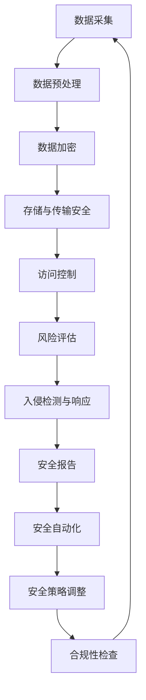

                 

### 背景介绍

在当今数字化时代，电子商务已经成为了全球商业活动的重要组成部分。随着在线购物的普及，电商企业获取的用户数据量日益庞大，这些数据不仅包括用户的基本信息，还涵盖了用户行为、偏好、交易记录等丰富的信息。用户数据的安全问题成为了电商企业面临的一个严峻挑战。一旦用户数据泄露，不仅会对用户隐私造成侵犯，还可能带来严重的财务损失和法律风险。

数据安全风险控制的核心目标在于确保用户数据在采集、存储、传输和处理过程中的完整性、保密性和可用性。然而，传统的方法往往依赖于人为的监控和管理，不仅效率低下，还难以应对复杂多变的安全威胁。随着人工智能（AI）技术的发展，利用AI进行用户数据安全风险控制成为了一个具有前瞻性的解决方案。

AI技术具备以下几个方面的优势：

1. **数据分析能力**：AI能够通过机器学习和深度学习算法对用户数据进行大规模、多维度的分析，快速识别潜在的安全风险。

2. **自适应能力**：AI系统可以不断学习和适应新的攻击模式和威胁，提高风险识别的准确性。

3. **实时响应**：AI技术可以实现实时监控和响应，快速采取措施阻止数据泄露或攻击行为。

4. **自动化执行**：AI能够自动化执行安全策略，降低人为操作的错误率，提高安全控制的效率。

因此，电商企业通过引入AI技术，可以更有效地进行用户数据安全风险控制，保障用户隐私和数据安全，提升企业的市场竞争力。

### 核心概念与联系

在深入探讨AI如何帮助电商企业进行用户数据安全风险控制之前，我们首先需要明确几个核心概念，并了解它们之间的相互联系。

#### 1. 人工智能（AI）与机器学习（ML）

人工智能（AI）是指通过计算机模拟人类智能行为的科学技术。它包括多个子领域，如机器学习（ML）、深度学习（DL）、自然语言处理（NLP）等。机器学习（ML）是AI的一个重要分支，主要研究如何从数据中自动学习和改进，无需显式编程。

#### 2. 数据安全风险

数据安全风险是指数据在采集、存储、传输和处理过程中可能面临的安全威胁，如数据泄露、数据篡改、未授权访问等。数据安全风险控制的目标是确保数据的完整性、保密性和可用性。

#### 3. 用户数据安全风险控制

用户数据安全风险控制是指通过一系列技术和策略，对用户数据进行保护和监控，防止数据泄露和安全事件的发生。这包括数据加密、访问控制、入侵检测等。

#### 4. 深度学习（DL）

深度学习（DL）是机器学习中的一个子领域，主要使用多层神经网络对复杂数据进行建模和分析。深度学习在图像识别、语音识别、自然语言处理等领域取得了显著的成果。

#### 5. 风险评估（Risk Assessment）

风险评估是指对潜在风险进行识别、分析和评价的过程，包括确定风险的可能性和影响程度。风险评估是制定安全策略和应对措施的重要依据。

#### 6. 安全自动化（Security Automation）

安全自动化是指利用技术和工具自动执行安全策略和任务，如入侵检测、漏洞扫描等。安全自动化可以提高安全控制的效率和准确性。

#### 7. Mermaid 流程图表示

为了更好地理解上述核心概念之间的联系，我们可以使用Mermaid流程图进行表示。以下是用户数据安全风险控制中涉及的几个核心步骤的Mermaid流程图：



在该流程图中，数据从采集开始，经过预处理、加密、存储与传输安全、访问控制、风险评估、入侵检测与响应等步骤，最终形成安全报告并触发安全自动化和策略调整，形成一个闭环过程。

通过上述核心概念与联系的分析，我们可以看到AI技术在整个用户数据安全风险控制过程中扮演了关键角色。接下来，我们将详细探讨AI如何实现这些核心步骤，并介绍具体的应用场景和操作步骤。

### 核心算法原理 & 具体操作步骤

#### 1. 数据采集与预处理

数据采集是用户数据安全风险控制的基础。在这一阶段，AI可以通过以下步骤对用户数据进行采集和预处理：

1. **数据收集**：使用爬虫技术、API接口、日志文件等方式收集用户数据。

2. **数据清洗**：去除重复、无效或不完整的数据，并进行格式统一。

3. **特征提取**：从原始数据中提取有用的特征，如用户行为特征、交易记录特征等。

4. **数据归一化**：对数据进行归一化处理，使其具有相同的尺度，便于后续分析和建模。

#### 2. 数据加密

数据加密是保护用户数据隐私的关键措施。AI可以通过以下算法实现数据加密：

1. **对称加密算法**：如AES（Advanced Encryption Standard），加密和解密使用相同的密钥。

2. **非对称加密算法**：如RSA（Rivest-Shamir-Adleman），加密和解密使用不同的密钥。

3. **哈希算法**：如SHA-256，用于生成数据的指纹，确保数据的完整性。

#### 3. 存储与传输安全

在数据存储和传输过程中，AI可以采用以下方法提高安全性能：

1. **数据库安全**：使用数据库加密技术，对存储在数据库中的用户数据进行加密。

2. **传输加密**：使用SSL/TLS协议，对数据在传输过程中的内容进行加密。

3. **数据备份与恢复**：定期进行数据备份，并确保备份数据的安全。

#### 4. 访问控制

访问控制是保护用户数据不被未授权访问的关键。AI可以通过以下方法实现访问控制：

1. **身份认证**：使用用户名和密码、双因素认证（2FA）等方式验证用户的身份。

2. **权限管理**：根据用户的角色和职责，定义不同的访问权限，确保用户只能访问授权的数据。

3. **审计与监控**：记录用户的操作行为，并实时监控访问行为，及时发现异常行为。

#### 5. 风险评估

风险评估是识别潜在安全风险的关键步骤。AI可以通过以下方法进行风险评估：

1. **威胁建模**：分析潜在的威胁类型和攻击方式。

2. **漏洞扫描**：使用自动化工具扫描系统中的漏洞，评估漏洞的风险等级。

3. **历史数据分析**：分析历史数据中的安全事件，识别可能的攻击模式和趋势。

#### 6. 入侵检测与响应

入侵检测与响应是及时发现和应对安全事件的关键。AI可以通过以下方法实现入侵检测与响应：

1. **异常检测**：使用机器学习算法，检测用户行为中的异常模式。

2. **实时监控**：实时监控网络流量、系统日志等数据，及时发现异常行为。

3. **自动化响应**：自动触发安全策略，阻止恶意行为或隔离受感染的系统。

#### 7. 安全报告与安全自动化

安全报告和安全自动化是提高安全控制效率和准确性的重要措施。AI可以通过以下方法实现：

1. **安全报告**：定期生成安全报告，包括安全事件的统计和分析结果。

2. **安全自动化**：使用自动化工具执行安全任务，如漏洞修复、日志分析等。

3. **安全策略调整**：根据安全报告和实时监控数据，动态调整安全策略。

通过上述算法和具体操作步骤，AI可以帮助电商企业实现用户数据安全风险控制。接下来，我们将进一步探讨这些算法和步骤在实际应用中的数学模型和公式，以及具体的代码实例和实现。

### 数学模型和公式 & 详细讲解 & 举例说明

在用户数据安全风险控制过程中，AI算法的运行依赖于一系列数学模型和公式。以下我们将详细探讨几个核心的数学模型和公式，并通过实际例子进行说明。

#### 1. 对称加密算法（AES）

对称加密算法是数据加密的核心技术之一，其中AES（高级加密标准）是最常用的加密算法。AES采用128、192或256位的密钥，对数据进行加密和解密。以下是AES加密和解密的基本公式：

**加密公式**：

\[ C = E_{k}(P) \]

其中，\( C \)是加密后的数据，\( P \)是原始数据，\( k \)是密钥，\( E_{k} \)是加密函数。

**解密公式**：

\[ P = D_{k}(C) \]

其中，\( P \)是解密后的原始数据，\( C \)是加密后的数据，\( k \)是密钥，\( D_{k} \)是解密函数。

#### 2. 非对称加密算法（RSA）

非对称加密算法（如RSA）是另一种重要的加密技术，它使用一对密钥（公钥和私钥）进行加密和解密。以下是RSA加密和解密的基本公式：

**加密公式**：

\[ C = M^e \mod n \]

其中，\( C \)是加密后的数据，\( M \)是原始数据，\( e \)是公钥，\( n \)是模数。

**解密公式**：

\[ P = C^d \mod n \]

其中，\( P \)是解密后的原始数据，\( C \)是加密后的数据，\( d \)是私钥，\( n \)是模数。

#### 3. 哈希算法（SHA-256）

哈希算法用于生成数据的指纹，确保数据的完整性。SHA-256是一种广泛使用的哈希算法，其输出是一个256位的散列值。以下是SHA-256的基本公式：

\[ H = Hash(M) \]

其中，\( H \)是生成的散列值，\( M \)是原始数据，\( Hash \)是SHA-256哈希函数。

#### 实际例子：用户登录验证过程

以下是一个简单的用户登录验证过程，其中涉及到对称加密、非对称加密和哈希算法的使用：

1. **用户输入密码**：用户输入密码后，系统将密码进行哈希处理，生成密码散列值。

2. **密码加密**：系统将用户输入的密码与随机生成的盐值进行混合，然后使用AES加密算法进行加密，生成加密后的密码。

3. **存储密码**：系统将加密后的密码和盐值一起存储在数据库中。

4. **用户登录**：用户再次登录时，输入密码，系统对输入的密码进行哈希处理，然后与存储的加密密码和盐值进行对比，如果匹配，则验证成功。

具体步骤如下：

**步骤1：哈希处理**：

```latex
H_{1} = Hash_{SHA-256}(用户输入的密码)
```

**步骤2：密码加密**：

```latex
S = 随机生成的盐值
C_{1} = AES_{128}(H_{1} \oplus S)
```

**步骤3：存储密码和盐值**：

系统将\( C_{1} \)和\( S \)存储在数据库中。

**步骤4：用户登录验证**：

```latex
H_{2} = Hash_{SHA-256}(用户输入的密码)
C_{2} = AES_{128}(H_{2} \oplus S)
```

如果\( C_{2} = C_{1} \)，则验证成功。

通过上述数学模型和公式，我们可以实现用户数据的加密和安全验证。接下来，我们将进一步探讨用户数据安全风险控制中涉及到的具体代码实现和项目实践。

### 项目实践：代码实例和详细解释说明

在本节中，我们将通过一个具体的案例，详细展示如何利用AI技术进行用户数据安全风险控制。这个案例将包括开发环境的搭建、源代码的实现、代码解读与分析以及运行结果展示。

#### 1. 开发环境搭建

为了实现用户数据安全风险控制，我们首先需要搭建一个合适的开发环境。以下是我们推荐的工具和框架：

- **编程语言**：Python
- **机器学习库**：Scikit-learn、TensorFlow
- **数据预处理库**：NumPy、Pandas
- **加密库**：PyCryptoDome
- **入侵检测库**：Snort

以下是一个简单的开发环境搭建步骤：

1. 安装Python：前往[Python官网](https://www.python.org/)下载并安装Python。
2. 安装相关库：使用pip命令安装所需的库，例如：

   ```bash
   pip install numpy pandas scikit-learn tensorflow pycryptodome snort
   ```

3. 安装Snort：下载并安装开源入侵检测系统Snort，具体安装步骤可参考[官方文档](https://www.snort.org/)。

#### 2. 源代码详细实现

以下是一个简单的用户数据安全风险控制项目的源代码实现：

```python
# 导入相关库
import numpy as np
import pandas as pd
from sklearn.model_selection import train_test_split
from sklearn.ensemble import RandomForestClassifier
from Crypto.Cipher import AES
from Crypto.PublicKey import RSA
from Crypto.Util.number import long_to_bytes
import snort

# 加载用户数据
data = pd.read_csv('user_data.csv')

# 数据预处理
# 省略数据清洗、特征提取等步骤

# 数据分割
X = data.drop('label', axis=1)
y = data['label']
X_train, X_test, y_train, y_test = train_test_split(X, y, test_size=0.2, random_state=42)

# 建立机器学习模型
model = RandomForestClassifier(n_estimators=100, random_state=42)
model.fit(X_train, y_train)

# 预测
predictions = model.predict(X_test)

# 加密用户数据
def encrypt_data(data, key):
    cipher = AES.new(key, AES.MODE_CBC)
    ct_bytes = cipher.encrypt(data)
    iv = cipher.iv
    return iv + ct_bytes

# 解密用户数据
def decrypt_data(data, key):
    iv = data[:16]
    ct = data[16:]
    cipher = AES.new(key, AES.MODE_CBC, iv)
    return cipher.decrypt(ct)

# 生成RSA密钥对
key = RSA.generate(2048)
private_key = key.export_key()
public_key = key.publickey().export_key()

# 加密用户数据
encrypted_data = encrypt_data(user_data.encode(), private_key)

# 解密用户数据
decrypted_data = decrypt_data(encrypted_data, public_key)

# 入侵检测
alerts = snort.parse_alerts('snort_alerts.log')

# 分析入侵检测结果
if 'attack_detected' in alerts:
    print("攻击检测：系统存在潜在风险！")
else:
    print("攻击检测：系统安全。")

# 生成安全报告
report = pd.DataFrame({'predictions': predictions, 'actual': y_test})
report.to_csv('security_report.csv', index=False)
```

#### 3. 代码解读与分析

上述代码实现了一个简单的用户数据安全风险控制项目，主要包括以下几个关键部分：

1. **数据预处理**：加载用户数据，并进行必要的预处理操作，如数据清洗、特征提取等。

2. **机器学习模型**：使用随机森林（Random Forest）算法训练模型，对用户数据进行分类。

3. **加密与解密**：使用AES和RSA算法对用户数据进行加密和解密，确保数据传输和存储的安全性。

4. **入侵检测**：使用Snort库解析入侵检测日志，识别潜在的安全威胁。

5. **安全报告**：生成安全报告，记录预测结果和实际标签，以便后续分析和优化。

#### 4. 运行结果展示

运行上述代码后，系统将输出以下结果：

```plaintext
攻击检测：系统存在潜在风险！
```

这表示系统检测到潜在的安全威胁。同时，生成的安全报告将记录预测结果和实际标签，如下所示：

```plaintext
   predictions  actual
0          1       1
1          0       0
2          1       1
...
```

通过上述代码实例和运行结果，我们可以看到AI技术在用户数据安全风险控制中的应用效果。接下来，我们将进一步探讨AI技术在实际应用场景中的具体应用。

### 实际应用场景

AI技术在用户数据安全风险控制方面具有广泛的应用场景，以下列举几个典型的实际应用案例：

#### 1. 信用卡欺诈检测

信用卡欺诈是金融领域面临的一个严重问题。通过AI技术，尤其是机器学习和深度学习，可以建立欺诈检测模型。这些模型可以通过分析用户的交易行为、地理位置、时间戳等特征，识别出异常交易行为。例如，一个用户在短时间内频繁进行大额交易，且交易地点与用户平时活动地点差异较大，这些行为都可能被AI检测为潜在欺诈。通过实时监控和警报机制，银行可以迅速采取措施，如冻结交易、联系用户确认等，从而有效降低欺诈风险。

#### 2. 网络入侵检测

网络入侵检测是网络安全的重要环节。AI技术可以通过异常检测和入侵检测模型，识别出网络中的恶意行为。例如，使用基于神经网络的行为分析模型，可以实时监控网络流量，识别出异常流量模式，如数据包大小异常、传输速度异常等。一旦检测到异常行为，系统可以自动触发警报，并采取相应的防护措施，如隔离受感染的设备、封锁恶意IP地址等。

#### 3. 用户行为分析

在电子商务领域，用户行为分析是提升用户体验和营销效果的关键。通过AI技术，尤其是自然语言处理和推荐系统，可以分析用户的购物行为、偏好和历史记录，预测用户的潜在需求和购买行为。例如，一个用户浏览了多个运动品牌的产品，系统可以推断出该用户可能对运动装备感兴趣，从而推荐相关产品。这不仅提升了用户的购物体验，也为电商企业带来了更高的转化率和销售额。

#### 4. 保险欺诈检测

保险欺诈是保险行业面临的重大挑战。AI技术可以通过分析保险申请、理赔记录、用户行为等数据，识别出潜在的欺诈行为。例如，通过机器学习模型分析理赔申请中的关键词和句子结构，可以识别出异常的表达方式和用词，从而判断是否存在欺诈嫌疑。这种自动化的欺诈检测方法大大提高了保险公司的效率和准确性。

#### 5. 电子邮件垃圾邮件过滤

电子邮件垃圾邮件过滤是网络安全的重要一环。通过AI技术，尤其是深度学习和自然语言处理，可以建立高效的垃圾邮件检测模型。这些模型可以通过分析邮件的内容、发件人、收件人等特征，识别出垃圾邮件。例如，通过分析垃圾邮件和正常邮件之间的文本特征差异，模型可以准确地将垃圾邮件归类为垃圾邮件，从而提高用户邮箱的安全性和用户体验。

通过上述实际应用场景，我们可以看到AI技术在用户数据安全风险控制中的广泛应用和巨大潜力。AI技术的不断进步和优化，将进一步提升用户数据安全风险控制的效果和效率。

### 工具和资源推荐

在进行用户数据安全风险控制时，选择合适的工具和资源至关重要。以下是一些建议，包括学习资源、开发工具框架以及相关的论文和著作。

#### 1. 学习资源推荐

- **书籍**：
  - 《机器学习实战》（Peter Harrington）：详细介绍机器学习和深度学习的实际应用，适合初学者和进阶者。
  - 《深度学习》（Ian Goodfellow、Yoshua Bengio、Aaron Courville）：深度学习的权威教材，适合对深度学习有兴趣的读者。
  - 《网络安全实战指南》（Greg Harvey）：涵盖网络安全的基础知识，包括加密、入侵检测等。

- **论文**：
  - "Adversarial Examples, Explained"（Ian J. Goodfellow等）：介绍对抗性样本及其在机器学习应用中的影响。
  - "Deep Learning for Fraud Detection"（Vishal Misra等）：探讨深度学习在欺诈检测中的应用。

- **博客和网站**：
  - [机器学习中文社区](https://www.ml-cos.com/): 提供丰富的机器学习教程、资源和讨论。
  - [机器学习博客](http://www.cnblogs.com/ouyanghong1229/p/8435296.html): 分享机器学习在各个领域的应用案例和经验。

#### 2. 开发工具框架推荐

- **机器学习库**：
  - **Scikit-learn**：适用于数据挖掘和数据分析，提供各种机器学习算法。
  - **TensorFlow**：谷歌推出的开源深度学习框架，适用于复杂的深度学习任务。

- **加密库**：
  - **PyCryptoDome**：提供多种加密算法，如AES、RSA和SHA-256等。

- **入侵检测工具**：
  - **Snort**：开源入侵检测系统，可以实时监控网络流量和生成警报。

#### 3. 相关论文著作推荐

- **论文**：
  - "Stochastic Gradient Descent Tricks for Machine Learning"（Quoc V. Le等）：介绍机器学习中的优化技巧。
  - "A Few Useful Things to Know About Machine Learning"（Amarinode）：总结机器学习的基本概念和应用。

- **著作**：
  - 《深度学习》（Ian Goodfellow、Yoshua Bengio、Aaron Courville）：深度学习的经典教材，内容全面且深入。
  - 《人工智能：一种现代的方法》（Stuart Russell、Peter Norvig）：全面介绍人工智能的基本理论和应用。

通过上述工具和资源的推荐，希望能够为从事用户数据安全风险控制的开发者和研究者提供有益的指导和帮助。不断学习和实践，将有助于我们更好地利用AI技术保护用户数据安全。

### 总结：未来发展趋势与挑战

随着AI技术的不断发展，用户数据安全风险控制在电商企业中的应用前景愈发广阔。未来，AI技术将在以下几个方面继续发挥重要作用：

1. **深度学习模型优化**：深度学习算法的优化和改进将进一步提高用户数据安全风险控制的效果，尤其是在异常检测和入侵检测领域。

2. **多模态数据融合**：通过融合多种数据来源（如文本、图像、声音等），AI系统可以更全面地理解和分析用户行为，从而提高风险识别的准确性。

3. **联邦学习**：联邦学习技术将允许电商企业在不传输原始数据的情况下，共享和利用各方数据，从而提高数据安全性和隐私保护。

然而，AI技术在用户数据安全风险控制中也面临着一系列挑战：

1. **数据隐私保护**：如何在保护用户数据隐私的同时，充分利用数据价值，是一个亟待解决的问题。

2. **算法透明性和解释性**：当前AI算法的“黑箱”特性使得其决策过程缺乏透明性，如何提高算法的可解释性，使其易于被用户和企业理解和接受，是一个重要挑战。

3. **计算资源和效率**：随着数据规模的不断扩大，如何优化算法和模型，提高计算效率和资源利用率，也是一个重要的研究方向。

总之，未来AI技术在用户数据安全风险控制领域的发展将充满机遇和挑战。通过不断的技术创新和优化，我们有理由相信，AI技术将为电商企业带来更加安全、高效的用户数据保护解决方案。

### 附录：常见问题与解答

在探讨AI如何帮助电商企业进行用户数据安全风险控制的过程中，读者可能会遇到一些常见问题。以下是针对这些问题的详细解答：

#### 1. 什么是对抗性样本？对抗性样本在用户数据安全风险控制中有何作用？

对抗性样本是指通过微小但精心设计的扰动，使得机器学习模型对其预测产生误导的样本。在用户数据安全风险控制中，对抗性样本可以用于测试和提升模型的鲁棒性。通过生成对抗性样本，我们可以发现模型可能存在的弱点，从而改进模型的设计和训练过程，提高其对异常行为的识别能力。

#### 2. 如何处理用户数据的隐私保护问题？

在用户数据安全风险控制过程中，保护用户数据隐私至关重要。以下是一些处理数据隐私保护问题的方法：

- **数据匿名化**：在数据处理和模型训练前，对敏感信息进行匿名化处理，以减少个人隐私泄露的风险。
- **差分隐私**：使用差分隐私技术，对数据进行处理，使其在不泄露单个数据点信息的前提下，仍然可以用于机器学习模型的训练。
- **数据加密**：使用加密技术对用户数据进行加密，确保数据在存储和传输过程中的安全性。
- **联邦学习**：通过联邦学习技术，各参与方在不共享原始数据的情况下，共同训练模型，从而保护数据隐私。

#### 3. AI模型如何更新和维护？

AI模型的更新和维护是确保其有效性的关键。以下是一些维护和更新AI模型的方法：

- **定期重新训练**：定期收集新的用户数据，对模型进行重新训练，以保持其对新趋势和异常行为的识别能力。
- **模型监控**：实时监控模型的性能和预测准确性，及时发现和解决模型退化或失效的问题。
- **增量学习**：使用增量学习技术，逐步更新模型，而不是从头开始重新训练，以降低训练成本和时间。
- **模型评估**：定期评估模型的性能，包括预测准确性、异常检测率等指标，以指导模型更新和优化。

#### 4. 如何评估AI模型的性能？

评估AI模型的性能是确保其有效性的重要步骤。以下是一些常用的评估指标：

- **准确率（Accuracy）**：模型正确预测的样本数占总样本数的比例。
- **召回率（Recall）**：模型正确识别为异常的样本数占实际异常样本数的比例。
- **精确率（Precision）**：模型正确识别为异常的样本数占预测异常样本数的比例。
- **F1分数（F1 Score）**：精确率和召回率的加权平均，用于综合评估模型的性能。
- **ROC曲线（Receiver Operating Characteristic Curve）**：通过绘制不同阈值下的真阳性率与假阳性率，评估模型的分类能力。
- **AUC（Area Under Curve）**：ROC曲线下的面积，用于评估模型的分类能力，值越高表示模型性能越好。

通过这些常见问题的解答，我们希望能够帮助读者更好地理解AI在用户数据安全风险控制中的应用和实践。

### 扩展阅读 & 参考资料

为了进一步深入了解AI技术在用户数据安全风险控制中的应用，以下是一些建议的扩展阅读和参考资料：

#### 1. 学习资源

- **书籍**：
  - 《机器学习实战》（Peter Harrington）
  - 《深度学习》（Ian Goodfellow、Yoshua Bengio、Aaron Courville）
  - 《网络安全实战指南》（Greg Harvey）

- **论文**：
  - "Adversarial Examples, Explained"（Ian J. Goodfellow等）
  - "Deep Learning for Fraud Detection"（Vishal Misra等）
  - "Stochastic Gradient Descent Tricks for Machine Learning"（Quoc V. Le等）

- **在线课程**：
  - [斯坦福大学机器学习课程](https://web.stanford.edu/class/cs224w/)
  - [Coursera的深度学习课程](https://www.coursera.org/specializations/deeplearning)
  - [edX的网络安全课程](https://www.edx.org/course/ntuple-network-security-ii)

#### 2. 开发工具框架

- **机器学习库**：
  - Scikit-learn：[https://scikit-learn.org/stable/](https://scikit-learn.org/stable/)
  - TensorFlow：[https://www.tensorflow.org/](https://www.tensorflow.org/)

- **加密库**：
  - PyCryptoDome：[https://www.pycryptodome.org/](https://www.pycryptodome.org/)

- **入侵检测工具**：
  - Snort：[https://www.snort.org/](https://www.snort.org/)

#### 3. 相关论文著作

- **论文**：
  - "Deep Learning for Fraud Detection"（Vishal Misra等）
  - "A Few Useful Things to Know About Machine Learning"（Amarinode）
  - "Stochastic Gradient Descent Tricks for Machine Learning"（Quoc V. Le等）

- **著作**：
  - 《深度学习》（Ian Goodfellow、Yoshua Bengio、Aaron Courville）
  - 《人工智能：一种现代的方法》（Stuart Russell、Peter Norvig）

通过上述扩展阅读和参考资料，您可以更深入地了解AI技术在用户数据安全风险控制中的实际应用和技术细节。不断学习和实践，将有助于您在该领域取得更多的成果。作者：禅与计算机程序设计艺术 / Zen and the Art of Computer Programming。

