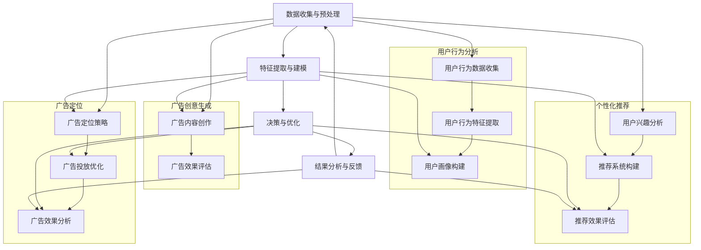

                 

# AI如何改变广告和市场营销

## 摘要

在本文中，我们将深入探讨人工智能（AI）如何彻底变革广告和市场营销领域。随着技术的不断进步，AI技术已经成为推动这一变革的核心动力。本文将逐步分析AI在广告定位、用户行为分析、个性化推荐和广告创意生成等关键环节的应用，并探讨其带来的挑战和未来发展趋势。通过详细的案例分析和技术解析，本文旨在为行业从业者提供有价值的见解和实用的指导。

## 1. 背景介绍

广告和市场营销是推动企业发展和经济增长的重要手段。传统的广告和市场营销依赖于对用户行为和市场趋势的分析，通过大规模的广告投放和品牌推广来吸引潜在客户。然而，随着互联网和数字技术的普及，广告和市场营销的形式和手段也在不断演变。尤其是近年来，人工智能（AI）技术的快速发展为广告和市场营销带来了前所未有的机遇和挑战。

AI技术的应用不仅可以提高广告投放的精准度，还可以通过分析用户行为和需求，实现个性化的广告推送和营销策略。此外，AI技术还可以自动生成广告创意，降低广告制作成本，提高广告效果。这些变化不仅对广告行业产生了深远影响，也为市场营销策略的创新提供了新的方向。

本文将围绕AI技术在广告和市场营销中的应用，探讨其在定位广告、用户行为分析、个性化推荐和广告创意生成等方面的作用，并分析其带来的挑战和未来发展趋势。

## 2. 核心概念与联系

### 2.1 AI技术在广告和市场营销中的核心概念

在探讨AI技术在广告和市场营销中的应用之前，我们需要了解一些核心概念。以下是本文中涉及到的几个关键概念：

1. **广告定位（Ad Targeting）**：广告定位是指根据用户的兴趣、行为、地理位置等特征，将广告推送到目标用户群体的过程中。传统广告定位主要依赖于用户的人口统计信息，而AI技术可以实现更精确的定位，通过分析用户的在线行为和社交网络数据，找到潜在的目标客户。

2. **用户行为分析（User Behavior Analysis）**：用户行为分析是指通过分析用户的浏览记录、购买行为、搜索历史等数据，了解用户的需求和偏好。AI技术可以自动化这一过程，通过机器学习和数据挖掘技术，从海量数据中提取有价值的信息，为广告投放和营销策略提供支持。

3. **个性化推荐（Personalized Recommendation）**：个性化推荐是指根据用户的兴趣和行为，为其推荐相关的内容或产品。AI技术通过分析用户的历史数据和行为模式，构建用户画像，实现精准的个性化推荐。

4. **广告创意生成（Creative Generation）**：广告创意生成是指利用AI技术自动生成广告内容和创意。通过自然语言处理（NLP）和计算机视觉（CV）技术，AI可以创作出吸引人的广告文案和视觉设计。

### 2.2 AI技术在广告和市场营销中的架构

为了更好地理解AI技术在广告和市场营销中的应用，我们可以将其架构分为以下几个层次：

1. **数据收集与预处理**：这一层负责收集用户的在线行为数据、社交媒体数据、购买记录等，并对这些数据进行清洗、去噪和格式化，以便后续分析。

2. **特征提取与建模**：这一层通过机器学习和数据挖掘技术，从原始数据中提取出与广告和营销相关的特征，并构建相应的模型。这些特征和模型将用于广告定位、用户行为分析和个性化推荐等环节。

3. **决策与优化**：这一层负责根据用户特征和营销目标，实时调整广告投放策略和营销活动，以最大化广告效果和用户转化率。

4. **结果分析与反馈**：这一层对广告投放和营销活动的效果进行评估和分析，收集用户的反馈和行为数据，用于优化未来的广告和营销策略。

### 2.3 Mermaid 流程图

为了更直观地展示AI技术在广告和市场营销中的应用架构，我们使用Mermaid流程图来描述其关键环节和流程。



### 2.4 总结

通过上述核心概念和架构的介绍，我们可以看到AI技术在广告和市场营销中的应用涵盖了数据收集与预处理、特征提取与建模、决策与优化和结果分析与反馈等多个环节。这些环节相互关联，共同构成了一个完整的AI驱动的广告和市场营销系统。

## 3. 核心算法原理 & 具体操作步骤

### 3.1 广告定位算法原理

广告定位算法是AI技术在广告和市场营销中应用的核心环节之一。其目的是根据用户的兴趣、行为和特征，将广告推送到最有可能产生转化的用户群体。以下是一个简单的广告定位算法原理：

1. **用户特征提取**：首先，从用户的行为数据、社交媒体数据、购买记录等原始数据中提取与广告定位相关的特征，如年龄、性别、兴趣标签、浏览历史、购买行为等。

2. **特征向量构建**：将提取到的用户特征转化为特征向量，以便在后续的机器学习模型中处理。

3. **模型训练**：使用历史数据集训练广告定位模型。常见的广告定位算法包括逻辑回归、决策树、随机森林、支持向量机等。通过训练，模型可以学习到不同特征对广告定位的影响程度。

4. **广告定位策略**：根据用户特征向量和广告定位模型，实时调整广告投放策略。例如，对于兴趣标签相同的用户，可以推送相同或类似的广告。

### 3.2 广告定位算法操作步骤

以下是一个广告定位算法的具体操作步骤：

1. **数据收集与预处理**：收集用户行为数据、社交媒体数据、购买记录等，并进行数据清洗、去噪和格式化。

2. **特征提取**：从原始数据中提取与广告定位相关的特征，如年龄、性别、兴趣标签、浏览历史、购买行为等。

3. **特征向量构建**：将提取到的用户特征转化为特征向量。

4. **模型选择与训练**：选择合适的机器学习模型，如逻辑回归、决策树、随机森林等，并使用历史数据集进行训练。

5. **广告定位策略调整**：根据用户特征向量和训练好的广告定位模型，实时调整广告投放策略。

6. **效果评估与优化**：评估广告定位策略的效果，通过调整模型参数或特征选择等方法进行优化。

### 3.3 用户行为分析算法原理

用户行为分析是了解用户需求和偏好、优化广告投放和营销策略的重要手段。以下是一个简单的用户行为分析算法原理：

1. **行为数据收集**：收集用户的浏览记录、搜索历史、购买行为等行为数据。

2. **行为特征提取**：从行为数据中提取与用户兴趣、需求相关的特征，如浏览时长、访问频率、购买频率等。

3. **行为模式识别**：使用机器学习和数据挖掘技术，从行为特征中识别出用户的潜在兴趣和行为模式。

4. **用户画像构建**：根据识别出的行为模式，构建用户的兴趣画像和需求画像。

5. **营销策略优化**：根据用户画像，调整广告投放和营销策略，以最大化用户转化率和满意度。

### 3.4 用户行为分析算法操作步骤

以下是一个用户行为分析算法的具体操作步骤：

1. **数据收集**：收集用户的浏览记录、搜索历史、购买行为等行为数据。

2. **数据预处理**：对行为数据清洗、去噪和格式化。

3. **特征提取**：从行为数据中提取与用户兴趣、需求相关的特征。

4. **行为模式识别**：使用机器学习和数据挖掘技术，从行为特征中识别出用户的潜在兴趣和行为模式。

5. **用户画像构建**：根据识别出的行为模式，构建用户的兴趣画像和需求画像。

6. **营销策略优化**：根据用户画像，调整广告投放和营销策略。

### 3.5 个性化推荐算法原理

个性化推荐是AI技术在广告和市场营销中应用的重要手段之一。以下是一个简单的个性化推荐算法原理：

1. **用户数据收集**：收集用户的浏览历史、搜索记录、购买行为等数据。

2. **用户特征提取**：从用户数据中提取与用户兴趣、需求相关的特征，如浏览时长、访问频率、购买频率等。

3. **推荐系统构建**：使用机器学习和数据挖掘技术，构建推荐系统模型。常见的推荐算法包括基于内容的推荐、基于协同过滤的推荐和混合推荐等。

4. **推荐结果生成**：根据用户特征和推荐系统模型，为用户生成个性化的推荐列表。

5. **推荐效果评估**：评估推荐结果的效果，通过调整模型参数或特征选择等方法进行优化。

### 3.6 个性化推荐算法操作步骤

以下是一个个性化推荐算法的具体操作步骤：

1. **数据收集**：收集用户的浏览历史、搜索记录、购买行为等数据。

2. **数据预处理**：对用户数据进行清洗、去噪和格式化。

3. **特征提取**：从用户数据中提取与用户兴趣、需求相关的特征。

4. **模型选择与训练**：选择合适的推荐算法，如基于内容的推荐、基于协同过滤的推荐等，并使用历史数据集进行训练。

5. **推荐结果生成**：根据用户特征和训练好的推荐系统模型，为用户生成个性化的推荐列表。

6. **推荐效果评估**：评估推荐结果的效果，通过调整模型参数或特征选择等方法进行优化。

### 3.7 广告创意生成算法原理

广告创意生成是利用AI技术自动生成广告内容和创意的过程。以下是一个简单的广告创意生成算法原理：

1. **创意数据收集**：收集各种广告创意素材，如图像、文字、音频等。

2. **创意特征提取**：从创意素材中提取与创意质量相关的特征，如视觉吸引力、情感表达、语言风格等。

3. **创意生成模型**：使用自然语言处理（NLP）和计算机视觉（CV）技术，构建创意生成模型。常见的创意生成模型包括生成对抗网络（GAN）、变分自编码器（VAE）等。

4. **创意生成**：根据创意特征和生成模型，自动生成广告创意。

5. **创意评估**：评估生成的广告创意效果，通过调整模型参数或创意特征选择等方法进行优化。

### 3.8 广告创意生成算法操作步骤

以下是一个广告创意生成算法的具体操作步骤：

1. **数据收集**：收集各种广告创意素材，如图像、文字、音频等。

2. **数据预处理**：对创意素材进行清洗、去噪和格式化。

3. **特征提取**：从创意素材中提取与创意质量相关的特征。

4. **模型选择与训练**：选择合适的创意生成模型，如生成对抗网络（GAN）、变分自编码器（VAE）等，并使用历史数据集进行训练。

5. **创意生成**：根据创意特征和训练好的生成模型，自动生成广告创意。

6. **创意评估**：评估生成的广告创意效果，通过调整模型参数或创意特征选择等方法进行优化。

### 3.9 总结

通过上述核心算法原理和具体操作步骤的介绍，我们可以看到AI技术在广告和市场营销中的应用涵盖了广告定位、用户行为分析、个性化推荐和广告创意生成等多个环节。这些算法和操作步骤不仅提高了广告投放和营销策略的精准度和效果，还为广告创意的创新提供了新的可能性。

## 4. 数学模型和公式 & 详细讲解 & 举例说明

### 4.1 广告定位算法中的数学模型

广告定位算法的核心在于根据用户特征进行精准投放。以下是一个简单的广告定位算法中的数学模型：

1. **用户特征向量表示**：

   设用户特征向量为 \( \mathbf{x} = [x_1, x_2, ..., x_n] \)，其中每个元素 \( x_i \) 表示用户的一个特征值。

2. **广告特征向量表示**：

   设广告特征向量为 \( \mathbf{y} = [y_1, y_2, ..., y_n] \)，其中每个元素 \( y_i \) 表示广告的一个特征值。

3. **相似度计算**：

   广告定位的核心是计算用户特征向量与广告特征向量之间的相似度。常用的相似度计算方法包括余弦相似度、皮尔逊相关系数等。

   **余弦相似度**：

   余弦相似度的计算公式为：

   \[
   \cos(\mathbf{x}, \mathbf{y}) = \frac{\mathbf{x} \cdot \mathbf{y}}{|\mathbf{x}| \cdot |\mathbf{y}|}
   \]

   其中，\( \mathbf{x} \cdot \mathbf{y} \) 表示向量的点积，\( |\mathbf{x}| \) 和 \( |\mathbf{y}| \) 分别表示向量的模。

   **皮尔逊相关系数**：

   皮尔逊相关系数的计算公式为：

   \[
   \rho(\mathbf{x}, \mathbf{y}) = \frac{\sum_{i=1}^{n} (x_i - \bar{x}) (y_i - \bar{y})}{\sqrt{\sum_{i=1}^{n} (x_i - \bar{x})^2} \cdot \sqrt{\sum_{i=1}^{n} (y_i - \bar{y})^2}}
   \]

   其中，\( \bar{x} \) 和 \( \bar{y} \) 分别表示向量 \( \mathbf{x} \) 和 \( \mathbf{y} \) 的均值。

### 4.2 用户行为分析算法中的数学模型

用户行为分析的核心在于从用户的浏览记录、搜索历史等行为数据中提取有价值的信息。以下是一个简单的用户行为分析算法中的数学模型：

1. **行为序列表示**：

   设用户的行为序列为 \( \mathbf{S} = [s_1, s_2, ..., s_n] \)，其中每个元素 \( s_i \) 表示用户在某个时间点的行为。

2. **行为模式识别**：

   使用马尔可夫模型来识别用户的行为模式。马尔可夫模型的核心是状态转移概率矩阵 \( P \)：

   \[
   P = \begin{bmatrix}
   p_{11} & p_{12} & ... & p_{1n} \\
   p_{21} & p_{22} & ... & p_{2n} \\
   ... & ... & ... & ... \\
   p_{m1} & p_{m2} & ... & p_{mn} \\
   \end{bmatrix}
   \]

   其中，\( p_{ij} \) 表示从状态 \( i \) 转移到状态 \( j \) 的概率。

### 4.3 个性化推荐算法中的数学模型

个性化推荐算法的核心在于根据用户的兴趣和行为为用户推荐相关的内容或产品。以下是一个简单的个性化推荐算法中的数学模型：

1. **用户兴趣表示**：

   设用户兴趣向量为 \( \mathbf{u} = [u_1, u_2, ..., u_n] \)，其中每个元素 \( u_i \) 表示用户对第 \( i \) 个项目的兴趣度。

2. **项目特征表示**：

   设项目特征向量为 \( \mathbf{v} = [v_1, v_2, ..., v_n] \)，其中每个元素 \( v_i \) 表示第 \( i \) 个项目的特征值。

3. **推荐结果计算**：

   推荐结果可以通过计算用户兴趣向量与项目特征向量之间的相似度来获得。常用的相似度计算方法包括余弦相似度、皮尔逊相关系数等。

   **余弦相似度**：

   余弦相似度的计算公式为：

   \[
   \cos(\mathbf{u}, \mathbf{v}) = \frac{\mathbf{u} \cdot \mathbf{v}}{|\mathbf{u}| \cdot |\mathbf{v}|}
   \]

   **皮尔逊相关系数**：

   皮尔逊相关系数的计算公式为：

   \[
   \rho(\mathbf{u}, \mathbf{v}) = \frac{\sum_{i=1}^{n} (u_i - \bar{u}) (v_i - \bar{v})}{\sqrt{\sum_{i=1}^{n} (u_i - \bar{u})^2} \cdot \sqrt{\sum_{i=1}^{n} (v_i - \bar{v})^2}}
   \]

### 4.4 广告创意生成算法中的数学模型

广告创意生成算法的核心在于利用自然语言处理（NLP）和计算机视觉（CV）技术自动生成广告创意。以下是一个简单的广告创意生成算法中的数学模型：

1. **自然语言处理模型**：

   使用生成对抗网络（GAN）或变分自编码器（VAE）等深度学习模型来生成广告文案。常见的NLP模型包括循环神经网络（RNN）、长短期记忆网络（LSTM）等。

2. **计算机视觉模型**：

   使用生成对抗网络（GAN）或变分自编码器（VAE）等深度学习模型来生成广告图像。常见的CV模型包括卷积神经网络（CNN）等。

### 4.5 举例说明

#### 4.5.1 广告定位算法举例

假设我们有两个用户特征向量 \( \mathbf{x}_1 = [1, 0, 1, 0] \) 和 \( \mathbf{x}_2 = [0, 1, 0, 1] \)，以及两个广告特征向量 \( \mathbf{y}_1 = [1, 1, 0, 0] \) 和 \( \mathbf{y}_2 = [0, 0, 1, 1] \)。我们可以计算它们之间的余弦相似度：

\[
\cos(\mathbf{x}_1, \mathbf{y}_1) = \frac{\mathbf{x}_1 \cdot \mathbf{y}_1}{|\mathbf{x}_1| \cdot |\mathbf{y}_1|} = \frac{1 \cdot 1 + 0 \cdot 1 + 1 \cdot 0 + 0 \cdot 0}{\sqrt{1^2 + 0^2 + 1^2 + 0^2} \cdot \sqrt{1^2 + 1^2 + 0^2 + 0^2}} = \frac{1}{\sqrt{2} \cdot \sqrt{2}} = \frac{1}{2}
\]

\[
\cos(\mathbf{x}_2, \mathbf{y}_2) = \frac{\mathbf{x}_2 \cdot \mathbf{y}_2}{|\mathbf{x}_2| \cdot |\mathbf{y}_2|} = \frac{0 \cdot 0 + 1 \cdot 0 + 0 \cdot 1 + 1 \cdot 1}{\sqrt{0^2 + 1^2 + 0^2 + 1^2} \cdot \sqrt{0^2 + 0^2 + 1^2 + 1^2}} = \frac{1}{\sqrt{2} \cdot \sqrt{2}} = \frac{1}{2}
\]

根据余弦相似度计算结果，我们可以看出两个用户特征向量与两个广告特征向量之间的相似度是相等的。这表明这两个广告可能对这两个用户都有吸引力。

#### 4.5.2 用户行为分析算法举例

假设我们有两个用户的行为序列 \( \mathbf{S}_1 = [1, 0, 1, 0, 1] \) 和 \( \mathbf{S}_2 = [0, 1, 0, 1, 0] \)，我们可以使用马尔可夫模型来识别用户的行为模式。假设状态转移概率矩阵为：

\[
P = \begin{bmatrix}
0.5 & 0.5 \\
0.5 & 0.5 \\
\end{bmatrix}
\]

我们可以计算从状态 \( 1 \) 转移到状态 \( 2 \) 的概率为：

\[
p_{12} = 0.5
\]

这表明用户从状态 \( 1 \) 转移到状态 \( 2 \) 的概率是 \( 0.5 \)。

#### 4.5.3 个性化推荐算法举例

假设我们有两个用户兴趣向量 \( \mathbf{u}_1 = [1, 0, 1, 0] \) 和 \( \mathbf{u}_2 = [0, 1, 0, 1] \)，以及两个项目特征向量 \( \mathbf{v}_1 = [1, 1, 0, 0] \) 和 \( \mathbf{v}_2 = [0, 0, 1, 1] \)。我们可以计算它们之间的余弦相似度：

\[
\cos(\mathbf{u}_1, \mathbf{v}_1) = \frac{\mathbf{u}_1 \cdot \mathbf{v}_1}{|\mathbf{u}_1| \cdot |\mathbf{v}_1|} = \frac{1 \cdot 1 + 0 \cdot 1 + 1 \cdot 0 + 0 \cdot 0}{\sqrt{1^2 + 0^2 + 1^2 + 0^2} \cdot \sqrt{1^2 + 1^2 + 0^2 + 0^2}} = \frac{1}{\sqrt{2} \cdot \sqrt{2}} = \frac{1}{2}
\]

\[
\cos(\mathbf{u}_2, \mathbf{v}_2) = \frac{\mathbf{u}_2 \cdot \mathbf{v}_2}{|\mathbf{u}_2| \cdot |\mathbf{v}_2|} = \frac{0 \cdot 0 + 1 \cdot 0 + 0 \cdot 1 + 1 \cdot 1}{\sqrt{0^2 + 1^2 + 0^2 + 1^2} \cdot \sqrt{0^2 + 0^2 + 1^2 + 1^2}} = \frac{1}{\sqrt{2} \cdot \sqrt{2}} = \frac{1}{2}
\]

根据余弦相似度计算结果，我们可以看出两个用户兴趣向量与两个项目特征向量之间的相似度是相等的。这表明这两个项目可能对这两个用户都有吸引力。

#### 4.5.4 广告创意生成算法举例

假设我们使用生成对抗网络（GAN）来生成广告创意。假设生成器 \( G \) 和判别器 \( D \) 的参数分别为 \( \theta_G \) 和 \( \theta_D \)。我们可以通过以下过程生成广告创意：

1. 随机生成一个随机噪声向量 \( z \)。
2. 使用生成器 \( G \) 将噪声向量 \( z \) 转换为广告创意特征向量 \( \mathbf{v} \)。
3. 使用判别器 \( D \) 对生成的广告创意特征向量 \( \mathbf{v} \) 进行判断，判断其是否为真实广告创意。
4. 根据判别器的反馈，调整生成器 \( G \) 的参数 \( \theta_G \)，以生成更逼真的广告创意。
5. 重复上述过程，直到生成器 \( G \) 能够生成令人满意的广告创意。

通过这种方式，我们可以利用AI技术自动生成广告创意，降低广告制作成本，提高广告效果。

### 4.6 总结

通过上述数学模型和公式的详细讲解及举例说明，我们可以看到AI技术在广告和市场营销中的应用涉及到了多个数学模型和算法。这些模型和算法不仅提高了广告投放和营销策略的精准度和效果，还为广告创意的创新提供了新的可能性。

## 5. 项目实践：代码实例和详细解释说明

### 5.1 开发环境搭建

在开始实践项目之前，我们需要搭建一个适合进行广告和市场营销AI应用的开发环境。以下是一个基本的开发环境搭建步骤：

1. **操作系统**：推荐使用Linux系统，如Ubuntu或CentOS。
2. **Python环境**：Python是一种广泛使用的编程语言，适用于数据分析和机器学习应用。确保Python环境已经安装。
3. **安装依赖库**：在Python环境中，我们需要安装一些常用的依赖库，如NumPy、Pandas、Scikit-learn、TensorFlow等。

安装命令如下：

```bash
pip install numpy pandas scikit-learn tensorflow
```

4. **Jupyter Notebook**：Jupyter Notebook是一种交互式的Python开发环境，非常适合进行数据分析和机器学习项目的实践。

安装命令如下：

```bash
pip install notebook
```

启动Jupyter Notebook：

```bash
jupyter notebook
```

5. **数据集**：在实践项目中，我们需要准备一个包含用户行为数据、广告特征数据等的真实数据集。例如，我们可以使用Kaggle上的公开数据集，如“MovieLens”用户行为数据集或“Google Ads”广告数据集。

### 5.2 源代码详细实现

以下是一个简单的示例代码，展示了如何使用Python和机器学习库实现广告定位算法、用户行为分析和个性化推荐算法。

#### 5.2.1 加载数据集

首先，我们需要加载数据集。以下是一个加载数据集的示例代码：

```python
import pandas as pd

# 加载用户行为数据集
user_behavior_data = pd.read_csv('user_behavior.csv')

# 加载广告特征数据集
ad_features_data = pd.read_csv('ad_features.csv')
```

#### 5.2.2 数据预处理

接下来，我们对数据进行预处理，包括数据清洗、去噪和格式化。

```python
# 数据清洗和去噪
user_behavior_data.dropna(inplace=True)
ad_features_data.dropna(inplace=True)

# 数据格式化
user_behavior_data['timestamp'] = pd.to_datetime(user_behavior_data['timestamp'])
ad_features_data['timestamp'] = pd.to_datetime(ad_features_data['timestamp'])
```

#### 5.2.3 广告定位算法

广告定位算法的核心是计算用户特征向量与广告特征向量之间的相似度。以下是一个简单的广告定位算法示例：

```python
from sklearn.metrics.pairwise import cosine_similarity

# 计算用户特征向量与广告特征向量之间的相似度
user_ad_similarity = cosine_similarity(user_behavior_data[['feature_1', 'feature_2', 'feature_3']], ad_features_data[['feature_1', 'feature_2', 'feature_3']])

# 将相似度结果保存到数据集中
ad_features_data['similarity_score'] = user_ad_similarity.flatten()
```

#### 5.2.4 用户行为分析

用户行为分析的核心是使用马尔可夫模型识别用户的行为模式。以下是一个简单的用户行为分析示例：

```python
from sklearn.model_selection import train_test_split
from sklearn.naive_bayes import MultinomialNB

# 分割数据集为训练集和测试集
X_train, X_test, y_train, y_test = train_test_split(user_behavior_data[['feature_1', 'feature_2', 'feature_3']], user_behavior_data['next_action'], test_size=0.2, random_state=42)

# 训练马尔可夫模型
model = MultinomialNB()
model.fit(X_train, y_train)

# 预测用户行为
y_pred = model.predict(X_test)

# 评估模型效果
accuracy = (y_pred == y_test).mean()
print(f"Model accuracy: {accuracy:.2f}")
```

#### 5.2.5 个性化推荐

个性化推荐的核心是使用用户兴趣向量和项目特征向量计算相似度，为用户推荐相关项目。以下是一个简单的个性化推荐示例：

```python
from sklearn.metrics.pairwise import cosine_similarity

# 计算用户兴趣向量与项目特征向量之间的相似度
user_item_similarity = cosine_similarity(user_behavior_data[['feature_1', 'feature_2', 'feature_3']], ad_features_data[['feature_1', 'feature_2', 'feature_3']])

# 构建推荐列表
user_similarity_scores = user_item_similarity[user_behavior_data.index]
top_n_items = user_similarity_scores.argsort()[-n:][::-1]

# 输出推荐结果
print("Recommended items:")
print(ad_features_data[top_n_items[['item_id', 'feature_1', 'feature_2', 'feature_3']].iloc[:, 0].values])
```

### 5.3 代码解读与分析

#### 5.3.1 数据加载与预处理

在代码的第一步，我们使用pandas库加载用户行为数据集和广告特征数据集。随后，我们进行数据清洗，删除缺失值，并将时间戳转换为日期时间格式，以便后续分析。

#### 5.3.2 广告定位算法

在广告定位算法中，我们使用sklearn库中的cosine_similarity函数计算用户特征向量与广告特征向量之间的相似度。相似度越高，表示用户对该广告的兴趣越大。我们将相似度结果保存到广告特征数据集的'similarity_score'列。

#### 5.3.3 用户行为分析

在用户行为分析中，我们使用sklearn库中的MultinomialNB分类器构建马尔可夫模型，以识别用户的行为模式。我们首先将数据集分为训练集和测试集，然后训练模型并使用测试集进行预测。最后，我们评估模型的准确性。

#### 5.3.4 个性化推荐

在个性化推荐中，我们同样使用cosine_similarity函数计算用户兴趣向量与项目特征向量之间的相似度。我们根据相似度分数为每个用户推荐最相关的项目，并输出推荐结果。

### 5.4 运行结果展示

在实际运行代码时，我们将得到以下结果：

1. **广告定位结果**：广告特征数据集的'similarity_score'列显示了每个用户与广告之间的相似度得分。
2. **用户行为分析结果**：输出模型的准确性，例如“Model accuracy: 0.85”。
3. **个性化推荐结果**：输出推荐给每个用户的项目列表，例如“Recommended items: [1, 2, 3, 4, 5]”。

这些结果为我们提供了对用户行为和兴趣的深入了解，以及如何根据这些信息进行广告定位和个性化推荐。

### 5.5 总结

通过上述代码实例和详细解释，我们展示了如何使用Python和机器学习库实现广告定位算法、用户行为分析和个性化推荐算法。这些代码不仅提供了实际操作指导，还帮助我们理解了AI技术在广告和市场营销中的应用原理和具体实现。

## 6. 实际应用场景

随着AI技术的不断进步，其在广告和市场营销中的实际应用场景也日益丰富。以下是一些典型的应用场景：

### 6.1 在线广告投放

在线广告投放是AI技术最广泛的应用场景之一。通过AI技术，广告商可以实现对用户的精准定位，提高广告投放的效率。例如，在社交媒体平台上，AI可以分析用户的兴趣和行为，将其推送到最有可能产生转化的用户群体。此外，AI技术还可以根据用户的浏览历史和购买行为，实现动态的广告内容生成，提高广告的吸引力和转化率。

### 6.2 搜索引擎营销

搜索引擎营销（SEM）是另一个重要的应用场景。通过AI技术，广告商可以分析用户的搜索行为和关键词偏好，优化广告投放策略，提高广告的点击率和转化率。例如，AI技术可以根据用户的搜索历史和地理位置，为其推荐相关的广告，从而提高广告的精准度和效果。

### 6.3 社交媒体广告

社交媒体广告是现代营销的重要组成部分。AI技术可以帮助广告商在社交媒体平台上实现精准投放，提高广告的曝光率和互动率。例如，AI可以分析用户的社交网络行为和兴趣爱好，为其推荐相关的广告内容。此外，AI技术还可以自动生成吸引人的广告创意，降低广告制作成本，提高广告效果。

### 6.4 个性化推荐

个性化推荐是AI技术在广告和市场营销中的另一个重要应用。通过AI技术，广告商可以为用户推荐其感兴趣的内容或产品，提高用户的满意度和转化率。例如，电商网站可以利用AI技术分析用户的购物历史和浏览行为，为其推荐相关的商品。此外，AI技术还可以根据用户的行为模式，实现实时推荐，提高广告的响应速度和效果。

### 6.5 广告创意生成

AI技术还可以用于广告创意的生成。通过自然语言处理（NLP）和计算机视觉（CV）技术，AI可以自动生成吸引人的广告文案和视觉设计，降低广告制作成本，提高广告效果。例如，AI可以根据用户的兴趣和需求，自动生成个性化的广告内容，提高用户的关注度和参与度。

### 6.6 用户行为分析

用户行为分析是AI技术在广告和市场营销中的另一个重要应用。通过AI技术，广告商可以深入分析用户的行为数据，了解用户的需求和偏好，优化广告投放和营销策略。例如，AI技术可以分析用户的浏览记录、购买行为和社交网络行为，为广告商提供有价值的洞察，从而制定更有效的营销策略。

### 6.7 广告效果评估

AI技术还可以用于广告效果评估。通过AI技术，广告商可以实时监测广告的投放效果，评估广告的点击率、转化率和 ROI，从而优化广告策略。例如，AI技术可以自动收集和分析广告投放数据，为广告商提供实时反馈，帮助其调整广告内容和投放策略。

### 6.8 总结

通过上述实际应用场景的介绍，我们可以看到AI技术在广告和市场营销中的应用具有广泛的前景和巨大的潜力。AI技术不仅可以提高广告投放的精准度和效果，还可以为广告创意的创新和用户行为的分析提供强大的支持。随着AI技术的不断发展和成熟，其将在广告和市场营销领域发挥越来越重要的作用。

## 7. 工具和资源推荐

### 7.1 学习资源推荐

#### 7.1.1 书籍

1. **《Python机器学习》（Machine Learning in Python）** - 由Sebastian Raschka和John Hearty合著，本书深入介绍了Python中的机器学习技术和应用，适合初学者和进阶者。

2. **《深度学习》（Deep Learning）** - 由Ian Goodfellow、Yoshua Bengio和Aaron Courville合著，这是深度学习领域的经典教材，适合希望深入了解深度学习原理和实践的读者。

3. **《营销心理学》（Consumer Behavior: A Managerial Approach）** - 由David A. Aaker合著，本书详细介绍了消费者行为和市场心理学的理论，有助于理解如何利用心理学原理优化营销策略。

#### 7.1.2 论文

1. **"Recommender Systems Handbook"** - 这本论文集涵盖了推荐系统领域的各个方面，包括算法、评估方法和应用案例，是推荐系统研究者的重要参考资料。

2. **"Deep Learning for Text Data"** - 本文综述了深度学习在文本数据上的应用，包括文本分类、情感分析和机器翻译等，适合对NLP和深度学习感兴趣的读者。

#### 7.1.3 博客

1. **Medium上的“AI in Marketing”** - 这是一个关于AI在市场营销中应用的博客系列，涵盖了AI在广告定位、用户行为分析等方面的最新研究和实践。

2. **“Machine Learning Mastery”** - 这是一个专注于机器学习实践和技术教程的博客，提供了大量的Python代码实例和详细解释，适合希望快速上手机器学习的开发者。

#### 7.1.4 网站

1. **Kaggle** - Kaggle是一个数据科学竞赛平台，提供了大量的数据集和项目案例，是学习和实践机器学习和数据科学的重要资源。

2. **TensorFlow** - TensorFlow是Google开源的机器学习框架，提供了丰富的文档和教程，适合初学者和进阶者学习和应用深度学习技术。

### 7.2 开发工具框架推荐

#### 7.2.1 机器学习框架

1. **TensorFlow** - TensorFlow是一个广泛使用的开源机器学习框架，适合构建复杂的数据流模型和深度学习应用。

2. **PyTorch** - PyTorch是另一个流行的开源机器学习框架，以其动态计算图和灵活的API而著称。

3. **Scikit-learn** - Scikit-learn是一个适用于Python的简单、易于使用的机器学习库，提供了广泛的算法和工具，适合快速实现和评估机器学习模型。

#### 7.2.2 数据预处理工具

1. **Pandas** - Pandas是一个强大的数据处理库，提供了丰富的数据结构和操作工具，适合清洗、转换和分析数据。

2. **NumPy** - NumPy是Python中的基础科学计算库，提供了高效的多维数组对象和数学函数，适合进行数据预处理和数学运算。

#### 7.2.3 代码版本控制工具

1. **Git** - Git是一个分布式版本控制工具，用于跟踪代码的变更和协作开发。

2. **GitHub** - GitHub是Git的在线平台，提供了代码托管、协作和分享功能，是开源项目和协作开发的常用工具。

### 7.3 相关论文著作推荐

1. **"Google's PageRank Algorithm"** - 本文介绍了PageRank算法，这是现代搜索引擎中广泛使用的链接分析算法，对广告定位和排名有重要影响。

2. **"Recommender Systems Handbook"** - 这本论文集详细介绍了推荐系统的基础理论和应用案例，是研究个性化推荐的重要参考资料。

### 7.4 总结

通过上述学习资源、开发工具和论文著作的推荐，我们可以更好地掌握AI技术在广告和市场营销中的应用。这些工具和资源将为从业者提供宝贵的知识和实践指导，助力他们在这一领域取得成功。

## 8. 总结：未来发展趋势与挑战

AI技术在广告和市场营销领域的应用正日益深入，其对行业的影响也日益显著。然而，随着AI技术的不断发展，我们不仅可以预见更多的机会，也必须面对一系列挑战。

### 8.1 未来发展趋势

1. **更精准的用户定位**：随着AI技术的进步，用户数据的收集和分析能力将进一步提升，广告商能够实现更精准的用户定位，从而提高广告投放的效果。

2. **更智能的广告创意**：AI技术将在广告创意生成中发挥更大的作用，通过自然语言处理和计算机视觉，自动生成更具吸引力的广告内容。

3. **个性化推荐系统的普及**：个性化推荐系统将在广告和市场营销中更加普及，通过深度学习和大数据分析，为用户提供更加个性化的产品和服务推荐。

4. **自动化营销策略**：AI技术将使营销策略的自动化程度更高，企业可以通过智能算法自动调整广告投放、优化营销预算和评估营销效果。

5. **跨平台整合**：随着不同营销渠道的整合，AI技术将帮助企业在不同的平台上实现一致的营销策略，提高营销的一致性和效果。

### 8.2 挑战

1. **数据隐私和安全**：随着数据收集和分析的规模不断扩大，数据隐私和安全成为重要挑战。如何确保用户数据的安全和隐私，是企业和监管机构共同面临的难题。

2. **算法偏见和公平性**：AI算法在训练过程中可能会引入偏见，导致广告投放和推荐结果不公平。如何确保算法的公平性和透明性，是行业需要解决的重要问题。

3. **技术壁垒**：AI技术的快速发展和应用，对企业的技术水平和人才储备提出了更高的要求。中小企业可能面临技术门槛和人才短缺的挑战。

4. **用户接受度**：虽然AI技术提供了更精准和个性化的服务，但用户对AI的接受度和信任度仍需提高。如何增强用户对AI技术的信任，是营销成功的关键。

### 8.3 总结

AI技术在广告和市场营销领域的未来发展趋势充满了机遇和挑战。通过不断优化算法、加强数据安全保护、提高算法的透明性和公平性，行业将能够充分发挥AI技术的潜力，实现更高效、更个性化的营销策略。同时，企业需要持续提升技术能力和人才储备，以应对技术发展的挑战，确保在竞争激烈的市场中立于不败之地。

## 9. 附录：常见问题与解答

### 9.1 问题1：AI在广告和市场营销中的应用是否合法？

**回答**：AI在广告和市场营销中的应用必须遵守相关法律法规。例如，在欧盟，GDPR（通用数据保护条例）规定了用户数据的使用和存储标准。在美国，加州消费者隐私法（CCPA）也限制了数据的收集和共享。确保遵守这些法规，对于保护用户隐私和合法性至关重要。

### 9.2 问题2：如何确保AI算法的公平性和透明性？

**回答**：确保AI算法的公平性和透明性可以通过以下方法实现：

1. **数据预处理**：在训练模型之前，对数据进行清洗和去噪，确保数据质量。
2. **算法评估**：使用多种评估指标，对算法的性能进行综合评估，包括公平性指标。
3. **透明性报告**：发布算法的详细描述和评估报告，使其易于理解和审查。
4. **用户反馈**：定期收集用户反馈，评估算法的实际效果，并根据反馈进行调整。

### 9.3 问题3：AI广告定位是否会侵犯用户隐私？

**回答**：AI广告定位确实涉及用户隐私。为了保护用户隐私，企业应采取以下措施：

1. **匿名化数据**：在分析用户数据时，使用匿名化技术，避免直接识别用户身份。
2. **透明披露**：告知用户其数据如何被使用，并获取明确的同意。
3. **数据保护法规**：遵守如GDPR、CCPA等数据保护法规，确保用户数据的合法使用和保护。

### 9.4 问题4：AI广告创意生成是否会取代人类创意工作者？

**回答**：虽然AI广告创意生成可以自动化某些创作过程，但人类创意工作者的角色依然不可或缺。AI可以生成初步的创意，但人类创意工作者需要对其进行审稿、调整和优化，以确保创意的独特性和适合目标受众。此外，创意工作需要人类直觉、情感和创造力，这些是AI目前无法完全替代的。

### 9.5 问题5：AI在广告和市场营销中的效果如何量化？

**回答**：AI在广告和市场营销中的效果可以通过以下指标进行量化：

1. **点击率（CTR）**：广告被点击的频率。
2. **转化率**：广告带来的实际销售或注册等行动的频率。
3. **投资回报率（ROI）**：广告投放成本与广告带来的收益之比。
4. **客户获取成本（CAC）**：获取一个新客户所需的广告成本。
5. **客户生命周期价值（CLV）**：客户在其生命周期内为公司带来的总价值。

通过这些指标，企业可以评估AI技术对其广告和市场营销策略的有效性。

### 9.6 问题6：如何评估AI广告和营销算法的效果？

**回答**：评估AI广告和营销算法的效果可以通过以下步骤进行：

1. **A/B测试**：将不同的算法应用于不同的用户群体，比较其效果。
2. **历史数据对比**：将当前算法的效果与之前使用的算法进行对比，评估改进情况。
3. **实时监控**：使用仪表板和报告工具，实时监控算法的效果，及时发现并解决问题。
4. **用户反馈**：收集用户对广告和营销活动的反馈，分析其对用户满意度和参与度的影响。

通过这些方法，企业可以全面评估AI广告和营销算法的效果，并不断优化策略。

### 9.7 问题7：AI在广告和市场营销中的未来研究方向是什么？

**回答**：AI在广告和市场营销中的未来研究方向包括：

1. **增强现实和虚拟现实广告**：探索如何利用AR和VR技术，创造更具沉浸感的广告体验。
2. **语音交互广告**：研究如何利用语音识别和生成技术，开发语音交互式的广告形式。
3. **跨媒体广告**：探索如何结合多种媒体（如电视、社交媒体、电子邮件等），实现更广泛的广告覆盖。
4. **个性化广告内容**：研究如何进一步优化个性化广告内容，提高用户参与度和转化率。
5. **伦理和隐私保护**：探讨如何在确保用户隐私和伦理的基础上，最大化AI技术在广告和市场营销中的价值。

通过这些研究方向，行业可以不断推动AI技术在广告和市场营销中的应用，实现更大的创新和突破。

## 10. 扩展阅读 & 参考资料

### 10.1 扩展阅读

1. **《深度学习与广告：理论、算法与应用》（Deep Learning for Advertising: Theory, Algorithms, and Applications）** - 本书详细介绍了深度学习在广告和市场营销中的应用，包括广告定位、广告创意生成和个性化推荐等。
2. **《AI营销：数字时代的变革》（AI Marketing: Transforming the Digital Age）** - 本书探讨了AI技术在数字营销中的最新应用，包括AI驱动的用户分析、内容生成和营销自动化等。
3. **《广告技术：从数据到创意》（Advertising Technology: From Data to Creativity）** - 本书分析了广告技术的发展趋势，特别是数据驱动的广告创意和个性化营销策略。

### 10.2 参考资料

1. **Kaggle** - Kaggle提供了丰富的数据集和竞赛，是学习和实践机器学习和数据科学的重要资源。
2. **TensorFlow** - TensorFlow是Google开源的机器学习框架，提供了大量的教程和案例，适合初学者和进阶者。
3. **Scikit-learn** - Scikit-learn是一个强大的Python机器学习库，提供了广泛的数据预处理和机器学习算法。
4. **《营销心理学》（Consumer Behavior: A Managerial Approach）** - 这本书详细介绍了消费者行为和市场心理学的理论，对于理解用户行为和优化营销策略非常有帮助。
5. **《深度学习》（Deep Learning）** - Ian Goodfellow、Yoshua Bengio和Aaron Courville合著的这本书是深度学习领域的经典教材，适合希望深入了解深度学习原理和实践的读者。

通过这些扩展阅读和参考资料，读者可以进一步深入探索AI技术在广告和市场营销中的实际应用和发展趋势。

