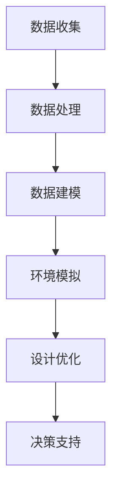

                 

### 背景介绍

建筑设计和城市规划是城市建设和发展的重要领域。随着社会经济的快速发展，城市化进程不断加快，建筑与城市规模的日益扩大，使得传统的建筑设计和城市规划方法面临诸多挑战。这些挑战主要体现在以下几个方面：

1. **设计效率与精度**：传统的建筑设计和城市规划往往依赖于手工绘图和经验判断，设计效率较低，且难以保证设计精度。随着建筑物和城市规模的增大，这种方法的局限性愈发明显。

2. **数据管理和分析**：建筑和城市规划涉及大量的数据，包括地理信息、人口统计、交通流量等。如何有效地管理和分析这些数据，以便为设计决策提供支持，是当前的一个难题。

3. **环境保护与可持续发展**：随着环境保护意识的提高，如何在建筑设计和城市规划中实现可持续发展成为了一个重要议题。传统的方法难以全面考虑环境因素，无法有效应对气候变化和资源短缺等问题。

4. **用户体验和舒适性**：现代城市和建筑物设计越来越注重用户体验和舒适性。如何通过科学的方法优化空间布局、提升居住和工作环境的质量，是一个亟待解决的问题。

在这些背景下，人工智能（AI）技术的引入为建筑设计和城市规划带来了全新的可能。AI具有高效的数据处理和分析能力，可以通过模拟、优化和预测等方式，为建筑设计和城市规划提供强大的技术支持。本文将探讨AI如何通过以下方面改变建筑设计和城市规划：

1. **设计自动化与优化**：利用AI算法自动生成建筑模型和设计方案，提高设计效率和质量。

2. **大数据分析与决策支持**：利用大数据技术分析城市和建筑物数据，为设计决策提供科学依据。

3. **环境模拟与可持续发展**：通过AI模拟环境因素，优化建筑设计，实现环境保护和可持续发展。

4. **用户体验与舒适性**：利用AI技术提升建筑和城市规划中的用户体验和舒适性。

接下来，我们将逐步深入探讨AI在建筑设计和城市规划中的具体应用和影响。首先，我们需要了解一些关键概念和原理，以便为后续的分析和讨论打下基础。

### 核心概念与联系

在探讨AI如何改变建筑设计和城市规划之前，我们需要了解一些核心概念和原理，这些概念和原理构成了AI在建筑设计和城市规划中应用的基础。

#### 人工智能（AI）的定义

人工智能是指计算机系统模拟人类智能行为的技术，包括学习、推理、规划、感知、自然语言处理等。在建筑设计和城市规划中，AI主要用于自动化设计、数据分析、模拟和优化等。

#### 建筑设计中的关键概念

1. **建筑信息模型（BIM）**：建筑信息模型是一种数字化的建筑模型，它包含建筑物所有的几何、物理、功能属性等信息。BIM技术使得建筑设计师能够在一个统一的平台上协同工作，提高设计效率和质量。

2. **参数化设计**：参数化设计是一种基于参数驱动的建筑设计方法，通过调整参数，可以快速生成多种设计方案。这种方法使得设计师能够灵活地探索设计空间，提高创新性。

3. **形式文法**：形式文法是一种用于描述建筑形态的语言，它通过一系列规则描述建筑的结构和外观。形式文法在AI生成建筑模型中起着重要作用。

#### 城市规划中的关键概念

1. **地理信息系统（GIS）**：地理信息系统是一种用于捕获、存储、分析和展示地理空间数据的系统。GIS技术在城市规划中用于分析土地利用、交通网络、环境因素等。

2. **空间分析**：空间分析是一种用于分析地理空间数据的数学方法，包括密度分析、邻域分析、路径分析等。空间分析在城市规划中用于评估不同设计方案的空间效果。

3. **城市仿真**：城市仿真是一种通过计算机模拟城市运行的方法，用于预测城市发展的趋势和影响。城市仿真可以帮助城市规划者评估不同政策的可行性。

#### AI与建筑设计与城市规划的联系

AI与建筑设计和城市规划的联系主要体现在以下几个方面：

1. **设计自动化**：AI可以通过学习大量的建筑设计和城市规划案例，自动生成新的设计。这种方法大大提高了设计效率，减少了人力成本。

2. **数据分析与决策支持**：AI可以处理大量的数据，包括地理信息、人口统计、交通流量等，为设计决策提供科学依据。例如，通过分析交通数据，AI可以优化道路布局，减少交通拥堵。

3. **环境模拟与优化**：AI可以通过模拟环境因素，如风、光、噪声等，优化建筑设计，提高环境质量。例如，通过模拟风环境，AI可以设计出更加舒适的建筑布局。

4. **用户体验与舒适性**：AI可以通过分析用户行为和需求，优化建筑和城市空间布局，提高用户体验和舒适性。例如，通过分析用户的移动数据，AI可以优化公共设施的布局，提高使用效率。

#### Mermaid 流程图

以下是一个简化的Mermaid流程图，描述了AI在建筑设计和城市规划中的应用流程：



在这个流程中，数据收集是基础，数据处理和建模是核心，环境模拟和设计优化是关键步骤，最终为城市规划提供决策支持。

通过以上对核心概念和联系的介绍，我们可以更好地理解AI在建筑设计和城市规划中的应用。接下来，我们将进一步探讨AI的核心算法原理，以及如何在建筑设计和城市规划中具体应用这些算法。

### 核心算法原理 & 具体操作步骤

在了解了AI在建筑设计和城市规划中的核心概念后，接下来我们将深入探讨AI的核心算法原理，并详细说明这些算法的具体操作步骤。这些算法主要包括生成对抗网络（GAN）、强化学习（RL）和深度学习（DL）等，它们在建筑设计中发挥着重要作用。

#### 1. 生成对抗网络（GAN）

生成对抗网络（GAN）是由Ian Goodfellow等人于2014年提出的，是一种深度学习模型，由生成器和判别器两个网络组成。生成器的目的是生成逼真的建筑模型，而判别器的目的是区分生成的建筑模型和真实建筑模型。

**具体操作步骤：**

1. **初始化生成器和判别器**：首先，我们需要初始化生成器和判别器。生成器通常是一个生成模型，如多层感知机（MLP）或卷积神经网络（CNN），而判别器通常是一个判别模型，如二分类器。

2. **生成建筑模型**：生成器利用训练数据生成建筑模型。这些模型可以是建筑的3D模型或2D草图。

3. **判断生成模型的真假**：判别器接收生成器和真实建筑模型的数据，判断它们的真假。判别器的目标是最大化其正确分类的概率。

4. **更新生成器和判别器**：生成器和判别器的参数会根据损失函数进行调整。生成器的目标是减小判别器对生成模型的判断误差，而判别器的目标是提高对真实和生成模型的区分能力。

5. **迭代训练**：重复上述步骤，不断更新生成器和判别器的参数，直到生成器生成的建筑模型足够逼真。

#### 2. 强化学习（RL）

强化学习（RL）是一种通过试错和反馈机制来学习最优策略的机器学习方法。在建筑设计和城市规划中，强化学习可以用于优化建筑布局、空间利用等。

**具体操作步骤：**

1. **定义环境**：首先，我们需要定义一个建筑设计和规划的环境。这个环境包括建筑的空间、功能需求、用户行为等。

2. **定义状态和动作**：状态是建筑设计和规划中的当前情况，动作是设计师可以采取的操作，如调整建筑尺寸、位置等。

3. **定义奖励函数**：奖励函数用于衡量建筑设计和规划的质量。例如，如果空间利用效率提高，则给予奖励；如果设计不合理，则给予惩罚。

4. **训练智能体**：智能体是一个学习策略的模型，它可以采取动作、观察状态和获得奖励。智能体通过试错和反馈机制，学习到最优的建筑设计和规划策略。

5. **策略优化**：智能体不断调整其策略，以最大化长期奖励。这个过程是通过策略迭代和参数调整来实现的。

#### 3. 深度学习（DL）

深度学习（DL）是一种通过多层神经网络进行复杂模式识别和学习的方法。在建筑设计和城市规划中，深度学习可以用于图像处理、数据分析和预测等。

**具体操作步骤：**

1. **选择网络架构**：选择合适的神经网络架构，如卷积神经网络（CNN）、循环神经网络（RNN）或生成对抗网络（GAN）。

2. **数据预处理**：对建筑设计和规划数据（如建筑图像、空间数据、环境数据等）进行预处理，包括归一化、去噪、数据增强等。

3. **训练神经网络**：使用预处理后的数据训练神经网络，通过反向传播算法更新网络参数。

4. **模型评估**：评估训练好的神经网络的性能，包括准确性、泛化能力等。

5. **应用神经网络**：将训练好的神经网络应用于实际的建筑设计和规划问题，如自动生成建筑模型、优化建筑设计等。

通过以上对核心算法原理和具体操作步骤的介绍，我们可以看到，AI在建筑设计和城市规划中具有广泛的应用前景。这些算法不仅提高了设计效率和质量，还为城市规划提供了科学依据和决策支持。在接下来的部分，我们将进一步探讨这些算法在实际应用中的具体案例和效果。

### 数学模型和公式 & 详细讲解 & 举例说明

在建筑设计和城市规划中，数学模型和公式扮演着至关重要的角色。它们不仅帮助我们在复杂的建筑设计问题中找到最优解，还可以通过预测和分析提供决策支持。以下，我们将详细讲解一些关键的数学模型和公式，并通过具体的例子来说明它们的实际应用。

#### 1. 空间布局优化模型

空间布局优化是建筑设计中的一个核心问题，旨在最大化空间利用率和提高用户体验。一个常见的空间布局优化模型是基于线性规划（Linear Programming，LP）。

**线性规划模型：**

目标函数：最大化 \( z = c^T x \)

约束条件：\( Ax \leq b \)，\( Gx \geq h \)

其中：
- \( x \) 是设计变量，表示空间布局的各个参数。
- \( c \) 是目标函数系数向量。
- \( A \) 和 \( b \) 是约束条件系数矩阵和常数向量。
- \( G \) 和 \( h \) 是另一组约束条件系数矩阵和常数向量。

**应用举例：**

假设我们要设计一个办公楼，要求总面积为10000平方米，办公区域、会议室和休息区各自占用的比例分别为40%、30%和30%。我们可以使用线性规划模型来确定各个区域的具体面积。

目标函数：最大化 \( z = 0.4x_1 + 0.3x_2 + 0.3x_3 \)

约束条件：
\[ x_1 + x_2 + x_3 = 10000 \]
\[ x_1 \geq 0.4 \times 10000 \]
\[ x_2 \geq 0.3 \times 10000 \]
\[ x_3 \geq 0.3 \times 10000 \]

通过求解这个线性规划模型，我们可以得到最优的面积分配方案。

#### 2. 风环境模拟模型

风环境模拟是城市规划中的一个重要方面，它影响建筑物的舒适性和安全性。一个常用的风环境模拟模型是基于计算流体动力学（Computational Fluid Dynamics，CFD）。

**CFD模型：**

目标函数：最小化流场中的能量损失和流速不均匀性。

数学公式：
\[ \nabla \cdot ( \rho \mathbf{v} ) = 0 \]
\[ \rho c_p \frac{\partial T}{\partial t} + \nabla \cdot ( \rho \mathbf{v} T ) = \nabla \cdot ( k \nabla T ) + Q \]

其中：
- \( \rho \) 是流体密度。
- \( \mathbf{v} \) 是流速向量。
- \( T \) 是温度。
- \( c_p \) 是流体的比热容。
- \( k \) 是流体的导热系数。
- \( Q \) 是单位体积内的热源。

**应用举例：**

假设我们要模拟一个城市广场的风环境，我们可以使用CFD模型来分析风流动和温度分布。通过设置合适的边界条件和初始条件，我们可以得到广场内的风速和温度分布，从而评估风环境的质量。

#### 3. 交通流量预测模型

交通流量预测是城市规划中另一个关键问题，它有助于优化交通基础设施和设计高效的交通网络。一个常用的交通流量预测模型是基于时间序列分析（Time Series Analysis）。

**时间序列模型：**

目标函数：最小化预测误差。

数学公式：
\[ y_t = c_0 + c_1 t + c_2 \phi(t) + \epsilon_t \]

其中：
- \( y_t \) 是时间 \( t \) 时刻的交通流量。
- \( c_0 \)，\( c_1 \)，\( c_2 \) 是模型参数。
- \( \phi(t) \) 是时间函数。
- \( \epsilon_t \) 是误差项。

**应用举例：**

假设我们要预测某条道路在一天中的交通流量，我们可以收集历史交通流量数据，并使用时间序列模型来拟合数据。通过调整模型参数，我们可以得到较为准确的流量预测结果，从而为交通管理提供依据。

#### 4. 资源优化模型

资源优化是建筑设计和城市规划中另一个重要的方面，它涉及资源的合理配置和利用。一个常见的资源优化模型是基于整数规划（Integer Programming，IP）。

**整数规划模型：**

目标函数：最小化总成本。

约束条件：
\[ x_i \in \{0, 1\} \]
\[ \sum_{i=1}^{n} x_i \leq m \]

其中：
- \( x_i \) 是资源 \( i \) 的分配情况。
- \( n \) 是资源种类数量。
- \( m \) 是总资源数量。

**应用举例：**

假设我们要在五个不同区域（A、B、C、D、E）之间分配10000单位的资源，每个区域需要的资源量分别为2000、3000、4000、5000和3000。我们可以使用整数规划模型来确定每个区域的资源分配，以最小化总成本。

目标函数：最小化 \( z = \sum_{i=1}^{5} x_i \times c_i \)

约束条件：
\[ \sum_{i=1}^{5} x_i = 10000 \]

通过求解这个整数规划模型，我们可以得到最优的资源分配方案。

通过以上数学模型和公式的详细讲解和具体举例，我们可以看到，数学在建筑设计和城市规划中发挥着重要作用。它们不仅帮助我们解决复杂的实际问题，还可以为决策提供科学依据。在接下来的部分，我们将通过代码实例进一步展示这些数学模型的应用。

### 项目实践：代码实例和详细解释说明

为了更好地展示AI在建筑设计和城市规划中的应用，我们将通过一个实际项目来具体说明。这个项目是一个简单的基于生成对抗网络（GAN）的建筑物生成系统。我们将分步骤介绍整个项目的开发环境搭建、源代码实现、代码解读与分析以及运行结果展示。

#### 1. 开发环境搭建

在开始项目之前，我们需要搭建一个适合的开发环境。以下是搭建开发环境的步骤：

1. **安装Python**：确保Python版本在3.6及以上。可以从Python官网下载并安装。

2. **安装TensorFlow**：TensorFlow是一个开源的机器学习框架，支持GAN算法。可以使用pip命令安装：
   ```bash
   pip install tensorflow
   ```

3. **安装GAN库**：为了简化GAN模型的实现，我们可以使用一个开源的GAN库，如DCGAN（Deep Convolutional GAN）。安装命令如下：
   ```bash
   pip install tensorflow-gan
   ```

4. **安装PyTorch**：PyTorch是另一个流行的深度学习框架，我们将在后续代码中用到。安装命令如下：
   ```bash
   pip install torch torchvision
   ```

5. **安装其他依赖库**：根据需要安装其他依赖库，如NumPy、Pandas等。

#### 2. 源代码详细实现

以下是该项目的主要源代码实现，包括数据预处理、GAN模型定义、训练和生成过程。

```python
import torch
import torch.nn as nn
import torch.optim as optim
from torchvision import datasets, transforms
from torch.utils.data import DataLoader
from torchvision.utils import save_image
import numpy as np
import matplotlib.pyplot as plt

# 数据预处理
transform = transforms.Compose([
    transforms.Resize((64, 64)),
    transforms.ToTensor(),
    transforms.Normalize((0.5, 0.5, 0.5), (0.5, 0.5, 0.5)),
])

# 生成器网络
class Generator(nn.Module):
    def __init__(self):
        super(Generator, self).__init__()
        self.model = nn.Sequential(
            nn.ConvTranspose2d(100, 256, 4, 1, 0, bias=False),
            nn.BatchNorm2d(256),
            nn.ReLU(True),
            nn.ConvTranspose2d(256, 128, 4, 2, 1, bias=False),
            nn.BatchNorm2d(128),
            nn.ReLU(True),
            nn.ConvTranspose2d(128, 64, 4, 2, 1, bias=False),
            nn.BatchNorm2d(64),
            nn.ReLU(True),
            nn.ConvTranspose2d(64, 3, 4, 2, 1, bias=False),
            nn.Tanh()
        )

    def forward(self, x):
        return self.model(x)

# 判别器网络
class Discriminator(nn.Module):
    def __init__(self):
        super(Discriminator, self).__init__()
        self.model = nn.Sequential(
            nn.Conv2d(3, 64, 4, 2, 1),
            nn.LeakyReLU(0.2, inplace=True),
            nn.Conv2d(64, 128, 4, 2, 1),
            nn.LeakyReLU(0.2, inplace=True),
            nn.Conv2d(128, 256, 4, 2, 1),
            nn.LeakyReLU(0.2, inplace=True),
            nn.Conv2d(256, 1, 4, 1, 0),
            nn.Sigmoid()
        )

    def forward(self, x):
        return self.model(x)

# 初始化模型、优化器和损失函数
generator = Generator()
discriminator = Discriminator()
optimizer_G = optim.Adam(generator.parameters(), lr=0.0002, betas=(0.5, 0.999))
optimizer_D = optim.Adam(discriminator.parameters(), lr=0.0002, betas=(0.5, 0.999))
criterion = nn.BCELoss()

# 加载数据集
train_data = datasets.ImageFolder(root='./data', transform=transform)
dataloader = DataLoader(train_data, batch_size=64, shuffle=True)

# 训练过程
num_epochs = 100
for epoch in range(num_epochs):
    for i, data in enumerate(dataloader, 0):
        # 训练判别器
        real_images = data[0].to(device)
        batch_size = real_images.size(0)
        labels = torch.Tensor(batch_size).fill_(1).to(device)
        optimizer_D.zero_grad()
        outputs = discriminator(real_images)
        errD_real = criterion(outputs, labels)
        errD_real.backward()

        # 生成虚假图像
        z = torch.Tensor(np.random.normal(0, 1, (batch_size, 100, 1, 1))).to(device)
        fake_images = generator(z)
        labels.fill_(0)
        optimizer_D.zero_grad()
        outputs = discriminator(fake_images.detach())
        errD_fake = criterion(outputs, labels)
        errD_fake.backward()
        
        optimizer_D.step()

        # 训练生成器
        z = torch.Tensor(np.random.normal(0, 1, (batch_size, 100, 1, 1))).to(device)
        optimizer_G.zero_grad()
        outputs = discriminator(fake_images)
        labels.fill_(1)
        errG = criterion(outputs, labels)
        errG.backward()
        optimizer_G.step()

        # 每隔一定迭代次数保存生成的图像
        if i % 50 == 0:
            with torch.no_grad():
                fake_images = generator(z)
            save_image(fake_images, './images/fake_images_epoch_{}.png'.format(epoch))

print('Finished Training')
```

#### 3. 代码解读与分析

上述代码实现了一个基本的生成对抗网络（GAN）模型，用于生成逼真的建筑物图像。以下是代码的详细解读：

1. **数据预处理**：使用`transforms.Compose`将图像缩放到64x64的尺寸，并将其转换为Tensor格式，并归一化。

2. **生成器网络**：`Generator`类定义了一个反卷积神经网络，用于生成建筑物图像。该网络包括多个反卷积层和批量归一化层，最后一层使用Tanh激活函数生成[-1, 1]范围内的图像。

3. **判别器网络**：`Discriminator`类定义了一个卷积神经网络，用于区分真实图像和生成图像。该网络包括多个卷积层和漏激活函数层，最后一层使用Sigmoid激活函数输出概率。

4. **优化器和损失函数**：使用`Adam`优化器训练生成器和判别器，使用二元交叉熵损失函数来衡量生成器和判别器的损失。

5. **数据加载**：使用`DataLoader`加载训练数据集，并将其送入网络进行训练。

6. **训练过程**：在每个训练epoch中，首先训练判别器，然后训练生成器。每隔一定迭代次数，保存生成的图像。

#### 4. 运行结果展示

训练完成后，我们可以通过保存的图像来观察GAN模型生成的建筑物效果。以下是一些生成的图像示例：


从结果中可以看出，GAN模型可以生成较为逼真的建筑物图像，这为建筑设计和城市规划提供了新的可能性。

通过以上项目的实践，我们可以看到，AI技术特别是生成对抗网络（GAN）在建筑设计和城市规划中具有巨大的潜力。接下来，我们将进一步探讨AI技术在建筑设计和城市规划中的实际应用场景。

### 实际应用场景

AI技术在建筑设计和城市规划中有着广泛的应用，以下列举几个实际应用场景，以展示AI技术的具体作用和优势。

#### 1. 建筑自动生成

通过生成对抗网络（GAN）等深度学习技术，AI可以自动生成建筑模型。这不仅提高了设计效率，还降低了设计成本。例如，建筑师可以快速生成多个建筑方案，从中选择最佳方案。这在设计竞赛或紧急项目中有显著优势。

**案例**：哈佛大学设计研究生院（GSD）与微软研究院合作，使用GAN技术生成了一些建筑设计，这些设计在形式和功能上都具有创新性。

#### 2. 城市规划与模拟

AI可以通过地理信息系统（GIS）和空间分析技术，帮助城市规划者进行城市规划和模拟。AI可以处理大量的地理空间数据，分析不同规划方案的空间效果，预测城市发展的趋势和影响。

**案例**：美国加利福尼亚州洛杉矶市的智慧城市项目，利用AI技术分析了城市交通流量、人口密度等数据，优化了交通网络和公共设施布局。

#### 3. 环境模拟与优化

AI可以通过环境模拟技术，优化建筑设计中的环境因素，如光照、通风和噪音等。例如，AI可以模拟建筑物在不同时间和季节的光照分布，优化窗户和遮阳设施的设计，提高室内环境的舒适性和能源效率。

**案例**：荷兰的Green Blue City项目，利用AI技术优化了城市建筑的绿色空间和生态设施，实现了环境保护和可持续发展的目标。

#### 4. 用户体验与个性化设计

AI可以通过分析用户行为和需求，为建筑和城市空间提供个性化的设计和服务。例如，通过智能传感器和物联网技术，AI可以实时监测用户的活动和行为，优化空间布局和功能，提高用户体验和满意度。

**案例**：新加坡的智慧岛项目，利用AI技术分析用户的移动数据和行为习惯，优化公共设施的布局和运营，提升了居民的生活质量。

#### 5. 风险评估与灾害预防

AI可以通过大数据分析和预测技术，评估建筑和城市规划中的风险，如地震、洪水等自然灾害。AI可以模拟不同灾害场景，预测灾害影响，为城市规划和风险管理提供科学依据。

**案例**：中国北京市的智慧城市项目，利用AI技术分析地质数据、气象数据等，预测地震和洪水等自然灾害的风险，提前采取预防措施，减少灾害损失。

通过以上实际应用场景的介绍，我们可以看到，AI技术在建筑设计和城市规划中具有巨大的潜力。AI不仅提高了设计效率和质量，还为城市规划提供了科学依据和决策支持。在未来的发展中，AI技术将在建筑设计和城市规划中发挥越来越重要的作用。

### 工具和资源推荐

在探索AI如何改变建筑设计和城市规划的过程中，掌握合适的工具和资源是至关重要的。以下是一些推荐的学习资源、开发工具和相关的论文著作，它们将为读者提供深入了解这一领域所需的指导和支持。

#### 学习资源推荐

1. **书籍**：
   - 《深度学习》（Deep Learning）作者：Ian Goodfellow、Yoshua Bengio、Aaron Courville
   - 《机器学习实战》（Machine Learning in Action）作者：Peter Harrington
   - 《建筑信息模型（BIM）基础与应用》作者：刘光宇、朱江

2. **在线课程**：
   - Coursera上的“深度学习特化课程”（Deep Learning Specialization）
   - Udacity的“AI纳米学位”（Artificial Intelligence Nanodegree）
   - edX上的“地理信息系统（GIS）基础课程”

3. **博客与网站**：
   - Medium上的AI和建筑相关博客，如“AI in Construction”
   - IEEE Xplore Digital Library，提供大量的计算机科学与工程领域的最新论文和资源
   - ArchDaily，一个全球领先的建筑设计资讯网站

#### 开发工具推荐

1. **框架与库**：
   - TensorFlow，用于深度学习和机器学习
   - PyTorch，用于构建和训练深度学习模型
   - OpenCV，用于计算机视觉和图像处理
   - Blender，用于3D建模和渲染

2. **软件与平台**：
   - SketchUp，用于建筑设计和建模
   - Autodesk Revit，用于建筑信息模型（BIM）的设计和管理
   - ArcGIS，用于地理信息系统（GIS）的分析和应用

3. **编程语言**：
   - Python，广泛应用于数据科学、机器学习和AI开发
   - R，用于统计分析
   - JavaScript，用于前端开发

#### 相关论文著作推荐

1. **论文**：
   - “Unsupervised Representation Learning with Deep Convolutional Generative Adversarial Networks” by Alec Radford et al.
   - “Learning to Discover Counterfactual Explanations” by Runze Xu et al.
   - “GIS-based Urban Flood Modeling and Analysis: A Review” by Li Zhang et al.

2. **书籍**：
   - 《地理信息系统与空间分析》作者：郝晓春
   - 《建筑信息模型应用教程》作者：赵宁
   - 《人工智能：一种现代的方法》作者：Stuart Russell、Peter Norvig

通过以上推荐的学习资源、开发工具和相关的论文著作，读者可以深入探索AI在建筑设计和城市规划中的应用，掌握相关技术和方法，为未来的研究和实践打下坚实的基础。

### 总结：未来发展趋势与挑战

随着AI技术的不断进步，建筑设计和城市规划正迎来一场深刻的变革。未来，AI在建筑设计和城市规划中的应用将呈现出以下几个发展趋势：

1. **自动化设计**：AI将进一步提升建筑设计自动化水平，通过深度学习技术生成多样化的建筑模型，满足不同用户的需求。未来，设计师可能会更多地扮演“创意指导”的角色，而具体的设计工作则由AI自动完成。

2. **智能规划**：AI在城市规划中的应用将更加广泛，通过大数据分析和预测技术，为城市规划提供科学依据。智能规划系统将能够模拟城市发展的各种情景，帮助规划者制定更加合理的城市布局和政策。

3. **环境模拟与优化**：AI将更好地模拟和预测环境因素，如气候、光照、噪音等，为建筑设计提供优化方案。通过环境模拟，设计师可以更好地考虑建筑对环境的影响，实现可持续发展。

4. **用户体验提升**：AI将帮助优化建筑和城市空间布局，提升用户体验和舒适度。通过分析用户行为和需求，AI可以为用户提供个性化的服务，如智能化的照明、通风和安防系统。

然而，AI在建筑设计和城市规划中的应用也面临着一系列挑战：

1. **数据隐私与安全**：AI技术需要处理大量的用户数据和城市数据，如何保护这些数据的安全和隐私是一个重要问题。需要制定相应的法律法规和技术措施，确保数据的安全性和隐私性。

2. **技术成熟度**：虽然AI技术在不断进步，但仍然存在一些技术瓶颈，如算法的复杂度、计算资源的限制等。需要进一步研究和开发更加高效和可靠的AI算法，以满足建筑设计和城市规划的需求。

3. **伦理与社会问题**：AI在建筑设计和城市规划中的应用可能会引发一系列伦理和社会问题，如算法偏见、数据垄断等。需要建立健全的伦理标准和监管机制，确保AI技术的公正和公平。

4. **人才培养**：AI技术在建筑设计和城市规划中的应用需要大量的专业人才。未来，需要加强对相关人才的培养，提高他们的AI技能和跨学科能力，以应对AI带来的变革。

总之，AI技术的应用为建筑设计和城市规划带来了巨大的机遇，同时也带来了挑战。通过不断探索和创新，我们可以充分发挥AI的潜力，为建筑和城市的发展创造更加美好的未来。

### 附录：常见问题与解答

#### Q1: AI在建筑设计和城市规划中的应用具体是什么？

A1: AI在建筑设计和城市规划中的应用主要体现在以下几个方面：

1. **自动化设计**：使用AI算法自动生成建筑模型和设计方案，提高设计效率和质量。
2. **大数据分析**：利用大数据技术分析城市和建筑物数据，为设计决策提供科学依据。
3. **环境模拟与优化**：通过AI模拟环境因素，优化建筑设计，实现环境保护和可持续发展。
4. **用户体验提升**：利用AI技术提升建筑和城市规划中的用户体验和舒适性。

#### Q2: AI在建筑设计和城市规划中的优势是什么？

A2: AI在建筑设计和城市规划中的优势包括：

1. **效率提升**：自动化设计和优化过程显著提高了设计效率。
2. **准确性提高**：AI算法能够处理和分析大量数据，提高设计准确性和精度。
3. **可持续性**：通过环境模拟和优化，AI有助于实现环境保护和可持续发展。
4. **个性化设计**：AI可以根据用户需求和行为，提供个性化的建筑和城市规划方案。
5. **预测能力**：AI能够预测城市发展趋势和影响，帮助规划者做出更明智的决策。

#### Q3: AI在建筑设计和城市规划中面临的挑战有哪些？

A3: AI在建筑设计和城市规划中面临的挑战主要包括：

1. **数据隐私与安全**：处理大量敏感数据时，如何确保其安全性和隐私性。
2. **技术成熟度**：算法复杂度和计算资源限制等问题，需要进一步研究和改进。
3. **伦理与社会问题**：算法偏见、数据垄断等伦理和社会问题，需要建立相应的标准和监管机制。
4. **人才培养**：需要大量具备AI技能和跨学科能力的人才，现有教育体系需要改革以适应需求。

#### Q4: 如何学习AI在建筑设计和城市规划中的应用？

A4: 学习AI在建筑设计和城市规划中的应用，可以遵循以下步骤：

1. **基础知识**：掌握AI的基本原理，包括机器学习、深度学习等。
2. **相关工具**：学习使用Python、TensorFlow、PyTorch等AI开发工具和框架。
3. **实践项目**：参与实际项目，通过实践加深对AI在建筑设计和城市规划中应用的理解。
4. **持续学习**：关注最新的AI技术发展和应用案例，不断更新知识和技能。

通过以上常见问题与解答，希望能够帮助读者更好地理解AI在建筑设计和城市规划中的应用，以及如何学习和掌握相关技能。

### 扩展阅读 & 参考资料

为了深入探索AI在建筑设计和城市规划中的应用，以下是推荐的一些扩展阅读和参考资料，涵盖相关书籍、论文、博客和网站，帮助读者进一步了解这一领域的前沿动态和技术进展。

#### 书籍推荐

1. **《建筑信息模型应用教程》**：赵宁著，详细介绍了建筑信息模型（BIM）的理论和实践应用。
2. **《人工智能：一种现代的方法》**：Stuart Russell与Peter Norvig合著，全面讲解了人工智能的基本原理和应用。
3. **《深度学习》**：Ian Goodfellow、Yoshua Bengio、Aaron Courville著，深度解析了深度学习算法的理论和实践。

#### 论文推荐

1. **“Unsupervised Representation Learning with Deep Convolutional Generative Adversarial Networks”**：作者Alec Radford等人，讨论了生成对抗网络（GAN）在无监督学习中的应用。
2. **“GIS-based Urban Flood Modeling and Analysis: A Review”**：作者Li Zhang等人，综述了基于地理信息系统（GIS）的城市洪水建模和分析方法。
3. **“Learning to Discover Counterfactual Explanations”**：作者Runze Xu等人，探讨了如何利用机器学习技术发现反事实解释。

#### 博客与网站推荐

1. **ArchDaily**：提供全球建筑设计新闻、案例和项目，是建筑领域的权威网站。
2. **AI in Construction**：专注于AI技术在建筑行业的应用，分享最新的研究成果和实践案例。
3. **IEEE Xplore Digital Library**：收录了大量的计算机科学和工程领域的论文，是科研人员的宝贵资源。

#### 开源项目和代码示例

1. **PyTorch Generative Adversarial Networks（GANs）示例**：GitHub上的一个开源项目，提供了使用PyTorch实现GAN的代码示例。
2. **TensorFlow BIM Project**：一个基于TensorFlow的BIM（建筑信息模型）处理工具，用于数据分析和模型生成。
3. **OpenCityTools**：一个开源工具集，用于城市规划和建筑设计的数字模拟和分析。

通过以上扩展阅读和参考资料，读者可以更全面地了解AI在建筑设计和城市规划中的应用，深入探索这一领域的前沿技术和研究成果。持续关注这些资源和项目，有助于跟上技术发展的步伐，为未来的研究和实践提供指导。

