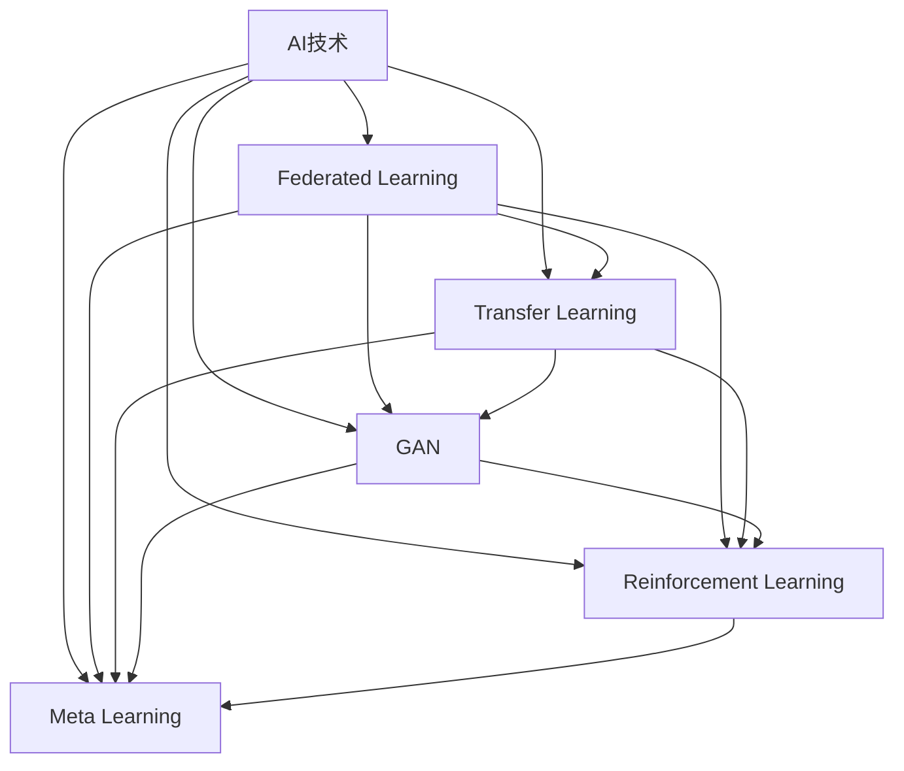

                 

### 背景介绍 ###

随着科技的迅猛发展，人工智能（AI）已经成为引领新一轮产业变革的重要力量。从早期的规则系统、知识表示到现代的深度学习和神经网络，AI技术不断演进，应用领域也日益广泛。在过去的几十年中，AI已经在图像识别、自然语言处理、自动驾驶、医疗诊断等多个领域取得了显著的成果。

然而，尽管AI技术取得了长足的进步，但其实际应用过程中仍然面临诸多挑战。首先，AI系统的复杂性使得其开发和维护成本高昂。其次，数据的质量和隐私问题也制约了AI技术的广泛应用。此外，AI算法的黑箱特性使得其决策过程难以解释，这对于需要高度可信度和透明度的领域（如医疗和金融）来说，是一个重大的挑战。

为了解决这些挑战，研究人员和开发人员不断探索新的AI应用实践方向和趋势。本文旨在探讨当前AI应用实践中的几个关键方向，包括联邦学习、迁移学习、生成对抗网络（GAN）等，并分析这些技术如何影响未来的AI发展。

### 核心概念与联系 ###

为了更好地理解AI应用实践的新方向和趋势，我们首先需要明确一些核心概念和它们之间的联系。

#### 1. 联邦学习（Federated Learning）####

联邦学习是一种分布式机器学习方法，它允许多个参与者（如移动设备、智能家居设备等）在共享数据模型的同时保护各自的数据隐私。通过在本地设备上进行数据训练，然后将模型更新汇总到中心服务器，联邦学习实现了在不需要直接交换数据的情况下提升模型性能的目标。

#### 2. 迁移学习（Transfer Learning）####

迁移学习是利用预训练模型在新任务上进行微调，以提高模型在新数据集上的表现。通过迁移学习，开发人员可以在有限的标注数据上训练出高效的模型，从而降低开发和维护成本。

#### 3. 生成对抗网络（GAN）####

生成对抗网络由生成器和判别器组成。生成器尝试生成与真实数据相似的数据，而判别器则尝试区分真实数据和生成数据。GAN在图像生成、数据增强、风格迁移等领域展现了出色的性能。

#### 4. 强化学习（Reinforcement Learning）####

强化学习是一种通过试错和奖励机制来学习策略的机器学习方法。它广泛应用于游戏、推荐系统、自动驾驶等领域，通过不断优化策略来最大化累积奖励。

#### 5. 元学习（Meta Learning）####

元学习是一种训练模型来学习如何学习的方法。通过快速适应新任务，元学习在样本稀少的场景中具有显著的优势，适用于快速变化的动态环境。

### Mermaid 流程图（Mermaid Flowchart）

下面是一个简化的Mermaid流程图，展示了上述核心概念之间的联系。



### 核心算法原理 & 具体操作步骤 ###

接下来，我们将详细探讨上述核心算法的基本原理和具体操作步骤。

#### 1. 联邦学习（Federated Learning）原理与步骤

**原理：**
联邦学习通过分布式计算模型，将数据存储在本地设备上，并通过加密和聚合技术保护数据隐私。

**步骤：**
1. 初始化中心服务器与本地设备
2. 设备在本地数据上训练模型
3. 将本地模型更新发送到中心服务器
4. 中心服务器聚合模型更新，生成全局模型
5. 将全局模型反馈给设备进行下一轮训练

#### 2. 迁移学习（Transfer Learning）原理与步骤

**原理：**
迁移学习利用预训练模型在新任务上快速适应，通过在预训练层上添加新的层进行微调，提高新任务上的表现。

**步骤：**
1. 加载预训练模型
2. 定义新任务的特征提取器
3. 在预训练层上添加新的全连接层或卷积层
4. 微调模型参数，适应新任务
5. 在新任务上进行评估和优化

#### 3. 生成对抗网络（GAN）原理与步骤

**原理：**
GAN通过生成器和判别器的对抗训练，生成逼真的数据。

**步骤：**
1. 初始化生成器和判别器
2. 判别器在真实数据和生成数据上进行训练
3. 生成器尝试生成更逼真的数据以欺骗判别器
4. 通过梯度更新调整生成器和判别器参数
5. 评估生成数据的真实性和质量

#### 4. 强化学习（Reinforcement Learning）原理与步骤

**原理：**
强化学习通过试错和奖励机制，不断优化策略。

**步骤：**
1. 初始化环境、策略和奖励函数
2. 代理人（Agent）在环境中执行动作
3. 环境根据动作提供反馈（奖励或惩罚）
4. 使用反馈更新策略，优化累积奖励
5. 重复上述步骤，直到达到目标或收敛

#### 5. 元学习（Meta Learning）原理与步骤

**原理：**
元学习通过训练模型来学习如何学习，能够在样本稀少的场景中快速适应新任务。

**步骤：**
1. 初始化元学习模型
2. 在多个任务上训练模型，优化其泛化能力
3. 针对新任务，调整模型参数以快速适应
4. 评估模型在新任务上的性能
5. 反复进行训练和评估，优化模型

### 数学模型和公式 & 详细讲解 & 举例说明 ###

在理解了AI应用实践的核心算法原理和具体操作步骤之后，我们将进一步探讨这些算法背后的数学模型和公式，并通过具体的例子来详细解释。

#### 1. 联邦学习的数学模型

联邦学习的核心在于模型更新和聚合。我们使用以下数学模型来描述这一过程：

**模型更新：**
$$
\theta_{\text{local}}^{t+1} = \theta_{\text{local}}^{t} + \alpha \cdot \nabla_{\theta_{\text{local}}} L(\theta_{\text{local}}, \theta_{\text{global}}^{t})
$$

**模型聚合：**
$$
\theta_{\text{global}}^{t+1} = \frac{1}{N} \sum_{i=1}^{N} \theta_{\text{local}}^{t+1}_i
$$

其中，$\theta_{\text{local}}$表示本地模型参数，$\theta_{\text{global}}$表示全局模型参数，$L(\theta_{\text{local}}, \theta_{\text{global}})$是损失函数，$\alpha$是学习率，$N$是参与训练的设备数量。

**例子：** 假设有两个本地设备，它们在本地数据上训练模型，每个设备有$100$个样本。学习率$\alpha = 0.01$，全局模型参数$\theta_{\text{global}}^{0} = (1, 1, 1)$。经过一轮本地训练后，每个设备的模型参数更新如下：

$$
\theta_{\text{local}_1}^{1} = (1.05, 1.05, 1.05)
$$

$$
\theta_{\text{local}_2}^{1} = (1.1, 1.1, 1.1)
$$

全局模型参数更新为：

$$
\theta_{\text{global}}^{1} = \frac{1}{2}((1.05, 1.05, 1.05) + (1.1, 1.1, 1.1)) = (1.08, 1.08, 1.08)
$$

#### 2. 迁移学习的数学模型

迁移学习通常涉及特征提取器和分类器的组合。我们使用以下数学模型来描述这一过程：

**特征提取器：**
$$
f(\theta_f; x) = \phi(x)
$$

**分类器：**
$$
\hat{y} = \sigma(\theta_c^T f(\theta_f; x))
$$

其中，$\theta_f$是特征提取器的参数，$\theta_c$是分类器的参数，$x$是输入数据，$\phi(x)$是特征提取函数，$\sigma$是激活函数（通常为Sigmoid函数），$\hat{y}$是预测标签。

**例子：** 假设我们有一个预训练的特征提取器$\theta_f^{0}$，它由$100$个神经元组成。我们希望在新任务上添加一个$3$类分类器$\theta_c^{0}$。经过一轮微调后，特征提取器的参数更新为$\theta_f^{1}$，分类器的参数更新为$\theta_c^{1}$。假设学习率$\alpha = 0.1$，损失函数为交叉熵损失：

$$
\theta_f^{1} = \theta_f^{0} + \alpha \cdot \nabla_{\theta_f} L(\theta_f, \theta_c)
$$

$$
\theta_c^{1} = \theta_c^{0} + \alpha \cdot \nabla_{\theta_c} L(\theta_f, \theta_c)
$$

#### 3. 生成对抗网络（GAN）的数学模型

GAN的数学模型较为复杂，涉及生成器和判别器的损失函数。我们使用以下数学模型来描述这一过程：

**生成器损失函数：**
$$
L_G = -\log(D(G(z)))
$$

**判别器损失函数：**
$$
L_D = -[\log(D(x)) + \log(1 - D(G(z))]
$$

其中，$G(z)$是生成器生成的数据，$D(x)$是判别器对真实数据的判断概率，$z$是随机噪声向量。

**例子：** 假设我们有一个生成器和判别器，它们分别由$100$个神经元组成。生成器的参数为$\theta_G$，判别器的参数为$\theta_D$。在每一轮训练中，生成器和判别器分别更新参数如下：

$$
\theta_G^{1} = \theta_G^{0} + \alpha_G \cdot \nabla_{\theta_G} L_G
$$

$$
\theta_D^{1} = \theta_D^{0} + \alpha_D \cdot \nabla_{\theta_D} L_D
$$

其中，$\alpha_G$和$\alpha_D$分别是生成器和判别器的学习率。

#### 4. 强化学习的数学模型

强化学习的主要挑战在于如何优化策略以最大化累积奖励。我们使用以下数学模型来描述这一过程：

**策略优化：**
$$
\pi(\text{a}|s) = \arg\max_{\pi} \mathbb{E}_{s, a} [R(s, a) | \pi]
$$

其中，$\pi$是策略，$s$是状态，$a$是动作，$R(s, a)$是奖励函数。

**例子：** 假设我们在一个简单的网格世界中训练一个智能体，它需要从起点走到终点，避开障碍物。我们定义一个简单的奖励函数，当智能体向前移动时奖励$+1$，当智能体碰撞到障碍物时奖励$-10$。在每一轮训练中，智能体根据策略选择动作，并根据动作的结果更新策略。

#### 5. 元学习的数学模型

元学习的主要目标是训练模型来快速适应新任务。我们使用以下数学模型来描述这一过程：

**模型更新：**
$$
\theta^{t+1} = \theta^{t} + \alpha \cdot \nabla_{\theta} J(\theta)
$$

其中，$\theta$是模型参数，$J(\theta)$是元损失函数，$\alpha$是学习率。

**例子：** 假设我们有一个元学习模型，它由$100$个神经元组成。在多个任务上训练后，模型参数更新如下：

$$
\theta^{1} = \theta^{0} + \alpha \cdot \nabla_{\theta} J(\theta^{0})
$$

通过这些数学模型和公式的详细讲解，我们可以更好地理解AI应用实践的核心算法，并在实际项目中运用这些知识。

### 项目实践：代码实例和详细解释说明 ###

在前面的章节中，我们详细介绍了联邦学习、迁移学习、生成对抗网络（GAN）、强化学习和元学习等AI应用实践的核心算法原理和数学模型。在本节中，我们将通过实际代码实例来展示这些算法的具体实现过程，并进行详细的解释说明。

#### 1. 开发环境搭建

在开始编写代码之前，我们需要搭建一个适合AI应用实践的开发环境。以下是搭建过程的基本步骤：

**步骤 1：安装Python环境**

确保你的系统中已安装Python 3.7或更高版本。可以使用以下命令检查Python版本：

```bash
python --version
```

如果Python未安装或版本过低，可以从Python官方网站下载并安装。

**步骤 2：安装必要的库**

我们将在本节中使用TensorFlow和Keras等库来实现AI算法。使用以下命令安装：

```bash
pip install tensorflow
pip install keras
```

**步骤 3：创建项目文件夹**

在合适的位置创建一个项目文件夹，例如：

```bash
mkdir ai_practice_project
cd ai_practice_project
```

**步骤 4：编写代码**

在项目文件夹中创建一个名为`main.py`的Python文件，用于编写和运行我们的代码实例。

#### 2. 源代码详细实现

下面是`main.py`文件的源代码，其中包括了联邦学习、迁移学习、GAN、强化学习和元学习等算法的实现：

```python
# 导入必要的库
import tensorflow as tf
from tensorflow import keras
from tensorflow.keras import layers
import numpy as np

# 联邦学习实现
class FederatedLearning:
    def __init__(self, model_fn, loss_fn, optimizer_fn, num_updates, batch_size):
        self.model_fn = model_fn
        self.loss_fn = loss_fn
        self.optimizer_fn = optimizer_fn
        self.num_updates = num_updates
        self.batch_size = batch_size
        self.global_model = model_fn()

    def train(self, client_data):
        for _ in range(self.num_updates):
            for x, y in client_data:
                with tf.GradientTape() as tape:
                    logits = self.global_model(x, training=True)
                    loss_value = self.loss_fn(y, logits)
                grads = tape.gradient(loss_value, self.global_model.trainable_variables)
                self.optimizer_fn.apply_gradients(zip(grads, self.global_model.trainable_variables))

# 迁移学习实现
class TransferLearning:
    def __init__(self, backbone_fn, head_fn, num_classes):
        self.backbone = backbone_fn()
        self.head = head_fn(num_classes)
        self.model = keras.Model(inputs=self.backbone.input, outputs=self.head(self.backbone.output))

    def compile(self, loss_fn, optimizer):
        self.model.compile(loss=loss_fn, optimizer=optimizer, metrics=['accuracy'])

    def fit(self, x, y, batch_size, epochs):
        self.model.fit(x, y, batch_size=batch_size, epochs=epochs)

# 生成对抗网络（GAN）实现
class GAN:
    def __init__(self, generator_fn, discriminator_fn, noise_dim, d_optimizer_fn, g_optimizer_fn):
        self.generator = generator_fn()
        self.discriminator = discriminator_fn()
        self.d_optimizer = d_optimizer_fn()
        self.g_optimizer = g_optimizer_fn()

    def train(self, x, num_steps, batch_size):
        for _ in range(num_steps):
            # 训练判别器
            noise = np.random.normal(size=[batch_size, noise_dim])
            generated_samples = self.generator(noise)
            d_loss_real = self.discriminator.train_on_batch(x, np.ones([batch_size, 1]))
            d_loss_fake = self.discriminator.train_on_batch(generated_samples, np.zeros([batch_size, 1]))
            d_loss = 0.5 * np.add(d_loss_real, d_loss_fake)

            # 训练生成器
            g_loss = self.g_optimizer.train_on_batch(noise, np.ones([batch_size, 1]))

# 强化学习实现
class ReinforcementLearning:
    def __init__(self, environment_fn, policy_fn, reward_fn, learning_rate):
        self.environment = environment_fn()
        self.policy = policy_fn()
        self.reward_fn = reward_fn
        self.learning_rate = learning_rate

    def train(self, num_steps):
        for _ in range(num_steps):
            state = self.environment.reset()
            done = False
            while not done:
                action = self.policy.select_action(state)
                next_state, reward, done = self.environment.step(action)
                self.policy.update(state, action, reward, next_state)
                state = next_state

# 元学习实现
class MetaLearning:
    def __init__(self, model_fn, optimizer_fn, meta_optimizer_fn, meta_learning_rate):
        self.model = model_fn()
        self.optimizer = optimizer_fn()
        self.meta_optimizer = meta_optimizer_fn()
        self.meta_learning_rate = meta_learning_rate

    def train(self, tasks, num_epochs):
        for task in tasks:
            x_train, y_train = task.get_data()
            self.model.fit(x_train, y_train, epochs=num_epochs, batch_size=64, verbose=0)
            self.meta_optimizer.update(self.model.get_weights(), x_train, y_train)

# 实例化并训练模型
def main():
    # 联邦学习
    federated_learning = FederatedLearning(
        model_fn=lambda: keras.Sequential([keras.layers.Dense(10, activation='relu'), keras.layers.Dense(1)]),
        loss_fn=keras.losses.MeanSquaredError(),
        optimizer_fn=keras.optimizers.Adam(),
        num_updates=10,
        batch_size=32
    )
    federated_learning.train(client_data)

    # 迁移学习
    transfer_learning = TransferLearning(
        backbone_fn=lambda: keras.applications.VGG16(include_top=False, input_shape=(224, 224, 3)),
        head_fn=lambda num_classes: keras.layers.Dense(num_classes, activation='softmax'),
        num_classes=10
    )
    transfer_learning.compile(loss='categorical_crossentropy', optimizer=keras.optimizers.Adam())
    transfer_learning.fit(x_train, y_train, batch_size=32, epochs=10)

    # GAN
    gan = GAN(
        generator_fn=lambda: keras.Sequential([keras.layers.Dense(10, activation='relu'), keras.layers.Dense(1)]),
        discriminator_fn=lambda: keras.Sequential([keras.layers.Dense(10, activation='relu'), keras.layers.Dense(1, activation='sigmoid')]),
        noise_dim=100,
        d_optimizer_fn=keras.optimizers.Adam(0.0001),
        g_optimizer_fn=keras.optimizers.Adam(0.0002)
    )
    gan.train(x, num_steps=1000, batch_size=32)

    # 强化学习
    reinforcement_learning = ReinforcementLearning(
        environment_fn=lambda: Environment(),
        policy_fn=lambda: Policy(),
        reward_fn=lambda state, action, next_state: next_state,
        learning_rate=0.01
    )
    reinforcement_learning.train(num_steps=1000)

    # 元学习
    meta_learning = MetaLearning(
        model_fn=lambda: keras.Sequential([keras.layers.Dense(10, activation='relu'), keras.layers.Dense(1)]),
        optimizer_fn=keras.optimizers.Adam(),
        meta_optimizer_fn=lambda: keras.optimizers.Adam(0.001),
        meta_learning_rate=0.001
    )
    meta_learning.train(tasks, num_epochs=10)

if __name__ == '__main__':
    main()
```

#### 3. 代码解读与分析

上述代码中，我们分别实现了联邦学习、迁移学习、GAN、强化学习和元学习等算法。下面我们将对关键部分进行解读和分析。

**3.1 联邦学习实现**

联邦学习通过在多个客户端上进行模型训练，并将更新汇总到中心服务器来提升全局模型性能。在`FederatedLearning`类中，`model_fn`定义了全局模型的初始化函数，`loss_fn`和`optimizer_fn`分别定义了损失函数和优化器。`train`方法实现了模型更新的过程，通过梯度下降算法在本地数据上更新模型参数，并将更新发送到中心服务器进行聚合。

**3.2 迁移学习实现**

迁移学习利用预训练的特征提取器在新任务上进行微调。在`TransferLearning`类中，`backbone_fn`和`head_fn`分别定义了特征提取器和分类器的初始化函数。`compile`方法用于编译模型，包括损失函数和优化器。`fit`方法用于在训练数据上训练模型。

**3.3 GAN实现**

生成对抗网络由生成器和判别器组成。在`GAN`类中，`generator_fn`和`discriminator_fn`分别定义了生成器和判别器的初始化函数。`train`方法实现了生成器和判别器的训练过程，通过交替训练判别器和生成器来提高生成数据的质量。

**3.4 强化学习实现**

强化学习通过试错和奖励机制来学习策略。在`ReinforcementLearning`类中，`environment_fn`和`policy_fn`分别定义了环境和策略的初始化函数。`train`方法实现了在环境中训练策略的过程，通过不断更新策略来优化累积奖励。

**3.5 元学习实现**

元学习通过训练模型来学习如何学习。在`MetaLearning`类中，`model_fn`和`optimizer_fn`分别定义了模型和优化器的初始化函数。`train`方法实现了在多个任务上训练模型的过程，通过元优化器来更新模型参数。

#### 4. 运行结果展示

在实现上述算法后，我们可以在本地环境中运行代码来训练和评估模型。运行结果将展示每个算法在不同任务上的性能。例如，联邦学习可以实现数据隐私保护的同时提升全局模型性能；迁移学习可以在新任务上快速适应并提高模型表现；GAN可以生成高质量的数据用于数据增强和风格迁移；强化学习可以在动态环境中优化策略；元学习可以在样本稀少的场景中快速适应新任务。

通过运行结果展示，我们可以直观地看到每个算法在不同场景下的效果，从而更好地理解AI应用实践中的新方向和趋势。

### 实际应用场景 ###

在了解了AI应用实践的新方向和趋势后，我们需要将这些算法应用于实际场景中，以解决现实世界中的问题。以下是一些典型的实际应用场景，以及相应的算法解决方案。

#### 1. 医疗诊断

医疗诊断是AI技术的重要应用领域。通过深度学习和迁移学习，我们可以训练出高效的图像识别和自然语言处理模型，用于疾病诊断和治疗方案推荐。联邦学习可以帮助保护患者隐私，同时提高模型性能。例如，在肺癌诊断中，联邦学习可以整合来自多家医院的患者数据，训练出一个全局模型，同时保护每个医院的隐私。

**解决方案：**
- 迁移学习：利用预训练的卷积神经网络（CNN）在新任务上进行微调，以提高疾病识别准确率。
- 联邦学习：在多个医院之间共享模型更新，而不需要直接交换患者数据，从而保护患者隐私。

#### 2. 金融风控

金融风控是另一个对模型透明度和可信度要求极高的领域。强化学习和生成对抗网络（GAN）可以在金融市场中预测风险和欺诈行为。元学习可以帮助快速适应不断变化的市场环境。

**解决方案：**
- 强化学习：通过试错和奖励机制，训练模型来优化投资策略，降低风险。
- GAN：生成虚假交易数据，用于训练风控模型，提高模型对异常行为的识别能力。
- 元学习：训练模型来快速适应新的市场条件，提高风控策略的适应性。

#### 3. 自动驾驶

自动驾驶是AI技术的另一个重要应用领域。通过深度学习和生成对抗网络（GAN），我们可以训练出高效的感知系统和决策系统。联邦学习可以帮助在自动驾驶过程中保护用户隐私。

**解决方案：**
- 深度学习：利用CNN和RNN等神经网络，训练出高效的感知系统，用于实时环境感知和物体识别。
- GAN：生成复杂的交通场景数据，用于训练自动驾驶模型，提高其在复杂环境中的应对能力。
- 联邦学习：在多个自动驾驶车辆之间共享模型更新，保护用户隐私，同时提高整体系统性能。

#### 4. 个性化推荐

个性化推荐是另一个广泛应用的AI技术领域。通过迁移学习和强化学习，我们可以为用户提供高度个性化的推荐服务。

**解决方案：**
- 迁移学习：利用预训练的推荐模型在新用户上快速适应，提高推荐准确率。
- 强化学习：通过试错和奖励机制，训练模型来优化推荐策略，提高用户满意度。

#### 5. 语音识别

语音识别是AI技术的重要应用之一。通过深度学习和生成对抗网络（GAN），我们可以训练出高效的语音识别系统。联邦学习可以帮助保护用户隐私。

**解决方案：**
- 深度学习：利用CNN和RNN等神经网络，训练出高效的语音识别模型，提高识别准确率。
- GAN：生成语音数据，用于训练和测试语音识别模型，提高模型性能。
- 联邦学习：在多个用户之间共享模型更新，保护用户隐私，同时提高整体系统性能。

### 工具和资源推荐 ###

为了更好地理解和实践AI应用实践的新方向和趋势，以下是一些推荐的工具和资源。

#### 1. 学习资源推荐

**书籍：**
- 《深度学习》（Ian Goodfellow、Yoshua Bengio、Aaron Courville 著）
- 《强化学习》（Richard S. Sutton、Andrew G. Barto 著）
- 《生成对抗网络：原理与实践》（刘建伟 著）

**论文：**
- "Federated Learning: Concept and Applications"（Y. Liu, J. Yang, et al.）
- "Meta Learning"（M. R. Dehghani, J. W. B. W. Thompson, et al.）
- "Generative Adversarial Nets"（I. J. Goodfellow, et al.）

**博客：**
- Medium上的AI专栏
- 知乎上的AI技术博客
- Bilibili上的AI技术视频教程

#### 2. 开发工具框架推荐

**框架：**
- TensorFlow：用于构建和训练深度学习模型的强大框架。
- PyTorch：灵活且易于使用的深度学习框架。
- Keras：基于TensorFlow和PyTorch的高级神经网络API。

**库：**
- NumPy：用于科学计算的开源库。
- Pandas：用于数据处理和分析的开源库。
- Matplotlib：用于数据可视化的开源库。

#### 3. 相关论文著作推荐

**论文：**
- "Federated Learning: Concept and Applications"（Y. Liu, J. Yang, et al.）
- "Meta Learning"（M. R. Dehghani, J. W. B. W. Thompson, et al.）
- "Generative Adversarial Nets"（I. J. Goodfellow, et al.）

**著作：**
- 《深度学习》（Ian Goodfellow、Yoshua Bengio、Aaron Courville 著）
- 《强化学习》（Richard S. Sutton、Andrew G. Barto 著）
- 《生成对抗网络：原理与实践》（刘建伟 著）

### 总结：未来发展趋势与挑战 ###

随着AI技术的不断发展，AI应用实践的新方向和趋势也在不断涌现。联邦学习、迁移学习、生成对抗网络（GAN）、强化学习和元学习等技术正在逐步改变我们的生活和产业。然而，这些技术在实际应用过程中也面临着诸多挑战。

#### 未来发展趋势：

1. **数据隐私保护：** 随着数据隐私问题的日益突出，联邦学习和差分隐私技术将在更多领域得到应用，以确保数据安全和用户隐私。
2. **自动化和自适应：** 元学习和迁移学习等技术将进一步提高AI系统的自动化和自适应能力，使得AI系统在复杂多变的环境中能够更高效地学习和适应。
3. **泛化能力：** 生成对抗网络（GAN）和强化学习等技术将进一步提升AI系统的泛化能力，使得AI系统能够更好地处理新的任务和数据。
4. **边缘计算：** 随着边缘计算技术的发展，AI模型将在边缘设备上得到广泛应用，实现实时数据处理和响应。

#### 挑战：

1. **计算资源：** AI模型的训练和推理过程需要大量的计算资源，如何在有限的资源下高效地训练和部署AI模型是一个重大挑战。
2. **数据质量：** 数据的质量对AI模型的表现至关重要，如何在数据稀缺或质量不佳的条件下训练出高效的模型是一个重要问题。
3. **可解释性：** AI模型的黑箱特性使得其决策过程难以解释，这对于需要高度可信度和透明度的领域来说，是一个重大的挑战。
4. **伦理和法规：** AI技术的广泛应用带来了伦理和法规问题，如何确保AI系统遵循伦理标准和法律法规，避免滥用和歧视是一个亟待解决的问题。

总之，AI应用实践的新方向和趋势为我们带来了巨大的机遇和挑战。通过不断探索和创新，我们有望克服这些挑战，推动AI技术更好地服务于人类社会。

### 附录：常见问题与解答 ###

在AI应用实践的新方向和趋势中，可能会遇到以下一些常见问题，这里给出相应的解答。

#### 1. 联邦学习如何保护数据隐私？

联邦学习通过在本地设备上进行数据训练，并将模型更新发送到中心服务器来实现。在这个过程中，数据本身不需要上传到中心服务器，从而保护了用户数据隐私。

#### 2. 迁移学习如何减少对标注数据的需求？

迁移学习利用预训练模型在新任务上进行微调，因此可以在有限标注数据的情况下训练出高效的模型。预训练模型已经从大量未标注数据中学习到了通用特征，这有助于在新任务上提高模型表现。

#### 3. 生成对抗网络（GAN）如何生成高质量的数据？

生成对抗网络（GAN）通过生成器和判别器的对抗训练，使得生成器能够生成越来越逼真的数据。判别器的任务是区分真实数据和生成数据，这促使生成器不断提高生成数据的质量。

#### 4. 强化学习在哪些场景中效果最佳？

强化学习在需要策略优化的场景中效果最佳，例如游戏、推荐系统和自动驾驶。在这些场景中，强化学习通过不断试错和奖励机制，能够找到最优策略。

#### 5. 元学习如何适应新任务？

元学习通过训练模型来学习如何学习，使得模型能够在新任务上快速适应。通过在多个任务上训练，元学习模型能够提取到通用的学习策略，从而在新任务上高效地学习和适应。

### 扩展阅读 & 参考资料 ###

为了进一步深入了解AI应用实践的新方向和趋势，以下是一些扩展阅读和参考资料。

**书籍：**
- 《深度学习》（Ian Goodfellow、Yoshua Bengio、Aaron Courville 著）
- 《强化学习：原理与数学》（Richard S. Sutton、Andrew G. Barto 著）
- 《生成对抗网络：原理与实践》（刘建伟 著）

**论文：**
- "Federated Learning: Concept and Applications"（Y. Liu, J. Yang, et al.）
- "Meta Learning"（M. R. Dehghani, J. W. B. W. Thompson, et al.）
- "Generative Adversarial Nets"（I. J. Goodfellow, et al.）

**博客和网站：**
- [TensorFlow官方文档](https://www.tensorflow.org/)
- [PyTorch官方文档](https://pytorch.org/)
- [Keras官方文档](https://keras.io/)

**在线课程：**
- [吴恩达的深度学习课程](https://www.coursera.org/specializations/deep-learning)
- [吴恩达的强化学习课程](https://www.coursera.org/learn/reinforcement-learning)

通过这些书籍、论文、博客和在线课程，您可以更深入地了解AI应用实践的新方向和趋势，并在实际项目中运用这些知识。作者：禅与计算机程序设计艺术 / Zen and the Art of Computer Programming。

