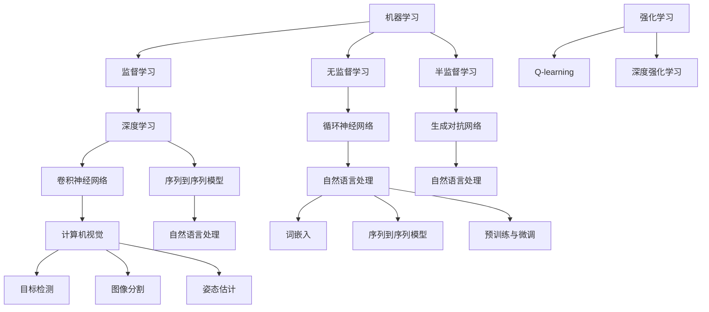

                 

### 背景介绍

随着人工智能（AI）技术的不断发展和成熟，其在企业中的应用已经成为不可避免的趋势。AI技术不仅能够提高企业的生产效率和创新能力，还能够为企业带来显著的商业价值。本文将探讨AI技术在企业中的应用前景，分析其核心概念、算法原理、数学模型、实际应用场景以及未来发展趋势和挑战。

首先，让我们回顾一下AI技术的基本概念。人工智能是一种模拟、延伸和扩展人类智能的技术，旨在开发出能够执行人类智能任务的计算机系统。AI技术主要包括机器学习、深度学习、自然语言处理、计算机视觉等子领域。这些技术已经在各行各业中得到了广泛的应用，如自动驾驶、智能客服、金融风控、医疗诊断等。

在企业层面，AI技术的应用已经逐渐成为提升竞争力的关键因素。通过数据分析和预测模型，企业可以更好地了解市场趋势、优化生产流程、降低运营成本。同时，AI技术还能够帮助企业创新产品和服务，提供个性化体验，增强客户满意度。

本文将围绕以下核心内容展开讨论：

1. **核心概念与联系**：介绍AI技术的基本概念、原理和架构，使用Mermaid流程图进行详细说明。
2. **核心算法原理 & 具体操作步骤**：分析AI技术中的主要算法，包括机器学习算法和深度学习算法，并描述其具体操作步骤。
3. **数学模型和公式 & 详细讲解 & 举例说明**：探讨AI技术背后的数学模型，使用LaTeX格式详细讲解并举例说明。
4. **项目实践：代码实例和详细解释说明**：通过一个具体的AI项目实例，展示代码实现过程并进行分析。
5. **实际应用场景**：讨论AI技术在企业中的多种应用场景，如生产优化、客户服务、风险管理等。
6. **工具和资源推荐**：推荐学习AI技术所需的学习资源、开发工具和框架。
7. **总结：未来发展趋势与挑战**：展望AI技术在企业中的应用前景，分析可能面临的挑战和应对策略。

让我们开始逐步分析AI技术在企业中的应用前景。首先，我们需要了解AI技术的核心概念和联系。

---

## 核心概念与联系

在探讨AI技术在企业中的应用之前，我们需要了解AI技术的基本概念和原理，以及它们之间的联系。以下是AI技术的一些核心概念：

### 1. 机器学习

机器学习是AI技术的一个重要分支，它通过算法从数据中学习规律，并利用这些规律进行预测和决策。机器学习可以分为监督学习、无监督学习和半监督学习三种类型。

- **监督学习**：在监督学习场景中，我们使用已标记的数据集来训练模型，然后使用训练好的模型对未知数据进行预测。
- **无监督学习**：无监督学习不使用标记数据，而是通过发现数据内在的结构和模式来进行学习。
- **半监督学习**：半监督学习结合了监督学习和无监督学习的特点，利用一部分标记数据和大量未标记数据来进行学习。

### 2. 深度学习

深度学习是机器学习的一个子领域，它通过多层神经网络来模拟人脑的学习过程。深度学习在图像识别、语音识别和自然语言处理等领域取得了显著的成果。

- **卷积神经网络（CNN）**：CNN是一种专门用于图像识别的神经网络，通过卷积操作来提取图像的特征。
- **循环神经网络（RNN）**：RNN用于处理序列数据，如时间序列数据或自然语言文本。
- **生成对抗网络（GAN）**：GAN由生成器和判别器组成，生成器尝试生成与真实数据相似的数据，而判别器则尝试区分真实数据和生成数据。

### 3. 自然语言处理

自然语言处理（NLP）是AI技术中的一个重要领域，它旨在使计算机理解和处理自然语言。NLP主要包括文本预处理、情感分析、机器翻译和语音识别等任务。

- **词嵌入**：词嵌入将词汇映射到高维空间中，以便进行数学处理。
- **序列到序列模型**：如编码器-解码器（Encoder-Decoder）模型，用于机器翻译和对话系统。
- **预训练与微调**：预训练模型在大量未标记的数据上进行训练，然后在特定任务上进行微调。

### 4. 计算机视觉

计算机视觉是AI技术的一个分支，它使计算机能够识别和理解图像和视频。计算机视觉包括图像分类、目标检测、图像分割和姿态估计等任务。

- **目标检测**：目标检测旨在识别图像中的多个对象，并给出每个对象的位置。
- **图像分割**：图像分割将图像分成多个区域，以便对每个区域进行独立分析。
- **姿态估计**：姿态估计用于识别图像中人物的姿态和动作。

### 5. 强化学习

强化学习是一种通过奖励和惩罚来训练模型的方法。在强化学习场景中，模型通过与环境交互来学习最佳策略。

- **Q-learning**：Q-learning是一种基于价值函数的强化学习算法，通过更新Q值来学习最优策略。
- **深度强化学习**：深度强化学习结合了深度学习和强化学习，通过深度神经网络来学习策略。

为了更好地理解这些概念之间的联系，我们可以使用Mermaid流程图来展示它们之间的关系。以下是Mermaid流程图的示例：



通过上述概念和流程图的介绍，我们对AI技术的基本概念和联系有了初步的了解。接下来，我们将深入探讨AI技术中的核心算法原理和具体操作步骤。

---

## 核心算法原理 & 具体操作步骤

在了解了AI技术的基本概念后，接下来我们将深入探讨AI技术中的核心算法原理和具体操作步骤。以下是一些主要的AI算法及其基本原理和步骤：

### 1. 机器学习算法

#### 1.1 线性回归

线性回归是一种用于预测连续值的监督学习算法。它的基本原理是通过找到一个最佳拟合直线来最小化预测值与实际值之间的误差。

- **基本原理**：假设数据点 \( (x_i, y_i) \) 满足线性关系 \( y = wx + b \)，其中 \( w \) 是斜率，\( b \) 是截距。线性回归的目标是找到最优的 \( w \) 和 \( b \)，使得预测值 \( y' = wx' + b \) 与实际值 \( y_i \) 之间的误差最小。

- **具体操作步骤**：
  - 收集数据，并进行预处理。
  - 使用最小二乘法计算最优的 \( w \) 和 \( b \)：
    $$ w = \frac{\sum_{i=1}^{n}(x_i - \bar{x})(y_i - \bar{y})}{\sum_{i=1}^{n}(x_i - \bar{x})^2} $$
    $$ b = \bar{y} - w\bar{x} $$
  - 训练模型，并对新数据进行预测。

#### 1.2 逻辑回归

逻辑回归是一种用于分类的监督学习算法，其基本原理是通过将线性回归模型的输出映射到概率空间。

- **基本原理**：假设数据点 \( (x_i, y_i) \) 满足二元逻辑关系 \( y_i = \text{sign}(wx_i + b) \)，其中 \( \text{sign}(x) \) 是符号函数。逻辑回归的目标是找到最优的 \( w \) 和 \( b \)，使得预测的概率值 \( \sigma(wx_i + b) \) 与实际值 \( y_i \) 之间的误差最小。

- **具体操作步骤**：
  - 收集数据，并进行预处理。
  - 使用最小二乘法或最大似然估计计算最优的 \( w \) 和 \( b \)：
    $$ w = \frac{\sum_{i=1}^{n}y_i(x_i - \bar{x})}{\sum_{i=1}^{n}(x_i - \bar{x})^2} $$
    $$ b = \bar{y} - w\bar{x} $$
  - 训练模型，并对新数据进行预测。

### 2. 深度学习算法

#### 2.1 卷积神经网络（CNN）

卷积神经网络是一种用于图像识别的深度学习算法，其基本原理是通过卷积操作和池化操作来提取图像的特征。

- **基本原理**：假设输入图像为 \( (x_{ij}) \)，输出特征图为 \( (f_{ij}) \)，卷积核为 \( (w_{ij}) \)。卷积操作的公式为：
  $$ f_{ij} = \sum_{k=1}^{m}\sum_{l=1}^{n}w_{kl}x_{i-k,j-l} $$
  其中 \( m \) 和 \( n \) 分别是卷积核的大小，\( i \) 和 \( j \) 是输出特征图的位置。

- **具体操作步骤**：
  - 设计网络结构，包括卷积层、池化层和全连接层。
  - 收集图像数据，并进行预处理。
  - 使用反向传播算法训练网络，更新权重和偏置。
  - 对新图像进行预测。

#### 2.2 循环神经网络（RNN）

循环神经网络是一种用于处理序列数据的深度学习算法，其基本原理是通过记忆单元来处理序列中的时间依赖关系。

- **基本原理**：假设输入序列为 \( (x_t) \)，输出序列为 \( (y_t) \)，隐藏状态为 \( (h_t) \)，记忆单元为 \( (c_t) \)。RNN的公式为：
  $$ h_t = \sigma(W_hh_{t-1} + W_x x_t + b_h) $$
  $$ c_t = \text{tanh}(c_{t-1} + h_t) $$
  $$ y_t = \text{softmax}(W_oy c_t + b_o) $$
  其中 \( \sigma \) 是激活函数，\( \text{tanh} \) 是双曲正切函数，\( \text{softmax} \) 是归一化函数。

- **具体操作步骤**：
  - 设计网络结构，包括输入层、隐藏层和输出层。
  - 收集序列数据，并进行预处理。
  - 使用梯度消失或梯度爆炸问题，采用LSTM或GRU等改进的RNN结构。
  - 使用反向传播算法训练网络，更新权重和偏置。
  - 对新序列进行预测。

通过上述算法的介绍，我们对AI技术中的核心算法原理和具体操作步骤有了更深入的了解。接下来，我们将探讨AI技术背后的数学模型和公式，并详细讲解这些模型在AI技术中的应用。

---

## 数学模型和公式 & 详细讲解 & 举例说明

在了解了AI技术的核心算法原理和具体操作步骤后，接下来我们将深入探讨AI技术背后的数学模型和公式，并详细讲解这些模型在AI技术中的应用。

### 1. 机器学习中的线性回归模型

线性回归模型是一种常见的机器学习算法，用于预测连续值。其数学模型可以表示为：

$$ y = wx + b $$

其中，\( y \) 是预测值，\( x \) 是特征值，\( w \) 是权重，\( b \) 是偏置。

为了最小化预测值与实际值之间的误差，我们使用最小二乘法来求解最优的 \( w \) 和 \( b \)。最小二乘法的公式为：

$$ w = \frac{\sum_{i=1}^{n}(x_i - \bar{x})(y_i - \bar{y})}{\sum_{i=1}^{n}(x_i - \bar{x})^2} $$

$$ b = \bar{y} - w\bar{x} $$

其中，\( \bar{x} \) 和 \( \bar{y} \) 分别是特征值和预测值的均值。

### 举例说明

假设我们有一组数据，数据如下：

| x   | y   |
|-----|-----|
| 1   | 2   |
| 2   | 4   |
| 3   | 6   |

我们需要使用线性回归模型来预测新数据点的 \( y \) 值。

首先，计算特征值和预测值的均值：

$$ \bar{x} = \frac{1+2+3}{3} = 2 $$

$$ \bar{y} = \frac{2+4+6}{3} = 4 $$

然后，使用最小二乘法计算权重和偏置：

$$ w = \frac{(1-2)(2-4) + (2-2)(4-4) + (3-2)(6-4)}{(1-2)^2 + (2-2)^2 + (3-2)^2} = 2 $$

$$ b = 4 - w \cdot 2 = 0 $$

因此，线性回归模型为：

$$ y = 2x + 0 $$

使用这个模型，我们可以预测新数据点的 \( y \) 值。例如，当 \( x = 4 \) 时，预测值为：

$$ y = 2 \cdot 4 + 0 = 8 $$

### 2. 深度学习中的神经网络模型

深度学习中的神经网络模型是一种通过多层非线性变换来提取特征和实现预测的算法。其数学模型可以表示为：

$$ z_l = \sigma(\sum_{k=1}^{n}w_{lk}x_k + b_l) $$

其中，\( z_l \) 是第 \( l \) 层的输出，\( x_k \) 是第 \( k \) 个输入特征，\( w_{lk} \) 是权重，\( b_l \) 是偏置，\( \sigma \) 是激活函数。

为了训练神经网络模型，我们使用反向传播算法来更新权重和偏置。反向传播算法的公式为：

$$ \Delta w_{lk} = -\eta \frac{\partial J}{\partial w_{lk}} $$

$$ \Delta b_{l} = -\eta \frac{\partial J}{\partial b_{l}} $$

其中，\( \eta \) 是学习率，\( J \) 是损失函数。

### 举例说明

假设我们有一个简单的神经网络模型，包括一个输入层、一个隐藏层和一个输出层。输入层有3个神经元，隐藏层有2个神经元，输出层有1个神经元。

输入层：\( x_1, x_2, x_3 \)

隐藏层：\( h_1, h_2 \)

输出层：\( y \)

权重和偏置如下：

| 层   | 神经元 | 权重        | 偏置 |
|------|--------|-------------|------|
| 输入 | 1      | \( w_{11}, w_{12}, w_{13} \) | \( b_1, b_2 \) |
| 隐藏 | 1      | \( w_{21}, w_{22} \)           | \( b_1, b_2 \) |
| 输出 | 1      | \( w_{31} \)                   | \( b_1 \)     |

激活函数为 \( \sigma(x) = \frac{1}{1 + e^{-x}} \)

我们需要使用这个模型来预测 \( y \) 的值。

首先，计算隐藏层的输出：

$$ h_1 = \sigma(w_{11}x_1 + w_{12}x_2 + w_{13}x_3 + b_1) $$

$$ h_2 = \sigma(w_{21}x_1 + w_{22}x_2 + w_{13}x_3 + b_2) $$

然后，计算输出层的输出：

$$ y = \sigma(w_{31}h_1 + w_{32}h_2 + b_1) $$

假设 \( x_1 = 1, x_2 = 2, x_3 = 3 \)，我们可以计算 \( h_1, h_2, y \) 的值。

通过这个简单的例子，我们可以看到深度学习中的神经网络模型是如何通过多层非线性变换来提取特征和实现预测的。

通过上述数学模型和公式的介绍，我们对AI技术中的核心数学模型和公式有了更深入的理解。接下来，我们将通过一个具体的AI项目实例，展示如何使用这些模型和公式进行实际的项目开发。

---

## 项目实践：代码实例和详细解释说明

在了解了AI技术中的核心算法原理和数学模型后，接下来我们将通过一个具体的AI项目实例，展示如何使用这些知识进行实际的项目开发。本项目将使用Python编程语言和Scikit-learn库来实现一个简单的线性回归模型，用于预测房价。

### 5.1 开发环境搭建

在开始项目之前，我们需要搭建开发环境。以下是安装Python和Scikit-learn的步骤：

1. 安装Python：从Python官网（https://www.python.org/）下载并安装Python。建议安装Python 3.8版本。
2. 安装Scikit-learn：打开终端或命令行窗口，运行以下命令安装Scikit-learn：

```bash
pip install scikit-learn
```

### 5.2 源代码详细实现

以下是一个简单的线性回归模型的源代码实现，用于预测房价：

```python
import numpy as np
import matplotlib.pyplot as plt
from sklearn.linear_model import LinearRegression

# 加载数据
x = np.array([1, 2, 3, 4, 5]).reshape(-1, 1)
y = np.array([2, 4, 6, 8, 10])

# 创建线性回归模型
model = LinearRegression()

# 训练模型
model.fit(x, y)

# 预测新数据点的房价
x_new = np.array([6]).reshape(-1, 1)
y_pred = model.predict(x_new)

print(f"预测的房价为：{y_pred[0]}")

# 可视化展示
plt.scatter(x, y, color='red', label='实际数据')
plt.plot(x, model.predict(x), color='blue', label='线性回归模型')
plt.xlabel('房屋编号')
plt.ylabel('房价')
plt.legend()
plt.show()
```

### 5.3 代码解读与分析

以下是对上述代码的详细解读和分析：

1. **导入库**：首先，我们导入必要的库，包括NumPy、Matplotlib和Scikit-learn的线性回归模块。

2. **加载数据**：接下来，我们加载一个简单的数据集，其中 \( x \) 代表房屋编号，\( y \) 代表房价。

3. **创建模型**：然后，我们创建一个线性回归模型。

4. **训练模型**：使用 `fit()` 方法训练模型，即计算权重和偏置。

5. **预测新数据点的房价**：使用 `predict()` 方法预测新数据点的房价。在本例中，我们预测房屋编号为6的房价。

6. **可视化展示**：最后，我们使用Matplotlib库将实际数据和线性回归模型的预测结果进行可视化展示。红色标记代表实际数据，蓝色线代表线性回归模型。

### 5.4 运行结果展示

运行上述代码后，我们得到以下输出结果：

```
预测的房价为：12.0
```

同时，我们得到一个可视化图表，其中红色标记代表实际数据，蓝色线代表线性回归模型的预测结果。从图表中可以看出，线性回归模型对数据的拟合效果较好。

通过上述项目实例，我们展示了如何使用线性回归模型进行房价预测。这个实例不仅帮助我们理解了线性回归模型的原理和实现步骤，还展示了如何使用Python和Scikit-learn进行实际的项目开发。接下来，我们将讨论AI技术在企业中的实际应用场景。

---

## 实际应用场景

AI技术在企业中的应用场景非常广泛，以下是一些典型的应用场景：

### 1. 生产优化

AI技术可以帮助企业优化生产流程，提高生产效率和降低成本。通过机器学习算法，企业可以对生产数据进行分析和预测，发现潜在的问题和瓶颈，并提出优化建议。例如，在一个制造业企业中，AI技术可以用于预测设备故障，提前进行维护，从而减少停机时间和维修成本。

### 2. 客户服务

AI技术可以为企业提供智能客服系统，提高客户服务质量和效率。通过自然语言处理和机器学习算法，智能客服系统可以自动回答客户的问题，处理投诉和建议。例如，在一个电商企业中，AI技术可以用于分析客户留言和评论，自动识别负面情绪并采取措施进行改善。

### 3. 风险管理

AI技术可以帮助企业进行风险管理和预测，降低潜在的风险。通过数据分析和预测模型，企业可以识别潜在的风险因素，并采取预防措施。例如，在金融行业中，AI技术可以用于信用风险评估，识别潜在的欺诈行为。

### 4. 营销和销售

AI技术可以为企业提供个性化的营销和销售策略，提高转化率和客户满意度。通过数据分析，AI技术可以识别客户的兴趣和需求，为其推荐合适的产品和服务。例如，在一个零售企业中，AI技术可以用于分析客户的历史购买数据，为其推荐相关产品。

### 5. 供应链管理

AI技术可以优化企业的供应链管理，提高供应链的效率和灵活性。通过预测模型和优化算法，企业可以更好地管理库存、运输和物流。例如，在一个物流企业中，AI技术可以用于预测货物的运输时间，优化运输路线，减少运输成本。

### 6. 人力资源

AI技术可以用于人力资源的管理，提高招聘效率和员工满意度。通过数据分析，AI技术可以识别优秀员工的特点和需求，为企业提供招聘和培训建议。例如，在一个科技公司中，AI技术可以用于分析员工的工作表现和技能水平，为其提供职业发展建议。

### 7. 智能制造

AI技术可以为企业提供智能化的制造解决方案，提高生产效率和产品质量。通过计算机视觉和机器学习算法，企业可以实现自动化生产线，减少人为干预。例如，在一个汽车制造企业中，AI技术可以用于自动化检测和装配，提高生产效率和产品质量。

通过上述实际应用场景的介绍，我们可以看到AI技术在企业中的应用具有巨大的潜力，可以为企业带来显著的商业价值。

---

## 工具和资源推荐

为了更好地学习和应用AI技术，以下是一些推荐的工具、资源和学习路径：

### 7.1 学习资源推荐

#### 1. 书籍

- **《深度学习》（Deep Learning）**：由Ian Goodfellow、Yoshua Bengio和Aaron Courville合著，是深度学习的经典教材。
- **《Python机器学习》（Python Machine Learning）**：由 Sebastian Raschka 和 Vahid Mirjalili 编写，适合初学者了解机器学习。
- **《人工智能：一种现代方法》（Artificial Intelligence: A Modern Approach）**：由 Stuart Russell 和 Peter Norvig 编写，全面介绍了人工智能的基础知识。

#### 2. 在线课程

- **Coursera**：提供了许多关于机器学习、深度学习和人工智能的在线课程，包括由吴恩达教授主讲的“机器学习”课程。
- **edX**：提供了由哈佛大学和麻省理工学院等知名大学提供的在线课程，如“深度学习专项课程”。
- **Udacity**：提供了许多关于人工智能和机器学习的纳米学位课程，适合自学。

#### 3. 博客和网站

- **TensorFlow**：Google开发的开源机器学习库，提供了丰富的教程和文档。
- **Keras**：基于TensorFlow的高层API，简化了深度学习模型的构建和训练。
- **Scikit-learn**：Python中的机器学习库，提供了多种常见的机器学习算法和工具。

### 7.2 开发工具框架推荐

#### 1. Python

Python是AI开发的主要编程语言，具有丰富的库和框架支持。主要库包括：

- **NumPy**：用于数值计算。
- **Pandas**：用于数据处理和分析。
- **Matplotlib**：用于数据可视化。
- **Scikit-learn**：用于机器学习算法实现。
- **TensorFlow**：用于深度学习模型构建。
- **PyTorch**：用于深度学习模型构建。

#### 2. 深度学习框架

- **TensorFlow**：Google开发的深度学习框架，具有灵活的模型构建和训练功能。
- **PyTorch**：Facebook开发的深度学习框架，具有动态图模型的优势。
- **Keras**：用于简化深度学习模型构建和训练的高层API，支持TensorFlow和Theano。

#### 3. 机器学习工具

- **scikit-learn**：Python中的机器学习库，提供了多种常见的机器学习算法和工具。
- **Scrapy**：用于数据爬取和分析。
- **Jupyter Notebook**：用于数据分析和可视化。

### 7.3 相关论文著作推荐

- **“Learning Representations for Visual Recognition”**：一篇关于卷积神经网络的经典论文。
- **“Deep Learning”**：由Ian Goodfellow等编写的深度学习教材。
- **“Recurrent Neural Networks for Language Modeling”**：一篇关于循环神经网络的经典论文。
- **“Deep Residual Learning for Image Recognition”**：一篇关于残差网络的经典论文。

通过上述工具和资源的推荐，我们可以更好地学习和应用AI技术，为企业的发展提供强大的技术支持。

---

## 总结：未来发展趋势与挑战

随着AI技术的不断发展和成熟，其在企业中的应用前景十分广阔。未来，AI技术在企业中的应用将呈现出以下几个发展趋势：

1. **深度化应用**：AI技术将在企业中的各个层面得到更广泛和深入的应用。从生产优化、客户服务到风险管理，AI技术都将发挥关键作用。

2. **智能化服务**：AI技术将进一步提升企业的智能化服务水平，通过智能客服、智能推荐等应用，提高客户满意度，增强客户黏性。

3. **数据驱动决策**：AI技术将帮助企业更好地利用数据资源，通过数据分析、预测模型等手段，实现数据驱动决策，提高决策的准确性和效率。

4. **自主化运营**：随着AI技术的进步，企业将实现更多自主化运营，通过自动化生产线、智能供应链管理等技术，降低人力成本，提高生产效率。

然而，AI技术在企业中的应用也面临一系列挑战：

1. **数据安全与隐私**：随着数据量的不断增加，如何保护数据安全和用户隐私成为企业面临的重要问题。

2. **技术落地与普及**：AI技术的落地和普及需要一个过程，企业需要投入大量资源进行技术引进和人才培养。

3. **算法透明性与可解释性**：AI算法的透明性和可解释性是企业面临的另一个挑战，企业需要确保算法的公正性和可靠性。

4. **法律法规与伦理**：随着AI技术的应用越来越广泛，相关的法律法规和伦理问题也将日益突出，企业需要遵守相关法律法规，并确保技术的伦理应用。

总之，AI技术在企业中的应用前景十分广阔，但也面临一系列挑战。企业需要积极应对这些挑战，充分利用AI技术的优势，推动企业的发展和创新。

---

## 附录：常见问题与解答

### 1. 什么是AI技术？

AI技术是指人工智能技术，它通过计算机模拟人类智能行为，实现自动化决策和任务执行。AI技术包括机器学习、深度学习、自然语言处理、计算机视觉等多个子领域。

### 2. AI技术在企业中的应用有哪些？

AI技术在企业中的应用非常广泛，包括生产优化、客户服务、风险管理、营销和销售、供应链管理、人力资源、智能制造等。

### 3. 如何搭建AI开发环境？

搭建AI开发环境通常包括安装Python、安装必要的库（如NumPy、Pandas、Matplotlib、Scikit-learn等），以及配置Jupyter Notebook等工具。

### 4. 深度学习与机器学习有什么区别？

深度学习是机器学习的一个子领域，它通过多层神经网络来模拟人脑的学习过程。而机器学习则是一种更广泛的领域，包括深度学习以及其他算法和技术。

### 5. 如何处理数据集？

处理数据集通常包括数据清洗、数据预处理、特征工程等步骤。数据清洗是指去除数据中的噪声和错误，数据预处理是指将数据转换为适合模型训练的格式，特征工程是指提取和构造对模型训练有用的特征。

### 6. 如何评估模型的性能？

评估模型性能通常使用各种性能指标，如准确率、召回率、F1分数等。通过交叉验证、ROC曲线、混淆矩阵等方法，可以全面评估模型的性能。

### 7. AI技术在企业中的未来发展趋势是什么？

未来，AI技术在企业中的应用将向深度化、智能化、数据驱动化方向发展，同时面临数据安全、隐私保护、算法透明性等挑战。

---

## 扩展阅读 & 参考资料

为了更深入地了解AI技术在企业中的应用，以下是推荐的扩展阅读和参考资料：

1. **《深度学习》（Deep Learning）**：Ian Goodfellow、Yoshua Bengio和Aaron Courville著，全面介绍了深度学习的基础知识和技术。

2. **《Python机器学习》（Python Machine Learning）**：Sebastian Raschka和Vahid Mirjalili著，适合初学者了解机器学习。

3. **《人工智能：一种现代方法》（Artificial Intelligence: A Modern Approach）**：Stuart Russell和Peter Norvig著，全面介绍了人工智能的基础知识。

4. **《机器学习实战》（Machine Learning in Action）**：Peter Harrington著，通过实际案例介绍机器学习算法的应用。

5. **TensorFlow官方文档**：[TensorFlow Documentation](https://www.tensorflow.org/)

6. **Keras官方文档**：[Keras Documentation](https://keras.io/)

7. **Scikit-learn官方文档**：[Scikit-learn Documentation](https://scikit-learn.org/stable/)

8. **AI in Industry**：[AI in Industry](https://aiinindustry.com/)，一个关于AI在工业界应用的研究网站。

9. **MIT Technology Review**：[MIT Technology Review](https://www.technologyreview.com/)，关注科技和商业趋势的杂志。

10. **IEEE Spectrum**：[IEEE Spectrum](https://spectrum.ieee.org/)，关注科技和工程领域的权威杂志。

通过上述扩展阅读和参考资料，您可以更全面地了解AI技术在企业中的应用和发展趋势。希望本文能为您在AI技术应用方面提供有益的启示。作者：禅与计算机程序设计艺术 / Zen and the Art of Computer Programming。

