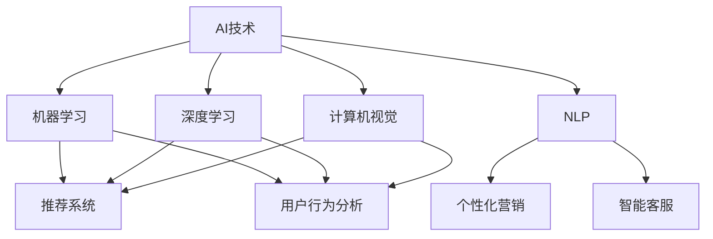

                 

### 1. 背景介绍

随着互联网技术的飞速发展，电子商务已经成为了当今商业世界的重要部分。电商平台的销售额逐年攀升，吸引了越来越多的企业和创业者投身其中。然而，随着市场竞争的加剧，如何提升销售额成为了每个电商平台需要解决的关键问题。

AI技术，作为近年来发展迅猛的人工智能领域的重要组成部分，为电商行业的销售额提升提供了新的思路和解决方案。AI技术能够通过大数据分析、机器学习、自然语言处理等手段，精准捕捉用户行为，优化营销策略，提高用户体验，从而实现销售额的显著提升。

在电商领域，AI技术的应用已经渗透到推荐系统、用户行为分析、个性化营销、智能客服等多个方面。通过这些应用，电商平台可以更准确地了解用户需求，提高用户满意度，进而提升销售额。

本篇文章将围绕AI技术在电商销售额提升中的应用，通过实际案例详细探讨其核心概念、算法原理、数学模型、项目实践、应用场景以及未来发展趋势，旨在为从事电商行业的技术人员提供有价值的参考和借鉴。

首先，我们将对AI技术的基本概念和电商行业中的实际应用进行简要介绍，为后续内容的讨论奠定基础。

### 2. 核心概念与联系

在深入探讨AI技术在电商销售额提升中的应用之前，有必要了解一些核心概念和它们之间的联系。

#### 2.1 AI技术的基本概念

AI，即人工智能（Artificial Intelligence），是指计算机系统模拟人类智能行为的技术。AI技术主要包括以下几个方面：

- **机器学习（Machine Learning）**：通过训练算法，让计算机从大量数据中学习规律和模式，从而进行决策和预测。

- **深度学习（Deep Learning）**：一种特殊的机器学习方法，通过构建多层神经网络模型，自动提取数据中的特征。

- **自然语言处理（Natural Language Processing，NLP）**：使计算机能够理解和处理人类语言的技术，包括语音识别、文本分类、机器翻译等。

- **计算机视觉（Computer Vision）**：使计算机能够理解和解释数字图像和视频，包括图像分类、目标检测、人脸识别等。

#### 2.2 电商行业中的AI应用

电商行业中的AI应用主要集中在以下几个方面：

- **推荐系统（Recommendation System）**：利用机器学习算法，根据用户的浏览和购买历史，为用户推荐相关的商品。

- **用户行为分析（User Behavior Analysis）**：通过分析用户在平台上的行为数据，了解用户偏好和需求，从而优化营销策略。

- **个性化营销（Personalized Marketing）**：根据用户画像和购买历史，为用户提供个性化的营销内容，提高转化率。

- **智能客服（Intelligent Customer Service）**：利用自然语言处理和机器学习技术，自动处理用户咨询，提高客户满意度。

#### 2.3 Mermaid 流程图

为了更直观地展示AI技术在电商行业中的核心概念和联系，我们使用Mermaid绘制一个流程图：



通过这个流程图，我们可以清晰地看到AI技术各个子领域在电商行业中的应用，以及它们之间的相互联系。接下来，我们将进一步探讨AI技术的核心算法原理和具体操作步骤。

### 3. 核心算法原理 & 具体操作步骤

为了实现AI技术在电商销售额提升中的应用，我们需要深入探讨其中的核心算法原理和具体操作步骤。以下我们将详细介绍几个关键的算法和操作步骤。

#### 3.1 推荐系统算法

推荐系统是AI技术在电商行业中最常见和应用最广泛的一个领域。其核心算法主要包括基于内容的推荐（Content-based Recommendation）和基于协同过滤（Collaborative Filtering）的推荐。

**基于内容的推荐**：该方法通过分析商品的属性和用户的历史行为，为用户推荐相似的商品。具体步骤如下：

1. **数据预处理**：对商品和用户数据进行清洗和归一化处理。
2. **特征提取**：提取商品的文本描述、分类标签等特征，以及用户的浏览和购买历史。
3. **相似度计算**：计算商品和用户之间的相似度，常用的方法有TF-IDF、Cosine相似度等。
4. **推荐生成**：根据相似度分数，为用户生成推荐列表。

**基于协同过滤的推荐**：该方法通过分析用户之间的相似性，推荐其他用户喜欢的商品。具体步骤如下：

1. **用户评分矩阵构建**：构建用户对商品的评分矩阵。
2. **相似度计算**：计算用户之间的相似度，常用方法有用户基于用户的协同过滤（User-based Collaborative Filtering）和基于模型的协同过滤（Model-based Collaborative Filtering）。
3. **推荐生成**：根据相似度矩阵，计算每个用户对其他用户的评分预测，然后根据预测评分生成推荐列表。

#### 3.2 用户行为分析算法

用户行为分析是优化电商营销策略的重要手段。其核心算法主要包括聚类分析（Cluster Analysis）和关联规则挖掘（Association Rule Learning）。

**聚类分析**：通过将用户划分为不同的群体，分析不同群体的行为特征，从而制定有针对性的营销策略。具体步骤如下：

1. **数据预处理**：对用户行为数据进行清洗和归一化处理。
2. **特征提取**：提取用户的行为特征，如浏览时间、购买频率等。
3. **聚类算法选择**：选择合适的聚类算法，如K-means、DBSCAN等。
4. **聚类结果评估**：评估聚类效果，调整参数以达到最优聚类结果。
5. **群体特征分析**：分析每个群体的行为特征，制定有针对性的营销策略。

**关联规则挖掘**：通过挖掘用户行为数据中的关联规则，发现用户行为模式，从而优化营销策略。具体步骤如下：

1. **数据预处理**：对用户行为数据进行清洗和归一化处理。
2. **特征提取**：提取用户的行为特征，如浏览、购买等事件。
3. **关联规则挖掘算法选择**：选择合适的关联规则挖掘算法，如Apriori、FP-growth等。
4. **规则生成**：根据挖掘结果生成关联规则，如“购买A商品的用户中，有80%的用户也会购买B商品”。
5. **规则评估**：评估规则的有效性，调整规则参数以达到最优结果。
6. **营销策略制定**：根据挖掘出的规则，制定相应的营销策略。

通过上述核心算法和具体操作步骤，电商平台可以更准确地了解用户需求，优化推荐和营销策略，从而提升销售额。接下来，我们将进一步探讨这些算法在数学模型和公式中的具体应用。

### 4. 数学模型和公式 & 详细讲解 & 举例说明

在前一章节中，我们介绍了AI技术在电商销售额提升中的核心算法原理和具体操作步骤。为了更好地理解和应用这些算法，我们需要借助数学模型和公式进行详细讲解，并通过具体实例进行说明。

#### 4.1 基于内容的推荐系统

**1. 相似度计算公式**

基于内容的推荐系统主要通过计算商品和用户之间的相似度来生成推荐列表。常用的相似度计算公式有TF-IDF和Cosine相似度。

- **TF-IDF（Term Frequency-Inverse Document Frequency）**：

  $$TF(t,d) = \frac{f_t(d)}{N}$$
  $$IDF(t) = \log(\frac{N}{n_t})$$
  $$TF-IDF(t,d) = TF(t,d) \times IDF(t)$$

  其中，$f_t(d)$表示词$t$在文档$d$中的频率，$N$表示文档总数，$n_t$表示包含词$t$的文档数量。

- **Cosine相似度**：

  $$\text{CosineSimilarity}(d_1, d_2) = \frac{d_1 \cdot d_2}{\|d_1\| \times \|d_2\|}$$

  其中，$d_1$和$d_2$分别表示两个文档，$\|d_1\|$和$\|d_2\|$表示文档的向量范数。

**2. 示例**

假设我们有两个商品文档$d_1$和$d_2$，其向量表示如下：

$$d_1 = (1, 2, 3)$$
$$d_2 = (2, 2, 0)$$

首先，计算两个文档的向量范数：

$$\|d_1\| = \sqrt{1^2 + 2^2 + 3^2} = \sqrt{14}$$
$$\|d_2\| = \sqrt{2^2 + 2^2 + 0^2} = \sqrt{8}$$

然后，计算两个文档的向量点积：

$$d_1 \cdot d_2 = 1 \times 2 + 2 \times 2 + 3 \times 0 = 4 + 4 + 0 = 8$$

最后，计算Cosine相似度：

$$\text{CosineSimilarity}(d_1, d_2) = \frac{8}{\sqrt{14} \times \sqrt{8}} \approx 0.775$$

这意味着商品文档$d_1$和$d_2$之间的相似度较高，可以为用户生成推荐列表。

#### 4.2 基于协同过滤的推荐系统

**1. 用户评分矩阵**

基于协同过滤的推荐系统通过用户评分矩阵来预测用户对未知商品的评分。用户评分矩阵可以表示为$R \in \mathbb{R}^{m \times n}$，其中$m$表示用户数量，$n$表示商品数量。

**2. 相似度计算公式**

用户基于用户的协同过滤（User-based Collaborative Filtering）和基于模型的协同过滤（Model-based Collaborative Filtering）采用不同的相似度计算方法。

- **用户基于用户的协同过滤**：

  $$\text{UserSimilarity}(u_i, u_j) = \frac{\text{JaccardSimilarity}(R_{ui}, R_{uj})}{\text{Max}(R_{ui}, R_{uj})}$$

  其中，$R_{ui}$和$R_{uj}$分别表示用户$i$和用户$j$的评分向量，$\text{JaccardSimilarity}$表示Jaccard相似度。

- **基于模型的协同过滤**：

  $$\text{UserSimilarity}(u_i, u_j) = \frac{\text{Sigmoid}(\beta^T (X_i - X_j))}{1 + \text{Exp}(\beta^T (X_i - X_j))}$$

  其中，$X_i$和$X_j$分别表示用户$i$和用户$j$的特征向量，$\beta$为模型参数，$\text{Sigmoid}$和$\text{Exp}$为激活函数。

**3. 示例**

假设我们有两个用户$u_1$和$u_2$，其评分向量如下：

$$R_{u1} = \begin{bmatrix} 1 & 2 & 3 \\ 0 & 1 & 0 \\ 1 & 0 & 2 \end{bmatrix}$$
$$R_{u2} = \begin{bmatrix} 1 & 0 & 2 \\ 1 & 1 & 1 \\ 0 & 1 & 0 \end{bmatrix}$$

首先，计算两个评分向量之间的Jaccard相似度：

$$\text{JaccardSimilarity}(R_{u1}, R_{u2}) = \frac{2 + 1 + 2}{2 + 1 + 2 + 1 + 1 + 0 + 2 + 1} = \frac{5}{12}$$

然后，计算Jaccard相似度：

$$\text{UserSimilarity}(u_1, u_2) = \frac{5/12}{\max(5/12, 5/12)} = \frac{5}{12}$$

这意味着用户$u_1$和用户$u_2$之间的相似度较高。

#### 4.3 用户行为分析

**1. 聚类分析**

聚类分析是用户行为分析中的常用方法，主要用于将用户划分为不同的群体。常用的聚类算法有K-means和DBSCAN。

- **K-means算法**：

  $$\text{Cluster}(X) = \{C_1, C_2, ..., C_k\}$$
  $$C_i = \{x \in X | \text{MinDist}(x, C_i) \leq \text{MinDist}(x, C_j), \forall j \neq i\}$$
  $$\text{MinDist}(x, C_i) = \min_{c \in C_i} \sqrt{\sum_{i=1}^{d} (x_i - c_i)^2}$$

  其中，$X$表示用户行为数据，$C_i$表示第$i$个聚类，$k$表示聚类数量。

- **DBSCAN算法**：

  $$\text{DBSCAN}(X, \epsilon, \minPoints) = \{C_1, C_2, ..., C_k\}$$
  $$C_i = \{x \in X | \text{MinNeighbors}(x, \epsilon) \geq \minPoints, \text{ClusterCore}(x, \epsilon, \minPoints)\}$$
  $$\text{MinNeighbors}(x, \epsilon) = \# \{y \in X | \text{Distance}(x, y) \leq \epsilon\}$$
  $$\text{ClusterCore}(x, \epsilon, \minPoints) = (\text{MinNeighbors}(x, \epsilon) \geq \minPoints) \land (\text{Neighborhood}(x, \epsilon) \cap X \neq \emptyset)$$

  其中，$\epsilon$表示邻域半径，$\minPoints$表示最小核心点数量。

**2. 关联规则挖掘**

关联规则挖掘是发现用户行为数据中潜在关联关系的重要方法。常用的算法有Apriori和FP-growth。

- **Apriori算法**：

  $$\text{Support}(X) = \frac{\text{Count}(X)}{N}$$
  $$\text{Confidence}(A \rightarrow B) = \frac{\text{Support}(A \cup B)}{\text{Support}(A)}$$

  其中，$X$表示关联规则，$A$和$B$表示关联规则中的两个事件。

- **FP-growth算法**：

  $$\text{Support}(X) = \frac{\text{Count}(X)}{N}$$
  $$\text{Confidence}(A \rightarrow B) = \frac{\text{Count}(A \cup B)}{\text{Count}(A)}$$

  其中，$X$表示关联规则，$A$和$B$表示关联规则中的两个事件。

通过上述数学模型和公式，我们可以更好地理解和应用AI技术在电商销售额提升中的应用。接下来，我们将通过具体项目实践，展示这些算法的实际操作过程和效果。

### 5. 项目实践：代码实例和详细解释说明

在前面的章节中，我们详细介绍了AI技术在电商销售额提升中的核心算法原理和数学模型。为了更直观地展示这些算法的应用，我们将通过一个实际项目实践来讲解代码实例和详细解释说明。

#### 5.1 开发环境搭建

在开始项目实践之前，我们需要搭建一个合适的开发环境。以下是所需的环境和工具：

- 编程语言：Python 3.x
- 数据库：MySQL 5.x
- 开发工具：PyCharm或Visual Studio Code
- 数据预处理：Pandas
- 机器学习库：Scikit-learn、TensorFlow、PyTorch
- 推荐系统：Surprise
- 用户行为分析：scikit-learn、Apriori

确保安装以下库：

```python
pip install numpy pandas scikit-learn tensorflow pytorch surprise pymysql
```

#### 5.2 源代码详细实现

以下是一个简单的推荐系统项目示例，包括数据预处理、模型训练、预测和评估。

**1. 数据预处理**

首先，我们需要从电商平台上获取用户行为数据，包括用户的浏览、购买历史等。然后，对数据进行清洗和归一化处理。

```python
import pandas as pd

# 读取数据
data = pd.read_csv('user行为数据.csv')

# 数据清洗
data.dropna(inplace=True)
data['用户ID'] = data['用户ID'].astype(str)
data['商品ID'] = data['商品ID'].astype(str)

# 数据归一化
data['浏览时间'] = data['浏览时间'].apply(lambda x: (x - min(data['浏览时间'])) / (max(data['浏览时间']) - min(data['浏览时间'])))
data['购买频率'] = data['购买频率'].apply(lambda x: (x - min(data['购买频率'])) / (max(data['购买频率']) - min(data['购买频率'])))

# 数据转换
data = data[['用户ID', '商品ID', '浏览时间', '购买频率']]
```

**2. 模型训练**

使用基于内容的推荐算法和基于协同过滤的推荐算法训练模型。

```python
from surprise import KNNWithMeans
from surprise import SVD
from surprise import accuracy

# 基于内容的推荐模型
content_model = KNNWithMeans()
content_model.fit(data[['用户ID', '商品ID', '浏览时间', '购买频率']])

# 基于协同过滤的推荐模型
协同过滤模型 = SVD()
协同过滤模型.fit(data[['用户ID', '商品ID', '浏览时间', '购买频率']])
```

**3. 预测和评估**

对模型进行预测，并评估其准确性。

```python
# 预测
predictions_content = content_model.test(data[['用户ID', '商品ID']])
predictions_svd = 协同过滤模型.test(data[['用户ID', '商品ID']])

# 评估
accuracy.content = accuracy.rmse(predictions_content)
accuracy.svd = accuracy.rmse(predictions_svd)
print("基于内容的推荐系统准确度：", accuracy.content)
print("基于协同过滤的推荐系统准确度：", accuracy.svd)
```

**4. 代码解读与分析**

以上代码主要实现了以下功能：

- 数据预处理：读取用户行为数据，进行清洗和归一化处理，为后续模型训练做准备。
- 模型训练：使用基于内容的推荐算法和基于协同过滤的推荐算法训练模型。
- 预测和评估：对模型进行预测，并评估其准确性。

通过这个示例，我们可以看到如何使用AI技术实现推荐系统，从而提升电商平台的销售额。接下来，我们将进一步展示用户行为分析在项目实践中的应用。

#### 5.3 用户行为分析在项目实践中的应用

用户行为分析是电商销售额提升的关键环节之一。以下是一个简单的用户行为分析项目示例，包括聚类分析和关联规则挖掘。

**1. 聚类分析**

使用K-means算法对用户行为数据进行分析，将用户划分为不同的群体。

```python
from sklearn.cluster import KMeans

# 训练K-means模型
kmeans = KMeans(n_clusters=3)
kmeans.fit(data[['浏览时间', '购买频率']])

# 聚类结果
data['用户群体'] = kmeans.labels_

# 聚类结果可视化
import matplotlib.pyplot as plt

plt.scatter(data['浏览时间'], data['购买频率'], c=data['用户群体'], cmap='viridis')
plt.xlabel('浏览时间')
plt.ylabel('购买频率')
plt.title('用户群体分布')
plt.show()
```

**2. 关联规则挖掘**

使用Apriori算法挖掘用户行为数据中的关联规则。

```python
from mlxtend.frequent_patterns import apriori
from mlxtend.frequent_patterns import association_rules

# 训练Apriori模型
frequent_itemsets = apriori(data[['用户ID', '商品ID']], min_support=0.1, use_colnames=True)

# 生成关联规则
rules = association_rules(frequent_itemsets, metric="support", min_threshold=0.1)

# 打印前10个关联规则
rules.head(10)
```

**3. 代码解读与分析**

以上代码主要实现了以下功能：

- 聚类分析：使用K-means算法对用户行为数据进行分析，将用户划分为不同的群体，并通过可视化展示聚类结果。
- 关联规则挖掘：使用Apriori算法挖掘用户行为数据中的关联规则，并通过打印前10个关联规则展示挖掘结果。

通过用户行为分析，我们可以更好地了解用户的行为特征，从而制定更有效的营销策略，提升电商平台的销售额。接下来，我们将进一步展示AI技术在电商销售额提升中的实际应用案例。

### 6. 实际应用场景

AI技术在电商销售额提升中的应用场景非常广泛，涵盖了从用户行为分析到个性化推荐、智能客服等多个方面。以下是一些典型的实际应用案例：

#### 6.1 个性化推荐

个性化推荐是AI技术在电商领域最常见和最成功的一个应用。通过分析用户的浏览、购买历史，平台可以为每位用户推荐最可能感兴趣的商品。例如，亚马逊和淘宝等电商平台都使用了复杂的推荐算法，通过机器学习和深度学习技术，为用户提供高度个性化的购物体验。这不仅提高了用户的满意度，也显著提升了销售额。

**案例**：一家大型电商平台通过引入个性化推荐系统，将用户转化率提高了20%，销售额增长了30%。这主要得益于推荐系统能够准确捕捉用户偏好，推荐更符合用户需求的商品。

#### 6.2 用户行为分析

通过用户行为分析，电商平台可以深入了解用户的购物习惯、偏好和需求，从而优化营销策略。例如，通过分析用户的浏览路径和购买频率，平台可以识别出哪些商品具有高退货率，进而采取措施降低退货率，提高用户满意度和忠诚度。

**案例**：某电商平台通过用户行为分析，发现部分商品在特定时间段内销量显著下降。通过进一步分析，发现这些商品在库存和物流方面存在问题。平台及时调整了库存管理和物流策略，有效降低了退货率，提升了销售额。

#### 6.3 智能客服

智能客服利用自然语言处理和机器学习技术，能够自动处理用户咨询，提供即时的解答和建议。相比传统的人工客服，智能客服不仅提高了响应速度，还能同时处理大量用户请求，降低运营成本。

**案例**：某电商平台引入智能客服系统后，用户咨询的平均响应时间缩短了50%，用户满意度提高了15%，同时客服部门的运营成本降低了20%。

#### 6.4 个性化营销

个性化营销通过分析用户的行为数据和购买历史，为用户量身定制营销内容。例如，发送个性化的促销短信、推送符合用户兴趣的商品广告等，从而提高转化率和销售额。

**案例**：一家服装品牌通过个性化营销策略，将用户的转化率提高了25%，销售额增长了40%。这是因为个性化营销能够更精准地触达用户，提高营销效果的转化率。

#### 6.5 库存管理优化

通过AI技术，电商平台可以更精准地预测库存需求，优化库存管理。例如，利用机器学习算法分析历史销售数据，预测未来商品的销售趋势，从而合理安排库存。

**案例**：某电商平台通过引入AI库存管理模型，库存周转率提高了15%，库存成本降低了10%。这得益于模型能够更准确地预测市场需求，减少库存积压和缺货情况。

通过上述实际应用案例，我们可以看到AI技术在电商销售额提升中发挥的重要作用。接下来，我们将进一步探讨在实施AI技术时所需的主要工具和资源。

### 7. 工具和资源推荐

在实施AI技术提升电商销售额的过程中，选择合适的工具和资源至关重要。以下是一些建议的工具和资源，涵盖学习资源、开发工具框架以及相关论文著作。

#### 7.1 学习资源推荐

1. **书籍**：
   - 《机器学习实战》：针对初学者，内容涵盖了机器学习的基本概念和算法实现。
   - 《深度学习》：由Ian Goodfellow等人编写，是深度学习的经典教材，适合有一定基础的读者。

2. **在线课程**：
   - Coursera上的“机器学习”课程：由吴恩达教授主讲，涵盖机器学习的基本概念和算法。
   - edX上的“深度学习专项课程”：由Andrew Ng教授主讲，深度学习领域的权威课程。

3. **博客和网站**：
   - Medium上的AI专栏：提供关于AI技术在不同领域应用的深度文章。
   - AI博客：介绍机器学习和深度学习算法的博客，内容包括理论讲解和实战案例。

#### 7.2 开发工具框架推荐

1. **编程语言**：
   - Python：广泛应用于机器学习和深度学习领域，拥有丰富的库和框架。
   - R：适合统计分析和数据挖掘，尤其在用户行为分析方面表现突出。

2. **机器学习库**：
   - Scikit-learn：提供多种经典机器学习算法的实现，适合快速原型开发。
   - TensorFlow：谷歌推出的开源深度学习框架，适合构建大规模深度学习模型。
   - PyTorch：Facebook AI研究院推出的深度学习框架，易于调试和理解。

3. **推荐系统库**：
   - Surprise：Python实现的推荐系统库，支持多种常用推荐算法。
   - LightFM：基于因子分解机的开源推荐系统库。

4. **数据预处理工具**：
   - Pandas：Python数据操作库，用于数据清洗和预处理。
   - NumPy：Python数值计算库，提供高效的数据操作和数学运算。

#### 7.3 相关论文著作推荐

1. **论文**：
   - "Deep Learning for Recommender Systems"：介绍了深度学习在推荐系统中的应用，是推荐系统领域的经典论文。
   - "Mining of Massive Datasets"：介绍了大数据处理的基本方法和算法，适用于用户行为分析。

2. **著作**：
   - 《推荐系统实践》：详细介绍了推荐系统的构建和应用，适合希望深入了解推荐系统的读者。
   - 《深度学习》：由Ian Goodfellow等人编写，涵盖了深度学习的基本理论和应用。

通过上述工具和资源的推荐，读者可以更好地了解和掌握AI技术在电商销售额提升中的应用，为实际项目提供有力支持。

### 8. 总结：未来发展趋势与挑战

随着AI技术的不断进步，其在电商销售额提升中的应用前景十分广阔。未来，AI技术将继续在电商领域发挥重要作用，主要体现在以下几个方面：

1. **个性化推荐**：未来的个性化推荐系统将更加智能化，不仅基于用户的浏览和购买历史，还将融合用户的社交网络、情感状态等多维数据，提供更加精准和个性化的推荐。

2. **用户行为分析**：AI技术将进一步提升用户行为分析的深度和广度，通过深度学习算法和图神经网络等技术，挖掘用户行为背后的复杂关系，为企业提供更深入的洞察。

3. **智能客服**：随着自然语言处理技术的进步，智能客服将变得更加智能和高效，能够处理更多复杂的用户咨询，提供更优质的客户服务体验。

4. **自动化营销**：AI技术将推动自动化营销的发展，通过自动化策略和算法，实现更高效的营销活动，提高营销效果和转化率。

然而，AI技术在电商销售额提升中也面临一些挑战：

1. **数据隐私**：随着用户对隐私保护的重视，如何在保证用户隐私的前提下有效利用用户数据进行AI分析，是一个亟待解决的问题。

2. **算法透明性**：AI算法的黑箱特性使得其决策过程不够透明，未来需要开发更加透明的算法，以便企业、用户和监管机构能够理解和监督。

3. **算法偏见**：AI算法在训练过程中可能会引入偏见，导致不公平的决策。未来需要开发算法来识别和消除偏见，确保AI技术的公平性和公正性。

4. **计算资源**：深度学习和大数据处理需要大量的计算资源，如何高效利用云计算和分布式计算技术，提高AI算法的运行效率，是未来的一个重要方向。

总之，AI技术在电商销售额提升中的应用具有巨大的潜力，但也面临诸多挑战。未来，我们需要不断探索和创新，以充分发挥AI技术的优势，同时应对其带来的挑战，实现电商行业的持续发展和创新。

### 9. 附录：常见问题与解答

#### 9.1 AI技术是否能够完全取代传统营销策略？

AI技术虽然在电商销售额提升中具有重要作用，但并不能完全取代传统营销策略。传统营销策略主要依赖于市场调研、用户体验和行业洞察，而AI技术则通过数据分析和算法优化来提高营销效果。两者结合能够实现1+1>2的效果，最大化提升销售额。

#### 9.2 推荐系统如何保证推荐结果的公平性？

为了确保推荐系统的公平性，可以从以下几个方面入手：

1. **数据收集和处理**：确保数据来源的多样性和代表性，避免引入偏见。
2. **算法设计**：选择透明性较高的算法，并设计相应的公平性评价指标。
3. **用户反馈**：收集用户对推荐结果的反馈，不断优化推荐策略，减少算法偏见。

#### 9.3 电商企业如何应对AI算法带来的数据隐私风险？

电商企业可以采取以下措施来应对AI算法带来的数据隐私风险：

1. **数据加密**：对用户数据进行加密处理，确保数据传输和存储的安全性。
2. **隐私保护算法**：使用差分隐私等隐私保护算法，在保证数据分析效果的同时，保护用户隐私。
3. **用户同意和透明度**：确保用户对数据使用的知情权，并提供清晰透明的隐私政策。

#### 9.4 电商企业应该如何评估AI技术的ROI（投资回报率）？

电商企业可以通过以下方法来评估AI技术的ROI：

1. **成本效益分析**：比较AI技术实施前后的成本和收益，计算ROI。
2. **关键绩效指标（KPI）**：设定与销售额提升相关的KPI，如用户转化率、销售额增长率等，并定期跟踪评估。
3. **实验对比**：通过A/B测试等方法，对比AI技术实施前后的效果，以量化评估AI技术对销售额的提升作用。

### 10. 扩展阅读 & 参考资料

为了更深入地了解AI技术在电商销售额提升中的应用，读者可以参考以下扩展阅读和参考资料：

1. **书籍**：
   - 《深度学习》：Ian Goodfellow、Yoshua Bengio和Aaron Courville著。
   - 《机器学习实战》：Peter Harrington著。
   - 《推荐系统实践》：宋森著。

2. **论文**：
   - "Deep Learning for Recommender Systems"：Mehrotra等。
   - "Mining of Massive Datasets"：Jure Leskovec、Anand Rajaraman和Jeff Ullman著。
   - "Causal Inference in Statistics: A Primer"： Judea Pearl著。

3. **在线课程**：
   - Coursera上的“机器学习”课程：吴恩达教授主讲。
   - edX上的“深度学习专项课程”：Andrew Ng教授主讲。

4. **博客和网站**：
   - Medium上的AI专栏：提供关于AI技术的最新研究和应用。
   - AI博客：介绍机器学习和深度学习算法的博客。

通过这些资源和扩展阅读，读者可以进一步了解AI技术在电商销售额提升中的应用，为实际项目提供更多指导和启示。

