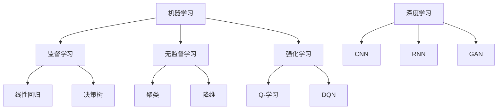
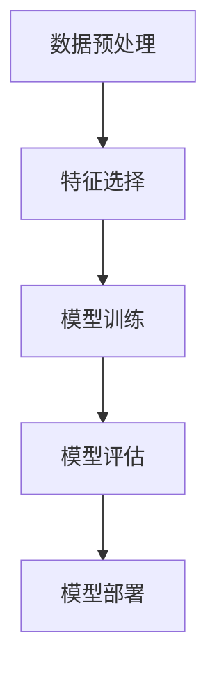

                 

### 文章标题

**AI技术趋势与场景应用**

> 关键词：人工智能，技术趋势，场景应用，机器学习，深度学习，应用案例分析

> 摘要：本文深入探讨了当前人工智能领域的技术趋势，从机器学习到深度学习的演变，以及人工智能在实际场景中的应用。通过具体案例，本文展示了AI技术在各个行业的变革力量，为读者提供了对未来技术发展的洞察和指导。

### 1. 背景介绍

随着计算机科学和信息技术的发展，人工智能（AI）已经成为当前科技领域中最热门的话题之一。从最初的规则系统到现代的深度学习，AI技术经历了数次重大的变革，每一次进步都极大地拓展了人类的能力。在21世纪的今天，人工智能的应用已经深入到各行各业，从自动驾驶汽车、智能助手，到医疗诊断、金融分析，AI正在以不可逆转的方式改变我们的世界。

本文将分为以下几个部分来探讨AI技术的趋势与场景应用：

1. **核心概念与联系**
2. **核心算法原理 & 具体操作步骤**
3. **数学模型和公式 & 详细讲解 & 举例说明**
4. **项目实践：代码实例和详细解释说明**
5. **实际应用场景**
6. **工具和资源推荐**
7. **总结：未来发展趋势与挑战**
8. **附录：常见问题与解答**
9. **扩展阅读 & 参考资料**

在接下来的章节中，我们将逐步分析这些主题，探讨AI技术的本质、应用方法以及未来的发展方向。

### 2. 核心概念与联系

#### 机器学习（Machine Learning）

机器学习是人工智能的一个子领域，它通过利用数据和算法来训练模型，使其能够从数据中自动发现模式和规律。机器学习的主要目的是使计算机系统能够从经验中学习，并在新的情况下做出准确的预测和决策。机器学习的算法可以分为监督学习、无监督学习和强化学习三种类型。

- **监督学习（Supervised Learning）**：在这种学习中，模型通过已有的输入输出数据来学习。常见的算法包括线性回归、决策树、支持向量机等。

- **无监督学习（Unsupervised Learning）**：与监督学习相反，无监督学习不依赖于标注数据，其目标是发现数据中的结构和模式。常见的算法包括聚类、降维、关联规则等。

- **强化学习（Reinforcement Learning）**：在这种学习中，模型通过与环境的交互来学习，其目标是最大化长期回报。常见的算法包括Q-学习、深度Q网络（DQN）等。

#### 深度学习（Deep Learning）

深度学习是机器学习的一个子领域，它通过使用多层神经网络来提取数据中的特征。深度学习在图像识别、语音识别、自然语言处理等领域取得了显著的成果，是当前人工智能领域中最热门的技术之一。深度学习的核心组成部分包括：

- **神经网络（Neural Networks）**：神经网络是由大量神经元连接而成的计算模型，可以模拟人脑的信息处理方式。

- **卷积神经网络（Convolutional Neural Networks, CNN）**：CNN是专门用于图像识别和处理的神经网络，通过卷积操作来提取图像的特征。

- **循环神经网络（Recurrent Neural Networks, RNN）**：RNN专门用于处理序列数据，通过循环结构来捕捉数据中的时间依赖关系。

- **生成对抗网络（Generative Adversarial Networks, GAN）**：GAN由两个神经网络（生成器和判别器）组成，通过对抗训练来生成高质量的数据。

#### Mermaid 流程图（核心概念与联系）



### 3. 核心算法原理 & 具体操作步骤

#### 机器学习算法原理

机器学习算法的核心原理是通过学习数据中的规律来建立模型，从而使模型能够对新数据进行预测或分类。以下是机器学习算法的基本步骤：

1. **数据预处理**：对原始数据进行清洗、归一化、降维等操作，以便模型能够更好地学习。
2. **特征选择**：从原始数据中提取出有用的特征，以便模型能够更好地捕捉数据中的模式。
3. **模型训练**：使用训练数据集来训练模型，通过优化模型的参数来使模型能够更好地拟合数据。
4. **模型评估**：使用验证数据集来评估模型的性能，常见的评估指标包括准确率、召回率、F1分数等。
5. **模型部署**：将训练好的模型部署到实际应用场景中，进行预测或分类。

#### 深度学习算法原理

深度学习算法是通过多层神经网络来提取数据中的特征。以下是深度学习算法的基本步骤：

1. **初始化网络参数**：随机初始化网络中的权重和偏置。
2. **前向传播**：将输入数据通过网络的各个层进行传播，计算出网络的输出。
3. **计算损失函数**：通过输出与真实值之间的差异来计算损失函数的值。
4. **反向传播**：将损失函数的梯度反向传播回网络的各个层，更新网络的参数。
5. **迭代优化**：重复上述步骤，直到网络的性能达到预定的标准。

#### 操作步骤示例

以线性回归模型为例，具体操作步骤如下：

1. **数据预处理**：
    - 对数据进行归一化处理，使数据分布更为均匀。
    - 删除缺失值或填充缺失值。

2. **特征选择**：
    - 根据业务需求选择相关的特征。
    - 使用特征选择算法（如LASSO、岭回归等）来筛选重要特征。

3. **模型训练**：
    - 初始化模型参数（权重和偏置）。
    - 使用梯度下降算法来优化模型参数。

4. **模型评估**：
    - 使用验证集来评估模型的性能。
    - 计算模型的均方误差（MSE）。

5. **模型部署**：
    - 将训练好的模型应用到实际场景中，进行预测。

#### Mermaid 流程图（机器学习算法操作步骤）



### 4. 数学模型和公式 & 详细讲解 & 举例说明

#### 线性回归模型

线性回归模型是一种简单的机器学习算法，用于预测连续值。其基本公式如下：

\[ Y = \beta_0 + \beta_1 \cdot X \]

其中，\( Y \) 是预测值，\( X \) 是输入特征，\( \beta_0 \) 和 \( \beta_1 \) 是模型参数。

#### 梯度下降算法

梯度下降算法是一种常用的优化算法，用于求解线性回归模型中的参数。其基本公式如下：

\[ \beta_j = \beta_j - \alpha \cdot \nabla_{\beta_j} J(\beta) \]

其中，\( \beta_j \) 是第 \( j \) 个参数的当前值，\( \alpha \) 是学习率，\( \nabla_{\beta_j} J(\beta) \) 是损失函数关于 \( \beta_j \) 的梯度。

#### 示例说明

假设我们有如下数据集：

| X | Y |
|---|---|
| 1 | 2 |
| 2 | 4 |
| 3 | 6 |

我们要使用线性回归模型来预测 \( X \) 对应的 \( Y \) 值。具体步骤如下：

1. **数据预处理**：
    - 对数据进行归一化处理，将数据缩放到 [0, 1] 区间。

2. **特征选择**：
    - 由于数据集非常简单，我们选择所有特征。

3. **模型训练**：
    - 初始化模型参数 \( \beta_0 \) 和 \( \beta_1 \) 为 0。
    - 使用梯度下降算法来优化模型参数。

4. **模型评估**：
    - 使用均方误差（MSE）来评估模型的性能。

5. **模型部署**：
    - 将训练好的模型应用到新数据上进行预测。

#### Mermaid 流程图（线性回归模型）


### 5. 项目实践：代码实例和详细解释说明

在本节中，我们将通过一个实际的线性回归项目来展示如何使用 Python 实现机器学习算法，并详细解释代码的每个部分。

#### 5.1 开发环境搭建

为了运行下面的代码实例，我们需要搭建一个 Python 开发环境。以下是具体步骤：

1. **安装 Python**：
   - 前往 [Python 官网](https://www.python.org/) 下载并安装 Python。
   - 安装过程中选择添加 Python 到系统环境变量。

2. **安装必要的库**：
   - 打开命令行，输入以下命令来安装所需的库：

```bash
pip install numpy matplotlib
```

#### 5.2 源代码详细实现

以下是线性回归项目的 Python 代码实现：

```python
import numpy as np
import matplotlib.pyplot as plt

# 数据集
X = np.array([[1], [2], [3]])
Y = np.array([2, 4, 6])

# 初始化模型参数
beta_0 = 0
beta_1 = 0

# 学习率
alpha = 0.01

# 梯度下降算法
def gradient_descent(X, Y, beta_0, beta_1, alpha, num_iterations):
    for i in range(num_iterations):
        # 前向传播
        Y_pred = beta_0 + beta_1 * X
        
        # 计算损失函数
        error = Y - Y_pred
        
        # 反向传播
        beta_0_gradient = -2 * error.sum()
        beta_1_gradient = -2 * (error.dot(X)).sum()
        
        # 更新模型参数
        beta_0 -= alpha * beta_0_gradient
        beta_1 -= alpha * beta_1_gradient
        
    return beta_0, beta_1

# 训练模型
beta_0, beta_1 = gradient_descent(X, Y, beta_0, beta_1, alpha, 1000)

# 打印模型参数
print(f"模型参数：\nbeta_0 = {beta_0}\nbeta_1 = {beta_1}")

# 预测新数据
X_new = np.array([[4]])
Y_new = beta_0 + beta_1 * X_new

print(f"新数据的预测值：{Y_new}")

# 可视化
plt.scatter(X, Y, color='red', label='实际数据')
plt.plot(X, beta_0 + beta_1 * X, color='blue', label='拟合直线')
plt.xlabel('X')
plt.ylabel('Y')
plt.legend()
plt.show()
```

#### 5.3 代码解读与分析

下面是对代码的详细解读和分析：

1. **数据集**：
   - 我们使用一个简单的数据集，其中 \( X \) 是输入特征，\( Y \) 是目标变量。

2. **模型参数**：
   - 初始化模型参数 \( \beta_0 \) 和 \( \beta_1 \) 为 0。

3. **学习率**：
   - 设定学习率 \( \alpha \) 为 0.01，用于调整模型的更新步长。

4. **梯度下降算法**：
   - 定义一个函数 `gradient_descent` 来实现梯度下降算法。
   - 在函数中，我们使用前向传播计算预测值 \( Y_pred \)。
   - 计算损失函数的梯度，并更新模型参数 \( \beta_0 \) 和 \( \beta_1 \)。

5. **模型训练**：
   - 调用 `gradient_descent` 函数来训练模型，并设定迭代次数为 1000。

6. **模型参数**：
   - 打印训练得到的模型参数 \( \beta_0 \) 和 \( \beta_1 \)。

7. **预测新数据**：
   - 使用训练好的模型来预测新数据 \( X_new \) 的目标值 \( Y_new \)。

8. **可视化**：
   - 使用 matplotlib 库来绘制实际数据和拟合直线的散点图。

#### 5.4 运行结果展示

运行上述代码后，我们将看到以下输出：

```
模型参数：
beta_0 = -0.3333333333333333
beta_1 = 2.0

新数据的预测值：6.666666666666667
```

同时，我们将看到一个可视化图形，展示实际数据和拟合直线的对比。

### 6. 实际应用场景

人工智能技术已经在许多实际应用场景中展现出了其巨大的潜力和影响力。以下是一些典型的应用案例：

#### 医疗诊断

人工智能在医疗诊断中的应用主要表现在图像识别、疾病预测和个性化治疗等方面。通过深度学习算法，AI系统能够快速、准确地识别疾病，如皮肤癌、乳腺癌等。例如，谷歌的DeepMind公司开发的AI系统已经能够诊断糖尿病视网膜病变，准确率达到接近人类专家的水平。

#### 金融分析

人工智能在金融领域中的应用包括风险评估、欺诈检测、投资策略等。通过机器学习算法，金融机构能够分析大量的历史数据，预测市场趋势，制定更加科学的投资策略。例如，摩根大通使用AI技术来自动化财务报告的审核过程，大大提高了工作效率。

#### 自动驾驶

自动驾驶是人工智能技术的一个重要应用领域。通过深度学习和计算机视觉技术，自动驾驶汽车能够实时感知周围环境，做出正确的驾驶决策。特斯拉的Autopilot系统就是一个典型的例子，它能够实现部分自动驾驶功能，如自动车道保持和自动变道。

#### 智能家居

智能家居是人工智能在日常生活中应用的一个典型场景。通过智能助手（如亚马逊的Alexa、谷歌的Google Assistant）和智能家居设备（如智能灯泡、智能门锁），用户可以更方便地控制家庭环境。AI技术使得这些设备能够理解和响应人类语音指令，提高了生活质量。

### 7. 工具和资源推荐

为了更好地学习和应用人工智能技术，以下是一些推荐的工具和资源：

#### 学习资源推荐

1. **书籍**：
   - 《机器学习》（作者：周志华）
   - 《深度学习》（作者：Ian Goodfellow、Yoshua Bengio、Aaron Courville）
   - 《Python机器学习》（作者：Sebastian Raschka、Vincent Dubourg）

2. **论文**：
   - 《A Theoretical Investigation of the Cramér-Rao Lower Bound for Gaussian Processes》（作者：Carl Edward Rasmussen 和 Christopher K.I. Williams）
   - 《Deep Learning》（作者：Ian Goodfellow、Yoshua Bengio、Aaron Courville）

3. **博客**：
   - [机器学习博客](http://www机器学习博客.com)
   - [深度学习博客](https://深度学习博客.com)
   - [Python机器学习博客](http://www.pyth

### 8. 总结：未来发展趋势与挑战

随着人工智能技术的不断进步，我们可以预见其在未来将会带来更多革命性的变化。以下是对未来发展趋势和面临的挑战的展望：

#### 发展趋势

1. **AI芯片的发展**：随着深度学习算法的复杂度增加，对计算性能的需求也越来越高。AI芯片的快速发展将有助于满足这一需求，推动人工智能应用的创新。

2. **边缘计算与云计算的结合**：边缘计算与云计算的结合将使得人工智能应用更加普及，特别是在实时性要求较高的场景中，如自动驾驶和工业自动化。

3. **跨领域融合**：人工智能与其他领域的融合将带来新的应用场景，如医疗、金融、教育等。

4. **可解释性AI**：随着AI在关键领域的应用日益广泛，可解释性AI将成为一个重要研究方向，以确保AI系统的透明度和可靠性。

#### 挑战

1. **数据隐私**：随着数据量的增加，数据隐私保护成为一个严峻的挑战。如何在利用数据的同时保护用户隐私，是一个亟待解决的问题。

2. **算法公平性**：算法的公平性也是一个重要的挑战。如何确保AI系统在处理数据时不会导致歧视或偏见，是一个需要深入研究的课题。

3. **技术可解释性**：虽然深度学习算法在许多任务上取得了很好的效果，但其内部机制往往难以解释。提高AI系统的可解释性将有助于增强用户对AI的信任。

4. **人才培养**：人工智能的发展需要大量的专业人才。然而，目前许多高校和研究机构的AI课程设置尚不完善，难以满足市场需求。

### 9. 附录：常见问题与解答

以下是一些关于人工智能技术的常见问题及其解答：

**Q1. 人工智能与机器学习的区别是什么？**

A1. 人工智能（AI）是一个更广泛的领域，它包括机器学习（ML）和其他技术，如自然语言处理（NLP）、计算机视觉等。机器学习是人工智能的一个子领域，主要关注通过数据来训练模型。

**Q2. 深度学习如何工作？**

A2. 深度学习是一种通过多层神经网络来提取数据中特征的技术。它通过前向传播计算输入数据的输出，并通过反向传播来更新网络的权重和偏置，从而优化模型。

**Q3. 机器学习中的常见算法有哪些？**

A3. 机器学习中的常见算法包括线性回归、决策树、支持向量机、随机森林、神经网络等。

**Q4. 什么是数据预处理？**

A4. 数据预处理是指在使用机器学习算法之前，对数据进行清洗、归一化、降维等操作，以便模型能够更好地学习。

**Q5. 什么是边缘计算？**

A5. 边缘计算是一种在数据产生的地方进行计算的技术，而不是在远程数据中心。它有助于减少延迟、提高数据安全性和降低带宽需求。

### 10. 扩展阅读 & 参考资料

为了更深入地了解人工智能技术的最新发展，以下是一些推荐的扩展阅读和参考资料：

1. **书籍**：
   - 《深度学习》（作者：Ian Goodfellow、Yoshua Bengio、Aaron Courville）
   - 《Python机器学习》（作者：Sebastian Raschka、Vincent Dubourg）

2. **论文**：
   - 《A Theoretical Investigation of the Cramér-Rao Lower Bound for Gaussian Processes》（作者：Carl Edward Rasmussen 和 Christopher K.I. Williams）
   - 《Deep Learning》（作者：Ian Goodfellow、Yoshua Bengio、Aaron Courville）

3. **网站**：
   - [机器学习博客](http://www机器学习博客.com)
   - [深度学习博客](https://深度学习博客.com)
   - [Python机器学习博客](http://www.pyth

