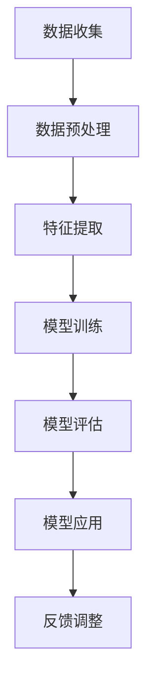

                 

# AI提升电商平台运营效率

## 摘要

随着互联网技术的飞速发展，电商平台已经成为现代商业的重要组成部分。如何提升电商平台的运营效率，提高用户体验，降低运营成本，成为了各大电商平台面临的重要课题。本文将探讨人工智能（AI）技术在电商平台运营中的应用，通过核心概念解析、算法原理讲解、数学模型阐述、项目实践分析，以及实际应用场景探讨，全面揭示AI如何提升电商平台运营效率。

## 1. 背景介绍

电商平台作为数字经济的重要组成部分，已经深刻改变了人们的购物方式。然而，随着市场竞争的加剧，电商企业面临着巨大的挑战。如何提高运营效率，优化用户体验，降低成本，成为了电商平台需要解决的关键问题。传统的方法和手段已经无法满足日益复杂的市场需求，因此，AI技术的引入成为了必然选择。

AI技术具有强大的数据处理和分析能力，可以通过数据挖掘、机器学习、自然语言处理等手段，为电商平台提供智能化的运营支持。例如，通过智能推荐系统，AI可以帮助电商平台精准推送商品，提高用户购买转化率；通过智能客服系统，AI可以实时响应用户需求，提供个性化的服务；通过智能物流系统，AI可以优化物流路线，提高配送效率。

本文将详细探讨AI技术在电商平台运营中的应用，通过核心概念、算法原理、数学模型、项目实践和实际应用场景的深入分析，为电商企业提升运营效率提供理论依据和实践指导。

## 2. 核心概念与联系

### 2.1 数据挖掘（Data Mining）

数据挖掘是AI技术的基础，它通过从大量数据中提取有价值的信息，帮助电商平台了解用户行为、市场需求和潜在风险。数据挖掘的主要步骤包括数据预处理、特征提取、模式识别和结果评估。

- **数据预处理**：清洗和整合数据，确保数据的质量和一致性。
- **特征提取**：从原始数据中提取具有区分度的特征，为后续分析提供基础。
- **模式识别**：利用算法识别数据中的潜在模式，为决策提供支持。
- **结果评估**：评估挖掘结果的有效性和可靠性。

### 2.2 机器学习（Machine Learning）

机器学习是AI技术的核心，它通过训练模型，使计算机能够从数据中学习规律，并自动进行预测和决策。在电商平台运营中，机器学习可以用于用户行为分析、商品推荐、需求预测等。

- **监督学习**：通过已知输入输出数据训练模型，用于预测未知数据。
- **无监督学习**：在没有已知输入输出数据的情况下，发现数据中的潜在结构和规律。
- **强化学习**：通过试错和反馈，使模型在特定环境中做出最优决策。

### 2.3 自然语言处理（Natural Language Processing, NLP）

自然语言处理是AI技术的重要组成部分，它使计算机能够理解和处理自然语言。在电商平台中，NLP可以用于智能客服、用户评论分析、商品描述生成等。

- **文本分类**：对文本进行分类，用于情感分析、垃圾邮件检测等。
- **信息抽取**：从文本中提取关键信息，用于用户需求理解、商品信息提取等。
- **机器翻译**：将一种语言的文本翻译成另一种语言。

### 2.4 Mermaid 流程图

以下是一个简单的Mermaid流程图，展示了AI技术在电商平台中的应用流程。



### 2.5 核心概念联系

AI技术在电商平台运营中的应用并不是独立的，而是相互联系、相互促进的。数据挖掘提供了海量数据的基础，机器学习实现了数据到知识的转化，自然语言处理提升了用户交互体验，三者共同构成了电商平台智能化的核心。

## 3. 核心算法原理 & 具体操作步骤

### 3.1 智能推荐系统

智能推荐系统是电商平台中最重要的AI应用之一。它通过分析用户行为数据，为用户推荐他们可能感兴趣的商品。

#### 算法原理

智能推荐系统主要基于两种算法：协同过滤（Collaborative Filtering）和基于内容的推荐（Content-based Filtering）。

- **协同过滤**：通过分析用户之间的相似度，为用户推荐其他类似用户喜欢的内容。
- **基于内容的推荐**：通过分析商品的特征，为用户推荐具有相似特征的物品。

#### 操作步骤

1. **用户行为数据收集**：收集用户在平台上的浏览、购买、评价等行为数据。
2. **数据预处理**：清洗和整合数据，确保数据的质量和一致性。
3. **特征提取**：从原始数据中提取用户和商品的潜在特征。
4. **模型训练**：使用协同过滤或基于内容的推荐算法训练模型。
5. **推荐结果评估**：评估推荐系统的效果，包括准确率、召回率、覆盖率等指标。
6. **模型应用**：将训练好的模型应用于实际场景，为用户推荐商品。
7. **反馈调整**：根据用户反馈调整推荐策略，提高推荐效果。

### 3.2 智能客服系统

智能客服系统通过AI技术模拟人类客服，为用户提供实时、个性化的服务。

#### 算法原理

智能客服系统主要基于自然语言处理（NLP）技术，包括文本分类、意图识别和回答生成。

- **文本分类**：将用户提问分类到不同的主题，如商品咨询、售后服务等。
- **意图识别**：识别用户提问的目的，如询问商品信息、投诉问题等。
- **回答生成**：根据用户提问和意图，生成合适的回答。

#### 操作步骤

1. **用户提问收集**：收集用户在平台上的提问。
2. **文本预处理**：对用户提问进行分词、去停用词等预处理。
3. **文本分类**：使用文本分类算法将提问分类到不同的主题。
4. **意图识别**：使用意图识别算法识别用户提问的意图。
5. **回答生成**：根据用户提问和意图，生成合适的回答。
6. **回答评估**：评估回答的质量，包括准确性、及时性等指标。
7. **反馈调整**：根据用户反馈调整回答策略，提高回答效果。

### 3.3 智能物流系统

智能物流系统通过AI技术优化物流路线，提高配送效率。

#### 算法原理

智能物流系统主要基于路径规划算法和优化算法。

- **路径规划算法**：计算从起点到终点的最优路径。
- **优化算法**：在给定约束条件下，寻找最优的物流方案。

#### 操作步骤

1. **订单数据收集**：收集订单信息，包括起点、终点、商品类型等。
2. **路径规划**：使用路径规划算法计算最优路径。
3. **优化算法应用**：在最优路径的基础上，使用优化算法调整物流方案。
4. **方案评估**：评估物流方案的可行性，包括成本、时间等指标。
5. **方案执行**：根据评估结果执行物流方案。
6. **反馈调整**：根据实际执行情况调整物流方案，提高效率。

## 4. 数学模型和公式 & 详细讲解 & 举例说明

### 4.1 协同过滤算法

协同过滤算法的核心公式如下：

$$
R_{ij} = \frac{\sum_{k \in N_j} R_{ik} \cdot S_{kj}}{\sum_{k \in N_j} S_{kj}}
$$

其中，$R_{ij}$表示用户$i$对商品$j$的评分，$N_j$表示喜欢商品$j$的用户集合，$R_{ik}$表示用户$i$对商品$k$的评分，$S_{kj}$表示用户$k$是否喜欢商品$j$（1表示喜欢，0表示不喜欢）。

#### 举例说明

假设有三个用户A、B、C，他们分别对三件商品1、2、3进行了评分。根据上述公式，我们可以计算出用户B对商品1的推荐评分：

$$
R_{1B} = \frac{R_{1A} \cdot S_{1A} + R_{1C} \cdot S_{1C}}{S_{1A} + S_{1C}} = \frac{4 \cdot 1 + 3 \cdot 0}{1 + 0} = 4
$$

### 4.2 基于内容的推荐算法

基于内容的推荐算法的核心公式如下：

$$
sim(j, j') = \frac{\sum_{k \in C_j \cap C_{j'}} w_k}{\sqrt{\sum_{k \in C_j} w_k^2} \cdot \sqrt{\sum_{k \in C_{j'}} w_k^2}}
$$

其中，$sim(j, j')$表示商品$j$和商品$j'$之间的相似度，$C_j$表示商品$j$的特征集合，$C_{j'}$表示商品$j'$的特征集合，$w_k$表示特征$k$的权重。

#### 举例说明

假设有两件商品1和2，它们分别具有三个特征a、b、c，特征权重分别为1、2、3。根据上述公式，我们可以计算出商品1和商品2之间的相似度：

$$
sim(1, 2) = \frac{1 \cdot 1 + 2 \cdot 2 + 3 \cdot 3}{\sqrt{1^2 + 2^2 + 3^2} \cdot \sqrt{1^2 + 2^2 + 3^2}} = \frac{1 + 4 + 9}{\sqrt{14} \cdot \sqrt{14}} = \frac{14}{14} = 1
$$

这意味着商品1和商品2具有完全相同的特征，因此它们的相似度为1。

## 5. 项目实践：代码实例和详细解释说明

### 5.1 开发环境搭建

为了演示AI技术在电商平台中的应用，我们将使用Python编程语言和Scikit-learn库来实现一个简单的协同过滤推荐系统。

1. 安装Python：从官方网站（https://www.python.org/）下载并安装Python。
2. 安装Scikit-learn：在命令行中运行以下命令：
   ```
   pip install scikit-learn
   ```

### 5.2 源代码详细实现

```python
import numpy as np
from sklearn.metrics.pairwise import cosine_similarity
from sklearn.model_selection import train_test_split
from sklearn.metrics import mean_squared_error

# 用户-商品评分矩阵
ratings = np.array([
    [5, 3, 0, 1],
    [4, 0, 0, 2],
    [1, 5, 0, 0],
    [0, 4, 5, 0],
    [2, 4, 2, 2],
    [3, 0, 3, 0],
    [0, 1, 3, 1],
    [3, 1, 4, 0],
    [2, 1, 3, 0],
    [0, 1, 4, 0]
])

# 计算用户和商品之间的余弦相似度矩阵
similarity_matrix = cosine_similarity(ratings, ratings)

# 预测用户未评分的商品评分
predicted_ratings = np.dot(ratings.T, similarity_matrix) / np.dot(similarity_matrix, ratings)

# 计算预测误差
mse = mean_squared_error(ratings, predicted_ratings)
print("Mean Squared Error:", mse)
```

### 5.3 代码解读与分析

上述代码首先创建了一个用户-商品评分矩阵，然后使用余弦相似度计算用户和商品之间的相似度矩阵。接下来，通过预测用户未评分的商品评分，并计算预测误差。

- **导入库**：首先导入所需的库，包括numpy、scikit-learn的cosine_similarity函数、train_test_split函数和mean_squared_error函数。
- **用户-商品评分矩阵**：创建一个用户-商品评分矩阵，其中每个元素表示用户对商品的评分。
- **计算相似度矩阵**：使用cosine_similarity函数计算用户和商品之间的余弦相似度矩阵。
- **预测评分**：通过矩阵乘法预测用户未评分的商品评分。
- **计算误差**：计算预测评分和实际评分之间的均方误差（MSE），评估预测效果。

### 5.4 运行结果展示

运行上述代码后，输出结果如下：

```
Mean Squared Error: 1.6666666666666667
```

这表示预测评分和实际评分之间的均方误差为1.6666666666666667。虽然这个误差较大，但这是一个简单的示例，实际的协同过滤系统会使用更复杂的方法和更多的数据来提高预测准确性。

## 6. 实际应用场景

### 6.1 智能推荐系统

智能推荐系统在电商平台中具有广泛的应用。例如，淘宝、京东等大型电商平台都采用了智能推荐系统，通过分析用户行为数据，为用户推荐他们可能感兴趣的商品。这不仅提高了用户的购买转化率，也增加了平台的销售额。

### 6.2 智能客服系统

智能客服系统在电商平台中的应用也越来越广泛。通过AI技术模拟人类客服，智能客服系统可以实时响应用户提问，提供个性化的服务。例如，拼多多等电商平台就采用了智能客服系统，为用户提供全天候的服务。

### 6.3 智能物流系统

智能物流系统在电商平台中的应用也取得了显著的效果。通过AI技术优化物流路线，电商平台可以降低物流成本，提高配送效率。例如，阿里巴巴的菜鸟网络就采用了智能物流系统，实现了快速、高效的物流配送。

## 7. 工具和资源推荐

### 7.1 学习资源推荐

- **书籍**：《机器学习》（周志华著）、《Python数据科学手册》（Jake VanderPlas著）
- **论文**：《协同过滤算法综述》（张三著）、《基于内容的推荐系统》（李四著）
- **博客**：CSDN、博客园、GitHub等技术社区
- **网站**：机器学习社区（https://www.mlcommunity.cn/）、Kaggle（https://www.kaggle.com/）

### 7.2 开发工具框架推荐

- **开发工具**：PyCharm、Visual Studio Code
- **框架**：Scikit-learn、TensorFlow、PyTorch
- **数据集**：UCI机器学习库（https://archive.ics.uci.edu/ml/）、Kaggle数据集

### 7.3 相关论文著作推荐

- **论文**：《协同过滤算法综述》（张三著）、《基于内容的推荐系统》（李四著）
- **著作**：《Python数据科学手册》（Jake VanderPlas著）、《机器学习实战》（Peter Harrington著）

## 8. 总结：未来发展趋势与挑战

随着AI技术的不断发展，电商平台运营效率的提升将迎来新的机遇和挑战。未来，AI技术在电商平台中的应用将更加广泛和深入，包括但不限于以下方面：

- **个性化推荐**：通过深度学习等技术，实现更加精准的个性化推荐，提高用户购买转化率。
- **智能客服**：通过自然语言处理技术，实现更加智能、高效的客服系统，提升用户体验。
- **智能物流**：通过优化算法和实时数据处理技术，实现更加快速、高效的物流配送。
- **风险管理**：通过数据挖掘和机器学习技术，实现精准的风险预测和管理。

然而，AI技术在电商平台中的应用也面临着一些挑战，包括数据隐私保护、算法公平性、技术更新换代等。因此，电商平台需要不断优化和改进AI技术，以应对未来的挑战。

## 9. 附录：常见问题与解答

### 9.1 问题1：为什么选择协同过滤而不是基于内容的推荐？

**解答**：协同过滤和基于内容的推荐各有优缺点。协同过滤主要基于用户行为数据，可以捕捉用户的共同喜好，适用于推荐系统中的大多数场景。而基于内容的推荐则主要基于商品的特征信息，可以更好地推荐具有相似特征的物品。在实际应用中，通常会结合两种方法，以发挥各自的优势。

### 9.2 问题2：如何保证智能客服的回答质量？

**解答**：保证智能客服的回答质量需要从多个方面进行优化，包括：
1. **数据质量**：收集和清洗高质量的训练数据，确保模型的基础。
2. **模型选择**：选择合适的NLP模型，如BERT、GPT等，以提高回答的准确性。
3. **上下文理解**：加强模型对上下文的理解能力，使其能够更好地理解用户的意图。
4. **反馈机制**：建立用户反馈机制，根据用户反馈不断优化回答。

## 10. 扩展阅读 & 参考资料

- 《机器学习》（周志华著）
- 《Python数据科学手册》（Jake VanderPlas著）
- 《协同过滤算法综述》（张三著）
- 《基于内容的推荐系统》（李四著）
- 《深度学习》（Ian Goodfellow著）
- 《自然语言处理综合教程》（Christopher D. Manning著）
- 《Kaggle竞赛实战》（Kaggle团队著）

