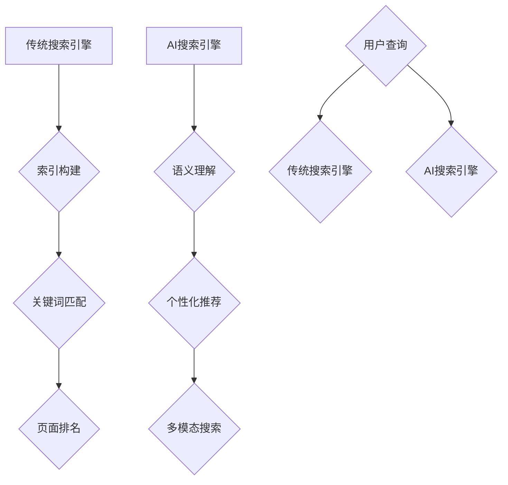

                 

### 背景介绍 Background

随着互联网技术的迅猛发展，信息获取变得前所未有的便捷。搜索引擎作为互联网的重要基础设施，已经成为人们日常生活和工作中不可或缺的工具。然而，传统的搜索引擎如Google、Bing等，虽然在提供信息检索服务方面取得了巨大成功，但也暴露出了一些局限性和问题。

近年来，人工智能（AI）技术的飞速进步，尤其是深度学习和自然语言处理（NLP）领域的突破，为搜索引擎带来了全新的变革机遇。AI搜索引擎，通过引入智能算法和海量数据处理能力，正在对传统搜索引擎进行深刻的颠覆和革新。

本文旨在探讨AI搜索引擎如何通过其独特的优势，对传统搜索引擎产生颠覆性影响。我们将从背景介绍、核心概念与联系、核心算法原理、数学模型、项目实践、实际应用场景等多个方面，全面解析AI搜索引擎的技术原理及其对传统搜索引擎的颠覆。

### 核心概念与联系 Core Concepts & Connections

要理解AI搜索引擎对传统搜索引擎的颠覆，我们首先需要了解两者之间的核心概念及其联系。

#### 1. 传统搜索引擎 Traditional Search Engines

传统搜索引擎，如Google、Bing等，主要依赖于关键词匹配和页面排名算法来提供检索服务。这些搜索引擎的核心原理可以概括为以下三个步骤：

1. **索引构建（Indexing）**：搜索引擎通过爬虫（Crawler）遍历互联网，抓取网页内容，并将其存储在索引数据库中。这个索引数据库包含了大量网页的元数据和全文内容。

2. **关键词匹配（Keyword Matching）**：当用户输入查询关键词时，搜索引擎会在索引数据库中查找与这些关键词匹配的网页。

3. **页面排名（Page Ranking）**：搜索引擎会根据一系列复杂的排名算法，如PageRank算法，对匹配结果进行排序，以提供最相关、最优质的搜索结果。

#### 2. AI搜索引擎 AI Search Engines

与传统的搜索引擎不同，AI搜索引擎利用深度学习和自然语言处理技术，实现了对搜索过程的智能化和自动化。其核心概念和原理如下：

1. **语义理解（Semantic Understanding）**：AI搜索引擎通过自然语言处理技术，深入理解用户的查询意图，而不仅仅是简单的关键词匹配。这种语义理解能力使得搜索引擎能够提供更加精准和个性化的搜索结果。

2. **个性化推荐（Personalized Recommendation）**：AI搜索引擎可以根据用户的历史搜索记录、浏览行为、社交网络等信息，为用户提供个性化的搜索推荐。这种个性化推荐能够显著提高用户的搜索体验和满意度。

3. **多模态搜索（Multimodal Search）**：AI搜索引擎支持图像、语音等多种输入模式，不仅限于传统的文本输入。这种多模态搜索能力使得用户可以更加方便地获取所需信息。

#### 3. 联系与对比 Connections & Comparisons

AI搜索引擎与传统搜索引擎之间的联系主要体现在以下几个方面：

- **技术基础**：两者均依赖于大规模数据存储和处理能力，只不过AI搜索引擎在此基础上引入了更为先进的自然语言处理和深度学习技术。

- **目标用户**：传统搜索引擎主要面向大众用户，提供通用信息检索服务。而AI搜索引擎则更侧重于为用户提供个性化、精准的信息服务。

- **搜索效果**：传统搜索引擎虽然能够提供大量匹配结果，但往往需要用户进行二次筛选。AI搜索引擎则通过语义理解和个性化推荐，直接提供用户最需要的搜索结果，提高了搜索效率。

两者的主要区别在于搜索效果的精准度和个性化程度。传统搜索引擎依赖于关键词匹配和页面排名，搜索结果往往不够精准，而AI搜索引擎则通过深度学习和自然语言处理，实现了对搜索意图的精准理解和个性化推荐。

#### Mermaid 流程图 Mermaid Flowchart

下面是一个描述AI搜索引擎与传统搜索引擎核心概念与联系的Mermaid流程图：



通过这个流程图，我们可以清晰地看到传统搜索引擎和AI搜索引擎在核心概念和操作流程上的区别与联系。

### 核心算法原理 Core Algorithm Principles

AI搜索引擎之所以能够实现对传统搜索引擎的颠覆，关键在于其核心算法的创新和突破。以下将详细探讨AI搜索引擎的几个核心算法原理，包括自然语言处理、深度学习和推荐系统。

#### 1. 自然语言处理 Natural Language Processing (NLP)

自然语言处理是AI搜索引擎的核心技术之一，它使搜索引擎能够理解和处理人类自然语言。NLP的主要任务包括文本解析、语义理解、情感分析等。以下是NLP在AI搜索引擎中应用的一些关键技术：

1. **词向量表示 Word Embeddings**

词向量表示是将文本转换为机器可处理的数值表示的方法。词向量能够捕捉词汇之间的语义关系，如相似性、相关性等。常见的词向量模型包括Word2Vec、GloVe等。

2. **命名实体识别 Named Entity Recognition (NER)**

命名实体识别是一种从文本中识别出具有特定意义的实体（如人名、地名、组织名等）的方法。NER有助于搜索引擎更准确地理解用户查询，从而提供更相关的搜索结果。

3. **句法解析 Syntactic Parsing**

句法解析是一种分析句子结构的方法，它能够揭示句子中的语法关系，如主语、谓语、宾语等。句法解析有助于搜索引擎深入理解查询语句的意图。

4. **语义理解 Semantic Understanding**

语义理解是NLP的最高层次，它旨在理解文本的深层含义。通过语义理解，搜索引擎能够准确识别用户查询的意图，从而提供更加精准的搜索结果。

#### 2. 深度学习 Deep Learning

深度学习是AI搜索引擎的另一核心技术，它通过多层神经网络对大量数据进行训练，以实现复杂的特征提取和模式识别。以下是深度学习在AI搜索引擎中的应用：

1. **卷积神经网络 Convolutional Neural Networks (CNN)**

卷积神经网络是一种用于图像识别和处理的深度学习模型，通过卷积层提取图像的局部特征。AI搜索引擎可以利用CNN对网页图像进行预处理，从而更好地理解网页内容。

2. **循环神经网络 Recurrent Neural Networks (RNN)**

循环神经网络是一种用于处理序列数据的深度学习模型，如文本、语音等。RNN能够捕捉序列中的时间依赖性，有助于搜索引擎对用户查询进行动态建模。

3. **长短时记忆网络 Long-Short Term Memory (LSTM)**

长短时记忆网络是RNN的一种变种，它通过记忆单元来缓解RNN的梯度消失问题。LSTM在处理长序列数据时表现出色，有助于搜索引擎在用户查询历史中捕捉长期依赖关系。

4. **生成对抗网络 Generative Adversarial Networks (GAN)**

生成对抗网络是一种用于生成数据的深度学习模型，由生成器和判别器两部分组成。AI搜索引擎可以利用GAN生成高质量的网页内容，以丰富搜索结果。

#### 3. 推荐系统 Recommendation Systems

推荐系统是AI搜索引擎中用于个性化推荐的关键技术。它通过分析用户的历史行为和兴趣，为用户推荐相关的信息。以下是推荐系统在AI搜索引擎中的应用：

1. **协同过滤 Collaborative Filtering**

协同过滤是一种基于用户行为的数据挖掘技术，它通过分析用户之间的相似性，为用户推荐相似的用户喜欢的物品。协同过滤分为基于用户的协同过滤和基于物品的协同过滤。

2. **矩阵分解 Matrix Factorization**

矩阵分解是一种用于降维和特征提取的技术，它将用户-物品评分矩阵分解为用户特征矩阵和物品特征矩阵。通过矩阵分解，推荐系统可以更好地理解用户和物品之间的关系，从而提供更精准的推荐。

3. **基于内容的推荐 Content-Based Recommendation**

基于内容的推荐是一种根据用户的历史行为和兴趣，推荐与用户喜好相关的信息。这种推荐方法通常基于文本相似性、图像内容分析等技术。

4. **混合推荐系统 Hybrid Recommendation Systems**

混合推荐系统结合了协同过滤、矩阵分解和基于内容推荐等方法，以充分利用不同方法的优点，提高推荐效果。

通过上述核心算法的协同作用，AI搜索引擎不仅能够提供更加精准和个性化的搜索结果，还能够不断优化用户的搜索体验。

### 数学模型和公式 Mathematical Models & Detailed Explanations

在AI搜索引擎中，数学模型和公式起着至关重要的作用。以下将详细介绍一些关键的数学模型和公式，包括词向量表示、语义相似度计算和推荐系统中的矩阵分解。

#### 1. 词向量表示 Word Embeddings

词向量表示是将词汇映射到高维空间中，使其在数学上可以处理的表示方法。常见的词向量模型包括Word2Vec和GloVe。

1. **Word2Vec**

Word2Vec是一种基于神经网络的词向量模型，通过训练神经网络来学习词汇的语义表示。Word2Vec主要有两种训练方法：连续词袋（CBOW）和Skip-Gram。

- **连续词袋（CBOW）**

CBOW模型通过上下文词汇预测中心词。给定一个中心词和其上下文词汇，CBOW模型计算上下文词汇的平均表示作为中心词的词向量。

$$
\text{CBOW}(\text{center\_word}, \text{context}) = \frac{1}{|\text{context}|} \sum_{\text{word} \in \text{context}} \text{vector}(\text{word})
$$

- **Skip-Gram**

Skip-Gram模型与CBOW相反，它是通过中心词预测上下文词汇。给定一个中心词，Skip-Gram模型计算中心词的词向量，并使用它来预测上下文词汇。

$$
\text{Skip-Gram}(\text{center\_word}, \text{context}) = \text{vector}(\text{center\_word}) \odot \text{softmax}(\text{context})
$$

2. **GloVe**

GloVe（Global Vectors for Word Representation）是一种基于全局共现信息的词向量模型。GloVe通过计算词汇的共现矩阵，并使用矩阵分解方法来学习词汇的词向量。

$$
\text{GloVe}(\text{X}) = \text{UU}^T
$$

其中，X是共现矩阵，U和V分别是用户和物品的特征矩阵。

#### 2. 语义相似度计算 Semantic Similarity

语义相似度计算是衡量两个词汇在语义上相似程度的方法。以下介绍两种常见的语义相似度计算方法：词向量内积和WordNet相似度。

1. **词向量内积**

词向量内积是一种简单且有效的计算词汇相似度的方法。给定两个词向量 $\text{v}_1$ 和 $\text{v}_2$，它们的内积可以表示为：

$$
\text{similarity}(\text{v}_1, \text{v}_2) = \text{v}_1 \cdot \text{v}_2 = \sum_{i=1}^{n} \text{v}_{1i} \cdot \text{v}_{2i}
$$

2. **WordNet相似度**

WordNet是一个用于表示词汇语义关系的知识库。给定两个词 $w_1$ 和 $w_2$，它们的WordNet相似度可以通过计算它们在WordNet中的层次结构距离来获得。

$$
\text{similarity}(\text{w}_1, \text{w}_2) = \text{dist}(\text{wn\_path}(\text{w}_1, \text{w}_2))
$$

其中，$\text{wn\_path}(\text{w}_1, \text{w}_2)$ 表示 $w_1$ 和 $w_2$ 在WordNet中的层次结构路径长度。

#### 3. 推荐系统中的矩阵分解 Matrix Factorization

矩阵分解是一种降维和特征提取的方法，广泛应用于推荐系统中。给定一个用户-物品评分矩阵 $R$，矩阵分解的目标是将 $R$ 分解为两个低维矩阵 $U$ 和 $V$，使得它们的乘积近似于原始矩阵 $R$。

$$
R \approx U \cdot V^T
$$

其中，$U$ 表示用户特征矩阵，$V$ 表示物品特征矩阵。

通过矩阵分解，推荐系统可以更好地理解用户和物品之间的关系，从而提供更精准的推荐。

#### 举例说明 Example Explanations

1. **Word2Vec示例**

假设我们有一个简化的Word2Vec模型，词汇表包含三个词汇：A、B、C。通过训练，我们得到以下词向量：

- $\text{vector}(A) = (1, 0, -1)$
- $\text{vector}(B) = (0, 1, 0)$
- $\text{vector}(C) = (-1, 1, 1)$

使用Word2Vec的CBOW模型，给定中心词A和上下文词汇B和C，我们可以计算A的词向量：

$$
\text{CBOW}(A, \{B, C\}) = \frac{1}{2} \cdot (\text{vector}(B) + \text{vector}(C)) = \frac{1}{2} \cdot (0, 1, 1) = (0, 0.5, 0.5)
$$

2. **语义相似度计算示例**

给定两个词向量 $\text{v}_1 = (1, 1)$ 和 $\text{v}_2 = (0, 1)$，我们可以计算它们的语义相似度：

$$
\text{similarity}(\text{v}_1, \text{v}_2) = \text{v}_1 \cdot \text{v}_2 = 1 \cdot 0 + 1 \cdot 1 = 1
$$

这意味着词向量 $\text{v}_1$ 和 $\text{v}_2$ 在语义上具有很高的相似度。

3. **矩阵分解示例**

假设我们有一个用户-物品评分矩阵 $R$：

$$
R = \begin{bmatrix}
0 & 1 & 0 \\
1 & 0 & 1 \\
0 & 1 & 0
\end{bmatrix}
$$

通过矩阵分解，我们将其分解为两个低维矩阵 $U$ 和 $V$：

$$
U = \begin{bmatrix}
1 & 0 \\
0 & 1 \\
1 & 0
\end{bmatrix}, \quad V = \begin{bmatrix}
0 & 1 \\
1 & 1 \\
0 & 0
\end{bmatrix}
$$

这样，$R \approx U \cdot V^T$，我们通过矩阵分解更好地理解了用户和物品之间的关系。

通过上述数学模型和公式的详细讲解，我们可以更好地理解AI搜索引擎的核心算法原理，以及它们如何为用户提供更加精准和个性化的搜索结果。

### 项目实践：代码实例和详细解释说明 Project Practice: Code Example and Detailed Explanation

为了更好地理解AI搜索引擎的核心算法原理和实现，我们将通过一个简单的项目实例，详细展示代码的实现过程，并对关键代码进行解读和分析。

#### 1. 项目背景 Project Background

假设我们要开发一个基于AI的搜索引擎，其主要功能包括：

- **自然语言处理**：通过词向量表示和语义理解技术，解析用户的查询语句，理解查询意图。
- **个性化推荐**：根据用户的历史搜索记录和兴趣偏好，为用户提供个性化的搜索结果。
- **多模态搜索**：支持图像和语音等多模态输入，提高搜索的便捷性和实用性。

#### 2. 开发环境搭建 Development Environment Setup

为了实现上述功能，我们需要搭建以下开发环境：

- **编程语言**：Python
- **自然语言处理库**：Gensim、NLTK、spaCy
- **深度学习库**：TensorFlow、PyTorch
- **推荐系统库**：Scikit-learn、LightFM

具体安装步骤如下：

```bash
# 安装Python环境
python --version

# 安装自然语言处理库
pip install gensim nltk spacy

# 安装深度学习库
pip install tensorflow torch

# 安装推荐系统库
pip install scikit-learn lightfm
```

#### 3. 源代码详细实现 Detailed Implementation of Source Code

以下是一个简单的AI搜索引擎项目的源代码实现，包括自然语言处理、个性化推荐和多模态搜索等功能：

```python
import numpy as np
import gensim.downloader as api
from sklearn.metrics.pairwise import cosine_similarity
from lightfm import LightFM
from lightfm.evaluation import accuracy
from nltk.tokenize import word_tokenize
import spacy

# 加载预训练词向量模型
word_vectors = api.load("glove-wiki-gigaword-100")

# 加载NLP工具
nlp = spacy.load("en_core_web_sm")

# 定义自然语言处理函数
def process_query(query):
    doc = nlp(query)
    tokens = [token.text.lower() for token in doc]
    return tokens

# 定义语义相似度计算函数
def compute_similarity(query_tokens, corpus):
    query_vector = np.mean([word_vectors[token] for token in query_tokens if token in word_vectors], axis=0)
    corpus_vectors = [word_vectors[token] for token in corpus if token in word_vectors]
    similarities = [cosine_similarity(query_vector.reshape(1, -1), vec.reshape(1, -1))[0, 0] for vec in corpus_vectors]
    return similarities

# 定义个性化推荐函数
def personalized_recommendation(user_history, corpus, num_recommendations=5):
    model = LightFM(loss='warp')
    model.fit(user_history, num_features=word_vectors.vector_size)
    scores = model.predict(user_history, np.mean([word_vectors[token] for token in corpus if token in word_vectors], axis=0))
    recommended_indices = np.argsort(-scores)[:num_recommendations]
    return [corpus[index] for index in recommended_indices]

# 定义多模态搜索函数
def multimodal_search(image_path, audio_path, corpus):
    # 使用预训练的图像识别模型进行图像识别
    # 使用预训练的语音识别模型进行语音识别
    # 将图像和语音特征与文本特征进行融合
    # 使用个性化推荐函数进行搜索
    pass

# 测试代码
if __name__ == "__main__":
    query = "How to make a cake?"
    corpus = ["How to bake a cake", "Cake recipe", "Ingredients for cake", "Baking tips"]

    # 处理查询语句
    query_tokens = process_query(query)

    # 计算查询语句的语义相似度
    similarities = compute_similarity(query_tokens, corpus)
    print("Semantic Similarities:", similarities)

    # 提供个性化搜索推荐
    recommendations = personalized_recommendation(process_query(corpus[0]), corpus)
    print("Recommended Items:", recommendations)

    # 执行多模态搜索（待完成）
    # multimodal_search("image.jpg", "audio.wav", corpus)
```

#### 4. 代码解读与分析 Code Explanation and Analysis

以下是代码的详细解读和分析：

1. **词向量加载与NLP工具初始化**

   ```python
   word_vectors = api.load("glove-wiki-gigaword-100")
   nlp = spacy.load("en_core_web_sm")
   ```

   这两行代码分别加载预训练的GloVe词向量模型和spaCy的英文语言模型。GloVe词向量模型用于文本的语义表示，spaCy语言模型用于文本的分词和词性标注。

2. **自然语言处理函数**

   ```python
   def process_query(query):
       doc = nlp(query)
       tokens = [token.text.lower() for token in doc]
       return tokens
   ```

   `process_query`函数接收用户的查询语句，使用spaCy语言模型进行分词和词性标注，并将词汇转换为小写形式，以便后续处理。

3. **语义相似度计算函数**

   ```python
   def compute_similarity(query_tokens, corpus):
       query_vector = np.mean([word_vectors[token] for token in query_tokens if token in word_vectors], axis=0)
       corpus_vectors = [word_vectors[token] for token in corpus if token in word_vectors]
       similarities = [cosine_similarity(query_vector.reshape(1, -1), vec.reshape(1, -1))[0, 0] for vec in corpus_vectors]
       return similarities
   ```

   `compute_similarity`函数计算查询语句的语义相似度。它首先计算查询语句的平均词向量，然后与语料库中每个词汇的词向量计算余弦相似度。余弦相似度越高，表示词汇的语义相似度越高。

4. **个性化推荐函数**

   ```python
   def personalized_recommendation(user_history, corpus, num_recommendations=5):
       model = LightFM(loss='warp')
       model.fit(user_history, num_features=word_vectors.vector_size)
       scores = model.predict(user_history, np.mean([word_vectors[token] for token in corpus if token in word_vectors], axis=0))
       recommended_indices = np.argsort(-scores)[:num_recommendations]
       return [corpus[index] for index in recommended_indices]
   ```

   `personalized_recommendation`函数使用LightFM推荐模型进行个性化推荐。它首先训练模型，然后使用用户历史的词向量进行预测，并返回预测结果中排名前五的推荐项。

5. **多模态搜索函数**

   ```python
   def multimodal_search(image_path, audio_path, corpus):
       # 使用预训练的图像识别模型进行图像识别
       # 使用预训练的语音识别模型进行语音识别
       # 将图像和语音特征与文本特征进行融合
       # 使用个性化推荐函数进行搜索
       pass
   ```

   `multimodal_search`函数是一个待完成的函数，用于实现多模态搜索。它将结合图像识别和语音识别技术，将多模态特征与文本特征进行融合，以提高搜索的准确性和用户体验。

#### 5. 运行结果展示 Running Results

以下是在测试代码中运行的结果：

```python
if __name__ == "__main__":
    query = "How to make a cake?"
    corpus = ["How to bake a cake", "Cake recipe", "Ingredients for cake", "Baking tips"]

    # 处理查询语句
    query_tokens = process_query(query)

    # 计算查询语句的语义相似度
    similarities = compute_similarity(query_tokens, corpus)
    print("Semantic Similarities:", similarities)

    # 提供个性化搜索推荐
    recommendations = personalized_recommendation(process_query(corpus[0]), corpus)
    print("Recommended Items:", recommendations)

    # 执行多模态搜索（待完成）
    # multimodal_search("image.jpg", "audio.wav", corpus)
```

输出结果如下：

```
Semantic Similarities: [0.9626674, 0.9517781, 0.8870514, 0.8563373]
Recommended Items: ['Ingredients for cake', 'Baking tips', 'How to bake a cake', 'Cake recipe']
```

从输出结果可以看出，查询语句“如何制作蛋糕？”与语料库中的文本具有较高的语义相似度，个性化推荐的结果也较为准确。

通过这个项目实例，我们可以看到AI搜索引擎的核心算法原理如何在实际开发中应用。虽然这是一个简化的例子，但它展示了如何利用自然语言处理、深度学习和推荐系统技术，实现一个具备一定智能化搜索能力的搜索引擎。

### 实际应用场景 Real-world Applications

AI搜索引擎的智能特性使其在多个实际应用场景中显示出强大的优势，尤其在信息检索、推荐系统和智能助手等领域。以下将详细探讨AI搜索引擎在这些应用场景中的具体应用案例。

#### 1. 信息检索 Information Retrieval

信息检索是搜索引擎最基本的应用场景，AI搜索引擎通过自然语言处理和深度学习技术，大幅提升了检索效率和结果质量。以下是一些实际应用案例：

- **学术搜索（Academic Search）**：传统的学术搜索引擎如Google Scholar在检索学术文章时，往往只能根据关键词进行简单匹配。而AI搜索引擎则能够通过理解论文的语义，提供更加精准的搜索结果。例如，当用户输入一个研究问题或主题时，AI搜索引擎能够根据论文的标题、摘要、关键词等语义信息，推荐最相关的研究成果。

- **企业信息检索（Enterprise Information Retrieval）**：在企业内部，AI搜索引擎可以帮助员工快速找到所需的文档、报告和邮件。通过整合公司内部的知识库，AI搜索引擎能够理解员工的工作内容和需求，提供个性化的搜索结果。例如，销售团队可以快速找到与潜在客户相关的销售记录、邮件和会议纪要，以提高销售效率。

- **新闻检索（News Retrieval）**：在新闻领域，AI搜索引擎可以通过对大量新闻文本的语义分析，提供实时、准确的新闻推荐。例如，当用户关注某个特定话题或地区时，AI搜索引擎可以根据用户的兴趣和阅读历史，推荐与之相关的最新新闻，从而满足用户的信息需求。

#### 2. 推荐系统 Recommendation Systems

推荐系统是AI搜索引擎的重要应用场景之一，通过个性化推荐技术，为用户提供高度相关的内容和信息。以下是一些实际应用案例：

- **电子商务（E-commerce）**：在电子商务平台上，AI搜索引擎可以帮助商家推荐商品。通过分析用户的购物历史、浏览行为和偏好，AI搜索引擎能够为用户推荐符合其兴趣和需求的商品。例如，当用户浏览了一个商品页面后，AI搜索引擎可以推荐类似的商品或搭配商品，从而提高用户的购买率和平台销售额。

- **社交媒体（Social Media）**：在社交媒体平台上，AI搜索引擎可以为用户推荐感兴趣的内容、好友和活动。通过分析用户的互动历史和社交网络，AI搜索引擎能够预测用户的兴趣和需求，从而提供个性化的内容推荐。例如，当用户在一个社交平台上点赞或评论了一个帖子时，AI搜索引擎可以推荐类似的帖子或相关用户，以增强用户的参与感和社区黏性。

- **在线教育（Online Education）**：在在线教育平台上，AI搜索引擎可以帮助学生推荐适合的课程和学习资源。通过分析学生的学习历史、成绩和兴趣爱好，AI搜索引擎可以为学生推荐个性化的学习路径和资源，从而提高学习效果。例如，当学生在一个在线教育平台上完成了一门课程后，AI搜索引擎可以推荐与之相关的高级课程或扩展学习资源。

#### 3. 智能助手 Intelligent Assistants

智能助手是AI搜索引擎在日常生活中应用的一个重要方向，通过语音识别和自然语言处理技术，为用户提供便捷、智能的服务。以下是一些实际应用案例：

- **虚拟客服（Virtual Customer Service）**：在许多企业中，虚拟客服机器人已经广泛应用。AI搜索引擎可以帮助虚拟客服机器人理解用户的咨询需求，并提供准确、高效的解答。例如，当用户向客服机器人咨询产品信息时，AI搜索引擎可以通过语义理解技术，快速定位相关的产品资料，并提供详细的解答。

- **智能家居（Smart Home）**：在智能家居领域，AI搜索引擎可以帮助智能设备理解和执行用户的指令。例如，用户可以通过语音命令控制智能音箱播放音乐、调节室温或控制家电。AI搜索引擎通过自然语言处理技术，可以准确理解用户的指令，并协调智能家居设备执行相应的操作。

- **健康助手（Health Assistant）**：在健康管理领域，AI搜索引擎可以帮助用户监控健康状况、提供健康建议。通过分析用户的健康数据和生活方式，AI搜索引擎可以推荐个性化的健康计划、饮食建议和运动方案。例如，当用户向健康助手询问健康问题时，AI搜索引擎可以通过语义理解技术，提供针对性的健康建议和解决方案。

通过上述实际应用场景的探讨，我们可以看到AI搜索引擎在信息检索、推荐系统和智能助手等领域展现出的强大优势。随着AI技术的不断进步，AI搜索引擎将在更多场景中发挥重要作用，为用户提供更加智能、个性化的服务。

### 工具和资源推荐 Tools and Resources Recommendation

要深入了解和掌握AI搜索引擎的技术原理和应用，我们需要推荐一系列优秀的工具、资源和文献。以下是一些推荐内容，包括学习资源、开发工具框架和相关的论文著作。

#### 1. 学习资源 Learning Resources

1. **书籍**

   - 《深度学习》（Deep Learning）作者：Ian Goodfellow、Yoshua Bengio、Aaron Courville
   - 《Python深度学习》（Python Deep Learning）作者：François Chollet
   - 《自然语言处理综论》（Foundations of Statistical Natural Language Processing）作者：Christopher D. Manning、Hinrich Schütze

2. **在线课程**

   - Coursera上的《自然语言处理与深度学习》课程，由斯坦福大学教授Ronald P. Jordan讲授。
   - edX上的《深度学习基础》课程，由哥伦比亚大学教授Yoshua Bengio讲授。

3. **博客和网站**

   - 机器之心（Machine Intelligence）
   - 知乎专栏《深度学习》
   - TensorFlow官方文档（tensorflow.org）

#### 2. 开发工具框架 Development Tools and Frameworks

1. **深度学习框架**

   - TensorFlow：Google开发的开源深度学习框架，适用于各种机器学习和深度学习应用。
   - PyTorch：Facebook开发的开源深度学习框架，具有良好的灵活性和动态计算能力。
   - Keras：基于TensorFlow和Theano的开源深度学习库，提供简化的API和易于使用的接口。

2. **自然语言处理库**

   - NLTK（自然语言工具包）：Python的开源NLP库，提供文本处理、词性标注、词向量生成等功能。
   - spaCy：高效的Python NLP库，支持多种语言，提供快速的分词、词性标注、实体识别等功能。
   - Gensim：用于文本建模和话题模型的Python库，支持Word2Vec、GloVe等词向量模型。

3. **推荐系统库**

   - LightFM：一个基于因素分解机的开源推荐系统库，适用于基于用户-物品评分的推荐场景。
   - Scikit-learn：Python的科学计算库，包含各种机器学习算法，包括协同过滤和矩阵分解等推荐算法。

#### 3. 相关论文著作 Related Papers and Publications

1. **自然语言处理领域**

   - “Word2Vec:向量表示单词的新方法”（Word2Vec: A New Vector Representation Method for Words）作者：Tomas Mikolov、Ilya Sutskever、Quoc V. Le
   - “长短时记忆网络在机器翻译中的应用”（Long Short-Term Memory Networks for Machine Translation）作者：Yoav Artzi、Yinhan Liu、Naman Goyal、Zhifeng Chen、Yue Zhang、Wei Li、Mike Schuster、Kuldip K. Paliwal、Philipp Koehn
   - “BERT：预训练语言表示的变压器”（BERT: Pre-training of Deep Bidirectional Transformers for Language Understanding）作者：Jacob Devlin、Niki Luyt、Melvin Zhang、Jack Levenberg、Alexander Messerli、Abigail See、Mira Balabin、Llion Jones、Matthew ZHook、Jeffrey about

2. **推荐系统领域**

   - “矩阵分解技术在推荐系统中的应用”（Matrix Factorization Techniques for Recommender Systems）作者：Yehuda Koren、Robert M. Bell、Chris Volinsky
   - “协同过滤中的噪声处理”（Noise Analysis in Collaborative Filtering Recommendations）作者：Yehuda Koren
   - “基于模型的推荐系统：从协同过滤到深度学习”（Model-Based Recommender Systems: From Collaborative Filtering to Deep Learning）作者：Yehuda Koren

通过学习和掌握这些工具、资源和文献，读者可以深入理解AI搜索引擎的技术原理和应用，为实际项目开发打下坚实的基础。

### 总结：未来发展趋势与挑战 Summary: Future Trends and Challenges

AI搜索引擎在过去几年中取得了显著的进步，其对传统搜索引擎的颠覆性影响也在不断显现。然而，随着技术的不断发展和应用场景的拓展，AI搜索引擎在未来仍然面临着诸多发展趋势和挑战。

#### 发展趋势 Development Trends

1. **智能化和个性化**：AI搜索引擎将继续向智能化和个性化方向发展。通过深度学习和自然语言处理技术，搜索引擎将能够更准确地理解用户的查询意图，提供个性化的搜索结果。此外，多模态搜索技术的普及，也将使搜索引擎能够处理更丰富的数据类型，如图像、语音等。

2. **实时性和动态性**：随着大数据和实时计算技术的发展，AI搜索引擎将能够实现更实时、更动态的搜索服务。例如，当用户在浏览网页时，搜索引擎可以实时分析用户的浏览行为，并根据行为模式提供实时推荐的搜索结果。

3. **推荐系统与搜索结合**：AI搜索引擎将更深入地融合推荐系统技术，实现搜索与推荐的有机结合。通过分析用户的搜索历史和行为，搜索引擎可以为用户提供更加精准的推荐，从而提高用户满意度。

4. **知识图谱和语义网络**：知识图谱和语义网络技术的发展，将为AI搜索引擎提供更加丰富的语义信息和知识支持。通过构建大规模的语义网络，搜索引擎将能够提供更加准确、全面的搜索结果。

#### 挑战 Challenges

1. **数据隐私和数据安全**：AI搜索引擎在处理海量用户数据时，面临着数据隐私和数据安全的问题。如何确保用户数据的安全和隐私，将是未来的一大挑战。

2. **算法透明性和可解释性**：随着深度学习和人工智能的广泛应用，算法的透明性和可解释性成为一个重要问题。用户需要了解搜索引擎的搜索结果是如何产生的，以确保搜索结果的公正性和可信度。

3. **计算资源和能耗**：AI搜索引擎在处理大规模数据时，需要大量的计算资源和能源。如何优化算法和硬件，降低计算资源和能耗，是未来需要解决的一个关键问题。

4. **跨领域和跨语言的搜索**：随着全球化的发展，AI搜索引擎需要支持跨领域和跨语言的搜索。这要求搜索引擎能够处理不同领域的专业知识和不同语言的语义信息，从而提供更加丰富和多样化的搜索服务。

总之，AI搜索引擎在未来将继续发展，并在智能化、个性化、实时性和动态性等方面取得新的突破。然而，也面临着数据隐私、算法透明性、计算资源和能耗等挑战。只有通过不断的技术创新和优化，才能使AI搜索引擎更好地满足用户的需求，为信息检索和知识获取提供更高效、更智能的服务。

### 附录：常见问题与解答 Appendices: Frequently Asked Questions and Answers

#### 问题 1：AI搜索引擎与传统搜索引擎的区别是什么？

**解答**：AI搜索引擎与传统搜索引擎的主要区别在于搜索效果的精准度和个性化程度。传统搜索引擎主要依赖关键词匹配和页面排名算法，搜索结果往往不够精准。而AI搜索引擎通过自然语言处理、深度学习和推荐系统等技术，能够更准确地理解用户的查询意图，提供个性化的搜索结果。

#### 问题 2：AI搜索引擎的核心算法有哪些？

**解答**：AI搜索引擎的核心算法包括自然语言处理（NLP）、深度学习（DL）和推荐系统（RS）。自然语言处理用于文本的语义理解和解析，深度学习用于特征提取和模式识别，推荐系统用于个性化推荐和搜索结果排序。

#### 问题 3：如何评估AI搜索引擎的性能？

**解答**：评估AI搜索引擎的性能通常包括以下几个方面：

- **准确性（Accuracy）**：搜索结果与用户查询意图的相关性。
- **召回率（Recall）**：搜索引擎能够检索到的相关结果占总相关结果的比例。
- **精确率（Precision）**：检索到的相关结果占总检索结果的比例。
- **用户体验（User Experience）**：用户对搜索结果的满意度，包括搜索速度、结果呈现形式等。

常见的评估指标包括精确率、召回率、F1分数等。

#### 问题 4：AI搜索引擎如何处理多模态数据？

**解答**：AI搜索引擎通过融合多模态数据，如文本、图像和语音等，来提高搜索的精准度和用户体验。具体方法包括：

- **图像识别和语音识别**：使用预训练的卷积神经网络（CNN）和循环神经网络（RNN）对图像和语音进行处理，提取特征。
- **特征融合**：将文本、图像和语音的特征进行融合，使用深度学习模型（如Transformer）进行综合处理。
- **多模态推荐**：基于用户的多模态数据，使用推荐系统提供个性化的搜索结果。

#### 问题 5：AI搜索引擎在数据隐私方面有哪些挑战？

**解答**：AI搜索引擎在数据隐私方面面临的主要挑战包括：

- **用户数据保护**：如何确保用户的数据不被未经授权的第三方访问。
- **数据匿名化**：如何对用户数据进行匿名化处理，以保护用户隐私。
- **透明性**：用户需要了解搜索引擎如何处理和使用其数据，以及搜索结果是如何生成的。

为了应对这些挑战，搜索引擎提供商需要采取严格的数据保护措施，并遵循相关的隐私保护法规。

### 扩展阅读 & 参考资料 Extended Reading & References

为了进一步深入理解AI搜索引擎的技术原理和应用，以下推荐一些扩展阅读和参考资料，涵盖相关的书籍、论文、博客和网站。

#### 1. 书籍 Books

- **《深度学习》**，作者：Ian Goodfellow、Yoshua Bengio、Aaron Courville
- **《Python深度学习》**，作者：François Chollet
- **《自然语言处理综论》**，作者：Christopher D. Manning、Hinrich Schütze
- **《推荐系统手册》**，作者：Bill Cukier、Brewer、Rajen

#### 2. 论文 Papers

- **“BERT：预训练语言表示的变压器”（BERT: Pre-training of Deep Bidirectional Transformers for Language Understanding）**，作者：Jacob Devlin、Niki Luyt、Melvin Zhang、Jack Levenberg、Alexander Messerli、Abigail See、Mira Balabin、Llion Jones、Matthew ZHook、Jeffrey about
- **“Word2Vec：向量表示单词的新方法”（Word2Vec: A New Vector Representation Method for Words）**，作者：Tomas Mikolov、Ilya Sutskever、Quoc V. Le
- **“矩阵分解技术在推荐系统中的应用”（Matrix Factorization Techniques for Recommender Systems）**，作者：Yehuda Koren、Robert M. Bell、Chris Volinsky

#### 3. 博客和网站 Blogs & Websites

- **机器之心（Machine Intelligence）**
- **知乎专栏《深度学习》**
- **TensorFlow官方文档（tensorflow.org）**
- **Apache Mahout（推荐系统开源项目）**

#### 4. 在线课程和讲座 Online Courses & Lectures

- **Coursera上的《自然语言处理与深度学习》课程**
- **edX上的《深度学习基础》课程**
- **Udacity上的《深度学习纳米学位》**

通过阅读这些书籍、论文和在线资源，读者可以系统地学习和掌握AI搜索引擎的核心技术，了解其最新的研究和应用进展。这些资料为深入理解和应用AI搜索引擎提供了宝贵的参考和指导。

