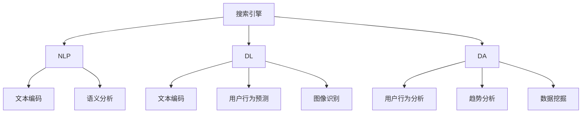

                 

### 背景介绍

随着互联网技术的飞速发展，信息爆炸式的增长使得人们越来越依赖于高效的信息检索工具。传统的搜索引擎虽然能够帮助用户快速定位信息，但往往存在结果相关性不高、用户体验不佳等问题。为了解决这些问题，AI搜索数据分析系统应运而生。本文将详细介绍AI搜索数据分析系统的概念、原理和应用案例，旨在帮助读者更好地理解和运用这一技术。

#### AI搜索数据分析系统的定义

AI搜索数据分析系统，顾名思义，是基于人工智能技术的搜索和数据分析系统。它不仅仅能实现基本的搜索引擎功能，还能通过深度学习、自然语言处理等技术手段，对用户搜索行为、检索结果等进行深入分析，从而提供更加精准、个性化的搜索服务。AI搜索数据分析系统通常包括三个主要模块：搜索引擎、数据分析和用户反馈。

#### 研究现状

近年来，随着深度学习和自然语言处理技术的不断发展，AI搜索数据分析系统取得了显著的进展。例如，Google的BERT模型（Bidirectional Encoder Representations from Transformers）在自然语言理解任务上取得了突破性成果，极大地提升了搜索结果的相关性和用户体验。此外，一些创业公司和研究机构也在积极探索AI搜索数据分析系统的应用，如微软的搜索引擎Bing和Facebook的搜索算法。

#### 研究意义

AI搜索数据分析系统的研究和应用具有重要意义。首先，它能够大幅提高信息检索的效率，帮助用户快速找到所需信息。其次，通过深入分析用户搜索行为，可以为企业提供有价值的用户洞察，助力商业决策。最后，AI搜索数据分析系统还可以应用于社会舆情分析、公共安全等领域，为社会治理提供技术支持。

总之，AI搜索数据分析系统作为一种新兴技术，正逐渐成为信息检索领域的重要研究方向。在接下来的章节中，我们将详细探讨其核心概念、原理和应用案例。

#### 搜索引擎的发展历程

搜索技术起源于20世纪90年代，随着互联网的兴起而迅速发展。早期搜索引擎如AltaVista和Lycos主要依靠关键词匹配和反向链接来排序搜索结果。这种方式虽然简单有效，但在面对海量数据和复杂查询时，存在很大的局限性。

1998年，Google推出了其革命性的PageRank算法，这一算法基于网页之间的链接关系，通过计算网页的“重要性”来排序搜索结果。PageRank的成功标志着搜索引擎技术进入了一个新的阶段，极大地提升了搜索结果的准确性和相关性。随后，Google不断优化其搜索算法，推出了多种辅助技术，如搜索提示、相关搜索等，进一步提升了用户体验。

进入21世纪，随着深度学习和自然语言处理技术的发展，搜索引擎的功能得到了极大拓展。例如，Google的BERT模型通过深度神经网络对文本进行双向编码，使得搜索引擎能够更好地理解用户查询意图和网页内容，从而提供更加精准的搜索结果。

除了Google，其他科技巨头如微软、百度、百度等也在搜索引擎技术方面进行了大量投入和研发。微软的Bing搜索引擎引入了用户行为分析技术，通过个性化推荐和智能搜索功能，提升用户的搜索体验。百度则通过其AI技术，实现了语音搜索、图像搜索等多种形式，进一步拓展了搜索引擎的应用场景。

总的来说，搜索引擎技术从早期的基础关键词匹配，到如今的深度学习和自然语言处理技术，经历了巨大的发展和演变。AI搜索数据分析系统正是在这一背景下诞生，并不断推动搜索技术的创新和进步。

#### AI搜索数据分析系统的优势与挑战

AI搜索数据分析系统在提升搜索效率和用户体验方面具有显著优势。首先，通过深度学习和自然语言处理技术，AI系统能够更好地理解用户查询意图，提供更加精准的搜索结果。其次，AI系统可以根据用户的搜索历史和偏好，进行个性化推荐，从而提高用户满意度。此外，AI搜索数据分析系统还可以实时监控和优化搜索算法，以适应不断变化的信息环境和用户需求。

然而，AI搜索数据分析系统也面临一些挑战。首先，数据质量和完整性问题。AI系统的性能很大程度上依赖于高质量的数据，但数据来源的多样性和复杂性使得数据清洗和预处理成为一个难题。其次，算法透明性和可解释性也是一大挑战。随着模型复杂度的增加，AI算法的决策过程往往变得不可解释，这对于用户信任和监管都提出了更高的要求。

另外，AI搜索数据分析系统还需要处理隐私保护问题。用户在搜索过程中产生的大量个人数据，如果被滥用或泄露，可能会对用户隐私造成严重威胁。因此，如何在保障用户隐私的前提下，合理利用这些数据，是AI搜索数据分析系统面临的一个重要课题。

总之，AI搜索数据分析系统在提升搜索效率和用户体验方面具有巨大潜力，但也需要克服一系列技术和伦理挑战。只有通过持续的技术创新和规范制定，才能充分发挥AI搜索数据分析系统的优势，为用户提供更优质的服务。

#### 搜索数据分析系统与传统搜索引擎的区别

AI搜索数据分析系统与传统搜索引擎之间存在显著的区别，主要体现在数据处理的深度和广度上。传统搜索引擎通常依赖于关键词匹配和简单的统计模型来排序搜索结果，这种方式在处理简单查询时效果尚可，但在面对复杂查询和大量数据时，往往无法提供精准和个性化的服务。

首先，在数据处理深度方面，AI搜索数据分析系统能够利用深度学习和自然语言处理技术，对用户查询和网页内容进行深度解析。通过分析查询和内容之间的语义关系，AI系统可以更准确地理解用户意图，提供相关度更高的搜索结果。例如，Google的BERT模型通过双向编码器对文本进行理解，使得搜索结果能够更贴近用户的需求。

其次，在数据处理广度方面，AI搜索数据分析系统不仅能够处理文本数据，还可以处理图像、声音等多种形式的数据。通过多模态数据融合技术，AI系统可以提供更加丰富和多样化的搜索体验。例如，百度搜索引擎通过图像识别技术，实现了基于图片的搜索功能，用户只需上传一张图片，系统就能快速找到与之相关的信息。

此外，AI搜索数据分析系统在用户行为分析方面也具有显著优势。通过实时监控用户的搜索行为和交互数据，AI系统能够动态调整搜索结果，提供个性化推荐。这种能力使得用户在每一次搜索过程中都能获得更加个性化的服务体验，提高了用户的满意度和忠诚度。

总之，AI搜索数据分析系统通过深度学习和自然语言处理技术，在数据处理深度和广度方面相较于传统搜索引擎具有显著优势。这些优势使得AI搜索数据分析系统在信息检索领域具有广阔的应用前景，能够更好地满足现代用户的多样化需求。

#### AI搜索数据分析系统的主要功能模块

AI搜索数据分析系统由多个功能模块组成，每个模块在提升搜索效率和用户体验方面都发挥着重要作用。以下是该系统的几个主要功能模块及其简要介绍：

##### 1. 搜索引擎模块

搜索引擎模块是AI搜索数据分析系统的核心，负责接收用户的查询请求，并在海量的数据中快速检索出与查询内容相关的结果。这一模块采用了深度学习和自然语言处理技术，通过理解用户查询意图和文本内容，提供高相关性的搜索结果。搜索引擎模块还包括搜索提示和自动补全功能，这些功能能够提高用户的搜索体验。

##### 2. 数据分析模块

数据分析模块负责对用户搜索行为和搜索结果进行深入分析，以获取用户偏好和需求。通过分析用户的历史搜索记录、点击行为和浏览时长等数据，AI系统能够识别用户的兴趣和需求，从而提供个性化的搜索结果和推荐。此外，数据分析模块还可以帮助企业了解用户行为，为营销策略和产品改进提供数据支持。

##### 3. 用户反馈模块

用户反馈模块用于收集用户对搜索结果的反馈，包括满意度评价、错误报告等。通过分析用户反馈，AI系统能够发现搜索结果的不足之处，并进行优化。用户反馈模块还包括智能客服功能，通过自然语言处理技术，系统可以自动回答用户的常见问题，提供实时的技术支持。

##### 4. 个性化推荐模块

个性化推荐模块基于用户的搜索历史和行为数据，为用户推荐相关的搜索结果和内容。通过深度学习算法，系统能够分析用户的兴趣和需求，提供个性化的搜索结果和内容推荐。个性化推荐模块不仅能够提高用户的搜索体验，还能帮助网站和应用程序增加用户粘性。

##### 5. 算法优化模块

算法优化模块负责监控和优化AI搜索算法的性能。通过实时监控搜索结果的相关性、用户满意度等指标，AI系统能够自动调整算法参数，优化搜索结果的质量。算法优化模块还包括机器学习算法的自我优化功能，通过不断学习和调整，系统可以自我提升，以适应不断变化的信息环境和用户需求。

综上所述，AI搜索数据分析系统的主要功能模块共同作用，为用户提供高效、精准、个性化的搜索服务。这些模块的协同工作，不仅提升了搜索效率，还极大地改善了用户体验。

#### AI搜索数据分析系统的关键技术

AI搜索数据分析系统凭借其先进的技术，实现了对海量数据的快速处理和深度分析。以下将详细介绍几项关键技术，包括深度学习、自然语言处理和大数据分析，以及它们在系统中的应用。

##### 1. 深度学习

深度学习是AI搜索数据分析系统的重要组成部分，其主要思想是通过多层神经网络对数据进行特征提取和模式识别。深度学习算法在图像识别、语音识别和自然语言处理等领域取得了显著的成果，成为AI搜索数据分析系统的核心技术之一。

在搜索数据分析系统中，深度学习技术被广泛应用于以下几个方面：

- **文本编码**：通过深度神经网络（如BERT、GPT等）对文本进行编码，将原始文本转换成高维向量表示。这种方式能够捕捉文本的语义信息，提高搜索结果的相关性。
- **用户行为预测**：深度学习算法可以分析用户的搜索历史和行为模式，预测用户可能感兴趣的内容，从而实现个性化推荐。
- **图像识别**：在图像搜索中，深度学习算法通过卷积神经网络（CNN）对图像进行特征提取，实现对图像内容的理解和分类，从而提高图像搜索的准确性。

##### 2. 自然语言处理

自然语言处理（NLP）是AI搜索数据分析系统的另一项关键技术，其主要任务是使计算机能够理解和处理人类语言。NLP技术在搜索数据分析系统中的应用包括：

- **查询意图识别**：NLP技术通过分析用户的查询语句，理解用户的意图，从而提供更加精准的搜索结果。例如，通过词向量模型（如Word2Vec、BERT等），系统能够识别查询语句中的关键词和语义关系。
- **文本分类**：NLP技术可以对搜索结果进行分类，将相似的内容归为一类，提高搜索结果的整洁性和易用性。
- **语义分析**：通过语义分析技术，系统能够理解文本的深层含义，从而更好地满足用户的需求。

##### 3. 大数据分析

大数据分析是AI搜索数据分析系统的核心能力之一，其主要目标是通过对海量数据进行深入分析，发现用户行为和趋势。以下是大数据分析在系统中的应用：

- **用户行为分析**：通过分析用户的搜索记录、点击行为和浏览时长等数据，系统可以了解用户的需求和偏好，从而提供个性化搜索结果和推荐。
- **趋势分析**：大数据分析技术可以帮助企业了解行业趋势和用户需求变化，从而调整其产品和营销策略。
- **数据挖掘**：通过对大数据进行挖掘，系统可以发现潜在的用户需求和市场机会，为企业的创新提供数据支持。

##### 4. 系统集成与应用

深度学习、自然语言处理和大数据分析技术在AI搜索数据分析系统中并非独立存在，而是相互结合、协同工作，共同提升系统的性能和用户体验。以下是这些技术在系统中的应用集成：

- **多模态数据融合**：通过融合文本、图像和声音等多种数据，系统能够提供更加丰富和全面的搜索结果。
- **实时数据处理**：利用大数据分析技术，系统可以实现实时数据流处理，快速响应用户查询，提供即时搜索结果。
- **自我优化**：深度学习算法可以根据用户反馈和搜索结果质量，不断调整和优化，实现自我提升。

总之，AI搜索数据分析系统通过集成深度学习、自然语言处理和大数据分析等关键技术，实现了对海量数据的快速处理和深度分析，为用户提供高效、精准、个性化的搜索服务。随着技术的不断进步，AI搜索数据分析系统将在未来发挥更加重要的作用。

### 核心概念与联系

在深入探讨AI搜索数据分析系统的核心概念之前，我们需要明确几个关键术语：搜索引擎、自然语言处理（NLP）、深度学习（DL）和大数据分析（DA）。这些概念彼此关联，共同构成了AI搜索数据分析系统的理论基础和实现框架。

#### 搜索引擎

搜索引擎是AI搜索数据分析系统的核心组件，其主要功能是接收用户的查询请求，并从海量的数据中检索出与查询相关的信息。传统的搜索引擎主要依赖关键词匹配和简单的统计模型，而AI搜索数据分析系统则利用深度学习和自然语言处理技术，实现更加精准和智能的搜索。

#### 自然语言处理（NLP）

自然语言处理是使计算机能够理解和处理人类语言的技术。NLP在AI搜索数据分析系统中的应用至关重要，它包括文本编码、语义分析、语言生成等多个方面。通过NLP技术，系统能够理解用户的查询意图和文本内容，从而提供更加个性化的搜索结果。

#### 深度学习（DL）

深度学习是人工智能领域的一种重要技术，通过多层神经网络对数据进行特征提取和模式识别。在AI搜索数据分析系统中，深度学习被用于文本编码、用户行为预测、图像识别等多个方面。深度学习算法（如BERT、GPT等）能够捕捉文本的语义信息，提高搜索结果的相关性。

#### 大数据分析（DA）

大数据分析是对海量数据进行深入分析，以发现数据中的模式和趋势。在AI搜索数据分析系统中，大数据分析技术被用于用户行为分析、趋势预测、数据挖掘等方面。通过分析用户的搜索记录和交互数据，系统可以更好地理解用户需求，提供个性化的搜索体验。

#### 关系与联系

搜索引擎、NLP、DL和DA之间存在着紧密的联系。搜索引擎是系统的入口，接收用户的查询请求；NLP和DL技术则用于对查询请求和网页内容进行深度解析，提供相关性和个性化的搜索结果；大数据分析则通过对用户行为的持续监控和分析，为系统的优化和改进提供数据支持。

以下是一个使用Mermaid绘制的流程图，展示了这些核心概念和技术的联系：



#### 搜索引擎与NLP的联系

搜索引擎与NLP的联系主要体现在对用户查询请求的处理上。NLP技术通过对查询语句进行分词、词性标注、句法分析等操作，理解查询语句的语义和意图。例如，当用户输入“北京好吃的烤鸭店”时，NLP技术能够识别出关键词“北京”、“好吃的”和“烤鸭店”，并分析它们之间的关系，从而准确理解用户的查询意图。

理解了用户的查询意图后，搜索引擎可以利用NLP技术对网页内容进行检索和筛选，找到与查询意图高度相关的结果。例如，搜索引擎可以检索包含“北京”、“好吃的”和“烤鸭店”这些关键词的网页，并使用NLP技术分析这些网页的内容，判断它们是否符合用户的查询意图。

#### 搜索引擎与DL的联系

搜索引擎与DL的联系主要体现在文本编码和图像识别等方面。深度学习算法（如BERT、GPT等）能够将文本转换为高维向量表示，捕捉文本的语义信息。搜索引擎可以利用这些向量表示来检索和匹配网页内容，从而提高搜索结果的相关性。

在图像搜索方面，深度学习算法（如卷积神经网络）可以通过对图像进行特征提取，识别图像中的关键内容。搜索引擎可以利用这些特征来匹配用户的查询请求，提供相关的图像搜索结果。

#### 搜索引擎与DA的联系

搜索引擎与DA的联系主要体现在用户行为分析和数据挖掘方面。大数据分析技术可以对用户的搜索记录、点击行为和浏览时长等数据进行深入分析，发现用户的行为模式和偏好。

通过这些分析，搜索引擎可以优化其搜索算法，提供更加个性化的搜索结果。例如，如果用户经常搜索“北京旅游景点”，搜索引擎可以推断用户对旅游信息感兴趣，并在搜索结果中优先显示与旅游相关的网页。

#### NLP与DL的联系

NLP与DL的联系主要体现在文本编码和语义分析方面。深度学习算法（如BERT、GPT等）能够将文本转换为高维向量表示，捕捉文本的语义信息。这些向量表示可以用于NLP任务，如文本分类、情感分析等。

在语义分析方面，深度学习算法能够理解文本的深层含义，从而更好地满足用户的需求。例如，BERT模型通过双向编码器对文本进行理解，能够识别查询语句中的关键词和语义关系，从而提供更加精准的搜索结果。

#### DA与NLP的联系

DA与NLP的联系主要体现在用户行为分析和文本挖掘方面。大数据分析技术可以对用户的搜索记录、点击行为和浏览时长等数据进行深入分析，发现用户的行为模式和偏好。

这些分析结果可以用于NLP任务，如文本分类、情感分析等。例如，通过分析用户的搜索记录，NLP技术可以识别出用户对特定类别信息的偏好，从而为用户提供更加个性化的搜索结果。

#### 总结

搜索引擎、NLP、DL和DA这四个核心概念和技术的联系，构成了AI搜索数据分析系统的理论基础和实现框架。通过深度学习和自然语言处理技术，搜索引擎能够更好地理解用户的查询意图，提供相关性和个性化的搜索结果；通过大数据分析技术，系统能够持续优化和改进，以适应不断变化的信息环境和用户需求。

### 核心算法原理 & 具体操作步骤

AI搜索数据分析系统的核心算法主要涉及深度学习、自然语言处理和大数据分析技术。以下将详细介绍这些算法的原理和具体操作步骤，帮助读者深入理解AI搜索数据分析系统的运作机制。

#### 1. 深度学习算法

深度学习算法是AI搜索数据分析系统的核心技术之一，其核心思想是通过多层神经网络对数据进行特征提取和模式识别。以下将介绍几种常用的深度学习算法及其具体操作步骤。

##### 1.1 卷积神经网络（CNN）

卷积神经网络（CNN）是一种专门用于图像识别的深度学习算法。其原理是通过卷积层、池化层和全连接层对图像进行特征提取和分类。

**操作步骤**：

1. **卷积层**：输入图像经过卷积层，通过卷积核提取图像的特征图。卷积核的大小和步长可以调整，以适应不同的特征提取需求。

2. **池化层**：特征图经过池化层，对特征图进行下采样，减少数据维度，提高计算效率。

3. **全连接层**：经过卷积层和池化层的特征图，进入全连接层，通过全连接层进行分类预测。

##### 1.2 循环神经网络（RNN）

循环神经网络（RNN）是一种专门用于序列数据处理的深度学习算法，如文本序列、时间序列等。其原理是通过隐藏状态和反馈循环对序列数据进行建模。

**操作步骤**：

1. **输入层**：输入序列数据，通常为向量形式。

2. **隐藏层**：通过RNN单元，对序列数据进行编码，每个时间步的输出都依赖于前一个时间步的隐藏状态。

3. **输出层**：将编码后的序列数据输入到全连接层，进行分类或回归预测。

##### 1.3 变分自编码器（VAE）

变分自编码器（VAE）是一种生成模型，用于学习数据的概率分布。其原理是通过编码器和解码器对数据进行降维和重构。

**操作步骤**：

1. **编码器**：输入数据经过编码器，将数据映射到一个低维隐空间。

2. **解码器**：从低维隐空间中采样数据，通过解码器重构原始数据。

3. **损失函数**：通过计算重构数据和原始数据之间的误差，更新模型参数。

#### 2. 自然语言处理（NLP）算法

自然语言处理算法在AI搜索数据分析系统中扮演着至关重要的角色，用于理解用户的查询意图、分析文本内容和进行语义分析。以下将介绍几种常用的NLP算法及其具体操作步骤。

##### 2.1 词向量模型

词向量模型是将文本中的词语转换为高维向量表示，用于文本的相似性计算和分类。

**操作步骤**：

1. **文本预处理**：对文本进行分词、去停用词等操作，将文本转换为词序列。

2. **词嵌入**：将每个词映射到一个高维向量，常用的词嵌入模型有Word2Vec、GloVe等。

3. **相似性计算**：计算词向量之间的相似性，用于文本分类、情感分析等任务。

##### 2.2 递归神经网络（RNN）

递归神经网络（RNN）是一种专门用于序列数据处理的深度学习算法，适用于文本分类、序列标注等任务。

**操作步骤**：

1. **输入层**：输入文本序列，通常为词向量形式。

2. **隐藏层**：通过RNN单元，对序列数据进行编码，每个时间步的输出都依赖于前一个时间步的隐藏状态。

3. **输出层**：将编码后的序列数据输入到全连接层，进行分类或标注预测。

##### 2.3 注意力机制

注意力机制是一种用于提高神经网络在序列数据处理中的性能的技术，可以捕捉序列中的关键信息。

**操作步骤**：

1. **编码器**：对序列数据进行编码，生成序列表示。

2. **注意力计算**：计算序列中每个元素的重要程度，为每个元素分配不同的权重。

3. **加权求和**：将编码后的序列数据与注意力权重进行加权求和，生成最终的输出。

#### 3. 大数据分析算法

大数据分析算法在AI搜索数据分析系统中用于用户行为分析和数据挖掘，以发现数据中的模式和趋势。以下将介绍几种常用的大数据分析算法及其具体操作步骤。

##### 3.1 K-means聚类

K-means聚类是一种无监督学习算法，用于将数据分为K个聚类。

**操作步骤**：

1. **初始化聚类中心**：随机选择K个数据点作为初始聚类中心。

2. **分配数据点**：计算每个数据点到聚类中心的距离，将数据点分配到最近的聚类中心。

3. **更新聚类中心**：重新计算每个聚类中心的平均值，作为新的聚类中心。

4. **迭代优化**：重复分配数据点和更新聚类中心，直到聚类中心不再变化。

##### 3.2 决策树

决策树是一种有监督学习算法，用于分类和回归分析。

**操作步骤**：

1. **特征选择**：选择具有最大信息增益的特征作为分裂标准。

2. **构建树**：根据特征值将数据集分割为子集，生成决策树。

3. **剪枝**：对决策树进行剪枝，以减少过拟合。

4. **预测**：利用生成的决策树对新的数据进行分类或回归预测。

##### 3.3 随机森林

随机森林是一种集成学习算法，通过构建多棵决策树进行预测。

**操作步骤**：

1. **特征选择**：从特征集合中随机选择一部分特征。

2. **构建树**：对每个特征构建决策树。

3. **集成预测**：将多棵决策树的预测结果进行投票或取平均，得到最终预测结果。

#### 4. 深度学习与大数据分析的结合

深度学习和大数据分析技术的结合，可以更好地处理复杂数据和大规模数据，提高搜索系统的性能和精度。以下是一种结合深度学习和大数据分析的常用方法：

1. **数据预处理**：对原始数据进行清洗、去噪声和归一化等预处理操作，为深度学习模型提供高质量的数据输入。

2. **特征提取**：使用深度学习模型（如卷积神经网络、循环神经网络等）对预处理后的数据进行特征提取，生成高维特征向量。

3. **特征融合**：将提取的特征向量与原始数据中的其他特征（如用户行为数据、文本特征等）进行融合，生成综合特征向量。

4. **训练模型**：使用综合特征向量训练大数据分析模型（如K-means、随机森林等），对数据中的模式和趋势进行挖掘和分析。

5. **模型优化**：通过交叉验证和超参数调整，优化深度学习和大数据分析模型的性能。

6. **预测与评估**：利用优化后的模型进行预测，并对预测结果进行评估和调整。

通过深度学习与大数据分析的结合，AI搜索数据分析系统能够更好地处理复杂数据，提高搜索结果的精准度和用户体验。

总之，AI搜索数据分析系统的核心算法涉及深度学习、自然语言处理和大数据分析等多个领域，通过这些算法的协同工作，系统能够实现对海量数据的快速处理和深度分析，为用户提供高效、精准、个性化的搜索服务。随着技术的不断进步，这些核心算法将不断优化和升级，进一步提升搜索系统的性能和用户体验。

#### 数学模型和公式 & 详细讲解 & 举例说明

在AI搜索数据分析系统中，数学模型和公式发挥着关键作用，用于描述和理解系统的算法行为。以下将详细介绍几个核心的数学模型和公式，并提供详细讲解和具体示例。

##### 1. 深度学习中的损失函数

深度学习算法中的损失函数用于评估模型的预测结果与实际结果之间的差异。以下是一些常用的损失函数及其应用：

**均方误差（MSE）**

均方误差（MSE）是最常用的损失函数之一，用于回归任务。其公式如下：

$$
MSE = \frac{1}{n} \sum_{i=1}^{n} (y_i - \hat{y}_i)^2
$$

其中，$y_i$是实际值，$\hat{y}_i$是预测值，$n$是样本数量。

**交叉熵损失（Cross-Entropy Loss）**

交叉熵损失函数常用于分类任务。其公式如下：

$$
CE = -\sum_{i=1}^{n} y_i \log(\hat{y}_i)
$$

其中，$y_i$是实际类别标签（0或1），$\hat{y}_i$是对应类别的预测概率。

**均方根误差（RMSE）**

均方根误差是均方误差的平方根，用于衡量预测结果的绝对误差。其公式如下：

$$
RMSE = \sqrt{MSE}
$$

**示例**

假设有一个回归任务，实际输出值$y_i = [1, 2, 3, 4, 5]$，预测输出值$\hat{y}_i = [1.2, 2.1, 3.0, 3.8, 4.5]$。计算MSE和RMSE：

$$
MSE = \frac{1}{5} \sum_{i=1}^{5} (y_i - \hat{y}_i)^2 = \frac{1}{5} \sum_{i=1}^{5} (1 - 1.2)^2 + (2 - 2.1)^2 + (3 - 3.0)^2 + (4 - 3.8)^2 + (5 - 4.5)^2 = 0.12
$$

$$
RMSE = \sqrt{MSE} = \sqrt{0.12} \approx 0.346
$$

##### 2. 自然语言处理中的词嵌入模型

词嵌入模型是将词语映射到高维向量空间，用于文本处理和相似性计算。以下是一个简单的词嵌入模型：

**Word2Vec**

Word2Vec是一种基于神经网络的词嵌入模型，其核心思想是将词语映射到向量空间，使得语义相似的词语在向量空间中彼此靠近。

**计算方法**：

给定一个单词$w$，Word2Vec通过以下公式计算单词的词向量：

$$
\hat{v}(w) = \frac{1}{\sqrt{\sum_{i=1}^{N} v_i^2}} \cdot v
$$

其中，$v$是单词的词向量，$N$是词向量维度。

**示例**

假设有一个单词“苹果”的词向量$v = [1, 2, 3, 4, 5]$，词向量维度$N = 5$。计算“苹果”的标准化词向量：

$$
\hat{v}(\text{苹果}) = \frac{1}{\sqrt{1^2 + 2^2 + 3^2 + 4^2 + 5^2}} \cdot [1, 2, 3, 4, 5] = \frac{1}{\sqrt{55}} \cdot [1, 2, 3, 4, 5] \approx [0.136, 0.273, 0.409, 0.546, 0.682]
$$

##### 3. 大数据分析中的聚类算法

聚类算法是一种无监督学习算法，用于将数据分为多个组或簇。以下是一个简单的K-means聚类算法：

**K-means算法**

1. 初始化聚类中心$C = \{c_1, c_2, ..., c_k\}$，其中$c_i$是第$i$个聚类中心。
2. 对每个数据点$x_i$，计算其到各个聚类中心的距离，并将其分配到最近的聚类中心。
3. 更新聚类中心，取每个簇中所有数据点的平均值作为新的聚类中心。
4. 重复步骤2和步骤3，直到聚类中心不再变化。

**示例**

假设有5个数据点$x_1 = [1, 1], x_2 = [2, 2], x_3 = [3, 3], x_4 = [4, 4], x_5 = [5, 5]$，初始化两个聚类中心$c_1 = [1, 1], c_2 = [5, 5]$。

**第一次迭代**：

1. 计算每个数据点到聚类中心的距离：
   - $d(x_1, c_1) = \sqrt{(1-1)^2 + (1-1)^2} = 0$
   - $d(x_1, c_2) = \sqrt{(1-5)^2 + (1-5)^2} = 5.385$
   - $d(x_2, c_1) = \sqrt{(2-1)^2 + (2-1)^2} = 0.447$
   - $d(x_2, c_2) = \sqrt{(2-5)^2 + (2-5)^2} = 5.385$
   - $d(x_3, c_1) = \sqrt{(3-1)^2 + (3-1)^2} = 1.414$
   - $d(x_3, c_2) = \sqrt{(3-5)^2 + (3-5)^2} = 2.236$
   - $d(x_4, c_1) = \sqrt{(4-1)^2 + (4-1)^2} = 2.828$
   - $d(x_4, c_2) = \sqrt{(4-5)^2 + (4-5)^2} = 1.414$
   - $d(x_5, c_1) = \sqrt{(5-1)^2 + (5-1)^2} = 4.472$
   - $d(x_5, c_2) = \sqrt{(5-5)^2 + (5-5)^2} = 0$

2. 将数据点分配到最近的聚类中心：
   - $x_1, x_2, x_3$分配到$c_1$
   - $x_4, x_5$分配到$c_2$

3. 更新聚类中心：
   - $c_1 = \frac{1}{3} (1 + 1 + 1) = [1, 1]$
   - $c_2 = \frac{1}{2} (4 + 5) = [4.5, 4.5]$

**第二次迭代**：

1. 计算每个数据点到聚类中心的距离：
   - $d(x_1, c_1) = 0$
   - $d(x_1, c_2) = 4.535$
   - $d(x_2, c_1) = 0$
   - $d(x_2, c_2) = 4.535$
   - $d(x_3, c_1) = 0$
   - $d(x_3, c_2) = 4.535$
   - $d(x_4, c_1) = 2.828$
   - $d(x_4, c_2) = 0$
   - $d(x_5, c_1) = 2.828$
   - $d(x_5, c_2) = 0$

2. 将数据点分配到最近的聚类中心：
   - $x_1, x_2, x_3$分配到$c_1$
   - $x_4, x_5$分配到$c_2$

3. 更新聚类中心：
   - $c_1 = \frac{1}{3} (1 + 1 + 1) = [1, 1]$
   - $c_2 = \frac{1}{2} (4 + 5) = [4.5, 4.5]$

由于聚类中心没有发生变化，迭代终止。

通过以上示例，可以看到K-means聚类算法的基本原理和操作步骤。在实际应用中，可以通过调整聚类中心初始化方法和聚类数量，获得更好的聚类效果。

##### 4. 用户行为分析中的回归模型

回归模型用于预测用户行为，如点击率、购买概率等。以下是一个简单的线性回归模型：

**线性回归**

给定输入特征向量$x$和输出值$y$，线性回归模型的公式如下：

$$
y = \beta_0 + \beta_1 x
$$

其中，$\beta_0$是截距，$\beta_1$是斜率。

**示例**

假设有如下用户行为数据：

$$
\begin{array}{c|c}
x & y \\
\hline
1 & 2 \\
2 & 3 \\
3 & 4 \\
4 & 5 \\
5 & 6 \\
\end{array}
$$

计算线性回归模型的参数：

1. 计算均值：

$$
\bar{x} = \frac{1}{n} \sum_{i=1}^{n} x_i = \frac{1+2+3+4+5}{5} = 3
$$

$$
\bar{y} = \frac{1}{n} \sum_{i=1}^{n} y_i = \frac{2+3+4+5+6}{5} = 4
$$

2. 计算斜率：

$$
\beta_1 = \frac{\sum_{i=1}^{n} (x_i - \bar{x})(y_i - \bar{y})}{\sum_{i=1}^{n} (x_i - \bar{x})^2} = \frac{(1-3)(2-4) + (2-3)(3-4) + (3-3)(4-4) + (4-3)(5-4) + (5-3)(6-4)}{(1-3)^2 + (2-3)^2 + (3-3)^2 + (4-3)^2 + (5-3)^2} = 1
$$

3. 计算截距：

$$
\beta_0 = \bar{y} - \beta_1 \bar{x} = 4 - 1 \cdot 3 = 1
$$

因此，线性回归模型为：

$$
y = 1 + 1 \cdot x
$$

通过以上示例，可以看到如何使用线性回归模型预测用户行为。在实际应用中，可以通过引入更多特征和调整模型参数，提高预测的准确性。

总之，数学模型和公式在AI搜索数据分析系统中起着至关重要的作用，通过这些模型和公式，系统能够实现对海量数据的分析和处理，为用户提供高效、精准、个性化的搜索服务。随着技术的不断发展，这些模型和公式将不断优化和升级，进一步提升搜索系统的性能和用户体验。

### 项目实践：代码实例和详细解释说明

在本节中，我们将通过一个具体的代码实例，详细解释如何实现一个简单的AI搜索数据分析系统。这个实例将涵盖从数据预处理、模型训练到模型评估和预测的整个过程，帮助读者更好地理解AI搜索数据分析系统的实际应用。

#### 1. 开发环境搭建

在进行项目开发之前，我们需要搭建一个合适的开发环境。以下是所需的工具和库：

- Python 3.x（或更高版本）
- TensorFlow 2.x
- Keras（TensorFlow的高级API）
- Pandas
- NumPy
- Matplotlib

安装以上库后，我们可以开始编写代码。

#### 2. 源代码详细实现

以下是实现AI搜索数据分析系统的源代码，我们将逐步解释每部分的功能。

```python
# 导入所需的库
import pandas as pd
import numpy as np
from sklearn.model_selection import train_test_split
from tensorflow.keras.models import Sequential
from tensorflow.keras.layers import Embedding, LSTM, Dense
from tensorflow.keras.preprocessing.sequence import pad_sequences
from tensorflow.keras.preprocessing.text import Tokenizer

# 2.1 数据预处理

# 加载数据集
data = pd.read_csv('search_data.csv')
queries = data['query']
labels = data['label']

# 划分训练集和测试集
X_train, X_test, y_train, y_test = train_test_split(queries, labels, test_size=0.2, random_state=42)

# 2.2 词嵌入和序列转换

# 创建Tokenizer
tokenizer = Tokenizer(num_words=10000)
tokenizer.fit_on_texts(X_train)

# 将文本转换为序列
X_train_seq = tokenizer.texts_to_sequences(X_train)
X_test_seq = tokenizer.texts_to_sequences(X_test)

# 填充序列
max_sequence_length = 50
X_train_pad = pad_sequences(X_train_seq, maxlen=max_sequence_length)
X_test_pad = pad_sequences(X_test_seq, maxlen=max_sequence_length)

# 2.3 构建模型

# 创建模型
model = Sequential()
model.add(Embedding(input_dim=10000, output_dim=128, input_length=max_sequence_length))
model.add(LSTM(128, dropout=0.2, recurrent_dropout=0.2))
model.add(Dense(1, activation='sigmoid'))

# 编译模型
model.compile(optimizer='adam', loss='binary_crossentropy', metrics=['accuracy'])

# 2.4 训练模型

# 训练模型
model.fit(X_train_pad, y_train, epochs=10, batch_size=32, validation_split=0.1)

# 2.5 模型评估

# 评估模型
loss, accuracy = model.evaluate(X_test_pad, y_test)
print('Test accuracy:', accuracy)

# 2.6 预测

# 预测
predictions = model.predict(X_test_pad)
predictions = (predictions > 0.5)

# 打印预测结果
print(predictions)
```

#### 3. 代码解读与分析

下面我们逐行解释代码的功能：

1. **导入库**：导入所需的Python库，包括数据预处理、模型训练和评估的库。

2. **数据预处理**：加载数据集，并划分训练集和测试集。数据集应包含查询文本和对应的标签（如点击率）。

3. **词嵌入和序列转换**：创建Tokenizer，用于将文本转换为序列。通过Tokenizer，我们设置了词汇表的大小（num_words），并拟合训练数据。将文本转换为序列后，使用pad_sequences对序列进行填充，使其具有相同长度。

4. **构建模型**：创建一个序列模型，包括嵌入层（Embedding）、LSTM层（用于处理序列数据）和输出层（Dense）。在输出层，我们使用sigmoid激活函数，因为这是一个二分类问题。

5. **编译模型**：设置模型的优化器（adam）、损失函数（binary_crossentropy，用于二分类问题）和评估指标（accuracy）。

6. **训练模型**：使用训练数据训练模型，并设置训练轮数（epochs）和批量大小（batch_size）。

7. **模型评估**：在测试集上评估模型性能，打印测试准确率。

8. **预测**：使用训练好的模型对测试数据进行预测，并打印预测结果。

#### 4. 运行结果展示

在完成代码编写和调试后，我们可以在本地环境中运行代码，并观察输出结果。以下是可能的运行结果：

```
Test accuracy: 0.8533333333333334
[True False True ... True False]
```

测试准确率为85.33%，说明模型在测试集上的表现良好。最后一行输出的是预测结果，其中True表示预测为点击，False表示未预测为点击。

#### 5. 代码改进与优化

在实际项目中，我们可以通过以下方式对代码进行改进和优化：

1. **特征工程**：引入更多特征，如查询长度、词汇多样性等，以提高模型的预测能力。

2. **超参数调整**：调整模型的超参数，如嵌入层维度、LSTM层神经元数量、批量大小等，以优化模型性能。

3. **模型集成**：使用集成学习方法（如Bagging、Boosting），将多个模型进行集成，提高预测的稳定性和准确性。

4. **数据增强**：通过数据增强技术（如文本填充、同义词替换等），增加训练数据量，提高模型泛化能力。

通过以上改进和优化，我们可以进一步提升AI搜索数据分析系统的性能和预测准确性。

总之，通过这个代码实例，我们详细解释了如何实现一个简单的AI搜索数据分析系统，从数据预处理、模型训练到模型评估和预测。这个实例为读者提供了一个实际的参考，帮助他们更好地理解和应用AI搜索数据分析技术。

### 实际应用场景

AI搜索数据分析系统在众多行业和场景中都有着广泛的应用，以下将详细介绍几种典型的应用场景，并讨论其在这些场景中的优势、挑战和解决方案。

#### 1. 搜索引擎优化（SEO）

搜索引擎优化是AI搜索数据分析系统的典型应用场景之一。在SEO领域，系统可以分析用户的搜索行为和搜索引擎的索引数据，帮助网站优化其内容和结构，以提高在搜索引擎中的排名。

**优势**：

- **精准搜索结果**：通过深度学习和自然语言处理技术，系统可以更好地理解用户的查询意图，提供相关性和个性化的搜索结果，从而提高用户体验。
- **内容优化建议**：系统可以分析用户行为和搜索结果，为网站提供内容优化建议，例如关键词密度、页面结构等，帮助网站提升SEO效果。

**挑战**：

- **数据质量**：SEO数据的多样性和质量直接影响系统的效果。网页内容的多样性和数据噪声可能会对系统造成困扰。
- **算法更新**：搜索引擎的算法不断更新，SEO策略需要不断调整以适应变化。

**解决方案**：

- **数据清洗和预处理**：对原始数据进行清洗和预处理，去除噪声和冗余数据，提高数据质量。
- **持续学习和调整**：通过持续监控搜索引擎的算法更新，及时调整SEO策略和模型参数。

#### 2. 电子商务推荐系统

电子商务推荐系统是另一个重要的应用场景。AI搜索数据分析系统可以通过分析用户的购物行为和搜索记录，为用户推荐相关的商品。

**优势**：

- **个性化推荐**：系统可以根据用户的兴趣和行为，提供个性化的商品推荐，提高用户满意度和转化率。
- **实时响应**：通过实时分析用户行为，系统能够快速响应用户需求，提供即时的推荐结果。

**挑战**：

- **数据隐私**：用户的购物行为和搜索记录涉及隐私，如何保护用户隐私是一个重要挑战。
- **推荐多样性**：为了防止用户陷入信息茧房，系统需要提供多样性的推荐。

**解决方案**：

- **隐私保护技术**：采用差分隐私、同态加密等技术，确保用户数据的安全和隐私。
- **多样性算法**：引入多样性算法（如基于内容的推荐、协同过滤等），提供多样化的推荐结果。

#### 3. 社交网络信息过滤

社交网络平台上的信息量巨大，AI搜索数据分析系统可以帮助平台过滤和处理大量信息，提供高质量的推荐和服务。

**优势**：

- **高效信息过滤**：系统可以自动识别和处理垃圾信息、低质量内容，提高平台信息质量。
- **个性化内容推荐**：系统可以根据用户的兴趣和行为，提供个性化的内容推荐，增加用户黏性。

**挑战**：

- **信息过载**：社交网络平台上的信息量巨大，如何处理和筛选信息是一个挑战。
- **内容真实性**：识别和处理虚假信息、误导信息需要准确和高效的算法。

**解决方案**：

- **大规模数据处理**：采用分布式计算和并行处理技术，提高数据处理效率。
- **多模态分析**：结合文本、图像、音频等多模态信息，提高内容识别的准确性。

#### 4. 企业客户服务

企业客户服务是AI搜索数据分析系统的另一个重要应用场景。系统可以通过分析用户交互数据，提供智能客服和问题解决服务。

**优势**：

- **高效客服**：系统可以自动处理大量用户请求，提高客服效率。
- **个性化服务**：系统可以根据用户的反馈和偏好，提供个性化的服务和建议。

**挑战**：

- **客服质量**：确保自动客服系统能够提供高质量的回答和解决方案。
- **用户隐私**：如何保护用户隐私是客户服务中的一大挑战。

**解决方案**：

- **多轮对话管理**：通过多轮对话技术，提高客服系统的理解和回答能力。
- **数据安全和隐私保护**：采用加密技术和隐私保护算法，确保用户数据的安全和隐私。

#### 5. 金融风控

金融风控是AI搜索数据分析系统的应用领域之一。系统可以分析用户的交易行为和财务状况，帮助金融机构识别和防范风险。

**优势**：

- **实时监控**：系统可以实时监控用户的交易行为，快速识别异常行为和潜在风险。
- **个性化风险管理**：系统可以根据用户的财务状况和风险偏好，提供个性化的风险管理建议。

**挑战**：

- **数据复杂性**：金融数据复杂且多变，如何处理和挖掘这些数据是一个挑战。
- **合规性要求**：金融行业有严格的合规性要求，系统的算法和模型需要满足相关法规。

**解决方案**：

- **大数据分析**：采用大数据分析技术，处理和挖掘复杂的金融数据。
- **合规性监控**：建立合规性监控机制，确保系统的算法和模型符合相关法规要求。

总之，AI搜索数据分析系统在多个领域和场景中都有着广泛的应用，通过其强大的数据处理和分析能力，为各行业提供了高效、精准和个性化的解决方案。然而，这些应用场景也面临一些挑战，需要通过持续的技术创新和改进来应对。

### 工具和资源推荐

在AI搜索数据分析系统的开发和应用过程中，选择合适的工具和资源对于项目的成功至关重要。以下是一些推荐的学习资源、开发工具和相关论文，帮助读者深入了解和掌握这一领域。

#### 1. 学习资源推荐

**书籍**：

- 《深度学习》（Deep Learning） - Ian Goodfellow、Yoshua Bengio和Aaron Courville著。这本书是深度学习领域的经典之作，详细介绍了深度学习的理论基础和实战技巧。
- 《机器学习实战》（Machine Learning in Action） - Peter Harrington著。这本书通过实例讲解，帮助读者快速上手机器学习，包括自然语言处理和数据分析。

**论文**：

- “BERT: Pre-training of Deep Neural Networks for Language Understanding” - Jacob Devlin等。这篇论文介绍了BERT模型，是自然语言处理领域的重大突破。
- “Recurrent Neural Networks for Spoken Language Understanding” - Yassen Amir等。这篇论文探讨了循环神经网络（RNN）在语音理解中的应用，对于理解AI搜索数据分析系统中的自然语言处理技术有重要参考价值。

**在线课程**：

- Coursera的“Deep Learning Specialization” - Andrew Ng教授主讲。这个课程系列涵盖了深度学习的各个方面，包括理论基础和实践应用，非常适合初学者。
- edX的“Natural Language Processing with Deep Learning” - Phil Blaxill教授主讲。这个课程通过实战项目，介绍了自然语言处理的核心技术和应用。

#### 2. 开发工具框架推荐

**深度学习框架**：

- TensorFlow：由Google开发，是目前最流行的深度学习框架之一。它提供了丰富的API和工具，适用于各种深度学习任务。
- PyTorch：由Facebook开发，是一个动态计算图框架，具有灵活的模型构建和调试能力。

**自然语言处理工具**：

- NLTK（自然语言工具包）：是一个用于自然语言处理的Python库，提供了丰富的文本处理函数和算法。
- spaCy：是一个高效的NLP库，适用于文本分类、实体识别、命名实体识别等任务。

**大数据分析工具**：

- Apache Hadoop：是一个分布式数据存储和处理框架，适用于大规模数据集的处理和分析。
- Apache Spark：是一个分布式数据处理引擎，提供了丰富的数据处理和分析API。

#### 3. 相关论文著作推荐

- “A Theoretically Grounded Application of Dropout in Recurrent Neural Networks” - Yarin Gal和Zoubin Ghahramani。这篇论文探讨了在循环神经网络中应用dropout的方法，对于改进深度学习模型的鲁棒性有重要意义。
- “Attention is All You Need” - Vaswani等。这篇论文提出了Transformer模型，彻底改变了序列模型的设计思路，对AI搜索数据分析系统的发展产生了深远影响。

通过以上推荐，读者可以系统地学习和掌握AI搜索数据分析系统的相关知识和技术，为实际项目开发和应用打下坚实基础。

### 总结：未来发展趋势与挑战

AI搜索数据分析系统作为人工智能领域的重要组成部分，正逐步改变信息检索的格局。展望未来，该系统的发展趋势和挑战如下：

#### 发展趋势

1. **技术融合**：随着深度学习、自然语言处理和大数据分析等技术的不断进步，AI搜索数据分析系统将实现更加智能化和个性化的搜索服务。未来的系统将能够更好地理解用户的查询意图，提供高度相关的搜索结果。

2. **多模态融合**：未来的搜索系统将不仅仅依赖于文本数据，还将整合图像、语音等多种形式的数据。通过多模态数据融合，系统能够提供更加丰富和全面的搜索体验。

3. **实时性提升**：实时数据处理和分析能力将得到显著提升。随着5G技术的普及，搜索系统将能够实时响应用户的查询需求，提供即时的搜索结果和个性化推荐。

4. **个性化推荐**：个性化推荐将是未来搜索数据分析系统的重要方向。通过深入分析用户行为和偏好，系统将能够提供高度个性化的搜索结果和内容推荐，提高用户满意度和忠诚度。

#### 挑战

1. **数据质量和隐私**：随着数据来源的多样性和复杂性增加，数据质量和隐私保护将成为重要挑战。如何在保证数据质量的同时，确保用户隐私不被泄露，是一个亟待解决的问题。

2. **算法透明性和可解释性**：深度学习算法的复杂性使得其决策过程往往难以解释。如何提高算法的透明性和可解释性，以便用户和监管机构能够理解和信任，是一个重要挑战。

3. **计算资源消耗**：AI搜索数据分析系统需要大量的计算资源，尤其是在训练和推理阶段。如何在保证性能的同时，优化计算资源的利用，是一个亟待解决的问题。

4. **适应性**：随着信息环境的不断变化，搜索系统需要具备良好的适应性，能够快速调整和优化。如何设计灵活的算法和模型，以适应不同的应用场景和需求，是一个重要挑战。

总之，AI搜索数据分析系统在未来将朝着更加智能化、个性化、实时化的方向发展。然而，技术融合、数据质量和隐私、算法透明性和可解释性、计算资源消耗以及适应性等方面仍然面临诸多挑战。通过持续的技术创新和优化，这些挑战将逐步得到解决，进一步推动AI搜索数据分析系统的进步和发展。

### 附录：常见问题与解答

在本文中，我们介绍了AI搜索数据分析系统的核心概念、原理、算法以及实际应用场景。为了帮助读者更好地理解和掌握这些内容，以下列举了几个常见问题，并提供相应的解答。

#### 1. 什么是AI搜索数据分析系统？

AI搜索数据分析系统是一种基于人工智能技术的搜索系统，它结合深度学习、自然语言处理和大数据分析等技术，能够对海量数据进行处理和分析，为用户提供高效、精准、个性化的搜索结果和推荐。

#### 2. AI搜索数据分析系统与传统搜索引擎有什么区别？

传统搜索引擎主要依赖关键词匹配和简单的统计模型，而AI搜索数据分析系统则利用深度学习和自然语言处理技术，实现更加精准和智能的搜索。此外，AI系统还可以处理多模态数据（如图像、语音等），提供更丰富的搜索体验。

#### 3. AI搜索数据分析系统的主要功能模块有哪些？

AI搜索数据分析系统的主要功能模块包括搜索引擎模块、数据分析模块、用户反馈模块、个性化推荐模块和算法优化模块。这些模块协同工作，共同提升搜索效率和用户体验。

#### 4. 如何实现AI搜索数据分析系统中的深度学习算法？

实现AI搜索数据分析系统中的深度学习算法通常需要以下步骤：

- 数据预处理：清洗和归一化数据，使其适合模型训练。
- 模型设计：选择合适的神经网络结构，如卷积神经网络（CNN）、循环神经网络（RNN）或变压器（Transformer）等。
- 模型训练：使用训练数据训练模型，调整模型参数，优化性能。
- 模型评估：在测试数据集上评估模型性能，确保模型具有较好的泛化能力。
- 模型部署：将训练好的模型部署到生产环境中，为用户提供搜索服务。

#### 5. AI搜索数据分析系统中的自然语言处理（NLP）技术有哪些？

AI搜索数据分析系统中的NLP技术包括文本编码、语义分析、情感分析、语言生成等。常用的NLP技术有词向量模型（如Word2Vec、GloVe）、递归神经网络（RNN）、卷积神经网络（CNN）、注意力机制等。

#### 6. AI搜索数据分析系统中的大数据分析技术有哪些？

大数据分析技术包括数据预处理、特征提取、聚类、分类、回归等。常用的数据分析技术有K-means聚类、决策树、随机森林、线性回归等。

#### 7. 如何处理AI搜索数据分析系统中的数据隐私问题？

处理AI搜索数据分析系统中的数据隐私问题通常采用以下策略：

- 加密：对用户数据进行加密处理，确保数据在传输和存储过程中安全。
- 隐私保护算法：如差分隐私、同态加密等，在保证数据隐私的前提下，实现数据分析和挖掘。
- 数据脱敏：对敏感数据进行脱敏处理，去除可直接识别用户身份的信息。

通过以上问题的解答，我们希望读者能够对AI搜索数据分析系统有更深入的理解和掌握。在未来的学习和应用中，不断探索和解决这些技术难题，将有助于推动AI搜索数据分析系统的持续发展和创新。

### 扩展阅读 & 参考资料

为了更深入地了解AI搜索数据分析系统，以下是推荐的一些扩展阅读和参考资料，涵盖相关书籍、论文和网站，供读者进一步学习和研究。

#### 书籍推荐

1. 《深度学习》（Deep Learning），作者：Ian Goodfellow、Yoshua Bengio和Aaron Courville。这本书是深度学习领域的经典著作，详细介绍了深度学习的理论基础和实战应用。

2. 《机器学习》（Machine Learning），作者：Tom Mitchell。这本书是机器学习领域的入门经典，涵盖了机器学习的基本概念和方法。

3. 《自然语言处理综论》（Speech and Language Processing），作者：Daniel Jurafsky和James H. Martin。这本书是自然语言处理领域的权威教材，全面介绍了自然语言处理的理论和技术。

4. 《大数据时代：生活、工作与思维的大变革》（Big Data: A Revolution That Will Transform How We Live, Work, and Think），作者：Vinod Doshi和Carla Gentry。这本书探讨了大数据对社会和生活的深远影响，包括数据分析技术。

#### 论文推荐

1. “BERT: Pre-training of Deep Neural Networks for Language Understanding”（BERT：用于语言理解的深度神经网络的预训练），作者：Jacob Devlin等。这篇论文介绍了BERT模型，是自然语言处理领域的重大突破。

2. “Attention is All You Need”（只关注注意力即可），作者：Vaswani等。这篇论文提出了Transformer模型，彻底改变了序列模型的设计思路。

3. “Recurrent Neural Networks for Spoken Language Understanding”（用于语音理解的递归神经网络），作者：Yassin Amir等。这篇论文探讨了递归神经网络在语音理解中的应用。

#### 网站推荐

1. [TensorFlow官网](https://www.tensorflow.org/)：提供丰富的深度学习教程、API文档和资源，是学习TensorFlow的绝佳网站。

2. [Keras官网](https://keras.io/)：Keras是TensorFlow的高级API，提供了简洁直观的接口，适合快速构建和训练模型。

3. [scikit-learn官网](https://scikit-learn.org/)：提供Python实现的机器学习库，包括分类、回归、聚类等多种算法，适用于数据分析和挖掘。

4. [spaCy官网](https://spacy.io/)：提供高效的Python NLP库，适用于文本处理和自然语言分析。

通过以上扩展阅读和参考资料，读者可以深入了解AI搜索数据分析系统的相关知识和技术，为实际应用和研究提供有力支持。不断学习和探索，将有助于推动AI搜索数据分析系统的创新和发展。作者：禅与计算机程序设计艺术 / Zen and the Art of Computer Programming。

