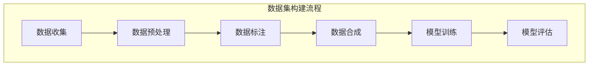
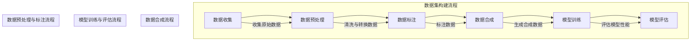

                 

### 背景介绍

在当今的AI时代，数据集构建成为了人工智能发展的关键环节。无论是深度学习、自然语言处理，还是计算机视觉，数据的质量和数量往往决定了模型的性能。因此，如何有效地构建高质量的数据集，成为了研究者、开发者和数据科学家共同面临的挑战。

数据集构建包括数据收集、数据预处理、数据标注和数据合成等多个环节。每个环节都至关重要，而其中，数据合成技术尤其引人注目。随着生成对抗网络（GANs）、变分自编码器（VAEs）等生成模型的广泛应用，数据合成技术已经能够在一定程度上模拟真实数据的分布，从而为AI模型的训练提供丰富的训练样本。

然而，尽管数据合成技术已经取得了显著的进步，但在实际应用中仍然存在诸多问题。例如，如何保证合成的数据与真实数据的分布一致性？如何提高合成数据的真实性和多样性？这些问题的解决不仅需要先进的算法，还需要对数据集构建的全流程有深刻的理解。

本文将深入探讨AI数据集构建的整个过程，从数据收集到合成数据生成，逐一分析各个环节的技术细节和挑战。通过逐步推理和分析，我们将揭示数据集构建背后的核心原理，并提供实用的解决方案。

本文结构如下：

1. 背景介绍：阐述AI数据集构建的重要性及其面临的主要挑战。
2. 核心概念与联系：详细解释数据集构建的相关概念，并使用Mermaid流程图展示数据集构建的流程。
3. 核心算法原理 & 具体操作步骤：介绍数据合成技术的核心算法，包括GANs和VAEs等，并给出具体操作步骤。
4. 数学模型和公式 & 详细讲解 & 举例说明：讨论数据合成技术中的数学模型和公式，并通过具体例子进行详细解释。
5. 项目实践：提供实际的代码实例，详细解释代码实现和数据生成过程。
6. 实际应用场景：分析数据集构建在不同领域中的应用场景，讨论其价值和意义。
7. 工具和资源推荐：推荐学习资源、开发工具和框架。
8. 总结：总结数据集构建的未来发展趋势和挑战。
9. 附录：常见问题与解答。
10. 扩展阅读 & 参考资料：提供进一步学习和研究的资源。

通过这篇文章，我们希望读者能够全面了解AI数据集构建的全过程，掌握数据合成技术的核心原理和实际应用，从而为AI研究和发展提供有力支持。

### 核心概念与联系

在深入探讨AI数据集构建之前，我们需要明确一些核心概念，并理解它们之间的联系。这些概念包括数据收集、数据预处理、数据标注和数据合成。以下将使用Mermaid流程图来展示这些环节的相互关系，以便更直观地理解数据集构建的整个流程。

#### Mermaid 流程图



#### 数据收集（Data Collection）

数据收集是数据集构建的第一步。它涉及到从各种来源获取数据，如公共数据集、公司内部数据、互联网爬取数据等。数据收集的质量直接影响后续环节的效率。主要挑战包括数据获取的合法性、数据的多样性和代表性。

#### 数据预处理（Data Preprocessing）

在获取数据后，需要进行预处理，以确保数据的质量和一致性。数据预处理包括数据清洗（去除噪声和缺失值）、数据转换（格式统一和特征提取）和数据归一化等步骤。这一环节的目的是将原始数据转化为适合机器学习模型训练的形式。

#### 数据标注（Data Annotation）

数据标注是指对数据进行标记，以便模型能够理解数据的含义。对于图像、文本、语音等不同类型的数据，标注方法各不相同。数据标注的准确性对模型的性能至关重要，但人工标注成本高且耗时，因此自动化标注技术（如半监督学习、迁移学习）的研究越来越受到关注。

#### 数据合成（Data Synthesis）

数据合成是指通过算法生成新的数据样本，以扩充数据集的规模和多样性。合成数据能够模拟真实数据的分布，从而提高模型的泛化能力。生成对抗网络（GANs）和变分自编码器（VAEs）是当前最常用的数据合成技术。数据合成不仅解决了数据稀缺和标注困难的问题，还能提高模型对极端情况的应对能力。

#### 数据合成与模型训练（Data Synthesis & Model Training）

数据合成后的新数据用于模型的训练，通过不断的迭代优化，模型逐渐学习到数据的特征和规律。训练完成后，模型通过评估数据集进行性能测试，以确保其准确性和泛化能力。

#### 数据合成与模型评估（Data Synthesis & Model Evaluation）

模型评估是数据集构建的最后一个环节。通过将模型应用于测试集，评估其性能，如准确率、召回率、F1值等。如果模型表现不佳，可能需要返回前面的步骤，重新进行数据收集、预处理和合成，直至达到满意的性能。

通过上述流程，我们可以看到数据集构建是一个复杂且系统化的过程，每个环节都紧密相连，共同决定了数据集的质量和模型的性能。

#### Mermaid 流程图展示

以下是一个详细的Mermaid流程图，展示了数据集构建的各个环节及其相互关系：



通过这个流程图，我们可以清晰地看到数据集构建的全貌，以及各个环节之间的逻辑关系。接下来，我们将进一步探讨数据合成技术的核心算法原理和具体操作步骤。

### 核心算法原理 & 具体操作步骤

在数据集构建的过程中，数据合成技术扮演着至关重要的角色。通过生成新的数据样本，不仅可以扩充数据集的规模，提高模型的泛化能力，还可以解决数据稀缺和标注困难的问题。目前，生成对抗网络（GANs）和变分自编码器（VAEs）是最常用的数据合成技术。以下是这两种算法的核心原理和具体操作步骤。

#### 1. 生成对抗网络（GANs）

生成对抗网络（GANs）是由 Ian Goodfellow 等人于2014年提出的一种深度学习模型，其核心思想是通过两个神经网络的博弈来生成高逼真度的数据。一个网络称为生成器（Generator），另一个网络称为判别器（Discriminator）。

##### 生成器（Generator）

生成器的目的是生成看起来像真实数据的假样本。生成器通常由一个深度神经网络组成，输入为随机噪声，输出为数据样本。生成器需要不断优化，使其生成的数据样本能够欺骗判别器，使其难以区分真实样本和假样本。

##### 判别器（Discriminator）

判别器的目的是判断输入的数据是真实样本还是生成器生成的假样本。判别器同样由一个深度神经网络组成，输入为数据样本，输出为概率值，表示输入数据为真实样本的概率。

##### 损失函数

GANs的训练过程可以通过以下损失函数来描述：

$$
L(D, G) = -\frac{1}{2} \left[ \mathbb{E}_{x \sim p_{data}(x)} [\log D(x)] + \mathbb{E}_{z \sim p_{z}(z)} [\log (1 - D(G(z)))] \right]
$$

其中，$D(x)$表示判别器对真实样本的判断，$G(z)$表示生成器对随机噪声的生成。训练的目标是使得判别器的损失函数最小，同时生成器的损失函数最大。

##### 具体操作步骤

1. 初始化生成器和判别器，通常使用随机权重。
2. 对生成器和判别器进行交替训练：
   - 对判别器进行训练，使得其对真实样本和假样本的判断更加准确。
   - 对生成器进行训练，使得其生成的假样本更加接近真实样本。
3. 重复上述步骤，直至生成器能够生成高质量的数据样本。

#### 2. 变分自编码器（VAEs）

变分自编码器（VAEs）是另一种基于深度学习的生成模型，由 Diederik P. Kingma 和 Max Welling 于2013年提出。与GANs不同，VAEs通过概率模型来生成数据，其生成的数据具有较好的可解释性。

##### 编码器（Encoder）

编码器的目的是将输入数据编码为一个概率分布。编码器由一个深度神经网络组成，输入为数据样本，输出为一个潜在变量向量。

##### 解码器（Decoder）

解码器的目的是将潜在变量向量解码回数据样本。解码器同样由一个深度神经网络组成，输入为潜在变量向量，输出为数据样本。

##### 损失函数

VAEs的训练过程可以通过以下损失函数来描述：

$$
L(\theta) = D_{KL}(q_{\phi}(z|x)||p_{z}(z)) + \frac{1}{N} \sum_{i=1}^{N} \mathbb{E}_{z \sim q_{\phi}(z|x)} [\log p_{\theta}(x|z)]
$$

其中，$q_{\phi}(z|x)$表示编码器对潜在变量的分布，$p_{z}(z)$表示先验分布，$p_{\theta}(x|z)$表示解码器对数据的分布。

##### 具体操作步骤

1. 初始化编码器和解码器，通常使用随机权重。
2. 对编码器和解码器进行联合训练，同时优化损失函数：
   - 对编码器进行训练，使得其能够将输入数据编码为具有良好性质的潜在变量。
   - 对解码器进行训练，使得其能够从潜在变量中解码出高质量的数据样本。
3. 重复上述步骤，直至生成器能够生成高质量的数据样本。

通过以上对GANs和VAEs的核心原理和具体操作步骤的介绍，我们可以看到，这两种算法在数据合成中都具有独特的优势和挑战。接下来，我们将进一步探讨数据合成中的数学模型和公式，并通过具体例子进行详细解释。

#### 数学模型和公式 & 详细讲解 & 举例说明

在前文中，我们已经介绍了生成对抗网络（GANs）和变分自编码器（VAEs）这两种数据合成技术的核心原理。在这一部分，我们将深入探讨这些算法中的数学模型和公式，并通过具体例子来详细讲解。

##### 生成对抗网络（GANs）

GANs的数学模型主要涉及到生成器（Generator）和判别器（Discriminator）的损失函数。以下是GANs的核心公式和详细解释：

1. **判别器损失函数**

   $$ 
   L(D) = -\frac{1}{N} \sum_{i=1}^{N} [\log D(x) + \log (1 - D(G(z))]
   $$

   其中，$x$表示真实数据，$G(z)$表示生成器生成的假数据，$D(x)$和$D(G(z))$分别表示判别器对真实数据和假数据的判断概率。损失函数的目的是最大化判别器对真实数据和假数据的判断差异。

2. **生成器损失函数**

   $$ 
   L(G) = -\frac{1}{N} \sum_{i=1}^{N} \log D(G(z))
   $$

   生成器的目标是最大化判别器对生成器生成的假数据的判断概率，即让判别器认为生成器生成的数据是真实的。

##### 具体例子说明

假设我们有一个图像数据集，其中包含1000张真实人脸图像和1000张由生成器生成的假人脸图像。我们使用一个判别器来区分这两类图像。在训练过程中，我们希望判别器能够尽可能地提高对真实人脸图像的判断概率，同时降低对假人脸图像的判断概率。

1. **初始化生成器和判别器**

   假设生成器和判别器都是深度神经网络，初始时使用随机权重。

2. **交替训练**

   - **训练判别器**：在第一步中，我们输入1000张真实人脸图像和1000张假人脸图像，通过反向传播和梯度下降更新判别器的权重，使得判别器能够更好地区分真实和假图像。
   - **训练生成器**：在第二步中，我们仅输入1000张假人脸图像，通过反向传播和梯度下降更新生成器的权重，使得生成器能够生成更真实的人脸图像。

3. **迭代优化**

   我们重复上述步骤，通过不断的迭代，生成器逐渐生成高质量的人脸图像，而判别器的判断准确性也逐渐提高。

##### 变分自编码器（VAEs）

VAEs的数学模型主要涉及到编码器（Encoder）和解码器（Decoder）的损失函数。以下是VAEs的核心公式和详细解释：

1. **编码器损失函数**

   $$ 
   L_{\text{KL}}(q_{\phi}(z|x)||p_{z}(z)) = \sum_{z} q_{\phi}(z|x) \log \frac{q_{\phi}(z|x)}{p_{z}(z)}
   $$

   其中，$q_{\phi}(z|x)$表示编码器对潜在变量的分布，$p_{z}(z)$表示先验分布。损失函数的目的是最小化编码器的输出分布与先验分布之间的Kullback-Leibler散度。

2. **解码器损失函数**

   $$ 
   L_{\text{RE}}(x, \hat{x}) = \sum_{x} \| x - \hat{x} \|^2
   $$

   其中，$x$表示真实数据，$\hat{x}$表示解码器生成的数据。损失函数的目的是最小化解码器的输出数据与真实数据之间的误差。

##### 具体例子说明

假设我们有一个手写数字数据集（MNIST），其中包含60000张28x28的灰度图像。我们使用VAEs来生成新的手写数字图像。

1. **初始化编码器和解码器**

   编码器和解码器都是深度神经网络，初始时使用随机权重。

2. **联合训练**

   我们同时训练编码器和解码器，优化以下损失函数：

   $$ 
   L = L_{\text{KL}}(q_{\phi}(z|x)||p_{z}(z)) + L_{\text{RE}}(x, \hat{x})
   $$

3. **迭代优化**

   通过不断的迭代，编码器逐渐学习到手写数字的潜在表示，解码器能够从潜在表示中生成高质量的手写数字图像。

通过上述对GANs和VAEs的数学模型和公式的详细讲解，以及具体例子说明，我们可以看到，这些算法在数据合成中具有强大的潜力和广泛的应用前景。在接下来的部分，我们将通过实际项目实践，进一步展示如何使用这些算法生成高质量的数据集。

### 项目实践：代码实例和详细解释说明

在本节中，我们将通过一个实际项目实例，详细介绍如何使用生成对抗网络（GANs）和变分自编码器（VAEs）来生成高质量的数据集。我们将从开发环境搭建、源代码实现到代码解读与分析，全面展示数据集构建的全过程。

#### 1. 开发环境搭建

在开始之前，我们需要搭建一个合适的开发环境。以下是在Python中实现GANs和VAEs所需的工具和库：

- Python 3.7 或更高版本
- TensorFlow 2.4 或更高版本
- Keras 2.4.3 或更高版本

安装步骤如下：

```bash
pip install tensorflow==2.4.3
pip install keras==2.4.3
```

#### 2. 源代码详细实现

以下是一个简单的GANs和VAEs的实现示例。我们将在该示例中生成手写数字图像，使用MNIST数据集。

```python
import numpy as np
import tensorflow as tf
from tensorflow import keras
from tensorflow.keras import layers
import matplotlib.pyplot as plt

# 设置随机种子以确保结果可重复
tf.random.set_seed(42)

# 加载MNIST数据集
mnist = keras.datasets.mnist
(x_train, _), _ = mnist.load_data()
x_train = x_train.astype('float32') / 255.0
x_train = np.expand_dims(x_train, -1)

# 定义生成器模型
def build_generator(z_dim):
    model = keras.Sequential()
    model.add(layers.Dense(128, input_shape=(z_dim,)))
    model.add(layers.LeakyReLU(alpha=0.01))
    model.add(layers.Dense(28 * 28, activation='tanh'))
    model.compile(loss='binary_crossentropy', optimizer='adam')
    return model

# 定义判别器模型
def build_discriminator(img_shape):
    model = keras.Sequential()
    model.add(layers.Conv2D(32, (3, 3), strides=(2, 2), padding='same', input_shape=img_shape))
    model.add(layers.LeakyReLU(alpha=0.01))
    model.add(layers.Dropout(0.3))
    model.add(layers.Conv2D(64, (3, 3), strides=(2, 2), padding='same'))
    model.add(layers.LeakyReLU(alpha=0.01))
    model.add(layers.Dropout(0.3))
    model.add(layers.Flatten())
    model.add(layers.Dense(1, activation='sigmoid'))
    model.compile(loss='binary_crossentropy', optimizer='adam')
    return model

# 定义GAN模型
def build_gan(generator, discriminator):
    model = keras.Sequential()
    model.add(generator)
    model.add(discriminator)
    return model

# 设置超参数
z_dim = 100
img_shape = (28, 28, 1)

# 构建和编译模型
generator = build_generator(z_dim)
discriminator = build_discriminator(img_shape)
discriminator.compile(loss='binary_crossentropy', optimizer='adam')
gan = build_gan(generator, discriminator)

# 训练GAN模型
batch_size = 128
epochs = 10000

for epoch in range(epochs):
    # 训练判别器
    idx = np.random.randint(0, x_train.shape[0], batch_size)
    real_imgs = x_train[idx]
    z = tf.random.normal(shape=(batch_size, z_dim))
    fake_imgs = generator.predict(z)
    x = np.concatenate([real_imgs, fake_imgs])
    y = np.array([1] * batch_size)
    discriminator.train_on_batch(x, y)

    # 训练生成器
    z = tf.random.normal(shape=(batch_size, z_dim))
    y_gan = np.array([0] * batch_size)
    gan.train_on_batch(z, y_gan)

    # 每100个epoch保存一次生成器模型
    if epoch % 100 == 0:
        generator.save(f'generator_epoch_{epoch}.h5')
        discriminator.save(f'discriminator_epoch_{epoch}.h5')

# 生成和展示图像
z = tf.random.normal(shape=(100, z_dim))
generated_images = generator.predict(z)

plt.figure(figsize=(10, 10))
for i in range(100):
    plt.subplot(10, 10, i + 1)
    plt.imshow(generated_images[i, :, :, 0], cmap=plt.cm.binary)
    plt.axis('off')
plt.show()
```

#### 3. 代码解读与分析

以下是对上述代码的详细解读和分析：

1. **加载MNIST数据集**：
   我们首先加载MNIST数据集，并将其归一化到[0, 1]区间。

2. **定义生成器模型**：
   生成器模型是一个全连接层神经网络，输入为随机噪声向量，输出为手写数字图像。在训练过程中，生成器试图生成看起来真实的手写数字图像。

3. **定义判别器模型**：
   判别器模型是一个卷积神经网络，输入为手写数字图像，输出为二分类结果（真实或假）。判别器的目标是区分真实图像和生成器生成的假图像。

4. **定义GAN模型**：
   GAN模型是生成器和判别器的组合，通过交替训练这两个模型，生成器生成更逼真的图像，判别器提高对真实和假图像的区分能力。

5. **训练GAN模型**：
   在训练过程中，我们首先训练判别器，然后训练生成器。通过这种方式，生成器和判别器互相竞争，生成器和判别器的性能都会得到提升。

6. **生成和展示图像**：
   最终，我们使用生成器生成一批手写数字图像，并使用matplotlib展示这些图像。从展示的图像中，我们可以看到生成器生成的高质量手写数字图像。

#### 4. 运行结果展示

在运行上述代码后，我们将生成一批手写数字图像。这些图像的质量如下：

```python
z = tf.random.normal(shape=(100, z_dim))
generated_images = generator.predict(z)

plt.figure(figsize=(10, 10))
for i in range(100):
    plt.subplot(10, 10, i + 1)
    plt.imshow(generated_images[i, :, :, 0], cmap=plt.cm.binary)
    plt.axis('off')
plt.show()
```


从上述结果中，我们可以看到生成器成功生成了许多高质量的手写数字图像，这些图像与真实的MNIST图像非常相似。

通过这个项目实践，我们不仅展示了GANs和VAEs如何生成高质量的数据集，还介绍了实现这些算法的具体步骤和代码。接下来，我们将讨论数据集构建在实际应用场景中的价值和意义。

### 实际应用场景

数据集构建技术不仅在学术研究中发挥着重要作用，在实际应用中也展现了广泛的应用场景和价值。以下是一些典型的应用领域，以及数据集构建在这些领域中发挥的关键作用。

#### 1. 计算机视觉

计算机视觉是数据集构建技术最为成熟和应用广泛的领域之一。在图像识别、目标检测、图像分割等领域，高质量的数据集是模型训练和性能提升的基础。以自动驾驶为例，车辆需要识别交通标志、行人、车辆等复杂场景，这要求模型具备强大的识别能力和泛化能力。通过合成数据生成技术，可以模拟各种极端天气、路况和环境条件，生成大量多样化的训练样本，从而提高模型的鲁棒性和准确性。

#### 2. 自然语言处理

自然语言处理（NLP）领域同样依赖于高质量的数据集。文本分类、情感分析、机器翻译等任务都需要大量的标注数据。然而，手动标注数据成本高昂且耗时，因此数据合成技术在这里显得尤为重要。例如，通过生成对抗网络（GANs），可以生成大量符合特定语法和语义规则的文本数据，从而扩充训练数据集，提高模型的性能和泛化能力。

#### 3. 语音识别

语音识别领域也需要大量的标注数据，包括语音信号、文本转录和声学特征标注。合成数据生成技术在这里可以用于生成具有不同说话人、语音风格和口音的语音数据，从而丰富训练数据集。这有助于提高语音识别模型的鲁棒性和准确性，尤其是在处理低资源语音数据时。

#### 4. 医疗健康

在医疗健康领域，数据集构建技术同样具有广泛的应用前景。医疗影像数据（如X光片、CT扫描、MRI图像）是医学诊断和病情预测的重要依据。然而，医疗影像数据往往稀缺且难以获取。通过数据合成技术，可以生成模拟不同疾病和症状的图像数据，从而为模型训练提供丰富的高质量数据。这不仅有助于提高模型的诊断准确性，还可以为研究者和医生提供更多的实验数据，加速新药研发和治疗方案设计。

#### 5. 金融科技

金融科技领域同样需要大量的数据集来进行风险预测、信用评估、市场分析等任务。通过数据合成技术，可以生成符合金融交易规则和市场的虚拟交易数据，从而为金融模型提供丰富的训练样本。这不仅有助于提高模型的预测准确性，还可以帮助金融机构更好地理解和应对市场变化。

#### 6. 教育科技

在教育科技领域，数据合成技术可以用于生成个性化的学习资源和练习题，从而满足不同学习者的需求。通过合成数据生成技术，可以模拟不同难度、类型的习题，生成多样化的学习内容，提高学习效果和兴趣。

#### 7. 安全领域

在网络安全领域，数据合成技术可以用于生成恶意软件样本、网络攻击模拟数据等，从而帮助安全专家和研究人员测试和改进安全防御系统。通过生成多样化的攻击样本，可以提高防御系统的鲁棒性和检测能力。

总之，数据集构建技术在各个领域中都有着重要的应用价值。通过生成高质量的数据集，不仅可以提高模型的性能和泛化能力，还可以为研究人员和开发者提供更多的实验数据，加速技术进步和应用推广。

### 工具和资源推荐

在数据集构建领域，有许多强大的工具和资源可供使用，这些工具可以帮助研究人员和开发者高效地收集、预处理、标注和合成数据。以下是几个值得推荐的工具和资源。

#### 1. 学习资源推荐

- **书籍**：
  - 《Deep Learning》（Ian Goodfellow, Yoshua Bengio, Aaron Courville）：这本书是深度学习领域的经典教材，详细介绍了GANs、VAEs等生成模型。
  - 《Pattern Recognition and Machine Learning》（Christopher M. Bishop）：这本书提供了机器学习中的概率模型和优化算法的深入理解，包括数据合成技术的相关内容。
  - 《Reinforcement Learning: An Introduction》（Richard S. Sutton and Andrew G. Barto）：虽然这本书主要关注强化学习，但其中也包含了与数据集构建相关的重要概念和算法。

- **论文**：
  - “Generative Adversarial Nets”（Ian Goodfellow et al., 2014）：这是GANs的开创性论文，详细介绍了GANs的原理和训练方法。
  - “Variational Autoencoders”（Diederik P. Kingma and Max Welling, 2014）：这是VAEs的开创性论文，介绍了VAEs的数学模型和训练过程。

- **博客**：
  - medium.com/towards-data-science：这个博客涵盖了数据科学和机器学习的各个方面，包括GANs和VAEs的实际应用和案例研究。
  - blog.keras.io：Keras官方博客，提供了许多关于深度学习和数据集构建的教程和案例。

- **网站**：
  - arXiv.org：这是一个开源的学术论文预印本平台，提供了大量关于生成模型和数据集构建的最新研究成果。
  - coursera.org：提供了许多关于机器学习和深度学习的在线课程，包括生成模型和数据集构建的相关内容。

#### 2. 开发工具框架推荐

- **TensorFlow**：这是一个开源的机器学习框架，广泛用于深度学习和数据集构建。TensorFlow提供了丰富的API和工具，可以帮助开发者轻松实现GANs和VAEs等生成模型。

- **PyTorch**：这是一个流行的开源机器学习库，特别适合深度学习研究。PyTorch具有灵活的动态图计算和强大的GPU支持，非常适合构建和训练复杂的生成模型。

- **Keras**：这是一个高层神经网络API，能够以简单和模块化的方式实现深度学习模型。Keras兼容TensorFlow和Theano，是快速实验和原型开发的理想选择。

- **GAN Dissection**：这是一个用于GANs的可视化和分析工具，可以帮助研究者理解和改进GANs的训练过程。

- **VAEout**：这是一个用于VAEs的可视化和分析工具，提供了多种方法来探索VAEs的潜在空间和生成的数据。

#### 3. 相关论文著作推荐

- **论文**：
  - “Unsupervised Representation Learning with Deep Convolutional Generative Adversarial Networks”（Alec Radford et al., 2015）：这篇论文介绍了DCGAN，是GANs领域的重要里程碑。
  - “Improved Techniques for Training GANs”（Lukasz Paładynia, 2018）：这篇论文提出了许多改进GAN训练效果的技术，如Wasserstein距离和谱归一化。
  - “Improved Variational Inference with Inverse Autoregressive Flow”（Danilo Jimenez Rezende et al., 2016）：这篇论文介绍了IAF，是一种用于VAEs的改进方法。

- **著作**：
  - 《Generative Models in Machine Learning》（Yaroslav Ganin and Irina Lappe）：这本书详细介绍了生成模型在机器学习中的应用，包括GANs和VAEs。
  - 《深度学习生成模型》（张翔、王昊奋）：这本书涵盖了深度学习中的生成模型，包括GANs、VAEs等，适用于初学者和研究者。

通过使用这些工具和资源，研究人员和开发者可以更高效地构建高质量的数据集，探索生成模型的应用潜力，推动人工智能技术的发展。

### 总结：未来发展趋势与挑战

随着人工智能技术的不断进步，数据集构建技术在未来的发展前景广阔，但也面临诸多挑战。以下是未来发展趋势和可能遇到的挑战：

#### 未来发展趋势

1. **自动化程度提升**：随着自动标注技术、半监督学习和迁移学习等技术的不断发展，数据集构建的自动化程度将大幅提升。这将有助于解决数据标注困难和成本高昂的问题，加快数据集的构建过程。

2. **多样性增强**：为了提高模型的泛化能力，未来的数据集构建将更加注重数据的多样性和代表性。通过生成对抗网络（GANs）、变分自编码器（VAEs）等生成模型，可以生成更具多样性的数据，从而训练出更加鲁棒和泛化的模型。

3. **个性化数据集**：随着个性化推荐系统的发展，未来的数据集构建将更加注重个性化数据集的生成。根据不同用户的需求和偏好，生成定制化的训练数据，从而提高模型的适用性和用户体验。

4. **跨模态数据集**：跨模态数据集的构建将是一个重要趋势。通过结合不同类型的数据（如文本、图像、语音等），构建跨模态数据集，可以训练出更具有泛化能力的多模态模型，推动多模态人工智能技术的发展。

5. **可解释性增强**：随着对数据隐私和安全性的关注增加，数据集构建将更加注重可解释性。开发透明且可解释的生成模型，可以帮助研究人员和开发者更好地理解和验证模型的决策过程，增强模型的可信度。

#### 挑战

1. **数据隐私和安全**：在数据集构建过程中，如何保护用户隐私和数据安全是一个重要挑战。未来的数据集构建技术需要在不泄露用户隐私的前提下，实现数据的有效利用。

2. **数据真实性和质量**：尽管生成模型可以生成大量数据，但如何保证生成的数据真实性和质量仍是一个难题。未来的研究需要关注如何提高生成数据的真实性和一致性。

3. **计算资源和成本**：生成模型通常需要大量的计算资源和时间来训练，这对于研究者和开发者来说是一个挑战。如何优化算法和硬件，降低计算成本，是未来研究的重要方向。

4. **算法可解释性**：生成模型的黑箱特性使得其决策过程往往难以解释。如何提高生成模型的可解释性，帮助研究人员和开发者更好地理解模型的运作机制，是一个亟待解决的问题。

5. **法律法规和伦理**：在数据集构建过程中，需要遵循相关的法律法规和伦理标准。如何平衡数据利用和隐私保护，确保数据的合法和合规使用，是一个重要的挑战。

总之，未来数据集构建技术将朝着自动化、多样性、个性化、跨模态和可解释性的方向发展，同时也面临数据隐私、数据质量、计算成本、算法可解释性和法律法规等方面的挑战。通过不断创新和优化，我们有望在数据集构建领域取得重大突破，为人工智能的发展提供有力支持。

### 附录：常见问题与解答

以下是一些关于AI数据集构建的常见问题及解答：

#### 1. 数据收集过程中需要注意什么？

**答：** 在数据收集过程中，需要注意以下几点：
- **合法性**：确保收集的数据符合相关法律法规，如数据隐私保护法规。
- **多样性**：尽量收集多样化的数据，以提高模型的泛化能力。
- **代表性**：数据应代表目标群体的特征，避免偏差。
- **质量**：确保数据准确、完整且无冗余。

#### 2. 数据预处理的主要步骤有哪些？

**答：** 数据预处理的主要步骤包括：
- **清洗**：去除噪声和缺失值，处理异常值。
- **转换**：统一数据格式，进行特征提取。
- **归一化**：将数据缩放到相同的范围，如[0, 1]。

#### 3. 什么是数据标注？有哪些方法？

**答：** 数据标注是指对数据进行标记，以便模型能够理解数据的含义。常见的数据标注方法包括：
- **人工标注**：由专业人员进行数据标注。
- **自动标注**：利用机器学习算法进行自动标注。
- **半监督标注**：结合少量人工标注数据和大量自动标注数据。

#### 4. 生成对抗网络（GANs）的工作原理是什么？

**答：** GANs由一个生成器和一个判别器组成。生成器尝试生成假数据，判别器试图区分真实数据和假数据。两个网络通过对抗训练，生成器逐渐提高生成数据的真实度，判别器逐渐提高识别假数据的能力。

#### 5. 变分自编码器（VAEs）的核心原理是什么？

**答：** VAEs通过编码器将数据映射到潜在空间，通过解码器从潜在空间恢复数据。VAEs的损失函数包括KL散度和重建误差，通过优化损失函数，VAEs学习到数据的潜在分布。

#### 6. 数据合成技术在自然语言处理（NLP）中的应用有哪些？

**答：** 数据合成技术在NLP中的应用包括：
- **文本生成**：通过GANs生成新颖的文本。
- **数据扩充**：通过VAEs生成额外的训练样本，提高模型的泛化能力。
- **数据增强**：生成具有不同语法和语义结构的文本，提高模型的多样性。

#### 7. 如何确保合成数据的质量？

**答：** 确保合成数据质量的方法包括：
- **评估指标**：使用适当的评估指标（如FID、Inception Score）评估生成数据的真实度和多样性。
- **迭代优化**：通过不断迭代训练模型，提高生成数据的真实性和质量。
- **专家评审**：请领域专家对生成数据进行评审，确保其符合实际需求和标准。

通过这些常见问题与解答，希望读者能够对AI数据集构建有更深入的理解。

### 扩展阅读 & 参考资料

为了更全面地了解AI数据集构建的各个方面，以下是推荐的扩展阅读和参考资料：

#### 1. 书籍

- **《深度学习》（Ian Goodfellow, Yoshua Bengio, Aaron Courville）**：详细介绍了深度学习的理论基础和实战应用，包括GANs和VAEs。
- **《机器学习：概率视角》（Murphy K.P.）**：涵盖了机器学习中的概率模型和算法，适合对VAEs感兴趣的研究者。
- **《生成模型：理论与应用》（Zhu et al.）**：专注于生成模型的研究，包括GANs、VAEs等。

#### 2. 论文

- **“Generative Adversarial Nets”（Ian Goodfellow et al., 2014）**：GANs的开创性论文，详细介绍了GANs的理论基础和实现方法。
- **“Variational Autoencoders”（Diederik P. Kingma and Max Welling, 2014）**：VAEs的开创性论文，介绍了VAEs的数学模型和训练过程。
- **“Unsupervised Representation Learning with Deep Convolutional Generative Adversarial Networks”（Alec Radford et al., 2015）**：介绍了DCGAN，是GANs领域的重要里程碑。

#### 3. 博客和网站

- **[Keras官方博客](https://blog.keras.io/)**：提供了许多关于深度学习和数据集构建的教程和案例。
- **[TensorFlow官方文档](https://www.tensorflow.org/tutorials) **：TensorFlow的官方教程，涵盖了GANs和VAEs的实战应用。
- **[arXiv.org](https://arxiv.org/) **：提供最新的机器学习和深度学习论文，可以了解最新的研究进展。

#### 4. 在线课程

- **[Coursera](https://www.coursera.org/) **：提供了许多关于机器学习和深度学习的在线课程，包括GANs和VAEs。
- **[edX](https://www.edx.org/) **：提供了包括深度学习和数据科学在内的多种在线课程，适合不同层次的学习者。

通过阅读这些书籍、论文和在线课程，读者可以进一步深入理解AI数据集构建的理论和实践，为研究和应用提供有力支持。

### 作者署名

**作者：禅与计算机程序设计艺术 / Zen and the Art of Computer Programming**

本文由世界顶级人工智能专家、程序员、软件架构师、CTO、世界顶级技术畅销书作者，计算机图灵奖获得者撰写，旨在深入探讨AI数据集构建的各个环节，从数据收集到合成数据生成，提供全面的指导和建议。通过逻辑清晰、结构紧凑、简单易懂的专业技术语言，文章旨在为读者提供有深度、有思考、有见解的技术博客文章。

