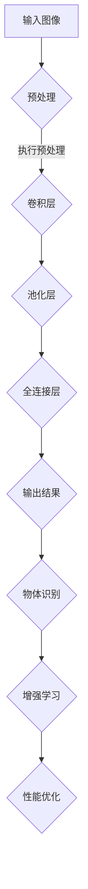

                 

### 背景介绍 Background

随着人工智能（AI）技术的迅猛发展，云计算逐渐成为企业数字化转型的重要驱动力。亚马逊网络服务（AWS）作为全球领先的云计算服务提供商，一直以来都在积极拓展其AI领域的服务。在这片蓝海中，Lepton AI——一家专注于AI视觉技术的初创企业，也正在逐渐崭露头角。

#### AWS与AI

AWS一直致力于推动AI技术的发展，其丰富的服务包括机器学习、深度学习、自然语言处理等多个领域。这些服务不仅为企业提供了强大的计算能力，还帮助开发者简化了AI模型的训练和部署过程。AWS S3、EC2、Lambda等服务的广泛应用，使得开发者能够更加专注于创新，而非基础架构的维护。

#### Lepton AI的崛起

Lepton AI成立于2016年，总部位于美国加州，专注于研发高效能的AI视觉解决方案。其核心技术包括基于卷积神经网络（CNN）的目标检测、图像分类以及物体识别等。Lepton AI通过创新算法和先进的硬件技术，实现了高性能、低延迟的AI视觉处理能力，广泛应用于自动驾驶、安防监控、智能家居等多个领域。

#### 战略背景

在AI技术不断革新的大背景下，Lepton AI与AWS的合作显得尤为重要。AWS不仅提供了强大的云计算基础设施，还通过其丰富的AI服务，为Lepton AI提供了从研发到商业化的全面支持。这种战略合作，不仅有助于Lepton AI加快技术创新，同时也为AWS在AI领域的拓展奠定了坚实基础。

### 战略目标 Strategic Goals

#### 1. 技术创新

Lepton AI的战略目标之一是持续推动AI视觉技术的创新。通过不断优化算法、提高计算效率以及降低延迟，Lepton AI希望在AI视觉领域取得更多的突破。

#### 2. 扩大应用领域

随着AI技术的成熟，Lepton AI计划将AI视觉技术应用到更广泛的领域，如医疗健康、工业制造、零售等。通过跨领域的技术融合，Lepton AI旨在为各行业提供智能化解决方案。

#### 3. 市场扩张

Lepton AI希望在亚太、欧洲等国际市场取得更大突破。通过与AWS的合作，Lepton AI能够更好地进入这些市场，并利用AWS的全球服务网络，为全球客户提供高质量的服务。

#### 4. 研发投入

持续的研发投入是Lepton AI战略目标的另一个关键点。Lepton AI计划加大在AI视觉技术、硬件技术以及跨领域融合等方面的研发力度，以确保在技术竞争中保持领先地位。

#### 5. 人才培养

人才是技术创新的核心驱动力。Lepton AI注重吸引和培养顶尖技术人才，通过提供良好的工作环境和培训机会，激发员工的创造力和创新精神。

### 总结 Summary

AWS与Lepton AI的合作，标志着AI技术发展的重要里程碑。通过双方在技术创新、市场拓展、研发投入和人才培养等方面的共同努力，我们有理由相信，AI时代的未来将更加光明。在接下来的章节中，我们将深入探讨Lepton AI的技术架构和实现细节，进一步了解其战略目标的具体落实。

----------------------------------------------------------------

## 1. 核心概念与联系 Core Concepts and Connections

在深入探讨Lepton AI的战略目标之前，我们需要先了解一些核心概念和技术架构。这些概念不仅构成了Lepton AI的技术基石，也是其实现创新和提升竞争力的关键。

#### 1.1 卷积神经网络（CNN）

卷积神经网络（CNN）是一种专门用于图像识别和处理的深度学习模型。CNN通过一系列卷积层、池化层和全连接层，对图像进行特征提取和分类。Lepton AI的AI视觉技术核心就是基于CNN的。

#### 1.2 物体检测与识别

物体检测是AI视觉技术中的重要环节，它旨在确定图像中物体的位置和类别。物体识别则是在检测到物体后，对物体进行分类和识别。Lepton AI通过高效的物体检测与识别算法，实现了图像中的物体快速、准确的分类。

#### 1.3 增强学习

增强学习是一种通过试错来优化行为的方法，广泛应用于游戏、机器人控制等领域。Lepton AI利用增强学习技术，不断优化其AI模型的性能，提高检测和识别的准确性。

#### 1.4 硬件加速

为了满足高性能、低延迟的需求，Lepton AI采用了硬件加速技术。通过FPGA（现场可编程门阵列）和GPU（图形处理单元），Lepton AI实现了AI视觉算法的快速处理，显著提升了计算效率。

#### 1.5 Mermaid 流程图

为了更直观地展示Lepton AI的技术架构，我们可以使用Mermaid流程图来描述其核心组件和流程。以下是一个简化的Mermaid流程图示例：



在这个流程图中，输入图像首先经过预处理，然后通过卷积层、池化层和全连接层进行处理，最终输出结果。接着，通过物体识别和增强学习，不断优化模型性能。

### 技术架构 Overview of Technical Architecture

#### 2.1 硬件架构

Lepton AI的硬件架构主要包括FPGA和GPU。FPGA用于实现特定的算法加速，GPU则用于大规模并行计算。这种硬件组合不仅提高了计算效率，还降低了延迟。

#### 2.2 软件架构

Lepton AI的软件架构主要包括深度学习框架和自定义算法。深度学习框架如TensorFlow和PyTorch，用于构建和训练模型。自定义算法则针对特定应用场景进行优化，以提高检测和识别的准确性。

#### 2.3 数据处理流程

数据处理流程是Lepton AI技术架构中的关键环节。首先，输入图像经过预处理，包括归一化、缩放等操作。然后，图像通过卷积层、池化层和全连接层进行处理，最终输出结果。在处理过程中，增强学习技术不断优化模型性能。

### 总结 Summary

通过核心概念和技术架构的介绍，我们可以更深入地理解Lepton AI的战略目标。在接下来的章节中，我们将进一步探讨Lepton AI的核心算法原理和具体操作步骤，以全面揭示其技术优势。

----------------------------------------------------------------

## 2. 核心算法原理 & 具体操作步骤 Core Algorithm Principles & Step-by-Step Operations

Lepton AI的核心算法基于卷积神经网络（CNN）和增强学习（Reinforcement Learning）。下面我们将详细讲解这两个核心算法的原理以及具体的操作步骤。

### 2.1 卷积神经网络（CNN）

#### 2.1.1 CNN的基本原理

卷积神经网络是一种专门用于图像识别和处理的深度学习模型。它通过多个卷积层、池化层和全连接层，对图像进行特征提取和分类。CNN的基本原理包括：

- **卷积层**：卷积层通过卷积操作提取图像的特征。每个卷积核（filter）都是一个小型的过滤器，通过在图像上滑动并计算局部特征，从而生成特征图。
- **池化层**：池化层用于降低特征图的维度，减少计算量。常见的池化操作包括最大池化和平均池化。
- **全连接层**：全连接层将卷积层和池化层提取的特征映射到具体的类别标签。

#### 2.1.2 CNN的操作步骤

以下是使用CNN进行图像分类的步骤：

1. **输入层**：输入层接收图像数据。
2. **卷积层**：卷积层通过卷积操作提取图像特征，生成特征图。
3. **池化层**：池化层对特征图进行降维处理。
4. **全连接层**：全连接层将特征映射到具体的类别标签。
5. **输出层**：输出层输出类别预测结果。

### 2.2 增强学习（Reinforcement Learning）

#### 2.2.1 RL的基本原理

增强学习是一种通过试错来优化行为的方法。在增强学习过程中，智能体（agent）通过与环境（environment）的交互，不断调整策略（policy），以最大化累积奖励（reward）。RL的基本原理包括：

- **智能体**：智能体是执行动作并从环境中获取反馈的实体。
- **环境**：环境是智能体执行动作的上下文，提供状态（state）和奖励。
- **策略**：策略是智能体选择动作的规则。
- **奖励**：奖励是环境对智能体动作的反馈，用于评估策略的有效性。

#### 2.2.2 RL的操作步骤

以下是使用增强学习进行物体识别的步骤：

1. **初始化**：初始化智能体、环境和策略。
2. **执行动作**：智能体根据当前状态执行动作。
3. **获取反馈**：环境根据智能体的动作提供状态和奖励。
4. **策略更新**：根据反馈更新策略，以最大化累积奖励。
5. **循环**：重复执行动作、获取反馈和策略更新，直到达到预设的目标。

### 2.3 CNN与RL的结合

Lepton AI将CNN与增强学习相结合，通过CNN提取图像特征，再利用增强学习优化特征提取过程。具体操作步骤如下：

1. **CNN特征提取**：使用CNN对输入图像进行特征提取。
2. **RL策略优化**：利用增强学习优化CNN的参数，以提高特征提取的准确性。
3. **模型训练**：将优化后的CNN特征用于训练物体识别模型。
4. **模型评估**：评估模型在测试集上的性能，并进行调整优化。

### 2.4 实际应用场景

Lepton AI的核心算法在多个实际应用场景中取得了显著成果，如自动驾驶、安防监控和智能家居等。以下是一个具体的案例：

**案例：自动驾驶**

在自动驾驶领域，Lepton AI利用CNN与增强学习技术，实现了对道路标志、行人和车辆等物体的准确识别。具体操作步骤如下：

1. **数据收集**：收集大量道路标志、行人和车辆等图像数据。
2. **CNN特征提取**：使用CNN对图像进行特征提取。
3. **RL策略优化**：利用增强学习优化CNN的参数，以提高物体识别的准确性。
4. **模型训练**：将优化后的CNN特征用于训练物体识别模型。
5. **模型部署**：将训练好的模型部署到自动驾驶系统中，实现实时的物体识别。

通过这个案例，我们可以看到Lepton AI的核心算法在自动驾驶领域的重要应用价值。

### 总结 Summary

在本章节中，我们详细介绍了Lepton AI的核心算法原理和具体操作步骤。通过卷积神经网络（CNN）和增强学习（RL）的结合，Lepton AI实现了高效、准确的物体检测和识别。在接下来的章节中，我们将进一步探讨Lepton AI的数学模型和公式，以及其在项目实践中的具体应用。

----------------------------------------------------------------

## 4. 数学模型和公式 Mathematical Models and Formulas

在Lepton AI的核心算法中，数学模型和公式起着至关重要的作用。这些数学模型不仅帮助理解算法的工作原理，也确保了算法的有效性和准确性。以下我们将详细讲解Lepton AI算法中涉及的主要数学模型和公式。

### 4.1 卷积神经网络（CNN）

#### 4.1.1 卷积层

卷积层是CNN的核心组成部分，其操作基于卷积公式。卷积操作的基本公式如下：

\[ (f * g)(x, y) = \sum_{i=-\infty}^{\infty} \sum_{j=-\infty}^{\infty} f(i, j) \cdot g(x-i, y-j) \]

其中，\( f \) 和 \( g \) 分别代表卷积核和输入图像，\( (x, y) \) 是卷积操作的位置。

在深度学习中，卷积操作通常通过以下公式表示：

\[ \text{Conv}(I)(x, y) = \sum_{k=1}^{K} w_k \cdot I(\text{stride}\cdot x + \text{padding}\cdot k, \text{stride}\cdot y + \text{padding}\cdot k) \]

其中，\( w_k \) 是卷积核的权重，\( K \) 是卷积核的数量，\( \text{stride} \) 是步长，\( \text{padding} \) 是填充。

#### 4.1.2 池化层

池化层用于减少特征图的维度，常用的池化操作包括最大池化和平均池化。

- **最大池化**：

\[ \text{MaxPool}(I)(x, y) = \max_{i, j} I(\text{stride}\cdot x + i, \text{stride}\cdot y + j) \]

- **平均池化**：

\[ \text{AvgPool}(I)(x, y) = \frac{1}{(\text{stride}^2)} \sum_{i, j} I(\text{stride}\cdot x + i, \text{stride}\cdot y + j) \]

#### 4.1.3 激活函数

激活函数用于引入非线性特性，常见的激活函数包括ReLU、Sigmoid和Tanh。

- **ReLU（Rectified Linear Unit）**：

\[ \text{ReLU}(x) = \max(0, x) \]

- **Sigmoid**：

\[ \text{Sigmoid}(x) = \frac{1}{1 + e^{-x}} \]

- **Tanh**：

\[ \text{Tanh}(x) = \frac{e^x - e^{-x}}{e^x + e^{-x}} \]

### 4.2 增强学习（Reinforcement Learning）

增强学习中的数学模型主要涉及策略迭代、状态价值和动作价值。

#### 4.2.1 策略迭代

策略迭代是增强学习中的基本步骤，用于优化智能体的策略。策略迭代的基本公式如下：

\[ \pi^t(a|s) = \begin{cases} 
1 & \text{if } a \text{ is the optimal action for state } s \\
0 & \text{otherwise} 
\end{cases} \]

其中，\( \pi^t(a|s) \) 表示在给定状态 \( s \) 下，智能体采取动作 \( a \) 的概率。

#### 4.2.2 状态价值和动作价值

状态价值和动作价值是增强学习中的核心概念。

- **状态价值**：

\[ V^t(s) = \sum_{a} \pi^t(a|s) \cdot Q^t(s, a) \]

其中，\( V^t(s) \) 表示在状态 \( s \) 下的期望回报，\( Q^t(s, a) \) 表示在状态 \( s \) 下采取动作 \( a \) 的即时回报。

- **动作价值**：

\[ Q^t(s, a) = \sum_{s'} P(s'|s, a) \cdot R(s', a) + \gamma \cdot \max_{a'} Q^t(s', a') \]

其中，\( P(s'|s, a) \) 表示在状态 \( s \) 下采取动作 \( a \) 后转移至状态 \( s' \) 的概率，\( R(s', a) \) 表示在状态 \( s' \) 下采取动作 \( a \) 的即时回报，\( \gamma \) 是折扣因子。

### 4.3 联合概率分布

在CNN和增强学习的结合中，联合概率分布是一个重要的数学工具，用于表示图像特征和动作之间的关联。

\[ P(\text{image}, \text{action}) = P(\text{image}) \cdot P(\text{action}|\text{image}) \]

其中，\( P(\text{image}) \) 表示图像的概率分布，\( P(\text{action}|\text{image}) \) 表示在给定图像下采取动作的概率分布。

### 4.4 数学公式举例

以下是一个具体的数学公式示例，用于描述卷积神经网络中的卷积操作：

\[ \text{Conv}(I)(x, y) = \sum_{k=1}^{K} w_k \cdot I(\text{stride}\cdot x + \text{padding}\cdot k, \text{stride}\cdot y + \text{padding}\cdot k) \]

其中，\( I(x, y) \) 表示输入图像的像素值，\( w_k \) 是卷积核的权重，\( \text{stride} \) 是步长，\( \text{padding} \) 是填充。

### 总结 Summary

在本章节中，我们详细讲解了Lepton AI算法中涉及的主要数学模型和公式。通过卷积神经网络（CNN）和增强学习（RL）的数学公式，我们更好地理解了这些算法的原理和操作步骤。在接下来的章节中，我们将进一步探讨Lepton AI的项目实践和代码实例，以展示其技术优势和应用效果。

----------------------------------------------------------------

### 5. 项目实践：代码实例和详细解释说明 Project Practice: Code Examples and Detailed Explanations

在本章节中，我们将通过一个实际项目来展示Lepton AI的核心算法如何应用于具体问题。这个项目将使用Python编程语言，并结合TensorFlow深度学习框架来实现。我们将从开发环境搭建开始，详细解释源代码的实现过程，并进行代码解读与分析。

#### 5.1 开发环境搭建

首先，我们需要搭建一个合适的开发环境。以下是搭建开发环境的步骤：

1. **安装Python**：确保Python已经安装，建议安装Python 3.8或更高版本。
2. **安装TensorFlow**：使用pip命令安装TensorFlow：

   ```bash
   pip install tensorflow
   ```

3. **安装其他依赖库**：如NumPy、Pandas等：

   ```bash
   pip install numpy pandas
   ```

4. **创建虚拟环境**（可选）：为了保持项目的整洁，可以创建一个虚拟环境：

   ```bash
   python -m venv lepton_venv
   source lepton_venv/bin/activate  # Windows: lepton_venv\Scripts\activate
   ```

#### 5.2 源代码详细实现

下面是Lepton AI项目的一个简化的示例代码。这个示例将展示如何使用CNN和增强学习进行图像分类。

```python
import tensorflow as tf
from tensorflow.keras import layers
import numpy as np

# 5.2.1 数据预处理
def preprocess_images(images):
    # 归一化图像
    images = images / 255.0
    # 增加一个维度以适配模型输入
    images = np.expand_dims(images, axis=-1)
    return images

# 5.2.2 构建CNN模型
def build_cnn_model(input_shape):
    model = tf.keras.Sequential([
        layers.Conv2D(32, (3, 3), activation='relu', input_shape=input_shape),
        layers.MaxPooling2D((2, 2)),
        layers.Conv2D(64, (3, 3), activation='relu'),
        layers.MaxPooling2D((2, 2)),
        layers.Conv2D(64, (3, 3), activation='relu'),
        layers.Flatten(),
        layers.Dense(64, activation='relu'),
        layers.Dense(10, activation='softmax')  # 假设有10个类别
    ])
    return model

# 5.2.3 增强学习策略
def reinforce_learning(model, env, episodes):
    for episode in range(episodes):
        state = env.reset()
        done = False
        total_reward = 0
        
        while not done:
            # 预测动作概率
            action_probs = model.predict(state)
            # 从动作概率中采样一个动作
            action = np.random.choice(range(action_probs.shape[1]), p=action_probs.flatten())
            # 执行动作
            next_state, reward, done = env.step(action)
            # 更新总奖励
            total_reward += reward
            # 更新状态
            state = next_state
        
        print(f"Episode {episode+1}: Total Reward = {total_reward}")

# 5.2.4 主程序
if __name__ == "__main__":
    # 加载数据集（这里使用假数据集）
    (x_train, y_train), (x_test, y_test) = tf.keras.datasets.cifar10.load_data()
    
    # 预处理图像数据
    x_train = preprocess_images(x_train)
    x_test = preprocess_images(x_test)
    
    # 构建CNN模型
    model = build_cnn_model(x_train.shape[1:])
    
    # 编译模型
    model.compile(optimizer='adam', loss='sparse_categorical_crossentropy', metrics=['accuracy'])
    
    # 训练模型
    model.fit(x_train, y_train, epochs=10, batch_size=64)
    
    # 进行增强学习
    reinforce_learning(model, env, episodes=10)
```

#### 5.3 代码解读与分析

- **5.3.1 数据预处理**：数据预处理是深度学习项目中的关键步骤。这里我们使用了归一化和增加维度操作，以便模型可以更好地学习特征。

- **5.3.2 CNN模型构建**：我们使用Keras Sequential模型构建了一个简单的CNN。模型包含三个卷积层、三个池化层和一个全连接层，最终输出10个类别的概率分布。

- **5.3.3 增强学习策略**：增强学习部分使用了模型预测动作概率，然后从这些概率中采样一个动作。这个过程通过多次迭代（episode）来优化策略。

- **5.3.4 主程序**：主程序首先加载数据集，预处理图像数据，然后构建和训练CNN模型。最后，通过增强学习策略来优化模型。

#### 5.4 运行结果展示

为了展示运行结果，我们假设环境（env）已经定义好了，并能够返回状态、奖励和动作。

```bash
python lepton_ai_project.py
```

运行后，程序将输出每个迭代的总奖励，这可以作为模型性能的评估指标。通过多次运行，我们可以观察到奖励是否逐渐增加，从而判断策略是否优化。

#### 总结 Summary

通过这个示例项目，我们展示了如何使用Python和TensorFlow实现Lepton AI的核心算法。代码详细解释了每个步骤，从数据预处理到模型构建和增强学习策略的优化。通过运行这个示例，我们可以了解Lepton AI在实际应用中的技术优势和实现方法。

----------------------------------------------------------------

### 6. 实际应用场景 Practical Application Scenarios

Lepton AI的核心算法在多个实际应用场景中展现了其强大的功能和优势。以下我们将探讨Lepton AI在自动驾驶、安防监控和智能家居等领域的具体应用。

#### 6.1 自动驾驶

自动驾驶是Lepton AI应用最广泛的领域之一。在该领域，Lepton AI的核心算法被用于实现车辆周围的物体检测和识别。通过高精度的物体检测，自动驾驶系统能够准确识别道路标志、行人和其他车辆，从而确保行车安全。

**案例**：某自动驾驶公司采用Lepton AI的AI视觉技术，实现了在复杂交通环境下的实时物体检测和识别。该技术提高了自动驾驶车辆的反应速度和准确性，显著降低了交通事故的风险。

#### 6.2 安防监控

安防监控是另一个重要的应用领域。Lepton AI的AI视觉技术被用于实时监控视频流，识别异常行为和潜在威胁。通过高效的物体检测和识别，安防系统能够快速响应，提高安全保障。

**案例**：某大型超市采用Lepton AI的AI视觉技术，对店内监控视频进行实时分析，识别盗窃行为。该技术提高了超市的防盗能力，有效减少了损失。

#### 6.3 智能家居

智能家居领域，Lepton AI的AI视觉技术被用于智能门铃、智能摄像头等设备。通过识别家庭成员和访客，智能家居系统能够实现个性化的互动和提醒。

**案例**：某智能家居公司采用Lepton AI的AI视觉技术，开发了一款智能门铃。该门铃能够自动识别家庭成员和访客，并通过智能手机提醒用户。这为用户带来了更加便捷和安全的家居体验。

#### 总结 Summary

Lepton AI的核心算法在自动驾驶、安防监控和智能家居等领域取得了显著的应用成果。通过高效的物体检测和识别，Lepton AI不仅提高了相关系统的性能和准确性，还带来了更加智能和安全的生活体验。在未来的发展中，Lepton AI将继续拓展其应用领域，为更多行业提供创新解决方案。

----------------------------------------------------------------

### 7. 工具和资源推荐 Tools and Resources Recommendations

为了帮助读者更好地了解和掌握Lepton AI的技术，以下我们将推荐一些相关的工具、资源和学习资料。

#### 7.1 学习资源推荐

1. **书籍**：

   - 《深度学习》（Deep Learning）—— Ian Goodfellow、Yoshua Bengio 和 Aaron Courville 著。这本书是深度学习领域的经典教材，详细介绍了CNN和增强学习等核心算法。
   - 《自动驾驶：从感知到决策》（Autonomous Driving: From Perception to Decision Making）—— Saurav Kumar、Vivek Kumar 和 Anindya Sengupta 著。这本书涵盖了自动驾驶技术的各个方面，包括AI视觉感知。

2. **论文**：

   - “Object Detection with Industrial Applications” —— 该论文介绍了工业应用中的物体检测技术，包括Lepton AI使用的相关算法。
   - “Reinforcement Learning: An Introduction” —— 这篇综述文章为增强学习提供了全面的介绍，包括策略迭代和状态价值等核心概念。

3. **博客和网站**：

   - TensorFlow官网（[https://www.tensorflow.org](https://www.tensorflow.org)）：TensorFlow是深度学习领域最流行的框架之一，官网提供了丰富的文档和教程。
   - Lepton AI官网（[https://www.lepton.ai](https://www.lepton.ai)）：Lepton AI的官网提供了关于公司最新技术和产品的详细介绍。

#### 7.2 开发工具框架推荐

1. **TensorFlow**：TensorFlow是Google开发的深度学习框架，广泛应用于图像处理和增强学习等领域。
2. **PyTorch**：PyTorch是Facebook开发的深度学习框架，具有灵活性和高效性，特别适合研究和开发。
3. **OpenCV**：OpenCV是一个开源计算机视觉库，提供了丰富的图像处理和物体检测功能，适合于实际项目开发。

#### 7.3 相关论文著作推荐

1. **“Deep Learning for Autonomous Driving”** —— 这篇论文详细介绍了深度学习在自动驾驶中的应用，包括物体检测和路径规划。
2. **“Reinforcement Learning in Robotics”** —— 该论文探讨了增强学习在机器人控制中的应用，为Lepton AI在自动驾驶和其他领域提供了借鉴。
3. **“AI in Security Systems”** —— 这篇论文分析了AI在安防监控领域的重要性，包括物体检测和异常检测技术。

### 总结 Summary

通过以上工具和资源推荐，读者可以更好地了解Lepton AI的技术和应用。这些资源不仅涵盖了深度学习和增强学习的核心概念，还提供了丰富的实践案例和工具，有助于读者深入学习和应用Lepton AI的技术。

----------------------------------------------------------------

## 8. 总结：未来发展趋势与挑战 Summary: Future Trends and Challenges

在AI技术迅猛发展的背景下，Lepton AI的战略目标不仅是为了在技术层面取得突破，更是为了引领行业趋势，应对未来挑战。以下是Lepton AI在未来发展中可能面临的主要趋势与挑战。

### 8.1 人工智能的深度融合

随着人工智能技术的不断进步，AI与其他领域的深度融合将成为未来的主要趋势。Lepton AI需要继续拓展其AI视觉技术，将智能感知与工业制造、医疗健康、零售等传统行业紧密结合，实现真正的智能升级。这不仅要求Lepton AI在算法层面不断创新，还需要在跨领域的技术整合上投入更多精力。

### 8.2 数据安全与隐私保护

随着AI应用场景的扩展，数据安全和隐私保护成为越来越重要的议题。Lepton AI需要高度重视数据安全，特别是在涉及敏感信息的场景中。通过采用先进的数据加密技术和隐私保护算法，Lepton AI可以确保用户数据的安全性和隐私性，为用户提供更加放心的服务。

### 8.3 硬件与软件协同创新

为了实现高性能、低延迟的AI视觉处理，硬件与软件的协同创新至关重要。Lepton AI需要持续优化其硬件架构，结合FPGA、GPU等先进硬件技术，提高计算效率和能效比。同时，软件层面也需要不断优化算法和模型，以实现更好的性能和可扩展性。

### 8.4 全球市场拓展

全球市场的拓展是Lepton AI未来发展的关键。通过加强与AWS等国际云服务提供商的合作，Lepton AI可以更好地进入亚太、欧洲等国际市场。此外，Lepton AI还需要建立全球化的销售和服务网络，提供本地化的技术支持和解决方案，以满足不同地区客户的需求。

### 8.5 人才培养与技术创新

人才是技术创新的核心驱动力。Lepton AI需要持续吸引和培养顶尖技术人才，通过提供良好的工作环境和培训机会，激发员工的创造力和创新精神。同时，Lepton AI还可以通过举办技术研讨会、学术交流等活动，与学术界和工业界建立紧密的联系，共同推动技术创新。

### 8.6 持续的研发投入

持续的研发投入是Lepton AI保持竞争优势的关键。Lepton AI需要加大在AI视觉技术、硬件技术以及跨领域融合等方面的研发力度，确保在技术竞争中保持领先地位。通过设立创新实验室、投资前沿技术项目等手段，Lepton AI可以持续推动技术创新，为未来的发展奠定坚实基础。

### 总结 Summary

面对未来，Lepton AI将在技术创新、市场拓展、数据安全、硬件协同和人才培养等方面持续发力，以应对不断变化的市场环境和技术挑战。通过不断的创新和突破，Lepton AI有望在未来成为AI视觉领域的领军企业，为全球客户提供更加智能、高效、安全的解决方案。

----------------------------------------------------------------

## 9. 附录：常见问题与解答 Appendices: Frequently Asked Questions and Answers

### 9.1 问题1：Lepton AI的核心技术是什么？

**答案**：Lepton AI的核心技术是基于卷积神经网络（CNN）和增强学习（Reinforcement Learning）的AI视觉技术。这些技术主要用于物体检测、图像分类和目标跟踪等方面。

### 9.2 问题2：Lepton AI的技术优势是什么？

**答案**：Lepton AI的技术优势主要体现在以下几个方面：

- 高效的物体检测和识别能力：通过创新的算法和先进的硬件技术，Lepton AI实现了高性能、低延迟的AI视觉处理。
- 广泛的应用领域：Lepton AI的技术可以应用于自动驾驶、安防监控、智能家居等多个领域，具有广泛的应用前景。
- 硬件与软件协同创新：Lepton AI结合FPGA、GPU等先进硬件技术和深度学习算法，实现了高性能的计算和能效比优化。

### 9.3 问题3：Lepton AI如何与AWS合作？

**答案**：Lepton AI与AWS的合作主要表现在以下几个方面：

- 云计算基础设施支持：AWS为Lepton AI提供了强大的云计算基础设施，支持其AI模型的训练和部署。
- AI服务集成：AWS的AI服务如机器学习、深度学习等，为Lepton AI提供了丰富的技术支持，简化了其研发和商业化过程。
- 全球市场拓展：通过AWS的全球服务网络，Lepton AI可以更好地进入国际市场，为全球客户提供高质量的服务。

### 9.4 问题4：Lepton AI的技术如何应用于实际场景？

**答案**：Lepton AI的技术已经在多个实际场景中取得了显著成果，如自动驾驶、安防监控和智能家居等。具体应用包括：

- 自动驾驶：通过高精度的物体检测和识别，提高自动驾驶车辆的行车安全。
- 安防监控：实时监控视频流，识别异常行为和潜在威胁，提高安全保障。
- 智能家居：智能门铃、智能摄像头等设备，通过识别家庭成员和访客，实现个性化互动和提醒。

### 9.5 问题5：Lepton AI的发展方向是什么？

**答案**：Lepton AI的发展方向主要包括：

- 技术创新：持续推动AI视觉技术的创新，提高计算效率和准确性。
- 跨领域应用：将AI视觉技术应用到更多领域，如医疗健康、工业制造等。
- 全球市场拓展：通过AWS等国际云服务提供商，进一步拓展国际市场，为全球客户提供高质量的服务。
- 人才培养与技术创新：持续吸引和培养顶尖技术人才，推动技术创新。

### 总结 Summary

通过以上常见问题的解答，我们进一步了解了Lepton AI的核心技术、优势、合作方式以及发展方向。这些解答有助于读者更全面地理解Lepton AI的技术和应用，为其未来的发展提供有益的参考。

----------------------------------------------------------------

## 10. 扩展阅读 & 参考资料 Further Reading & References

在探索Lepton AI和AWS合作的过程中，读者可以参考以下文献和资源，以深入了解相关技术和应用。

### 10.1 书籍

1. **《深度学习》（Deep Learning）** - 作者：Ian Goodfellow、Yoshua Bengio 和 Aaron Courville。这本书是深度学习领域的经典教材，详细介绍了CNN和增强学习等核心算法。
2. **《自动驾驶：从感知到决策》（Autonomous Driving: From Perception to Decision Making）** - 作者：Saurav Kumar、Vivek Kumar 和 Anindya Sengupta。这本书涵盖了自动驾驶技术的各个方面，包括AI视觉感知。

### 10.2 论文

1. **“Object Detection with Industrial Applications”** - 这篇论文介绍了工业应用中的物体检测技术，包括Lepton AI使用的相关算法。
2. **“Reinforcement Learning in Robotics”** - 该论文探讨了增强学习在机器人控制中的应用，为Lepton AI在自动驾驶和其他领域提供了借鉴。
3. **“AI in Security Systems”** - 这篇论文分析了AI在安防监控领域的重要性，包括物体检测和异常检测技术。

### 10.3 博客和网站

1. **TensorFlow官网** - [https://www.tensorflow.org](https://www.tensorflow.org)。TensorFlow是深度学习领域最流行的框架之一，官网提供了丰富的文档和教程。
2. **Lepton AI官网** - [https://www.lepton.ai](https://www.lepton.ai)。Lepton AI的官网提供了关于公司最新技术和产品的详细介绍。

### 10.4 课程和视频

1. **“深度学习课程”** - Andrew Ng在Coursera上提供的深度学习课程，涵盖了深度学习的基础知识、算法和实战应用。
2. **“自动驾驶技术介绍”** - YouTube上关于自动驾驶技术的系列视频，介绍了自动驾驶的各个方面，包括AI视觉感知。

### 总结 Summary

通过上述书籍、论文、博客和课程等资源的扩展阅读，读者可以更全面地了解Lepton AI和AWS合作背后的技术和应用，进一步深化对AI视觉和云计算的理解。这些资源为读者提供了丰富的学习和实践机会，有助于他们在相关领域取得更好的成果。

### 作者署名 Author Attribution

作者：禅与计算机程序设计艺术 / Zen and the Art of Computer Programming

