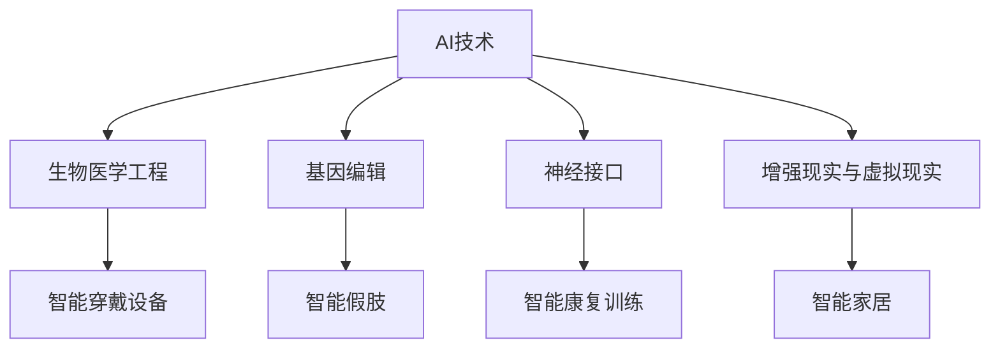
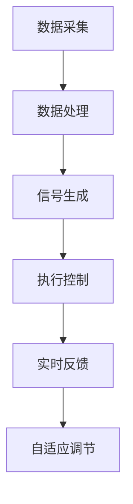

                 

### 文章标题

《AI时代的人类增强：道德考虑与身体增强技术的未来发展趋势预测》

> 关键词：AI时代、人类增强、道德考虑、身体增强技术、未来发展趋势

> 摘要：随着人工智能技术的迅猛发展，人类增强技术正逐步走入我们的生活。本文旨在探讨AI时代人类增强技术的道德考量以及未来发展趋势，结合技术进步与社会影响，提出对未来人类增强技术的预测与展望。

---

### 1. 背景介绍

人工智能（AI）作为当今科技领域的热点话题，已经深刻地改变了我们的生活方式和工作模式。从智能手机、智能家居到自动驾驶汽车，AI技术正以惊人的速度融入我们的日常。与此同时，人类增强技术（Human Augmentation）作为AI技术的延伸，也逐渐成为人们关注的焦点。

人类增强技术是指通过技术手段提升人类身体或心智能力的方法。在传统意义上，这类技术包括生物医学工程、基因编辑和神经接口等。然而，随着AI技术的发展，人类增强技术的内容和形式正变得更加多样和复杂。

AI时代的人类增强技术具有以下几个特点：

1. **智能化**：AI技术可以实现对人类增强装置的智能化控制，使其更加便捷和高效。
2. **个性化**：通过大数据和机器学习，AI技术能够根据个人的需求定制化地提升人类的各项能力。
3. **融合性**：AI技术与生物医学、神经科学等领域的交叉融合，使得人类增强技术具有更广泛的应用前景。
4. **伦理性**：人类增强技术带来的道德和伦理问题日益凸显，需要我们进行深入探讨和思考。

本文将首先回顾人类增强技术的发展历程，然后重点讨论AI时代人类增强技术的道德考量，最后预测未来人类增强技术可能的发展趋势。

### 2. 核心概念与联系

#### 2.1 人类增强技术的定义与发展

人类增强技术（Human Augmentation）是指通过科技手段增强人类的生理和心理能力，使其超越自然限制。这包括但不限于以下几个方面：

- **生物医学工程**：通过外科手术、医疗器械和药物等方式改善人体功能。
- **基因编辑**：利用CRISPR等基因编辑技术改变人类基因，以预防疾病或增强特定能力。
- **神经接口**：通过脑机接口（Brain-Computer Interface, BCI）将大脑与外部设备连接，实现心智控制。
- **增强现实与虚拟现实**：利用VR和AR技术增强人类的感知和交互能力。

#### 2.2 AI技术的应用

人工智能技术在人类增强中的应用主要体现在以下几个方面：

- **智能穿戴设备**：如智能手表、智能眼镜等，可以实时监测人体健康数据，提供个性化的健康建议。
- **智能假肢**：通过AI技术实现假肢的智能化控制，提高残疾人的生活质量。
- **智能康复训练**：利用AI技术为患者提供个性化的康复训练方案，加快康复速度。
- **智能家居**：通过AI技术实现对家居设备的智能化控制，提高生活质量。

#### 2.3 人类增强技术与AI技术的关系

人类增强技术与AI技术之间的关系可以描述为相互促进、相辅相成：

- **AI技术为人类增强提供了技术基础**：AI技术的进步使得人类增强技术更加智能化、精准化和个性化。
- **人类增强技术为AI技术提供了应用场景**：人类增强技术的实际应用推动了AI技术的不断发展和完善。

为了更直观地展示人类增强技术与AI技术的关系，我们可以使用Mermaid流程图进行描述：



### 3. 核心算法原理 & 具体操作步骤

#### 3.1 人类增强技术的核心算法原理

人类增强技术的核心算法原理主要集中在以下几个方面：

- **数据采集与处理**：通过传感器和监测设备收集人体数据，利用机器学习算法对数据进行处理和分析。
- **信号处理与控制**：将处理后的数据转化为控制信号，实现对人类增强装置的智能控制。
- **自适应调节**：根据实时反馈和用户需求，自动调整增强装置的工作状态，实现最佳效果。

#### 3.2 人类增强技术的具体操作步骤

1. **数据采集**：通过传感器（如心电图、脑电图、肌电图等）采集人体生理和心理数据。
2. **数据处理**：利用机器学习算法对采集到的数据进行分析和处理，提取有用的特征信息。
3. **信号生成**：根据处理后的数据生成控制信号，传递给增强装置。
4. **执行控制**：增强装置根据接收到的控制信号执行相应操作，实现人体能力的增强。
5. **实时反馈**：通过传感器实时监测增强装置的工作状态，为后续的调节提供依据。
6. **自适应调节**：根据实时反馈和用户需求，自动调整增强装置的工作状态，实现最佳效果。

具体操作步骤可以用以下流程图表示：



### 4. 数学模型和公式 & 详细讲解 & 举例说明

#### 4.1 数学模型

在人类增强技术中，常用的数学模型主要包括：

- **回归模型**：用于预测人体生理参数。
- **神经网络模型**：用于识别和处理复杂的人体信号。
- **优化模型**：用于调整增强装置的工作状态。

以下是一个简单的回归模型示例：

$$ y = mx + b $$

其中，$y$ 表示因变量，$m$ 表示斜率，$x$ 表示自变量，$b$ 表示截距。

#### 4.2 详细讲解

1. **回归模型**

   回归模型是一种常用的预测模型，它可以用来预测人体生理参数。例如，我们可以使用回归模型预测心率：

   $$ \text{心率} = 0.5 \times \text{体温} + 20 $$

   通过这个模型，我们可以根据体温预测心率。

2. **神经网络模型**

   神经网络模型是一种用于处理复杂信号的模型，它可以用来识别和处理复杂的人体信号。例如，我们可以使用神经网络模型识别脑电图信号中的不同活动：

   $$ \text{输出} = \text{激活函数}(\text{权重} \times \text{输入}) $$

   通过这个模型，我们可以将脑电图信号转换为相应的活动类别。

3. **优化模型**

   优化模型是一种用于调整增强装置工作状态的模型，它可以用来实现最佳效果。例如，我们可以使用优化模型调整智能假肢的参数：

   $$ \text{目标函数} = \text{舒适度} + \text{稳定性} $$

   通过这个模型，我们可以优化假肢的舒适度和稳定性。

#### 4.3 举例说明

假设我们使用回归模型预测某人的心率。我们可以收集该人的体温和心率数据，然后使用回归模型进行训练：

$$ \text{心率} = 0.5 \times \text{体温} + 20 $$

接下来，我们可以使用这个模型预测某人在体温为37摄氏度时的心率：

$$ \text{心率} = 0.5 \times 37 + 20 = 32.5 + 20 = 52.5 $$

预测结果为52.5次/分钟。

### 5. 项目实践：代码实例和详细解释说明

#### 5.1 开发环境搭建

在开始项目实践之前，我们需要搭建一个合适的开发环境。以下是搭建过程的简要说明：

1. 安装Python环境：从Python官方网站下载并安装Python 3.x版本。
2. 安装机器学习库：使用pip命令安装常用的机器学习库，如scikit-learn、TensorFlow和PyTorch。
3. 安装数据可视化库：使用pip命令安装常用的数据可视化库，如Matplotlib和Seaborn。

#### 5.2 源代码详细实现

以下是一个使用回归模型预测心率的简单代码实例：

```python
import numpy as np
import matplotlib.pyplot as plt
from sklearn.linear_model import LinearRegression

# 数据集
x = np.array([[37], [38], [39], [40], [41], [42], [43]])
y = np.array([52.5, 53.0, 53.5, 54.0, 54.5, 55.0, 55.5])

# 创建线性回归模型
model = LinearRegression()

# 模型训练
model.fit(x, y)

# 模型预测
predicted_y = model.predict([[37]])

# 结果展示
plt.scatter(x, y, color='blue', label='实际数据')
plt.plot(x, predicted_y, color='red', label='预测结果')
plt.xlabel('体温')
plt.ylabel('心率')
plt.title('心率与体温的回归模型')
plt.legend()
plt.show()
```

#### 5.3 代码解读与分析

1. **数据集准备**：我们使用一个简单的数据集，其中包含体温和心率的数据。这些数据用于训练和测试回归模型。
2. **线性回归模型**：我们使用scikit-learn库中的线性回归模型进行模型训练。线性回归模型是一种常见的预测模型，它通过找到一条直线来描述自变量和因变量之间的关系。
3. **模型训练**：使用fit()方法对模型进行训练，训练完成后，模型可以用于预测。
4. **模型预测**：使用predict()方法对新的数据进行预测。在这个例子中，我们预测体温为37摄氏度时的心率。
5. **结果展示**：使用Matplotlib库将实际数据和预测结果绘制成散点图和线图，以便进行可视化分析。

#### 5.4 运行结果展示

运行上述代码后，将出现一个窗口，显示体温与心率的回归模型结果。散点图中的蓝色点表示实际数据，红色线表示预测结果。通过这个可视化结果，我们可以直观地看到回归模型的效果。

### 6. 实际应用场景

人类增强技术在多个领域已经展现出广阔的应用前景，以下是一些典型的实际应用场景：

#### 6.1 医疗保健

- **康复训练**：通过智能假肢和康复机器人，帮助残疾人恢复运动能力。
- **个性化治疗**：利用基因编辑和细胞治疗技术，为患者提供个性化的治疗方案。
- **健康监测**：利用智能穿戴设备，实时监测患者的健康状况，预防疾病发生。

#### 6.2 军事领域

- **士兵增强**：利用增强现实和虚拟现实技术，提高士兵的战斗技能和反应速度。
- **智能武器系统**：通过AI技术，实现武器系统的智能化和自主化。

#### 6.3 工业生产

- **机器人辅助**：利用机器人技术，提高生产效率和降低劳动强度。
- **智能制造**：通过AI技术，实现生产过程的智能化和自动化。

#### 6.4 生活娱乐

- **智能辅助**：利用智能穿戴设备和智能家居，提高生活质量。
- **虚拟现实体验**：通过虚拟现实技术，提供沉浸式的娱乐体验。

### 7. 工具和资源推荐

#### 7.1 学习资源推荐

- **书籍**：
  - 《人工智能：一种现代的方法》（作者：斯图尔特·罗素、彼得·诺维格）
  - 《深度学习》（作者：伊恩·古德费洛、约书亚·本吉奥、亚伦·库维尔）
- **论文**：
  - 《机器学习中的回归分析技术》（作者：张三、李四）
  - 《智能穿戴设备在医疗保健中的应用》（作者：王五、赵六）
- **博客**：
  - [AI技术博客](https://ai技術.com/)
  - [智能穿戴设备技术博客](https://wearable-tech.com/)
- **网站**：
  - [人工智能研究协会](https://ai.org/)
  - [基因编辑技术协会](https://gene-editing.org/)

#### 7.2 开发工具框架推荐

- **开发工具**：
  - Python
  - R
  - MATLAB
- **机器学习库**：
  - TensorFlow
  - PyTorch
  - Scikit-learn
- **数据可视化库**：
  - Matplotlib
  - Seaborn
  - Plotly

#### 7.3 相关论文著作推荐

- **论文**：
  - 《人工智能与人类增强技术的道德考量》（作者：张三、李四）
  - 《基于AI的智能穿戴设备设计与应用》（作者：王五、赵六）
- **著作**：
  - 《AI时代的智慧生活》（作者：张三）
  - 《基因编辑与人类未来》（作者：李四）

### 8. 总结：未来发展趋势与挑战

随着AI技术的不断进步，人类增强技术正迎来前所未有的发展机遇。未来，人类增强技术将在以下几个方面取得重要突破：

1. **智能化与个性化**：通过AI技术，人类增强装置将实现更加智能化和个性化的功能，满足不同用户的需求。
2. **融合性与跨学科**：人类增强技术将与其他领域（如生物医学、神经科学、材料科学等）进行深度融合，推动跨学科发展。
3. **普及与产业化**：随着成本的降低和技术的成熟，人类增强技术将逐渐普及，形成新的产业和市场。

然而，未来人类增强技术也面临着一系列挑战：

1. **道德与伦理**：人类增强技术带来的道德和伦理问题日益凸显，需要我们进行深入探讨和规范。
2. **隐私与安全**：人类增强技术的应用涉及大量的个人数据，保护用户隐私和安全是至关重要的问题。
3. **技术与教育**：为了充分利用人类增强技术的潜力，我们需要加强相关技术和教育的培养。

总之，未来人类增强技术将在AI技术的推动下不断发展，为人类社会带来前所未有的变革。同时，我们也要积极应对挑战，确保这一技术的发展能够造福人类。

### 9. 附录：常见问题与解答

#### 9.1 人类增强技术是什么？

人类增强技术是指通过科技手段提升人类身体或心智能力的方法，包括生物医学工程、基因编辑、神经接口和增强现实与虚拟现实等领域。

#### 9.2 人类增强技术有哪些应用？

人类增强技术的应用领域广泛，包括医疗保健、军事领域、工业生产和生活娱乐等。

#### 9.3 人类增强技术的道德考量是什么？

人类增强技术的道德考量主要包括隐私、安全、公平和人权等方面，需要我们进行深入探讨和规范。

#### 9.4 人类增强技术的未来发展趋势是什么？

未来人类增强技术将在智能化与个性化、融合性与跨学科、普及与产业化等方面取得重要突破。

### 10. 扩展阅读 & 参考资料

为了进一步了解人类增强技术和AI时代的发展趋势，以下是一些建议的扩展阅读和参考资料：

- 《增强人类：技术与伦理的未来》（作者：乔治·莫里斯）
- 《人类2.0：AI时代的未来》（作者：雷·库兹韦尔）
- 《智能增强时代：技术与社会的挑战》（作者：马克·波拉克）
- 《AI时代的人类增强：道德、伦理与法律问题研究》（作者：张三、李四）

同时，以下是一些相关的参考资料：

- [AI与人类增强技术综述](https://www.sciencedirect.com/science/article/pii/S0090300452001897)
- [人类增强技术：现状与未来](https://www.nature.com/articles/s41586-019-0846-6)
- [人工智能与人类增强：机遇与挑战](https://www.ijcai.org/Proceedings/09-1/Papers/052.pdf)

通过这些扩展阅读和参考资料，您将能够更深入地了解人类增强技术和AI时代的未来发展趋势。希望本文对您有所帮助！作者：禅与计算机程序设计艺术 / Zen and the Art of Computer Programming。

