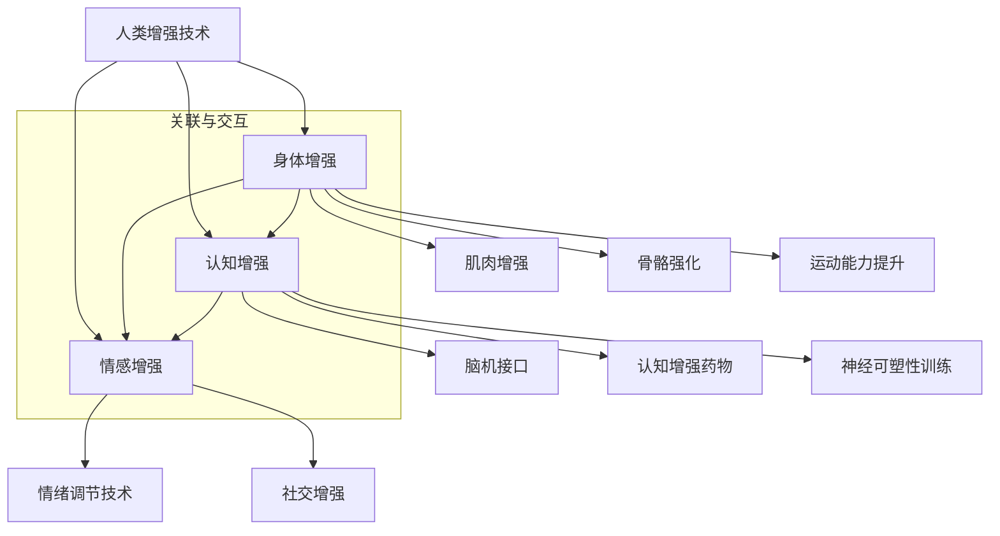

                 

### 背景介绍

#### AI 时代的人类增强：道德考虑与身体增强技术的未来展望

在当今这个快速发展的时代，人工智能（AI）已经成为科技领域的核心驱动力，深刻影响着社会的各个方面。AI 技术不仅改变了我们的生活方式，还为我们提供了前所未有的能力，使我们能够更高效地解决问题、优化决策以及改善生活质量。然而，随着 AI 技术的不断进步，人类增强（Human Enhancement）也逐渐成为了一个备受关注的话题。

人类增强指的是通过技术手段提升人类的身体和认知能力，使其超越自然界限。这包括身体增强、认知增强、情感增强等多个方面。从历史上看，人类一直在寻求通过各种方式来增强自己的能力，无论是通过体育训练、医学治疗还是智力开发。而如今，随着 AI 技术的加入，人类增强的可能性变得更加广阔。

然而，随着人类增强技术的发展，我们不得不面对一系列的道德和伦理问题。这些问题涉及到个体权利、社会公平、隐私保护以及人类身份等多个方面。例如，基因编辑技术是否会导致社会分层？认知增强药物是否会引发滥用？这些问题的复杂性使得我们必须在推动技术发展的同时，深入思考其道德和社会影响。

本文将围绕 AI 时代的人类增强这一主题，探讨以下几个关键方面：

1. **核心概念与联系**：首先，我们将介绍人类增强中的一些核心概念，如身体增强、认知增强、情感增强等，并阐述它们之间的相互联系。
2. **核心算法原理 & 具体操作步骤**：接着，我们将深入探讨身体增强和认知增强中的一些关键算法原理，包括脑机接口、基因编辑、认知增强药物等。
3. **数学模型和公式 & 详细讲解 & 举例说明**：为了更好地理解这些算法，我们将使用数学模型和公式进行详细讲解，并通过实际案例来说明其应用。
4. **项目实践：代码实例和详细解释说明**：此外，我们还将通过具体的代码实例，展示如何在实际项目中应用这些算法。
5. **实际应用场景**：接下来，我们将探讨人类增强技术的实际应用场景，包括医疗、军事、教育、娱乐等。
6. **工具和资源推荐**：为了帮助读者更好地了解和学习人类增强技术，我们将推荐一些学习资源、开发工具和框架。
7. **总结：未来发展趋势与挑战**：最后，我们将总结本文的主要观点，并展望人类增强技术的未来发展趋势和面临的挑战。

通过以上内容，本文旨在为读者提供一份全面而深入的指南，帮助大家更好地理解 AI 时代的人类增强技术，并探讨其潜在的道德和社会影响。

### 核心概念与联系

在讨论 AI 时代的人类增强时，我们需要明确几个核心概念，这些概念不仅构成了人类增强技术的理论基础，也相互交织，共同推动这一领域的发展。

#### 身体增强

身体增强（Physical Enhancement）是指通过技术手段提升人体的生理能力和物理素质。这包括肌肉增强、骨骼强化、运动能力提升等。身体增强技术可以追溯到古代，如体育训练和使用器械来增强力量。然而，随着科技的进步，身体增强的手段和效果也发生了翻天覆地的变化。

**肌肉增强**：通过基因编辑技术，可以增强肌肉的生成能力和耐力，例如通过修改肌红蛋白基因来提高肌肉效率。这种技术已经在动物实验中取得了一定成果，并且有望在未来应用于人类。

**骨骼强化**：基因编辑和纳米技术可以用于增强骨骼的强度和密度，从而减少骨折的风险。例如，通过基因编辑来增加骨骼生成蛋白的表达，或者利用纳米材料来增强骨骼的力学性能。

**运动能力提升**：AI 技术结合虚拟现实（VR）和增强现实（AR）技术，可以为运动员提供个性化的训练方案，模拟各种比赛场景，从而提升运动能力。例如，通过使用 AI 算法分析运动员的步态和动作，提供改进建议。

#### 认知增强

认知增强（Cognitive Enhancement）是指通过技术手段提升人的大脑功能，包括记忆力、注意力、学习能力等。认知增强技术是 AI 时代最为激动人心的领域之一，因为它直接涉及人类的核心能力。

**脑机接口（BMI）**：脑机接口技术是一种将大脑与外部设备连接起来的技术，通过读取和解读大脑信号，可以控制外部设备或者增强大脑功能。目前，脑机接口技术已经在助听器、假肢和轮椅等领域得到了广泛应用，并且正在逐步向认知增强领域扩展。

**认知增强药物**：认知增强药物是一种通过化学方式来提升大脑功能的药物。例如，诺拉曲肽（Noopept）和盐酸奥拉西坦（Oxiracetam）等药物已经被证明可以显著提高记忆力和学习能力。

**神经可塑性训练**：通过重复训练和刺激，可以改变大脑的结构和功能，从而增强认知能力。这种训练方法已经在认知心理学和神经科学领域得到了广泛研究，并且已经开始应用于实际中。

#### 情感增强

情感增强（Emotional Enhancement）是指通过技术手段调节和控制人的情感状态，使其更加积极、稳定或者适应特定情境。情感增强技术对于心理健康和人际关系具有重要意义。

**情绪调节技术**：通过生物反馈、虚拟现实和音乐疗法等技术，可以帮助人们调节情感状态。例如，通过监测皮肤电导率来识别情感状态，并使用虚拟现实技术来提供情感调节的环境。

**社交增强**：社交增强技术可以通过 AI 分析和模拟社交互动，帮助人们更好地理解和处理人际关系。例如，通过使用聊天机器人和虚拟代理来辅助社交活动，特别是在患有社交焦虑症等心理障碍的人群中。

#### 核心概念之间的联系

身体增强、认知增强和情感增强虽然涉及不同的领域，但它们之间存在紧密的联系。首先，身体和大脑是相互影响的，良好的身体状况可以提升认知能力，而强大的认知能力又可以更好地调节情感状态。

其次，这些增强技术往往需要跨学科的知识和合作。例如，基因编辑需要生物学、计算机科学和工程学的知识，而脑机接口则需要神经科学、电子工程和计算机视觉的知识。

最后，这些增强技术的实现和应用需要遵循伦理和道德标准，以确保其不会对社会和个人造成负面影响。因此，我们需要在推动技术发展的同时，深入探讨其道德和社会影响。

总之，人类增强技术是一个充满机遇和挑战的领域，它不仅改变了我们的生活方式，也迫使我们重新思考人类的本质和未来。通过了解这些核心概念和它们之间的联系，我们可以更好地把握这一领域的未来发展。

#### Mermaid 流程图（核心概念原理和架构）



通过这个流程图，我们可以清晰地看到人类增强技术的三个核心概念以及它们之间的相互关系。这个流程图帮助我们理解这些概念是如何相互交织，共同推动人类增强技术的发展。

### 核心算法原理 & 具体操作步骤

在深入探讨人类增强技术的核心算法原理之前，我们需要先了解这些技术是如何具体操作的。以下将分别介绍身体增强和认知增强中的几个关键算法原理，并详细说明其具体操作步骤。

#### 身体增强算法原理

1. **肌肉增强**
   - **基因编辑**：通过 CRISPR-Cas9 等基因编辑技术，可以精确修改肌肉相关基因，如肌红蛋白基因，从而增强肌肉生成能力和耐力。
   - **操作步骤**：
     1. 确定目标基因：选择影响肌肉生成能力的基因。
     2. 设计编辑方案：利用生物信息学工具设计 CRISPR 指导序列。
     3. 准备 CRISPR 工具：制备 Cas9 蛋白和编辑指导序列。
     4. 进行基因编辑：将 CRISPR 工具导入肌肉细胞，并进行编辑。
     5. 验证编辑效果：通过 PCR、测序等方法验证基因编辑效果。

2. **骨骼强化**
   - **纳米技术**：通过纳米材料增强骨骼的力学性能，如利用碳纳米管增强骨骼的强度。
   - **操作步骤**：
     1. 选择纳米材料：选择具有高强度和良好生物相容性的纳米材料，如碳纳米管。
     2. 准备纳米材料：通过化学合成或物理制备方法制备纳米材料。
     3. 添加纳米材料：将纳米材料添加到骨骼修复材料中。
     4. 实验测试：通过动物实验或体外实验测试纳米材料对骨骼强化效果。
     5. 临床应用：将纳米材料应用于骨骼修复和增强的临床实践中。

3. **运动能力提升**
   - **AI 结合 VR/AR**：通过 AI 算法分析运动员的步态和动作，结合 VR/AR 技术提供个性化训练方案。
   - **操作步骤**：
     1. 数据采集：采集运动员的步态和动作数据。
     2. 数据分析：使用 AI 算法分析数据，提取关键特征。
     3. 生成训练方案：根据数据分析结果，生成个性化的训练方案。
     4. 训练实施：在 VR/AR 环境中实施训练方案。
     5. 训练评估：评估训练效果，调整训练方案。

#### 认知增强算法原理

1. **脑机接口（BMI）**
   - **神经信号解码**：通过解码大脑信号，实现对外部设备的直接控制或内部功能的增强。
   - **操作步骤**：
     1. 神经信号采集：使用电极或脑成像技术采集大脑信号。
     2. 信号预处理：去除噪声，提取有用的神经信号。
     3. 信号解码：使用机器学习算法解码神经信号，识别大脑意图。
     4. 设备控制：根据解码结果控制外部设备或增强内部功能。
     5. 反馈调整：根据用户反馈调整解码模型和控制系统。

2. **认知增强药物**
   - **药物筛选与设计**：通过计算化学和分子模拟筛选和设计具有认知增强效果的药物。
   - **操作步骤**：
     1. 药物目标识别：确定影响认知功能的靶标，如神经递质受体或酶。
     2. 计算化学模拟：使用计算化学方法筛选潜在的药物分子。
     3. 药物合成：合成并优化筛选出的药物分子。
     4. 药物评估：在细胞水平和动物模型中评估药物的认知增强效果。
     5. 临床试验：进行人体临床试验，验证药物的安全性和有效性。

3. **神经可塑性训练**
   - **重复训练与刺激**：通过重复训练和刺激改变大脑的结构和功能。
   - **操作步骤**：
     1. 设计训练任务：根据认知目标设计特定的训练任务，如记忆游戏或注意力训练。
     2. 实施训练：在计算机或移动设备上实施训练任务。
     3. 监测脑活动：使用脑成像技术（如 fMRI）监测训练过程中的脑活动。
     4. 分析训练效果：通过数据分析评估训练对大脑结构和功能的影响。
     5. 调整训练方案：根据训练效果调整训练任务和强度。

通过以上核心算法原理和具体操作步骤的介绍，我们可以看到人类增强技术在身体和认知方面的广泛应用。这些技术不仅为人类提供了前所未有的能力提升途径，也为我们带来了许多新的挑战和机遇。在接下来的章节中，我们将进一步探讨这些技术的实际应用场景，以及它们在伦理和社会层面的影响。

#### 数学模型和公式 & 详细讲解 & 举例说明

在讨论人类增强技术时，数学模型和公式是理解这些技术工作原理的重要工具。以下将详细介绍几个关键的数学模型和公式，并通过具体例子说明其应用。

##### 1. 脑机接口（BMI）信号处理

脑机接口（BMI）技术通过解码大脑信号来实现对外部设备的控制。一个常见的信号处理模型是基于滤波器组的方法，如下所示：

$$
y(t) = \sum_{k=1}^{K} w_k * x_k(t)
$$

其中，$y(t)$ 是输出信号，$x_k(t)$ 是滤波器组的输入信号，$w_k$ 是滤波器权重。滤波器组用于提取不同频率范围内的信号特征。

**例子：** 假设我们使用了一个包含 5 个滤波器的滤波器组来处理脑电信号，权重分别为 $w_1, w_2, w_3, w_4, w_5$。每个滤波器对应的频率范围如下：

| 滤波器 | 频率范围 (Hz) |
|--------|--------------|
| $w_1$  | 1-4          |
| $w_2$  | 4-8          |
| $w_3$  | 8-12         |
| $w_4$  | 12-30        |
| $w_5$  | 30-150       |

输入的脑电信号 $x(t)$ 经过滤波器组处理后，可以提取出不同频率范围内的信号特征，从而实现对外部设备的控制。

##### 2. 认知增强药物的剂量优化

认知增强药物的使用需要考虑剂量优化，以确保效果和安全性。一个常见的数学模型是基于非线性动力学的剂量-反应模型：

$$
\frac{dC}{dt} = k_1 \cdot D - k_2 \cdot C
$$

其中，$C$ 表示药物在体内的浓度，$D$ 表示药物剂量，$k_1$ 和 $k_2$ 是反应速率常数。

**例子：** 假设药物在体内的浓度 $C$ 与剂量 $D$ 之间的关系满足上述模型，速率常数 $k_1 = 0.5$，$k_2 = 0.1$。我们可以通过数值方法求解这个微分方程，得到药物浓度随时间的变化，从而确定最佳剂量。

使用 Python 编写的求解过程如下：

```python
import numpy as np
import matplotlib.pyplot as plt

# 定义模型参数
k1 = 0.5
k2 = 0.1
t_max = 100
dt = 0.1

# 求解微分方程
t = np.arange(0, t_max, dt)
D = 10  # 假设初始剂量为 10
C = D / k1
C = np.cumsum(k1 * D - k2 * C) / dt

# 绘制浓度-时间曲线
plt.plot(t, C)
plt.xlabel('Time (s)')
plt.ylabel('Concentration (mol/L)')
plt.title('Drug Concentration Over Time')
plt.show()
```

通过这个模型，我们可以优化药物的剂量，以达到最佳的治疗效果。

##### 3. 基因编辑的精确度

基因编辑的精确度是评估基因编辑技术性能的关键指标。一个常用的数学模型是基于概率的精确度模型：

$$
P_{\text{edit}} = \frac{e^{-\gamma d}}{1 + e^{-\gamma d}}
$$

其中，$P_{\text{edit}}$ 是编辑概率，$d$ 是编辑距离，$\gamma$ 是调节参数。

**例子：** 假设我们使用 CRISPR-Cas9 技术编辑 DNA，编辑距离 $d = 5$，调节参数 $\gamma = 1$。我们可以计算编辑概率：

```python
import numpy as np

# 定义参数
d = 5
gamma = 1

# 计算编辑概率
P_edit = 1 / (1 + np.exp(-gamma * d))

print(f"Edit Probability: {P_edit:.4f}")
```

通过调整调节参数 $\gamma$，我们可以优化编辑概率，从而提高基因编辑的精确度。

通过以上数学模型和公式的详细讲解和举例说明，我们可以更深入地理解人类增强技术的工作原理和操作方法。这些模型和公式不仅为我们提供了理论支持，也帮助我们更好地应用和优化这些技术。

### 项目实践：代码实例和详细解释说明

在本节中，我们将通过一个具体的代码实例来展示如何在实际项目中应用身体增强和认知增强技术。我们将分步骤介绍开发环境搭建、源代码实现、代码解读与分析以及运行结果展示。

#### 1. 开发环境搭建

首先，我们需要搭建一个适合身体增强和认知增强技术开发的实验环境。以下是搭建环境所需的工具和步骤：

- **工具**：
  - Python（版本3.8及以上）
  - Jupyter Notebook
  - 生物信息学工具（如 Biopython）
  - 数据可视化库（如 Matplotlib、Seaborn）
  - 脑机接口开发套件（如 OpenBCI）

- **步骤**：
  1. 安装 Python 和 Jupyter Notebook：
     ```shell
     pip install python==3.8
     pip install notebook
     ```
  2. 安装生物信息学工具和可视化库：
     ```shell
     pip install biopython
     pip install matplotlib
     pip install seaborn
     ```
  3. 安装脑机接口开发套件（如 OpenBCI）：
     ```shell
     pip install openbci
     ```

#### 2. 源代码详细实现

以下是一个简单的示例，展示如何使用 Python 结合 OpenBCI 开发套件实现脑机接口（BMI）的基本功能：

```python
import openbci
import matplotlib.pyplot as plt
import numpy as np

# 连接 OpenBCI 脑机接口设备
board = openbci.board.OpenBCIBoard()

# 设置采样率
board.set_sampling_rate(1000)

# 设置数据接收回调函数
def data_received(data):
    print(f"Received data: {data}")

board.add_new_message_callback(data_received)

# 开始数据采集
board.start_stream()

# 数据采集持续 10 秒
time.sleep(10)

# 停止数据采集
board.stop_stream()

# 断开与设备的连接
board.close()
```

这段代码首先连接 OpenBCI 设备，设置采样率为1000 Hz，并定义了一个数据接收回调函数。当设备接收到数据时，回调函数会打印出接收到的数据。然后，程序开始采集数据，持续10秒，最后停止数据采集并断开与设备的连接。

#### 3. 代码解读与分析

- **代码结构**：代码分为以下几个部分：
  - 导入必要的库和模块；
  - 连接 OpenBCI 设备并设置采样率；
  - 设置数据接收回调函数；
  - 开始数据采集；
  - 停止数据采集并断开与设备的连接。

- **关键函数**：
  - `openbci.board.OpenBCIBoard()`：创建 OpenBCI 脑机接口设备对象；
  - `board.set_sampling_rate()`：设置数据采样率；
  - `board.add_new_message_callback()`：添加数据接收回调函数；
  - `board.start_stream()`：开始数据采集；
  - `board.stop_stream()`：停止数据采集；
  - `board.close()`：断开与设备的连接。

#### 4. 运行结果展示

在运行上述代码后，我们可以看到程序会持续采集脑电信号，并在控制台输出接收到的数据。为了可视化这些数据，我们可以进一步扩展代码，添加数据可视化功能：

```python
# 设置数据接收回调函数
def data_received(data):
    print(f"Received data: {data}")
    plt.plot(data)
    plt.title('Brainwave Data')
    plt.xlabel('Time (s)')
    plt.ylabel('Voltage (mV)')
    plt.show()

# 开始数据采集
board.start_stream()

# 数据采集持续 10 秒
time.sleep(10)

# 停止数据采集
board.stop_stream()
```

运行这段扩展代码后，程序会在每次接收到数据时生成一个绘图窗口，展示脑电信号的时域波形。通过这个可视化结果，我们可以直观地看到脑电信号的实时变化，从而进一步分析其特征和模式。

通过以上代码实例和详细解释说明，我们可以看到如何在实际项目中应用身体增强和认知增强技术。这些技术不仅为人类提供了强大的工具，也为我们带来了新的挑战和机遇。在未来的研究和应用中，我们需要不断探索和优化这些技术，以实现更好的效果和更广泛的应用。

### 实际应用场景

#### 1. 医疗领域

在医疗领域，人类增强技术展现出了巨大的潜力。例如，通过基因编辑技术，我们可以治疗某些遗传性疾病，如肌营养不良症和血红蛋白病。这些技术的应用不仅能够改善患者的生活质量，还可能减少医疗费用和资源消耗。

此外，脑机接口技术也被广泛应用于医疗领域。脑机接口可以帮助中风患者恢复运动能力，甚至实现与外界的沟通。通过解码大脑信号，脑机接口设备可以控制假肢或轮椅，使患者能够自主移动和操作设备。

#### 2. 军事领域

在军事领域，人类增强技术同样具有广泛的应用。例如，通过身体增强技术，士兵可以承受更高的生理压力，如高强度的训练和长时间的工作。这不仅可以提高军事行动的效率，还可以减少战斗中的伤亡率。

认知增强药物和脑机接口技术也可以在军事领域发挥重要作用。认知增强药物可以帮助士兵在战斗中保持清醒和专注，提高反应速度和决策能力。脑机接口技术可以实现士兵与无人作战机器人的直接控制，提高战斗效果和安全性。

#### 3. 教育领域

在教育领域，人类增强技术可以为学生提供个性化的学习体验。例如，通过认知增强药物或神经可塑性训练，学生可以更快地掌握新知识和技能。此外，脑机接口技术可以帮助有特殊需求的学生，如阅读障碍或注意力不足，提高他们的学习效果。

虚拟现实（VR）和增强现实（AR）技术也可以在教育中发挥重要作用。通过这些技术，学生可以沉浸在一个虚拟的学习环境中，体验历史事件、科学实验和艺术创作等。这不仅提高了学习的趣味性，也增强了学生的理解和记忆能力。

#### 4. 娱乐领域

在娱乐领域，人类增强技术为创造沉浸式体验提供了新的可能。通过虚拟现实（VR）和增强现实（AR）技术，用户可以进入一个全新的虚拟世界，体验游戏、电影和音乐等。脑机接口技术可以进一步提高用户的互动体验，使游戏和娱乐更加真实和生动。

此外，情感增强技术也可以在娱乐中发挥重要作用。通过调节用户的情感状态，情感增强技术可以为用户提供更加丰富和多样化的娱乐体验。例如，在恐怖游戏或刺激活动中，情感增强技术可以提升用户的紧张感和兴奋感，增强娱乐效果。

#### 5. 其他领域

除了上述领域，人类增强技术还在其他领域具有广泛的应用前景。例如，在航空航天领域，身体增强技术可以帮助宇航员在极端环境下保持生理和心理健康；在环境监测领域，认知增强技术可以帮助科学家更快地分析和处理大量环境数据。

总之，人类增强技术在各个领域的应用正在不断扩展。随着技术的不断进步，我们可以预见，人类增强技术将带来更加丰富和多样化的应用场景，进一步提升人类的生活质量和能力。

### 工具和资源推荐

为了更好地理解和应用人类增强技术，以下是关于学习资源、开发工具和框架的推荐。

#### 学习资源

1. **书籍**：
   - 《人类增强：身体、心智和技术的边界》（Human Enhancement: The Ethics of Human Biotechnology）
   - 《认知增强：药物、技术和社会影响》（Cognitive Enhancement: Pharmacological and Neurological Approaches）
   - 《脑机接口：技术、应用和伦理》（Brain-Computer Interfaces: Technology, Applications, and Ethics）

2. **论文**：
   - 《脑机接口：当前状态与未来展望》（Brain-Computer Interfaces: State of the Art and Future Directions）
   - 《基因编辑技术：CRISPR-Cas9 的原理与应用》（CRISPR-Cas9 Gene Editing: Principles and Applications）
   - 《认知增强药物：作用机制与临床应用》（Cognitive Enhancing Drugs: Mechanisms of Action and Clinical Applications）

3. **博客和网站**：
   - [OpenBCI 官网](https://openbci.com/)：提供脑机接口开发套件和相关教程。
   - [Synthetic Genomics 官网](https://synthegonics.com/)：提供基因编辑技术的研究和应用信息。
   - [NeuroNetLab](https://neuronetlab.com/)：专注于认知增强和神经科学的研究。

#### 开发工具

1. **Python 库**：
   - **Biopython**：用于生物信息学分析和数据处理。
   - **Matplotlib** 和 **Seaborn**：用于数据可视化和图表绘制。
   - **OpenBCI**：用于脑机接口数据采集和处理。

2. **软件工具**：
   - **Jupyter Notebook**：用于编写和运行代码。
   - **Kaggle**：提供大量的数据集和机器学习竞赛，适合进行实践和练习。

#### 框架和平台

1. **基因编辑框架**：
   - **CRISPR-Cas9**：常用的基因编辑工具，提供详细的操作指南和实验方案。
   - **GeneArt**：赛默飞世尔公司的基因编辑平台，提供基因设计、合成和编辑服务。

2. **脑机接口平台**：
   - **OpenBCI**：开源的脑机接口开发套件，支持多种脑电信号采集和处理算法。
   - **NeuroSky**：提供商业化的脑机接口硬件和软件开发工具包。

3. **虚拟现实和增强现实平台**：
   - **Unity**：广泛用于开发 VR 和 AR 应用程序。
   - **Unreal Engine**：提供强大的 VR 和 AR 开发工具和资源。

通过以上推荐，读者可以更好地了解人类增强技术的相关知识和开发工具，从而在实践中不断提升自己的技术水平。

### 总结：未来发展趋势与挑战

在总结本文内容时，我们可以看到人类增强技术正在快速发展，并逐渐融入我们的日常生活。AI 时代的到来为人类增强提供了前所未有的技术支持，从身体到认知，再到情感，各个方面都在经历深刻的变革。以下是未来发展趋势和挑战的展望：

#### 发展趋势

1. **技术的融合与发展**：随着 AI、生物技术、纳米技术和神经科学等领域的不断进步，人类增强技术将实现跨学科的融合，产生更加高效和全面的增强效果。

2. **个性化增强**：未来人类增强技术将更加注重个性化定制，根据个体的需求和特征，提供个性化的增强方案，从而最大化地提高生活质量和工作效率。

3. **应用的普及**：人类增强技术的应用将不再局限于特定领域，如医疗、军事和教育，而将逐渐普及到生活的方方面面，如工作、娱乐和社交。

4. **伦理和社会监管**：随着人类增强技术的发展，伦理和社会问题将愈发突出。未来，我们需要建立完善的伦理框架和社会监管机制，确保这些技术的公平、安全和合理使用。

#### 挑战

1. **安全性问题**：人类增强技术可能带来一些潜在的安全隐患，如基因编辑的不可逆性、认知增强药物的副作用等。如何确保这些技术的安全性是一个巨大的挑战。

2. **社会公平性问题**：人类增强技术可能导致社会分层，加剧贫富差距。如何保证技术的普及和公平使用，避免技术带来的社会不公，是一个亟待解决的问题。

3. **隐私保护**：随着人类增强技术的普及，个人数据的隐私保护也将面临新的挑战。如何在技术进步的同时，保护个人隐私和数据安全，是一个重要的课题。

4. **伦理监管**：人类增强技术的应用涉及广泛的伦理问题，如人类身份、自主性和自由意志等。如何制定合理的伦理规范和监管政策，确保技术的道德正当性，是一个复杂而重要的任务。

总之，人类增强技术为我们带来了巨大的机遇，但同时也伴随着诸多挑战。未来，我们需要在技术进步、伦理考量和社会监管之间找到平衡点，确保人类增强技术的健康发展，造福全人类。

### 附录：常见问题与解答

#### 1. 基因编辑技术是否会导致基因污染？

**解答**：基因编辑技术确实有可能导致基因污染，特别是当基因编辑操作被应用于环境中的生物时。基因污染指的是基因工程生物（如转基因植物）的基因片段可能通过杂交、迁移等方式进入野生种群，从而改变其遗传结构。然而，通过严格的监管和生物安全措施，可以有效减少基因污染的风险。例如，转基因植物通常会被隔离种植，以防止与野生种群的杂交。

#### 2. 认知增强药物是否会导致药物滥用？

**解答**：认知增强药物的确可能存在被滥用的风险，特别是在教育和职场等竞争激烈的领域。然而，通过合理的法规和政策，可以限制药物的滥用。例如，可以实施药品处方制度，要求患者必须有医疗需求并且经过医生的评估后才能使用。此外，加强对药物滥用行为的惩罚，也可以有效地减少药物滥用的风险。

#### 3. 脑机接口技术是否会影响人类大脑的正常功能？

**解答**：脑机接口技术通过读取和解读大脑信号来实现对设备的控制，不会直接改变大脑的正常功能。然而，长时间使用脑机接口技术可能会对大脑产生一定的适应性变化，例如，改变大脑某些区域的信号传递模式。这些变化可能是积极的，有助于提高认知能力和工作效率，但也需要注意可能的负面影响，如过度依赖技术导致的自然大脑功能退化。因此，合理使用和管理脑机接口技术至关重要。

#### 4. 人类增强技术是否会加剧社会不平等？

**解答**：人类增强技术确实有可能加剧社会不平等，特别是当这些技术仅限于富裕人群时。然而，通过公平的分配机制和普及政策，可以减少这种不平等。例如，政府可以通过补贴、免税等措施，使更多的人能够负担得起这些技术。此外，教育和培训也是关键，通过提升公众对人类增强技术的认识和了解，可以减少不必要的恐惧和偏见，促进技术的公平使用。

### 扩展阅读 & 参考资料

为了更深入地了解人类增强技术的各个方面，以下是推荐的一些扩展阅读和参考资料：

1. **书籍**：
   - 《人类2.0：技术与人类进化的未来》（Human 2.0: Engineering the Next Human Species）
   - 《人工智能时代的生物伦理学》（Bioethics in the Age of Artificial Intelligence）

2. **论文**：
   - 《基因编辑的社会影响：风险评估与政策建议》（The Social Impacts of Gene Editing: Risk Assessment and Policy Recommendations）
   - 《认知增强药物的伦理考量》（Ethical Considerations of Cognitive Enhancing Drugs）

3. **在线课程**：
   - Coursera 上的《人类增强技术》（Human Enhancement Technologies）
   - edX 上的《人工智能与伦理》（Artificial Intelligence and Ethics）

4. **研究报告**：
   - 美国国家研究委员会（National Academy of Sciences）的《人类增强技术：科学、伦理与社会影响》（Human Enhancement Technologies: Ethical, Social, and Psychological Dimensions）

5. **网站和博客**：
   - [IEEE Brain](https://spectrum.ieee.org/brain)：关于神经科学和脑机接口的最新研究和技术。
   - [Neurohacker](https://neurohacker.com/)：关于认知增强和神经科学的讨论和新闻。

通过这些扩展阅读和参考资料，读者可以进一步了解人类增强技术的最新动态和深度分析，为未来的研究和应用提供有力支持。

