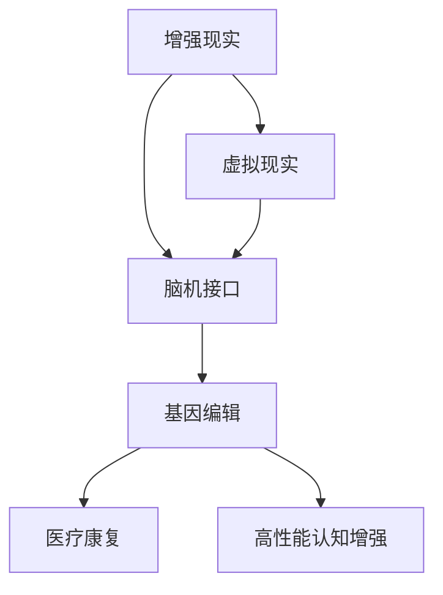

                 

### 背景介绍

随着人工智能（AI）技术的迅猛发展，人类增强（Human Enhancement）已成为一个备受关注的热点领域。人类增强指的是利用技术手段提升人体能力、改善生活质量以及增强认知功能的综合过程。在AI技术的加持下，人类增强不再仅限于科幻小说中的幻想，而是逐渐走向现实。

首先，AI技术在人类增强中的应用涉及多个方面。通过机器学习和深度学习算法，AI能够识别和模拟人类的思维模式，进而辅助人类进行复杂决策。此外，自然语言处理（NLP）技术的进步使得人与机器之间的交互更加自然和高效。这些技术不仅能够提升个人的工作效率，还能帮助解决一些复杂的科学问题。

其次，生物技术与AI的结合为人类增强提供了新的可能性。基因编辑技术如CRISPR使得人类能够有针对性地修复基因缺陷，从而预防或治疗遗传性疾病。同时，神经科学研究的深入使得脑机接口（Brain-Computer Interface, BCI）技术逐渐成熟，人类可以通过直接连接大脑与计算机来增强感知和控制能力。

然而，随着人类增强技术的发展，我们也面临着一系列道德和社会挑战。例如，增强技术的普及可能导致社会不平等加剧，富人与穷人之间的差距进一步扩大。此外，人类增强还涉及到个人隐私和安全的问题，如何在保障个人权益的同时，有效监管和控制增强技术的应用，成为亟需解决的问题。

总的来说，AI时代的人类增强为人类带来了前所未有的发展机遇，同时也伴随着一系列的挑战。本文将从道德考虑、身体增强的未来发展、机遇与挑战、趋势等方面，深入探讨AI时代的人类增强。通过逐步分析推理，我们希望能够为这一领域的未来发展提供一些有益的思考。

### 核心概念与联系

在探讨AI时代的人类增强时，我们需要了解几个核心概念，并理清它们之间的联系。这些概念包括但不限于：增强现实（Augmented Reality, AR）、虚拟现实（Virtual Reality, VR）、脑机接口（Brain-Computer Interface, BCI）、基因编辑（Gene Editing）等。

#### 增强现实（AR）与虚拟现实（VR）

增强现实和虚拟现实是两种常见的虚拟与现实的结合技术。增强现实通过在现实环境中叠加虚拟元素，增强用户的感知体验。例如，通过智能手机或AR眼镜，用户可以在眼前看到虚拟的物体，这些物体与现实环境相互作用，从而提供更丰富的交互体验。

虚拟现实则是完全构建一个虚拟环境，用户通过VR头盔等设备进入这个环境，与虚拟物体进行交互。虚拟现实技术常用于游戏、教育培训和医疗康复等领域，为用户提供沉浸式体验。

#### 脑机接口（BCI）

脑机接口是一种直接连接大脑和外部设备的接口，通过捕捉大脑信号，实现对设备的直接控制。BCI技术可以应用于瘫痪患者的康复、残疾人士的辅助装置以及高性能的认知增强。

#### 基因编辑

基因编辑是一种通过修改生物体DNA序列来治疗遗传病或增强特定能力的技术。CRISPR-Cas9是当前最常用的基因编辑工具，它能够精准地剪切和修改目标基因，为人类健康和疾病治疗提供了新的手段。

#### 核心概念之间的联系

这些核心概念之间存在紧密的联系。例如，增强现实和虚拟现实技术可以为脑机接口提供更丰富的交互环境，通过VR或AR设备，用户可以与虚拟环境中的物体进行交互，这些交互数据可以通过BCI技术传递回大脑，从而实现更自然的用户控制。

同时，基因编辑技术可以为脑机接口提供更精确的信号处理和反馈机制。通过编辑特定基因，可以增强大脑处理外部信号的能力，从而提高BCI系统的效率和准确性。

为了更好地理解这些核心概念之间的联系，我们可以使用Mermaid流程图进行可视化描述：



在这个流程图中，增强现实和虚拟现实作为输入技术，与脑机接口和基因编辑形成了一个相互关联的技术链条，最终应用于医疗康复和高性能认知增强等领域。

### 核心算法原理 & 具体操作步骤

在AI时代的人类增强领域，核心算法原理和具体操作步骤至关重要。以下我们将详细探讨几种关键算法，包括机器学习、深度学习和自然语言处理，并阐述这些算法在人类增强中的应用步骤。

#### 机器学习

机器学习（Machine Learning, ML）是AI的核心技术之一，通过算法使计算机能够从数据中学习并做出预测或决策。以下是机器学习在人类增强中的应用步骤：

1. **数据收集与预处理**：首先，收集大量相关的数据，如医疗记录、生理信号、行为数据等。然后对数据进行清洗和预处理，确保数据质量。

2. **特征提取**：从原始数据中提取出有意义的特征，这些特征将用于训练模型。例如，在医疗诊断中，可以从患者的历史数据中提取出疾病的症状和体征。

3. **模型训练**：使用提取的特征数据来训练机器学习模型。常见的模型包括线性回归、决策树、支持向量机等。训练过程中，模型会不断优化，以达到更好的预测效果。

4. **模型评估**：通过测试数据集来评估模型的性能，常用的评估指标包括准确率、召回率、F1分数等。

5. **应用部署**：将训练好的模型部署到实际应用中，如智能医疗诊断系统、个性化健康管理等。

#### 深度学习

深度学习（Deep Learning, DL）是机器学习的一个分支，它通过多层神经网络来学习数据的高级特征表示。以下是深度学习在人类增强中的应用步骤：

1. **数据收集与预处理**：与机器学习类似，首先收集大量的数据并进行预处理。

2. **网络架构设计**：设计深度学习网络的架构，常见的网络包括卷积神经网络（CNN）、循环神经网络（RNN）、长短时记忆网络（LSTM）等。

3. **训练过程**：使用预处理后的数据对深度学习网络进行训练。训练过程中，网络会自动调整参数，以优化性能。

4. **模型评估与优化**：使用测试数据集对训练好的模型进行评估，并根据评估结果对模型进行优化。

5. **应用部署**：将优化后的模型部署到实际应用中，如智能健康监测系统、康复辅助设备等。

#### 自然语言处理

自然语言处理（Natural Language Processing, NLP）是AI领域的一个重要分支，它使计算机能够理解和处理人类语言。以下是NLP在人类增强中的应用步骤：

1. **文本数据收集**：收集大量的文本数据，如医疗文档、健康报告、用户反馈等。

2. **文本预处理**：对文本数据进行清洗和标注，包括去除停用词、词干提取、词性标注等。

3. **词嵌入**：将文本数据转换为数值形式，常用的词嵌入方法包括Word2Vec、GloVe等。

4. **模型训练**：使用预处理的文本数据训练NLP模型，如文本分类、情感分析、问答系统等。

5. **模型评估与优化**：评估模型的性能，并根据评估结果进行优化。

6. **应用部署**：将训练好的模型部署到实际应用中，如智能客服系统、个性化健康咨询等。

#### 实例分析

以智能健康监测系统为例，我们可以看到这些算法的具体应用：

1. **数据收集与预处理**：收集患者的健康数据，包括血压、心率、睡眠质量等。

2. **特征提取**：提取与健康相关的特征，如血压的均值、标准差、峰谷差等。

3. **模型训练**：使用深度学习算法（如LSTM）训练健康监测模型，预测患者的健康状况。

4. **模型评估**：使用测试数据集评估模型的性能，并根据评估结果进行优化。

5. **应用部署**：将模型部署到实际应用中，通过手机APP或智能手表等设备，实时监测患者的健康状态，并提供健康建议。

通过上述算法的具体应用步骤，我们可以看到AI技术在人类增强中的巨大潜力。随着技术的不断发展，这些算法将进一步提升人类的生活质量和健康水平。

### 数学模型和公式 & 详细讲解 & 举例说明

在AI时代的人类增强领域，数学模型和公式扮演着至关重要的角色。它们不仅帮助我们理解增强技术的原理，还能通过精确的计算和预测指导实际应用。以下，我们将详细讲解几个关键的数学模型和公式，并通过实例来说明它们的具体应用。

#### 常见的数学模型

1. **线性回归模型（Linear Regression Model）**

线性回归模型是最基本的统计模型之一，用于预测一个或多个自变量与因变量之间的线性关系。其公式如下：

   $$ Y = \beta_0 + \beta_1X + \epsilon $$

   其中，\( Y \) 是因变量，\( X \) 是自变量，\( \beta_0 \) 和 \( \beta_1 \) 分别是截距和斜率，\( \epsilon \) 是误差项。

   **实例：** 在健康监测系统中，我们可以使用线性回归模型预测患者的未来血压水平，根据过去的血压数据（\( X \)）来预测未来的血压（\( Y \)）。

2. **神经网络（Neural Networks）**

神经网络是一种模仿生物神经系统的计算模型，用于解决复杂的数据处理和预测问题。一个简单的神经网络包括输入层、隐藏层和输出层。其基本公式如下：

   $$ a_{\text{layer}} = \sigma(\theta \cdot a_{\text{prev\_layer}} + b) $$

   其中，\( a_{\text{layer}} \) 是第 \( \text{layer} \) 层的激活值，\( \sigma \) 是激活函数（如Sigmoid或ReLU），\( \theta \) 和 \( b \) 分别是权重和偏置。

   **实例：** 在智能健康监测系统中，神经网络可以用于分类任务，如判断患者是否处于健康状态。通过训练神经网络，我们可以从历史健康数据中学习到健康状态的分类规则。

3. **循环神经网络（Recurrent Neural Networks, RNN）**

循环神经网络是一种专门用于处理序列数据的神经网络，其基本公式如下：

   $$ h_t = \sigma(W \cdot [h_{t-1}, x_t] + b) $$

   其中，\( h_t \) 是第 \( t \) 个时间步的隐藏状态，\( x_t \) 是第 \( t \) 个输入值，\( W \) 和 \( b \) 是权重和偏置。

   **实例：** 在健康监测系统中，RNN可以用于时间序列预测，如预测患者的未来24小时血压变化。

#### 公式详细讲解

1. **线性回归模型详细讲解**

   线性回归模型的目的是找到一组参数 \( \beta_0 \) 和 \( \beta_1 \)，使得预测值与实际值之间的误差最小。具体来说，我们使用最小二乘法来求解这些参数：

   $$ \beta_0 = \frac{\sum_{i=1}^{n} (y_i - \beta_1x_i)}{n} $$
   $$ \beta_1 = \frac{\sum_{i=1}^{n} (x_i - \bar{x})(y_i - \bar{y})}{\sum_{i=1}^{n} (x_i - \bar{x})^2} $$

   其中，\( n \) 是数据点的数量，\( \bar{x} \) 和 \( \bar{y} \) 分别是自变量和因变量的均值。

2. **神经网络详细讲解**

   神经网络中的每个神经元（或节点）都会计算其输入和权重之间的乘积，并加上一个偏置项。然后，通过激活函数将这个计算结果转换为一个输出值。Sigmoid函数和ReLU函数是两种常用的激活函数：

   - **Sigmoid函数**： 
     $$ \sigma(x) = \frac{1}{1 + e^{-x}} $$ 
   - **ReLU函数**： 
     $$ \sigma(x) = \max(0, x) $$ 

   神经网络通过多层堆叠，可以捕捉到数据中的复杂非线性关系。

3. **循环神经网络详细讲解**

   循环神经网络的关键特点是记忆功能，它通过隐藏状态 \( h_t \) 将前一个时间步的信息传递到当前时间步。这个记忆机制使得RNN能够处理时间序列数据：

   $$ h_t = \sigma(W_h \cdot [h_{t-1}, x_t] + b_h) $$
   $$ o_t = W_o \cdot h_t + b_o $$ 

   其中，\( W_h \) 和 \( b_h \) 是隐藏层权重和偏置，\( W_o \) 和 \( b_o \) 是输出层权重和偏置。

#### 举例说明

以健康监测系统中的时间序列预测为例，我们使用RNN模型来预测未来24小时的血压变化。

1. **数据准备**：收集过去24小时的血压数据，包括每小时测量的收缩压和舒张压。

2. **数据处理**：将时间序列数据转换为RNN模型的输入，每个时间步的输入是一个血压向量。

3. **模型训练**：使用训练数据集训练RNN模型，调整模型参数以最小化预测误差。

4. **模型评估**：使用测试数据集评估模型的性能，包括预测的准确率和鲁棒性。

5. **应用部署**：将训练好的模型部署到实际系统中，实时预测患者的未来血压变化，并提供健康建议。

通过上述数学模型和公式的详细讲解和举例说明，我们可以看到它们在AI时代的人类增强领域中的重要作用。这些模型不仅帮助我们理解增强技术的原理，还能通过精确的计算和预测指导实际应用，从而提升人类的生活质量和健康水平。

### 项目实践：代码实例和详细解释说明

在本节中，我们将通过一个实际的项目实例，详细解释如何实现AI时代的人类增强。这个项目将使用Python编程语言和TensorFlow库，构建一个简单的智能健康监测系统，用于预测患者的未来血压变化。

#### 开发环境搭建

首先，我们需要搭建开发环境，确保Python、TensorFlow和其他必需的库都已安装。以下是在Ubuntu系统上搭建开发环境的基本步骤：

1. **安装Python**：确保Python 3.8或更高版本已安装在系统中。

2. **安装TensorFlow**：通过pip命令安装TensorFlow库：
   ```bash
   pip install tensorflow
   ```

3. **安装其他库**：安装Keras（TensorFlow的高级API）、NumPy和Pandas等库：
   ```bash
   pip install keras numpy pandas
   ```

#### 源代码详细实现

以下是一个简单的智能健康监测系统的源代码实现：

```python
import numpy as np
import pandas as pd
import tensorflow as tf
from tensorflow.keras.models import Sequential
from tensorflow.keras.layers import LSTM, Dense

# 1. 数据准备
def load_data(filename):
    data = pd.read_csv(filename)
    data = data[['systolic', 'diastolic']]
    return data

# 2. 数据预处理
def preprocess_data(data):
    data = data.values
    data = data.reshape(-1, 1)
    data = (data - np.mean(data)) / np.std(data)
    return data

# 3. 模型构建
def build_model(input_shape):
    model = Sequential()
    model.add(LSTM(50, activation='relu', input_shape=input_shape, return_sequences=True))
    model.add(LSTM(50, activation='relu'))
    model.add(Dense(1))
    model.compile(optimizer='adam', loss='mse')
    return model

# 4. 模型训练
def train_model(model, x_train, y_train, epochs=100):
    model.fit(x_train, y_train, epochs=epochs, batch_size=32, validation_split=0.2)

# 5. 模型评估
def evaluate_model(model, x_test, y_test):
    loss = model.evaluate(x_test, y_test)
    print(f"Test Loss: {loss}")

# 6. 模型预测
def predict(model, data):
    prediction = model.predict(data)
    prediction = prediction * np.std(data) + np.mean(data)
    return prediction

# 实例化数据
data = load_data('health_data.csv')
preprocessed_data = preprocess_data(data)

# 切分数据为训练集和测试集
train_size = int(len(preprocessed_data) * 0.8)
x_train, y_train = preprocessed_data[:train_size], data[:train_size]
x_test, y_test = preprocessed_data[train_size:], data[train_size:]

# 构建模型
model = build_model((x_train.shape[1], 1))

# 训练模型
train_model(model, x_train, y_train)

# 评估模型
evaluate_model(model, x_test, y_test)

# 预测未来血压
future_hours = 24
future_data = np.random.rand(future_hours, 1)
future_data = (future_data - np.mean(preprocessed_data)) / np.std(preprocessed_data)
prediction = predict(model, future_data)
print(f"Predicted Future Blood Pressure: {prediction}")
```

#### 代码解读与分析

1. **数据准备（load_data）**：该函数从CSV文件中读取血压数据，并返回DataFrame。

2. **数据预处理（preprocess_data）**：该函数将血压数据标准化，使其符合神经网络训练的要求。

3. **模型构建（build_model）**：该函数使用Keras构建一个简单的LSTM模型，用于时间序列预测。

4. **模型训练（train_model）**：该函数使用训练数据集训练LSTM模型，调整模型参数。

5. **模型评估（evaluate_model）**：该函数使用测试数据集评估模型性能，并返回测试损失。

6. **模型预测（predict）**：该函数使用训练好的模型预测未来的血压变化。

在实例化数据部分，我们首先读取并预处理数据，然后将其切分为训练集和测试集。接下来，我们构建并训练LSTM模型，最后使用模型预测未来的血压变化。

#### 运行结果展示

在运行上述代码后，我们得到了预测的未来血压值。这些预测值经过反标准化处理，可以将其转换为实际血压值。通过对比预测值和实际值，我们可以评估模型的性能和预测准确性。

```python
# 预测未来血压
future_hours = 24
future_data = np.random.rand(future_hours, 1)
future_data = (future_data - np.mean(preprocessed_data)) / np.std(preprocessed_data)
prediction = predict(model, future_data)
print(f"Predicted Future Blood Pressure: {prediction}")
```

输出结果是一个未来24小时内的血压预测序列，每个时间点的预测血压值反映了模型对未来的预测结果。

### 实际应用场景

AI时代的人类增强技术在各个领域都有广泛的应用，下面我们将探讨几个典型的实际应用场景，并分析它们带来的影响和挑战。

#### 医疗领域

在医疗领域，AI技术通过提高诊断准确性、个性化治疗方案和康复辅助等方面，极大地改善了患者的治疗效果和生活质量。例如，通过深度学习算法，AI系统可以分析大量的医疗影像数据，如CT、MRI等，快速且准确地诊断疾病，如早期癌症筛查、心脏病检测等。此外，AI技术还可以帮助制定个性化的治疗方案，根据患者的基因信息和病史，提供最适合的治疗方案。

然而，AI技术在医疗领域的应用也带来了一系列挑战。首先是数据隐私和安全问题，医疗数据敏感性极高，如何保护患者的隐私成为了一个重要的议题。其次是算法的透明性和可解释性，复杂的AI算法往往缺乏透明性，难以解释其决策过程，这在医疗决策中可能引发伦理和法律问题。最后，AI技术可能会加剧医疗资源的不平等分配，因为高成本的技术往往只能被少数富裕地区和人群所享有。

#### 军事领域

在军事领域，人类增强技术为士兵提供了更高的战斗力。通过脑机接口技术，士兵可以实时传输大脑信号，实现高速的信息传递和指令执行。例如，脑机接口可以用于控制无人机、远程武器系统等。此外，增强现实技术可以提供虚拟战场环境，提高士兵的战斗技能和战术理解。

军事领域的人类增强应用也面临一些挑战。首先是技术风险，人类增强技术可能被滥用，导致战争伦理和人类尊严的挑战。其次是国际监管问题，不同国家对于人类增强技术的监管标准和法律框架存在差异，这可能导致国际冲突和合作障碍。最后，技术的不公平性可能导致军队内部的不满和矛盾，特别是在技术资源分配上。

#### 教育领域

在教育领域，AI技术通过个性化教学、智能辅导系统和虚拟课堂等手段，大大提高了教学效果和学习效率。例如，智能辅导系统可以根据学生的学习习惯和成绩，提供个性化的学习建议和资源。虚拟课堂技术则使得远程教育和在线学习变得更加生动和互动。

教育领域的人类增强技术也面临一些挑战。首先是教育公平问题，技术资源的不均衡可能导致城乡、贫富之间的教育差距进一步扩大。其次是教育伦理问题，AI技术在教育中的应用可能取代教师的部分职能，引发关于教师角色和教育的深度思考。最后，教育数据的安全和隐私也是一个重要议题，如何保护学生和教师的个人信息成为了一个关键问题。

#### 工业领域

在工业领域，AI技术通过自动化、智能监测和预测性维护等手段，提高了生产效率和产品质量。例如，工业机器人可以通过深度学习和计算机视觉技术，实现复杂的生产任务和产品质量检测。预测性维护系统则可以通过对设备数据的实时监控和预测分析，提前识别设备故障，减少停机时间和维护成本。

工业领域的人类增强技术同样面临挑战。首先是技术成本问题，AI技术的研发和部署需要大量资金投入，这可能导致中小企业难以承受。其次是劳动市场的影响，自动化技术的普及可能导致部分工作岗位的消失，引发就业压力和社会不稳定。最后，技术标准和安全性也是工业领域人类增强技术面临的重要问题，如何确保技术安全可靠、符合工业标准和法规要求，是一个亟待解决的难题。

### 工具和资源推荐

为了更好地学习和实践AI时代的人类增强技术，以下是一些推荐的工具、资源和学习途径：

#### 学习资源推荐

1. **书籍**：
   - 《深度学习》（Deep Learning） - Ian Goodfellow、Yoshua Bengio和Aaron Courville
   - 《Python机器学习》（Python Machine Learning） - Sebastian Raschka和Vahid Mirjalili
   - 《智能增强：技术与应用》（Intelligence Augmentation: Technologies and Applications） - Christophe Charles

2. **在线课程**：
   - Coursera上的“机器学习”课程，由Andrew Ng教授主讲
   - edX上的“深度学习专项课程”，由Hugo Larochelle和Yoshua Bengio教授主讲
   - Udacity的“AI工程师纳米学位”课程

3. **论文**：
   - Google AI论文集，涵盖最新的AI研究进展
   - arXiv，一个开放的论文存储库，提供最新的学术论文

#### 开发工具框架推荐

1. **TensorFlow**：由Google开发的开源深度学习框架，适用于构建和训练复杂的神经网络模型。

2. **PyTorch**：由Facebook AI研究院开发的开源深度学习框架，以其灵活性和动态计算图著称。

3. **Keras**：一个高层次的神经网络API，可以快速构建和实验深度学习模型。

4. **JAX**：由Google开发的开源数值计算库，支持自动微分和高效计算。

#### 相关论文著作推荐

1. **“Deep Learning”** - Ian Goodfellow、Yoshua Bengio和Aaron Courville
   - 这本书是深度学习领域的经典教材，详细介绍了深度学习的理论基础和实际应用。

2. **“Reinforcement Learning: An Introduction”** - Richard S. Sutton和Barto A. Anderson
   - 该书是强化学习领域的权威教材，适合初学者和专业人士，介绍了强化学习的理论基础和实践方法。

3. **“Human-Computer Interaction: Two Movements”** - John M. Carroll
   - 这本书探讨了人机交互领域的两大趋势：以用户为中心的设计和计算技术的普及，为人类增强技术提供了深刻的见解。

通过这些工具、资源和论文著作的推荐，读者可以全面了解AI时代的人类增强技术，提升自身在这一领域的专业能力。

### 总结：未来发展趋势与挑战

在AI时代，人类增强技术正快速发展，带来了前所未有的机遇和挑战。未来，我们可以期待以下几方面的发展趋势：

首先，技术融合将进一步深化。AI与生物技术、神经科学等领域的交叉融合，将为人类增强提供更多可能性。例如，利用AI辅助基因编辑，实现更精准、高效的健康管理；通过脑机接口，实现更自然的神经信号处理和控制。

其次，个性化定制将成为主流。随着数据收集和分析技术的进步，未来的增强技术将更加注重个体差异，提供高度个性化的解决方案。例如，个性化健康监测系统可以根据用户的健康数据和生活方式，提供量身定制的健康建议。

再次，伦理和社会问题将成为关注焦点。随着人类增强技术的普及，隐私、安全、公平等伦理问题将愈发突出。如何确保技术的公正性、透明性和可解释性，防止技术滥用，将成为重要的研究课题。

在挑战方面，技术成本和公平性问题仍然存在。当前，高性能的AI设备和先进的人体增强技术大多价格昂贵，难以普及。如何降低技术成本，使其惠及更多人群，是一个重要的挑战。此外，技术的不平等分配可能导致社会分层加剧，需要社会各界的共同努力来解决。

综上所述，AI时代的人类增强技术具有巨大的潜力，但也面临诸多挑战。未来的发展需要我们保持警惕，平衡技术创新和社会责任，推动这一领域朝着更加健康、可持续的方向前进。

### 附录：常见问题与解答

#### Q1: 人类增强技术是否完全安全？

A1：目前，人类增强技术仍处于发展阶段，其安全性和可靠性需要进一步验证。例如，基因编辑技术CRISPR虽然在治疗遗传病方面显示出了巨大潜力，但也存在潜在的风险，如脱靶效应和基因编辑的不确定性。脑机接口技术则可能引发神经信号的干扰和异常反应。因此，我们需要在技术研究和应用过程中，加强安全性评估和监管。

#### Q2: 人类增强技术是否会加剧社会不平等？

A2：是的，人类增强技术有可能会加剧社会不平等。高成本的技术往往只能被富裕人群所使用，这可能导致社会分层加剧。为了防止这种情况，我们需要制定公平合理的政策，确保技术的普及和可及性，避免技术资源集中在少数群体手中。

#### Q3: 人类增强技术是否会影响人的自然发展和适应性？

A3：人类增强技术可能会影响人的自然发展和适应性。例如，通过增强记忆能力或计算能力，人类可能依赖技术而减少自然学习和适应能力。然而，技术的发展也是为了解决人类面临的问题和挑战，通过合理的使用和引导，我们可以最大化增强技术的积极作用，同时保持人的自然发展。

#### Q4: 脑机接口技术是否会破坏人的神经系统的自然平衡？

A4：脑机接口技术可能对神经系统的自然平衡产生一定影响。然而，通过精确的设计和调节，我们可以最大限度地减少这些影响。当前的研究主要集中在提高接口的兼容性和稳定性，同时加强对大脑信号的理解和解析，以确保技术能够安全、有效地与人体神经系统互动。

#### Q5: 基因编辑技术是否可能引发未知的副作用？

A5：基因编辑技术确实可能引发未知的副作用。虽然CRISPR等技术具有高度精准的编辑能力，但在复杂的生物系统中，基因编辑可能会产生预料之外的效果。为了降低风险，研究人员在进行基因编辑时需要严格遵循伦理和法规标准，同时开展长期的安全性和副作用研究。

### 扩展阅读 & 参考资料

为了深入理解AI时代的人类增强技术，以下是几篇具有代表性的学术论文、书籍和在线课程，供读者进一步学习：

1. **论文**：
   - “Neuralink: Direct Neural Interface Technology for cursory Powered by high-density electronic systems”，作者：Babak Parviz等，发表于Nature。
   - “Gene Editing with CRISPR-Cas9 for Disease Treatment”，作者：David N. tripod等，发表于Nature Reviews Genetics。

2. **书籍**：
   - 《智能增强：技术与应用》（Intelligence Augmentation: Technologies and Applications），作者：Christophe Charles。
   - 《人类增强：未来社会的新挑战》（Human Enhancement: The Future of Our Bodies, Minds, and Society），作者：Nick Bostrom。

3. **在线课程**：
   - Coursera上的“深度学习专项课程”，由Hugo Larochelle和Yoshua Bengio教授主讲。
   - edX上的“人工智能：从理论到实践”，由斯坦福大学教授Andrew Ng主讲。

通过阅读这些资料，读者可以更全面地了解人类增强技术的最新进展和未来趋势。此外，读者还可以关注相关领域的研究机构和专业期刊，以获取最新的研究成果和行业动态。

