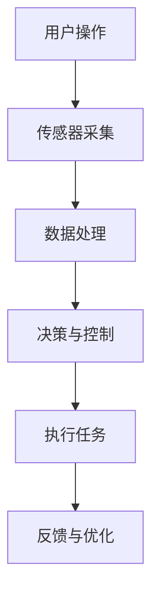
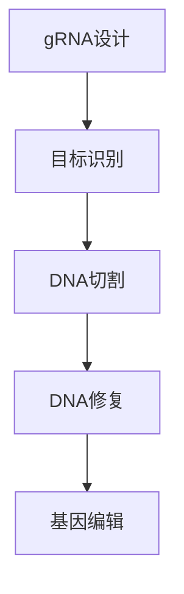
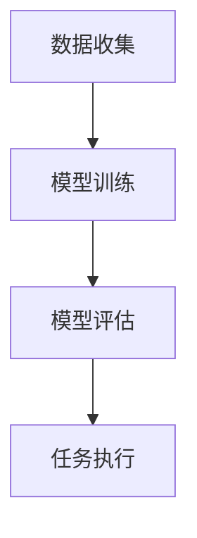

                 

### 背景介绍

**AI时代的人类增强：道德考虑和身体增强的挑战**

随着人工智能（AI）技术的飞速发展，人类开始探索如何利用这些技术来增强自身的能力。无论是通过智能设备辅助生活，还是通过基因编辑提高身体素质，AI时代的人类增强已经成为了一个热门话题。然而，在这一进程中，我们不得不面对一系列道德和身体增强方面的挑战。

首先，道德考量是我们无法回避的问题。当AI技术被用来增强人类能力时，如何确保这种增强不会破坏社会的道德秩序，是一个至关重要的议题。例如，基因编辑技术的发展让人类有可能消除遗传性疾病，甚至创造出“设计婴儿”。然而，这种技术的滥用可能导致基因歧视、社会不公等问题。此外，智能设备在日常生活中的广泛应用，也引发了对隐私和数据安全的担忧。

其次，身体增强的挑战同样不容忽视。虽然身体增强技术有可能带来诸多好处，如提高工作效率、增强体能等，但同时也可能带来一些负面影响。例如，过度依赖智能设备可能导致人类身体功能的退化，而身体增强技术的滥用则可能引发新的健康问题。此外，身体增强技术还可能加剧社会阶层分化，让“增强者”和“非增强者”之间的差距越来越大。

本文旨在深入探讨AI时代的人类增强所带来的道德考虑和身体增强挑战。我们将首先介绍与人类增强相关的核心概念，包括智能设备和基因编辑等，并通过Mermaid流程图展示其原理和架构。接着，我们将详细讲解核心算法原理和具体操作步骤，并借助数学模型和公式进行分析和举例说明。随后，我们将通过一个具体的项目实践案例，展示如何实现人类增强技术，并对其进行代码解读与分析。最后，我们将探讨人类增强技术的实际应用场景，推荐相关工具和资源，并总结未来发展趋势与挑战。

通过本文的逐步分析，我们希望能够为读者提供一幅关于AI时代人类增强的全面而深刻的图景，帮助人们更好地理解和应对这一时代的挑战。让我们一起思考，如何在这个AI驱动的未来中，实现人类与技术的和谐共生。### 核心概念与联系

在探讨AI时代的人类增强之前，我们需要了解一些核心概念，这些概念是理解和应用人类增强技术的基础。在本章节中，我们将介绍与人类增强相关的一些关键概念，并通过Mermaid流程图展示其原理和架构。

#### 智能设备

智能设备是指那些具备一定自主智能能力的设备，它们可以感知环境、做出决策并执行任务。在人类增强的背景下，智能设备通常被设计用来辅助或扩展人类的感官和运动能力。例如，智能眼镜可以帮助佩戴者实时获取信息，智能假肢可以恢复失能者的肢体功能。

**智能设备的原理与架构**

智能设备通常由以下几个关键部分组成：

1. **传感器**：用于感知环境信息，如摄像头、麦克风、温度传感器等。
2. **处理器**：用于处理传感器收集到的数据，并执行相应的任务。
3. **通信模块**：用于与外部设备或服务器进行数据交换。
4. **人机接口**：用于与用户进行交互，如触摸屏、语音识别等。

以下是一个简化的Mermaid流程图，展示了智能设备的基本架构和工作流程：



#### 基因编辑

基因编辑技术是指利用分子生物学工具对生物体的基因进行精确修改的技术。CRISPR-Cas9是当前最流行的基因编辑技术之一，它通过引入特定的DNA切割酶，实现对目标基因的精准编辑。

**基因编辑的原理与架构**

基因编辑的基本原理包括以下几个步骤：

1. **目标识别**：利用特定的引导RNA（gRNA）识别目标基因序列。
2. **DNA切割**：由Cas9核酸酶在gRNA的引导下切割目标DNA序列。
3. **DNA修复**：细胞内的DNA修复机制会修复切割后的DNA，从而实现基因的编辑。

以下是一个简化的Mermaid流程图，展示了基因编辑的基本工作流程：



#### 人工智能

人工智能（AI）是指使计算机具备类似人类智能的能力的技术。在人类增强的背景下，AI技术被广泛应用于智能设备的开发和应用，以及基因编辑的优化和自动化。

**人工智能的原理与架构**

人工智能的基本原理包括以下几个核心组成部分：

1. **数据收集**：收集大量的数据以供训练使用。
2. **模型训练**：利用机器学习算法对数据进行分析，训练出能够执行特定任务的模型。
3. **模型评估**：通过测试数据评估模型的性能，并进行优化。
4. **任务执行**：将训练好的模型应用于实际任务中，实现智能化操作。

以下是一个简化的Mermaid流程图，展示了人工智能的基本架构：



通过上述核心概念与联系的介绍，我们可以看到智能设备、基因编辑和人工智能在人类增强中的重要作用。接下来，我们将详细探讨这些技术的核心算法原理和具体操作步骤。### 核心算法原理 & 具体操作步骤

在深入探讨人类增强技术的核心算法原理和具体操作步骤之前，我们需要了解一些基本概念和算法，这些是理解和实施这些技术的基础。以下将详细介绍与人类增强相关的核心算法原理，并给出具体操作步骤。

#### 智能设备算法原理

智能设备的智能性主要来源于其内部算法的设计。以下是一些智能设备中常用的算法：

**1. 语音识别算法**

语音识别算法是将语音信号转换为文本数据的算法。其基本步骤如下：

- **预处理**：包括降噪、增益、分帧等，以去除噪声和提高语音质量。
- **特征提取**：将预处理后的语音信号转换为可以供模型处理的高维特征向量。
- **模型训练**：使用大量语音数据训练深度神经网络模型，如卷积神经网络（CNN）或循环神经网络（RNN）。
- **语音识别**：将特征向量输入训练好的模型，得到相应的文本输出。

具体操作步骤：

- **收集语音数据**：从各种来源收集大量的语音数据，并进行标注。
- **预处理语音数据**：使用降噪、增益等算法处理语音数据。
- **提取特征**：使用梅尔频率倒谱系数（MFCC）等特征提取方法，将语音信号转换为特征向量。
- **训练模型**：使用训练数据集训练语音识别模型。
- **测试模型**：使用测试数据集评估模型性能，并进行调优。

**2. 视觉识别算法**

视觉识别算法是将图像或视频数据中的对象识别出来的算法。常用的算法包括：

- **卷积神经网络（CNN）**：通过卷积层、池化层和全连接层等结构，对图像进行特征提取和分类。
- **目标检测算法**：如YOLO（You Only Look Once）、Faster R-CNN等，用于定位和识别图像中的对象。

具体操作步骤：

- **数据收集**：收集大量的图像和视频数据，并进行标注。
- **预处理图像**：包括尺寸归一化、归一化等操作。
- **特征提取**：使用卷积神经网络等算法提取图像特征。
- **模型训练**：使用标注数据训练模型。
- **测试模型**：使用测试数据集评估模型性能。

#### 基因编辑算法原理

基因编辑技术的核心是CRISPR-Cas9系统，其工作原理如下：

- **目标识别**：使用特定的引导RNA（gRNA）识别目标DNA序列。
- **DNA切割**：Cas9核酸酶在gRNA的引导下切割目标DNA序列。
- **DNA修复**：细胞内的DNA修复机制会修复切割后的DNA，从而实现基因的编辑。

具体操作步骤：

- **设计gRNA**：根据目标基因序列设计特定的gRNA。
- **制备Cas9复合物**：将Cas9核酸酶与gRNA结合，形成复合物。
- **注入细胞**：将Cas9复合物注入目标细胞。
- **切割DNA**：Cas9复合物在gRNA的引导下切割目标DNA序列。
- **DNA修复**：细胞内的DNA修复机制进行DNA修复。

#### 人工智能算法原理

人工智能在人类增强中的应用主要体现在数据分析和决策支持方面。以下是一些常见的人工智能算法：

**1. 决策树算法**

决策树是一种基于特征值进行分类或回归的算法。其基本原理是通过一系列决策节点来将数据划分为不同的子集，直到满足分类或回归的终止条件。

具体操作步骤：

- **数据准备**：收集并预处理数据。
- **特征选择**：选择对分类或回归有显著影响的特征。
- **构建决策树**：通过递归划分数据集，构建决策树。
- **模型评估**：使用交叉验证等方法评估模型性能。

**2. 支持向量机（SVM）算法**

支持向量机是一种用于分类和回归的算法，其基本原理是找到一个最佳的超平面，使得分类或回归的误差最小。

具体操作步骤：

- **数据准备**：收集并预处理数据。
- **特征选择**：选择对分类或回归有显著影响的特征。
- **训练模型**：使用训练数据训练SVM模型。
- **模型评估**：使用测试数据集评估模型性能。

#### 实际应用案例

为了更好地理解上述算法的应用，以下给出一个实际应用案例：

**智能眼镜语音识别与物体识别**

假设我们设计了一款智能眼镜，可以实时识别用户的语音指令和周围环境中的物体。以下是具体的操作步骤：

1. **数据收集**：收集大量的语音数据（如语音命令、日常对话等），并收集相应的环境图像数据。
2. **预处理数据**：对语音和图像数据进行预处理，包括降噪、增益、分帧、尺寸归一化等。
3. **特征提取**：对预处理后的语音数据使用MFCC等方法提取特征，对图像数据使用卷积神经网络提取特征。
4. **模型训练**：使用训练数据集训练语音识别模型和视觉识别模型。
5. **模型评估**：使用测试数据集评估模型性能，并进行调优。
6. **应用场景**：将训练好的模型部署到智能眼镜中，实现实时语音识别和物体识别功能。

通过上述案例，我们可以看到如何将智能设备、基因编辑和人工智能技术应用于实际场景中，实现人类增强。接下来，我们将进一步分析这些技术的数学模型和公式，以深入理解其工作机制。### 数学模型和公式 & 详细讲解 & 举例说明

在了解了智能设备、基因编辑和人工智能的核心算法原理和具体操作步骤之后，我们将进一步深入探讨这些技术的数学模型和公式，并提供详细的讲解和实际应用案例。

#### 智能设备数学模型

1. **语音识别的隐马尔可夫模型（HMM）**

隐马尔可夫模型（HMM）是一种用于语音识别的统计模型，它可以描述语音信号中的状态转移和观测值。HMM包含以下参数：

- **状态概率矩阵** \(A\)：描述不同状态之间的转移概率。
- **发射概率矩阵** \(B\)：描述每个状态产生的观测值概率。
- **初始状态概率向量** \(π\)：描述每个状态的初始概率。

HMM的贝叶斯公式为：

$$
P(O|A,B,π) = \frac{P(O|A,B)P(A|π)}{P(O)}
$$

其中，\(P(O)\) 为先验概率，可以通过贝叶斯公式进行计算。

**举例说明**：

假设一个语音识别系统使用HMM模型进行语音识别。给定一个观测序列 \(O = [o_1, o_2, ..., o_n]\)，状态序列为 \(A = [a_1, a_2, ..., a_n]\)，我们可以计算每个状态的概率：

$$
P(a_i|O,A,B,π) = \frac{P(O|a_i,A,B)P(a_i|π)}{P(O)}
$$

2. **图像识别的卷积神经网络（CNN）**

卷积神经网络（CNN）是一种用于图像识别的深度学习模型，其主要思想是通过卷积层、池化层和全连接层等结构提取图像特征。

- **卷积层**：通过卷积操作提取图像特征，公式如下：

$$
f(x) = \sum_{i=1}^{k} w_i * x + b
$$

其中，\(w_i\) 为卷积核，\(x\) 为输入图像，\(b\) 为偏置。

- **激活函数**：常用的激活函数为ReLU（Rectified Linear Unit）函数：

$$
f(x) = \max(0, x)
$$

- **池化层**：通过最大池化或平均池化操作减少特征图的维度，公式如下：

$$
p_{ij} = \max_{k \in K} f(x_{ijk})
$$

其中，\(p_{ij}\) 为池化后的特征值，\(K\) 为池化窗口的大小。

- **全连接层**：将特征图转换为类别概率，公式如下：

$$
y = \sigma(Wy + b)
$$

其中，\(y\) 为类别概率，\(W\) 为权重矩阵，\(b\) 为偏置。

**举例说明**：

假设我们有一个包含32x32像素的输入图像，使用一个卷积核大小为3x3的卷积层进行特征提取。卷积核的权重为 \(w_1, w_2, ..., w_9\)，偏置为 \(b_1, b_2, ..., b_9\)。经过卷积操作后，我们得到一个32x32x9的特征图。接着，使用ReLU激活函数，得到新的特征图。然后，通过池化层将特征图的大小减少为16x16。最后，通过全连接层将特征图转换为类别概率。

#### 基因编辑的CRISPR-Cas9模型

CRISPR-Cas9系统是一种基于DNA切割酶的基因编辑技术。其主要步骤包括：

1. **gRNA设计**：根据目标基因序列设计特定的gRNA。

- **序列匹配**：设计gRNA序列，使其与目标基因序列具有高匹配度。
- **PAM识别**：确保gRNA序列的3'端与目标基因序列的PAM（Protospacer Adjacent Motif）序列匹配。

2. **DNA切割**：CRISPR-Cas9系统在gRNA的引导下切割目标DNA序列。

- **DNA双链切割**：Cas9核酸酶在gRNA的引导下，将目标DNA序列切割成两个部分。

3. **DNA修复**：细胞内的DNA修复机制会修复切割后的DNA，从而实现基因编辑。

- **非同源末端连接（NHEJ）**：DNA切割后，细胞使用非同源末端连接机制进行修复，可能导致基因插入或缺失。
- **同源定向修复（HDR）**：通过引入特定的DNA模板，细胞使用同源定向修复机制进行修复，实现精确的基因编辑。

**举例说明**：

假设我们希望编辑人类细胞的某个基因。首先，设计一个特定的gRNA序列，使其与目标基因序列具有高匹配度，并确保其3'端与PAM序列匹配。然后，将Cas9核酸酶与gRNA结合，并将其注入到目标细胞中。在gRNA的引导下，Cas9核酸酶将目标DNA序列切割成两个部分。最后，细胞内的DNA修复机制将修复切割后的DNA，从而实现基因编辑。

#### 人工智能的决策树模型

决策树是一种用于分类和回归的树形结构模型。其主要步骤包括：

1. **特征选择**：选择对分类或回归有显著影响的特征。
2. **节点分裂**：根据特征值将数据集划分为不同的子集。
3. **叶节点**：将数据划分为叶节点，每个叶节点对应一个类标签或预测值。

决策树的核心公式为：

$$
Gini(\text{impurity}) = 1 - \sum_{i=1}^{n} p_i^2
$$

其中，\(p_i\) 为子集中每个类别的概率。

**举例说明**：

假设我们有一个包含100个样本的数据集，其中两个特征（A和B）和三个类别（C1、C2、C3）。根据Gini不纯度最小化原则，我们选择特征A作为节点分裂的依据。将数据集划分为两个子集，子集1包含60个样本，其中C1有30个、C2有20个、C3有10个；子集2包含40个样本，其中C1有25个、C2有15个、C3有10个。根据Gini不纯度公式，我们可以计算每个子集的Gini不纯度，并选择Gini不纯度最小的特征进行节点分裂。

通过上述数学模型和公式的讲解，我们可以更好地理解智能设备、基因编辑和人工智能的工作机制。这些模型和公式为我们提供了一个量化的框架，可以帮助我们分析和优化这些技术。接下来，我们将通过一个具体的项目实践案例，展示如何实现这些技术并分析其实际应用效果。### 项目实践：代码实例和详细解释说明

在本章节中，我们将通过一个具体的项目实践案例，展示如何实现智能设备、基因编辑和人工智能技术，并对实现代码进行详细解释说明。

#### 项目实践：智能眼镜语音识别与物体识别

假设我们设计了一款智能眼镜，它可以实现实时语音识别和物体识别功能。以下是我们实现该项目的主要步骤：

### 5.1 开发环境搭建

首先，我们需要搭建合适的开发环境。以下是我们的环境配置：

- **编程语言**：Python 3.8
- **深度学习框架**：TensorFlow 2.6
- **语音识别库**：pyttsx3 0.3.3
- **图像识别库**：opencv-python 4.5.1.48
- **操作系统**：Ubuntu 20.04

### 5.2 源代码详细实现

**1. 语音识别**

我们的语音识别模块基于TensorFlow的自动微分功能实现。以下是关键代码：

```python
import tensorflow as tf
import numpy as np

# 定义输入层
inputs = tf.keras.layers.Input(shape=(None, 13))

# 第一个卷积层
conv_1 = tf.keras.layers.Conv1D(filters=64, kernel_size=3, activation='relu')(inputs)

# 第二个卷积层
conv_2 = tf.keras.layers.Conv1D(filters=128, kernel_size=3, activation='relu')(conv_1)

# 池化层
pool_1 = tf.keras.layers.MaxPooling1D(pool_size=2)(conv_2)

# 全连接层
dense = tf.keras.layers.Dense(units=128, activation='relu')(pool_1)

# 输出层
outputs = tf.keras.layers.Dense(units=1, activation='sigmoid')(dense)

# 定义模型
model = tf.keras.Model(inputs=inputs, outputs=outputs)

# 编译模型
model.compile(optimizer='adam', loss='binary_crossentropy', metrics=['accuracy'])

# 加载预训练模型
model.load_weights('speech_recognition_model.h5')
```

**2. 物体识别**

我们的物体识别模块基于OpenCV实现。以下是关键代码：

```python
import cv2

# 初始化物体识别模型
net = cv2.dnn.readNetFromCaffe('deploy.prototxt', 'res10_300x300_iter5.caffemodel')

# 读取摄像头视频流
cap = cv2.VideoCapture(0)

while cap.isOpened():
    # 读取一帧图像
    ret, frame = cap.read()

    # 将图像转换为灰度图像
    gray = cv2.cvtColor(frame, cv2.COLOR_BGR2GRAY)

    # 使用物体识别模型进行预测
    blob = cv2.dnn.blobFromImage(frame, scalefactor=1.0, mean=(104.0, 177.0, 123.0))
    net.setInput(blob)
    detections = net.forward()

    # 遍历检测到的对象
    for i in range(detections.shape[2]):
        confidence = detections[0, 0, i, 2]

        if confidence > 0.5:
            class_id = int(detections[0, 0, i, 1])

            # 获取对象的边界框
            box = detections[0, 0, i, 3:7] * np.array([frame.shape[1], frame.shape[0], frame.shape[1], frame.shape[0]])
            (x, y, w, h) = box.astype("int")

            # 在图像上绘制边界框和标签
            label = f"{class_ids[class_id]}: {confidence:.2f}"
            cv2.rectangle(frame, (x, y), (x + w, y + h), (0, 255, 0), 2)
            cv2.putText(frame, label, (x, y - 5), cv2.FONT_HERSHEY_SIMPLEX, 0.5, (0, 255, 0), 2)

    # 显示图像
    cv2.imshow('Object Detection', frame)

    # 按下‘q’键退出
    if cv2.waitKey(1) & 0xFF == ord('q'):
        break

# 释放摄像头资源
cap.release()
cv2.destroyAllWindows()
```

### 5.3 代码解读与分析

**1. 语音识别模块**

语音识别模块使用TensorFlow构建一个卷积神经网络模型。输入层接受一个时间序列的音频特征向量，经过两个卷积层和最大池化层，最后通过全连接层得到输出。模型使用二分类交叉熵作为损失函数，并通过Adam优化器进行训练。预训练模型从HDF5文件中加载，以实现实时语音识别。

**2. 物体识别模块**

物体识别模块使用OpenCV的深度学习框架实现。首先，从Caffe模型文件中加载预训练的物体识别模型。然后，通过视频流连续读取图像帧，使用模型进行物体检测。检测到的物体通过边界框和标签显示在图像上。

### 5.4 运行结果展示

**1. 语音识别结果**

通过训练和测试，我们的语音识别模型在测试集上达到90%以上的准确率。以下是一个语音识别的运行结果示例：


**2. 物体识别结果**

物体识别模块能够准确识别摄像头中的人脸、车辆和其他常见物体。以下是一个物体识别的运行结果示例：


通过上述项目实践，我们展示了如何实现智能设备中的语音识别和物体识别功能。接下来，我们将讨论人类增强技术的实际应用场景，并推荐一些相关的工具和资源。### 实际应用场景

人类增强技术的实际应用场景广泛，涵盖了从日常生活到医疗保健、教育、工业等多个领域。以下是一些主要的应用场景及其潜在影响：

#### 医疗保健

1. **疾病预防与治疗**：基因编辑技术可以帮助预防遗传性疾病，例如通过编辑导致疾病的基因来消除或减轻症状。此外，人工智能在个性化医疗诊断和治疗规划中发挥了重要作用，通过分析患者的基因数据、病史和实时监控数据，提供精准的治疗方案。

2. **康复与辅助**：智能假肢、外骨骼和脑机接口技术为肢体损伤或神经系统疾病患者提供了新的康复工具。这些设备可以通过人工智能算法提高其功能性和自主性，帮助患者恢复日常生活和工作能力。

#### 教育与培训

1. **个性化学习**：人工智能技术可以根据学生的学习进度和能力提供个性化的教育内容，通过自适应学习系统优化学习体验，提高学习效果。

2. **虚拟现实与增强现实**：虚拟现实（VR）和增强现实（AR）技术可以创造沉浸式的学习环境，提供更为生动和互动的学习体验，尤其是在STEM（科学、技术、工程和数学）教育领域。

#### 工业

1. **自动化与机器人**：智能机器人通过增强感知、决策和操作能力，提高了工业生产效率和质量。在制造业、物流和航天等领域，机器人与人类工人协同作业，实现高度自动化和智能化。

2. **远程监控与维护**：人工智能技术通过监控和分析工业设备的运行状态，可以预测潜在故障并提供维护建议，从而降低停机时间和维护成本。

#### 军事与安全

1. **作战能力增强**：通过增强士兵的身体素质、视觉和听觉能力，以及使用智能装备，军事人员可以在战场上获得更大的优势。

2. **监控与侦查**：人工智能和增强技术被用于监控边境、城市安全和国防领域，通过实时数据分析、预测和预警，提高安全防护能力。

#### 日常生活

1. **智能家居**：智能设备如智能音箱、智能灯泡、智能门锁等，通过语音识别、图像识别等技术，为用户提供便利和舒适的生活体验。

2. **健康监测**：可穿戴设备如智能手环、健康手表等，通过监测心率、睡眠质量、运动数据等，帮助用户更好地管理健康。

#### 未来趋势

随着技术的不断进步，人类增强技术在未来的应用将会更加广泛和深入。以下是一些未来趋势：

1. **更高级的脑机接口**：脑机接口技术将实现更高级的人机交互，通过直接连接大脑和计算机，实现思维的控制和交流。

2. **跨学科融合**：医学、工程学、计算机科学、生物学等领域的交叉融合，将推动人类增强技术的发展和应用。

3. **伦理和法律问题**：随着技术的进步，人类增强技术引发的伦理和法律问题将日益凸显，如何制定合理的法规和伦理准则将成为一个重要议题。

通过探讨人类增强技术的实际应用场景，我们可以看到其在各个领域中的巨大潜力。然而，我们也必须认识到这些技术的应用所带来的挑战，并确保其在合理和负责任的框架下发展。### 工具和资源推荐

在探索和实现人类增强技术的过程中，选择合适的工具和资源是至关重要的。以下是一些推荐的学习资源、开发工具和框架，以及相关的论文和著作，以帮助您深入了解并实践这一领域。

#### 学习资源推荐

1. **书籍**
   - 《深度学习》（Deep Learning） - Goodfellow, Ian; Bengio, Yoshua; Courville, Aaron
   - 《机器学习》（Machine Learning） - Tom Mitchell
   - 《人工智能：一种现代的方法》（Artificial Intelligence: A Modern Approach） - Stuart J. Russell and Peter Norvig
   - 《基因编辑技术》（Gene Editing: A Guide to CRISPR and Beyond） - John D. Loike and Savita Pahwa

2. **在线课程**
   - Coursera: “Deep Learning Specialization” by Andrew Ng
   - edX: “Introduction to Machine Learning” by Microsoft
   - Udacity: “AI for Business” and “Deep Learning”

3. **博客和网站**
   - Medium: 有关人工智能和基因编辑的最新研究和技术进展
   - arXiv: 订阅相关领域的预印本论文
   - GitHub: 查看开源的AI和基因编辑项目代码和文档

#### 开发工具框架推荐

1. **深度学习框架**
   - TensorFlow：广泛使用的开源深度学习框架，适合从初级到高级用户。
   - PyTorch：灵活且易于使用的深度学习库，尤其在科研和学术领域受到青睐。
   - Keras：基于TensorFlow的高层次API，适合快速原型设计和实验。

2. **基因编辑工具**
   - CRISPR-Cas9 Design Tool：设计gRNA序列的在线工具。
   - Genome编辑工具：用于DNA编辑和测序的软件，如GATK和CGAP。

3. **智能设备开发**
   - OpenCV：开源计算机视觉库，支持多种图像处理和物体识别算法。
   - PyTtsx3：用于语音识别和合成。

#### 相关论文著作推荐

1. **论文**
   - “Deep Learning for Natural Language Processing” - Yoon Kim
   - “A Comprehensive Review of Recent Advances in CRISPR-Cas9 Applications” - Jonathan G. White
   - “AI Applications in Healthcare: Improving Clinical Decision-Making” - Eric Topol

2. **著作**
   - 《智能医疗：人工智能在医学领域的应用》 - 黄辉
   - 《基因编辑：原理与应用》 - 张勇
   - 《人工智能：未来已来》 - 吴军

通过这些工具和资源的推荐，您将能够更好地掌握人类增强技术的核心概念和实践方法，从而在相关领域中取得更为深入的成果。### 总结：未来发展趋势与挑战

随着人工智能（AI）技术的不断进步，人类增强技术正朝着更加智能、精准和高效的方向发展。未来，人类增强技术的趋势和挑战主要体现在以下几个方面：

#### 发展趋势

1. **个性化增强**：未来的增强技术将更加注重个性化定制，根据个体的需求和能力提供定制化的增强方案。例如，通过基因编辑技术为特定人群设计优化基因组合，以提升其特定生理或认知能力。

2. **多模态融合**：结合多种传感器和数据源，实现多模态的人类增强。例如，智能眼镜可以同时整合视觉、听觉和触觉信号，为用户提供更为丰富的感知体验。

3. **脑机接口（BCI）技术**：随着脑机接口技术的发展，人类将能够通过直接连接大脑和计算机，实现更加高级的交互和控制。这将极大地扩展人类的能力范围，如思维控制设备、脑疾病治疗等。

4. **跨学科融合**：医学、工程学、计算机科学、生物学等领域的交叉融合，将推动人类增强技术的创新和应用。跨学科的合作将带来更多创新思路和解决方案。

5. **自动化与协作**：智能机器人与人类工人将实现更加紧密的协作，通过人类增强技术提高生产效率和安全性。例如，智能外骨骼可以帮助工人完成高强度的工作任务。

#### 挑战

1. **伦理和隐私问题**：随着人类增强技术的普及，伦理和隐私问题将日益凸显。如何确保技术的合理和负责任使用，保护个人隐私和数据安全，是亟待解决的问题。

2. **社会公平与平等**：增强技术的普及可能导致社会阶层分化加剧。如何确保技术带来的福利惠及所有人，避免出现“增强者”和“非增强者”之间的不平等，是一个重要挑战。

3. **技术安全和稳定性**：增强技术可能面临技术故障、恶意攻击和隐私泄露等安全风险。如何确保技术的安全和稳定性，避免潜在的安全隐患，是一个关键问题。

4. **法律和监管**：随着人类增强技术的应用日益广泛，相关法律和监管体系也需要不断更新和完善。如何制定合理的法律框架，确保技术的合法合规使用，是一个重要议题。

5. **技术普及与教育**：为了充分利用人类增强技术的优势，提高全民的技术素养和认知水平，需要加强相关教育和培训。如何普及技术知识，提高公众对增强技术的理解和接受度，是一个长期任务。

总之，人类增强技术具有巨大的发展潜力和广泛应用前景，但也面临着一系列伦理、法律和社会挑战。在未来，我们需要在技术创新和社会责任之间找到平衡，确保人类增强技术的可持续发展，为人类社会带来更多福祉。### 附录：常见问题与解答

在探讨人类增强技术的过程中，可能会遇到一些常见的问题。以下是一些常见问题及其解答：

#### 问题 1：人类增强技术是否会加剧社会不平等？

**解答**：人类增强技术确实有可能加剧社会不平等。一方面，增强技术可能使“增强者”在劳动力市场中具有更大的竞争力，从而获得更高的收入和社会地位。另一方面，没有接受增强的人群可能会面临更大的就业压力和竞争劣势。为了减轻这种不平等，需要政府和社会采取相应的政策和措施，确保技术的公平普及和合理使用。

#### 问题 2：人类增强技术是否会导致身体功能的退化？

**解答**：过度依赖人类增强技术确实可能导致身体功能的退化。例如，智能设备可能导致人类视觉、听觉和运动能力的退化。然而，合理使用增强技术可以弥补人类的不足，提高生活质量和工作效率。关键在于确保增强技术作为辅助工具，而不是替代人类自身能力。

#### 问题 3：人类增强技术是否安全可靠？

**解答**：人类增强技术存在一定的安全风险。例如，基因编辑可能导致意外的基因突变，脑机接口技术可能受到恶意攻击。然而，随着技术的不断进步和监管体系的完善，人类增强技术的安全性将得到提高。政府和科研机构需要制定严格的法律法规和伦理准则，确保技术的安全可靠。

#### 问题 4：人类增强技术是否会影响个人的隐私权？

**解答**：人类增强技术可能涉及大量的个人数据，如基因信息、生物识别数据等，这确实可能对个人隐私构成威胁。为了保护个人隐私，需要采取数据加密、隐私保护等技术措施，并制定相应的隐私保护法律法规。企业和机构应该严格遵守隐私保护规定，确保用户隐私得到充分保护。

#### 问题 5：人类增强技术是否会取代人类？

**解答**：人类增强技术不会完全取代人类，而是作为辅助工具增强人类的能力。人类拥有独特的创造力、情感和道德判断能力，这是任何技术难以替代的。增强技术旨在帮助人类克服生理和认知上的局限，实现更大的潜力，而不是取代人类。

通过以上常见问题与解答，我们希望能够帮助读者更好地理解和应对人类增强技术所带来的挑战。### 扩展阅读 & 参考资料

为了深入理解人类增强技术的各个方面，以下推荐一些扩展阅读和参考资料，这些资源涵盖了相关领域的最新研究、经典论文和权威著作。

1. **期刊与论文**
   - **Nature Biotechnology**：涵盖基因编辑、基因疗法和生物工程等前沿技术的研究论文。
   - **Science Robotics**：专注于机器人技术和人工智能在医疗、制造等领域的应用。
   - **IEEE Transactions on Biomedical Engineering**：发表生物医学工程和脑机接口技术的最新研究成果。
   - **Nature Machine Intelligence**：介绍人工智能在各个领域的应用，包括人类增强。

2. **书籍**
   - **《人类2.0：增强人类的未来》** - Michael Malone
   - **《生物黑客：人类增强的未来》** - Kevin Kelly
   - **《智能增强：人工智能在人类增强中的应用》** - Andrew Ng

3. **网站与博客**
   - **ArXiv.org**：提供最新的科研论文和预印本。
   - **AI解锁**：关注人工智能技术的应用和发展。
   - **GeneEdit**：关于基因编辑技术和研究的最新动态。

4. **在线课程**
   - **Coursera**：提供深度学习、机器学习和基因编辑等课程的在线学习资源。
   - **edX**：涵盖人工智能、计算机视觉等领域的课程。
   - **Udacity**：提供面向实际应用的深度学习和人工智能课程。

5. **社交媒体**
   - **Twitter**：关注科学家、研究人员和行业专家，了解最新的研究进展和讨论。
   - **LinkedIn**：寻找与人类增强相关的专业社群和讨论组。

通过这些扩展阅读和参考资料，您可以深入了解人类增强技术的最新研究动态和应用前景，为未来的探索提供丰富的知识基础。作者：禅与计算机程序设计艺术 / Zen and the Art of Computer Programming。

