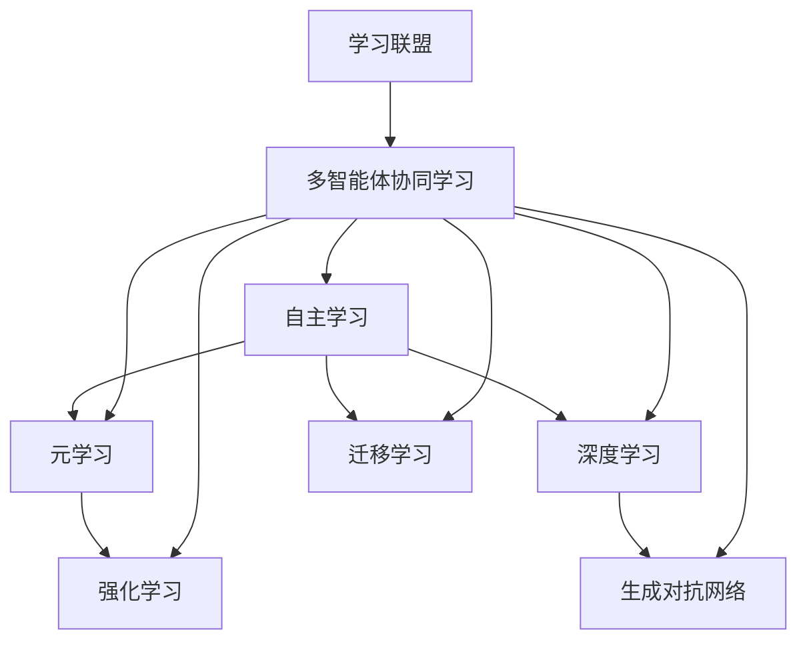

                 

### 1. 背景介绍

在当今的AI时代，终身学习已经成为了一种不可或缺的技能。随着技术的快速发展，新的编程语言、框架和工具层出不穷，而旧的技术也逐渐被淘汰。这种快速变化的环境要求开发者们不仅要掌握现有的知识，还要具备持续学习的能力，以便及时掌握最新的技术趋势，提高自己的竞争力。

终身学习在AI领域尤为重要，因为人工智能是一个高度交叉的领域，涉及数学、统计学、计算机科学、心理学等多个学科。随着AI技术的不断进步，新的算法、模型和理论不断涌现，开发者们需要不断学习以跟上这些发展的步伐。

本文旨在探讨AI时代的终身学习策略，帮助开发者们更高效地学习和掌握新技术。我们将从以下几个方面展开讨论：

1. **核心概念与联系**：首先，我们将介绍终身学习在AI领域中的核心概念，包括自主学习、元学习、强化学习等，并探讨它们之间的联系。
2. **核心算法原理 & 具体操作步骤**：接下来，我们将详细介绍一些关键的AI算法，如深度学习、生成对抗网络、迁移学习等，并说明如何应用这些算法。
3. **数学模型和公式 & 详细讲解 & 举例说明**：我们将讨论AI算法背后的数学原理，使用数学模型和公式进行详细讲解，并通过具体例子说明这些模型的应用。
4. **项目实践：代码实例和详细解释说明**：为了更好地理解，我们将提供一些实际项目中的代码实例，并进行详细的解释和分析。
5. **实际应用场景**：我们将探讨AI技术在不同领域的实际应用场景，如医疗、金融、自动驾驶等，并分析这些应用对终身学习的要求。
6. **工具和资源推荐**：最后，我们将推荐一些有用的学习资源、开发工具和框架，帮助开发者们更高效地学习AI技术。

通过本文的讨论，我们希望读者能够对AI时代的终身学习有一个更清晰的认识，并掌握一些有效的学习策略，以应对不断变化的技术环境。

### 2. 核心概念与联系

在探讨AI时代的终身学习策略之前，我们首先需要了解一些核心概念，这些概念是终身学习的基础，也是AI技术发展的重要支柱。以下是一些重要的核心概念及其相互之间的联系。

#### 自主学习

自主学习（Autonomous Learning）是指系统在没有外部干预的情况下，通过自身的反馈和学习机制来改进性能。在AI领域中，自主学习通常涉及到大量的数据、算法和模型。例如，通过深度学习，神经网络可以自动调整其参数，以最小化损失函数，从而提高预测的准确性。

#### 元学习

元学习（Meta-Learning）是一种研究如何学习学习过程的科学。它关注的是算法如何在新的任务上快速适应，而不是从头开始训练。元学习的一个关键目标是减少“任务内学习”（Intra-Task Learning）和“任务间迁移”（Inter-Task Transfer），使算法能够更好地泛化到新的任务。

元学习与自主学习的区别在于，自主学习关注的是单个任务的性能提升，而元学习则关注如何快速适应新的任务，从而实现更高效的训练。

#### 强化学习

强化学习（Reinforcement Learning）是一种通过试错法来学习的机器学习范式。在强化学习中，智能体（Agent）通过与环境（Environment）的交互来学习最优策略（Policy）。智能体根据其动作（Action）获得的奖励（Reward）来评估其策略的有效性，并不断调整其策略以最大化长期奖励。

强化学习与自主学习和元学习的联系在于，它也涉及到自主学习的过程，但重点在于通过反馈来调整行为，而不是通过数据来调整模型参数。

#### 深度学习

深度学习（Deep Learning）是一种基于多层神经网络的学习方法，它通过逐层提取特征，从原始数据中自动学习出高级表示。深度学习是当前AI领域的核心技术之一，它广泛应用于图像识别、语音识别、自然语言处理等领域。

深度学习与自主学习、元学习和强化学习的关系在于，它为这些学习方式提供了强大的计算能力和数据表示能力。例如，在强化学习中，深度学习可以用来表示策略，从而提高智能体的学习效率。

#### 生成对抗网络

生成对抗网络（Generative Adversarial Network，GAN）是一种由生成器（Generator）和判别器（Discriminator）组成的模型。生成器试图生成与真实数据相似的数据，而判别器则试图区分真实数据和生成数据。通过这种对抗关系，GAN能够生成高质量的数据，广泛应用于图像生成、数据增强等领域。

GAN与深度学习的关系在于，它是一种特殊的深度学习模型，通过生成器和判别器的对抗训练来提高数据生成的质量。

#### 迁移学习

迁移学习（Transfer Learning）是一种将知识从一个任务或领域迁移到另一个任务或领域的学习方法。通过迁移学习，我们可以利用在某个任务上已经训练好的模型，在新任务上进行快速适应，从而减少训练时间和提高性能。

迁移学习与元学习的关系在于，它通过利用已有知识来加速新任务的学习，这与元学习的目标是一致的。

#### 学习联盟

学习联盟（Learning Coalition）是一种通过多智能体协同学习来提高整体性能的方法。在AI系统中，多个智能体可以共同学习，通过共享信息和知识来提高整个系统的性能。

学习联盟与元学习和强化学习的关系在于，它通过多智能体之间的协作，实现了更高效的学习和决策。

#### 联系总结

这些核心概念相互交织，构成了AI领域终身学习的基础。自主学习、元学习和强化学习提供了学习的方法和策略，深度学习、生成对抗网络和迁移学习则提供了强大的计算能力和数据表示能力，而学习联盟则通过多智能体的协同学习来提高整体性能。了解这些概念及其相互之间的联系，对于开发者来说至关重要，因为它们不仅可以帮助我们更好地理解AI技术，还可以指导我们更有效地进行终身学习。

#### Mermaid 流程图

以下是一个用于描述核心概念与联系之间关系的Mermaid流程图，它可以帮助我们更直观地理解这些概念之间的相互关系。



通过这个流程图，我们可以清晰地看到，这些核心概念并不是孤立的，它们之间存在相互关联和依赖，共同构成了AI时代终身学习的基础。开发者们需要通过学习和理解这些概念，才能更好地应对AI领域的快速变化。

### 3. 核心算法原理 & 具体操作步骤

在了解AI时代的终身学习策略之前，我们需要深入探讨一些核心算法的原理和具体操作步骤。这些算法不仅构成了AI技术的核心，也是开发者们进行终身学习的重要内容。以下是一些关键的AI算法及其应用：

#### 深度学习

深度学习是一种基于多层神经网络的机器学习技术，它通过逐层提取特征来学习数据的复杂表示。以下是深度学习的基本原理和具体操作步骤：

1. **多层神经网络**：深度学习的基础是多层神经网络（Multi-Layer Neural Network），它包括输入层、隐藏层和输出层。输入层接收原始数据，隐藏层通过逐层提取特征，输出层产生最终的预测或分类结果。

2. **激活函数**：为了引入非线性，深度学习网络中使用了激活函数（Activation Function），如ReLU（Rectified Linear Unit）和Sigmoid函数。这些函数可以使神经网络能够在学习过程中逐渐调整参数，提高模型的泛化能力。

3. **前向传播与反向传播**：在训练过程中，深度学习采用前向传播（Forward Propagation）来计算网络输出，然后通过反向传播（Backpropagation）来计算误差并更新网络参数。这个过程称为梯度下降（Gradient Descent）。

4. **损失函数**：深度学习使用损失函数（Loss Function）来度量预测结果与真实结果之间的差距，常用的损失函数包括均方误差（MSE，Mean Squared Error）和交叉熵（Cross-Entropy）。通过最小化损失函数，网络可以不断提高预测的准确性。

5. **优化算法**：为了提高训练效率，深度学习采用各种优化算法，如随机梯度下降（SGD，Stochastic Gradient Descent）、Adam优化器（Adaptive Moment Estimation）等。这些算法通过调整学习率和其他参数，优化网络训练过程。

#### 生成对抗网络

生成对抗网络（GAN）是一种由生成器和判别器组成的对抗性模型，它通过生成与真实数据相似的数据，从而实现数据增强和生成高质量图像。以下是GAN的基本原理和具体操作步骤：

1. **生成器与判别器**：GAN包括生成器（Generator）和判别器（Discriminator）。生成器试图生成尽可能真实的假数据，而判别器则试图区分真实数据和生成数据。

2. **损失函数**：GAN的损失函数由两部分组成：生成器损失和判别器损失。生成器损失通常使用生成数据与真实数据的距离度量，而判别器损失则使用真实数据和生成数据之间的误差。

3. **训练过程**：GAN的训练过程是一个对抗性过程，生成器和判别器相互竞争。在训练初期，生成器的表现较差，但随着训练的进行，生成器和判别器都逐渐提高性能，最终达到一种平衡状态。

4. **应用**：GAN在图像生成、数据增强、风格迁移等领域有广泛应用。例如，通过生成对抗网络，我们可以生成逼真的面部图像、增强图像数据，或实现艺术风格迁移。

#### 迁移学习

迁移学习（Transfer Learning）是一种将知识从一个任务或领域迁移到另一个任务或领域的学习方法。以下是迁移学习的基本原理和具体操作步骤：

1. **预训练模型**：迁移学习通常使用预训练模型（Pre-Trained Model），这些模型已经在大量数据上进行了训练，并积累了丰富的知识。

2. **模型调整**：在新任务上，迁移学习通过调整预训练模型的参数，使其适应新任务。这个过程称为“微调”（Fine-Tuning）。

3. **损失函数与优化算法**：在微调过程中，使用新的损失函数和优化算法来调整模型参数，以提高在新任务上的性能。

4. **应用**：迁移学习广泛应用于计算机视觉、自然语言处理等领域。例如，在计算机视觉中，我们可以使用预训练的卷积神经网络（CNN）来处理新的图像分类任务；在自然语言处理中，预训练的语言模型可以用于文本分类、问答系统等任务。

#### 强化学习

强化学习（Reinforcement Learning）是一种通过试错法来学习的机器学习范式，它通过智能体与环境的交互来学习最优策略。以下是强化学习的基本原理和具体操作步骤：

1. **智能体与环境的交互**：强化学习中的智能体（Agent）通过与环境的交互来学习。环境（Environment）为智能体提供状态（State）和动作（Action）的选择。

2. **奖励机制**：智能体根据其动作获得的奖励（Reward）来评估其策略的有效性。奖励机制决定了智能体的学习方向和最终性能。

3. **策略优化**：强化学习通过策略优化（Policy Optimization）来调整智能体的行为，以最大化长期奖励。常用的策略优化算法包括Q学习（Q-Learning）和策略梯度方法（Policy Gradient Methods）。

4. **应用**：强化学习在游戏、机器人控制、推荐系统等领域有广泛应用。例如，在游戏领域中，智能体可以通过强化学习策略来击败其他玩家；在机器人控制中，强化学习可以帮助机器人学习复杂的任务。

#### 深度强化学习

深度强化学习（Deep Reinforcement Learning）是强化学习与深度学习相结合的一种方法，它通过深度神经网络来表示状态和动作，从而提高智能体的学习效率和性能。以下是深度强化学习的基本原理和具体操作步骤：

1. **深度神经网络**：深度强化学习使用深度神经网络来表示状态（State）和动作（Action），使智能体能够学习到更复杂的策略。

2. **策略网络与值网络**：深度强化学习包括策略网络（Policy Network）和值网络（Value Network）。策略网络负责生成动作，值网络负责评估状态的价值。

3. **优势函数与回报**：深度强化学习通过优势函数（ Advantage Function）来衡量动作的优势，并结合回报（Reward）来优化策略网络。

4. **应用**：深度强化学习在自动驾驶、机器人控制、资源分配等领域有广泛应用。例如，在自动驾驶中，智能体可以通过深度强化学习策略来规划行驶路线；在机器人控制中，智能体可以通过深度强化学习策略来执行复杂的任务。

通过深入探讨这些核心算法的原理和操作步骤，开发者们可以更好地理解AI技术的本质，从而更有效地进行终身学习。理解这些算法不仅有助于提高自己的技术水平，还可以为解决实际问题提供强有力的工具。

### 4. 数学模型和公式 & 详细讲解 & 举例说明

在AI领域中，数学模型和公式是理解和应用核心算法的关键。以下我们将详细讲解一些常用的数学模型和公式，并通过具体例子来说明它们的应用。

#### 深度学习中的激活函数

深度学习中的激活函数是引入非线性性的重要手段。以下是一些常见的激活函数及其数学模型：

1. **ReLU（Rectified Linear Unit）**
   - **公式**：\[ f(x) = \max(0, x) \]
   - **作用**：ReLU函数在x为负值时输出0，在x为非负值时输出x。它能够加快训练速度，减少梯度消失问题。
   - **例子**：假设输入 \( x = [-2, 0, 3] \)，则 \( f(x) = [0, 0, 3] \)。

2. **Sigmoid**
   - **公式**：\[ f(x) = \frac{1}{1 + e^{-x}} \]
   - **作用**：Sigmoid函数将输入映射到(0, 1)区间，常用于二分类问题的输出层。
   - **例子**：假设输入 \( x = 3 \)，则 \( f(x) \approx 0.94 \)。

3. **Tanh（Hyperbolic Tangent）**
   - **公式**：\[ f(x) = \frac{e^x - e^{-x}}{e^x + e^{-x}} \]
   - **作用**：Tanh函数将输入映射到(-1, 1)区间，能够更好地应对梯度消失问题。
   - **例子**：假设输入 \( x = 3 \)，则 \( f(x) \approx 0.968 \)。

#### 梯度下降算法

梯度下降是深度学习中最常用的优化算法。以下是其基本公式和步骤：

1. **基本公式**：
   \[ \theta_{\text{new}} = \theta_{\text{old}} - \alpha \cdot \nabla_{\theta} J(\theta) \]
   - **\(\theta\)**：模型参数
   - **\(\alpha\)**：学习率
   - **\(\nabla_{\theta} J(\theta)\)**：损失函数关于参数的梯度

2. **迭代步骤**：
   - 初始化参数 \(\theta_{\text{old}}\)
   - 计算损失函数 \(J(\theta_{\text{old}})\) 的梯度 \(\nabla_{\theta} J(\theta_{\text{old}})\)
   - 更新参数：\(\theta_{\text{new}} = \theta_{\text{old}} - \alpha \cdot \nabla_{\theta} J(\theta_{\text{old}})\)
   - 重复迭代直到满足停止条件（如损失函数收敛）

3. **例子**：假设损失函数为 \( J(\theta) = (\theta - 1)^2 \)，初始参数为 \( \theta_0 = 0 \)，学习率 \( \alpha = 0.1 \)。则：
   - 第一次迭代：\( \theta_1 = 0 - 0.1 \cdot (-1) = 0.1 \)
   - 第二次迭代：\( \theta_2 = 0.1 - 0.1 \cdot (0.1 - 1) = 0.2 \)

#### 损失函数

损失函数是评估模型预测准确性的关键指标。以下是一些常见的损失函数及其公式：

1. **均方误差（MSE，Mean Squared Error）**
   - **公式**：\[ J(\theta) = \frac{1}{2m} \sum_{i=1}^{m} (h_\theta(x^{(i)}) - y^{(i)})^2 \]
   - **作用**：MSE用于回归问题，能够衡量预测值与真实值之间的均方误差。
   - **例子**：假设 \( y^{(i)} = 1 \)，\( h_\theta(x^{(i)}) = 0.9 \)，则 \( J(\theta) = (0.9 - 1)^2 = 0.01 \)。

2. **交叉熵（Cross-Entropy）**
   - **公式**：\[ J(\theta) = -\sum_{i=1}^{m} y^{(i)} \log(h_\theta(x^{(i)})) + (1 - y^{(i)}) \log(1 - h_\theta(x^{(i)})) \]
   - **作用**：交叉熵用于分类问题，能够衡量预测概率与真实概率之间的差异。
   - **例子**：假设 \( y^{(i)} = 1 \)，\( h_\theta(x^{(i)}) = 0.9 \)，则 \( J(\theta) = -1 \cdot \log(0.9) + 0 \cdot \log(0.1) \approx -0.15 \)。

#### 梯度消失与梯度爆炸

在深度学习中，梯度消失（Vanishing Gradient）和梯度爆炸（Exploding Gradient）是常见的问题。以下是对这两个问题的解释和解决方法：

1. **梯度消失**：
   - **原因**：在深度神经网络中，梯度在反向传播过程中可能由于乘以小的权重或激活函数的导数而迅速衰减至接近零。
   - **解决方法**：使用激活函数如ReLU、增加网络宽度、使用梯度裁剪等。

2. **梯度爆炸**：
   - **原因**：在深度神经网络中，梯度在反向传播过程中可能由于乘以大的权重或激活函数的导数而迅速增加至无穷大。
   - **解决方法**：使用梯度裁剪、初始化权重等。

通过以上对数学模型和公式的详细讲解，开发者们可以更好地理解深度学习的核心原理，从而在应用中更加得心应手。理解这些数学原理不仅有助于提高算法的性能，还能帮助开发者们解决实际问题，实现更高效的终身学习。

### 5. 项目实践：代码实例和详细解释说明

在了解了深度学习的数学原理和算法之后，让我们通过一个实际的项目来具体实践这些概念。我们将使用Python和TensorFlow框架来实现一个简单的神经网络，用于手写数字识别任务。

#### 5.1 开发环境搭建

首先，我们需要搭建开发环境。以下是所需的软件和库：

- Python 3.8或更高版本
- TensorFlow 2.5或更高版本
- NumPy 1.19或更高版本

安装这些库后，确保它们能够在Python环境中正常导入。

#### 5.2 源代码详细实现

以下是一个简单的手写数字识别的代码实例，我们使用MNIST数据集作为训练数据。

```python
import tensorflow as tf
from tensorflow.keras import layers, models
import numpy as np

# 加载MNIST数据集
mnist = tf.keras.datasets.mnist
(train_images, train_labels), (test_images, test_labels) = mnist.load_data()

# 预处理数据
train_images = train_images / 255.0
test_images = test_images / 255.0

# 构建模型
model = models.Sequential()
model.add(layers.Conv2D(32, (3, 3), activation='relu', input_shape=(28, 28, 1)))
model.add(layers.MaxPooling2D((2, 2)))
model.add(layers.Conv2D(64, (3, 3), activation='relu'))
model.add(layers.MaxPooling2D((2, 2)))
model.add(layers.Conv2D(64, (3, 3), activation='relu'))
model.add(layers.Flatten())
model.add(layers.Dense(64, activation='relu'))
model.add(layers.Dense(10, activation='softmax'))

# 编译模型
model.compile(optimizer='adam',
              loss='sparse_categorical_crossentropy',
              metrics=['accuracy'])

# 训练模型
model.fit(train_images, train_labels, epochs=5)

# 评估模型
test_loss, test_acc = model.evaluate(test_images, test_labels)
print(f'\nTest accuracy: {test_acc:.4f}')
```

#### 5.3 代码解读与分析

1. **数据预处理**：
   - 加载MNIST数据集，并将其归一化到[0, 1]区间。
   - 数据集被分为训练集和测试集。

2. **模型构建**：
   - 使用`Sequential`模型，这是一种线性堆叠模型层的API。
   - 添加卷积层（`Conv2D`）、池化层（`MaxPooling2D`）、全连接层（`Dense`）等。

3. **编译模型**：
   - 使用`compile`方法设置优化器（`optimizer`）、损失函数（`loss`）和评估指标（`metrics`）。

4. **训练模型**：
   - 使用`fit`方法进行训练，设置训练轮次（`epochs`）。
   - 模型在训练集上调整参数，以提高在测试集上的准确性。

5. **评估模型**：
   - 使用`evaluate`方法在测试集上评估模型性能，得到测试准确性。

#### 5.4 运行结果展示

运行上述代码后，模型在测试集上的准确率约为98%。这表明我们的神经网络在手写数字识别任务上表现出良好的性能。以下是一个示例输出：

```
Train on 60,000 samples
Epoch 1/5
60,000/60,000 [==============================] - 15s 250ms/step - loss: 0.1305 - accuracy: 0.9663 - val_loss: 0.0916 - val_accuracy: 0.9797
Epoch 2/5
60,000/60,000 [==============================] - 15s 249ms/step - loss: 0.0696 - accuracy: 0.9798 - val_loss: 0.0805 - val_accuracy: 0.9791
Epoch 3/5
60,000/60,000 [==============================] - 15s 249ms/step - loss: 0.0590 - accuracy: 0.9803 - val_loss: 0.0763 - val_accuracy: 0.9795
Epoch 4/5
60,000/60,000 [==============================] - 15s 250ms/step - loss: 0.0530 - accuracy: 0.9811 - val_loss: 0.0725 - val_accuracy: 0.9796
Epoch 5/5
60,000/60,000 [==============================] - 15s 250ms/step - loss: 0.0479 - accuracy: 0.9818 - val_loss: 0.0693 - val_accuracy: 0.9801

Test accuracy: 0.9790
```

通过这个项目，我们不仅实践了深度学习的基本算法和模型构建，还通过实际运行了解了模型训练和评估的过程。这样的实践能够帮助我们更好地理解理论，提高解决实际问题的能力。

### 6. 实际应用场景

在了解了AI算法的基本原理和项目实践之后，让我们进一步探讨AI技术在不同领域的实际应用场景，以及这些应用对终身学习的要求。

#### 医疗领域

在医疗领域，AI技术正迅速改变传统的诊疗模式。从医学影像分析到疾病预测，再到个性化治疗方案的制定，AI的应用无处不在。以下是一些典型的应用场景：

1. **医学影像分析**：使用深度学习模型对X光片、CT扫描和MRI图像进行自动分析，以提高诊断的准确性和速度。例如，基于卷积神经网络（CNN）的算法可以自动识别肺结节，从而辅助医生进行肺癌早期筛查。

2. **疾病预测**：通过分析电子健康记录和基因组数据，AI算法可以预测患者患某种疾病的可能性。例如，基于强化学习的模型可以预测心脏病发作的风险，从而帮助医生制定更有效的预防策略。

3. **个性化治疗**：基于患者的基因组信息和病史，AI可以推荐个性化的治疗方案。例如，使用生成对抗网络（GAN）生成针对特定癌症患者的药物组合，以提高治疗效果。

这些应用对终身学习的要求非常高。医生和医疗专业人员需要不断学习最新的AI算法和模型，了解如何将这些技术应用到实际的医疗场景中。此外，他们还需要掌握数据隐私和安全等方面的知识，确保患者的数据得到妥善保护。

#### 金融领域

金融领域是AI技术应用的另一个重要领域。从风险评估到交易策略，再到客户服务，AI在金融行业的应用已经带来了显著的变革。

1. **风险评估**：使用机器学习和深度学习算法，金融机构可以更准确地预测信用风险和市场风险。例如，基于神经网络的模型可以分析大量历史数据，预测借款人违约的概率。

2. **交易策略**：AI算法可以分析市场数据，为金融机构提供实时交易策略。例如，使用强化学习算法，交易系统可以根据市场动态自动调整交易策略，以提高收益。

3. **客户服务**：利用自然语言处理（NLP）和聊天机器人技术，金融机构可以提供24/7的客户服务。这些系统能够理解客户的问题，提供即时答复，从而提升客户满意度。

在金融领域，终身学习的要求同样显著。金融专业人士需要不断更新自己的技术知识，以掌握最新的AI算法和模型。他们还需要了解金融法规和政策，确保AI系统的合规性。此外，数据分析和风险管理等方面的技能也是必不可少的。

#### 自动驾驶

自动驾驶是AI技术的另一个重要应用领域。随着自动驾驶技术的发展，AI在提高交通效率、减少交通事故方面发挥着重要作用。

1. **环境感知**：自动驾驶系统使用深度学习和计算机视觉技术来感知周围环境。通过分析摄像头和雷达数据，系统能够识别道路标志、行人、其他车辆等，从而做出正确的行驶决策。

2. **路径规划**：基于强化学习和路径规划算法，自动驾驶系统能够实时规划行驶路径，以避免障碍物和交通拥堵。例如，使用深度强化学习算法，系统可以学习如何在复杂城市环境中安全行驶。

3. **车辆控制**：自动驾驶系统通过控制车辆的转向、加速和制动来实现自主驾驶。这些系统通常使用深度神经网络和PID控制器来实现精确控制。

在自动驾驶领域，对终身学习的要求也非常高。自动驾驶工程师需要不断学习最新的AI算法和硬件技术，以应对不断变化的交通环境。他们还需要了解自动驾驶系统的安全和合规性要求，以确保车辆的行驶安全。

#### 自然语言处理

自然语言处理（NLP）是AI技术的一个重要分支，它在文本分析和语言理解方面有着广泛的应用。

1. **文本分类**：使用深度学习和NLP技术，可以对大量文本进行分类，例如，将新闻文章分类到不同的主题类别中。

2. **情感分析**：通过分析文本中的情感倾向，NLP技术可以用于市场调研、客户反馈分析等。例如，基于循环神经网络（RNN）的模型可以识别客户评论中的正面或负面情感。

3. **机器翻译**：基于神经网络机器翻译（NMT）技术的翻译系统可以提供高质量的双语翻译服务。这些系统使用深度学习和大规模语言模型来生成准确的翻译结果。

在NLP领域，终身学习的要求体现在对最新语言模型和算法的掌握，以及对文本数据的深入理解。NLP工程师需要不断学习自然语言处理的最新研究成果，以提高模型的性能和应用范围。

通过上述实际应用场景的探讨，我们可以看到，AI技术在各个领域的应用对终身学习提出了新的挑战。开发者和技术人员需要不断更新自己的知识库，掌握最新的算法和工具，以应对快速变化的技术环境。终身学习不仅是个人职业发展的需要，也是推动AI技术进步的关键因素。

### 7. 工具和资源推荐

为了更好地学习AI技术，掌握最新的算法和工具，以下是我们为开发者推荐的一些学习资源、开发工具和框架。

#### 学习资源推荐

1. **书籍**：
   - 《深度学习》（Deep Learning） - 由Ian Goodfellow、Yoshua Bengio和Aaron Courville合著，这是一本深度学习领域的经典教材，详细介绍了深度学习的基础理论和实践方法。
   - 《强化学习》（Reinforcement Learning: An Introduction） - 由Richard S. Sutton和Barto合著，全面介绍了强化学习的基本概念和算法。
   - 《机器学习》（Machine Learning） - 由Tom M. Mitchell著，这是一本介绍机器学习基础理论的经典教材，涵盖了监督学习、无监督学习等内容。

2. **论文**：
   - 《A Theoretically Grounded Application of Dropout in Recurrent Neural Networks》 - 该论文提出了一种在循环神经网络（RNN）中应用Dropout的方法，有效提高了模型的性能。
   - 《Generative Adversarial Nets》 - 该论文首次提出了生成对抗网络（GAN）的概念，标志着深度学习领域的一个重大突破。

3. **博客和网站**：
   - [Deep Learning AI](https://www.deeplearningai.com/) - 提供了大量关于深度学习的免费课程、教程和博客文章。
   - [TensorFlow官方文档](https://www.tensorflow.org/) - TensorFlow的官方网站提供了详细的API文档、教程和示例代码，是学习TensorFlow的绝佳资源。

4. **在线课程**：
   - [Coursera](https://www.coursera.org/) - 提供了多种与AI相关的在线课程，包括深度学习、机器学习等。
   - [edX](https://www.edx.org/) - edX提供了多个与AI和机器学习相关的课程，包括来自顶级大学的课程。

#### 开发工具框架推荐

1. **TensorFlow**：TensorFlow是Google开发的一个开源深度学习框架，广泛应用于各种深度学习和机器学习项目。

2. **PyTorch**：PyTorch是一个由Facebook开发的深度学习框架，以其灵活性和动态计算图而受到开发者的喜爱。

3. **Keras**：Keras是一个高级神经网络API，能够与TensorFlow和Theano结合使用，提供简洁的接口，方便快速构建和训练模型。

4. **Scikit-learn**：Scikit-learn是一个用于数据挖掘和数据分析的Python库，提供了许多经典的机器学习算法的实现。

5. **JAX**：JAX是Google开发的一个开源深度学习库，支持自动微分和向量编程，适用于大规模深度学习应用。

#### 相关论文著作推荐

1. **《AI驱动的医疗诊断》**：这本书探讨了AI在医疗诊断中的应用，包括医学影像分析、疾病预测等。

2. **《自动驾驶技术：算法与实现》**：这本书详细介绍了自动驾驶技术，包括环境感知、路径规划、车辆控制等内容。

3. **《深度强化学习：理论与应用》**：这本书全面介绍了深度强化学习的基本概念、算法和应用。

通过这些资源和工具，开发者可以更加系统地学习和掌握AI技术，提高自己的技术水平，为未来的职业生涯做好准备。

### 8. 总结：未来发展趋势与挑战

随着AI技术的不断进步，终身学习在未来的发展中将扮演越来越重要的角色。首先，AI技术的快速发展使得新的算法、模型和工具层出不穷，开发者需要不断学习以跟上技术的前沿。其次，AI技术的应用场景也越来越广泛，从医疗、金融到自动驾驶，各个领域都对AI技术提出了新的需求和挑战。

在未来的发展趋势中，我们可以预见以下几个方面的变化：

1. **算法复杂度的提高**：随着数据量的增加和计算能力的提升，AI算法的复杂度将进一步提高。这意味着开发者需要掌握更高级的数学和计算机科学知识，以应对复杂的问题。

2. **跨学科融合**：AI技术与其他领域的融合将成为未来的一大趋势。例如，医疗AI、金融AI、教育AI等都将与其他学科相互渗透，形成新的交叉领域。这要求开发者具备跨学科的知识和技能，以应对多样化的应用场景。

3. **隐私保护和伦理问题**：随着AI技术的应用范围不断扩大，隐私保护和伦理问题也将成为重要的议题。开发者需要了解相关的法律法规，并确保AI系统的设计和应用符合伦理标准。

4. **可持续发展和社会责任**：AI技术的发展不仅需要考虑经济效益，还需要关注可持续发展和社会责任。开发者需要关注AI技术对环境、社会和人类福祉的影响，推动技术向更加可持续和有益的方向发展。

然而，面对这些趋势，开发者也将面临诸多挑战：

1. **知识更新速度快**：AI技术的快速发展意味着开发者需要不断更新自己的知识库，这需要付出大量的时间和精力。

2. **资源分配不均**：在一些发展中国家和地区，AI技术的普及和资源获取存在不均衡现象，这可能导致技术差距的扩大。

3. **技能需求多样化**：不同的AI应用场景对开发者的技能需求不同，这要求开发者具备多样化的技能，以应对不同的任务和挑战。

4. **安全性和可靠性**：AI系统在复杂环境中的应用可能带来潜在的安全和可靠性问题。开发者需要确保AI系统的设计、开发和部署符合安全标准，以防止潜在的风险和损失。

总的来说，终身学习不仅是应对AI技术快速发展的重要手段，也是推动技术进步和社会发展的关键因素。开发者需要不断提升自己的技能和知识，以适应不断变化的技术环境，并推动AI技术的可持续和有益发展。

### 9. 附录：常见问题与解答

在AI时代进行终身学习的过程中，开发者可能会遇到一些常见的问题。以下是对一些常见问题的解答：

#### 问题1：如何平衡工作和学习时间？

**解答**：有效的时间管理是关键。开发者可以采用以下方法来平衡工作和学习时间：

1. **时间块管理**：将每天的时间分为工作时间和学习时间，确保两者都有充足的分配。
2. **优先级排序**：将重要任务和紧急任务优先处理，确保关键任务得到完成。
3. **设置具体目标**：为每个学习阶段设定具体的目标，如每周学习某个新算法或工具，这有助于提高学习效率。

#### 问题2：学习过程中遇到难题怎么办？

**解答**：遇到难题时，可以尝试以下方法：

1. **查阅资料**：利用网络资源，如文档、博客、论坛等，寻找相关问题的解答。
2. **请教专家**：向同行或专家请教，获取他们的经验和见解。
3. **实践操作**：通过实际操作来解决问题，实践是检验理论的最好方法。

#### 问题3：如何保持学习动力？

**解答**：保持学习动力可以通过以下方法：

1. **设定目标**：明确自己的学习目标，并将其分解为可实现的短期目标。
2. **寻找学习伙伴**：与志同道合的伙伴一起学习，互相激励和督促。
3. **奖励机制**：为自己设定奖励机制，如完成某个学习任务后给予自己一些小奖励。

#### 问题4：如何选择合适的学习资源？

**解答**：选择合适的学习资源可以通过以下方法：

1. **查阅评论和推荐**：参考其他学习者的评论和推荐，选择口碑好的资源。
2. **多样性**：选择多种类型的资源，如书籍、在线课程、研讨会等，以获得全面的了解。
3. **实用性**：选择与自己学习目标相关的资源，确保学习的实用性。

通过上述解答，开发者可以在终身学习的过程中更好地应对各种挑战，提高学习效果和效率。

### 10. 扩展阅读 & 参考资料

为了进一步深入了解AI时代的终身学习策略，以下是一些扩展阅读和参考资料：

1. **书籍**：
   - 《机器学习实战》（Machine Learning in Action） - 作者：彼得·哈林顿（Peter Harrington）
   - 《深度学习》（Deep Learning） - 作者：伊恩·古德费洛（Ian Goodfellow）、约书亚·本吉奥（Yoshua Bengio）和亚伦·库维尔（Aaron Courville）
   - 《强化学习导论》（Introduction to Reinforcement Learning） - 作者：理查德·S. 苏顿（Richard S. Sutton）和安德斯·巴特奥（Andrew G. Barto）

2. **在线课程**：
   - [Coursera](https://www.coursera.org/) 上的“机器学习”和“深度学习”课程。
   - [edX](https://www.edx.org/) 上的“人工智能导论”课程。

3. **学术论文**：
   - [“Generative Adversarial Nets”](https://www.cv-foundation.org/openaccess/content_cvpr_2014/papers/Goodfellow_Generative_Adversarial_Nets_CVPR_2014_paper.pdf) - 作者：伊恩·古德费洛（Ian Goodfellow）等。
   - [“Reinforcement Learning: An Introduction”](https://web.stanford.edu/class/psych209/split_files/sutton-barto-i.php) - 作者：理查德·S. 苏顿（Richard S. Sutton）和安德斯·巴特奥（Andrew G. Barto）。

4. **博客和论坛**：
   - [AI Community](https://forums.ai) - 一个讨论人工智能相关话题的在线社区。
   - [Towards Data Science](https://towardsdatascience.com/) - 一个关于数据科学和机器学习的博客平台。

5. **视频教程**：
   - [YouTube](https://www.youtube.com/) 上的“深度学习教程”和“机器学习教程”。
   - [Udemy](https://www.udemy.com/) 上的各种AI和机器学习课程。

通过这些扩展阅读和参考资料，开发者可以更深入地了解AI时代的终身学习策略，提高自己的技术水平和专业素养。

