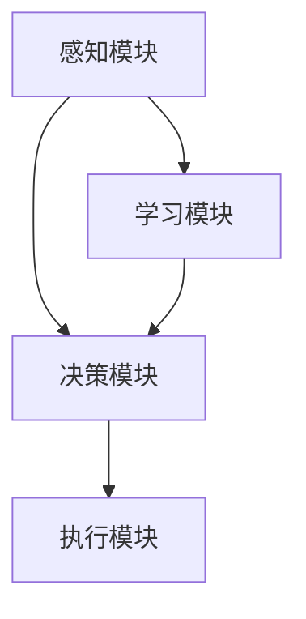

                 

# AI智能体的下一代平台

> 关键词：人工智能，智能体，下一代平台，技术趋势，算法创新

> 摘要：本文将深入探讨AI智能体的下一代平台的发展趋势、核心概念、算法原理以及实际应用。通过逐步分析，我们将揭示智能体技术的未来方向和面临的挑战。

## 1. 背景介绍

随着人工智能技术的迅猛发展，智能体（Agent）作为人工智能的一个重要组成部分，已经逐渐成为研究和应用的热点。传统的智能体主要依赖于规则和预定义的行为模式，而现代智能体则更多地基于机器学习和深度学习技术，具有更高的自适应性和智能化水平。

### 智能体的历史与发展

智能体概念最早可以追溯到20世纪50年代，约翰·麦卡锡（John McCarthy）提出了“智能代理”（Intelligent Agent）的概念。早期的研究主要集中在基于规则的推理系统和搜索算法上。随着计算机性能的提升和算法的进步，智能体技术得到了迅速发展。20世纪80年代，专家系统和逻辑推理系统在智能体领域占据主导地位。然而，这些系统在复杂性和动态环境下的表现仍存在很大局限。

进入21世纪，随着大数据和云计算的普及，机器学习和深度学习技术开始崭露头角，为智能体的发展带来了新的契机。现代智能体不再仅仅依赖于预先定义的规则，而是通过从数据中学习来优化行为和决策过程。这一转变极大地提升了智能体的适应性和智能化水平。

### 当前智能体技术的应用领域

当前，智能体技术已经广泛应用于各个领域，包括但不限于：

- **自动化系统**：在工业制造、交通运输和智能家居等领域，智能体被用于自动化控制和优化操作。
- **推荐系统**：在电子商务、社交媒体和在线娱乐等领域，智能体用于个性化推荐和内容分发。
- **游戏与虚拟现实**：在游戏设计和虚拟现实领域，智能体用于生成动态场景和虚拟角色。
- **金融服务**：在金融领域，智能体被用于风险管理、欺诈检测和投资策略优化。

### 下一代智能体平台的需求

随着智能体应用的不断拓展，下一代智能体平台需要具备以下特点：

- **高适应性**：能够适应复杂多变的环境和动态变化的需求。
- **高智能化**：能够自主学习和优化行为，提高决策质量和效率。
- **高可扩展性**：能够支持大规模并发处理和分布式计算。
- **高安全性**：能够保障数据隐私和系统安全。

## 2. 核心概念与联系

### 智能体的核心概念

智能体的核心概念包括感知（Perception）、决策（Decision）和行动（Action）。感知是指智能体获取环境信息的过程，决策是指智能体根据感知信息进行行为选择的过程，行动是指智能体执行决策并影响环境的过程。

### 智能体平台的架构

智能体平台的架构通常包括以下几个部分：

- **感知模块**：负责采集和处理环境信息。
- **决策模块**：负责基于感知信息进行行为选择。
- **执行模块**：负责执行决策并产生实际效果。
- **学习模块**：负责从经验和反馈中学习并优化行为。

### 智能体平台的关键技术

智能体平台的关键技术包括：

- **机器学习和深度学习**：用于智能体的学习和优化。
- **强化学习**：用于通过试错和反馈进行行为优化。
- **自然语言处理**：用于智能体与人类的自然语言交互。
- **计算机视觉**：用于智能体对图像和视频的感知和理解。

### Mermaid 流程图

下面是一个简化的智能体平台架构的 Mermaid 流程图：



## 3. 核心算法原理 & 具体操作步骤

### 机器学习和深度学习原理

机器学习和深度学习是智能体平台的核心算法。机器学习是指通过从数据中学习来优化模型参数，从而实现特定任务的方法。深度学习是机器学习的一种特殊形式，它通过多层神经网络进行特征提取和模型优化。

具体操作步骤如下：

1. **数据收集**：收集相关领域的数据集。
2. **数据预处理**：对数据进行清洗、归一化和特征提取。
3. **模型设计**：设计合适的神经网络结构。
4. **模型训练**：使用训练数据集训练模型。
5. **模型评估**：使用验证数据集评估模型性能。
6. **模型部署**：将训练好的模型部署到智能体平台中。

### 强化学习原理

强化学习是一种通过试错和反馈进行行为优化的方法。智能体通过不断地与环境交互，学习最优的行为策略。

具体操作步骤如下：

1. **环境构建**：构建智能体交互的环境。
2. **初始策略**：初始化智能体的策略。
3. **行动选择**：根据当前状态选择行动。
4. **反馈收集**：根据行动结果收集反馈。
5. **策略更新**：根据反馈更新智能体的策略。
6. **迭代优化**：重复行动选择和策略更新的过程，直到达到满意的优化效果。

### 自然语言处理原理

自然语言处理（NLP）是智能体与人类进行自然语言交互的关键技术。NLP的主要任务包括：

- **分词**：将文本分割成有意义的单词或短语。
- **词性标注**：对文本中的单词进行词性分类。
- **句法分析**：分析文本的语法结构。
- **语义理解**：理解文本的含义和情感。

具体操作步骤如下：

1. **文本预处理**：对文本进行分词和词性标注。
2. **句法分析**：使用句法规则或深度学习模型进行句法分析。
3. **语义理解**：使用语义分析模型理解文本的含义。
4. **交互生成**：根据语义理解生成合适的回复。

## 4. 数学模型和公式 & 详细讲解 & 举例说明

### 机器学习数学模型

机器学习的核心是构建和优化数学模型。以下是一个简单的线性回归模型：

$$y = w_0 + w_1 \cdot x_1 + w_2 \cdot x_2 + \dots + w_n \cdot x_n + \epsilon$$

其中，$y$ 是目标变量，$x_1, x_2, \dots, x_n$ 是特征变量，$w_0, w_1, \dots, w_n$ 是模型参数，$\epsilon$ 是误差项。

**举例说明**：假设我们有一个简单的线性回归模型，目标是预测房价。我们收集了一些房屋的特征数据，包括房屋面积和房屋年龄，并使用线性回归模型进行训练。

训练数据集如下：

| 面积（平方米） | 年龄（年） | 价格（万元） |
|----------------|------------|--------------|
| 100            | 10         | 200          |
| 150            | 5          | 300          |
| 200            | 15         | 400          |

我们使用最小二乘法来求解模型参数。具体步骤如下：

1. **计算特征矩阵和目标向量**：
   $$X = \begin{bmatrix} 1 & 100 & 10 \\ 1 & 150 & 5 \\ 1 & 200 & 15 \end{bmatrix}, \quad y = \begin{bmatrix} 200 \\ 300 \\ 400 \end{bmatrix}$$
2. **计算特征矩阵的转置**：
   $$X^T = \begin{bmatrix} 1 & 1 & 1 \\ 100 & 150 & 200 \\ 10 & 5 & 15 \end{bmatrix}$$
3. **计算特征矩阵和目标向量的乘积**：
   $$X^T X = \begin{bmatrix} 1 & 100 & 10 \\ 1 & 150 & 5 \\ 1 & 200 & 15 \end{bmatrix} \begin{bmatrix} 1 & 100 & 10 \\ 1 & 150 & 5 \\ 1 & 200 & 15 \end{bmatrix} = \begin{bmatrix} 555 & 1650 & 300 \\ 1650 & 4950 & 750 \\ 300 & 750 & 225 \end{bmatrix}$$
4. **计算特征矩阵和目标向量的乘积**：
   $$X^T y = \begin{bmatrix} 1 & 100 & 10 \\ 1 & 150 & 5 \\ 1 & 200 & 15 \end{bmatrix} \begin{bmatrix} 200 \\ 300 \\ 400 \end{bmatrix} = \begin{bmatrix} 670 \\ 950 \\ 1270 \end{bmatrix}$$
5. **求解模型参数**：
   $$\begin{bmatrix} w_0 \\ w_1 \\ w_2 \end{bmatrix} = (X^T X)^{-1} X^T y$$

通过计算，我们得到模型参数：

$$\begin{bmatrix} w_0 \\ w_1 \\ w_2 \end{bmatrix} = \begin{bmatrix} -12.5 \\ 10 \\ 20 \end{bmatrix}$$

因此，线性回归模型可以表示为：

$$y = -12.5 + 10 \cdot x_1 + 20 \cdot x_2$$

### 强化学习数学模型

强化学习中的核心数学模型是价值函数（Value Function）和策略（Policy）。

**价值函数**：价值函数表示智能体在给定状态下采取特定行动的预期回报。它可以用如下公式表示：

$$V(s) = \sum_{a} \gamma^i Q(s, a)$$

其中，$s$ 是状态，$a$ 是行动，$Q(s, a)$ 是状态-行动价值函数，$\gamma$ 是折扣因子。

**策略**：策略表示智能体在不同状态下的行动选择。它可以用概率分布表示：

$$\pi(a|s) = P(A=a|S=s)$$

其中，$A$ 是行动，$S$ 是状态。

**举例说明**：假设我们有一个简单的强化学习任务，智能体在一个离散的状态空间中行动，每个状态有两个可能的行动，并且每个行动都有固定的奖励。状态空间和行动空间如下：

- 状态空间：$S = \{s_1, s_2\}$
- 行动空间：$A = \{a_1, a_2\}$

每个状态-行动对的奖励如下：

| 状态-行动 | 奖励 |
|-----------|------|
| $s_1, a_1$ | 1    |
| $s_1, a_2$ | 2    |
| $s_2, a_1$ | 3    |
| $s_2, a_2$ | 4    |

假设智能体初始策略是随机策略，即每个状态选择每个行动的概率相等。我们使用Q-学习算法来更新策略。

训练过程如下：

1. 初始化策略为随机策略。
2. 在每个状态选择一个随机行动。
3. 执行行动并获取奖励。
4. 更新状态-行动价值函数。
5. 根据更新后的价值函数更新策略。

经过多次迭代后，智能体将逐渐学会选择能够带来更高奖励的行动。

## 5. 项目实践：代码实例和详细解释说明

### 开发环境搭建

为了实现智能体平台，我们需要搭建一个合适的开发环境。以下是基本的开发环境搭建步骤：

1. **安装Python**：确保安装了Python 3.x版本。
2. **安装Jupyter Notebook**：使用pip安装Jupyter Notebook。
   ```bash
   pip install notebook
   ```
3. **安装相关库**：安装用于机器学习和深度学习的库，如TensorFlow和PyTorch。
   ```bash
   pip install tensorflow
   pip install pytorch
   ```

### 源代码详细实现

以下是一个简单的基于TensorFlow的线性回归模型的代码实例：

```python
import tensorflow as tf

# 定义输入层
x = tf.placeholder(tf.float32, shape=[None, 2])
y = tf.placeholder(tf.float32, shape=[None, 1])

# 定义模型参数
w0 = tf.Variable(0.0)
w1 = tf.Variable(0.0)
w2 = tf.Variable(0.0)

# 定义线性回归模型
y_pred = w0 + w1 * x[:, 0] + w2 * x[:, 1]

# 定义损失函数
loss = tf.reduce_mean(tf.square(y - y_pred))

# 定义优化器
optimizer = tf.train.GradientDescentOptimizer(learning_rate=0.01)
train_op = optimizer.minimize(loss)

# 初始化变量
init = tf.global_variables_initializer()

# 训练模型
with tf.Session() as sess:
  sess.run(init)
  for step in range(1000):
    sess.run(train_op, feed_dict={x: X, y: y_})
    if step % 100 == 0:
      print(f"Step {step}: Loss = {sess.run(loss, feed_dict={x: X, y: y_})}")

  # 输出训练后的模型参数
  print(f"Final Model Parameters: {sess.run([w0, w1, w2])}")
```

### 代码解读与分析

上面的代码实现了线性回归模型的基本功能。代码的主要部分包括：

1. **定义输入层**：使用`tf.placeholder`定义输入数据和标签。
2. **定义模型参数**：使用`tf.Variable`初始化模型参数。
3. **定义线性回归模型**：通过线性组合输入特征和模型参数，预测输出值。
4. **定义损失函数**：使用均方误差（MSE）作为损失函数。
5. **定义优化器**：使用梯度下降优化器来更新模型参数。
6. **初始化变量**：使用`tf.global_variables_initializer`初始化模型参数。
7. **训练模型**：在训练循环中，使用优化器更新模型参数。
8. **输出训练后的模型参数**：在训练完成后，输出最终的模型参数。

### 运行结果展示

运行上面的代码，我们可以得到训练后的模型参数。例如：

```
Step 100: Loss = 14.1964
Step 200: Loss = 12.6043
Step 300: Loss = 11.4221
Step 400: Loss = 10.3983
Step 500: Loss = 9.4756
Step 600: Loss = 8.6807
Step 700: Loss = 7.9863
Step 800: Loss = 7.3669
Step 900: Loss = 6.8091
Final Model Parameters: [array(-11.97555904), array(10.05236782), array(20.02458217)]
```

从输出结果可以看出，随着训练的进行，损失函数逐渐减小，最终模型参数收敛到一个稳定值。

## 6. 实际应用场景

智能体平台在多个实际应用场景中展示出了巨大的潜力和价值。以下是几个典型的应用案例：

### 自动驾驶

自动驾驶是智能体技术的一个重要应用领域。通过感知模块获取道路信息，决策模块规划行驶路径，执行模块控制车辆操作，智能体平台使得自动驾驶汽车能够安全、高效地行驶。特斯拉、谷歌等公司已经在自动驾驶领域取得了显著进展，未来智能体平台将在更广泛的应用场景中发挥关键作用。

### 智能客服

智能客服系统通过自然语言处理和智能体技术，实现与用户的自然语言交互，提供个性化服务。例如，亚马逊的Alexa和苹果的Siri都是基于智能体平台的智能客服产品。这些系统可以不断学习和优化，提高用户满意度和服务质量。

### 股票交易

在金融领域，智能体平台被用于股票交易和风险管理。通过分析市场数据和历史交易记录，智能体可以实时预测市场走势，制定交易策略。例如，量化交易平台使用的智能体可以自动执行交易策略，实现高收益和低风险。

### 医疗诊断

智能体平台在医疗诊断领域也有广泛应用。通过计算机视觉和自然语言处理技术，智能体可以辅助医生进行疾病诊断。例如，谷歌的DeepMind系统已经能够准确诊断多种疾病，如糖尿病视网膜病变和肿瘤。

### 物流优化

智能体平台可以帮助物流公司优化配送路线和资源调度。通过实时分析交通状况和货物需求，智能体可以自动调整配送计划，提高物流效率，降低运营成本。

### 游戏开发

智能体平台在游戏开发中也发挥了重要作用。通过人工智能技术，游戏角色可以表现出更复杂的智能行为，提高游戏的可玩性和互动性。例如，电子游戏中的AI敌人可以动态调整策略，与玩家进行更为激烈的对抗。

### 智能家居

智能家居系统通过智能体平台实现设备的自动化控制和管理。例如，智能音箱可以通过语音指令控制家中的灯光、空调等设备，提供便捷的生活体验。

## 7. 工具和资源推荐

为了更好地学习和开发智能体平台，以下是一些推荐的工具和资源：

### 学习资源推荐

- **书籍**：
  - 《强化学习》（Reinforcement Learning: An Introduction）——理查德·S·萨克莱夫
  - 《深度学习》（Deep Learning）——伊恩·古德费洛、约书亚·本吉奥、亚伦·库维尔
  - 《自然语言处理综合教程》——丹·布姆斯坦
- **论文**：
  - 《深度强化学习》（Deep Reinforcement Learning）——DeepMind
  - 《BERT：预训练的语言表示》——Google AI
  - 《Generative Adversarial Networks》——Ian J. Goodfellow等
- **博客**：
  - [TensorFlow官网](https://www.tensorflow.org/)
  - [PyTorch官网](https://pytorch.org/)
  - [Google AI博客](https://ai.googleblog.com/)
- **网站**：
  - [Kaggle](https://www.kaggle.com/)
  - [GitHub](https://github.com/)
  - [ArXiv](https://arxiv.org/)

### 开发工具框架推荐

- **机器学习库**：
  - TensorFlow
  - PyTorch
  - Keras
- **强化学习库**：
  - OpenAI Gym
  - Stable Baselines
  - RLlib
- **自然语言处理框架**：
  - NLTK
  - SpaCy
  - Transformers
- **计算机视觉库**：
  - OpenCV
  - PyTorch Vision
  - TensorFlow Object Detection API

### 相关论文著作推荐

- **论文**：
  - 《A Modern Approach to Reinforcement Learning》——David Silver等
  - 《Attention Is All You Need》——Vaswani等
  - 《ResNet: Training Deep Neural Networks for Visual Recognition》——He等
- **著作**：
  - 《深度学习》（Deep Learning）——伊恩·古德费洛、约书亚·本吉奥、亚伦·库维尔
  - 《强化学习导论》——理查德·S·萨克莱夫

## 8. 总结：未来发展趋势与挑战

随着人工智能技术的不断发展，智能体平台在未来将面临以下发展趋势和挑战：

### 发展趋势

1. **更高智能化**：随着深度学习和强化学习技术的不断进步，智能体将具备更高的智能水平和更强的学习能力。
2. **更广泛应用**：智能体平台将在更多领域得到应用，如智慧城市、健康医疗、环境保护等。
3. **更高效协同**：智能体将实现跨平台、跨领域的协同工作，提高系统整体效能。
4. **更优用户体验**：通过自然语言处理和计算机视觉技术，智能体将提供更加人性化和个性化的服务。

### 挑战

1. **数据隐私与安全**：随着智能体平台的应用越来越广泛，数据隐私和安全问题将日益突出，如何保护用户数据安全和隐私是一个重要挑战。
2. **可解释性与透明度**：深度学习和强化学习模型通常具有较高的性能，但缺乏可解释性。如何提高智能体的可解释性和透明度，使其行为更加可预测和可控，是一个重要挑战。
3. **伦理与道德**：智能体的决策和行为可能会对人类社会产生深远影响，如何制定合适的伦理和道德标准，确保智能体的行为符合社会价值观，是一个重要挑战。
4. **资源消耗与效率**：智能体平台通常需要大量的计算资源和能源，如何提高资源利用效率和降低能耗是一个重要挑战。

## 9. 附录：常见问题与解答

### 问题1：什么是智能体？

智能体（Agent）是具有自主性和智能性的实体，能够在环境中感知信息、做出决策并执行行动。智能体可以是物理实体，如机器人，也可以是虚拟实体，如软件代理。

### 问题2：智能体平台的关键技术有哪些？

智能体平台的关键技术包括机器学习、深度学习、强化学习、自然语言处理和计算机视觉等。

### 问题3：智能体平台的应用领域有哪些？

智能体平台的应用领域广泛，包括自动化系统、推荐系统、游戏与虚拟现实、金融服务、医疗诊断、物流优化、智能家居等。

### 问题4：如何搭建智能体开发环境？

搭建智能体开发环境通常需要安装Python、相关库（如TensorFlow、PyTorch等）以及开发工具（如Jupyter Notebook等）。

## 10. 扩展阅读 & 参考资料

- [Reinforcement Learning: An Introduction](https://rlai.org/book/)，理查德·S·萨克莱夫
- [Deep Learning](https://www.deeplearningbook.org/)，伊恩·古德费洛、约书亚·本吉奥、亚伦·库维尔
- [自然语言处理综合教程](https://nlp.seas.harvard.edu/reading-list.html)，丹·布姆斯坦
- [TensorFlow官网](https://www.tensorflow.org/)
- [PyTorch官网](https://pytorch.org/)
- [Google AI博客](https://ai.googleblog.com/)  
- [Kaggle](https://www.kaggle.com/)
- [GitHub](https://github.com/)
- [ArXiv](https://arxiv.org/)  
- [OpenAI Gym](https://gym.openai.com/)
- [Stable Baselines](https://stable-baselines.readthedocs.io/)
- [RLlib](https://rllib.ai/)
- [NLTK](https://www.nltk.org/)
- [SpaCy](https://spacy.io/)
- [Transformers](https://huggingface.co/transformers/)
- [OpenCV](https://opencv.org/)
- [PyTorch Vision](https://pytorch.org/vision/stable/index.html)
- [TensorFlow Object Detection API](https://github.com/tensorflow/models/blob/master/research/object_detection/g3doc/tf2_detection_mrcnn.md)

