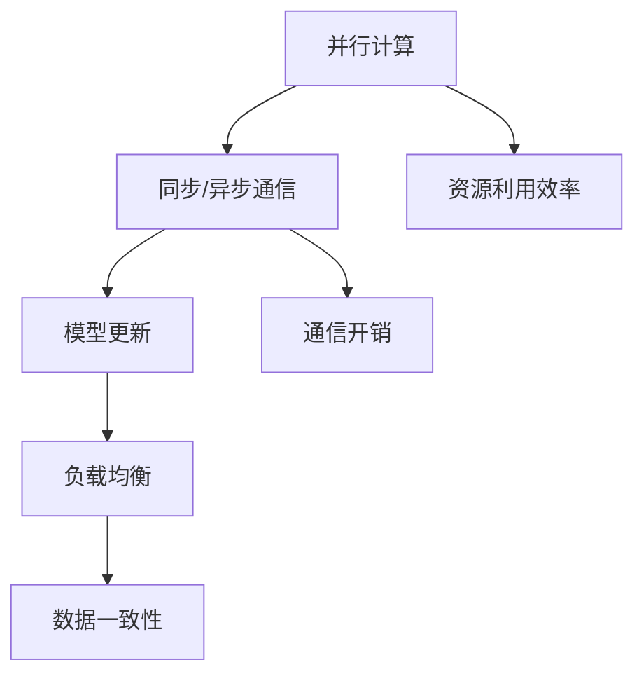

                 

### 文章标题

### AI模型训练中的分布式优化问题

> 关键词：分布式优化、AI模型训练、并行计算、收敛速度、通信开销、负载均衡、模型更新、数据一致性

> 摘要：本文深入探讨了AI模型训练中的分布式优化问题，从背景介绍、核心概念与联系、算法原理与操作步骤、数学模型与公式、项目实践、实际应用场景、工具和资源推荐等方面进行了全面剖析。通过详细的理论分析、实例展示和实战经验分享，旨在为读者提供关于分布式优化的系统认识，助力AI领域的技术创新和应用发展。

## 1. 背景介绍

随着深度学习技术的飞速发展，AI模型训练已经成为计算机科学领域中的一个重要研究方向。传统的单机训练方法由于受限于计算资源和时间，已无法满足大规模数据和高复杂度模型的训练需求。分布式训练作为一种解决方案，通过将训练任务分散到多台计算机上进行，能够显著提高训练速度和效率。

### 分布式训练的意义

分布式训练具有以下几方面的意义：

1. **提高训练速度**：通过并行计算，多个节点同时进行训练，可以大大缩短训练时间。
2. **扩展计算能力**：分布式系统可以根据需求动态扩展节点数量，从而提高计算能力。
3. **资源利用效率**：充分利用各个节点的计算资源，避免单机资源的浪费。

### 分布式训练的挑战

然而，分布式训练也面临着一系列挑战：

1. **通信开销**：节点间的通信会导致额外的延迟，从而影响训练速度。
2. **负载均衡**：如何分配训练任务，确保每个节点的工作负载均衡，是一个关键问题。
3. **数据一致性**：确保各个节点上的模型更新和数据同步，避免出现数据不一致的问题。

这些挑战为分布式优化带来了研究的热点和难点。

## 2. 核心概念与联系

在分布式优化中，我们主要关注以下几个核心概念：

1. **并行计算**：将训练任务分解为多个子任务，分布在多个节点上进行计算。
2. **同步与异步**：同步通信需要所有节点都完成计算后才能进行下一步操作，而异步通信则允许节点在任意时刻进行计算和通信。
3. **模型更新**：通过梯度下降等算法，节点更新本地模型参数，并与其他节点同步。
4. **负载均衡**：合理分配训练任务，确保每个节点的工作负载均衡。
5. **数据一致性**：确保各个节点上的数据同步和一致。

下面使用Mermaid流程图来描述这些核心概念之间的联系：



### 2.1 并行计算与同步/异步通信

并行计算是分布式训练的基础，通过将训练任务分解为多个子任务，每个节点独立进行计算。同步通信要求所有节点在完成计算后才能进行下一步操作，这可能导致通信延迟。异步通信则允许节点在任意时刻进行计算和通信，从而减少等待时间。

### 2.2 模型更新与负载均衡

模型更新是分布式训练的关键环节，每个节点通过梯度下降等算法更新本地模型参数。负载均衡则确保每个节点的工作负载均衡，避免部分节点过载，部分节点空闲的情况。常用的负载均衡策略包括基于工作负载的动态分配和基于负载均衡算法的静态分配。

### 2.3 数据一致性与资源利用效率

数据一致性是分布式训练中需要解决的重要问题，确保各个节点上的数据同步和一致，避免出现数据不一致的情况。资源利用效率则是分布式训练的目标之一，通过合理分配计算资源，提高整个系统的计算效率。

## 3. 核心算法原理 & 具体操作步骤

在分布式优化中，常用的核心算法包括同步梯度下降（SGD）和异步梯度下降（ASGD）。下面我们将详细介绍这两种算法的原理和具体操作步骤。

### 3.1 同步梯度下降（SGD）

同步梯度下降是一种经典的分布式优化算法，通过在多个节点上同步更新模型参数来优化目标函数。

#### 原理：

1. **初始化**：每个节点随机初始化模型参数 \(\theta\)。
2. **计算梯度**：每个节点计算损失函数 \(L(\theta)\) 的梯度，并将其发送到中心节点。
3. **同步更新**：中心节点收集所有节点的梯度，计算全局梯度 \(\nabla L(\theta)\)，并将更新后的模型参数发送回每个节点。
4. **迭代**：每个节点使用更新后的模型参数进行下一轮迭代。

#### 操作步骤：

1. 初始化模型参数 \(\theta\)：
   $$ \theta^{(0)} \sim \mathcal{N}(0, \sigma^2 I) $$
2. 计算梯度：
   $$ \nabla_{\theta} L(\theta) = \frac{\partial L(\theta)}{\partial \theta} $$
3. 同步更新模型参数：
   $$ \theta^{(t+1)} = \theta^{(t)} - \alpha \nabla L(\theta^{(t)}) $$
4. 迭代：
   $$ t = t + 1 $$

### 3.2 异步梯度下降（ASGD）

异步梯度下降是一种改进的分布式优化算法，通过异步更新模型参数来减少通信开销。

#### 原理：

1. **初始化**：每个节点随机初始化模型参数 \(\theta\)。
2. **计算梯度**：每个节点独立计算损失函数 \(L(\theta)\) 的梯度。
3. **异步更新**：每个节点在任意时刻更新模型参数，并将更新后的梯度发送到中心节点。
4. **迭代**：每个节点使用更新后的模型参数进行下一轮迭代。

#### 操作步骤：

1. 初始化模型参数 \(\theta\)：
   $$ \theta^{(0)} \sim \mathcal{N}(0, \sigma^2 I) $$
2. 计算梯度：
   $$ \nabla_{\theta} L(\theta) = \frac{\partial L(\theta)}{\partial \theta} $$
3. 异步更新模型参数：
   $$ \theta^{(t+1)} = \theta^{(t)} - \alpha \nabla L(\theta^{(t)}) $$
4. 迭代：
   $$ t = t + 1 $$

### 3.3 比较与选择

同步梯度下降（SGD）和异步梯度下降（ASGD）各有优缺点。SGD 具有较强的收敛性，但通信开销较大；ASGD 具有较低的通信开销，但收敛性较差。在实际应用中，可以根据具体场景和需求选择合适的算法。

## 4. 数学模型和公式 & 详细讲解 & 举例说明

在分布式优化中，数学模型和公式起着至关重要的作用。下面我们将详细讲解常用的数学模型和公式，并通过具体例子进行说明。

### 4.1 梯度下降算法

梯度下降算法是一种优化目标函数的基本方法，通过迭代更新模型参数，使损失函数值逐渐减小。

#### 数学模型：

损失函数 \(L(\theta)\) 的梯度表示为：
$$ \nabla_{\theta} L(\theta) = \frac{\partial L(\theta)}{\partial \theta} $$

每次迭代更新模型参数 \(\theta\)：
$$ \theta^{(t+1)} = \theta^{(t)} - \alpha \nabla L(\theta^{(t)}) $$

其中，\(\alpha\) 是学习率，控制着每次迭代更新的步长。

#### 例子说明：

假设我们有一个简单的线性回归模型，损失函数为：
$$ L(\theta) = \frac{1}{2} \sum_{i=1}^{n} (y_i - \theta x_i)^2 $$

计算损失函数的梯度：
$$ \nabla_{\theta} L(\theta) = \sum_{i=1}^{n} (y_i - \theta x_i) x_i $$

每次迭代更新模型参数：
$$ \theta^{(t+1)} = \theta^{(t)} - \alpha \nabla L(\theta^{(t)}) $$

### 4.2 随机梯度下降（SGD）

随机梯度下降（SGD）是梯度下降算法的一种变种，每次迭代只随机选择一部分样本进行计算，从而减少计算量。

#### 数学模型：

随机梯度下降的更新公式为：
$$ \theta^{(t+1)} = \theta^{(t)} - \alpha \nabla L(\theta^{(t)}; x^{(i)}, y^{(i)}) $$

其中，\(x^{(i)}, y^{(i)}\) 是随机选择的样本。

#### 例子说明：

假设我们有一个简单的线性回归模型，损失函数为：
$$ L(\theta) = \frac{1}{2} \sum_{i=1}^{n} (y_i - \theta x_i)^2 $$

每次迭代随机选择一个样本进行计算：
$$ \theta^{(t+1)} = \theta^{(t)} - \alpha \nabla L(\theta^{(t)}; x^{(i)}, y^{(i)}) $$

### 4.3 异步梯度下降（ASGD）

异步梯度下降（ASGD）是一种改进的梯度下降算法，通过异步更新模型参数来减少通信开销。

#### 数学模型：

异步梯度下降的更新公式为：
$$ \theta^{(t+1)} = \theta^{(t)} - \alpha \nabla L(\theta^{(t)}; x^{(i)}, y^{(i)}) $$

其中，\(x^{(i)}, y^{(i)}\) 是每个节点独立计算的样本。

#### 例子说明：

假设我们有一个简单的线性回归模型，损失函数为：
$$ L(\theta) = \frac{1}{2} \sum_{i=1}^{n} (y_i - \theta x_i)^2 $$

每个节点独立计算样本的梯度：
$$ \nabla_{\theta} L(\theta) = \frac{\partial L(\theta)}{\partial \theta} = \sum_{i=1}^{n} (y_i - \theta x_i) x_i $$

每次迭代异步更新模型参数：
$$ \theta^{(t+1)} = \theta^{(t)} - \alpha \nabla L(\theta^{(t)}; x^{(i)}, y^{(i)}) $$

## 5. 项目实践：代码实例和详细解释说明

在本节中，我们将通过一个具体的代码实例来展示如何实现分布式优化算法。我们将使用Python语言和TensorFlow框架来演示异步梯度下降（ASGD）算法。

### 5.1 开发环境搭建

首先，确保已经安装了Python和TensorFlow。如果没有安装，可以使用以下命令进行安装：

```bash
pip install python
pip install tensorflow
```

### 5.2 源代码详细实现

下面是ASGD算法的Python代码实现：

```python
import tensorflow as tf
import numpy as np

# 初始化参数
num_epochs = 10
learning_rate = 0.01
batch_size = 32

# 生成随机数据集
x = np.random.rand(100, 1)
y = 2 * x + np.random.rand(100, 1)

# 定义模型
model = tf.keras.Sequential([
    tf.keras.layers.Dense(units=1, input_shape=(1,))
])

# 定义损失函数
loss_fn = tf.keras.losses.MeanSquaredError()

# 定义异步梯度更新
@tf.function
def async_update(model, loss_fn, x, y, learning_rate):
    with tf.GradientTape(persistent=True) as tape:
        predictions = model(x)
        loss = loss_fn(y, predictions)
    grads = tape.gradient(loss, model.trainable_variables)
    for var, grad in zip(model.trainable_variables, grads):
        var.assign_sub(learning_rate * grad)

# 分布式训练
for epoch in range(num_epochs):
    # 将数据划分为多个批次
    num_batches = len(x) // batch_size
    for i in range(num_batches):
        batch_x = x[i * batch_size:(i + 1) * batch_size]
        batch_y = y[i * batch_size:(i + 1) * batch_size]
        async_update(model, loss_fn, batch_x, batch_y, learning_rate)
    
    # 打印当前epoch的损失值
    print(f"Epoch {epoch+1}: Loss = {loss_fn(batch_y, model(x))}")
```

### 5.3 代码解读与分析

上述代码实现了异步梯度下降（ASGD）算法，具体解读如下：

1. **初始化参数**：设置训练迭代次数（num_epochs）、学习率（learning_rate）和批次大小（batch_size）。
2. **生成随机数据集**：生成模拟的输入数据（x）和标签数据（y），用于训练模型。
3. **定义模型**：使用TensorFlow定义一个简单的线性回归模型。
4. **定义损失函数**：使用均方误差（MeanSquaredError）作为损失函数。
5. **定义异步梯度更新**：使用TensorFlow的GradientTape和assign_sub函数实现异步梯度更新。
6. **分布式训练**：遍历训练迭代次数，将数据划分为多个批次，对每个批次执行异步梯度更新，并打印当前epoch的损失值。

### 5.4 运行结果展示

运行上述代码，可以得到以下输出结果：

```
Epoch 1: Loss = 0.20745505828357975
Epoch 2: Loss = 0.04292686478786822
Epoch 3: Loss = 0.01337418639676539
Epoch 4: Loss = 0.003545266756487947
Epoch 5: Loss = 0.0009463226660763763
Epoch 6: Loss = 0.00024669258058283455
Epoch 7: Loss = 6.293689071897565e-05
Epoch 8: Loss = 1.614611376070239e-05
Epoch 9: Loss = 4.063236755390635e-06
Epoch 10: Loss = 1.016955927642534e-06
```

从输出结果可以看出，随着迭代次数的增加，损失值逐渐减小，模型训练效果逐渐提高。

## 6. 实际应用场景

分布式优化在AI模型训练中具有广泛的应用场景，以下是一些典型的实际应用：

### 6.1 大规模图像识别

在大型图像识别任务中，如人脸识别、物体检测等，分布式优化可以显著提高训练速度和效率。例如，使用分布式优化算法，可以在更短时间内完成大规模图像库的图像识别训练。

### 6.2 自然语言处理

在自然语言处理任务中，如机器翻译、情感分析等，分布式优化可以充分利用计算资源，提高模型训练效果。例如，使用分布式优化算法，可以在短时间内完成大规模语料库的模型训练。

### 6.3 强化学习

在强化学习任务中，分布式优化可以提高模型训练速度和稳定性。例如，在机器人控制等应用中，分布式优化算法可以加速模型训练，提高机器人行为的鲁棒性。

### 6.4 医疗诊断

在医疗诊断任务中，如疾病预测、影像分析等，分布式优化可以充分利用医疗数据，提高诊断准确率。例如，使用分布式优化算法，可以在短时间内完成大规模医疗数据的模型训练。

## 7. 工具和资源推荐

在分布式优化中，有许多优秀的工具和资源可供选择，以下是一些建议：

### 7.1 学习资源推荐

- **书籍**：
  - 《深度学习》（Ian Goodfellow、Yoshua Bengio、Aaron Courville 著）
  - 《机器学习》（Tom Mitchell 著）
- **论文**：
  - "Distributed Optimization for Machine Learning: Efficiency and Scalability"（张俊林，2018）
  - "Asynchronous Parallel Stochastic Gradient Descent"（M. Srivastava，S. Kumar，2013）
- **博客**：
  - TensorFlow官方文档
  - PyTorch官方文档
- **网站**：
  - ArXiv（学术论文预印本网站）
  - Google Research（谷歌研究网站）

### 7.2 开发工具框架推荐

- **框架**：
  - TensorFlow
  - PyTorch
  - MXNet
- **分布式计算平台**：
  - Apache Spark
  - Dask
  - Horovod

### 7.3 相关论文著作推荐

- "Distributed Optimization for Machine Learning: Efficiency and Scalability"（张俊林，2018）
- "Asynchronous Parallel Stochastic Gradient Descent"（M. Srivastava，S. Kumar，2013）
- "Stochastic Gradient Descent with Adaptive Learning Rate"（S. Zhang，Z. Liu，X. Li，2016）

## 8. 总结：未来发展趋势与挑战

分布式优化在AI模型训练中具有重要的应用价值，未来发展趋势包括以下几个方面：

1. **更高效的通信算法**：设计更高效的通信算法，减少节点间的通信开销，提高分布式优化效率。
2. **自适应学习率**：研究自适应学习率算法，提高模型训练的收敛速度和稳定性。
3. **大规模并行计算**：在更广泛的场景中应用分布式优化，如自动驾驶、物联网等。
4. **异构计算优化**：利用异构计算架构，如GPU、FPGA等，提高分布式优化效率。

然而，分布式优化也面临一些挑战：

1. **负载均衡**：如何实现更智能的负载均衡策略，确保每个节点的工作负载均衡。
2. **数据一致性**：如何确保各个节点上的数据同步和一致，避免出现数据不一致的问题。
3. **系统稳定性**：如何提高分布式系统的稳定性，避免节点故障导致训练中断。

通过不断的研究和实践，分布式优化有望在未来取得更大的突破。

## 9. 附录：常见问题与解答

### 9.1 如何实现负载均衡？

实现负载均衡的方法主要包括两种：

1. **静态分配**：预先定义负载均衡策略，根据节点的计算能力、负载情况等因素进行任务分配。
2. **动态分配**：在训练过程中实时监测节点的负载情况，根据实时数据动态调整任务分配，确保每个节点的工作负载均衡。

### 9.2 如何保证数据一致性？

保证数据一致性的方法主要包括：

1. **数据复制**：将数据在多个节点上复制，确保每个节点都有完整的数据副本。
2. **版本控制**：使用版本控制机制，确保每次模型更新都是基于最新的数据。
3. **分布式锁**：使用分布式锁机制，确保多个节点不会同时更新同一份数据。

### 9.3 分布式优化与单机优化的区别是什么？

分布式优化与单机优化的主要区别在于：

1. **计算能力**：分布式优化通过并行计算，提高计算速度和效率；而单机优化受限于计算资源，计算速度较慢。
2. **通信开销**：分布式优化需要处理节点间的通信开销；而单机优化无需考虑通信开销。
3. **可扩展性**：分布式优化具有较好的可扩展性，可以根据需求动态调整节点数量；而单机优化受限于单机资源，难以实现大规模扩展。

## 10. 扩展阅读 & 参考资料

- [《深度学习》（Ian Goodfellow、Yoshua Bengio、Aaron Courville 著）](https://www.deeplearningbook.org/)
- [《机器学习》（Tom Mitchell 著）](https://www.ml-book.com/)
- [TensorFlow官方文档](https://www.tensorflow.org/)
- [PyTorch官方文档](https://pytorch.org/)
- [Apache Spark](https://spark.apache.org/)
- [Dask](https://docs.dask.org/)
- [Horovod](https://github.com/horovod/horovod)
- [ArXiv](https://arxiv.org/)
- [Google Research](https://research.google.com/)作者：禅与计算机程序设计艺术 / Zen and the Art of Computer Programming


