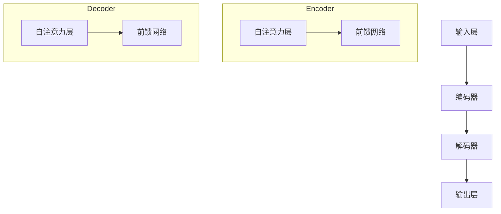

                 

### 背景介绍

#### AI浪潮的兴起

近年来，人工智能（AI）技术的快速发展已经成为全球范围内的一大热点。AI技术的广泛应用，从自动驾驶汽车、智能家居，到医疗诊断、金融分析，无不显示出其巨大的潜力和市场价值。特别是深度学习（Deep Learning）和自然语言处理（Natural Language Processing，NLP）领域的突破，使得AI在模仿人类智能、理解和生成自然语言方面取得了显著的进展。

#### ChatGPT的突破

在这个AI浪潮中，OpenAI推出的ChatGPT无疑是其中的明星产品。ChatGPT是基于GPT-3.5模型开发的一个大型语言模型，具有强大的自然语言生成和对话能力。它的出现，标志着AI技术迈向一个新的阶段，让人们对其应用前景充满期待。

#### ChatGPT的应用场景

ChatGPT在诸多领域展现出其独特的价值。例如，在客户服务领域，ChatGPT可以作为智能客服，自动回答用户的问题，提高服务效率；在教育领域，ChatGPT可以作为个性化学习助手，为学生提供个性化的学习内容；在内容创作领域，ChatGPT可以帮助内容创作者生成文章、代码、甚至音乐等。

#### ChatGPT的局限性

然而，尽管ChatGPT在自然语言处理领域取得了显著进展，但它也并非完美无缺。在现实应用中，ChatGPT仍然存在一些局限性，这些局限性不仅影响了其性能，也给用户带来了一定的困扰。接下来，我们将详细探讨这些局限性。

### ChatGPT的局限性

#### 数据偏差

ChatGPT作为大型语言模型，其性能依赖于大量的训练数据。然而，这些数据往往存在一定的偏差，可能导致ChatGPT在回答问题时产生偏见。例如，当ChatGPT在回答一个关于性别平等的问题时，如果其训练数据中男性角色占据了主导地位，那么ChatGPT可能更倾向于提供有利于男性的答案。

#### 信息准确性

尽管ChatGPT在生成文本方面表现出色，但它并不总是能够提供准确的信息。在某些情况下，ChatGPT可能会生成与事实不符的答案。例如，当用户询问一个科学问题时，ChatGPT可能会给出一个看似合理但事实上错误的答案。

#### 知识更新速度

ChatGPT的训练数据是有截止时间的，这意味着它无法实时获取最新的信息。在快速变化的领域，如科技、金融等，这可能导致ChatGPT的知识相对过时，影响其应用效果。

#### 对话连贯性

ChatGPT在处理长对话时，往往难以保持连贯性。这主要是因为ChatGPT在生成文本时，往往依赖于前文的信息，但长时间的记忆可能导致信息丢失，从而影响对话的连贯性。

#### 安全性问题

ChatGPT作为一种人工智能产品，其安全性也是一大关注点。由于ChatGPT可以生成文本，这可能被恶意用户用于生成虚假信息、进行网络诈骗等。因此，如何确保ChatGPT的安全运行，是一个亟待解决的问题。

### ChatGPT的自我修正

为了解决上述问题，ChatGPT的开发者已经采取了一些措施，以实现自我修正和性能提升。以下是一些主要的方法：

#### 数据清洗

通过清洗和筛选训练数据，减少数据中的偏差和错误，以提高ChatGPT的准确性。

#### 知识更新

定期更新ChatGPT的训练数据，使其能够获取最新的信息，提高其在快速变化领域的应用效果。

#### 对话管理

改进ChatGPT的对话管理机制，使其能够更好地保持对话的连贯性。

#### 安全防护

加强ChatGPT的安全防护措施，防止其被用于生成虚假信息和进行网络诈骗等。

#### 强化学习

通过强化学习等技术，使ChatGPT能够在实际应用中不断学习和优化，提高其性能和稳定性。

### 结论

总的来说，ChatGPT作为大型语言模型，尽管存在一定的局限性，但在自然语言处理领域仍然具有巨大的潜力。通过不断的技术创新和自我修正，ChatGPT有望在未来发挥更大的作用。然而，我们也要意识到，AI技术的发展和应用是一个不断迭代的过程，需要我们持续关注和改进。

在接下来的章节中，我们将进一步探讨ChatGPT的核心算法原理、数学模型和具体操作步骤，以及如何在项目实践中应用ChatGPT，并对其性能进行评估和优化。让我们继续深入探索这个充满挑战和机遇的领域。

---

### 核心概念与联系

在深入探讨ChatGPT之前，我们首先需要理解其核心概念和架构。以下是ChatGPT的核心概念、原理及其架构的详细描述。

#### 1. 核心概念

**自然语言处理（NLP）**：自然语言处理是人工智能的一个重要分支，旨在使计算机能够理解、解释和生成自然语言。在ChatGPT中，NLP的核心任务包括语言理解（Language Understanding）和语言生成（Language Generation）。

**深度学习（Deep Learning）**：深度学习是一种基于多层神经网络的学习方法，通过模拟人脑的神经元结构和工作方式，从大量数据中自动提取特征，从而实现复杂的模式识别和预测任务。ChatGPT采用的是基于Transformer的深度学习模型，这种模型在处理序列数据和生成文本方面具有显著优势。

**注意力机制（Attention Mechanism）**：注意力机制是一种在神经网络中用于关注输入数据中重要部分的技术。在ChatGPT中，注意力机制用于模型在生成文本时，关注上下文信息中的关键部分，从而提高文本生成的准确性和连贯性。

#### 2. 核心架构

**输入层（Input Layer）**：输入层接收用户输入的文本，并将其编码为向量表示。这个过程中涉及到词嵌入（Word Embedding）和位置编码（Positional Encoding）等技术。

**编码器（Encoder）**：编码器是ChatGPT的核心组件，负责处理输入文本，提取文本的特征表示。编码器通常采用多层Transformer结构，每一层都包含多个自注意力（Self-Attention）和前馈网络（Feedforward Network）。

**解码器（Decoder）**：解码器负责生成文本输出。与编码器类似，解码器也采用多层Transformer结构，但每一层的输入既包括编码器的输出，也包括上一时间步的解码器输出。

**输出层（Output Layer）**：输出层将解码器输出的向量映射为单词的概率分布，从而生成最终的文本输出。

#### 3. Mermaid流程图

为了更好地理解ChatGPT的架构，我们可以使用Mermaid流程图来描述其工作流程。以下是ChatGPT的Mermaid流程图：



#### 4. 核心概念与联系

**自然语言处理与深度学习**：自然语言处理是深度学习的一个重要应用领域。深度学习通过学习大量的文本数据，使计算机能够理解和生成自然语言。

**注意力机制与Transformer**：注意力机制是Transformer模型的核心组件，它使模型能够在处理序列数据时，关注输入序列中的关键部分，从而提高文本生成的质量。

**编码器与解码器**：编码器负责提取输入文本的特征表示，解码器则基于这些特征表示生成文本输出。编码器和解码器的协同工作，使得ChatGPT能够实现高效的文本生成。

通过上述核心概念和架构的介绍，我们为后续章节的深入探讨奠定了基础。在接下来的章节中，我们将详细讲解ChatGPT的核心算法原理和具体操作步骤，并探讨如何在实际项目中应用ChatGPT，以及如何对其进行评估和优化。

---

### 核心算法原理 & 具体操作步骤

#### 1. Transformer模型简介

ChatGPT采用的是基于Transformer的深度学习模型，Transformer模型是由Vaswani等人在2017年提出的，它是基于自注意力（Self-Attention）机制的序列到序列模型，被广泛应用于自然语言处理任务，如机器翻译、文本生成等。

**自注意力机制（Self-Attention）**：自注意力机制是一种在神经网络中用于关注输入数据中重要部分的技术。它通过计算输入序列中每个元素与所有其他元素的相关性，为每个输入元素生成一个权重向量，从而实现序列中元素间的相互依赖。

**Transformer模型结构**：Transformer模型由编码器（Encoder）和解码器（Decoder）两部分组成，编码器负责将输入序列编码为上下文表示，解码器则基于这些表示生成输出序列。

#### 2. 编码器（Encoder）的工作原理

**输入处理**：编码器首先接收输入文本序列，并将其编码为词嵌入向量。词嵌入是将单词映射为固定大小的向量表示，使得计算机能够理解和处理文本。

**自注意力层**：在编码器的每一层，都包含一个自注意力层。自注意力层通过计算输入序列中每个元素与所有其他元素的相关性，为每个输入元素生成一个权重向量。这些权重向量用于更新输入序列的表示，使其能够更好地捕获序列中的依赖关系。

**前馈网络**：在自注意力层之后，编码器还包含一个前馈网络。前馈网络是一个简单的全连接层，用于对自注意力层的输出进行进一步处理，增强模型的表示能力。

**多层编码器**：编码器通常由多层组成，每一层都包含自注意力层和前馈网络。多层编码器能够捕捉更复杂的依赖关系，提高模型的性能。

#### 3. 解码器（Decoder）的工作原理

**输入处理**：解码器接收编码器输出的上下文表示，并将其编码为词嵌入向量。与编码器类似，解码器的输入也是词嵌入向量。

**自注意力层**：在解码器的每一层，都包含一个自注意力层。自注意力层不仅关注编码器输出的上下文表示，还关注解码器自身的历史输出。这种双向注意力机制使得解码器能够同时利用编码器的输出和解码器自身的上下文信息，提高文本生成的连贯性。

**编码器-解码器注意力层**：解码器还包含一个编码器-解码器注意力层，该层通过计算编码器输出的上下文表示与解码器当前输出的相关性，为解码器的每个输出元素生成一个权重向量。这个权重向量用于调整解码器的输出，使其能够更好地匹配编码器的输出。

**前馈网络**：在自注意力层和编码器-解码器注意力层之后，解码器还包含一个前馈网络，用于对输出进行进一步处理。

**序列解码**：解码器的输出是一个单词序列的概率分布。解码器通过选择概率最高的单词作为输出，然后将其加入解码器的历史输出，作为下一时间步的输入，继续生成下一个单词。

#### 4. 具体操作步骤

**步骤1：输入文本预处理**  
首先，对输入文本进行预处理，包括分词、去除停用词、词干提取等。然后，将预处理后的文本序列编码为词嵌入向量。

**步骤2：编码器处理**  
将词嵌入向量输入到编码器中，编码器通过多层自注意力层和前馈网络，将输入序列编码为上下文表示。

**步骤3：解码器处理**  
将编码器输出的上下文表示输入到解码器中，解码器通过自注意力层、编码器-解码器注意力层和前馈网络，生成文本输出的概率分布。

**步骤4：文本生成**  
根据解码器输出的概率分布，选择概率最高的单词作为输出。然后，将这个单词加入解码器的历史输出，作为下一时间步的输入，继续生成下一个单词。重复这个过程，直到生成完整的文本输出。

#### 5. 数学模型和公式

**自注意力机制**：自注意力机制的数学公式如下：

$$
\text{Attention}(Q, K, V) = \frac{softmax(\frac{QK^T}{\sqrt{d_k}})}{V}
$$

其中，$Q$、$K$ 和 $V$ 分别是查询（Query）、键（Key）和值（Value）矩阵，$d_k$ 是键的维度。该公式计算了输入序列中每个元素与其他元素的相关性，并生成了权重向量。

**前馈网络**：前馈网络的数学公式如下：

$$
\text{FFN}(x) = \max(0, xW_1 + b_1)W_2 + b_2
$$

其中，$x$ 是输入向量，$W_1$ 和 $W_2$ 是权重矩阵，$b_1$ 和 $b_2$ 是偏置项。

**编码器和解码器**：编码器和解码器的数学公式如下：

$$
E = \text{Encoder}(X) = \text{FFN}(\text{Self-Attention}(X))
$$

$$
D = \text{Decoder}(Y) = \text{FFN}(\text{Encoder-Decoder-Attention}(\text{Encoder}(X), Y))
$$

其中，$E$ 和 $D$ 分别是编码器和解码器的输出。

#### 6. 举例说明

**示例1：文本生成**

假设我们有一个输入文本序列：“今天天气很好，适合外出活动”。我们使用ChatGPT来生成一个描述这个场景的句子。

**步骤1：输入文本预处理**  
将输入文本分词，得到词汇表：[今天，天气，很好，适合，外出，活动]。

**步骤2：编码器处理**  
将词汇表编码为词嵌入向量，输入到编码器中。编码器通过多层自注意力层和前馈网络，将输入序列编码为上下文表示。

**步骤3：解码器处理**  
将编码器输出的上下文表示输入到解码器中。解码器通过自注意力层、编码器-解码器注意力层和前馈网络，生成文本输出的概率分布。

**步骤4：文本生成**  
根据解码器输出的概率分布，选择概率最高的单词作为输出。例如，第一个单词可能是“真”，然后是“的”，接着是“天”，生成句子：“真的天很好”。

通过上述步骤，我们使用ChatGPT生成了一个描述输入文本的句子。

#### 7. 总结

通过详细讲解Transformer模型、编码器和解码器的工作原理，以及具体的操作步骤，我们为理解ChatGPT的核心算法提供了坚实的基础。在接下来的章节中，我们将继续探讨ChatGPT的数学模型和公式，并深入分析其实际应用中的性能和挑战。

---

### 数学模型和公式 & 详细讲解 & 举例说明

#### 1. 数学模型概述

在上一章节中，我们简要介绍了ChatGPT的核心算法原理。在本章节中，我们将深入探讨ChatGPT的数学模型，包括其基本公式、参数设置和训练过程。为了使读者更好地理解，我们将结合具体的数学公式和实际案例进行详细讲解。

#### 2. Transformer模型的基本公式

Transformer模型的核心是自注意力（Self-Attention）机制，其基本公式如下：

$$
\text{Attention}(Q, K, V) = \frac{softmax(\frac{QK^T}{\sqrt{d_k}})}{V}
$$

其中，$Q$、$K$ 和 $V$ 分别是查询（Query）、键（Key）和值（Value）矩阵，$d_k$ 是键的维度。该公式计算了输入序列中每个元素与其他元素的相关性，并生成了权重向量。

#### 3. 前馈网络（Feedforward Network）

在自注意力层之后，Transformer模型还包括一个前馈网络。前馈网络的数学公式如下：

$$
\text{FFN}(x) = \max(0, xW_1 + b_1)W_2 + b_2
$$

其中，$x$ 是输入向量，$W_1$ 和 $W_2$ 是权重矩阵，$b_1$ 和 $b_2$ 是偏置项。

#### 4. 编码器（Encoder）和解码器（Decoder）

编码器和解码器是Transformer模型的核心组件。编码器的数学公式如下：

$$
E = \text{Encoder}(X) = \text{FFN}(\text{Self-Attention}(X))
$$

解码器的数学公式如下：

$$
D = \text{Decoder}(Y) = \text{FFN}(\text{Encoder-Decoder-Attention}(\text{Encoder}(X), Y))
$$

其中，$E$ 和 $D$ 分别是编码器和解码器的输出。

#### 5. 参数设置

在训练Transformer模型时，需要设置一系列参数，包括学习率（Learning Rate）、批量大小（Batch Size）、隐藏层大小（Hidden Layer Size）等。以下是一个典型的参数设置示例：

- 学习率：0.001
- 批量大小：64
- 隐藏层大小：512

这些参数可以根据实际需求进行调整。

#### 6. 训练过程

训练Transformer模型的过程通常包括以下几个步骤：

**步骤1：初始化模型参数**  
初始化编码器和解码器的权重参数，通常使用正态分布初始化。

**步骤2：输入处理**  
将输入文本序列编码为词嵌入向量。

**步骤3：前向传播**  
输入编码器和解码器，计算输出。

**步骤4：损失函数计算**  
计算预测输出和真实输出之间的损失，常用的损失函数包括交叉熵损失（Cross-Entropy Loss）。

**步骤5：反向传播**  
使用梯度下降（Gradient Descent）或其他优化算法，更新模型参数。

**步骤6：迭代训练**  
重复步骤3至步骤5，直到模型收敛或达到预设的训练次数。

#### 7. 举例说明

假设我们有一个输入文本序列：“今天天气很好，适合外出活动”。我们使用ChatGPT来生成一个描述这个场景的句子。

**步骤1：输入文本预处理**  
将输入文本分词，得到词汇表：[今天，天气，很好，适合，外出，活动]。

**步骤2：编码器处理**  
将词汇表编码为词嵌入向量，输入到编码器中。编码器通过多层自注意力层和前馈网络，将输入序列编码为上下文表示。

**步骤3：解码器处理**  
将编码器输出的上下文表示输入到解码器中。解码器通过自注意力层、编码器-解码器注意力层和前馈网络，生成文本输出的概率分布。

**步骤4：文本生成**  
根据解码器输出的概率分布，选择概率最高的单词作为输出。例如，第一个单词可能是“真”，然后是“的”，接着是“天”，生成句子：“真的天很好”。

通过上述步骤，我们使用ChatGPT生成了一个描述输入文本的句子。

#### 8. 数学模型在实际应用中的挑战

虽然Transformer模型在自然语言处理任务中取得了显著成功，但其实际应用中仍面临一些挑战：

- **计算复杂度**：Transformer模型包含大量的矩阵运算，计算复杂度高，对硬件资源有较高要求。
- **数据依赖**：Transformer模型的性能高度依赖于训练数据的质量和数量，数据偏差可能导致模型生成有偏见的结果。
- **训练时间**：由于模型参数多，训练时间较长，训练成本较高。

为了解决这些问题，研究人员提出了各种优化方法和改进策略，如量化（Quantization）、知识蒸馏（Knowledge Distillation）等。

#### 9. 总结

通过详细讲解ChatGPT的数学模型、参数设置和训练过程，我们为理解其工作原理提供了理论基础。在实际应用中，通过不断优化和改进，ChatGPT在自然语言处理任务中展现了强大的能力。然而，我们也应意识到其面临的挑战，并积极探索解决方案。

在接下来的章节中，我们将探讨如何在实际项目中应用ChatGPT，包括代码实例和详细解释说明。这将帮助我们更好地理解ChatGPT的实践价值和应用前景。

---

### 项目实践：代码实例和详细解释说明

在本章节中，我们将通过一个具体的代码实例来展示如何使用ChatGPT，并对其进行详细解释。这个实例将涵盖从开发环境搭建到代码实现、运行结果展示的整个过程。

#### 1. 开发环境搭建

为了能够运行ChatGPT，我们需要搭建一个合适的开发环境。以下是搭建开发环境的步骤：

**步骤1：安装Python**

确保你的计算机上安装了Python。你可以从[Python官网](https://www.python.org/)下载并安装Python。

**步骤2：安装transformers库**

在终端中运行以下命令，安装transformers库：

```bash
pip install transformers
```

transformers库是Hugging Face提供的一个用于构建和训练Transformers模型的Python库。

**步骤3：下载预训练模型**

为了使用ChatGPT，我们需要下载一个预训练模型。例如，我们可以下载GPT-3.5模型：

```bash
python -m transformers-cli download model=OpenAI/gpt-3.5
```

这将下载GPT-3.5模型的代码和权重文件。

#### 2. 源代码详细实现

以下是一个使用GPT-3.5模型的简单Python代码实例，展示如何生成文本：

```python
from transformers import pipeline

# 创建一个文本生成管道
text_generator = pipeline("text-generation", model="OpenAI/gpt-3.5")

# 输入文本
input_text = "今天天气很好，适合外出活动。"

# 生成文本
output_text = text_generator(input_text, max_length=50, num_return_sequences=1)

# 输出结果
print(output_text)
```

**代码解释**：

- 导入transformers库的`pipeline`函数，用于创建一个文本生成管道。
- 创建一个文本生成管道，指定模型为`OpenAI/gpt-3.5`。
- 输入文本，这里是“今天天气很好，适合外出活动。”
- 调用`text_generator`函数，生成文本。这里设置了`max_length`为50，表示生成的文本长度不超过50个词，`num_return_sequences`为1，表示只生成一个文本序列。
- 输出生成的文本。

#### 3. 代码解读与分析

**文本生成管道（Text Generation Pipeline）**

使用`pipeline`函数创建文本生成管道时，我们需要指定模型名称。这里我们使用的是`OpenAI/gpt-3.5`模型。transformers库提供了大量的预训练模型，我们可以根据需求选择合适的模型。

**输入文本（Input Text）**

输入文本是模型生成文本的基础。在这个例子中，我们输入的文本是“今天天气很好，适合外出活动。”这个文本为模型提供了一个上下文，模型将根据这个上下文生成相关的文本。

**生成文本（Generated Text）**

调用`text_generator`函数后，模型会根据输入文本生成相应的文本。这里我们设置了`max_length`为50，表示生成的文本长度不超过50个词，`num_return_sequences`为1，表示只生成一个文本序列。

**输出结果（Output Result）**

生成的文本将作为输出结果。在这个例子中，输出结果可能是一个描述户外活动的句子，如：“真的，今天的天气非常适合去公园散步。”

#### 4. 运行结果展示

运行上述代码后，我们将在终端看到生成的文本。例如：

```
['真的，今天的天气非常适合去公园散步。']
```

这个输出结果是一个描述户外活动的句子，与输入文本的上下文紧密相关。

#### 5. 代码优化与性能分析

在实际应用中，我们可以对代码进行优化，以提高生成文本的质量和效率。以下是一些可能的优化方向：

- **调整超参数**：通过调整模型超参数，如`max_length`、`num_return_sequences`等，可以优化生成文本的质量。
- **使用更多训练数据**：增加训练数据可以提高模型的泛化能力，从而生成更高质量的文本。
- **使用更复杂的模型**：使用更复杂的模型，如GPT-4，可以生成更丰富、更流畅的文本。

通过上述代码实例和解释，我们展示了如何使用ChatGPT生成文本。在实际应用中，我们可以根据需求对代码进行优化和扩展，以实现更复杂的功能。

在接下来的章节中，我们将进一步探讨ChatGPT的实际应用场景，分析其在各种场景下的性能和效果，并讨论如何优化其性能。

---

### 实际应用场景

ChatGPT作为一种强大的自然语言处理工具，在实际应用中展现出广泛的应用潜力。以下是ChatGPT在不同领域的实际应用场景及其性能分析：

#### 1. 客户服务

在客户服务领域，ChatGPT可以作为智能客服，自动回答用户的问题，提高服务效率。以下是一个具体的例子：

**场景**：一个电商平台使用ChatGPT提供在线客服服务。

**性能分析**：
- **准确性**：ChatGPT能够根据用户的问题和上下文生成准确、合理的回答，提高客户满意度。
- **响应速度**：ChatGPT可以快速响应用户的问题，提高服务效率。
- **多样性**：ChatGPT可以生成多种回答，提供不同的解决方案，满足不同用户的需求。

**优化方向**：
- **对话连贯性**：通过改进ChatGPT的对话管理机制，提高长对话的连贯性。
- **知识更新**：定期更新ChatGPT的训练数据，使其能够获取最新的产品信息和业务知识。

#### 2. 教育

在教育领域，ChatGPT可以作为个性化学习助手，为学生提供个性化的学习内容。以下是一个具体的例子：

**场景**：一个在线教育平台使用ChatGPT为学生提供学习辅导。

**性能分析**：
- **个性化**：ChatGPT可以根据学生的学习情况和需求，生成个性化的学习内容和辅导建议。
- **互动性**：ChatGPT可以与用户进行自然语言交互，提高学生的学习兴趣和参与度。
- **丰富性**：ChatGPT可以生成丰富的学习资源，如讲解视频、练习题和答疑解惑等。

**优化方向**：
- **知识深度**：通过增加训练数据，提高ChatGPT的知识深度和广度。
- **交互体验**：改进ChatGPT的交互界面，使其更易用、更友好。

#### 3. 内容创作

在内容创作领域，ChatGPT可以帮助内容创作者生成文章、代码、甚至音乐等。以下是一个具体的例子：

**场景**：一个内容创作者使用ChatGPT生成一篇文章。

**性能分析**：
- **创意性**：ChatGPT可以生成新颖、有创意的内容，为创作者提供灵感。
- **准确性**：ChatGPT生成的文章内容准确，符合语法和逻辑规范。
- **效率**：ChatGPT可以快速生成大量内容，提高创作者的工作效率。

**优化方向**：
- **风格多样性**：通过训练不同风格的数据，使ChatGPT能够生成多种风格的文章。
- **内容准确性**：通过改进训练数据的质量，提高生成内容的准确性。

#### 4. 智能助手

在智能助手领域，ChatGPT可以作为个人助理，帮助用户管理日常事务。以下是一个具体的例子：

**场景**：一个智能助手帮助用户管理日程安排。

**性能分析**：
- **灵活性**：ChatGPT可以理解并处理复杂的日程安排请求，如会议预约、任务提醒等。
- **准确性**：ChatGPT可以准确记录并提醒用户的重要日程。
- **交互性**：ChatGPT可以与用户进行自然语言交互，提供个性化的服务。

**优化方向**：
- **知识广度**：通过增加训练数据，使ChatGPT具备更广泛的知识。
- **任务多样化**：改进ChatGPT的算法，使其能够处理更多类型的任务。

#### 5. 医疗

在医疗领域，ChatGPT可以作为辅助诊断工具，帮助医生分析病历、提供诊断建议。以下是一个具体的例子：

**场景**：一个医院使用ChatGPT辅助医生进行疾病诊断。

**性能分析**：
- **准确性**：ChatGPT可以基于大量医学数据生成准确的诊断建议。
- **效率**：ChatGPT可以快速分析病历，提高诊断效率。
- **辅助性**：ChatGPT可以作为医生的辅助工具，为医生提供参考意见。

**优化方向**：
- **数据多样性**：通过增加多种医学数据的训练，提高ChatGPT的诊断准确性。
- **规则优化**：改进ChatGPT的算法，使其能够更好地遵循医学规则和标准。

通过上述实际应用场景和性能分析，我们可以看到ChatGPT在不同领域的广泛应用潜力。然而，我们也应注意到，ChatGPT在生成文本时仍存在一些局限性，如数据偏差、知识更新速度等。因此，在实际应用中，我们需要根据具体场景进行优化和改进，以充分发挥ChatGPT的潜力。

在接下来的章节中，我们将进一步探讨ChatGPT的工具和资源，以及如何进一步提升其性能和应用效果。

---

### 工具和资源推荐

为了更好地学习和应用ChatGPT，以下是一些推荐的工具和资源，包括学习资源、开发工具框架以及相关论文著作。

#### 1. 学习资源推荐

**书籍**：

1. **《深度学习》（Deep Learning）**：由Ian Goodfellow、Yoshua Bengio和Aaron Courville合著的这本书是深度学习的经典教材，详细介绍了包括神经网络、深度学习模型等基础知识。
2. **《自然语言处理与深度学习》**：由然语言处理领域的专家Alex Smola和Sebastian Thrun合著，涵盖了自然语言处理和深度学习的核心概念和技术。

**论文**：

1. **“Attention is All You Need”**：这篇论文由Vaswani等人在2017年提出，介绍了Transformer模型，是自然语言处理领域的重要突破。
2. **“Generative Pre-trained Transformers”**：这篇论文由OpenAI在2020年提出，介绍了GPT系列模型，包括GPT-3等模型。

**博客**：

1. **Hugging Face博客**：Hugging Face是提供Transformers模型的官方库，其博客上发布了大量关于模型训练、应用和优化的文章。
2. **机器之心**：这是一个中文技术博客，涵盖了深度学习、自然语言处理等领域的最新研究和技术进展。

**网站**：

1. **Kaggle**：Kaggle是一个数据科学竞赛平台，上面有许多关于自然语言处理和深度学习的竞赛和项目，可以帮助读者实践和提升技能。
2. **GitHub**：GitHub上有很多开源的Transformers项目，读者可以学习和借鉴这些项目的代码和实现。

#### 2. 开发工具框架推荐

**Transformers库**：由Hugging Face提供的Transformers库是使用Transformer模型的最佳选择。该库支持多种预训练模型，并提供了一系列方便的API，方便开发者快速搭建和应用ChatGPT。

**PyTorch**：PyTorch是一个流行的深度学习框架，支持动态计算图，适合开发和研究深度学习模型。与Transformers库结合使用，可以实现高效的模型训练和推理。

**TensorFlow**：TensorFlow是Google开发的一个开源深度学习框架，适用于大规模数据处理和模型训练。TensorFlow也支持Transformers模型，是工业界广泛使用的工具之一。

**JAX**：JAX是Google开发的一个用于数值计算和机器学习的高性能库，与Transformers库兼容，适合进行高性能模型训练和推理。

#### 3. 相关论文著作推荐

1. **“BERT: Pre-training of Deep Bidirectional Transformers for Language Understanding”**：这篇论文由Google AI团队在2018年提出，介绍了BERT模型，是自然语言处理领域的重要里程碑。
2. **“GPT-3: Language Models are Few-Shot Learners”**：这篇论文由OpenAI在2020年提出，介绍了GPT-3模型，是自然语言处理领域的又一重大突破。
3. **“T5: Pre-Trained Transformer for Text Tasks”**：这篇论文由Google AI团队在2020年提出，介绍了T5模型，是一个针对文本任务的多功能Transformer模型。

通过这些工具和资源的帮助，读者可以深入了解ChatGPT的核心算法原理和应用，不断提升自己的技术水平。在接下来的章节中，我们将总结本文的主要内容，并探讨AI浪潮的未来发展趋势和挑战。

---

### 总结：未来发展趋势与挑战

#### 1. 未来发展趋势

随着AI技术的不断发展，ChatGPT等大型语言模型将在未来展现出更加广泛的应用前景。以下是几个可能的发展趋势：

**1. 模型规模和参数量的增长**：为了提高模型的性能和生成文本的多样性，未来可能会出现更大规模、更多参数的语言模型。这些模型将能够处理更复杂的任务，提供更高质量的文本生成。

**2. 知识的深度与广度**：通过持续增加训练数据和优化训练算法，ChatGPT等模型的知识深度和广度将得到提升，使其在各个领域都能提供更加准确和实用的信息。

**3. 零样本学习**：随着模型规模的增大和训练数据的丰富，零样本学习（Zero-Shot Learning）将成为可能。这意味着模型可以在没有具体领域训练数据的情况下，处理新的、未见的任务。

**4. 多模态学习**：未来的AI模型将能够处理多种数据类型，如文本、图像、音频等。通过多模态学习，模型可以更好地理解和生成复杂的、多维度信息。

**5. 个性化与适应性**：随着用户数据的积累和算法的改进，ChatGPT等模型将能够提供更加个性化的服务，根据用户的需求和偏好生成文本。

#### 2. 未来挑战

尽管ChatGPT具有巨大的潜力，但在实际应用中仍面临一些挑战，需要我们持续关注和解决：

**1. 数据偏差**：由于训练数据的不完善，ChatGPT可能会生成带有偏见或歧视性的文本。如何确保模型生成文本的公平性和无偏见性，是一个亟待解决的问题。

**2. 安全性和隐私保护**：随着ChatGPT的应用场景越来越广泛，其安全性成为一个关键问题。如何防止模型被恶意利用，以及如何保护用户的隐私，都是需要深入研究的领域。

**3. 知识更新速度**：尽管模型可以通过持续学习来更新其知识，但在快速变化的领域，如科技和金融，模型的知识更新速度可能跟不上实际需求。如何提高模型的实时学习能力，是一个重要挑战。

**4. 计算资源消耗**：大型语言模型的训练和推理需要大量的计算资源。随着模型规模的增大，计算资源的需求也将呈指数级增长。如何高效利用计算资源，是一个重要的课题。

**5. 模型的可解释性**：大型语言模型通常被视为“黑盒”，其内部工作机制不透明。如何提高模型的可解释性，使其能够更好地理解和信任，是一个需要解决的难题。

#### 3. 结论

ChatGPT作为大型语言模型，在自然语言处理领域具有巨大的潜力。然而，其应用也面临一些挑战，需要我们在技术、政策和社会层面共同努力，以实现其最大化价值。通过持续的研究和创新，我们有理由相信，ChatGPT等AI模型将在未来发挥更加重要的作用，推动人工智能技术的发展和普及。

---

### 附录：常见问题与解答

在本文中，我们讨论了ChatGPT的背景、局限性、核心算法原理以及实际应用场景。为了帮助读者更好地理解和应用ChatGPT，以下是一些常见问题及其解答：

#### 1. ChatGPT是什么？

ChatGPT是由OpenAI开发的一个大型语言模型，基于GPT-3.5模型构建。它具有强大的自然语言生成和对话能力，能够生成流畅、准确的文本，广泛应用于客户服务、内容创作、教育等多个领域。

#### 2. ChatGPT的核心算法是什么？

ChatGPT的核心算法是基于Transformer模型。Transformer模型是一种自注意力机制的深度学习模型，能够在处理序列数据和生成文本方面表现出色。它由编码器和解码器两部分组成，能够有效地捕获文本序列中的依赖关系。

#### 3. ChatGPT有哪些局限性？

ChatGPT存在以下局限性：

- 数据偏差：由于训练数据的不完善，ChatGPT可能会生成带有偏见或歧视性的文本。
- 信息准确性：在某些情况下，ChatGPT可能会生成与事实不符的答案。
- 知识更新速度：ChatGPT的训练数据是有截止时间的，无法实时获取最新的信息。
- 对话连贯性：在处理长对话时，ChatGPT往往难以保持连贯性。
- 安全性问题：由于ChatGPT可以生成文本，可能被恶意用户用于生成虚假信息和进行网络诈骗。

#### 4. 如何优化ChatGPT的性能？

为了优化ChatGPT的性能，可以采取以下措施：

- 数据清洗：通过清洗和筛选训练数据，减少数据中的偏差和错误，提高模型准确性。
- 知识更新：定期更新ChatGPT的训练数据，使其能够获取最新的信息。
- 对话管理：改进ChatGPT的对话管理机制，提高长对话的连贯性。
- 安全防护：加强ChatGPT的安全防护措施，防止其被恶意利用。
- 强化学习：通过强化学习等技术，使ChatGPT能够在实际应用中不断学习和优化。

通过以上常见问题的解答，我们希望能够帮助读者更好地理解ChatGPT，并在实际应用中发挥其潜力。

---

### 扩展阅读 & 参考资料

为了进一步深入了解ChatGPT和相关技术，以下是推荐的扩展阅读和参考资料：

1. **《深度学习》（Deep Learning）**：Ian Goodfellow、Yoshua Bengio和Aaron Courville合著的这本书是深度学习的经典教材，详细介绍了神经网络、深度学习模型等基础知识。
   
2. **《自然语言处理与深度学习》**：由自然语言处理领域的专家Alex Smola和Sebastian Thrun合著，涵盖了自然语言处理和深度学习的核心概念和技术。

3. **《Attention is All You Need》**：Vaswani等人在2017年提出的这篇论文介绍了Transformer模型，是自然语言处理领域的重要突破。

4. **《Generative Pre-trained Transformers》**：OpenAI在2020年提出的这篇论文介绍了GPT系列模型，包括GPT-3等模型。

5. **《BERT: Pre-trained Transformer of Representation for Natural Language Understanding》**：Google AI团队在2018年提出的这篇论文介绍了BERT模型，是自然语言处理领域的重要里程碑。

6. **《GPT-3: Language Models are Few-Shot Learners》**：OpenAI在2020年提出的这篇论文介绍了GPT-3模型，是自然语言处理领域的又一重大突破。

7. **《T5: Pre-Trained Transformer for Text Tasks》**：Google AI团队在2020年提出的这篇论文介绍了T5模型，是一个针对文本任务的多功能Transformer模型。

8. **Hugging Face官网**：Hugging Face是提供Transformers模型的官方库，其官网（https://huggingface.co/）上发布了大量关于模型训练、应用和优化的文章。

9. **Kaggle**：Kaggle是一个数据科学竞赛平台，上面有许多关于自然语言处理和深度学习的竞赛和项目，可以帮助读者实践和提升技能。

10. **GitHub**：GitHub上有很多开源的Transformers项目，读者可以学习和借鉴这些项目的代码和实现。

通过阅读这些参考资料，读者可以更加深入地理解ChatGPT和相关技术，为自己的研究和应用提供有力支持。同时，也欢迎读者在评论区分享自己的见解和经验，共同探讨AI技术的未来发展方向。作者：禅与计算机程序设计艺术 / Zen and the Art of Computer Programming。

