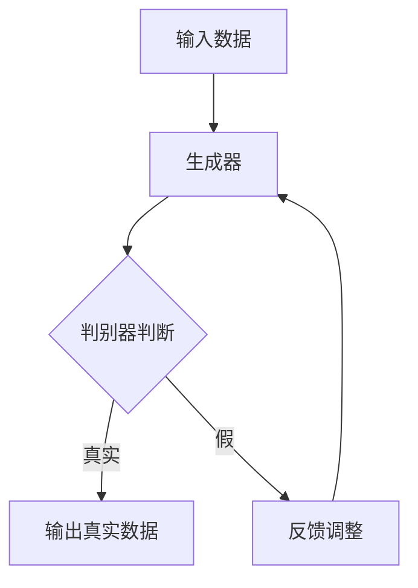

                 

# AI浪潮：生成式AI如何改变我们的生活方式？

> 关键词：生成式AI、生活方式、技术进步、创新应用、社会影响

> 摘要：本文深入探讨了生成式人工智能（AI）的崛起及其对我们日常生活的影响。通过分析生成式AI的核心原理、技术进步和实际应用案例，我们揭示了这一技术如何在教育、娱乐、医疗和设计等多个领域改变我们的生活方式。本文旨在帮助读者理解生成式AI的潜力和挑战，以及它如何推动社会变革。

## 1. 背景介绍

### 1.1 生成式AI的定义和核心原理

生成式人工智能（Generative AI）是一种能够根据已有数据生成新内容的人工智能技术。它主要基于概率模型，如变分自编码器（VAE）、生成对抗网络（GAN）和变换器（Transformer）等。这些模型能够学习数据分布，并生成与训练数据相似的新数据。

### 1.2 生成式AI的发展历程

生成式AI的发展可以追溯到20世纪80年代的生成模型研究。自2010年代以来，随着深度学习技术的发展，生成式AI取得了显著的进步。特别是GAN的提出，使得生成式AI在图像、音频和文本等领域的生成质量大幅提升。

### 1.3 生成式AI的重要性

生成式AI在多个领域显示出巨大的潜力。例如，在艺术创作中，它能够生成新颖的图像和音乐；在数据增强中，它能够提高模型的训练效果；在虚拟现实中，它能够创造逼真的场景和角色。

## 2. 核心概念与联系

### 2.1 生成式AI的基本架构

生成式AI的基本架构通常包括生成器和判别器两个部分。生成器负责生成数据，而判别器则负责判断生成的数据是否真实。以下是一个简单的Mermaid流程图：



### 2.2 生成式AI的应用领域

生成式AI的应用领域广泛，包括但不限于：

- **艺术创作**：生成图像、音乐、视频等。
- **数据增强**：提高机器学习模型的训练效果。
- **虚拟现实**：创造逼真的虚拟环境和角色。
- **游戏开发**：生成游戏的场景和角色。
- **医疗诊断**：生成医学影像和诊断报告。

## 3. 核心算法原理 & 具体操作步骤

### 3.1 生成对抗网络（GAN）

生成对抗网络（GAN）是生成式AI中最著名的一种架构。它由生成器和判别器两个部分组成。

#### 3.1.1 生成器的操作步骤

1. 输入噪声向量 $z \in \mathbb{R}^{z_d}$。
2. 通过生成器 $G(z)$ 生成数据 $x$。
3. 将生成的数据 $x$ 输入到判别器 $D(x)$。

#### 3.1.2 判别器的操作步骤

1. 输入真实数据 $x_r$ 和生成的数据 $x_g$。
2. 输出判别结果 $D(x_r)$ 和 $D(x_g)$。

#### 3.1.3 GAN的训练过程

1. 初始化生成器 $G$ 和判别器 $D$。
2. 对于每一轮训练，生成器 $G$ 和判别器 $D$ 分别进行优化：
   - 生成器：$G \leftarrow G - \alpha \cdot \frac{\partial L_G}{\partial G}$。
   - 判别器：$D \leftarrow D - \beta \cdot \frac{\partial L_D}{\partial D}$。

3. 重复步骤2，直到生成器的生成数据质量达到预期。

### 3.2 变分自编码器（VAE）

变分自编码器（VAE）是一种基于概率模型的生成模型，它通过引入潜在变量来建模数据分布。

#### 3.2.1 VAE的操作步骤

1. 输入数据 $x \in \mathbb{R}^{x_d}$。
2. 通过编码器 $E(x)$ 得到编码 $z$ 和对编码的均值和方差 $\mu, \sigma^2$。
3. 通过解码器 $D(z, \mu, \sigma^2)$ 生成数据 $x'$。

#### 3.2.2 VAE的训练过程

1. 初始化编码器 $E$ 和解码器 $D$。
2. 对于每一轮训练，计算损失函数：
   $$L = -\sum_{x \in D} \left( \log p(x|z) + DKL(q(z|x)||p(z)) \right)$$
3. 优化编码器 $E$ 和解码器 $D$：
   $$E \leftarrow E - \alpha \cdot \frac{\partial L}{\partial E}$$
   $$D \leftarrow D - \beta \cdot \frac{\partial L}{\partial D}$$

4. 重复步骤2和3，直到模型性能达到预期。

## 4. 数学模型和公式 & 详细讲解 & 举例说明

### 4.1 GAN的数学模型

在GAN中，生成器 $G$ 和判别器 $D$ 分别学习两个概率分布：

- 生成器概率分布：$p_G(x)$。
- 判别器概率分布：$p_D(x)$。

损失函数通常定义为：

$$L_G = -\log D(x)$$
$$L_D = -\log (1 - D(G(z)))$$

其中 $z$ 是噪声向量。

### 4.2 VAE的数学模型

在VAE中，编码器 $E$ 和解码器 $D$ 分别学习数据分布和潜在变量：

- 编码器概率分布：$q(z|x)$。
- 解码器概率分布：$p(x|z)$。

损失函数通常定义为：

$$L = -\sum_{x \in D} \left( \log p(x|z) + DKL(q(z|x)||p(z)) \right)$$

### 4.3 举例说明

假设我们要使用GAN生成手写数字图像。

1. 初始化生成器 $G$ 和判别器 $D$。
2. 对于每一轮训练，生成器生成手写数字图像，判别器判断图像的真实性。
3. 根据生成器和判别器的损失函数调整模型参数。
4. 重复步骤2和3，直到生成器生成的图像质量达到预期。

## 5. 项目实践：代码实例和详细解释说明

### 5.1 开发环境搭建

为了实现生成式AI项目，我们需要以下环境：

- Python 3.7+
- TensorFlow 2.5+
- Keras 2.5+

### 5.2 源代码详细实现

以下是一个简单的GAN实现，用于生成手写数字图像：

```python
import numpy as np
import tensorflow as tf
from tensorflow.keras import layers

# 定义生成器
def build_generator(z_dim):
    model = tf.keras.Sequential()
    model.add(layers.Dense(7 * 7 * 128, use_bias=False, input_shape=(z_dim,)))
    model.add(layers.BatchNormalization(momentum=0.8))
    model.add(layers.LeakyReLU())
    model.add(layers.Reshape((7, 7, 128)))

    model.add(layers.Conv2DTranspose(128, (5, 5), strides=(1, 1), padding='same', use_bias=False))
    model.add(layers.BatchNormalization(momentum=0.8))
    model.add(layers.LeakyReLU())

    model.add(layers.Conv2DTranspose(128, (5, 5), strides=(2, 2), padding='same', use_bias=False))
    model.add(layers.BatchNormalization(momentum=0.8))
    model.add(layers.LeakyReLU())

    model.add(layers.Conv2DTranspose(128, (5, 5), strides=(2, 2), padding='same', use_bias=False))
    model.add(layers.BatchNormalization(momentum=0.8))
    model.add(layers.LeakyReLU())

    model.add(layers.Conv2DTranspose(128, (5, 5), strides=(2, 2), padding='same', use_bias=False))
    model.add(layers.BatchNormalization(momentum=0.8))
    model.add(layers.LeakyReLU())

    model.add(layers.Conv2D(1, (5, 5), strides=(2, 2), padding='same', activation='tanh', use_bias=False))

    return model

# 定义判别器
def build_discriminator(img_shape):
    model = tf.keras.Sequential()
    model.add(layers.Conv2D(128, (5, 5), strides=(2, 2), padding='same', input_shape=img_shape))
    model.add(layers.LeakyReLU())
    model.add(layers.Dropout(0.3))

    model.add(layers.Conv2D(128, (5, 5), strides=(2, 2), padding='same'))
    model.add(layers.LeakyReLU())
    model.add(layers.Dropout(0.3))

    model.add(layers.Flatten())
    model.add(layers.Dense(1, activation='sigmoid'))

    return model

# 定义 GAN 模型
def build_gan(generator, discriminator):
    model = tf.keras.Sequential([generator, discriminator])
    return model

# 设置训练参数
z_dim = 100
img_shape = (28, 28, 1)
lr = 0.0002

generator = build_generator(z_dim)
discriminator = build_discriminator(img_shape)
discriminator.compile(loss='binary_crossentropy', optimizer=tf.keras.optimizers.Adam(0.0002, 0.5), metrics=['accuracy'])

gan = build_gan(generator, discriminator)
gan.compile(loss='binary_crossentropy', optimizer=tf.keras.optimizers.Adam(lr, 0.5))

# 加载 MNIST 数据集
(x_train, _), (_, _) = tf.keras.datasets.mnist.load_data()
x_train = x_train / 127.5 - 1.
x_train = np.expand_dims(x_train, axis=3)

# 训练模型
for epoch in range(100):
    for _ in range(10000):
        noise = np.random.normal(0, 1, (64, z_dim))
        gen_images = generator.predict(noise)
        real_images = x_train[np.random.randint(0, x_train.shape[0], 64)]

        # 训练判别器
        d_loss_real = discriminator.train_on_batch(real_images, np.ones((64, 1)))
        d_loss_fake = discriminator.train_on_batch(gen_images, np.zeros((64, 1)))
        d_loss = 0.5 * np.add(d_loss_real, d_loss_fake)

        # 训练生成器
        g_loss = gan.train_on_batch(noise, np.ones((64, 1)))

        print(f"{epoch} [D loss: {d_loss:.3f} | G loss: {g_loss:.3f}]")

    # 保存模型和图像
    generator.save(f'generator_{epoch}.h5')
    discriminator.save(f'discriminator_{epoch}.h5')
    gen_images = generator.predict(np.random.normal(0, 1, (16, z_dim)))
    save_images(gen_images, f'gen_imgs_{epoch}.png')
```

### 5.3 代码解读与分析

上述代码实现了一个简单的GAN模型，用于生成手写数字图像。

1. **生成器**：生成器通过多层全连接和卷积层将噪声向量转换为图像。它通过学习数据分布，生成与真实数据相似的手写数字图像。

2. **判别器**：判别器通过卷积层和全连接层学习判断图像的真实性。它通过比较真实数据和生成数据，提高生成器生成图像的质量。

3. **GAN模型**：GAN模型通过组合生成器和判别器，实现整体优化。生成器试图生成尽可能逼真的图像，而判别器则尝试提高判断真实图像的能力。

4. **训练过程**：训练过程中，生成器和判别器交替进行优化。生成器通过学习噪声向量生成图像，而判别器通过判断真实数据和生成数据的真实性调整模型参数。

5. **保存和可视化**：训练过程中，模型和生成的图像会被保存。这些图像可以帮助我们直观地了解生成器的训练效果。

## 6. 实际应用场景

### 6.1 教育领域

生成式AI在教育领域的应用包括个性化学习、自动出题和虚拟教师。例如，生成式AI可以为学生生成个性化的学习材料，提高学习效果。同时，它也可以为教师自动出题，减轻教师的工作负担。

### 6.2 娱乐领域

生成式AI在娱乐领域的应用包括图像生成、音乐创作和游戏开发。例如，生成式AI可以生成新的图像和音乐，为艺术家和游戏开发者提供灵感。此外，它还可以创建虚拟角色和场景，提高虚拟现实和游戏的沉浸感。

### 6.3 医疗领域

生成式AI在医疗领域的应用包括医学影像分析、药物设计和个性化治疗。例如，生成式AI可以生成新的医学影像，帮助医生进行诊断。同时，它还可以设计新的药物分子，加快药物研发过程。

### 6.4 设计领域

生成式AI在设计领域的应用包括建筑设计、时尚设计和室内设计。例如，生成式AI可以生成新的建筑设计方案，为设计师提供灵感。此外，它还可以生成新的时尚产品和室内装饰方案。

## 7. 工具和资源推荐

### 7.1 学习资源推荐

- **书籍**：
  - 《深度学习》（Ian Goodfellow、Yoshua Bengio 和 Aaron Courville 著）
  - 《生成对抗网络：原理与应用》（李航 著）
- **论文**：
  - 《生成对抗网络：训练生成模型的新方法》（Ian Goodfellow et al., 2014）
  - 《变分自编码器：有效的生成模型》（Kingma and Welling, 2013）
- **博客**：
  - [TensorFlow 官方文档](https://www.tensorflow.org/tutorials/generative/dcgan)
  - [Keras 官方文档](https://keras.io/getting-started/sequential_model/)
- **网站**：
  - [OpenAI](https://openai.com/)
  - [Google AI](https://ai.google/)

### 7.2 开发工具框架推荐

- **开发工具**：
  - TensorFlow
  - Keras
  - PyTorch
- **框架**：
  - TensorFlow.js（用于Web开发）
  - PyTorch Lightning（用于高级研究）

### 7.3 相关论文著作推荐

- **论文**：
  - 《自编码器：学习表示与推断的有效方法》（Benjamin A. Levinson, 1990）
  - 《生成对抗网络：训练生成模型的新方法》（Ian Goodfellow et al., 2014）
- **著作**：
  - 《深度学习》（Ian Goodfellow、Yoshua Bengio 和 Aaron Courville 著）
  - 《生成模型导论》（Alec Radford et al., 2016）

## 8. 总结：未来发展趋势与挑战

### 8.1 未来发展趋势

- **更加逼真的生成效果**：随着深度学习技术的不断发展，生成式AI的生成效果将更加逼真。
- **多模态生成**：生成式AI将能够生成图像、音频、视频等多种模态的数据。
- **端到端模型**：端到端模型将取代传统模型，实现更高效的数据生成。
- **跨领域应用**：生成式AI将在更多领域得到应用，如金融、能源和交通等。

### 8.2 面临的挑战

- **数据隐私**：生成式AI在生成数据时可能涉及隐私问题，如何保护数据隐私是一个重要挑战。
- **模型解释性**：生成式AI模型的解释性较差，如何提高其解释性是一个挑战。
- **资源消耗**：生成式AI的训练过程需要大量计算资源和时间，如何优化资源利用是一个挑战。

## 9. 附录：常见问题与解答

### 9.1 生成式AI的主要优点是什么？

生成式AI的主要优点包括：

- 能够生成与训练数据相似的新数据。
- 在数据增强和模型训练中提高模型性能。
- 在艺术创作和虚拟现实中创造逼真的内容。

### 9.2 生成式AI的主要缺点是什么？

生成式AI的主要缺点包括：

- 可能侵犯数据隐私。
- 模型解释性较差。
- 训练过程需要大量计算资源和时间。

### 9.3 生成式AI与传统的机器学习方法有何区别？

生成式AI与传统的机器学习方法的主要区别在于：

- 生成式AI关注数据生成，而传统的机器学习方法关注数据分类或回归。
- 生成式AI使用概率模型，而传统的机器学习方法使用确定性的模型。

## 10. 扩展阅读 & 参考资料

- [生成对抗网络：训练生成模型的新方法](https://arxiv.org/abs/1406.2661)
- [变分自编码器：有效的生成模型](https://arxiv.org/abs/1312.6114)
- [深度学习》（Ian Goodfellow、Yoshua Bengio 和 Aaron Courville 著](https://www.deeplearningbook.org/)
- [生成模型导论](https://arxiv.org/abs/1611.02163)

作者：禅与计算机程序设计艺术 / Zen and the Art of Computer Programming<|im_sep|>

