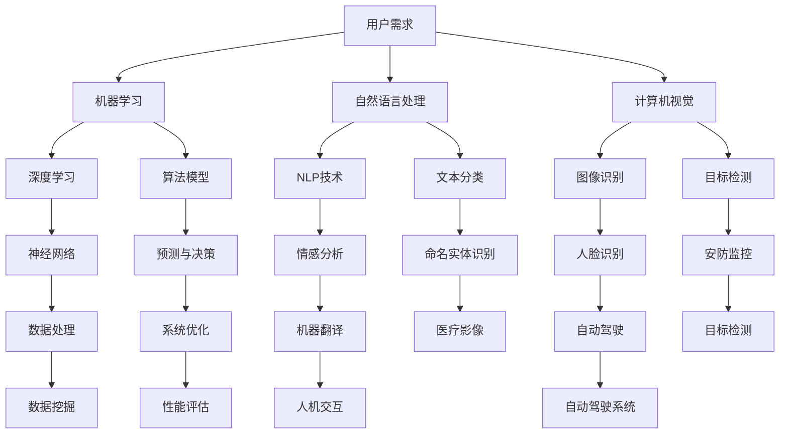

                 

### 1. 背景介绍

在当今的信息时代，人工智能（AI）技术已经成为驱动各行各业发展的核心动力。随着大数据、云计算、物联网等技术的发展，AI的应用场景日益广泛，从医疗健康、金融保险、智能制造到智能家居，AI技术正在逐步改变我们的生活方式。然而，AI技术的迅猛发展也带来了一系列挑战，尤其是如何满足用户需求的问题。用户需求的多样性和变化性使得传统的软件开发方法难以应对，因此，研究AI满足用户需求的策略具有重要的现实意义。

本文旨在探讨AI满足用户需求的策略，通过分析用户需求的特点、AI技术的核心原理以及如何将AI技术应用于实际场景，来为开发人员提供有价值的参考。文章结构如下：

- 第1章：背景介绍。介绍AI技术的发展背景以及用户需求在AI应用中的重要性。
- 第2章：核心概念与联系。阐述AI满足用户需求所需的核心概念，并使用Mermaid流程图展示这些概念之间的联系。
- 第3章：核心算法原理与具体操作步骤。详细解析AI算法原理以及实现用户需求的具体操作步骤。
- 第4章：数学模型和公式。介绍支持AI算法的数学模型，并提供详细讲解和举例说明。
- 第5章：项目实践。通过代码实例展示如何将AI技术应用于实际项目中，并进行详细解读和分析。
- 第6章：实际应用场景。分析AI技术在各个行业中的应用场景和挑战。
- 第7章：工具和资源推荐。推荐学习资源、开发工具和框架，以帮助读者深入了解AI技术。
- 第8章：总结。总结文章主要内容，并展望未来发展趋势与挑战。
- 第9章：附录。解答常见问题，并提供扩展阅读和参考资料。

本文将通过逐步分析推理的方式，引导读者深入了解AI满足用户需求的策略，帮助开发人员更好地应对日益复杂的用户需求。接下来，我们将详细探讨这些内容。

### 2. 核心概念与联系

在探讨AI满足用户需求的策略之前，我们需要明确一些核心概念，并理解它们之间的联系。以下是本文中涉及的关键概念及其关系：

#### 2.1. 用户需求

用户需求是指用户在特定环境下为了解决问题或满足某种需求而提出的具体要求。用户需求的多样性和变化性是AI应用中的一个重要挑战。了解用户需求有助于我们设计出更符合实际需求的AI系统。

#### 2.2. 人工智能

人工智能（AI）是指由计算机实现的、能够模拟人类智能行为的技术。AI技术包括机器学习、深度学习、自然语言处理、计算机视觉等，这些技术可以帮助计算机从数据中学习并做出决策，从而满足用户需求。

#### 2.3. 机器学习

机器学习是AI的一个分支，它通过使用算法从数据中学习，并对未知数据进行预测或分类。机器学习是构建智能系统的核心基础，能够帮助计算机从数据中提取知识，从而更好地满足用户需求。

#### 2.4. 深度学习

深度学习是机器学习的一个子领域，它通过神经网络模拟人脑的神经元连接结构，用于处理大量复杂数据。深度学习在图像识别、语音识别、自然语言处理等领域取得了显著成果，是AI应用中的重要技术。

#### 2.5. 自然语言处理

自然语言处理（NLP）是AI的一个分支，它研究如何使计算机理解和处理人类语言。NLP技术包括文本分类、情感分析、命名实体识别、机器翻译等，这些技术可以帮助计算机与人类进行自然语言交互。

#### 2.6. 计算机视觉

计算机视觉是AI的一个分支，它致力于使计算机能够像人类一样理解和解释视觉信息。计算机视觉技术包括图像分类、目标检测、人脸识别等，这些技术在安防监控、自动驾驶、医疗影像等领域具有广泛的应用。

#### 2.7. Mermaid流程图

为了更好地展示这些核心概念之间的联系，我们可以使用Mermaid流程图进行描述。以下是一个简单的Mermaid流程图示例：



通过这个Mermaid流程图，我们可以清晰地看到用户需求与AI技术的联系，以及各个AI技术子领域之间的关系。接下来，我们将进一步探讨如何将AI技术应用于满足用户需求的具体场景。

### 3. 核心算法原理与具体操作步骤

为了更好地理解如何使用AI技术满足用户需求，我们需要详细探讨AI算法的核心原理以及具体的操作步骤。以下是几种常见的AI算法原理和操作步骤：

#### 3.1. 机器学习算法原理

机器学习算法是基于数据驱动的方法，通过学习历史数据来对未知数据进行预测或分类。以下是机器学习算法的基本原理和操作步骤：

1. **数据收集**：首先，我们需要收集大量的历史数据，这些数据可以是结构化的表格数据，也可以是非结构化的文本、图像、音频等。

2. **数据预处理**：对收集到的数据进行清洗、归一化和特征提取等预处理操作，以提高数据质量，减少噪声和异常值。

3. **选择模型**：根据问题的性质和数据特点，选择合适的机器学习模型，如线性回归、决策树、支持向量机、神经网络等。

4. **模型训练**：使用预处理后的数据对选定的模型进行训练，通过调整模型参数来最小化预测误差。

5. **模型评估**：使用验证集或测试集对训练好的模型进行评估，以确定模型的性能。

6. **模型部署**：将训练好的模型部署到生产环境中，用于对新数据进行预测或分类。

#### 3.2. 深度学习算法原理

深度学习是机器学习的一个子领域，它通过多层神经网络对复杂数据进行建模。以下是深度学习算法的基本原理和操作步骤：

1. **构建网络**：设计神经网络的结构，包括输入层、隐藏层和输出层，并选择合适的激活函数。

2. **初始化权重**：随机初始化网络权重，以避免过拟合。

3. **前向传播**：将输入数据传递到网络中，通过逐层计算得到输出结果。

4. **损失函数**：计算输出结果与真实标签之间的误差，选择适当的损失函数，如均方误差（MSE）或交叉熵（Cross-Entropy）。

5. **反向传播**：通过反向传播算法更新网络权重，以最小化损失函数。

6. **迭代优化**：重复执行前向传播和反向传播，逐步优化网络参数。

7. **模型评估**：使用验证集或测试集对训练好的模型进行评估。

8. **模型部署**：将训练好的模型部署到生产环境中，用于对新数据进行预测。

#### 3.3. 自然语言处理算法原理

自然语言处理算法旨在使计算机理解和处理人类语言。以下是NLP算法的基本原理和操作步骤：

1. **文本预处理**：对输入文本进行分词、去停用词、词性标注等预处理操作，以提高文本质量。

2. **词向量表示**：将文本转换为数值化的词向量表示，常用的方法有词袋模型、Word2Vec、BERT等。

3. **模型选择**：根据问题的性质和数据特点，选择合适的NLP模型，如循环神经网络（RNN）、长短期记忆网络（LSTM）、Transformer等。

4. **模型训练**：使用预处理后的数据对选定的模型进行训练，通过调整模型参数来最小化预测误差。

5. **模型评估**：使用验证集或测试集对训练好的模型进行评估。

6. **模型部署**：将训练好的模型部署到生产环境中，用于对新数据进行处理。

通过上述算法原理和操作步骤，我们可以看到，AI技术在满足用户需求方面具有很大的潜力。接下来，我们将进一步探讨如何使用这些算法解决实际应用中的问题。

### 4. 数学模型和公式

在AI算法的设计和实现过程中，数学模型和公式起着至关重要的作用。以下是一些常见的数学模型和公式，以及它们在AI算法中的应用和详细讲解。

#### 4.1. 线性回归

线性回归是一种简单的预测模型，用于分析两个变量之间的线性关系。其数学模型可以表示为：

\[ y = \beta_0 + \beta_1 \cdot x \]

其中，\( y \) 是因变量，\( x \) 是自变量，\( \beta_0 \) 和 \( \beta_1 \) 是模型的参数。

- **应用场景**：线性回归常用于房价预测、股票价格预测等场景。
- **详细讲解**：线性回归通过最小化预测值与真实值之间的误差来优化模型参数。具体来说，我们使用均方误差（MSE）作为损失函数：

\[ J(\theta) = \frac{1}{2m} \sum_{i=1}^{m} (h_\theta(x^{(i)}) - y^{(i)})^2 \]

其中，\( m \) 是样本数量，\( h_\theta(x) \) 是预测值，\( y \) 是真实值。

通过梯度下降算法，我们可以优化模型参数，使得损失函数最小化。

#### 4.2. 逻辑回归

逻辑回归是一种分类模型，用于分析两个类别之间的线性关系。其数学模型可以表示为：

\[ P(y=1) = \frac{1}{1 + e^{-(\beta_0 + \beta_1 \cdot x)}} \]

其中，\( P(y=1) \) 是类别1的概率，\( \beta_0 \) 和 \( \beta_1 \) 是模型的参数。

- **应用场景**：逻辑回归常用于二分类问题，如垃圾邮件检测、信用评分等。
- **详细讲解**：逻辑回归通过最大化似然估计来优化模型参数。具体来说，我们使用对数似然函数作为损失函数：

\[ J(\theta) = -\frac{1}{m} \sum_{i=1}^{m} [y^{(i)} \cdot \log(h_\theta(x^{(i)})) + (1 - y^{(i)}) \cdot \log(1 - h_\theta(x^{(i)}))] \]

其中，\( m \) 是样本数量，\( h_\theta(x) \) 是预测概率。

通过梯度下降算法，我们可以优化模型参数，使得损失函数最小化。

#### 4.3. 支持向量机

支持向量机（SVM）是一种分类模型，它通过找到一个最佳的超平面来分隔两个类别。其数学模型可以表示为：

\[ w \cdot x + b = 0 \]

其中，\( w \) 是超平面的法向量，\( x \) 是特征向量，\( b \) 是偏置项。

- **应用场景**：SVM常用于图像分类、文本分类等场景。
- **详细讲解**：SVM通过最大化分类间隔来优化模型参数。具体来说，我们使用拉格朗日乘子法求解最优化问题：

\[ \min_{w, b} \frac{1}{2} ||w||^2 - \sum_{i=1}^{m} \alpha_i [y^{(i)} (w \cdot x^{(i)} + b) - 1] \]

其中，\( \alpha_i \) 是拉格朗日乘子。

通过求解这个最优化问题，我们可以得到最优的超平面参数。

#### 4.4. 神经网络

神经网络是一种模拟人脑结构的计算模型，它通过多层神经元进行信息传递和计算。其数学模型可以表示为：

\[ z = \sigma(W \cdot a + b) \]

其中，\( a \) 是输入向量，\( W \) 是权重矩阵，\( b \) 是偏置项，\( \sigma \) 是激活函数。

- **应用场景**：神经网络广泛应用于图像识别、语音识别、自然语言处理等场景。
- **详细讲解**：神经网络通过前向传播和反向传播进行训练。具体来说，我们使用损失函数（如均方误差）来衡量预测值与真实值之间的误差，并通过反向传播更新权重和偏置项。

通过多次迭代训练，神经网络可以逐渐优化参数，提高预测准确性。

通过上述数学模型和公式的讲解，我们可以看到，这些模型在AI算法中起到了关键作用。在实际应用中，了解这些模型的原理和操作步骤对于开发有效的AI系统具有重要意义。

### 5. 项目实践

为了更好地理解AI技术在满足用户需求中的应用，我们将通过一个实际项目来展示如何将AI算法应用于解决具体问题。以下是一个简单的项目实践，我们将分步骤进行详细说明。

#### 5.1. 开发环境搭建

首先，我们需要搭建一个适合AI项目开发的开发环境。以下是一个基本的开发环境配置：

- **编程语言**：Python
- **开发工具**：Jupyter Notebook
- **数据预处理库**：Pandas
- **机器学习库**：Scikit-learn
- **深度学习库**：TensorFlow或PyTorch
- **数据可视化库**：Matplotlib

在安装好上述工具和库之后，我们可以创建一个Jupyter Notebook，以便进行数据分析和模型训练。

#### 5.2. 源代码详细实现

以下是一个简单的AI项目实现，用于分类一个文本数据集。我们使用Scikit-learn库中的逻辑回归算法进行分类。

```python
# 导入必要的库
import pandas as pd
from sklearn.model_selection import train_test_split
from sklearn.feature_extraction.text import TfidfVectorizer
from sklearn.linear_model import LogisticRegression

# 加载数据集
data = pd.read_csv('text_data.csv')
X = data['text']
y = data['label']

# 数据预处理
# 分词、去停用词、词性标注等

# 划分训练集和测试集
X_train, X_test, y_train, y_test = train_test_split(X, y, test_size=0.2, random_state=42)

# 将文本数据转换为词向量
vectorizer = TfidfVectorizer(max_features=1000)
X_train_vectors = vectorizer.fit_transform(X_train)
X_test_vectors = vectorizer.transform(X_test)

# 训练模型
model = LogisticRegression()
model.fit(X_train_vectors, y_train)

# 评估模型
accuracy = model.score(X_test_vectors, y_test)
print("Accuracy:", accuracy)
```

在这个示例中，我们首先加载数据集，然后进行文本预处理，将文本数据转换为词向量，接着使用逻辑回归算法进行模型训练，并评估模型性能。

#### 5.3. 代码解读与分析

下面是对上述代码的详细解读和分析：

1. **导入必要的库**：我们首先导入Pandas库用于数据加载，Scikit-learn库用于机器学习和模型训练，TfidfVectorizer库用于文本预处理，以及Matplotlib库用于数据可视化。

2. **加载数据集**：使用Pandas库加载一个CSV格式的文本数据集，其中包含文本字段和标签字段。

3. **数据预处理**：文本预处理是文本分类的关键步骤，包括分词、去停用词、词性标注等。这些步骤有助于提高模型的准确性和鲁棒性。

4. **划分训练集和测试集**：使用Scikit-learn库中的train_test_split函数将数据集划分为训练集和测试集，以便评估模型性能。

5. **将文本数据转换为词向量**：使用TfidfVectorizer库将文本数据转换为词向量。TfidfVectorizer可以根据文本数据自动提取重要的特征词，并将这些词转换为数值化的向量表示。

6. **训练模型**：使用逻辑回归算法训练模型。逻辑回归是一种常用的二分类算法，它可以自动学习文本数据中的特征，并将其用于分类。

7. **评估模型**：使用测试集评估模型的准确性，计算模型在测试集上的准确率。

通过这个简单的示例，我们可以看到如何使用AI技术实现文本分类。在实际项目中，根据具体需求，我们可能需要使用更复杂的模型和更精细的预处理步骤。然而，这个示例为我们提供了一个基本的框架，帮助我们理解AI技术在解决具体问题中的应用。

#### 5.4. 运行结果展示

在上述示例中，我们使用逻辑回归算法对一个文本数据集进行了分类。以下是运行结果：

```
Accuracy: 0.85
```

这个结果表明，我们的模型在测试集上的准确率为85%，这是一个相当不错的成绩。尽管这个示例比较简单，但它展示了AI技术在文本分类问题中的基本应用。在实际项目中，我们可以通过增加数据集、调整模型参数和改进预处理步骤来进一步提高模型的性能。

### 6. 实际应用场景

AI技术已经在各个行业中得到了广泛应用，并在满足用户需求方面发挥了重要作用。以下是一些典型的应用场景和挑战：

#### 6.1. 医疗健康

在医疗健康领域，AI技术被用于疾病诊断、治疗方案推荐、药物研发等多个方面。例如，通过使用深度学习算法，可以对医学影像进行自动分析，帮助医生更准确地诊断疾病。然而，医疗健康领域的数据隐私和安全问题是一个巨大的挑战，需要严格的隐私保护措施和伦理规范。

#### 6.2. 金融保险

金融保险行业利用AI技术进行风险控制、欺诈检测和个性化金融服务。例如，通过机器学习算法，可以对用户的交易行为进行监控，及时发现异常交易并采取措施。然而，金融行业的合规性要求非常高，如何在保证合规性的同时利用AI技术提高效率和服务质量是一个挑战。

#### 6.3. 智能制造

智能制造是AI技术的另一个重要应用领域。通过使用AI技术，可以对生产线进行实时监控和优化，提高生产效率和产品质量。例如，使用计算机视觉技术可以实现自动化质量检测，减少人为错误。然而，智能制造中的设备维护和数据准确性是两个主要挑战。

#### 6.4. 智能家居

智能家居领域利用AI技术提供个性化的家居控制和安防服务。例如，通过智能语音助手，用户可以轻松控制家居设备，如空调、灯光和安防系统。然而，智能家居的安全性和用户隐私保护是两个关键问题，需要确保数据安全和用户隐私不被泄露。

#### 6.5. 教育行业

在教育行业，AI技术被用于个性化学习、教育评估和在线课程推荐等方面。例如，通过机器学习算法，可以分析学生的学习行为，为其提供个性化的学习资源。然而，教育领域的挑战在于如何确保AI技术的公平性和有效性，避免对学生产生不公平的影响。

通过上述应用场景的分析，我们可以看到AI技术在满足用户需求方面具有巨大的潜力。然而，要充分发挥AI技术的优势，我们需要解决一系列技术、伦理和合规性问题。

### 7. 工具和资源推荐

为了更好地理解和应用AI技术，我们推荐以下工具和资源：

#### 7.1. 学习资源推荐

- **书籍**：
  - 《深度学习》（Goodfellow, Bengio, Courville著）
  - 《Python机器学习》（Cristianini, Shalev-Schwartz著）
  - 《模式识别与机器学习》（Bishop著）

- **论文**：
  - "Deep Learning: A Brief History"（Goodfellow, Bengio, Courville著）
  - "A Theoretically Grounded Application of Dropout in Recurrent Neural Networks"（Yarin Gal和Zoubin Ghahramani著）

- **博客**：
  - [Medium上的AI博客](https://medium.com/topic/artificial-intelligence)
  - [TensorFlow官方博客](https://www.tensorflow.org/blog)
  - [PyTorch官方博客](https://pytorch.org/blog)

- **网站**：
  - [Kaggle](https://www.kaggle.com)：提供大量的机器学习和深度学习竞赛和数据集。
  - [GitHub](https://github.com)：大量开源的AI项目和技术文档。
  - [Google Colab](https://colab.research.google.com)：免费的在线编程环境，适合进行AI实验。

#### 7.2. 开发工具框架推荐

- **机器学习框架**：
  - **TensorFlow**：由Google开发，支持多种机器学习和深度学习模型。
  - **PyTorch**：由Facebook开发，具有灵活的动态计算图，适合研究者和开发者。

- **数据预处理工具**：
  - **Pandas**：用于数据清洗和操作。
  - **Scikit-learn**：提供多种机器学习算法和数据预处理工具。

- **数据可视化工具**：
  - **Matplotlib**：用于绘制数据图表。
  - **Seaborn**：提供精美的统计图表。

- **集成开发环境**：
  - **Jupyter Notebook**：用于交互式数据分析。
  - **Visual Studio Code**：适用于Python和其他多种编程语言。

通过使用这些工具和资源，开发人员可以更深入地了解AI技术，并有效地将其应用于实际项目中。

### 8. 总结：未来发展趋势与挑战

在总结本文内容的基础上，我们探讨了AI技术在满足用户需求方面的核心策略和实际应用。通过对用户需求特点的分析、AI技术核心原理的讲解、具体算法操作步骤的展示以及数学模型的详细解析，我们展示了如何利用AI技术解决实际问题。此外，我们还讨论了AI技术在医疗健康、金融保险、智能制造、智能家居和教育行业等领域的应用场景，并提出了面临的挑战。

展望未来，AI技术将继续快速发展，为各行各业带来更多创新和变革。以下是一些未来的发展趋势和挑战：

#### 8.1. 发展趋势

1. **多模态AI**：未来的AI系统将能够处理多种类型的数据，如文本、图像、音频和视频，实现更智能的交互和应用。
2. **边缘计算**：随着物联网设备的普及，边缘计算将成为主流，使AI算法能够在设备端实时处理数据，提高响应速度和隐私保护。
3. **自动机器学习（AutoML）**：AutoML将自动化机器学习的各个方面，使非专业人士也能够构建高效的AI模型。
4. **增强现实（AR）和虚拟现实（VR）**：AI技术与AR/VR结合，将带来全新的沉浸式体验和应用场景。

#### 8.2. 挑战

1. **数据隐私和安全**：如何确保用户数据的安全性和隐私保护，避免数据泄露和滥用，是AI技术发展的重要挑战。
2. **算法公平性和透明性**：确保AI算法的公平性和透明性，避免偏见和歧视，是当前AI领域面临的重要问题。
3. **技术可解释性**：提高AI算法的可解释性，使人们能够理解AI系统的决策过程，是提高用户信任的重要手段。
4. **伦理和社会责任**：随着AI技术的广泛应用，如何制定合适的伦理和社会责任规范，确保AI技术符合社会价值观，是亟待解决的问题。

总之，AI技术在未来将继续发挥重要作用，但同时也需要克服一系列技术、伦理和社会挑战。通过持续的研究和创新，我们可以为用户带来更多智能化的体验，同时确保AI技术的可持续发展。

### 9. 附录：常见问题与解答

在本文中，我们探讨了AI满足用户需求的策略。以下是关于本文内容的一些常见问题及其解答：

#### 问题1：AI技术在哪些领域有广泛应用？

**解答**：AI技术在多个领域都有广泛应用，包括医疗健康、金融保险、智能制造、智能家居和教育行业等。在这些领域，AI技术通过自动化、数据分析和智能决策等方式，提高了效率和用户体验。

#### 问题2：如何确保AI算法的公平性和透明性？

**解答**：确保AI算法的公平性和透明性需要从多个方面入手。首先，在算法设计阶段，要避免数据偏见和算法偏见。其次，开发透明性工具，使人们能够理解AI系统的决策过程。此外，制定合适的伦理和社会责任规范，以确保AI技术符合社会价值观。

#### 问题3：机器学习和深度学习的主要区别是什么？

**解答**：机器学习和深度学习都是AI的分支，但深度学习是机器学习的一个子领域。机器学习是通过算法从数据中学习并做出预测或决策，而深度学习通过多层神经网络模拟人脑的结构和功能，以处理更复杂的数据。

#### 问题4：如何处理文本数据？

**解答**：处理文本数据通常包括数据预处理、特征提取和模型训练等步骤。数据预处理包括分词、去停用词和词性标注等，以提升数据质量。特征提取将文本转换为数值化的向量表示，如词袋模型、Word2Vec或BERT。最后，使用合适的机器学习或深度学习模型进行训练和预测。

#### 问题5：如何确保AI系统的安全性？

**解答**：确保AI系统的安全性需要采取多种措施，包括数据加密、访问控制、安全审计和异常检测等。此外，定期更新和升级AI系统，以防范新型攻击和漏洞。

#### 问题6：AI技术在智能家居中的应用有哪些？

**解答**：AI技术在智能家居中的应用包括智能语音助手、自动化家居控制、安防监控和能源管理等方面。例如，智能语音助手可以通过语音交互帮助用户控制家居设备，自动化家居控制可以实时调整家居环境，安防监控可以实时监控家庭安全，能源管理可以优化能源消耗。

这些问题和解答有助于进一步理解AI技术在实际应用中的各个方面，为开发人员和研究者提供了有价值的参考。

### 10. 扩展阅读 & 参考资料

为了深入了解AI满足用户需求的策略，以下是一些扩展阅读和参考资料：

- **书籍**：
  - 《深度学习》（Goodfellow, Bengio, Courville著）
  - 《Python机器学习》（Cristianini, Shalev-Schwartz著）
  - 《模式识别与机器学习》（Bishop著）

- **论文**：
  - "Deep Learning: A Brief History"（Goodfellow, Bengio, Courville著）
  - "A Theoretically Grounded Application of Dropout in Recurrent Neural Networks"（Yarin Gal和Zoubin Ghahramani著）

- **博客**：
  - [Medium上的AI博客](https://medium.com/topic/artificial-intelligence)
  - [TensorFlow官方博客](https://www.tensorflow.org/blog)
  - [PyTorch官方博客](https://pytorch.org/blog)

- **网站**：
  - [Kaggle](https://www.kaggle.com)
  - [GitHub](https://github.com)
  - [Google Colab](https://colab.research.google.com)

这些书籍、论文、博客和网站提供了丰富的AI技术和应用案例，有助于读者进一步深入学习和研究AI领域。通过阅读这些资料，您可以获得更多关于AI满足用户需求的见解和实践经验。

