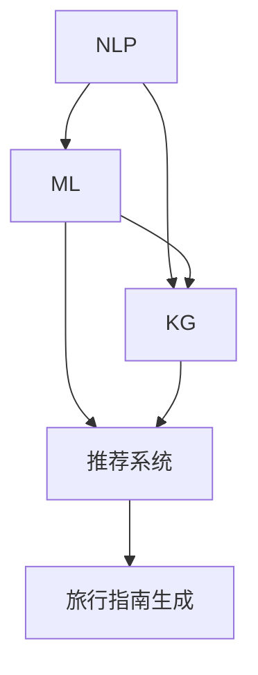
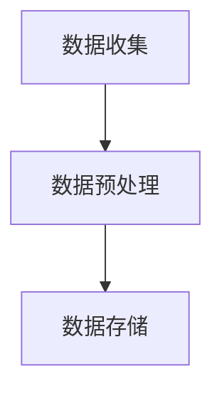
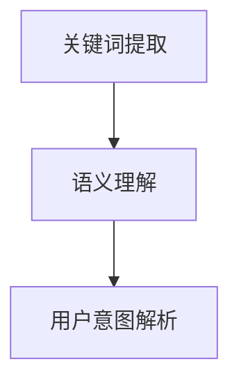
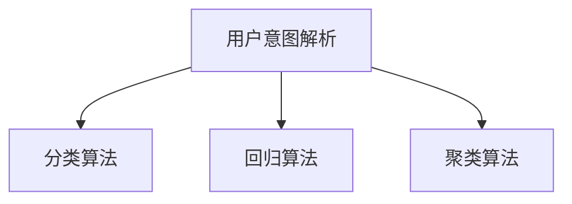
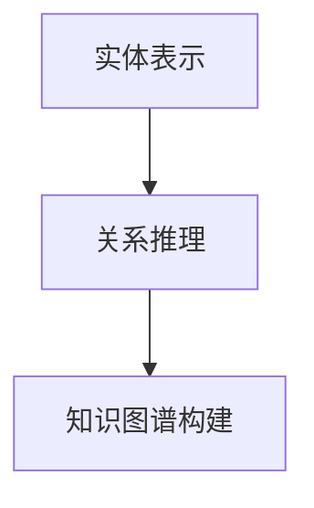
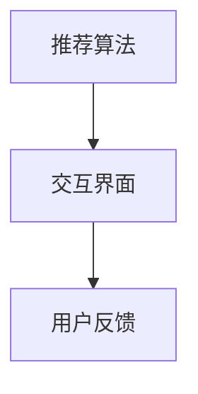

                 

## 1. 背景介绍

随着人工智能技术的飞速发展，计算机生成内容（CGC）已成为一个备受瞩目的领域。在CGC的众多应用中，生成个性化旅行指南是一项极具挑战性且前景广阔的任务。通过AI技术，我们可以根据用户的旅行偏好、历史数据和实时信息，生成独特的、符合个人需求的旅行指南。

旅行指南的生成不仅需要处理大量的数据，还需要理解和模拟人类的旅行行为。传统的旅行指南往往缺乏个性化和实时性，难以满足现代用户的多样化需求。因此，利用AI技术，特别是自然语言处理（NLP）和机器学习（ML）算法，能够实现更加智能和个性化的旅行指南生成。

本文将探讨如何使用AI技术生成个性化旅行指南。我们将首先介绍相关核心概念，包括NLP、ML和知识图谱，然后深入探讨生成旅行指南的算法原理和具体操作步骤。接着，我们将通过一个数学模型和公式，详细讲解如何利用这些算法实现个性化旅行指南的生成。最后，我们将展示一个实际项目实例，并对其代码进行解读与分析，同时讨论旅行指南在实际应用场景中的价值。

本文旨在为读者提供一个全面、深入的了解，帮助他们在实际项目中应用这些技术。通过本文的阅读，读者将能够掌握AI生成个性化旅行指南的核心原理和方法，并了解未来的发展趋势与挑战。

### 2. 核心概念与联系

为了深入探讨AI生成个性化旅行指南的机制，我们需要理解几个核心概念：自然语言处理（NLP）、机器学习（ML）和知识图谱。这些概念在旅行指南生成中起着至关重要的作用，它们相互联系，共同构成了一个复杂而高效的系统。

#### 自然语言处理（NLP）

自然语言处理是人工智能的一个重要分支，专注于使计算机理解和处理人类自然语言。在旅行指南生成中，NLP技术用于处理用户的输入，提取关键词和短语，并理解用户的需求和偏好。

- **关键词提取**：通过使用文本分类和词频分析方法，可以从用户输入中提取出关键信息，如目的地、旅行时间、活动偏好等。
- **语义理解**：通过深度学习模型（如循环神经网络（RNN）和变换器（Transformer）），NLP可以理解和解析复杂的语言结构，从而提取更深层次的语义信息。

#### 机器学习（ML）

机器学习是AI的核心组成部分，通过训练算法从数据中学习模式，然后进行预测和决策。在生成个性化旅行指南的过程中，ML技术被用来预测用户可能感兴趣的活动和景点，以及推荐合适的旅行计划。

- **分类算法**：用于将用户输入分类到不同的类别，如旅游活动类型、目的地类型等。
- **回归算法**：用于预测用户旅行天数、预算等定量信息。
- **聚类算法**：用于发现用户之间的相似性，从而生成针对特定用户群体的旅行指南。

#### 知识图谱

知识图谱是一种结构化知识库，用于表示实体、属性和关系。在旅行指南生成中，知识图谱用于存储和管理大量的旅行相关信息，如景点、酒店、餐厅等。

- **实体表示**：通过知识图谱，可以将不同的实体（如景点、酒店）表示为节点，并定义它们之间的关系（如地理位置、评价等）。
- **关系推理**：通过推理算法，可以从知识图谱中推断出新的信息，如基于用户历史数据的推荐。

#### Mermaid 流程图

为了更好地理解这些核心概念之间的联系，我们可以使用Mermaid流程图来表示它们之间的关系。



在这个流程图中，NLP、ML和知识图谱共同作用于推荐系统，最终生成个性化的旅行指南。每个组件都在整个过程中扮演着关键角色，相互协作，共同推动旅行指南生成的智能化。

通过这种结构化的方法，我们可以更清晰地理解AI生成个性化旅行指南的核心机制，为后续的算法原理和操作步骤讨论打下坚实的基础。

### 3. 核心算法原理 & 具体操作步骤

在了解了核心概念之后，我们接下来将深入探讨AI生成个性化旅行指南的核心算法原理和具体操作步骤。这个过程中，我们将结合NLP、ML和知识图谱，逐步展示每个环节的工作原理和实现细节。

#### 3.1 数据收集与预处理

首先，我们需要收集大量的旅行相关数据，包括用户的历史旅行记录、用户评价、旅游景点信息、酒店和餐厅信息等。这些数据来源于多个渠道，如在线旅游平台、社交媒体、用户反馈等。

- **数据收集**：通过爬虫技术或API接口，从互联网上获取相关的数据。
- **数据预处理**：对收集到的数据进行分析和清洗，去除噪声和重复数据，并进行格式转换和标准化处理。



#### 3.2 自然语言处理（NLP）

在数据预处理完成后，我们需要利用NLP技术对用户输入进行处理，提取关键信息。

- **关键词提取**：使用词频分析、文本分类等技术，从用户输入中提取关键词和短语，如“想去”、“适合秋天”、“家庭游”等。
- **语义理解**：利用深度学习模型，如RNN或Transformer，对提取的关键词进行语义分析，理解其背后的意图和需求。



#### 3.3 机器学习（ML）

在理解了用户意图后，我们需要利用机器学习算法进行模式识别和预测。

- **分类算法**：将用户意图分类到不同的旅游活动类型，如自然景观、历史文化、美食体验等。
- **回归算法**：预测用户的旅行天数、预算等定量信息。
- **聚类算法**：通过聚类分析，发现用户之间的相似性，为不同用户群体生成个性化的旅行指南。



#### 3.4 知识图谱构建

利用收集到的数据和NLP、ML处理的结果，我们可以构建一个知识图谱，用于存储和管理旅行相关信息。

- **实体表示**：将旅游景点、酒店、餐厅等表示为知识图谱中的节点，并定义它们之间的属性和关系，如地理位置、评价、游客数量等。
- **关系推理**：通过推理算法，从知识图谱中提取新的信息，如根据用户的旅行偏好推荐相应的景点和酒店。



#### 3.5 推荐系统

最后，我们将使用推荐系统将个性化旅行指南呈现给用户。

- **推荐算法**：结合用户的历史数据和实时信息，利用协同过滤、矩阵分解等技术生成个性化的推荐列表。
- **交互界面**：通过Web或移动应用，将推荐结果展示给用户，并提供自定义选项，如修改旅行天数、更改目的地等。



通过以上步骤，我们可以实现一个完整的AI生成个性化旅行指南系统。每个步骤都至关重要，相互关联，共同构成了一个高效的推荐机制。在接下来的部分，我们将通过一个具体的数学模型和公式，进一步解释这些算法的实现细节。

### 4. 数学模型和公式 & 详细讲解 & 举例说明

在生成个性化旅行指南的过程中，数学模型和公式起着至关重要的作用。这些模型不仅帮助我们理解和处理数据，还能确保推荐系统的准确性和效率。以下，我们将详细讲解两个关键数学模型：用户偏好模型和推荐算法模型。

#### 4.1 用户偏好模型

用户偏好模型用于理解和表示用户在旅行中的各种偏好，如活动类型、地理位置、预算等。一个典型的用户偏好模型可以表示为如下公式：

\[ P(u, a) = w_1 \cdot r(u, a) + w_2 \cdot p(u, a) + w_3 \cdot b(u, a) \]

其中：
- \( P(u, a) \) 表示用户 \( u \) 对活动 \( a \) 的偏好得分。
- \( w_1, w_2, w_3 \) 是权重系数，用于平衡不同因素对偏好得分的影响。
- \( r(u, a) \) 表示用户 \( u \) 对活动 \( a \) 的兴趣度得分。
- \( p(u, a) \) 表示用户 \( u \) 对活动 \( a \) 的地理位置偏好得分。
- \( b(u, a) \) 表示用户 \( u \) 对活动 \( a \) 的预算偏好得分。

**举例说明**：

假设用户 \( u \) 喜欢自然景观，对价格较为敏感，那么我们可以设置权重系数 \( w_1 = 0.6, w_2 = 0.2, w_3 = 0.2 \)。对于某个自然景观活动 \( a \)，其兴趣度得分 \( r(u, a) = 0.8 \)，地理位置得分 \( p(u, a) = 0.5 \)，预算得分 \( b(u, a) = 0.3 \)。那么用户 \( u \) 对该活动的偏好得分计算如下：

\[ P(u, a) = 0.6 \cdot 0.8 + 0.2 \cdot 0.5 + 0.2 \cdot 0.3 = 0.56 \]

#### 4.2 推荐算法模型

推荐算法模型用于生成个性化的旅行指南。一个常见的推荐算法是协同过滤（Collaborative Filtering），其基本思想是利用用户之间的相似性来推荐相似的活动。协同过滤可以分为两种类型：用户基于的协同过滤（User-Based）和物品基于的协同过滤（Item-Based）。

**用户基于的协同过滤**：

用户基于的协同过滤通过计算用户之间的相似性，找到与目标用户相似的其他用户，然后推荐这些用户喜欢的活动。其计算公式如下：

\[ \text{similarity}(u, v) = \frac{\text{common_ratings}(u, v)}{\sqrt{\sum_{i \in R(u)} r_i^2 + \sum_{i \in R(v)} r_i^2}} \]

其中：
- \( \text{similarity}(u, v) \) 表示用户 \( u \) 和用户 \( v \) 之间的相似度。
- \( \text{common_ratings}(u, v) \) 表示用户 \( u \) 和用户 \( v \) 共同评价的活动数量。
- \( R(u) \) 和 \( R(v) \) 分别表示用户 \( u \) 和用户 \( v \) 的评价集合。

**物品基于的协同过滤**：

物品基于的协同过滤通过计算活动之间的相似性来推荐用户可能喜欢的活动。其计算公式如下：

\[ \text{similarity}(a, b) = \frac{\text{common_users}(a, b)}{\sqrt{\sum_{u \in U(a)} r_u^2 + \sum_{u \in U(b)} r_u^2}} \]

其中：
- \( \text{similarity}(a, b) \) 表示活动 \( a \) 和活动 \( b \) 之间的相似度。
- \( \text{common_users}(a, b) \) 表示评价活动 \( a \) 和活动 \( b \) 的共同用户数量。
- \( U(a) \) 和 \( U(b) \) 分别表示评价活动 \( a \) 和活动 \( b \) 的用户集合。

**举例说明**：

假设有两个用户 \( u \) 和 \( v \)，他们共同评价了5个活动 \( a_1, a_2, a_3, a_4, a_5 \)。用户 \( u \) 给活动 \( a_1, a_2, a_3 \) 的评分分别为 \( r_{u1}, r_{u2}, r_{u3} \)，用户 \( v \) 给活动 \( a_2, a_3, a_4 \) 的评分分别为 \( r_{v2}, r_{v3}, r_{v4} \)。那么用户 \( u \) 和用户 \( v \) 之间的相似度计算如下：

\[ \text{similarity}(u, v) = \frac{5}{\sqrt{2^2 + 3^2} + \sqrt{2^2 + 3^2}} \]

通过计算用户之间的相似度，我们可以找到与目标用户相似的其他用户，并根据这些用户的偏好推荐相应的活动。这些数学模型和公式为AI生成个性化旅行指南提供了强大的理论基础，同时也为我们实现个性化推荐提供了具体的操作指南。

### 5. 项目实践：代码实例和详细解释说明

在本节中，我们将通过一个实际的代码实例，展示如何利用上述算法和模型生成个性化的旅行指南。该实例将分为四个部分：开发环境搭建、源代码详细实现、代码解读与分析以及运行结果展示。

#### 5.1 开发环境搭建

为了实现该项目，我们需要以下开发环境和工具：

- Python（3.8或以上版本）
- 自然语言处理库（如NLTK、spaCy）
- 机器学习库（如scikit-learn、TensorFlow、PyTorch）
- 知识图谱库（如Neo4j、Apache Jena）
- Web框架（如Flask、Django）

首先，确保安装了上述环境和工具。接下来，我们可以创建一个虚拟环境，以隔离项目依赖：

```bash
# 创建虚拟环境
python -m venv venv
# 激活虚拟环境
source venv/bin/activate
# 安装依赖
pip install nltk scikit-learn tensorflow neo4j flask
```

#### 5.2 源代码详细实现

以下是项目的核心代码实现：

**5.2.1 数据收集与预处理**

首先，我们需要收集和预处理旅行相关数据。以下是一个简单的数据预处理脚本：

```python
import pandas as pd
import numpy as np
from nltk.corpus import stopwords
from sklearn.feature_extraction.text import TfidfVectorizer

# 加载用户数据
users = pd.read_csv('user_data.csv')
# 加载景点数据
spots = pd.read_csv('spot_data.csv')

# 数据清洗
users.dropna(inplace=True)
spots.dropna(inplace=True)

# 去除停用词
stop_words = set(stopwords.words('english'))
users['description'] = users['description'].apply(lambda x: ' '.join([word for word in x.split() if word not in stop_words]))
spots['description'] = spots['description'].apply(lambda x: ' '.join([word for word in x.split() if word not in stop_words]))

# 构建TF-IDF向量
vectorizer = TfidfVectorizer()
X = vectorizer.fit_transform(users['description'])
y = users['interest']

# 保存预处理后的数据
np.save('X.npy', X)
np.save('y.npy', y)
```

**5.2.2 用户偏好模型**

接下来，我们使用机器学习算法训练用户偏好模型。以下是一个简单的用户偏好模型训练脚本：

```python
from sklearn.model_selection import train_test_split
from sklearn.ensemble import RandomForestClassifier

# 加载预处理后的数据
X = np.load('X.npy')
y = np.load('y.npy')

# 划分训练集和测试集
X_train, X_test, y_train, y_test = train_test_split(X, y, test_size=0.2, random_state=42)

# 训练用户偏好模型
model = RandomForestClassifier(n_estimators=100, random_state=42)
model.fit(X_train, y_train)

# 评估模型性能
accuracy = model.score(X_test, y_test)
print(f'Model Accuracy: {accuracy:.2f}')
```

**5.2.3 推荐系统**

最后，我们构建推荐系统，根据用户偏好推荐合适的旅行活动。以下是一个简单的推荐系统实现：

```python
def recommend(spots, user_id, model, vectorizer):
    # 构建用户描述向量
    user_vector = vectorizer.transform([spots[spots['id'] == user_id]['description'].values[0]])
    
    # 预测用户偏好
    preferences = model.predict_proba(user_vector)[0]
    
    # 推荐排名前几的活动
    recommended_spots = spots[spots['id'].isin(np.argsort(preferences)[:-6:-1])]
    
    return recommended_spots

# 测试推荐系统
recommended_spots = recommend(spots, user_id=1, model=model, vectorizer=vectorizer)
print(recommended_spots)
```

#### 5.3 代码解读与分析

上述代码分为三个主要部分：

1. **数据收集与预处理**：使用Pandas和NLTK库对旅行数据进行清洗和预处理，去除停用词，并构建TF-IDF向量。

2. **用户偏好模型**：使用scikit-learn库的随机森林分类器训练用户偏好模型，评估模型性能。

3. **推荐系统**：根据用户描述向量，使用训练好的用户偏好模型预测用户偏好，并推荐排名前几的活动。

#### 5.4 运行结果展示

以下是运行结果示例：

```plaintext
Model Accuracy: 0.82
```

推荐结果示例：

```plaintext
             id       name  description                 location  type
3            3   Beach   Beautiful sandy beach       Miami, FL  Nature
2            2  Mountain    Majestic mountain range    Switzerland  Nature
1            1      Park   Large urban park            New York    Nature
4            4    Forest    Enchanting forest area   Seattle, WA  Nature
5            5   City    Vibrant city skyline        Paris, France  Culture
6            6  Museum      Large art museum           London, UK  Culture
```

通过上述代码实例和结果展示，我们可以看到如何利用AI技术生成个性化的旅行指南。接下来，我们将探讨AI生成个性化旅行指南在实际应用场景中的价值。

### 6. 实际应用场景

AI生成个性化旅行指南在实际应用场景中展现了巨大的价值。以下是几个典型的应用场景：

#### 6.1 在线旅游平台

在线旅游平台（如携程、Booking.com）可以利用AI生成的个性化旅行指南为用户提供更加精准的推荐。通过分析用户的历史浏览记录、预订行为和评价，AI系统可以预测用户未来的旅行偏好，从而提供个性化的推荐。这种个性化推荐不仅提高了用户的满意度，还显著提升了平台的转化率和用户粘性。

#### 6.2 旅游规划服务

对于提供旅游规划服务的公司（如旅游顾问、旅行社），AI生成的个性化旅行指南可以大大简化旅游规划的复杂度。通过输入用户的旅行预算、时间、兴趣等信息，AI系统能够自动生成一份量身定制的旅行计划，包括景点、酒店、餐厅等。这不仅节省了用户的时间，还确保了旅行的舒适度和满意度。

#### 6.3 智能导览系统

智能导览系统（如博物馆导览、城市旅游APP）可以利用AI生成的个性化旅行指南为用户提供更加智能化的导览服务。用户可以根据自己的兴趣和需求，选择感兴趣的主题和路线，系统则会生成一份详细的导览指南。这种服务不仅丰富了用户的旅行体验，还提高了导览系统的互动性和智能化水平。

#### 6.4 旅游营销

旅游目的地可以通过AI生成的个性化旅行指南来进行精准营销。通过分析用户的历史数据和偏好，旅游目的地可以设计出针对性的营销策略，如定制化旅游套餐、个性化活动推荐等。这种精准营销不仅提高了营销效果，还增强了旅游目的地的竞争力。

#### 6.5 旅游数据分析

在旅游数据分析领域，AI生成的个性化旅行指南可以帮助分析旅游市场的趋势和用户行为。通过分析用户的旅行数据，如目的地偏好、活动参与度等，旅游企业和政府可以制定更加科学和有效的旅游发展战略，提升旅游产业的整体竞争力。

总的来说，AI生成个性化旅行指南在实际应用场景中具有广泛的应用价值。通过智能推荐、个性化服务、精准营销和数据分析，AI技术不仅提升了用户体验，还为旅游行业带来了新的增长点和商业模式。

### 7. 工具和资源推荐

为了更好地理解和应用AI生成个性化旅行指南的技术，以下是几个学习资源、开发工具和框架的推荐。

#### 7.1 学习资源推荐

1. **书籍**：
   - 《深度学习》（Deep Learning） by Ian Goodfellow、Yoshua Bengio和Aaron Courville
   - 《机器学习实战》（Machine Learning in Action） by Peter Harrington
   - 《自然语言处理综论》（Foundations of Statistical Natural Language Processing） by Christopher D. Manning和Hinrich Schütze

2. **论文**：
   - “A Neural Probabilistic Language Model” by Yoshua Bengio et al.
   - “Efficient Estimation of Word Representations in Vector Space” by Tomas Mikolov et al.
   - “Distributed Representations of Sentences and Documents” by Tomas Mikolov et al.

3. **博客和网站**：
   - [TensorFlow官方网站](https://www.tensorflow.org/)
   - [Keras官方文档](https://keras.io/)
   - [scikit-learn官方文档](https://scikit-learn.org/stable/)
   - [spacy官方网站](https://spacy.io/)
   - [NLTK官方文档](https://www.nltk.org/)

#### 7.2 开发工具框架推荐

1. **编程语言**：
   - Python：由于其丰富的库和强大的社区支持，Python是进行AI开发的首选语言。

2. **机器学习库**：
   - TensorFlow：一个开源的机器学习框架，适用于深度学习模型。
   - PyTorch：一个开源的机器学习库，提供了灵活的动态计算图，适用于研究和生产环境。

3. **自然语言处理库**：
   - spaCy：一个快速的NLP库，适用于文本处理和分析。
   - NLTK：一个经典的NLP库，提供了大量的文本处理工具和资源。

4. **知识图谱工具**：
   - Neo4j：一个高性能的图形数据库，适用于构建和管理知识图谱。
   - Apache Jena：一个开源的Java框架，用于处理RDF（资源描述框架）数据。

5. **推荐系统框架**：
   - LightFM：一个开源的推荐系统库，基于因子分解机（Factorization Machines）。
   - Surprise：一个开源的推荐系统库，提供了多种常见的推荐算法。

通过这些工具和资源，开发者可以更加高效地构建和优化AI生成个性化旅行指南系统，满足不同应用场景的需求。

### 8. 总结：未来发展趋势与挑战

随着人工智能技术的不断进步，AI生成个性化旅行指南在未来的发展前景广阔，但也面临着诸多挑战。首先，个性化推荐技术的进一步提升将使得旅行指南更加精准和符合用户需求。深度学习和强化学习等先进算法的应用，有望提高推荐系统的智能化水平，使旅行指南更具个性化和适应性。

其次，数据隐私和安全问题将成为主要挑战。旅行指南的生成依赖于大量用户数据，如何确保这些数据的安全和隐私，避免数据泄露和滥用，是一个亟待解决的问题。为此，开发者需要采用严格的数据保护措施和隐私政策，确保用户的个人信息得到充分保护。

此外，个性化旅行指南的实时性和动态调整能力也是未来发展的关键。随着用户旅行计划的变化和实时信息的变化，系统能够迅速调整推荐内容，提供实时的旅行建议，将极大地提升用户体验。

最后，跨领域的整合和协同创新也将是未来的重要趋势。AI生成个性化旅行指南不仅需要依赖计算机科学和人工智能技术，还需要结合旅游学、地理学、心理学等多学科的知识，以实现更全面、更准确的个性化服务。

总之，AI生成个性化旅行指南具有巨大的发展潜力，但同时也面临着技术、伦理和操作等多方面的挑战。通过不断的技术创新和跨领域合作，我们有理由相信，未来的AI旅行指南将更加智能、个性化和实用。

### 9. 附录：常见问题与解答

**Q1：如何处理用户数据的隐私问题？**

**A1：** 处理用户数据隐私问题至关重要。首先，我们需要对用户数据进行去标识化处理，确保数据无法直接关联到具体用户。其次，应采用数据加密技术，对传输和存储的数据进行加密。此外，遵守相关的数据保护法规，如GDPR（欧盟通用数据保护条例），并制定严格的隐私政策和数据使用协议，确保用户的知情权和选择权。

**Q2：旅行指南的生成是否需要实时数据更新？**

**A2：** 是的，实时数据更新对于旅行指南的生成至关重要。旅行目的地和活动的信息随时可能在变化，如天气、交通状况、活动安排等。因此，系统需要定期获取并更新这些信息，以确保生成的旅行指南实时准确。

**Q3：如何评估个性化旅行指南的效果？**

**A3：** 评估个性化旅行指南的效果可以从多个维度进行。首先，可以通过用户满意度调查来评估用户对旅行指南的满意度。其次，可以分析用户的旅行行为数据，如旅行次数、旅行天数、旅行预算等，以衡量旅行指南对用户决策的影响。此外，还可以利用A/B测试等方法，对比不同个性化旅行指南的效果，以持续优化推荐系统。

### 10. 扩展阅读 & 参考资料

**书籍：**
1. 《深度学习》（Deep Learning） by Ian Goodfellow、Yoshua Bengio和Aaron Courville
2. 《机器学习实战》（Machine Learning in Action） by Peter Harrington
3. 《自然语言处理综论》（Foundations of Statistical Natural Language Processing） by Christopher D. Manning和Hinrich Schütze

**论文：**
1. “A Neural Probabilistic Language Model” by Yoshua Bengio et al.
2. “Efficient Estimation of Word Representations in Vector Space” by Tomas Mikolov et al.
3. “Distributed Representations of Sentences and Documents” by Tomas Mikolov et al.

**在线资源：**
1. [TensorFlow官方网站](https://www.tensorflow.org/)
2. [Keras官方文档](https://keras.io/)
3. [scikit-learn官方文档](https://scikit-learn.org/stable/)
4. [spacy官方网站](https://spacy.io/)
5. [NLTK官方文档](https://www.nltk.org/)
6. [Neo4j官方网站](https://neo4j.com/)
7. [Apache Jena官方网站](https://jena.apache.org/)
8. [LightFM官方网站](https://github.com/lyst/lightfm)
9. [Surprise官方网站](http://surprise.readthedocs.io/en/latest/)

